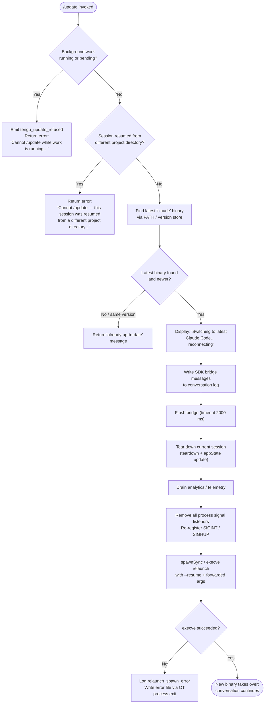

# `/update`

> Analysis basis: CC v2.1.193 bundle.js (AST extraction + Claude interpretation)
> Minimum version: v2.1.193

---

## Overview

`/update` upgrades the running Claude Code CLI to the latest available version without ending the current conversation. It performs safety checks first (blocking if background work is in progress or if the session was resumed from a different project directory), then orchestrates a seamless in-process relaunch via `execve`-style replacement, preserving session state and reconnecting the conversation with the new binary.

---

## Registration

| Field | Value |
|---|---|
| type | `local` |
| name | `update` |
| description | `Switch to the latest version (conversation continues)` |
| supportsNonInteractive | `false` |
| isHidden | `true` |
| module_id | `vjl` |
| load_inline | `true` |
| loc_byte | `12905254` |
| loc_byte_end | `12905495` |
| loc_line | `8827` |
| arbor_handler.name | `$Of` |
| arbor_handler.fqn | `claude-2.1.193::$Of` |
| arbor_handler.kind | `AsyncFunction` |
| arbor_handler.resolution_path | `module_id` |
| arbor_handler.n_hits | `0` |

Analysis basis: CC v2.1.193 bundle.js:+12905254

---

## Input Branching

The handler has more than three distinct decision branches, so a flowchart is used.



Analysis basis: CC v2.1.193 bundle.js:+12903050 – +12904656

---

## Behavioral Spec

### 1 — Guard: Background Work Check

```
function checkNoActiveWork(appState):
    statuses = Object.values(appState.backgroundTasks)
    if any(status == "running" or status == "pending" for status in statuses):
        emit telemetry("tengu_update_refused")
        return Error(
            "Cannot /update while work is running in the background — " +
            "wait for it to finish, then try again."
        )
    return OK
```

Analysis basis: CC v2.1.193 bundle.js:+12903136, +12903411, +12903433, +12903514

### 2 — Guard: Session Directory Consistency

```
function checkSessionDirectoryMatch(currentWorkingDir, sessionOriginDir):
    if currentWorkingDir != sessionOriginDir:
        return Error(
            "Cannot /update — this session was resumed from a different " +
            "project directory. Restart manually with --resume to continue " +
            "on the latest version."
        )
    return OK
```

Analysis basis: CC v2.1.193 bundle.js:+12903758

### 3 — Locate Latest Binary (`resolveUpdateTarget`)

```
function resolveUpdateTarget():
    # Check PATH for the 'claude' executable
    pathBinary = whichBinary("claude")           # calls kf → _ss → Bun.which

    # Locate the version store under ~/.local/share/versions/
    homeDir      = getHomedir()                  # xUn → ECa.homedir
    versionsDir  = path.join(homeDir, ".local", "share", "versions")
    binDir       = path.join(homeDir, ".local", "share", "bin")
    latestBinary = findLatestInVersionStore(versionsDir)

    return { pathBinary, latestBinary, binDir }
```

Analysis basis: CC v2.1.193 bundle.js:+12903050, +12903103, +7179195, +7179457, +7179468, +7179477, +8719593

### 4 — Progress Notification

```
function notifyUser(conversation):
    appendTextMessage(
        conversation,
        "Switching to latest Claude Code… reconnecting"
    )
    # Generates a new UUID for the synthetic message
    messageId = generateUUID()                   # Ijl → m7t.randomUUID
```

Analysis basis: CC v2.1.193 bundle.js:+12904239, +12904243

### 5 — Bridge Flush

```
async function flushBridgeWithTimeout(bridge):
    await Promise.race([
        bridge.flush(),
        timeout(2000, label="bridge flush")
    ])
```

Analysis basis: CC v2.1.193 bundle.js:+12904313, +12904323, +12904328

### 6 — Session Teardown and State Update

```
async function teardownCurrentSession(bridge, appState):
    bridge.teardown()
    newState = Object.assign({}, appState, { updateInProgress: true })
    t.setAppState(newState)
    drainAnalytics()                             # POe → O7e → a7o.drain
    await Promise.race([
        waitForCleanup(),
        timeout(30000, label="cleanup timeout")
    ])
    await Promise.race([
        waitForAnalyticsFlush(),
        timeout(label="analytics flush timeout")
    ])
```

Analysis basis: CC v2.1.193 bundle.js:+12904364, +12904454, +12643099, +12643115, +12643120, +12643126, +12643171, +12643182, +12643227, +12643238

### 7 — Argument Assembly for Relaunch (`buildRelaunchArgs`)

```
function buildRelaunchArgs(originalCliArgs, sessionState):
    args = Array.from(originalCliArgs)

    # Always inject --resume to reconnect to the current session
    args.push("--resume", sessionState.sessionId)      # literal "--resume"

    # Forward any --add-dir values from the original invocation
    for dir in sessionState.additionalDirs:
        args.push("--add-dir", dir)

    # Forward permission-level flags if present
    if originalCliArgs.includes("--allow-dangerously-skip-permissions"):
        args.push("--allow-dangerously-skip-permissions")

    # Forward --effort and --permission-mode if set
    if sessionState.effort:
        args.push("--effort", sessionState.effort)
    if sessionState.permissionMode:
        args.push("--permission-mode", sessionState.permissionMode)

    return args
```

Analysis basis: CC v2.1.193 bundle.js:+12644402, +12643053, +12644549, +12644577, +12644692, +12644834, +12644851

### 8 — Relaunch via execve (`performRelaunch`)

```
async function performRelaunch(targetBinary, args, env):
    # Remove all existing process signal listeners
    process.removeAllListeners()
    process.on("SIGINT",  noopForHandoff)
    process.on("SIGHUP",  noopForHandoff)

    result = child_process.spawnSync(targetBinary, args, {
        stdio:  "inherit",
        env:    buildEnv(env),
    })

    if result indicates exec failure:
        writeErrorFile(errorInfo)                # OT → Lse.writeFileSync
        emit telemetry("relaunch_spawn_error")
        process.exit(128)                        # exit code 128

    # On success the new process has replaced this one; unreachable:
    process.kill(process.pid, ...)
```

Analysis basis: CC v2.1.193 bundle.js:+12643593, +12643612, +12643622, +12643652, +12643679, +12643714, +12643768, +12643901, +12643904, +12643928, +12643993, +12644041

### 9 — Fullscreen / Terminal Teardown (`renderRelaunchScreen`)

```
function renderRelaunchScreen(terminal):
    # Save cursor position (ESC 7) and restore (ESC 8) around relaunch banner
    terminal.writeSync("\x1b7")
    terminal.writeSync("\x1b8")

    # Terminal-specific full-screen handling:
    #   - Ghostty ≥ 1.2.0 and iTerm2 ≥ 3.6.6 use native full-screen
    #   - tmux / tmux-CC (iTerm2 integration) and Windows ConPTY:
    #     full-screen is disabled; CLAUDE_CODE_NO_FLICKER=1 can override
    applyTerminalCompat(terminal)
```

Analysis basis: CC v2.1.193 bundle.js:+3894270, +3894281, +3616189, +3616219, +3616258, +3616290, +3539657, +3548785, +3548971

---

## State & Side Effects

| Item | Detail |
|---|---|
| Telemetry — `tengu_update_refused` | Fired when `/update` is blocked because background tasks are running or pending (bundle.js:+12903150) |
| Telemetry — `tengu_scroll_summary` | Fired during session teardown scroll/summary path (bundle.js:+7374352) |
| Telemetry — `tengu_amber_creek` | Fired in fullscreen-mode detection path (bundle.js:+3549303) |
| Telemetry — `tengu_pewter_brook` | Fired in fullscreen-mode detection path (bundle.js:+3549210) |
| Telemetry — `tengu_bg_dispatch_sigkill_escalate` | Fired if background-task SIGKILL escalation is triggered during teardown (bundle.js:+17482166) |
| Telemetry — `tengu_bg_low_mem_mb` / `tengu_bg_dispatch_low_mem` | Low-memory events observed during process sweep (bundle.js:+13266461, +17482767) |
| Telemetry — `tengu_daemon_idle_exit` | Daemon idle-exit event during teardown (bundle.js:+17504149) |
| Telemetry — `tengu_bg_spare_enable` / `tengu_bg_spare_claim` / `tengu_bg_spare_claim_fail` | Background spare-session lifecycle events during handoff (bundle.js:+17483464, +17483592, +17483858) |
| Telemetry — `tengu_bg_sendclaim_failed` | Background session claim failure (bundle.js:+17458401) |
| Telemetry — `tengu_daemon_control` | Daemon control event (bundle.js:+17520352) |
| Telemetry — `tengu_config_parse_error` | Config parse error during version-store read (bundle.js:+13977384) |
| Telemetry — `tengu_disable_bypass_permissions_mode` | Fired if bypass-permissions mode must be disabled before relaunch (bundle.js:+3405833) |
| Telemetry — `tengu_feature_ok` / `tengu_feature_bad` | Feature-flag check results (bundle.js:+1026754, +1026821) |
| Telemetry — `tengu_daemon_bg_session_create` | Background session creation during teardown flow (bundle.js:+17482482) |
| appState changes | `setAppState` is called with an updated state object reflecting the in-progress update; previous conversation messages are preserved (bundle.js:+12904133, +12904454) |
| SDK message written | A synthetic assistant-role text message (`"Switching to latest Claude Code… reconnecting"`) is written to the conversation via `writeSdkMessages` before the process replaces itself (bundle.js:+12904219, +12904243) |
| Bridge flush | The SDK bridge is flushed with a 2 000 ms timeout before teardown (bundle.js:+12904313, +12904323) |
| Bridge teardown | `bridge.teardown()` is called to close open streams (bundle.js:+12904364) |
| Signal-handler reset | All existing `process` listeners are removed; SIGINT and SIGHUP are re-registered as no-ops for the handoff window (bundle.js:+12643622, +12643652) |
| Analytics drain | `a7o.drain()` is awaited to flush analytics before exec (bundle.js:+68083) |
| Error file | On exec failure, an error record is written synchronously via `Lse.writeFileSync` before `process.exit(128)` (bundle.js:+201267, +12643901) |
| Sound | <!-- TODO: not found in depth-2 traversal; needs --depth 4 --> |
| Hook registration | `a7o.register` is called during the session lifecycle path (bundle.js:+68040) |

---

## Version History

| Version | Change |
|---|---|
| v2.1.193 | Initial analysis |

---

## Common Mistakes

1. **Invoking `/update` while a background task is running.** The command will refuse with a clear error message and emit `tengu_update_refused`. Wait for all background tasks to complete before retrying.

2. **Expecting `/update` to work in a cross-directory resumed session.** If the current session was resumed (`--resume`) from a directory different from the one the session was originally created in, `/update` will refuse with a message directing the user to restart manually using `--resume`.

3. **Assuming the command is discoverable via `/help`.** The registration sets `isHidden: true`, so `/update` does not appear in the standard command list. It must be typed explicitly.

4. **Expecting non-interactive use.** `supportsNonInteractive: false` means the command is only valid in a live interactive session; scripted invocations will not be handled.

5. **Interrupting the 2-second bridge flush.** Sending SIGINT during the flush window will be suppressed (signal handlers are reset), so the process should be allowed to complete the handoff naturally.

6. **Misreading the `--resume` argument in the relaunched process.** The relaunch always injects `--resume <sessionId>`, so the new binary picks up the existing conversation. Passing a conflicting `--resume` via environment or wrapper scripts may cause the session lookup to fail.

---

## Appendix — Identifier Mapping

> For bundle debugging only. Identifiers change across versions.

| Identifier | Role |
|---|---|
| `$Of` | Main async handler for `/update` (arbor_handler; AsyncFunction) |
| `Ntr` | Check-for-update / resolve latest binary version entry point |
| `kf` | Locate `claude` binary on PATH (wraps `_ss`) |
| `_ss` | Thin wrapper around `Bun.which` for executable discovery |
| `UF` | Resolve binary path from version store directory |
| `B6n` | Build path to versioned binary directory |
| `Om` | Array/path normalisation helper (calls `Array.isArray`) |
| `xne` | Resolve `~/.local/share` path (home-dir join helper) |
| `xUn` | Retrieve OS home directory via `ECa.homedir` |
| `Xce` | Resolve `~/.local/share/bin` path |
| `Ks` | Check/read current process role (bg/daemon/daemon-worker) |
| `mve` | Return process-role string constant |
| `V` | Generic logging / verbose output helper |
| `IS` | Session identity / basename resolution helper |
| `Lt` | Internal logger (calls `Rx`) |
| `Rx` | Low-level log sink |
| `sk` | Retrieve app config / settings object |
| `cNo` | Write or update daemon status file (`a9l.dirname`) |
| `mr` | Internal logger variant (calls `Rx`) |
| `Sc` | Internal logger variant (calls `Rx`) |
| `Wpe` | Check whether conversation has a working-directory mismatch |
| `Coe` | Validate session attachment / hook type (checks `H9f.has`) |
| `Rrr` | Retrieve registered hook set |
| `h7t` | Append "last-prompt" entry to conversation log |
| `Kc` | Conversation entry / progress record constructor |
| `Ei` | Register entry with event bus (`a7o.register`) |
| `xe` | Error formatting / network-layer call helper |
| `eo` | Construct structured error object |
| `at` | Stringify value for error messages |
| `Bi` | Build error detail record |
| `Rds` | Collect error context (calls `at`) |
| `e_u` | Manage rolling error log queue (shift/push) |
| `_f` | Retrieve async-local store value |
| `zx` | Read from `X1r` async local storage |
| `Zy` | Utility: merge / update conversation state object |
| `l` | SDK message bridge (provides `writeSdkMessages`, `flush`, `teardown`) |
| `C8l` | Write messages to bridge with timestamp |
| `iee` | Format SDK message payload |
| `Yge` | Trim and normalise message text |
| `qs` | Retrieve session store reference |
| `v7t` | Construct daemon status file path (`daemon.status.json`) |
| `ke` | JSON stringify helper |
| `Ijl` | Generate random UUID for synthetic message |
| `Yc` | Promise timeout race helper |
| `mwe` | Feature-flag enabled check (`tHi.isEnabled`) |
| `exe` | Convert value to string (String coercion) |
| `POe` | Perform full relaunch: teardown, signal reset, spawnSync, execve |
| `m9t` | Cancel interval timers before relaunch |
| `uuo` | Wrapper around `clearInterval` |
| `F6e` | Terminal / Ink UI unmount and cursor restore |
| `q$` | UI cleanup helper |
| `pLn` | Write terminal output with cursor-save/restore sequences |
| `$3e` | Terminal compatibility detection (Ghostty, iTerm2) |
| `M3e` | Render relaunch banner text |
| `IL` | Apply multiplexer escape-sequence escaping (tmux / screen) |
| `Kd` | Terminal stream reference |
| `T` | Rich terminal text renderer / chalk-style formatter |
| `K$n` | Orchestrate scroll-summary and animation during relaunch |
| `Yw` | Animation frame helper |
| `MLa` | Scroll-summary layout helper |
| `kLa` | Compute animation timing (Date.now, Math.max, Math.round) |
| `xLa` | Animation step callback |
| `Ds` | Full-screen rendering manager |
| `cB` | Check agent-type set membership |
| `cM` | Feature-flag gate for local-agent |
| `NWr` | Assemble full-screen display string |
| `Zee` | Render inner display region |
| `OWr` | Build display frame with OS-specific handling |
| `kr` | Display write helper (`dW`) |
| `aId` | Render sub-component (calls `it`) |
| `it` | React/Ink render call with state checks |
| `JC` | Wait for conversation flush with timeout |
| `O7e` | Drain analytics queue (`a7o.drain`) |
| `G6e` | Resolve relaunch readiness promise |
| `j$n` | Relaunch readiness signal |
| `n9l` | Construct and execute `execve` call with FFI |
| `f` | Background daemon session manager (spawn, claim, state loop) |
| `D` | Daemon worker subprocess wrapper |
| `Un` | Promise-based timeout with abort support |
| `Re` | Log event with "ok" tag |
| `we` | Log event with "ok" variant |
| `Knr` | Low-memory check for background sessions |
| `I9e` | Read and validate config file (lstat, readFile, rm) |
| `O` | Daemon idle-exit timer manager |
| `cVo` | Claim background session via socket |
| `gVo` | Manage background session lifecycle and state file |
| `p` | Forced shutdown helper (calls `process.exit`) |
| `an` | Generic async helper / awaiter |
| `Oe` | Wrap/unwrap Zod-style error |
| `B` | Disposable resource handle |
| `c` | Spawn background session subprocess |
| `yn` | Background session spawn parameters |
| `a` | `execve` wrapper: builds env, calls `l6e` / `Bcr` / `mSa` |
| `l6e` | Build MCP / tool environment for re-exec |
| `Bcr` | Apply MCP update to new process environment |
| `mSa` | Collect MCP stdio configs |
| `VWo` | Enumerate and update MCP connections before relaunch |
| `u` | Re-exec entry point: stops background sessions, calls `n9l` |
| `R$` | Build first-party flag list for re-exec |
| `Hj` | Await graceful stop of all background daemon sessions |
| `be` | String coercion helper |
| `OT` | Write error file on exec failure (`Lse.writeFileSync`) |
| `rtr` | Assemble final CLI argument list for relaunch |
| `xNe` | Retrieve current session ID from state |
| `Owe` | Filter boolean-valued entries (Boolean coercion) |
| `kt` | Update manager: find latest version, copy binary if needed |
| `jt` | Version comparison utility |
| `a9o` | Version string parser |
| `bSt` | Copy versioned binary to target directory |
| `xjf` | Watch / detect binary file modification |
| `Ur` | Reconstruct CLI flags from app state for `--resume` args |
| `F7n` | Map `working_directory` / `allowed_tools` state to args |
| `es` | State field accessor |
| `B7n` | Map `disallowed_tools` / `avoid_prompts` state to args |
| `F$` | Map `permission_mode` / `bypassPermissions` to args |
| `Zm` | Read current app state for session context |