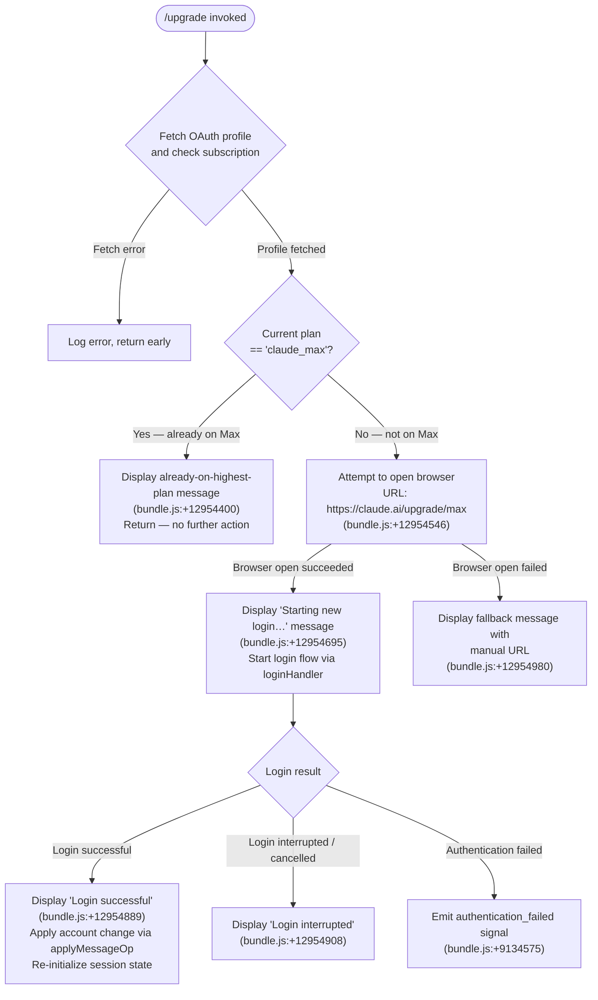

# `/upgrade`

> Analysis basis: CC v2.1.193 bundle.js (AST extraction + Claude interpretation)
> Minimum version: v2.1.193

---

## Overview

The `/upgrade` command guides the user toward upgrading their Claude.ai subscription to the Max plan in order to access higher rate limits and additional Opus model usage. It inspects the current account's subscription tier, and — depending on whether the user is already on the highest Max plan — either displays a terminal message and opens the upgrade URL in the system browser, or initiates a fresh login flow so the new subscription can be recognized.

---

## Registration

| Field | Value |
|---|---|
| type | `local-jsx` |
| name | `upgrade` |
| description | `Upgrade to Max for higher rate limits and more Opus` |
| loc_byte | `12955187` |
| loc_byte_end | `12955434` |
| loc_line | `8833` |
| module_id | `DUo` |
| load_inline | `true` |
| arbor_handler.name | `A7t` |
| arbor_handler.fqn | `claude-2.1.193::A7t` |
| arbor_handler.kind | `AsyncFunction` |
| arbor_handler.resolution_path | `module_id` |
| arbor_handler.n_hits | `0` |

Analysis basis: CC v2.1.193 bundle.js:+12955187

---

## Input Branching

The command has four or more distinct execution paths depending on subscription state, browser-open success, and login outcome, so a Mermaid flowchart is used.



---

## Behavioral Spec

### Top-Level Handler (`A7t`)

The handler is an `AsyncFunction` resolved via `module_id` → `DUo`.

Analysis basis: CC v2.1.193 bundle.js:+12954069

```
async function upgradeCommandHandler(context):

    # Step 1: Check existing subscription
    profile = await fetchOAuthProfile(context)   # ZCe — bundle.js:+12954241
    if profile fetch failed:
        return early

    currentPlan = profile.plan  # literal "max" at bundle.js:+12954155

    # Step 2: Already on highest plan?
    if currentPlan == "claude_max":   # literal at bundle.js:+12954299
        display("You are already on the highest Max subscription plan. "
                "For additional usage, run /login to switch to an API "
                "usage-billed account.")   # bundle.js:+12954400
        return

    # Step 3: Open upgrade page
    opened = await openBrowser("https://claude.ai/upgrade/max")  # bundle.js:+12954546
    # openBrowser delegates to gc → _Hi → platform-specific open (bundle.js:+12954543)

    if not opened:
        display("Failed to open browser. Please visit "
                "https://claude.ai/upgrade/max to upgrade.")  # bundle.js:+12954980
        return

    # Step 4: Trigger login flow after opening browser
    display("Starting new login following /upgrade. "
            "Exit with Ctrl-C to use existing account.")   # bundle.js:+12954695

    loginResult = await runLoginFlow(context)   # Rc → Dy + kt, bundle.js:+12954585

    # Step 5: Handle login outcome
    if loginResult == "Login successful":    # bundle.js:+12954889
        applyAccountChange(context)          # YMe.applyMessageOp — bundle.js:+9133114
        reinitializeSession(context)         # YMe chain — bundle.js:+12954808

    elif loginResult == "Login interrupted":  # bundle.js:+12954908
        display("Login interrupted")

    elif authenticationFailed:               # bundle.js:+9134575
        emitAuthenticationFailedSignal()

    setTimeout(cleanup, ...)                 # bundle.js:+12954385
```

### OAuth Profile Fetch (`ZCe`)

Analysis basis: CC v2.1.193 bundle.js:+2145661

```
async function fetchOAuthProfile(context):
    url = resolveOAuthEndpoint()    # Rs — bundle.js:+2145661
    headers = {"Content-Type": "application/json"}   # bundle.js:+2145762/2145777
    response = await httpGet(url, timeout=10000)     # bundle.js:+2145805

    on success:
        emit telemetry "oauth_profile_fetch"    # bundle.js:+2145821
        return response.data

    on token error:
        emit telemetry "oauth_profile_token_failed"  # bundle.js:+2145888
        log error
        return null
```

### URL / OAuth Endpoint Resolution (`Rs`)

Analysis basis: CC v2.1.193 bundle.js:+865030

```
function resolveOAuthEndpoint(env):
    env = readEnvVariable("CLAUDE_CODE_CUSTOM_OAUTH_URL") or detect from config

    switch env:
        "prod"    → production Anthropic endpoint
        "local"   → "http://localhost:8000"   # bundle.js:+864105
        "staging" → "http://localhost:4000"   # bundle.js:+864192
        default   → "http://localhost:3000"   # bundle.js:+864282

    if custom URL provided:
        if not in approved list:
            throw Error("CLAUDE_CODE_CUSTOM_OAUTH_URL is not an approved endpoint.")
                  # bundle.js:+865226
        return customUrl + "/v1/toolbox/shttp/mcp/{server_id}"  # bundle.js:+864960
```

### Browser Open (`gc` / `_Hi`)

Analysis basis: CC v2.1.193 bundle.js:+3126457 / +3126470

```
async function openBrowser(url):
    validateUrl(url)    # kgd — bundle.js:+3125283
    # accepts only "http:" (bundle.js:+3125333) and "https:" (bundle.js:+3125355)

    if platform == "darwin":    # bundle.js:+3126587
        spawn("open", [url])    # bundle.js:+3126606

    else:
        use platform-appropriate open mechanism (Pn/Vr subgraph — bundle.js:+3126628)

    return success boolean
```

### Login Flow (`Rc`)

Analysis basis: CC v2.1.193 bundle.js:+3085444

```
async function runLoginFlow(context):
    # Delegates to Dy (session/message dispatch) and kt (telemetry recorder)
    # Dy — bundle.js:+3085444; kt — bundle.js:+3085449

    sessionState = await dispatchLoginSession(context)   # Dy subgraph
    recordTelemetry(sessionState)                        # kt — bundle.js:+13972214

    return sessionState.outcome   # "Login successful" | "Login interrupted"
```

### Account Change Application (`YMe`)

Analysis basis: CC v2.1.193 bundle.js:+9133095

```
function applyAccountChange(context, loginResult):
    context.onChangeAPIKey(newKey)          # bundle.js:+9133095
    context.applyMessageOp({type:"update"}) # bundle.js:+9133114 / literal "update" at +9133137

    refreshRemoteSettings(context)          # z6e subgraph — bundle.js:+9133264
    refreshPolicyLimits(context)            # fjt subgraph — bundle.js:+9133520
    refreshFeatureFlags(context)            # uCn subgraph — bundle.js:+9129465

    if account changed from previous:
        disconnectRemoteBridgeSession()
        # log: "[bridge:repl] Account changed via /login — disconnecting Remote Control session"
        #      bundle.js:+9133820

    if trustedDeviceEnrollmentNeeded:
        enrollTrustedDevice(context)        # r9t subgraph — bundle.js:+9134194

    execRelaunch()                          # f.execRelaunch — bundle.js:+9133370
```

### Max Plan Guard (inline within `A7t`)

Analysis basis: CC v2.1.193 bundle.js:+12954155 / +12954180

```
function isAlreadyOnHighestMaxPlan(profile):
    # Checks profile.plan against known max-tier identifiers
    # Literals: "max" (bundle.js:+12954155), "default_claude_max_20x" (bundle.js:+12954180)
    return profile.plan in {"max", "default_claude_max_20x", "claude_max"}
```

---

## State & Side Effects

| Item | Detail |
|---|---|
| Telemetry — feature evaluation | `tengu_feature_ok` (bundle.js:+1026754), `tengu_feature_sad` (bundle.js:+1026902), `tengu_feature_bad` (bundle.js:+1026821) |
| Telemetry — OAuth profile | `oauth_profile_fetch` (bundle.js:+2145821), `oauth_profile_token_failed` (bundle.js:+2145888) |
| Telemetry — remote managed settings | `tengu_managed_settings_security_dialog_shown` (+7406259), `tengu_managed_settings_security_dialog_accepted` (+7406596), `tengu_managed_settings_security_dialog_rejected` (+7406755) |
| Telemetry — policy limits | `tengu_policy_limits_fetch` (bundle.js:+13952485) |
| Telemetry — auto-mode | `tengu_auto_mode_config` (bundle.js:+13832039) |
| Telemetry — daemon / background | `tengu_bg_dispatch_sigkill_escalate`, `tengu_daemon_config_reload`, `tengu_bg_low_mem_mb`, `tengu_bg_dispatch_low_mem`, `tengu_daemon_idle_exit`, `tengu_bg_spare_enable`, `tengu_bg_sendclaim_failed`, `tengu_bg_state_read_transient`, `tengu_bg_spare_claim`, `tengu_bg_spare_claim_fail` |
| Telemetry — permissions | `tengu_disable_bypass_permissions_mode` (bundle.js:+13834248) |
| Browser side effect | Opens `https://claude.ai/upgrade/max` via system browser (macOS: `open`; other platforms: platform-specific mechanism). Analysis basis: CC v2.1.193 bundle.js:+12954546 |
| appState changes | `applyMessageOp` with `type:"update"` is called upon successful login; `execRelaunch` may restart the CLI process. bundle.js:+9133114, +9133370 |
| Remote Control session | Disconnected if account identity changes post-login. bundle.js:+9133820 |
| Trusted device enrollment | Re-enrollment may be skipped if same account re-logs in with an existing token. bundle.js:+9134087 |
| setTimeout usage | Cleanup / delay registered at bundle.js:+12954385 |
| Environment variables read | `ANTHROPIC_API_KEY`, `CLAUDE_CODE_OAUTH_TOKEN_FILE_DESCRIPTOR`, `CLAUDE_CODE_API_KEY_FILE_DESCRIPTOR`, `CLAUDE_CODE_CUSTOM_OAUTH_URL` |
| Required auth env (error message) | `ANTHROPIC_API_KEY, ANTHROPIC_AUTH_TOKEN, CLAUDE_CODE_OAUTH_TOKEN, or WIF env vars (ANTHROPIC_FEDERATION_RULE_ID + ANTHROPIC_ORGANIZATION_ID) required` — bundle.js:+3066114 |

---

## Version History

| Version | Change |
|---|---|
| v2.1.193 | Initial analysis |

---

## Common Mistakes

1. **Running `/upgrade` when already on the Max plan.** The command exits immediately with an informational message directing the user to `/login` instead of upgrading. The check compares against plan identifiers `"max"`, `"claude_max"`, and `"default_claude_max_20x"` (bundle.js:+12954155, +12954180, +12954299).
2. **Interrupting the login flow with Ctrl-C after the browser opens.** The command explicitly warns that Ctrl-C exits the login step (bundle.js:+12954695). The existing account remains active, but the new subscription will not be recognized until a full `/login` cycle completes.
3. **Browser failing to open on non-macOS headless environments.** If the system cannot open a browser, a fallback message is printed but no automatic retry is performed. The user must visit `https://claude.ai/upgrade/max` manually (bundle.js:+12954980).
4. **Expecting instant rate-limit changes.** The command triggers a login flow and applies the new account state; however, remote settings, policy limits, and feature flags are all re-fetched asynchronously. Changes may not take effect until the session is fully re-initialized or restarted.
5. **Using a custom OAuth endpoint without approval.** If `CLAUDE_CODE_CUSTOM_OAUTH_URL` is set to a non-approved URL, an error is thrown before the upgrade flow begins (bundle.js:+865226).

---

## Appendix — Identifier Mapping

> For bundle debugging only. Identifiers change across versions.

| Identifier | Role |
|---|---|
| `A7t` | Top-level `/upgrade` async command handler |
| `So` | Session-state reader / subscription checker called from handler |
| `Dy` | Login session dispatcher |
| `cd` | Argument parser / command-line flag processor |
| `at` | String coercion / argument normalisation utility |
| `Ctn` | `--bare` flag handler for argument parsing |
| `UA` | Auth-profile loader; reads OAuth token and maps to provider type |
| `Ohn` | Platform credential helper lookup |
| `ant` | API-key resolution helper |
| `yW` | OAuth token file-descriptor reader |
| `IR` | Flag-settings reader from config |
| `wB` | Array membership / inclusion check utility |
| `Ql` | Provider-type classifier (bedrock, foundry, vertex, …) |
| `_r` | Provider-string normalisation |
| `MT` | Message transport layer |
| `aH` | Auth-state constructor; validates environment variables |
| `WDt` | API-key helper executor |
| `w7e` | VS Code client-type detector (`claude-vscode`) |
| `Y0t` | File-descriptor token reader for OAuth |
| `kt` | Telemetry event recorder (uses `Date.now`, `jt`, `Gx`) |
| `l$` | Credential slice / truncation utility |
| `KDt` | Key-helper bridge invoker |
| `ZCe` | OAuth profile fetcher (HTTP GET, 10 000 ms timeout) |
| `Rs` | OAuth endpoint URL resolver |
| `mss` | Environment-name constant set (`prod`, `local`, `staging`) |
| `leu` | Approved custom-OAuth URL allowlist |
| `we` | HTTP GET wrapper (uses `V`, `Oe`) |
| `Oe` | Axios error classifier |
| `Zze` | Axios error base class / factory |
| `vt` | HTTP response validator |
| `p_` | Profile response extractor |
| `T` | Telemetry event emitter / logger |
| `qFc` | Telemetry routing (to `YO`, `Qgr`, `c7o`) |
| `c7o` | Telemetry transport writer |
| `ke` | JSON serialiser for telemetry payloads |
| `Lc` | Log-line formatter with redaction |
| `KXo` | Log field mapper |
| `iYe` | Terminal output writer |
| `OXo` | Raw terminal write wrapper |
| `XFc` | Log-file appender / rotator |
| `P7e` | Batched write scheduler (uses `setTimeout`, `setImmediate`) |
| `Ame` | Log assembly and join utility |
| `Cse` | Log directory resolver |
| `XXo` | Log file path builder |
| `nhr` | Log rotation / rename handler |
| `YFc` | Log file append-and-rotate executor |
| `Ei` | Signal / hook registration (uses `a7o.register`) |
| `xe` | Error logger with structured context |
| `eo` | Error normalisation (String coercion) |
| `Bi` | Credential reader from storage |
| `Rds` | Secure storage read wrapper |
| `e_u` | Credential queue / ring-buffer manager |
| `gc` | Browser-open coordinator (validates URL, dispatches to `_Hi`) |
| `kgd` | URL scheme validator (allows `http:` / `https:`) |
| `_Hi` | Platform-specific browser launcher |
| `Xh` | URL encoding / sanitisation for browser open |
| `Pn` | Cross-platform process spawner |
| `Vr` | Spawn options builder |
| `Pt` | Child-process reference holder |
| `Rc` | Login-flow runner (delegates to `Dy` + `kt`) |
| `YMe` | Account-change applier; calls `onChangeAPIKey`, `applyMessageOp`, `execRelaunch` |
| `I7e` | Timestamp generator (`Date.now`) |
| `z6e` | Remote managed settings refresher |
| `Zxa` | Remote settings event emitter |
| `T9t` | Remote settings loader |
| `phs` | Remote settings HTTP fetcher |
| `vX` | Remote settings state machine |
| `tge` | Settings change detector / differ |
| `uie` | Settings cache writer |
| `ONe` | Settings merge utility |
| `d_` | Settings serialiser |
| `_u` | Settings hash helper |
| `yS` | Session-validity checker for remote settings |
| `JDt` | Settings staleness evaluator |
| `pFn` | Settings change notification emitter (`IP.notifyChange`) |
| `fhs` | Settings notification payload builder |
| `Ouo` | Remote settings background poller |
| `zxa` | Poll scheduler |
| `Bxa` | Poll backoff calculator |
| `$uo` | Remote managed settings fetch-and-apply core |
| `nge` | ETag / cache-control header builder |
| `axa` | Settings hash calculator (`sha256`) |
| `myp` | Settings response parser |
| `Re` | HTTP response wrapper |
| `UJe` | Rate-limit / policy header reader |
| `Ve` | Axios instance factory |
| `qxa` | Remote settings error classifier |
| `Gxa` | Security-dialog presenter for remote settings |
| `jxa` | Settings approval handler |
| `Kxa` | Settings file writer (atomic write via `datasync`) |
| `Jxa` | Settings revert helper |
| `Qxa` | Remote settings initialiser |
| `SCn` | Interval-based poll timer (`setInterval` / `clearInterval`) |
| `hyp` | Auth-change triggered settings refresh |
| `Vjn` | Deep-equality check for account identity |
| `Lfr` | Previous account snapshot holder |
| `_n` | Session metadata reader |
| `sun` | Session storage reader |
| `yB` | Session record parser |
| `f` | Daemon / background session manager |
| `D` | Background process controller |
| `NMc` | Process binary real-path resolver |
| `Kd` | Process environment builder |
| `RHm` | Daemon state serialiser |
| `d` | Background process IPC writer |
| `Un` | Subprocess launcher with timeout |
| `o` | Process argument formatter |
| `c` | Process exit handler |
| `s` | Promise-set tracker |
| `Knr` | Memory-pressure monitor |
| `it` | Feature-flag evaluator |
| `I9e` | Pinned-file reader / cleaner |
| `RNt` | Pins manifest path builder |
| `Bt` | JSON safe-parser |
| `In` | Error-annotator (adds `errno`) |
| `vUd` | Directory pin scanner |
| `O` | Daemon idle-exit watchdog |
| `F` | Watchdog timer holder |
| `cVo` | Daemon claim-send IPC client |
| `w9o` | Daemon state-file writer |
| `tHm` | Claim-send timeout handler |
| `eHm` | Claim frame builder |
| `qd` | IPC socket path resolver |
| `be` | IPC address stringifier |
| `i` | IPC socket wrapper |
| `uk` | Binary frame encoder (UInt32BE / UInt8 headers) |
| `gVo` | Background session lifecycle manager |
| `hc` | Session directory path builder |
| `Gi` | Session file watcher / state reader |
| `Lh` | Session activity recorder |
| `an` | File system error annotator |
| `QLe` | Session allow-list filter |
| `$d` | Session metadata writer |
| `W_t` | Session health probe |
| `xKt` | Session lock-file path builder |
| `XSe` | Session roster-entry writer |
| `fk` | Session error-state recorder |
| `M0` | Session state-file updater |
| `nD` | Session late-error recorder |
| `ZJ` | Session split-identifier resolver |
| `LKt` | Session lock-file writer |
| `p` | Forced-shutdown handler (`process.exit`) |
| `B` | Daemon disposal handle |
| `zjn` | Full session-reset orchestrator |
| `zen` | Session reset initialiser |
| `Lee` | App-level state clearer |
| `EYa` | BEo cache clearer |
| `Eae` | Editor-state resetter |
| `pwe` | Pager-state resetter |
| `_Ya` | History clearer |
| `jEo` | Diff-state clearer |
| `uCn` | Feature-flag refresh coordinator |
| `H5` | Feature-flag store accessor |
| `SLi` | Feature-flag payload applicator |
| `ALi` | Feature-flag map builder |
| `f9` | Global-config reload orchestrator |
| `SYa` | Config-file reader |
| `cz` | Config-key validator |
| `Xmt` | Config-diff calculator |
| `oGp` | Config diff entry (old values) |
| `rGp` | Config diff entry (removed keys) |
| `nGp` | Config diff entry (new/changed keys) |
| `eGp` | Config diff entry (equal keys) |
| `oC` | Subscriber notification dispatcher |
| `_Tt` | Subscriber set holder |
| `OCn` | Config change event emitter |
| `l_s` | CA-cert cache clearer |
| `f_s` | mTLS config cache clearer |
| `GRr` | Proxy-agent cache clearer |
| `l0t` | Network stack re-initialiser |
| `i$` | Network stack instance holder |
| `BPs` | HTTP-client rebuilder |
| `Bz` | Proxy URL parser |
| `fjt` | Policy-limits refresher |
| `K3o` | Policy-limits loader |
| `Y3o` | Policy-limits cache reader |
| `eHe` | Policy-limits stale-check helper |
| `Bor` | Policy-limits timeout guard |
| `D$` | Policy-limits HTTP fetcher |
| `kwe` | Policy-limits cache path builder |
| `jor` | Policy-limits fetch orchestrator |
| `PZl` | Policy-limits fetch-and-apply core |
| `OZl` | Policy-limits background poller |
| `gwe` | App-state snapshot taker |
| `$ae` | Feature-flag teardown / cleanup |
| `Qnt` | Feature-flag store clearer |
| `FGr` | Process-exit listener remover |
| `j1t` | Notification dispatcher post-login |
| `Bco` | Conversation-history reader |
| `lo` | Ink / React render root |
| `KZt` | Render context binder |
| `oke` | Feature-flag gate checker for render |
| `Zl` | Conversation-store accessor |
| `hXs` | Conversation CRUD handler |
| `r9t` | Trusted-device enrollment orchestrator |
| `k$` | Feature-flag evaluator for trusted device |
| `KPt` | Feature-flag known-keys set |
| `zPt` | Feature-flag default-value map |
| `lCn` | Feature-flag cached-value reader |
| `TLi` | Feature-flag value getter with ZW cache |
| `i_p` | Trusted-device skip-check helper (env var) |
| `Oco` | Trusted-device Xc-context builder |
| `Tln` | Trusted-device server URL builder |
| `bYa` | Post-login state snapshot differ |
| `cjt` | Auto-mode gate checker post-login |
| `Yjn` | Auto-mode feature-flag reader |
| `$Gr` | Auto-mode flag evaluator |
| `S9t` | Auto-mode gate-denial handler |
| `_H` | Permission-mode applicator |
| `Ur` | Session-config override applier |
| `F7n` | Working-directory override handler |
| `es` | Directory change applicator |
| `B7n` | Tool allow/deny-list override handler |
| `F$` | Permission-mode override handler |
| `qEo` | Post-login notification emitter |
| `ujt` | Agent re-initialiser post-login |
| `djt` | Full agent reconfiguration orchestrator |
| `L7` | Conversation-context builder |
| `_3o` | Agent tool-list rebuilder |
| `H3o` | Agent capability gate checker |
| `As` | React component renderer for agent UI |
| `Dhe` | Model compatibility checker |
| `$Pe` | Bypass-permissions gate |
| `nnt` | Tool-name normaliser |
| `vQ` | Agent state-machine driver |
| `X2` | Agent config validator |
| `JHe` | Permission-mode change event emitter |
| `qAe` | Tool-config diff applicator |
| `Zmt` | Last-assistant-message finder |
| `nw` | Message array `findLast` helper |