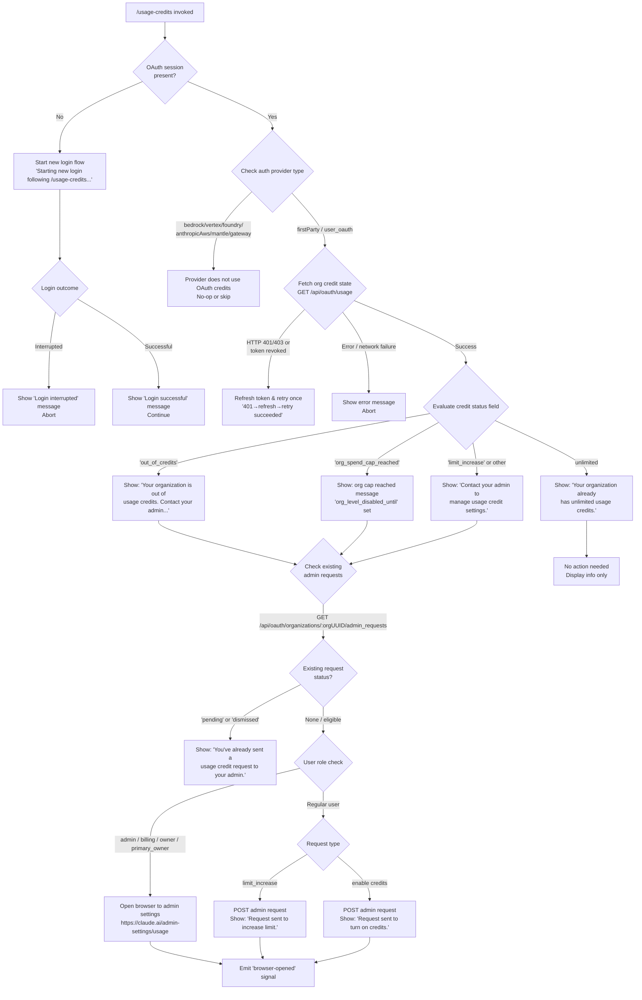

# `/usage-credits`

> Analysis basis: CC v2.1.193 bundle.js (AST extraction + Claude interpretation)
> Minimum version: v2.1.193

---

## Overview

`/usage-credits` is an interactive slash command that helps users who have hit an API usage limit continue working by guiding them through the process of requesting additional usage credits or configuring access. It detects the user's current organizational credit state, determines what action is possible (e.g., request a limit increase, enable credits, or open the admin settings portal), and either sends a request to the admin or opens a browser to the appropriate URL. When no valid OAuth session is present, the command initiates a new login flow before proceeding.

---

## Registration

| Field | Value |
|---|---|
| type | `local-jsx` |
| name | `usage-credits` |
| description | `Configure usage credits to keep working when you hit a limit` |
| loc_byte | `9180836` |
| loc_byte_end | `9181046` |
| loc_line | `3566` |
| module_id | `nSo` |
| load_inline | `true` |
| arbor_handler.name | `Hjt` |
| arbor_handler.fqn | `claude-2.1.193::Hjt` |
| arbor_handler.kind | `AsyncFunction` |
| arbor_handler.resolution_path | `module_id` |
| arbor_handler.n_hits | `0` |

Analysis basis: CC v2.1.193 bundle.js:+9180836

---

## Input Branching

The command has more than three distinct branches based on the current auth and credit state detected at runtime:



Analysis basis: CC v2.1.193 bundle.js:+9138340, +9138385, +9138467, +9138550, +9138728, +9138823, +9138887, +9139053, +9139063, +9139122, +9139361, +9139427, +9139728, +9139769, +9179473

---

## Behavioral Spec

### Handler Entry Point

The primary async handler (`Hjt`) is resolved via `module_id` (`nSo`). It is an `AsyncFunction` that orchestrates all sub-steps described below.

Analysis basis: CC v2.1.193 bundle.js:+9179045

### Step 1 — Auth & Provider Gating

```
async function usageCreditsHandler(context):
    authState = getCurrentAuthState()

    if authState.provider in ["bedrock", "vertex", "foundry", "anthropicAws", "mantle", "gateway"]:
        // Third-party/enterprise providers do not use Anthropic credit billing
        return noOp()

    if not authState.hasOAuthToken:
        displayMessage("Starting new login following /usage-credits. Exit with Ctrl-C to use existing account.")
        result = await startLoginFlow()
        if result == "interrupted":
            displayMessage("Login interrupted")
            return
        displayMessage("Login successful")
        authState = getCurrentAuthState()  // re-read after login
```

Analysis basis: CC v2.1.193 bundle.js:+9179129, +9179151, +9179473, +9179673, +9179692

### Step 2 — Fetch Usage State

```
async function fetchUsageState(authContext):
    // Uses Axios-based HTTP client; endpoint: GET /api/oauth/usage
    // Request timeout: 5000 ms
    // Content-Type: application/json
    // Auth mode: OAuth bearer (not "no-auth")
    try:
        response = await httpGet("/api/oauth/usage", {timeout: 5000})
        return response.data
    catch error:
        if isAxiosError(error) and error.status in [401, 403]:
            if error.message contains "OAuth token has been revoked":
                throw AuthError("token_revoked")
            // Attempt token refresh then retry once
            refreshedToken = await refreshOAuthToken()
            response = await httpGet("/api/oauth/usage", {token: refreshedToken})
            logInfo("401→refresh→retry succeeded")
            return response.data
        throw error
```

Analysis basis: CC v2.1.193 bundle.js:+5258549, +5258577, +5258591, +5258606, +5258691, +5258792, +3103322, +3103350, +3103416

### Step 3 — Evaluate Credit Status

```
function evaluateCreditStatus(usageData):
    statusField = usageData.status  // or equivalent top-level discriminator

    switch statusField:
        case "out_of_credits":
            return {
                message: "Your organization is out of usage credits. Contact your admin to add more.",
                action: "request_credits"
            }
        case "org_spend_cap_reached":
            return {
                message: "Your organization's usage credit cap is reached for this period. Contact your admin to raise it.",
                disabledUntil: usageData["org_level_disabled_until"],
                action: "request_limit_increase"
            }
        case "unlimited":
            return {
                message: "Your organization already has unlimited usage credits. No request needed.",
                action: "none"
            }
        default:  // includes "limit_increase" and others
            return {
                message: "Contact your admin to manage usage credit settings.",
                action: "limit_increase"
            }
```

Analysis basis: CC v2.1.193 bundle.js:+9138340, +9138385, +9138467, +9138498, +9138550, +9138728, +9138823, +9138887

### Step 4 — Check Admin Request Eligibility

```
async function checkAdminRequestEligibility(orgUUID, authToken):
    // GET /api/oauth/organizations/:orgUUID/admin_requests
    // Fetches existing admin request list
    response = await httpGet(
        "/api/oauth/organizations/" + orgUUID + "/admin_requests",
        {params: {statuses: "pending,dismissed"}}
    )
    existingRequests = response.data

    if any request in existingRequests has status in ["pending", "dismissed"]:
        return {eligible: false, reason: "already_requested"}

    return {eligible: true}
```

Analysis basis: CC v2.1.193 bundle.js:+9136896, +9136999, +9137025, +9139053, +9139063, +9139122

### Step 5 — Eligibility Check (Admin Role Gate)

```
async function checkRequestEligibility(userContext):
    // GET /api/oauth/... → api_admin_request_eligibility
    if userContext.role in ["admin", "billing", "owner", "primary_owner"]:
        // Admin users skip the request flow and go directly to browser
        openBrowser(ADMIN_SETTINGS_URL)
        emitSignal("browser-opened")
        return
    // Regular users: proceed with POST request
```

Analysis basis: CC v2.1.193 bundle.js:+9137247, +9137395, +2144352, +2144360, +2144370, +2144378, +9139728

### Step 6 — Send Admin Request or Open Browser

```
async function sendAdminRequestOrOpenBrowser(action, orgUUID, authToken):
    if userIsAdmin:
        url = "https://claude.ai/admin-settings/usage"
        openBrowser(url)
        emitSignal("browser-opened")
        return

    // POST /api/oauth/organizations/:orgUUID/admin_requests
    payload = {type: action}  // e.g. "limit_increase"
    try:
        response = await httpPost(
            "/api/oauth/organizations/" + orgUUID + "/admin_requests",
            payload
        )
        if action == "limit_increase":
            displayMessage("Request sent to your admin to increase your usage credit limit.")
        else:
            displayMessage("Request sent to your admin to turn on usage credits.")
        emitSignal("browser-opened")
    catch error:
        if error.status >= 500:
            displayErrorMessage(error.detail)
        else:
            displayErrorMessage(error)
```

Analysis basis: CC v2.1.193 bundle.js:+9136631, +9136680, +9136688, +9137652, +9137858, +9139275, +9139361, +9139427, +9139508, +9139769, +9139836

### Step 7 — JSX Rendering (local-jsx type)

The command renders its output as a JSX component (type: `local-jsx`). The handler (`Hjt`) calls a JSX factory (`tSo.jsx`) to build the interactive display. The UI includes:
- The current credit status message
- A call-to-action (send request or open browser)
- A link or button to `https://claude.ai/settings/usage` for non-admin users

Analysis basis: CC v2.1.193 bundle.js:+9179058, +9179094, +9179363, +9179592, +9179714

### Subscription Type Filtering

Before evaluating credit status, the command checks whether the organization's subscription type is one that supports the credits workflow:

```
function isCreditsEligibleSubscription(subscriptionType):
    return subscriptionType in [
        "stripe_subscription",
        "stripe_subscription_contracted",
        "apple_subscription",
        "google_play_subscription"
    ]
```

For accounts with subscription type `"pro"` or `"max"`, the plan context is detected and factored into the request type. `"team"` and `"enterprise"` plan contexts route differently (team/enterprise admins can manage usage via the admin portal).

Analysis basis: CC v2.1.193 bundle.js:+3085542, +3085569, +3085607, +3085633, +9138019, +9138030, +9138130, +9138142

---

## State & Side Effects

| Item | Detail |
|---|---|
| Telemetry | `tengu_ember_latch` (bundle.js:+9137982) — emitted during feature/plan state resolution in the `it` / latch subsystem |
| Telemetry | `tengu_feature_ok` (bundle.js:+1026754) — emitted when a feature flag is successfully read |
| Telemetry | `tengu_feature_bad` (bundle.js:+1026821) — emitted on feature flag read failure |
| Telemetry | `tengu_config_parse_error` (bundle.js:+13977384) — emitted if config file cannot be parsed |
| Telemetry | `tengu_policy_limits_fetch` (bundle.js:+13952485) — emitted when policy limits are fetched as part of plan/eligibility resolution |
| Telemetry | `tengu_auto_mode_config` (bundle.js:+13832039) — emitted during auto-mode config evaluation (reached via `djt` path) |
| Telemetry | `tengu_disable_bypass_permissions_mode` (bundle.js:+13834248) — emitted if bypass permissions mode is rejected |
| HTTP Side Effect | GET `/api/oauth/usage` — fetches the org's current usage credit state |
| HTTP Side Effect | GET `/api/oauth/organizations/:orgUUID/admin_requests` — checks for existing pending requests |
| HTTP Side Effect | POST `/api/oauth/organizations/:orgUUID/admin_requests` — creates a new admin request (limit_increase or enable credits) |
| Browser Side Effect | Opens `https://claude.ai/admin-settings/usage` (admin users) or `https://claude.ai/settings/usage` (regular users) when applicable |
| Signal | `"browser-opened"` emitted after opening the browser URL (bundle.js:+9139836) |
| Auth Side Effect | May initiate a full OAuth login flow if no token is present; emits login-started message |
| appState changes | On successful login following this command: triggers `applyMessageOp("update", ...)` and potentially reloads auth/feature state via `zjn` / `uCn` / `SLi` |
| Hook registration | Registers via `a7o.register` (bundle.js:+68040) through the `Ei` call chain from `Qxa` |
| Sound | None detected |

---

## Version History

| Version | Change |
|---|---|
| v2.1.193 | Initial analysis |

---

## Common Mistakes

1. **Running the command without an internet connection**: The command requires live API calls to `/api/oauth/usage` and the admin request endpoints. It will fail with a network error and cannot fall back to offline mode.

2. **Using the command under a third-party provider (AWS Bedrock, Google Vertex, etc.)**: The command detects the auth provider and performs a no-op for non-first-party providers — it will not attempt any credit management on behalf of users authenticated via `bedrock`, `vertex`, `foundry`, `anthropicAws`, `mantle`, or `gateway`.

3. **Expecting instant credit activation**: The command sends a *request* to an admin — it does not directly add credits. The admin must act on the request via the claude.ai admin portal before usage resumes.

4. **Running as a non-admin user when credits are already unlimited**: The command detects the "unlimited" status and displays an informational message only; no request is sent.

5. **Running the command multiple times when a request is already pending**: If a prior request with status `"pending"` or `"dismissed"` exists, the command displays `"You've already sent a usage credit request to your admin."` and does not create a duplicate request.

6. **Expecting the command to work without an OAuth token on a non-interactive terminal**: The login flow it initiates (`Starting new login following /usage-credits...`) requires interactive terminal input (Ctrl-C to cancel). Automated pipelines will hang waiting for login input.

---

## Appendix — Identifier Mapping

> For bundle debugging only. Identifiers change across versions.

| Identifier | Role |
|---|---|
| `Hjt` | Primary async handler for `/usage-credits` (arbor_handler) |
| `mjt` | Auth/plan context setup helper called by handler |
| `Ci` | Auth state reader / provider resolver |
| `HPr` | Provider type check (first-party vs third-party) |
| `hPr` | Provider type check (secondary) |
| `Dy` | Auth token descriptor / profile reader |
| `cd` | Config reader utility |
| `UA` | OAuth user account state accessor |
| `Ql` | Feature flag lookup helper |
| `MT` | Plan/mode transition helper |
| `aH` | Auth header builder / token validator |
| `KDt` | Auth token extraction helper |
| `ant` | Auth token normalizer |
| `Vx` | Plan/version context reader |
| `it` | Feature latch (ember latch) evaluator |
| `KPt` | Feature key set (known features) |
| `zPt` | Feature payload type resolver |
| `H5` | Feature value getter (high-level) |
| `h5` | Feature value getter (low-level) |
| `lCn` | Feature cache lookup / population |
| `RGr` | Feature cache miss handler / experiment emitter |
| `UGr` | Feature value updater |
| `kt` | Config file reader (readFileSync path) |
| `jt` | Config directory path resolver |
| `a9o` | Config schema validator |
| `bSt` | Config file loader with backup/migration |
| `xjf` | Config file watcher / cache invalidator |
| `fwe` | Subscription type filter |
| `Rc` | Subscription checker (stripe/apple/google) |
| `So` | Subscription plan type resolver |
| `wB` | Array membership checker (subscription types) |
| `Bi` | Telemetry traffic category resolver |
| `Rds` | Telemetry route selector |
| `at` | String conversion / normalization utility |
| `egt` | Usage credit state machine (main logic) |
| `RA` | Role / admin eligibility checker |
| `Sce` | Usage API fetcher (GET /api/oauth/usage) |
| `Ll` | HTTP client factory (Axios wrapper) |
| `we` | HTTP success path handler |
| `Re` | HTTP error path handler |
| `Lv` | Subscription type inclusion checker |
| `CR` | HTTP error classifier (401/403/revoked) |
| `p$` | Token refresh cache manager |
| `T` | Logging / tracing utility |
| `qFc` | Log entry formatter |
| `ke` | JSON stringifier wrapper |
| `Lc` | Log path/file handler |
| `iYe` | Log output formatter |
| `XFc` | Log file writer (with rotation) |
| `RYa` | Admin request eligibility fetcher (GET) |
| `xYa` | Admin request list fetcher (GET) |
| `LYa` | Admin request creator (POST) |
| `MYa` | Axios error type checker |
| `p_` | Admin URL builder |
| `be` | String coercion utility |
| `xe` | Error formatter / logger |
| `eo` | Error type normalizer |
| `e_u` | Error queue manager (shift/push) |
| `gc` | Browser opener orchestrator |
| `kgd` | URL protocol validator (http/https) |
| `_Hi` | OS-specific browser launcher |
| `Xh` | macOS `open` command executor |
| `Pn` | Browser spawn helper |
| `YMe` | Post-login state reconciler / session updater |
| `I7e` | Timestamp generator (Date.now wrapper) |
| `_r` | Auth token reader (cached) |
| `z6e` | Remote/managed settings orchestrator |
| `Zxa` | Remote settings state sentinel |
| `T9t` | Remote settings initial fetch |
| `phs` | Remote settings payload parser |
| `vX` | Remote settings applicator |
| `tge` | Settings store getter |
| `uie` | Settings store updater |
| `ONe` | Settings change notifier |
| `d_` | Settings diff calculator |
| `_u` | Settings version hash |
| `yS` | Settings validation helper |
| `JDt` | Settings apply helper |
| `pFn` | Remote settings change notifier |
| `fhs` | Settings file hash helper |
| `Ouo` | Remote settings polling orchestrator |
| `zxa` | Remote settings cache loader |
| `Bxa` | Remote settings timeout handler |
| `$uo` | Remote settings fetch-and-apply |
| `nge` | Settings notification emitter |
| `axa` | Remote settings hash verifier |
| `myp` | Remote settings diff applier |
| `UJe` | Settings payload emitter |
| `Ve` | Vue/React-like reactive ref |
| `qxa` | Remote settings feature extractor |
| `Gxa` | Remote settings security check dialog |
| `jxa` | Remote settings security approval handler |
| `Kxa` | Remote settings file writer (atomic) |
| `Jxa` | Remote settings stale-value reader |
| `Qxa` | Remote settings background poll scheduler |
| `SCn` | Interval-based poll manager |
| `hyp` | Remote settings poll tick handler |
| `Ei` | Event/hook registrar |
| `Vjn` | Session deep-equality checker |
| `Lfr` | Session comparison field extractor |
| `_n` | Session state container |
| `sun` | Session subscription manager |
| `yB` | Session state fields accessor |
| `f` | Daemon process/session manager |
| `V` | Void / no-op sentinel |
| `D` | Daemon process descriptor |
| `NMc` | Daemon process path resolver |
| `Kd` | Daemon kill helper |
| `RHm` | Daemon restart helper |
| `d` | Daemon IPC write helper |
| `Un` | Subprocess spawn utility |
| `o` | Process output formatter |
| `r` | IPC data stream |
| `c` | Subprocess cleanup handler |
| `s` | Promise tracking set |
| `Knr` | macOS memory check helper |
| `I9e` | File cleanup / pins reader |
| `RNt` | Pins file path builder |
| `Bt` | JSON parse wrapper |
| `In` | Async error suppressor |
| `vUd` | Directory recursive lister |
| `O` | Daemon idle/timeout watchdog |
| `F` | Watchdog timeout handler |
| `cVo` | Daemon claim sender |
| `w9o` | Daemon state writer |
| `tHm` | Claim timeout handler |
| `eHm` | Claim frame builder |
| `qd` | Logging helper (structured) |
| `uk` | Binary frame encoder (Buffer) |
| `gVo` | Session lifecycle manager |
| `hc` | Session path builder |
| `Gi` | Session file reader/watcher |
| `Lh` | Session active state tracker |
| `an` | Async no-op / passthrough |
| `QLe` | Session environment filter |
| `$d` | Session metadata writer |
| `W_t` | Session promise wrapper |
| `xKt` | Session roster path builder |
| `XSe` | Session state file reader |
| `fk` | Session error logger (err) |
| `M0` | Session startup logger |
| `nD` | Session late-log handler |
| `ZJ` | Session state splitter |
| `LKt` | Session state file path builder |
| `p` | Process exit controller |
| `Oe` | Observable/event emitter |
| `Zze` | Event emitter base class |
| `B` | Disposable resource handle |
| `zjn` | Auth change side-effect orchestrator |
| `zen` | Auth change sentinel |
| `Lee` | Legacy event emitter |
| `EYa` | Bridge event cache clearer |
| `Eae` | Auth event emitter helper |
| `pwe` | Auth polling state resetter |
| `_Ya` | Auth token cache clearer |
| `jEo` | Auth secondary state resetter |
| `uCn` | Feature flag refresher after auth change |
| `SLi` | Feature payload setter (bulk) |
| `ALi` | Feature payload getter (as object) |
| `f9` | Global config updater after login |
| `SYa` | Global config reader |
| `cz` | Config lock checker |
| `Xmt` | Config merge helper |
| `oGp` | Config merge strategy A |
| `rGp` | Config merge strategy B (entry filter) |
| `nGp` | Config merge strategy C (tGp-gated) |
| `eGp` | Config merge strategy D |
| `oC` | Flag settings updater |
| `_Tt` | Flag settings reader |
| `OCn` | Config network cache clearer |
| `l_s` | CA certificate cache clearer |
| `f_s` | mTLS config cache clearer |
| `GRr` | Proxy agent cache clearer |
| `l0t` | Proxy configuration loader |
| `i$` | Proxy config reader |
| `BPs` | Proxy rule applier |
| `Bz` | Proxy hostname matcher |
| `fjt` | Policy limits loader/watcher |
| `K3o` | Policy limits abort handler |
| `Y3o` | Policy limits abort sentinel |
| `eHe` | Policy limits source checker |
| `Bor` | Policy limits timeout handler |
| `D$` | Policy limits file path builder |
| `kwe` | Policy limits file path joiner |
| `jor` | Policy limits full loader |
| `PZl` | Policy limits fetch (HTTP) |
| `OZl` | Policy limits poll scheduler |
| `gwe` | Post-login event emitter |
| `$ae` | Feature cleanup on logout |
| `Qnt` | Feature map clearer |
| `FGr` | Interval/listener clearer |
| `j1t` | Trusted device re-enrollment skip checker |
| `Bco` | Remote control session disconnector |
| `lo` | React/Ink renderer helper |
| `KZt` | Renderer bind helper |
| `oke` | Session state reader for renderer |
| `Zl` | Persistent storage (credential) reader |
| `hXs` | Credential store read/write/delete |
| `r9t` | Trusted device enrollment orchestrator |
| `k$` | Feature-gated enrollment checker |
| `TLi` | Feature-gated enrollment (ZW-gated) |
| `i_p` | Enrollment loader helper |
| `Oco` | Enrollment context builder |
| `Rs` | OAuth base URL resolver |
| `mss` | Production URL constant |
| `leu` | URL environment selector |
| `Tln` | Trusted device HTTP helper |
| `bYa` | Post-enrollment side-effect emitter |
| `cjt` | Session permission mode updater |
| `Yjn` | Permission mode gate checker |
| `$Gr` | Bypass-permissions mode availability check |
| `S9t` | Permission operation dispatcher |
| `_H` | Permission rule applier |
| `Ur` | Session context reader (working dir, tools, model) |
| `F7n` | Allowed tools resolver |
| `es` | Tool list state reader |
| `B7n` | Disallowed tools resolver |
| `F$` | Session context reader (permission_mode, effort) |
| `qEo` | Session context side-effect notifier |
| `ujt` | Auto-mode configuration evaluator |
| `djt` | Auto-mode gate logic |
| `L7` | cCn-based config reader |
| `_3o` | Auto-mode plan eligibility check |
| `H3o` | Auto-mode gate result handler |
| `As` | App state accessor |
| `Dhe` | Model family checker (claude-3/opus/sonnet/haiku) |
| `$Pe` | Auto-mode $4 state setter |
| `nnt` | Auth token reader (low-level) |
| `vQ` | Auto-mode circuit breaker checker |
| `X2` | Auto-mode env var checker |
| `JHe` | Permission mode change emitter |
| `qAe` | Auto-mode gate denial mapper |
| `Zmt` | Last assistant message finder |
| `nw` | Message array findLast helper |