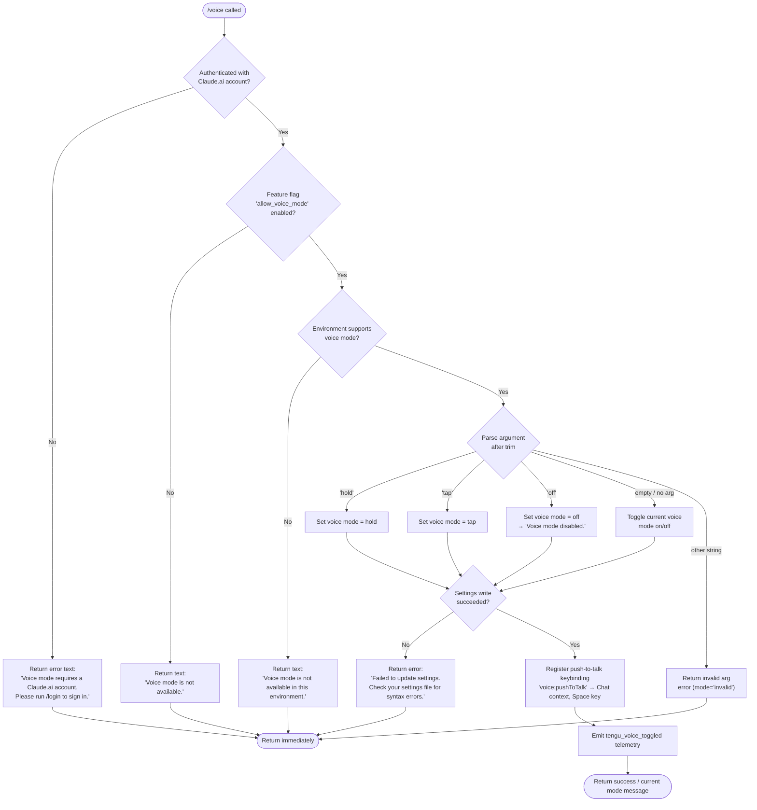

# `/voice`

> Analysis basis: CC v2.1.193 bundle.js (AST extraction + Claude interpretation)
> Minimum version: v2.1.193

---

## Overview

The `/voice` command toggles voice mode for the Claude Code CLI session. It accepts an optional sub-command argument (`hold`, `tap`, or `off`) that controls the activation style, and performs a multi-step eligibility check (account type, feature flag, environment availability) before committing a settings change. The command emits a `tengu_voice_toggled` telemetry event on each successful or attempted mode change.

---

## Registration

| Field | Value |
|---|---|
| type | `local` |
| name | `voice` |
| description | `Toggle voice mode` |
| argumentHint | `[hold\|tap\|off]` |
| supportsNonInteractive | `false` |
| isHidden | `null` |
| module_id | `HKl` |
| load_inline | `true` |
| loc_byte | `13208541` |
| loc_byte_end | `13208783` |
| loc_line | `8978` |
| arbor_handler.name | `xFf` |
| arbor_handler.fqn | `claude-2.1.193::xFf` |
| arbor_handler.kind | `AsyncFunction` |
| arbor_handler.resolution_path | `module_id` |
| arbor_handler.n_hits | `1` |

Analysis basis: CC v2.1.193 bundle.js:+13208541

---

## Input Branching

The handler has 5+ distinct branches across argument validation, eligibility gating, and mode selection. A Mermaid flowchart is used.



Analysis basis: CC v2.1.193 bundle.js:+13205941 (handler entry `xFf`), +13205858–13205902 (mode literals), +13205982 (login error), +13206161 (unavailable error), +13206449 (settings write failure), +13206587 (disabled confirmation), +13206831 (environment unavailable)

---

## Behavioral Spec

### 1. Entry Point — `voiceCommandHandler` (`xFf`)

The Arbor-resolved handler is `xFf` (an `AsyncFunction`, `fqn: claude-2.1.193::xFf`), reached via `module_id` resolution from module `HKl`.

```
async function voiceCommandHandler(args, context):
    rawArg = args.trim()

    // Step 1: Authentication gate
    authState = loadAuthState(context)           // calls settingsLoader (BEt → knr → Dy)
    if NOT isClaudeAiAccount(authState):
        return textResult("Voice mode requires a Claude.ai account. Please run /login to sign in.")

    // Step 2: Feature flag gate
    featureEnabled = checkFeatureFlag("allow_voice_mode", authState)  // Mnr → Fs
    if NOT featureEnabled:
        return textResult("Voice mode is not available.")

    // Step 3: Environment availability gate
    envAvailable = checkVoiceEnvironment()        // kr → dW → yB → ...
    if NOT envAvailable:
        return textResult("Voice mode is not available in this environment.")

    // Step 4: Argument parsing
    mode = parseVoiceArgument(rawArg)            // LFf + argument literals
    if mode == "invalid":
        return textResult(<invalid argument message>)

    // Step 5: Determine target state
    if mode == "off":
        targetState = disabled
    else if mode in ["hold", "tap"]:
        targetState = mode
    else:  // no argument → toggle
        current = getCurrentVoiceSetting()
        targetState = (current == disabled) ? defaultMode : disabled

    // Step 6: Persist to settings
    writeOk = saveVoiceSetting(targetState, context)   // co → wgs → vIe.writeFile
    if NOT writeOk:
        return textResult("Failed to update settings. Check your settings file for syntax errors.")

    // Step 7: Keybinding registration (when enabling)
    if targetState != disabled:
        registerKeybinding({                           // bC → V1t + jLn
            action: "voice:pushToTalk",
            context: "Chat",
            key: "space"
        })

    // Step 8: Microphone permission hint (macOS)
    if targetState != disabled AND isMacOS:
        hint = "System Settings → Privacy & Security → Microphone"
        // surfaced in UI (V → Promise.resolve path)

    // Step 9: Telemetry
    emit("tengu_voice_toggled", { mode: targetState })   // V at +13206530

    if targetState == disabled:
        return textResult("Voice mode disabled.")
    return textResult(<current mode active message>)
```

Analysis basis: CC v2.1.193 bundle.js:+13205941 (`xFf`→`BEt`), +13206062 (`xFf`→`_5`), +13206199 (`xFf`→`kr`), +13206215 (`xFf`→`LFf`), +13206351 (`xFf`→`co`), +13206530 (`xFf`→`V`, telemetry), +13206647 (`xFf`→`Promise.resolve`), +13207797 (`xFf`→`bC`, keybinding)

---

### 2. Authentication & Settings Load — `settingsLoadCoordinator` (`BEt`) → `authChecker` (`knr`) → `authStateBuilder` (`Dy`)

```
function settingsLoadCoordinator(context):
    settings = loadSettingsFromDisk()     // Avr: emits loadSettingsFromDisk_start/end markers
    authInfo = buildAuthState(settings)   // knr → Dy → UA / aH
    return { settings, authInfo }

function buildAuthState(settings):
    // Dy orchestrates:
    //   UA  – OAuth/API key resolution (profile-implicit, user_oauth, claude-desktop-3p)
    //   aH  – API key helper / env-var resolution (ANTHROPIC_API_KEY, apiKeyHelper, none)
    //   Ql  – firstParty flag check
    //   ant – token canonicalization
    return authStateObject
```

Analysis basis: CC v2.1.193 bundle.js:+13195209 (`BEt`→`knr`), +13195100 (`knr`→`Dy`), +3063220 (`Dy`→`cd`), +3063318 (`Dy`→`UA`), +3063425 (`Dy`→`aH`)

---

### 3. Feature Flag Check — `voiceFeatureGate` (`Mnr`) → `featureFlagResolver` (`Fs`)

```
function voiceFeatureGate(authState, settings):
    result = resolveFeatureFlag("allow_voice_mode", authState, settings)
    // Fs checks:
    //   XLi – feature set initializer
    //   WSd.has / VSd.has – policy/flag set membership
    //   D$  – flag override lookup (nOt)
    //   Bi  – rollout resolver (Rds)
    //   Whe – warning emitter
    //   y5  – flag value evaluator
    //   r.includes – allowed-list check
    return result.allowed   // boolean
```

Literal found: `"allow_voice_mode"` at CC v2.1.193 bundle.js:+13195167
Analysis basis: CC v2.1.193 bundle.js:+13195223 (`BEt`→`Mnr`), +13195164 (`Mnr`→`Fs`)

---

### 4. Argument Parser — `voiceArgNormalizer` (`LFf`)

```
function voiceArgNormalizer(rawArg):
    trimmed = rawArg.trim()
    if trimmed == "hold":   return "hold"
    if trimmed == "tap":    return "tap"
    if trimmed == "off":    return "off"
    if trimmed == "":       return null     // toggle semantics
    return "invalid"
```

Mode literals found: `"hold"` (+13205858), `"tap"` (+13205870), `"off"` (+13205881), `"invalid"` (+13205902)
Analysis basis: CC v2.1.193 bundle.js:+13206215 (`xFf`→`LFf`), +13205811 (`LFf`→`e.trim`)

---

### 5. Settings Persistence — `settingsWriter` (`co`) → `gitIgnoreAndFileWriter` (`wgs`)

```
async function persistVoiceSetting(targetState, context):
    // co resolves config file paths:
    //   U4  → .claude/settings.json  (+1324227, +1324237)
    //   B$e → run (g1.resolve)
    //   Qwt → atomic write with temp file, fsync, rename
    // wgs handles:
    //   mkdir, readFile, appendFile, writeFile  (vIe.*)
    //   git-ignore integration (ucn/Vr: git check-ignore)
    //   file canonicalization (fSu: ~/  expansion, isAbsolute)
    // PH  → clears in-memory caches (Den.clear, Xdr.clear) on success
    // wCr → stamps gcn with Date.now() on write
    writeResult = await atomicSettingsWrite(configPath, newSettings)
    return writeResult.ok
```

Analysis basis: CC v2.1.193 bundle.js:+13206351 (`xFf`→`co`), +1344461 (`co`→`wCr`), +1344491 (`co`→`B$e`), +1344656 (`co`→`PH`), +1344681 (`co`→`wgs`)

---

### 6. Keybinding Registration — `keybindingRegistrar` (`bC`) → `keybindingLoader` (`V1t`) + `keybindingValidator` (`jLn`)

When voice mode is enabled, the command registers a push-to-talk keybinding:

```
function registerVoiceKeybinding():
    // bC loads existing keybindings config:
    //   V1t: reads keybindings.json from .claude/
    //        validates "bindings" array structure
    //        emits telemetry: tengu_custom_keybindings_loaded / tengu_keybinding_config_invalid_format
    //   jLn: normalises modifier/key tokens (ctrl, cmd, opt, alt, shift, space)
    //        validates action identifiers
    //        emits: tengu_keybinding_customization_release

    newBinding = {
        action: "voice:pushToTalk",
        context: "Chat",
        key: "space"
    }

    // cFi.has / cFi.add — deduplication set check before registration
    if NOT alreadyRegistered(newBinding):
        register(newBinding)
        // fallback: tengu_keybinding_fallback_used if action not found
```

Literals: `"voice:pushToTalk"` (+13207800), `"Chat"` (+13207819), `"space"` (+13207826), `"keybindings.json"` (+3982875)
Analysis basis: CC v2.1.193 bundle.js:+13207797 (`xFf`→`bC`), +3991798 (`bC`→`GLn`→`V1t`), +3991808 (`bC`→`jLn`), +3991856 (`bC`→`cFi.has`)

---

### 7. Environment Check — `voiceEnvChecker` (`kr`) → `telemetryReporter` (`dW`) → `voiceCapabilityProber` (`yB`)

```
function checkVoiceEnvironment():
    // kr → dW: loads settings from disk (Avr) with perf markers
    //           loadSettingsFromDisk_start / loadSettingsFromDisk_end (+1341423, +1341479)
    // dW → yB: probes system-level voice capability
    //   mr   – runtime resolver
    //   _Tt, Sfr, gTt, MNe, DNe, ETt, gie, VIe, pun, jHs, FZ, JLt
    //         – individual environment capability checkers
    // macOS privacy hint resolved here:
    //   "System Settings → Privacy & Security → Microphone" (+13207338)
    return capabilityResult.available   // boolean
```

Analysis basis: CC v2.1.193 bundle.js:+13206199 (`xFf`→`kr`), +1341090 (`kr`→`dW`), +1341463 (`dW`→`yB`)

---

### 8. MCP State Refresh — `mcpStateManager` (`a`) → `mcpConnectionOrchestrator` (`l6e`) / `mcpApplyUpdate` (`Bcr`)

The voice command handler also triggers an MCP state refresh cycle at `xFf`→`a` (+13207106) and `xFf`→`l` (+13207318). This is a standard post-settings-write side effect shared by commands that mutate global config.

```
async function postSettingsMcpRefresh(context):
    // a → l6e: enumerates current MCP server entries (Object.entries)
    //          evaluates each: stdio, sse, sse-ide, ws-ide, claudeai-proxy
    //          dispatches: P1n (connection handler), e3t (retry logic), hso (hash check)
    //          runs cleanup for disconnected servers: oT / Bcr
    // a → VWo: applies connection results, disposes orphaned connections
    // a → Bcr: applyMcpUpdate — reconciles live client map with new config
    await reconcileMcpConnections(context)
```

Analysis basis: CC v2.1.193 bundle.js:+13207106 (`xFf`→`a`), +16975929 (`a`→`l6e`), +16975939 (`a`→`Bcr`), +16976072 (`a`→`VWo`)

---

### 9. Global Config Save — `globalConfigSaver` (`mn`)

After all mutations, the handler calls `mn` (+13208258) to persist the authoritative global config. This includes a guard against accidental auth-field loss (literal: `"saveGlobalConfig fallback: re-read config is missing auth that cache has; refusing to write. See GH #3117."` at +13970417).

```
async function saveGlobalConfig(newConfig, context):
    // mn → kt: reads current on-disk config (bSt → r.readFileSync)
    //           backs up changed files to .claude/backups/
    // mn: re-reads config post-write and compares auth fields
    //     if auth fields missing after write → abort, emit tengu_config_auth_loss_prevented
    //     otherwise → emit tengu_config_parse_error on parse failure
    // mn → Qor: emit "save_global" telemetry marker
    await writeWithAuthGuard(newConfig)
```

Analysis basis: CC v2.1.193 bundle.js:+13208258 (`xFf`→`mn`), +13970417 (auth-loss guard literal), +13970545 (`tengu_config_auth_loss_prevented`)

---

## State & Side Effects

| Item | Detail |
|---|---|
| Telemetry — primary | `tengu_voice_toggled` emitted on every non-early-exit path (bundle.js:+13206532) |
| Telemetry — feature gate | `tengu_feature_ok` (+1026754), `tengu_feature_bad` (+1026821), `tengu_feature_sad` (+1026902) via feature-flag resolver |
| Telemetry — keybinding | `tengu_custom_keybindings_loaded` (+3982781), `tengu_keybinding_customization_release` (+3982361), `tengu_keybinding_fallback_used` (+3991880) |
| Telemetry — config | `tengu_config_auth_loss_prevented` (+13970545), `tengu_config_parse_error` (+13977384) |
| Telemetry — settings load | `settings_load_started` / `settings_load_completed` perf markers via `Avr` |
| Settings write | Atomically writes voice mode setting to `.claude/settings.json` (+1324227/+1324237); uses temp-file + fsync + rename pattern |
| Cache invalidation | `PH` clears `Den` and `Xdr` in-memory caches on successful settings write (+1344656) |
| Keybinding registration | Registers `voice:pushToTalk` → `Chat` context, `space` key when enabling voice (+13207797–13207826) |
| MCP side effect | Triggers full MCP connection reconciliation cycle (`l6e` / `VWo` / `Bcr`) after settings mutation |
| Global config backup | `mn` → `kt` → `bSt` copies changed files to `.claude/backups/` before overwriting |
| macOS microphone hint | Surfaces `"System Settings → Privacy & Security → Microphone"` path (+13207338) when enabling on macOS |
| appState changes | Voice mode flag updated in global settings store; config timestamp updated via `wCr` → `gcn.set(Date.now())` |
| Sound | None found in depth-2 traversal |
| Non-interactive | `supportsNonInteractive: false` — command is blocked in non-interactive / headless invocations |

---

## Version History

| Version | Change |
|---|---|
| v2.1.193 | Initial analysis |

---

## Common Mistakes

1. **Calling `/voice` without a Claude.ai account** — The command hard-blocks with a login prompt before any mode change. API-key-only users cannot use voice mode; OAuth login is required. (bundle.js:+13205941, +13205982)
2. **Passing an unrecognised sub-command** — Any argument other than `hold`, `tap`, or `off` resolves to the `"invalid"` branch and returns an error without changing state. (bundle.js:+13205902)
3. **Calling `/voice` in a non-interactive session** — `supportsNonInteractive: false` means the command is unavailable in `--print` / headless mode; it will be rejected at dispatch before the handler runs. (registration field)
4. **Settings file syntax errors blocking the toggle** — If `.claude/settings.json` has invalid JSON, the atomic write will fail and the command returns the settings-error message. Fix the JSON first. (bundle.js:+13206449)
5. **Expecting the command to work when `allow_voice_mode` feature flag is off** — Even for authenticated users, if the flag is disabled server-side, the command returns "Voice mode is not available." with no further action. (bundle.js:+13206161, +13195167)
6. **Assuming push-to-talk is always Space** — The default keybinding `space` in the `Chat` context is registered programmatically; a custom `keybindings.json` can override it. (bundle.js:+13207826)

---

## Appendix — Identifier Mapping

> For bundle debugging only. Identifiers change across versions.

| Identifier | Role |
|---|---|
| `xFf` | Main voice command handler (AsyncFunction, arbor_handler) |
| `BEt` | Settings load coordinator (entry from `xFf`) |
| `knr` | Authentication state checker |
| `Dy` | Authentication state builder / OAuth resolver |
| `cd` | Low-level config accessor |
| `UA` | OAuth / API key resolver (profile-implicit, user_oauth) |
| `Ql` | First-party flag evaluator |
| `MT` | Token metadata helper |
| `aH` | API key helper / env-var resolver (ANTHROPIC_API_KEY) |
| `KDt` | Auth token canonicalizer |
| `ant` | Token normalization helper |
| `yS` | Settings value reader |
| `K7t` | Feature-flag argument passer |
| `Mnr` | Voice feature gate coordinator |
| `Fs` | Feature-flag resolver |
| `XLi` | Feature-set initializer |
| `D$` | Feature flag override lookup |
| `Bi` | Rollout/percentage resolver |
| `Whe` | Feature flag warning emitter |
| `y5` | Feature flag value evaluator |
| `r` | Data stream / readable helper |
| `_5` | Argument tokenizer (charAt, slice) |
| `kr` | Environment check entry |
| `dW` | Settings-from-disk loader with perf markers |
| `xx` | Perf mark helper |
| `ia` | Memory usage sampler |
| `u4` | Node `require` wrapper (perf_hooks) |
| `Avr` | Settings load orchestrator (start/end markers) |
| `vn` | Log file appender (appendFileSync, mkdirSync) |
| `Oen` | Settings parse validator |
| `XLt` | Flag/policy settings merger |
| `vHs` | Settings key enumerator |
| `GIe` | User settings path resolver (userSettings) |
| `uW` | MCP zone/daemon config loader |
| `IHs` | SDK inline settings reader |
| `yB` | Voice capability prober (system-level) |
| `mr` | Runtime identifier resolver |
| `_Tt` | Capability probe sub-checker A |
| `Sfr` | Capability probe sub-checker B |
| `gTt` | Capability probe sub-checker C |
| `MNe` | Capability probe sub-checker D |
| `DNe` | Capability probe sub-checker E |
| `ETt` | Capability probe sub-checker F |
| `gie` | Capability probe sub-checker G |
| `VIe` | Capability probe sub-checker H (also file I/O alias) |
| `pun` | Capability probe sub-checker I |
| `jHs` | Capability probe sub-checker J |
| `FZ` | Capability probe sub-checker K |
| `JLt` | Capability probe sub-checker L (WSL detector: "wsl") |
| `Pen` | Post-probe cleanup |
| `z7t` | Voice state accessor |
| `LFf` | Voice argument normalizer (trim + mode match) |
| `e` | Generic async utility / random/setTimeout helper |
| `co` | Settings writer / config file manager |
| `dg` | Settings writer helper (GIe + yB) |
| `jt` | Path utility helper |
| `Svr` | Settings reconciler (vHs, GIe, uW, IHs) |
| `hv` | Config file reader entry |
| `MZ` | Config file parser (readFileSync, BOM detection, replaceAll) |
| `Md` | Real-path resolver |
| `T` | Text normalizer / toUpperCase / trim |
| `Sln` | Config section parser |
| `Aln` | Config slice helper |
| `In` | Path existence checker (ENOENT handler) |
| `an` | ENOENT / path-not-found guard |
| `wCr` | Config write-timestamp stamper (gcn.set + Date.now) |
| `B$e` | Config run-path resolver (run + yB) |
| `run` | Project root resolver (g1.resolve, g1.dirname) |
| `Qwt` | Atomic file writer (temp + fsync + rename) |
| `u` | Process/worker lifecycle manager |
| `we` | Worker start helper |
| `Re` | Worker result handler |
| `R$` | Worker registry updater |
| `Hj` | Process race/exit handler |
| `mJe` | Permission error handler (EINVAL/ENOTSUP/EPERM/ENOSYS) |
| `Ops` | Object property definer (Object.defineProperty) |
| `be` | String coercer helper |
| `ke` | JSON serializer (JSON.stringify) |
| `PH` | Cache invalidator (Den.clear, Xdr.clear) |
| `wgs` | Async file write manager (mkdir, readFile, writeFile, appendFile) |
| `Pt` | Async local store accessor (Eln) |
| `Eln` | AsyncLocalStorage getStore wrapper |
| `uCr` | Internal utility (Iu) |
| `n` | String/array utility (toLowerCase, endsWith, some) |
| `ucn` | Git-ignore check coordinator |
| `Vr` | Git command runner (check-ignore, ls-files) |
| `fSu` | Home-directory path expander (~/ resolver) |
| `Cgs` | Git config reader (core.excludesfile) |
| `vgs` | Write-ineffective status reporter |
| `U4` | Settings path builder (.claude join) |
| `vt` | Async worker starter (V + Oe) |
| `V` | Core render / telemetry emitter |
| `Oe` | Output effect dispatcher (Zze) |
| `Zze` | Terminal output primitive |
| `xe` | Error logger (kZ.logError, rJe.push) |
| `eo` | Error code extractor |
| `at` | String coercer (String) |
| `e_u` | Log-ring buffer manager (fln.shift, fln.push) |
| `a` | MCP state manager entry |
| `l6e` | MCP connection orchestrator (Object.entries over servers) |
| `V3` | MCP server config processor |
| `rct` | MCP server type resolver (TN, _ie) |
| `aX` | MCP server connection builder |
| `H6` | SDK-type MCP server handler |
| `m1n` | MCP warning emitter (St.red, St.yellow) |
| `ect` | MCP server entry reconciler |
| `yF` | MCP server object factory (Object.create) |
| `d` | MCP supervisor/daemon connector |
| `BL` | MCP base config loader (mg, eso) |
| `mg` | MCP config reader (afe, kt, va) |
| `eso` | MCP config parser secondary |
| `Nn` | Node module/path constant |
| `QBt` | MCP server filter |
| `fba` | MCP connection attempt handler |
| `mao` | MCP auth/needs-auth cache checker |
| `hRe` | MCP config hasher (p_a.createHash, sha256) |
| `iTn` | MCP tool schema builder |
| `aTn` | MCP tool definition assembler |
| `tI` | MCP request hasher (wHi.createHash) |
| `sTn` | MCP schema validator (Zl) |
| `Zl` | JSON schema validator (hXs) |
| `sn` | MCP debug logger (kZ.logMCPDebug, rJe.push) |
| `P1n` | MCP connection handler (Hlp + _lp) |
| `Tr` | MCP transport resolver |
| `Hlp` | MCP live connection manager (OAuth flow, authenticate) |
| `_lp` | MCP callback/complete-auth handler |
| `e3t` | MCP retry logic handler |
| `qs` | AsyncLocalStorage store getter (Kqu.getStore) |
| `GNn` | MCP needs-auth cache path builder |
| `hso` | MCP hash-change detector |
| `m` | Process/worker kill manager |
| `R` | Worker write helper |
| `jL` | MCP skills telemetry emitter (tengu_mcp_skills) |
| `it` | MCP tool registration handler |
| `Zoo` | MCP global config entry (mn) |
| `mn` | Global config save orchestrator |
| `w` | Background worker pool (blurred/focused lifecycle) |
| `B7` | Background worker entry |
| `L` | Background worker sweep/retire/respawn manager |
| `v` | Worker state helper |
| `KAc` | Worker clock helper (e.at) |
| `zAc` | Worker respawn policy (Ylr) |
| `iu` | MCP error logger (kZ.logMCPError, rJe.push) |
| `_ba` | MCP schema validator (I8) |
| `I8` | MCP protocol message validator |
| `Uct` | MCP parseInt wrapper A |
| `jNn` | MCP parseInt wrapper B |
| `Bcr` | MCP apply-update handler (applyMcpUpdate) |
| `a6e` | MCP update hasher |
| `oT` | MCP orphan cleanup |
| `s6e` | MCP slot config comparator |
| `mSa` | MCP server io initializer (sio) |
| `sio` | MCP server io handler |
| `l` | Daemon/worker lifecycle manager |
| `C8l` | Daemon status writer (daemon.status.json) |
| `iee` | Daemon event emitter (Yge) |
| `v7t` | Daemon status path builder (I8l.join, nr) |
| `VWo` | MCP connection result applier |
| `E1n` | MCP tool permission checker (Nap.has, cso.has) |
| `Un` | Async timeout utility (setTimeout, clearTimeout) |
| `c` | Async cleanup handler (yn) |
| `bC` | Keybinding registrar entry |
| `GLn` | Keybinding config loader (V1t + jLn) |
| `V1t` | Keybinding file reader/validator (keybindings.json) |
| `Jqr` | Keybinding entry parser (OLn) |
| `y8` | Keybinding action lookup (it) |
| `cc` | Keybinding context resolver (El, cd) |
| `kHe` | Keybinding path builder (BLn.join, nr) |
| `Bt` | JSON parse wrapper (JSON.parse) |
| `$Ln` | Keybinding block structure validator |
| `OLn` | Keybinding entry object builder (Object.entries) |
| `eFi` | Keybinding feature emitter (V) |
| `Yqr` | Keybinding key-token parser (regex exec, slice) |
| `Xqr` | Keybinding modifier validator (ctrl/cmd/opt/alt/shift) |
| `jLn` | Keybinding normalizer (nKr, q$i, Wt) |
| `nKr` | Keybinding normalizer sub-step A |
| `tKr` | Keybinding normalizer sub-step B (Wot) |
| `q$i` | Keybinding entry mapper (Vqr) |
| `Vqr` | Keybinding entry formatter (V$i, n.join) |
| `Ve` | Render primitive (Zze) |
| `S7e` | Language/locale resolver (toLowerCase, Bzo.has, t.split) |
| `kt` | App config reader (bSt, a9o, xjf) |
| `a9o` | Config path constant |
| `bSt` | Config file loader with backup (r.readFileSync, r.mkdirSync, r.copyFileSync) |
| `R4` | Config string prefix stripper (startsWith, slice) |
| `u9o` | Config directory scanner (t.readdirStringSync, t.statSync) |
| `p9o` | Backup path builder (oE.join, nr) |
| `xjf` | Config file watcher setup (aLt, FZl.unwatchFile) |
| `aLt` | File watch registrar (egs.watchFile) |
| `ife` | Config change notifier |
| `Ei` | Signal/interrupt handler registrar (a7o.register) |