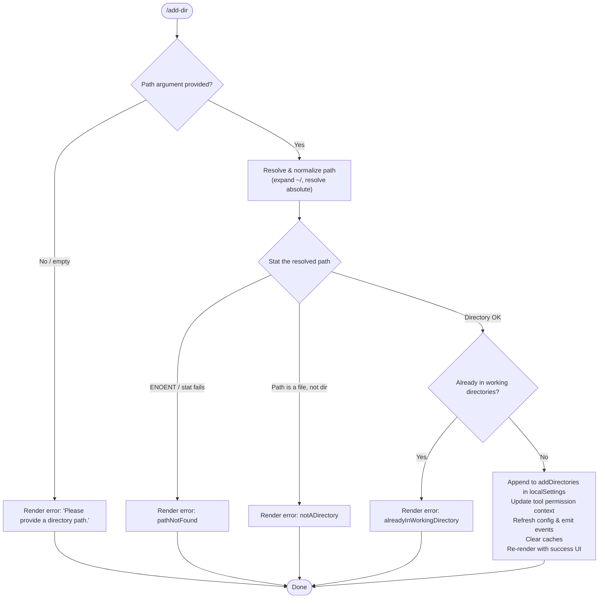

# `/add-dir`

> Analysis basis: CC v2.1.195 bundle.js (AST extraction + Claude interpretation)
> Minimum version: v2.1.195

---

## Overview

`/add-dir` adds a new working directory to the current Claude Code session. It accepts a filesystem path as its sole argument, validates that the path resolves to an accessible directory, updates the session's tool-permission context and local settings, and then re-renders the session environment so that the new directory is immediately available to file-system tools.

---

## Registration

| Field | Value |
|---|---|
| type | `local-jsx` |
| name | `add-dir` |
| description | Add a new working directory |
| argumentHint | `<path>` |
| module_id | `Bkl` |
| load_inline | `true` |
| loc_byte | `11377997` |
| loc_byte_end | `11378145` |
| loc_line | `7200` |
| arbor_handler.name | `exf` |
| arbor_handler.fqn | `claude-2.1.195::exf` |
| arbor_handler.kind | `AsyncFunction` |
| arbor_handler.resolution_path | `module_id` |
| arbor_handler.n_hits | `0` |

Analysis basis: CC v2.1.195 bundle.js:+11377997

---

## Input Branching

The handler has five distinct outcome branches based on path validation and resolution state.



---

## Behavioral Spec

### 1. Entry Point — Main Handler (`exf`)

The Arbor-resolved handler is `exf` (an `AsyncFunction`), entered when the user invokes `/add-dir <path>`.

```
async function addDirHandler(context, rawArg):
    appState = getAppState(context)                  // via Br → e.getAppState
    localSettings = appState.localSettings

    resolvedPath = resolveAndValidatePath(rawArg)    // yat / ds pipeline

    if resolvedPath.error == "emptyPath":
        renderError("Please provide a directory path.")
        return

    if resolvedPath.error == "notADirectory":
        renderError(notADirectoryMessage)
        return

    if resolvedPath.error == "pathNotFound":
        renderError(pathNotFoundMessage)
        return

    existingDirs = collectCurrentWorkingDirs(appState)   // Br → n.findLast
    if existingDirs.includes(resolvedPath):
        renderError(alreadyInWorkingDirectoryMessage)
        return

    // Success path
    context.setToolPermissionContext(newPermCtx)         // exf → t.setToolPermissionContext
    updatePermissionRules(context)                       // PH pipeline
    appendToLocalSettings("addDirectories", resolvedPath)  // literal "addDirectories"
    flushWOo(resolvedPath)                               // WOo — writes CLAUDE.md / config
    invalidateSkillCache()                               // V0 → LG → e.clearSkillIndexCache
    clearCommandCache()                                  // X6 → y7t.clear
    emitSessionEvent()                                   // i2.emit
    context.Lo.refreshConfig()                           // Lo.refreshConfig
    refreshMcpAndDaemon()                                // dzi / Yue pipelines
    renderSuccessUI(resolvedPath)                        // Abe.jsx render
```

Analysis basis: CC v2.1.195 bundle.js:+11376786

---

### 2. Path Resolution and Validation (`yat` / `ds`)

```
async function resolveAndValidatePath(rawArg):
    if rawArg is null or blank:
        return { error: "emptyPath" }       // literal "emptyPath" at +3973634

    normalized = normalizePath(rawArg)      // ds: expand "~/", call path.normalize
                                            //     path.resolve for relative paths

    if normalized contains null bytes:
        throw TypeError("Path contains null bytes")   // +1097590

    if platform == "windows":
        applyWindowsPathFix(normalized)     // ds → r.match "windows" branch

    statResult = await fs.stat(normalized)  // yat → aWi.stat at +3973687

    if stat throws ENOENT:
        return { error: "pathNotFound" }    // literal "pathNotFound" at +3973877

    if statResult.isFile():                 // it exists but is a regular file
        return { error: "notADirectory" }   // literal "notADirectory" at +3973732

    return { path: normalized }
```

Analysis basis: CC v2.1.195 bundle.js:+3973653

---

### 3. Duplicate Detection (`Br` / `n.findLast`)

```
function collectCurrentWorkingDirs(appState):
    // Reads "working_directory" from appState (literal at +11065981)
    // Reads per-session addDirectories list
    // Uses n.findLast to pick the most-recently-set entry per key
    primaryDir    = appState["working_directory"]
    extraDirs     = appState["addDirectories"]    // literal "addDirectories" at +11376822
    return [primaryDir, ...extraDirs]
```

If the resolved path already appears in this list, the handler renders the `alreadyInWorkingDirectory` error message (literal at +3974009) without modifying state.

Analysis basis: CC v2.1.195 bundle.js:+11065956

---

### 4. Tool Permission Context Update (`t.setToolPermissionContext` / `PH`)

```
function updateToolPermissions(context, resolvedPath):
    // Reads current permission_mode (literal at +11066254)
    // Checks bypassPermissions flag (literal at +11066285)
    // If bypassPermissions mode unavailable, logs ignore message
    //   (literal fragment "Ignoring permission update: setMode..." at +5414220)
    //
    // Merges allowed_tools / disallowed_tools lists:
    //   literals "allowed_tools"   +11066036
    //           "disallowed_tools" +11066091
    //           "avoid_prompts"    +11066152
    //
    // Applies addRules / replaceRules / removeRules / removeDirectories:
    //   literals at +5414496, +5414844, +5415501, +5415885
    //
    // Updates n.set / n.delete on internal rule maps
    context.setToolPermissionContext(mergedContext)
```

Analysis basis: CC v2.1.195 bundle.js:+11376896 and +5414218

---

### 5. Local Settings Persistence (`WOo`)

```
async function persistNewDirectory(resolvedPath):
    // Resolves real path via bl.realpath (+13534323)
    // Normalizes with o_.normalize (+13534323)
    // Determines config file location (Ih.join, Ih.dirname)
    // If config directory absent: bl.mkdir (+13534675)
    // Appends or rewrites CLAUDE.md / settings block: bl.appendFile (+13534826)
    // Reads existing config: bl.readFile (+13534510)
    // Wraps file mutations in safe atomic-write helper (oAr):
    //   stat → rename to .txt temp → write → rename back (+214619)
```

Analysis basis: CC v2.1.195 bundle.js:+13534288

---

### 6. Cache Invalidation and Event Emission

```
function invalidateCachesAndNotify():
    V0()                        // clearSkillIndexCache (+13518704)
    LG()                        // Promise.resolve chain (+13518652)
    X6()                        // y7t.clear — command cache (+11189184)
    i2.emit(sessionEvent)       // emit session-changed event (+11376995)
    Lo.refreshConfig()          // reload global config (+11377005)
```

Analysis basis: CC v2.1.195 bundle.js:+11376966–+11377005

---

### 7. Success UI Rendering (`Eat` / `Abe.jsx`)

```
function renderSuccess(resolvedPath, isFirstDir):
    label = isFirstDir
        ? "the current working directory"     // literal at +3974722
        : "the additional working directory"  // literal at +3974754

    // Renders bold path header via Ct.bold (+11377083)
    // Renders dim hint line: "· /permissions to manage"
    //   (literal at +11377376) via Ct.dim (+11377369)
    // Uses Abe.jsx to produce the JSX tree (+11377428)
    // Eat component: shows Ct.bold path + rFt.dirname context (+3974290)
    return <JSXComponent label={label} path={resolvedPath} />
```

On failure (any error branch), renders: `"Did not add a working directory."` (literal at +11377494) with `"Unknown error"` fallback (literal at +11377268).

Analysis basis: CC v2.1.195 bundle.js:+11377083 and +11377545

---

### 8. MCP / Daemon Integration (`dzi` / `Yue`)

After the directory is written to settings, two subsystem refresh calls are triggered:

```
async function refreshSubsystems(resolvedPath):
    // dzi: reloads background-settings file watcher
    //   sE: clears stale Gne cache (+4311197)
    //   Ki: lstats each watched path, re-reads JSON, updates Gne map
    //   zd: atomic rewrite of the settings file (eg pipeline)
    //   Jf: validates file is tracked (eae.has check at +4310899)

    // Yue: refreshes MCP server directory list
    //   Xca: rebuilds server config entries (AGe / fup / io pipelines)
    //   io:  walks settings layers (flagSettings, projectSettings, userSettings,
    //        policySettings literals at +1344893, +5416314, +5416294, +5411097)
    //   Filters removed directories (r.filter + r.has at +5417307)
    //   Sends "--add-dir" flag to underlying process (literal at +11377035)
```

Analysis basis: CC v2.1.195 bundle.js:+11377031 and +11377065

---

## State & Side Effects

| Item | Detail |
|---|---|
| Telemetry | `tengu_disable_bypass_permissions_mode` (+3420569) — fired when bypass-permissions mode is rejected during permission-context update |
| Telemetry | `tengu_bg_state_read_transient` (+4312062) — fired during background settings cache read |
| Telemetry | `tengu_feature_ok` / `tengu_feature_bad` / `tengu_feature_sad` (+1027363, +1027430, +1027511) — feature gate outcome events traversed in dependency chain |
| Telemetry | `tengu_daemon_config_reload` (+17902328) — may fire if daemon config is reloaded as side effect |
| Telemetry | `tengu_daemon_control` (+17924594) — daemon lifecycle event in dependency chain |
| appState changes | `localSettings.addDirectories` array receives the new resolved path |
| appState changes | `permission_mode`, `allowed_tools`, `disallowed_tools`, `avoid_prompts`, `bypassPermissions` fields may be rewritten |
| appState changes | `working_directory`, `session`, `effort`, `model`, `max_thinking_tokens`, `flag_settings` literals read from state |
| Config file writes | CLAUDE.md / `.claude/settings.local.json` appended or rewritten atomically via `bl.appendFile` / `bl.mkdir` |
| Cache clears | `y7t.clear` (command cache), `Gne.clear` (background-settings cache), `e.clearSkillIndexCache` (skill index) |
| Event emission | `i2.emit` fires a session-changed event; `Lo.refreshConfig()` reloads global config |
| Hook registration | `vi → krs.register` — registers a cleanup/hook entry as part of the permission-context pipeline (+68053) |
| Sound | None observed in depth-2 traversal |

---

## Version History

| Version | Change |
|---|---|
| v2.1.195 | Initial analysis |

---

## Common Mistakes

1. **Providing a file path instead of a directory path** — the command checks `stat().isFile()` and will reject the path with the `notADirectory` error. Ensure the argument points to an existing directory, not a file.
2. **Adding a directory already in the working set** — the command detects duplicates against both the primary `working_directory` and all entries already in `addDirectories`. Re-adding an existing directory silently fails with the `alreadyInWorkingDirectory` message.
3. **Using a relative path that resolves outside the project root** — the path expander (`ds`) resolves against `process.cwd()` and normalizes via `path.resolve`. Unexpected CWD values may cause the resolved path to differ from what the user intended.
4. **Omitting the path argument entirely** — invoking `/add-dir` with no argument produces `"Please provide a directory path."` immediately; no prompting occurs.
5. **Paths with tilde syntax on non-POSIX platforms** — `~/` expansion calls `os.homedir()` and assumes POSIX separator semantics; Windows paths may require fully qualified absolute forms.

---

## Appendix — Identifier Mapping

> For bundle debugging only. Identifiers change across versions.

| Identifier | Role |
|---|---|
| `exf` | Main async handler for `/add-dir` (Arbor-resolved entry point) |
| `Br` | App-state reader; finds working directory and settings sub-fields |
| `uZn` | Reads `allowed_tools` permission list from app state |
| `dZn` | Reads `disallowed_tools` permission list from app state |
| `xF` | Bypass-permissions mode gate check |
| `at` | Permission-mode evaluator (checks `hxe`, `rV`, `iUt` maps) |
| `lUt` | Permission lookup helper A |
| `cUt` | Permission lookup helper B |
| `f6` | Inner permission resolution step (calls `p6`) |
| `bxn` | Permission cache manager (`VKr`, `hxe`, `WKr`, `JKr`) |
| `Mt` | Tool-permission context builder (calls `qt`, `S0`, `Mjo`, `oTt`, `Csm`) |
| `PH` | Permission-rules applier (addRules / replaceRules / removeRules) |
| `T` | Rule-set merge / normalization utility |
| `RYc` | Rule serialization helper |
| `Drs` | Inner rule codec (`NKc`, `UKc`) |
| `Me` | JSON stringify wrapper |
| `Lc` | Path-segment label formatter |
| `_is` | Label map builder (`wYc.map`) |
| `jXe` | Output writer helper (calls `ais`) |
| `ais` | Low-level write (`e.write`) |
| `PYc` | Settings file writer (mkdir, appendFile, rename, atomic write) |
| `_Xe` | Debounce / batch scheduler (setTimeout / setImmediate) |
| `Qge` | Write-queue flusher (`zXe`, `Xge.join`, `tr`, `Rt`) |
| `tae` | File-operation error handler (`on` wrapper) |
| `Sis` | Settings path joiner (`Xge.join`, `Rt`) |
| `oAr` | Atomic file rename helper (stat → .txt temp → rename) |
| `DYc` | Directory-aware append-file writer (mkdir + appendFile) |
| `vi` | Hook/cleanup registrar (`krs.register`) |
| `Dp` | String sanitizer for display (calls `dNu` → `e.replaceAll`) |
| `dNu` | Backslash / paren escape helper (`e.replaceAll`) |
| `d0` | Path existence pre-check utility |
| `C7e` | File-stat validator (ENOENT, isFile, 1 MiB limit check) |
| `Vs` | Context-store accessor (`Nld.getStore`) |
| `y5o` | Stat result normalizer (calls `_5o`) |
| `ye` | String coercer (`String(...)`) |
| `Vtc` | Column-width calculator for display table (`Object.keys`, `Math.max`, `k_`) |
| `E` | MCP/SDK connection manager (stop/start/connect, `kIt`, `cD`, `uD`, `yX`, `w9`) |
| `kIt` | Connection-type dispatcher (`O2c`) |
| `O2c` | HTTP/SSE/dynamic connection key extractor |
| `xe` | Error formatter / logger (`Zr`, `ut`, `qi`, `BMu`, `GZe.push`, `Gee.logError`) |
| `Zr` | Error constructor wrapper |
| `ut` | String-error coercer |
| `qi` | Essential-traffic classifier (`rSs`) |
| `BMu` | Sliding-window error buffer (`Tpn.shift`, `Tpn.push`) |
| `A` | Process / daemon manager (start, stop, updateConfig, userinfo, `nhr`, `thr`) |
| `nhr` | Array-or-string argument normalizer |
| `thr` | Shell-argument string normalizer (startsWith / slice / replace) |
| `H` | Process handle (kill via `O.kill`, userinfo) |
| `EWc` | Daemon heartbeat handler (`dce`) |
| `I` | HTTP server/request handler (Math.max/floor, preventDefault, `A`) |
| `M` | OAuth/MCP HTTP router (large routing table) |
| `Nge` | Session metadata accessor |
| `V0` | Skill-index cache invalidator (`LG`, `ZZn`, `aRl`, `HKe`) |
| `LG` | Skill-index clear wrapper (`E$o`, `e.clearSkillIndexCache`) |
| `HKe` | Skill-index store reader (`hzt`) |
| `hzt` | Skill-index map getter (`wXn.get`, `mzt`) |
| `LW` | Local watcher refresh (`oer`) |
| `X6` | Command-cache clear (`y7t.clear`) |
| `WOo` | CLAUDE.md / project-config writer (realpath, readFile, mkdir, appendFile) |
| `f4` | Config environment detector (`ut`, `Csc`, `n5`, `s3e`) |
| `s3e` | Config path resolver (`TL`, `Cf`, `Ppd`) |
| `Cf` | Config directory builder (`v0`) |
| `Ppd` | Config path finalizer (`Opd`) |
| `o_` | Path normalizer (`e.normalize` NFC) |
| `Cn` | POSIX error classifier (`on`) |
| `UB` | Utility helper A (`u0`) |
| `Hr` | Utility helper B (`u0`) |
| `qo` | Error-code mapper (`on`) |
| `dzi` | Background-settings subsystem refresher (`sE`, `Ki`, `zd`, `Jf`) |
| `sE` | Background-settings cache deleter (`Gne.delete`) |
| `Ki` | Background-settings file reader/validator (lstat, readFile, Gne map) |
| `u` | Daemon state-machine controller (`Le`, `ke`, `SF`, `yj`) |
| `Le` | Daemon state: feature-ok path (`W`, `Oe`) |
| `ke` | Daemon state: feature-bad path (`W`, `Oe`) |
| `SF` | Daemon state: push to `vY`, call `y4e`, `GKr` |
| `yj` | Daemon shutdown racer (`Promise.race`, `process.exit`) |
| `Ld` | Filesystem error logger (`on`) |
| `Bt` | JSON parse wrapper |
| `zd` | Settings atomic rewriter (`eg`, `oE.join`, `Me`, `sE`) |
| `eg` | Atomic file write engine (randomBytes → writeFile → rename → chmod) |
| `Jf` | Settings file validator (`on`, `eae.has`, `T`, `ye`, `xe`) |
| `Yue` | MCP server directory refresher (`Dao`, `T`, `Xca`, `io`) |
| `Dao` | MCP directory-list builder |
| `Xca` | Server-config entry assembler (`AGe`, `fup`, `hup`, `io`, `wg`) |
| `AGe` | Policy-settings reader (`Hn`) |
| `Hn` | Settings-layer loader (`gmn`, `p3`) |
| `fup` | Per-server config builder (`Lg`, `Gd`, `Xv`, `wa`) |
| `Lg` | Settings watcher helper (`wve`, `p3`) |
| `Gd` | Real-path resolver (`Bc`, `Vp`, `IC`, `Wwt`, `e.realpathSync`) |
| `Xv` | Settings-watch registration (`Wee`) |
| `hup` | Server-type detector |
| `wg` | Settings string sanitizer (`fNu`, `wM`, `mNu`, `pNu`, `e.substring`) |
| `wM` | Object own-property checker |
| `pNu` | String replaceAll sanitizer |
| `io` | Settings-layer walker (flagSettings, projectSettings, userSettings, policySettings) |
| `Tkr` | Settings-file parser (`ZCs`, `wve`, `u8`, `XCs`, `n8`) |
| `p3` | Multi-layer settings merger (many sub-helpers) |
| `RRr` | Settings-read timestamp recorder (`Cfn.set`, `Date.now`) |
| `oBe` | Settings-object builder (`fmn`, `p3`) |
| `aRt` | Atomic write-file-sync with permissions (`writeFileSync`, `fchmodSync`, `fsyncSync`, `renameSync`) |
| `n_` | Cache clear helper (`Kon.clear`, `QHr.clear`) |
| `eIs` | Gitignore / excludes-file tracker (`fve.mkdir`, `fve.readFile`, `fve.appendFile`) |
| `M5` | Claude settings path builder (`z1.join`, `.claude`, `settings.json`) |
| `wt` | Daemon state: feature-sad path (`W`, `Oe`) |
| `d8` | Settings-disk loader (`c0`, `pa`, `Ikr`, `p3`, `zon`) |
| `yat` | Path-validation entry point (resolve → stat → classify error) |
| `ds` | Path normalizer / resolver (`qt`, `o_`, `U1.*`, `qpn.homedir`, `Vt`) |
| `Ot` | Context-store reader (`Rpn`, `Hr`) |
| `Rpn` | Async-local-storage getter (`xpn.getStore`, `Rz`) |
| `V3` | Alternative path resolver (`Hr`) |
| `fk` | macOS /var→/tmp path rewriter (`ds`, `ZKe`, `hm`, `Mae`) |
| `ZKe` | Path rewrite rule evaluator (`Vt`, `CM`) |
| `hm` | Case-insensitive path comparer (`e.toLowerCase`) |
| `Mae` | Path rewrite finalizer |
| `Eat` | Success-UI component builder (`Ct.bold`, `rFt.dirname`) |

---

Note: index built via Arbor fallback; some signals (telemetry, literals) may be missing — see arbor-fallback.js.