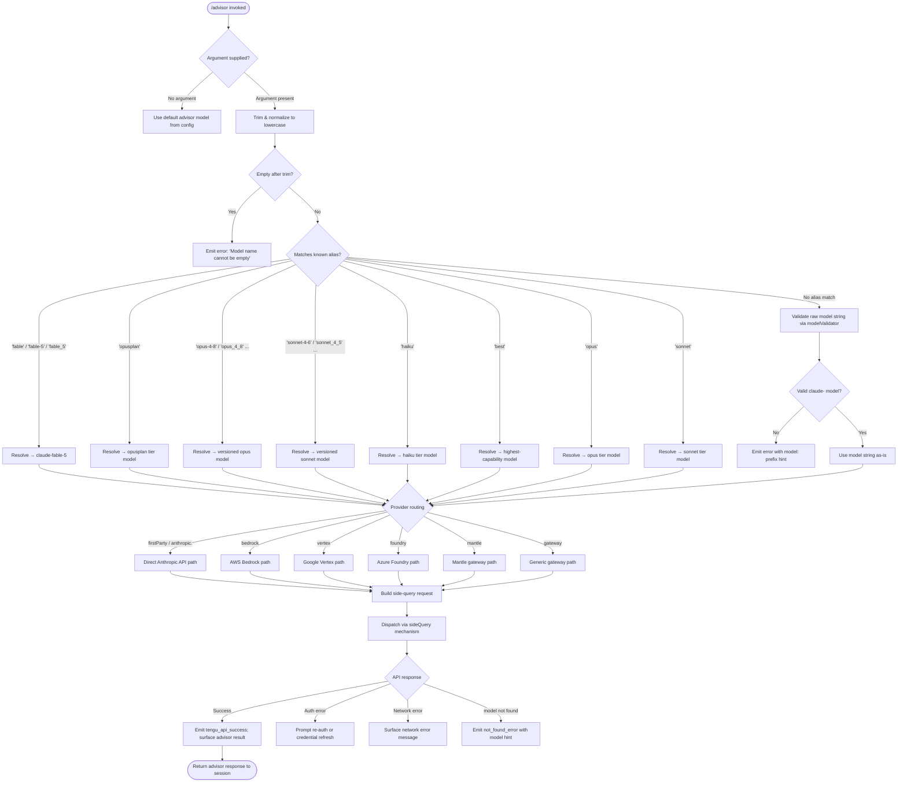

# `/advisor`

> Analysis basis: CC v2.1.195 bundle.js (AST extraction + Claude interpretation)
> Minimum version: v2.1.195

---

## Overview

`/advisor` allows Claude Code to consult a stronger or more capable model at key decision points during a session. The command accepts an optional model name as its argument and orchestrates a "side query" to the designated advisor model, then surfaces the result back to the active session. This enables a lightweight main-model workflow to escalate difficult sub-problems to a more powerful model without switching the primary session context.

---

## Registration

| Field | Value |
|---|---|
| type | `local-jsx` |
| name | `advisor` |
| description | `Let Claude consult a stronger model at key moments` |
| argumentHint | `[ ... ]` |
| isHidden | `null` (not hidden) |
| module_id | `eXl` |
| load_inline | `true` |
| loc_byte | `12952172` |
| loc_byte_end | `12952428` |
| loc_line | `8921` |
| arbor_handler.name | `VVf` |
| arbor_handler.fqn | `claude-2.1.195::VVf` |
| arbor_handler.kind | `AsyncFunction` |
| arbor_handler.resolution_path | `module_id` |
| arbor_handler.n_hits | `2` |

Analysis basis: CC v2.1.195 bundle.js:+12952172

---

## Input Branching

The `/advisor` command passes through several distinct branching paths: model-name validation (empty, alias, or explicit), provider-routing (first-party vs. bedrock/vertex/foundry/mantle/gateway), model-tier selection (fable, opusplan, sonnet, haiku, opus, best), and the side-query dispatch path. Four or more distinct branches require a flowchart.



---

## Behavioral Spec

### Handler Entry — `advisorCommandHandler` (bundle: `VVf`)

The main handler is an `AsyncFunction` resolved via module `eXl` using the `module_id` resolution path.

Analysis basis: CC v2.1.195 bundle.js:+12951650

```
async function advisorCommandHandler(args, appState):
    rawInput = args.trim()                         // +12951650

    # Render JSX loading indicator
    renderAdvisorLoadingUI(rawInput)               // +12951686

    # Resolve effective model name
    resolvedModel = resolveModelAlias(rawInput)    // +12951784

    # Look up context-provider model mapping
    modelConfig = buildProviderModelConfig(
        resolvedModel, appState                    // +12951798
    )

    # Retrieve or build content for the advisor query
    advisorContent = buildAdvisorContent(appState) // +12951824

    # Run validation and dispatch
    result = await dispatchAdvisorQuery(
        modelConfig, advisorContent, appState      // +12951872
    )

    # Render filtered advisor result
    filteredResult = filterAdvisorResult(result)   // +12951945

    return filteredResult
```

---

### Model Alias Resolution — `resolveModelAlias` (bundle: `Ko`)

Normalizes user-supplied model names into canonical API identifiers. Trims whitespace and lowercases before alias lookup.

Analysis basis: CC v2.1.195 bundle.js:+2316767

```
function resolveModelAlias(input):
    trimmed = input.trim()                         // +2316767
    lower = trimmed.toLowerCase()                  // +2316778

    # Tier-keyword aliases (single-word shortcuts)
    if lower == "fable":     return resolveFableModel()           // +2316844
    if lower == "opusplan":  return resolveOpusPlanModel()        // +2316911
    if lower == "sonnet":    return resolveSonnetModel()          // +2316956
    if lower == "haiku":     return resolveHaikuModel()           // +2316999
    if lower == "opus":      return resolveOpusModel()            // +2317041
    if lower == "best":      return resolveBestModel()            // +2317079

    # Versioned model aliases (e.g. "opus-4-8", "opus_4_8")
    # Supported variants include opus-4-{8,7,6,5,1,0}, sonnet-4-{6,5,0}
    if matchesVersionedAlias(lower):
        return canonicalVersionedModel(lower)

    # Direct model string – validate prefix and format
    if not lower.startsWith("claude-"):            // +2317111 (td/mle check)
        emitModelValidationError(lower)
        return null

    return trimmed                                 // pass-through
```

---

### Provider/Model Configuration Builder — `buildProviderModelConfig` (bundle: `yVt`)

Validates the resolved model name, checks against a blocklist (HHe), queries the live model registry (lvo), and emits model-validation telemetry.

Analysis basis: CC v2.1.195 bundle.js:+9190578

```
async function buildProviderModelConfig(modelName, appState):
    trimmed = modelName.trim()                     // +9190578

    if trimmed == "":
        throw Error("Model name cannot be empty")  // +9190615

    lower = trimmed.toLowerCase()                  // +9190763

    # Check if model is on the known-unsupported list
    if globalUnsupportedList.includes(lower):      // +9190782
        emitUnsupportedModelError()
        return null

    # Check the live model registry cache
    if lvo.has(lower):                             // +9190884
        return lvo.get(lower)

    # Run a side_query capability probe
    probeResult = await runSideQuery(              // +9190929
        modelName, appState,
        queryType="side_query"                     // literal: +8645555
    )

    # Cache successful probe result
    lvo.set(lower, probeResult)                    // +9191092

    # Determine canonical internal name via model-family resolution
    resolvedFamily = resolveModelFamily(lower)     // +9191133

    return buildConfigObject(probeResult, resolvedFamily)
```

---

### Model Family Resolution — `resolveModelFamily` (bundle: `grf` / `hrf`)

Maps normalized model name strings to internal family tokens used by the provider routing layer.

Analysis basis: CC v2.1.195 bundle.js:+9191188

```
function resolveModelFamily(lowerModelName):
    # Use provider-tier table (td) for lookup    // +9191885
    tier = tierTable.lookup(lowerModelName)

    lower = lowerModelName.toLowerCase()          // +9191903

    # Family-keyword substring checks
    if lower.includes("fable-5") or lower.includes("fable_5"):
        return "fable_5"                          // +9191933,+9191956
    if lower.includes("opus-4-8") or lower.includes("opus_4_8"):
        return "opus_4_8"                         // +9192033,+9192057
    if lower.includes("opus-4-7") or lower.includes("opus_4_7"):
        return "opus_4_7"                         // +9192102,+9192126
    if lower.includes("opus-4-6") or lower.includes("opus_4_6"):
        return "opus_4_6"                         // +9192171,+9192195
    if lower.includes("opus-4-5") or lower.includes("opus_4_5"):
        return "opus_4_5"                         // +9192240,+9192264
    if lower.includes("sonnet-4-6") or lower.includes("sonnet_4_6"):
        return "sonnet_4_6"                       // +9192309,+9192335
    if lower.includes("sonnet-4-5") or lower.includes("sonnet_4_5"):
        return "sonnet_4_5"                       // +9192384,+9192410

    # Build a canonical qp-style token from family parts   // +9192007
    return buildCanonicalToken(tier, lowerModelName)
```

---

### Provider Routing — `resolveProviderPath` (bundle: `fr` / `l_` / `E8`)

Routes the resolved model to the appropriate backend based on provider type strings.

Analysis basis: CC v2.1.195 bundle.js:+2139683

```
function resolveProviderPath(modelConfig):
    provider = modelConfig.provider

    # Provider type constants
    switch provider:
        case "firstParty":    return anthropicDirectPath()  // +2140574
        case "anthropicAws":  return awsBedrockPath()       // +2140423
        case "gateway":       return gatewayPath()          // +2140443
        case "bedrock":       return bedrockPath()          // +2139751
        case "foundry":       return foundryPath()          // +2139801
        case "mantle":        return mantlePath()           // +2139911
        case "vertex":        return vertexPath()           // +2139959
        default:
            emitProviderError(provider)
            return null
```

---

### Side Query Dispatch — `dispatchAdvisorQuery` (bundle: `SU` / `q8`)

The core API dispatch loop that builds and executes the HTTP request to the advisor model.

Analysis basis: CC v2.1.195 bundle.js:+8645510

```
async function dispatchAdvisorQuery(modelConfig, content, appState):
    # Prepare request metadata
    headers = buildRequestHeaders(appState)        // +3041489..+3041693
    # Headers include: x-app, x-claude-code-session-id, User-Agent,
    # x-client-app, x-claude-code-agent-id, x-anthropic-additional-protection

    # Auth token resolution
    token = await resolveAuthToken(appState)       // +3042072
    # OAuth token check logs: "[API:auth] OAuth token check starting"
    # "[API:auth] OAuth token check complete"      // +3042126

    # Build canonical request payload
    payload = buildApiPayload(
        model = modelConfig.resolvedModelId,
        content = content,
        systemPrompt = buildSystemContext(appState),
        temperature = getAdvisorTemperature(),     // literal "temperature" +3063039
        maxTokens = computeMaxTokens(appState)
    )

    # Apply request timeout (10 minutes default)
    timeoutMs = 600000                             // +3042444
    retryCount = 10                                // +3042452

    try:
        response = await fetch(                    // +2366020
            endpoint,
            {
                headers,
                signal: AbortSignal.timeout(10000) // +2366082
            }
        )
        handleStreamingResponse(response)          // +3050841 (text/event-stream)
        return parseAdvisorResult(response)
    catch AuthError:
        if tokenExpired:
            throw Error("Cloud gateway token expired — refresh ANTHROPIC_AUTH_TOKEN and restart.")
            // +3042693
        if sessionExpired:
            throw Error("Cloud gateway session expired — run /login to reconnect.")
            // +3042772
    catch NetworkError:
        throw Error("Network error. Please check your internet connection.")
        // +9191453
```

---

### Content Filtering — `filterAdvisorResult` (bundle: `Vht` / `zVn`)

Filters the raw advisor response through the session's content pipeline before display.

Analysis basis: CC v2.1.195 bundle.js:+8899922

```
function filterAdvisorResult(rawResult, appState):
    # Apply LZp session content filter
    filtered = LZp.filter(rawResult)               // +8899922

    # Extract advisor-relevant content with provider-model normalizer
    normalized = normalizeAdvisorContent(
        filtered,
        dp,                                        // +8899889
        Ko                                         // +8899892
    )

    return normalized
```

---

### Error Handling — `handleAuthError` (bundle: `Cs`)

Handles terminal errors (auth failure, CLI errors) that may cause process exit.

Analysis basis: CC v2.1.195 bundle.js:+13393551

```
function handleAuthError(err):
    logCliError(err)                               // "cli_error" +13393561
    flushPendingIO()                               // +13393558
    process.exit(1)                                // +13393574
```

---

### Model Validation Error Reporting — `reportModelNotFound` (bundle: `yVt` error path)

When the API returns a `not_found_error` for the specified model, a descriptive error is surfaced with a `model:` prefix hint.

Analysis basis: CC v2.1.195 bundle.js:+9191572

```
function reportModelNotFound(modelName, err):
    if err.type == "not_found_error":              // +9191572
        message = "model:" + modelName             // +9191654
        emitValidationEvent("model_validation")    // +9190979
        displayError(message)
    else:
        displayError(err.message)
```

---

## State & Side Effects

| Item | Detail |
|---|---|
| Telemetry: `tengu_api_success` | Emitted on successful advisor API response (bundle.js:+8647228) |
| Telemetry: `tengu_lone_surrogate_sanitized` | Emitted when lone Unicode surrogates are stripped from request/response (bundle.js:+8646924) |
| Telemetry: `tengu_bg_dispatch_sigkill_escalate` | Emitted if background worker escalation required during advisor dispatch (bundle.js:+17885088) |
| Telemetry: `tengu_bg_spare_enable` | Emitted when a spare background session is activated for dispatch (bundle.js:+17886386) |
| Telemetry: `tengu_bg_spare_claim` | Emitted when a spare background session is claimed (bundle.js:+17886514) |
| Telemetry: `tengu_bg_spare_claim_fail` | Emitted when spare claim fails (bundle.js:+17886780) |
| Telemetry: `tengu_bg_sendclaim_failed` | Emitted when the background send-claim fails (bundle.js:+17878219) |
| Telemetry: `tengu_daemon_yield` | Emitted when daemon yields to a foreground process (bundle.js:+17906757) |
| Telemetry: `tengu_daemon_idle_exit` | Emitted on idle daemon exit (bundle.js:+17907799) |
| Telemetry: `tengu_bg_low_mem_mb` | Emitted on low-memory condition (bundle.js:+13326605) |
| Telemetry: `tengu_bg_dispatch_low_mem` | Emitted when low memory causes dispatch throttle (bundle.js:+17885689) |
| Telemetry: `tengu_prompt_cache_1h_config` | Emitted when 1-hour prompt cache configuration is applied (bundle.js:+13816734) |
| Telemetry: `tengu_feature_ok` | Emitted on successful feature gate check (bundle.js:+1027363) |
| Telemetry: `tengu_feature_bad` | Emitted on failed feature gate check (bundle.js:+1027430) |
| Model registry cache | Resolved advisor model config is stored in `lvo` Map (lvo.set/lvo.has at +9191092/+9190884) |
| Auth token refresh | OAuth flow triggered on expired token; logs "[API:auth] OAuth token check starting/complete" (+3042072/+3042126) |
| Process exit | Fatal auth/CLI errors trigger `process.exit(1)` via error handler (+13393574) |
| Content streaming | Response streamed as `text/event-stream` (+3050841); lone surrogates sanitized before display |
| AbortSignal timeout | Per-request timeout of 10 000 ms applied via `AbortSignal.timeout` (+2366082) |
| Overall request timeout | 600 000 ms (10 minutes) ceiling (+3042444) |
| Retry ceiling | Up to 10 retry attempts (+3042452) |

---

## Version History

| Version | Change |
|---|---|
| v2.1.195 | Initial analysis |

---

## Common Mistakes

1. **Supplying an unrecognized alias** — If the model argument does not match a known tier keyword (`fable`, `opusplan`, `sonnet`, `haiku`, `opus`, `best`) or a versioned alias (e.g. `opus-4-8`), and does not begin with the `claude-` prefix, the command emits a `model:` prefixed error. Always use the documented aliases or the full canonical model ID.

2. **Empty argument after `/advisor`** — Passing only whitespace causes an immediate error: `"Model name cannot be empty"` (bundle.js:+9190615). Either omit the argument to use the configured default, or supply a non-empty model name.

3. **Expecting a synchronous response** — The handler is an `AsyncFunction` with up to a 10-minute overall timeout. Long advisor queries may appear to hang; this is expected behavior while the stronger model processes the request.

4. **Provider mismatch** — When the active session uses a non-first-party provider (Bedrock, Vertex, Foundry, Mantle, gateway), the advisor model must also be available on that provider. The command routes through the same provider context as the main session; specifying a model only available on Anthropic first-party while using a Bedrock session will result in a `not_found_error`.

5. **Expired credentials mid-session** — If the cloud gateway token or session expires while `/advisor` is running, the command surfaces explicit messages: `"Cloud gateway token expired — refresh ANTHROPIC_AUTH_TOKEN and restart."` or `"Cloud gateway session expired — run /login to reconnect."` (bundle.js:+3042693, +3042772). These require manual credential refresh; the command does not auto-retry auth failures.

---

## Appendix — Identifier Mapping

> For bundle debugging only. Identifiers change across versions.

| Identifier | Role |
|---|---|
| `VVf` | Main async handler for `/advisor` command (advisorCommandHandler) |
| `Ko` | Model alias resolver — maps tier keywords and versioned aliases to canonical model IDs |
| `yVt` | Provider/model config builder — validates model name, queries model registry, runs probe |
| `grf` | Model family resolver — outer dispatcher |
| `hrf` | Model family resolver — inner substring matching logic |
| `SU` | Side-query dispatcher — top-level async request orchestrator |
| `q8` | Core API request executor — builds headers, auth, payload, handles streaming |
| `Vht` | Advisor result filter — applies session content filter to raw response |
| `zVn` | Advisor content normalizer — post-filter provider-model normalization |
| `gPe` | Advisor content builder — assembles content for advisor query |
| `cIo` | Content-item extractor — pulls relevant content items from appState |
| `EAn` | Extended content annotation helper |
| `Qnt` | Content-item inclusion check |
| `La` | Tool/message formatter — formats conversation context for side query |
| `PDt` | Model prefix validator — checks claude- prefix, resolves tier/version |
| `aF` | Model-tier feature resolver — maps tier names to capability flags |
| `mo` | Model-options builder — assembles model call options |
| `O_` | Model string normalizer — lowercase + include/replace operations |
| `Cs` | CLI-error terminal handler — logs error and calls process.exit |
| `fr` | Provider token formatter |
| `td` | Tier descriptor lookup |
| `mle` | Model list element checker (Cpd.includes) |
| `ZBe` | Zero-based utility (ut wrapper) |
| `ypd` | Model-name lowercase normalizer |
| `EH` | Model-existence validator |
| `SHe` | Schema helper |
| `ut` | String coercion utility |
| `Ha` | Argument sanitizer (e.replace) |
| `C0` | Allowed-list check (HHe.includes) |
| `QBe` | Query builder — combines GBr, lw, G7, Qwe |
| `GBr` | Grammar-based request builder |
| `qp` | Query parameter assembler |
| `G7` | Generic formatter (fr + _u) |
| `Qwe` | Query string encoder (e.replace) |
| `lw` | Lightweight writer helper |
| `jL` | Join-list formatter |
| `yAn` | Yet-another normalizer |
| `K5` | Key-5 builder (lw + jBr) |
| `jBr` | Join-bracket formatter |
| `L8` | Line-8 formatter (e.replace) |
| `N_` | N-underscore content block builder |
| `Jwe` | Join-with-extension builder |
| `zoi` | Zone-of-interest selector |
| `hle` | Highlight-list extractor |
| `_u` | Underscore-u utility (OEn) |
| `yHe` | Yes-here element checker (Mt + Array.isArray) |
| `_He` | Underscore-He item filter (e.includes) |
| `mkt` | Market-key tool (_vs + Hvs) |
| `gkt` | Get-key-table builder (Qns, Object.keys, Vae, Amn, vve, p3, jae, dkt, Zns) |
| `fte` | Filter-table-entry validator |
| `w8` | Write-8 helper (fr + gpd + ODt) |
| `sF` | Supported-flag checker (fpd.includes) |
| `HAn` | H-annotation builder |
| `qoi` | Query-object-items iterator (Object.entries) |
| `Hn` | H-node builder (gmn + p3) |
| `Ant` | Annotation tool builder (Mr + Object.entries) |
| `Voi` | Value-of-index finder (sF + n.indexOf) |
| `hpd` | H-parameter descriptor (C0 + PDt + Ko + Woi) |
| `Hpd` | H-prefix descriptor (C0 + Ko + joi + t.startsWith) |
| `eLe` | Extended-list element (LAn sub-call) |
| `LAn` | Language-annotator — builds context annotation string |
| `ml` | Multiline string helper (String) |
| `vAn` | Variable-annotator (Zoi.getStore) |
| `e0n` | E-zero-n formatter (fr) |
| `LP` | Language-provider selector (G8r + $9e) |
| `G8r` | Get-8-request builder (fr) |
| `$9e` | Dollar-9-e builder (ut + v8) |
| `Dvn` | Dispatch-v-n (K8 + mo + n.includes) |
| `gw` | Get-writer (e.map) |
| `uke` | Use-key extractor |
| `a6` | A-6 utility (Mt + Njo.randomBytes + gn + T) |
| `kc` | Key-chain (eE + Mt) |
| `Fin` | Finalizer (t.pop + Array.isArray + Uin + t.push + Object.keys) |
| `Uin` | U-in validator (Nin + IYc.test) |
| `aP` | A-P cloner (structuredClone) |
| `qXe` | Query-X-e extractor |
| `$in` | Dollar-in builder (lis + e.replace) |
| `B3r` | B-3-r formatter (fr + uii) |
| `uii` | U-i-i parser (e.match, t.split, r.every, cii.test, Pfd.test) |
| `F3r` | F-3-r filter (gvt + r.get + t.every + o.has + s.add + r.set) |
| `br` | Base-router (xh + je) |
| `xh` | X-h renderer (OJe) |
| `No` | N-o renderer (OJe) |
| `t2t` | T-2-t transformer (Mzi + flt + e2t) |
| `Mzi` | M-z-i (Ozd + xe) |
| `flt` | F-l-t (xh) |
| `e2t` | E-2-t (flt + ZFt) |
| `YF` | Y-F dispatcher (Pzd + RP + xe) |
| `Pzd` | P-z-d path builder (e.startsWith + e.slice + jDn + _Kr + RP) |
| `RP` | Route-prefix checker (e.startsWith) |
| `iLe` | I-l-e provider-type checker (urt + e.provider + Le + String + ke + xfd + T) |
| `urt` | URL-request-token builder — WIF/auth credential resolution and fetch |
| `iJp` | I-J-p finder (e.find + n.find) |
| `vbo` | V-b-o hasher (QJa.createHash, sha256, hex) |
| `DHn` | D-H-n proxy-auth helper — proxyAuthHelper flow with trust check |
| `zxd` | Z-x-d streaming-response handler — UUID, content-type, chunk-times |
| `Kxd` | K-x-d chunk handler (yIi + hIi + fr) |
| `Gxd` | G-x-d response decoder (Ivn + T2e + SXe + Qie + U3r + Lm + Os) |
| `sLe` | S-l-e timing helper (Lm + Date.now + Promise.resolve + Myr + Tfd + hsn) |
| `xyr` | X-y-r timestamp (Date.now) |
| `K1t` | K-1-t header normalizer (Object.entries + r.toLowerCase) |
| `YLe` | Y-l-e error logger (console.error) |
| `Ivn` | I-v-n response validator (GC + As + mo + T2e) |
| `Qie` | Q-i-e model-support finder ($Kc.find + e.startsWith + Nsn) |
| `uw` | U-w wrapper (TH) |
| `ab` | A-b request builder — profile-implicit, user_oauth, auth type routing |
| `PZo` | P-Z-o socket/claim helper — BK.claim, socket auth, Ehr.connect |
| `FZo` | F-Z-o session file manager — state.json, roster, daemon lifecycle |
| `xe` | X-e background error reporter (Zr + ut + qi + BMu + GZe.push + Gee.logError) |
| `q5e` | Q-5-e cache-file cleaner (gT.lstat/rm/readFile + Bt + Cn + Tzd) |
| `yar` | Y-a-r low-memory checker (Vt + at) — macos platform |
| `at` | A-t session-roster manager (lUt + cUt + f6 + hxe.has + bxn + iUt.add + rV) |
| `h` | H — background session orchestrator (main bg dispatch loop) |
| `Oe` | O-e renderer (OJe) |
| `je` | J-e renderer (OJe) |
| `OJe` | O-J-e — base JSX rendering primitive |
| `$8e` | Dollar-8-e — main-thread repl runner (ut + fr + yo + uEr + at + dEr) |
| `yo` | Y-o render helper (eE + y3 + js) |
| `MKe` | M-K-e — state getter (lK.getState) |
| `PVt` | P-V-t — local workflow manager (U2 + bv + K0) |
| `K5t` | K-5-t — away-summary generator (Cde + T + fx + Rn + QPa) |
| `Ccc` | C-c-c — UUID generator (i1.randomUUID) |
| `eXa` | E-X-a — extra annotation helper |
| `URe` | U-R-e — loop state checker (TC) |
| `jCm` | J-C-m — context manager (Rfr) |
| `mkc` | M-k-c — message key checker (e.at) |
| `gkc` | G-k-c — get-key-context (Rfr) |
| `Le` | L-e — provider credential builder (W + Oe) |
| `ke` | K-e — key extractor (W + Oe) |
| `Un` | U-n — async timer (o + Error + r + setTimeout + clearTimeout + s.unref) |
| `_le` | Underscore-l-e — model-list fetcher (gvt + n.get + $3r) |
| `$3r` | Dollar-3-r — foundry resource formatter (e.replace + U3r) |
| `F9e` | F-9-e — model-capability probe (mo + l_ + nN + t.includes) |
| `nN` | N-N — n-n helper (fr) |
| `l_` | L-underscore — model-string builder (QMt + Tld + fr + E8) |
| `QMt` | Q-M-t — qualifier-map-token (fr + ut) |
| `Tld` | T-l-d — token-list descriptor (e.startsWith) |
| `E8` | E-8 — model enumeration (e.toLowerCase + Object.values + r.toLowerCase) |
| `Kwe` | K-w-e — key-with-extension (rpd) |
| `dp` | D-p — display-path formatter (e.replace) |
| `$vt` | Dollar-v-t — value token accessor |
| `Lm` | L-m — log-message emitter |