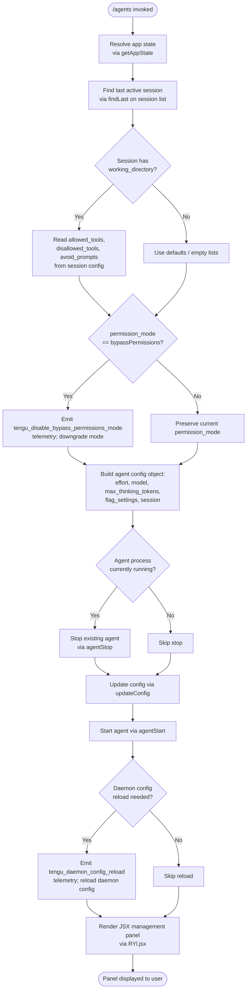

# `/agents`

> Analysis basis: CC v2.1.195 bundle.js (AST extraction + Claude interpretation)
> Minimum version: v2.1.195

---

## Overview

The `/agents` command opens the agent configuration management interface in Claude Code, allowing users to inspect, start, stop, and reconfigure background agent processes (daemon/supervisor agents). It resolves current application state, reads active agent records, and renders a JSX management panel through which configuration changes are applied and reloaded.

---

## Registration

| Field | Value |
|---|---|
| type | `local-jsx` |
| name | `agents` |
| description | `Manage agent configurations` |
| loc_byte | `12900905` |
| loc_byte_end | `12901030` |
| loc_line | `8910` |
| module_id | `xYl` |
| load_inline | `true` |
| arbor_handler.name | `P8f` |
| arbor_handler.fqn | `claude-2.1.195::P8f` |
| arbor_handler.kind | `AsyncFunction` |
| arbor_handler.resolution_path | `module_id` |
| arbor_handler.n_hits | `0` |

Analysis basis: CC v2.1.195 bundle.js:+12900905

The handler `P8f` was resolved by following the `module_id` → `xYl` → module exports path. It is an `AsyncFunction`, meaning the command performs asynchronous I/O (file stat, agent process control) before rendering its JSX panel.

---

## Input Branching

The command has more than three distinct branching paths across its call graph (agent configuration read, allowed-tools filtering, permission-mode checks, daemon start/stop, config reload), so a Mermaid flowchart is used.



---

## Behavioral Spec

### Entry Point — Agent Command Handler

The primary handler is `P8f` (AsyncFunction, resolved via module `xYl`).

Analysis basis: CC v2.1.195 bundle.js:+12900766

```
async function agentCommandHandler(context):
    appState = getAppState(context)
    agentListPanel = buildAgentListPanel(appState)
    jsxPanel = renderJSX(agentListPanel)
    return jsxPanel
```

### Sub-feature: App State Resolution (`Br`)

Analysis basis: CC v2.1.195 bundle.js:+11065876

```
function resolveAppState(context):
    state = context.getAppState()

    // Find the most recent session with a working_directory
    lastSession = state.sessions.findLast(
        session => session.has("working_directory")
    )

    config = {
        working_directory : lastSession?.working_directory,   // bundle.js:+11065981
        allowed_tools     : lastSession?.allowed_tools,       // bundle.js:+11066036
        disallowed_tools  : lastSession?.disallowed_tools,    // bundle.js:+11066091
        avoid_prompts     : lastSession?.avoid_prompts,       // bundle.js:+11066152
        permission_mode   : lastSession?.permission_mode,     // bundle.js:+11066254
        bypassPermissions : lastSession?.bypassPermissions,   // bundle.js:+11066285
        session           : lastSession?.session,             // bundle.js:+11066584
        effort            : lastSession?.effort,              // bundle.js:+11066609
        model             : lastSession?.model,               // bundle.js:+11066622
        max_thinking_tokens: lastSession?.max_thinking_tokens,// bundle.js:+11066634
        flag_settings     : lastSession?.flag_settings        // bundle.js:+11066660
    }
    return config
```

### Sub-feature: Permission Mode Guard (`xF` → `at`)

Analysis basis: CC v2.1.195 bundle.js:+11066307, +3420566

```
function checkAndDowngradeBypassPermissions(config):
    if config.permission_mode == "bypassPermissions":  // bundle.js:+11066285
        emit telemetry("tengu_disable_bypass_permissions_mode")  // bundle.js:+3420569
        config.permission_mode = "disable"             // bundle.js:+3420670
        // Record in de-duplication set to avoid repeat events
        markSeen(deduplicationRegistry)               // bundle.js:+3356196
    return config
```

The literal `"disable"` (bundle.js:+3420670) is the downgraded permission mode value written back when bypass-permissions mode is detected. The literal `1` (bundle.js:+3420610) gates the condition check depth.

### Sub-feature: Allowed-Tools Filtering (`uZn`, `dZn`)

Analysis basis: CC v2.1.195 bundle.js:+11066054, +11066112

```
function filterAllowedTools(toolList, sessionConfig):
    allowedSet  = buildToolSet(sessionConfig.allowed_tools,   "allowed_tools")
    disallowedSet = buildToolSet(sessionConfig.disallowed_tools, "disallowed_tools")

    return toolList.filter(tool =>
        (allowedSet.isEmpty() OR allowedSet.has(tool)) AND
        NOT disallowedSet.has(tool)
    )

// Each set builder calls Fo (shared set-builder utility)
// Analysis basis: CC v2.1.195 bundle.js:+11058645, +11058793
```

### Sub-feature: Agent Panel Data Builder (`jO`)

Analysis basis: CC v2.1.195 bundle.js:+10499003

`jO` is the panel data builder. It assembles all data needed by the JSX panel:

```
async function buildAgentPanelData(config):
    // 1. Resolve transport/endpoint descriptor (Dw)
    //    Supports "cli" (bundle.js:+5116105) and "remote" (bundle.js:+5116116) modes
    transport = resolveTransport(config)             // Dw, bundle.js:+5115953

    // 2. Build supervisor record set (pko)
    supervisors = buildSupervisorList(config)        // bundle.js:+10499090
    //    Each supervisor entry tagged with label "supervisor" (bundle.js:+17901535)

    // 3. Build MCP server capability set (XE)
    mcpCapabilities = resolveMCPCapabilities(config) // bundle.js:+10499104
    //    Checks allow_workflows (bundle.js:+3397169), allow_product_feedback

    // 4. Filter blocked tool entries (zoe)
    filteredTools = filterBlockedTools(config.tools) // bundle.js:+10499126
    //    Blocked status literal: "blocked" (bundle.js:+10498499)

    // 5. Assemble feature-flag checked entries (fko)
    featureFlaggedItems = buildFeatureFlaggedList(config) // bundle.js:+10499141

    // 6. Build daemon-status items (Eu, p4)
    daemonStatus = buildDaemonStatus(config)         // bundle.js:+10499153, +10499320
    //    Reads daemon.status.json (bundle.js:+13071674)
    //    Uses Date.now for freshness check (bundle.js:+13071787)

    // 7. Check feature enable state (cl.isEnabled, c.isEnabled)
    enabledItems = config.tools
        .filter(t => NOT kctBlocklist.has(t))        // bundle.js:+10499480
        .map(t => ({ tool: t, enabled: checkEnabled(t) })) // bundle.js:+10499508

    // 8. Apply local-agent type label
    //    Literal "local-agent" (bundle.js:+7203445)

    // 9. Build final panel items list and push to display buffer
    panelItems = [
        ...supervisors,
        ...mcpCapabilities,
        ...filteredTools,
        ...featureFlaggedItems,
        ...daemonStatus,
        ...enabledItems
    ]
    return panelItems
```

### Sub-feature: Daemon Control — Stop / Update / Start (`d`)

Analysis basis: CC v2.1.195 bundle.js:+17901803, +17901923, +17901932, +17901950

```
async function controlDaemon(agentRecord, newConfig):
    // Stop existing agent (E.stop)
    await agentStop(agentRecord)       // E.stop, bundle.js:+17901803
    agentRegistry.delete(agentRecord)  // bundle.js:+17901812

    // Stop supervisor process (A.stop)
    await supervisorStop(agentRecord)  // A.stop, bundle.js:+17901923
    //    Sends SIGTERM (bundle.js:+17887036)
    //    Checks userinfo sub match (bundle.js:+17728218)

    // Apply new configuration
    agentRecord.updateConfig(newConfig) // bundle.js:+17901932

    // Restart agent
    await agentStart(agentRecord)      // A.start, bundle.js:+17901950

    // Emit config reload telemetry
    emit telemetry("tengu_daemon_config_reload") // bundle.js:+17902328

    // Store updated record
    agentRegistry.set(agentRecord.id, agentRecord) // bundle.js:+17902097
```

Connection states observed in literals: `"connected"` (bundle.js:+17423336), `"error"` (bundle.js:+1058206), `"failed"` / `"Connection failed"` (bundle.js:+17423523, +17423541).

Agent transport types: `"sdk"` (bundle.js:+17423200), `"http"` (bundle.js:+17420358), `"sse"` (bundle.js:+17420375), `"dynamic"` (bundle.js:+17420455).

### Sub-feature: Daemon Status Read (`LZl`)

Analysis basis: CC v2.1.195 bundle.js:+17901031

```
function readDaemonStatus(statusDir):
    // File: "daemon.status.json" (bundle.js:+13071674)
    statusPath = joinPath(statusDir, "daemon.status.json")
    freshness  = Date.now()                        // bundle.js:+13071787
    rawStatus  = readStore(statusPath)             // Vs, Nld.getStore
    parsedStatus = parseStatusJson(rawStatus)
    return {
        path      : statusPath,
        timestamp : freshness,
        data      : parsedStatus
    }
```

### Sub-feature: File Stat Guard (`C7e`)

Analysis basis: CC v2.1.195 bundle.js:+13245394

```
async function statGuardedRead(filePath):
    try:
        stat = await fs.stat(filePath)
    catch err:
        if err.code == "ENOENT":         // bundle.js:+13245425
            return Promise.reject(err)
    if NOT stat.isFile():
        return Promise.reject(new Error("not a file"))
    if stat.size > 1048576:              // 1 MiB, bundle.js:+13245485
        return Promise.reject(new Error("file too large"))
    content = readFile(filePath)
    return content
```

Maximum file size: **1,048,576 bytes (1 MiB)** (bundle.js:+13245485).

### Sub-feature: Supervisor List Display (`Vtc`)

Analysis basis: CC v2.1.195 bundle.js:+17901729

```
function formatSupervisorTable(supervisors):
    keys       = Object.keys(supervisors)           // bundle.js:+13246615
    maxWidth   = Math.max(...keys.map(k => k.length)) // bundle.js:+13246660
    rows       = keys.map(k =>
        k.padEnd(maxWidth) + "  " + supervisors[k]  // "  " separator, bundle.js:+17913496
    )
    // Column width cap: 40 characters (bundle.js:+17915470)
    return rows
```

Column separator: two spaces (`"  "`, bundle.js:+17913496). Maximum column display width: **40 characters** (bundle.js:+17915470).

### Sub-feature: Daemon Stop Event Sequence (`u` / `Le` / `ke`)

Analysis basis: CC v2.1.195 bundle.js:+17924516, +17924539

```
async function daemonStopSequence(daemonHandle):
    try:
        emit telemetry("tengu_daemon_control")   // bundle.js:+17924594
        result = await stopDaemon(daemonHandle)  // Le, W, Oe path
        emit telemetry("tengu_feature_ok")       // bundle.js:+1027363
        return { status: "stopped", label: "background session" } // bundle.js:+17924428, +17924471
    catch err:
        emit telemetry("tengu_feature_bad")      // bundle.js:+1027430
        emit telemetry("tengu_daemon_control")   // label: "daemon_stop_failed"
        return { status: "daemon_stop_failed" }  // bundle.js:+17924556
```

Successful stop label: `"daemon_stop"` (bundle.js:+17924519).  
Failure label: `"daemon_stop_failed"` (bundle.js:+17924556).

### Sub-feature: Workflows Feature Flag Check (`vNi` → `Fs`)

Analysis basis: CC v2.1.195 bundle.js:+3396861, +3376432

```
function checkWorkflowsEnabled(featureFlags, context):
    if NOT featureFlags.has("allow_workflows"):   // bundle.js:+3397169
        return false
    if featureFlags.has("allow_product_feedback"):// bundle.js:+3376504
        // additional gate check
    enabled = evaluateFeature("allow_workflows", context)
    if enabled:
        emit telemetry("tengu_workflows_enabled") // bundle.js:+3397370
    return enabled
```

### Sub-feature: Slate Harbor / Cobalt Ridge Telemetry (`Dw`, `YN`)

Analysis basis: CC v2.1.195 bundle.js:+5116135, +5113430

These are internal feature-flag telemetry events fired during transport and session resolution:

- `tengu_slate_harbor` — emitted when the transport mode resolves; differentiates `"cli"` vs `"remote"` endpoints (bundle.js:+5116105, +5116116).
- `tengu_cobalt_ridge` — emitted during platform check; the `"windows"` platform literal (bundle.js:+5113336) gates a branch before this event fires (bundle.js:+5113430).

### Sub-feature: JSX Panel Render (`P8f` → `RYl.jsx`)

Analysis basis: CC v2.1.195 bundle.js:+12900787

```
function renderAgentPanel(panelData):
    // RYl.jsx renders the final React/Ink component
    return RYl.jsx(AgentManagementPanel, {
        agents      : panelData.agents,
        supervisors : panelData.supervisors,
        mcpServers  : panelData.mcpCapabilities,
        daemonStatus: panelData.daemonStatus
    })
```

The registration type `local-jsx` means the returned value is a JSX element rendered directly into the CLI terminal UI, not a plain text response.

---

## State & Side Effects

| Item | Detail |
|---|---|
| Telemetry: `tengu_disable_bypass_permissions_mode` | Fired when the resolved session has `bypassPermissions` set; permission mode is downgraded to `"disable"` (bundle.js:+3420569) |
| Telemetry: `tengu_slate_harbor` | Fired during transport resolution (CLI vs remote) (bundle.js:+5116135) |
| Telemetry: `tengu_daemon_config_reload` | Fired after agent stop+update+start cycle completes (bundle.js:+17902328) |
| Telemetry: `tengu_workflows_enabled` | Fired when `allow_workflows` feature flag evaluates to true (bundle.js:+3397370) |
| Telemetry: `tengu_cobalt_ridge` | Fired during platform/session detection, Windows-gated (bundle.js:+5113430) |
| Telemetry: `tengu_feature_ok` | Fired on successful daemon stop (bundle.js:+1027363) |
| Telemetry: `tengu_feature_bad` | Fired on daemon stop failure (bundle.js:+1027430) |
| Telemetry: `tengu_daemon_control` | Fired during daemon control operations (start/stop) (bundle.js:+17924594) |
| appState changes | Reads session list via `getAppState`; writes updated agent config via `updateConfig`; updates agent registry map (`i.set`, `i.delete`) |
| File I/O | Reads `daemon.status.json` for current daemon health; stats config files with 1 MiB size guard |
| Process signals | Sends `SIGTERM` to supervisor process on stop (bundle.js:+17887036) |
| Agent lifecycle | Calls agentStop → updateConfig → agentStart; manages a Set of pending operations (add/delete via `r.add`, `r.delete`) |
| Daemon registry | Maintains an in-memory Map of active agents (`i`); entries added on start, removed on stop |
| Hook registration | `"heartbeat"` event registered on supervisor channel (bundle.js:+17900756) |
| Sound | None observed |

---

## Version History

| Version | Change |
|---|---|
| v2.1.195 | Initial analysis |

---

## Common Mistakes

1. **Expecting a text response**: `/agents` is registered as `local-jsx`, so it renders an interactive terminal UI panel, not a textual reply. Scripting tools that capture stdout may receive no useful text output.

2. **Assuming bypass-permissions mode persists**: If the current session has `bypassPermissions` active, `/agents` silently downgrades the permission mode to `"disable"` before rendering. Users who expect to manage agents in bypass mode will find it has been cleared.

3. **Confusing allowed_tools and disallowed_tools precedence**: Both lists are read from the most-recent session with a `working_directory`. If neither list is set, all tools pass filtering. `disallowed_tools` takes precedence over `allowed_tools` for the same tool name.

4. **File size limit on config reads**: Agent configuration files larger than **1,048,576 bytes (1 MiB)** are rejected with an error before any panel data is assembled. Oversized configs will prevent the panel from loading.

5. **Daemon status staleness**: The daemon status is read from `daemon.status.json` at invocation time using `Date.now()` for freshness tracking. There is no live-refresh; re-invoke `/agents` to see updated status.

6. **Windows platform branch**: The `tengu_cobalt_ridge` path contains a Windows-specific branch. Behavior on Windows may differ from POSIX platforms at the session-resolution step.

---

## Appendix — Identifier Mapping

> For bundle debugging only. Identifiers change across versions.

| Identifier | Role |
|---|---|
| `P8f` | Main async handler for `/agents` command (entry point) |
| `Br` | App-state resolver; reads session config fields (working_directory, tools, etc.) |
| `uZn` | Allowed-tools set builder (calls shared set utility `Fo`) |
| `dZn` | Disallowed-tools set builder (calls shared set utility `Fo`) |
| `Fo` | Shared tool-set builder utility |
| `xF` | Permission-mode guard; triggers bypass-permissions downgrade |
| `at` | Permission-mode check and de-duplication registry updater |
| `lUt` | Sub-utility called within permission check (`at`) |
| `cUt` | Sub-utility called within permission check (`at`) |
| `f6` | Inner helper inside permission check; calls `p6` |
| `bxn` | De-duplication logic within permission check; uses `VKr`/`hxe` Sets |
| `Mt` | Timestamp/metrics recorder called from permission check path |
| `jO` | Agent panel data builder (assembles all panel records) |
| `Dw` | Transport/endpoint descriptor resolver (CLI vs remote) |
| `_5` | Sub-utility within transport resolution |
| `ml` | String-wrapping utility (calls `String()`) |
| `ut` | String conversion utility (calls `String()`) |
| `C7e` | File stat guard with 1 MiB size check |
| `on` | File read helper called from file stat guard |
| `Vs` | Store accessor (calls `Nld.getStore`) |
| `y5o` | Sub-utility within file read path |
| `ye` | String wrapper utility |
| `Vtc` | Supervisor table formatter (Object.keys + Math.max + padEnd) |
| `E` | Agent stop controller; manages SDK/HTTP/SSE connection teardown |
| `kIt` | HTTP connection close sub-handler |
| `xe` | Error logger and cleanup handler within stop sequence |
| `Zr` | Error string normaliser |
| `A` | Supervisor process controller (start/stop/updateConfig/userinfo) |
| `nhr` | Array-check helper within supervisor control |
| `thr` | String slice/replace utility used in supervisor control |
| `H` | Supervisor process handle; exposes `.userinfo`, `.kill`, `.values` |
| `EWc` | Daemon config reload trigger |
| `dce` | Sub-handler within daemon config reload |
| `I` | Agent start controller (Math.max, Math.floor, preventDefault) |
| `M` | MCP server / OAuth session handler (large; manages auth flows) |
| `W` | Shared JSX render helper |
| `pko` | Supervisor list assembler |
| `ro` | Module initialisation helper (sets `__esModule`, calls `ion`) |
| `ion` | Module binding helper (`.bind`) |
| `XE` | MCP capability resolver |
| `Bxn` | MCP capability sub-resolver; calls `ut`, `c0` |
| `c0` | Capability flag getter |
| `vNi` | Workflows feature-flag resolver |
| `Fs` | Feature-flag evaluator (checks `allow_product_feedback`, `allow_workflows`) |
| `Szr` | Secondary MCP capability resolver |
| `nNd` | MCP capability sub-builder |
| `tNd` | Capability flag secondary getter |
| `zoe` | Blocked-tool filter |
| `XKt` | Tool permission evaluator (COe, pK, LWo, RWo) |
| `COe` | Tool permission deny-list check (uses `prm` Set) |
| `pK` | Tool permission allow-workflow check |
| `LWo` | Tool permission detailed evaluator (Dhe, omn, Tve, dkr, nw) |
| `RWo` | Tool permission fallback handler |
| `fko` | Feature-flag-gated item list builder |
| `YN` | Platform-aware session resolver (Windows branch, cobalt ridge telemetry) |
| `Eu` | Session/config builder utility |
| `u` | Daemon stop sequence orchestrator |
| `Le` | Daemon stop success handler (emits `tengu_feature_ok`) |
| `Oe` | Stop success sub-handler (calls `OJe`) |
| `ke` | Daemon stop failure handler (emits `tengu_feature_bad`) |
| `SF` | Daemon control event dispatcher (uses `GKr`, UUID generation) |
| `p6` | Event emitter base (calls `D3`) |
| `y4e` | Event label builder (calls `YL`) |
| `GKr` | Event record creator (randomUUID, `zot`, `a6`, `e.emit`) |
| `yj` | Graceful shutdown sequencer (Promise.race + Promise.all + process.exit) |
| `T_e` | Shutdown signal handler (calls `b_e.shutdown`) |
| `k_e` | Timeout cleanup on shutdown (clearTimeout, `Wjo`) |
| `Un` | Timeout/abort promise factory (setTimeout, clearTimeout, `s.unref`) |
| `p4` | Daemon status and feature check builder |
| `$pt` | Local-agent config resolver (calls `Hv`, `Eu`) |
| `Hv` | Agent type resolver (emits `"local-agent"` label; calls `gyr`) |
| `Ab` | String-wrap helper within agent resolution |
| `Eyt` | Feature-flag sub-evaluator within `p4` |
| `aO` | Agent options builder (VBt, T, fr, _u) |
| `VBt` | Agent variant selector (`"standard"`, `"tst"`, `"tst-auto"` modes) |
| `T` | Input normaliser (trim, toUpperCase, includes checks) |
| `fr` | Backend type resolver (`"gateway"`, `"bedrock"`, `"foundry"`, etc.) |
| `_u` | OAuth/environment config resolver (calls `OEn`) |
| `Zl` | Feature-flag read helper |
| `c` | Feature-enable checker (calls `yn`) |
| `yn` | Feature flag inner evaluator |
| `l` | Daemon include-check helper (calls `LZl`) |
| `LZl` | Daemon status JSON reader (reads `daemon.status.json`, calls `Vs`, `WXt`, `Me`) |
| `Hte` | Status entry parser (calls `THe`) |
| `WXt` | Status path builder (`wZl.join`, `tr`) |
| `Me` | JSON serialiser wrapper (calls `JSON.stringify`) |