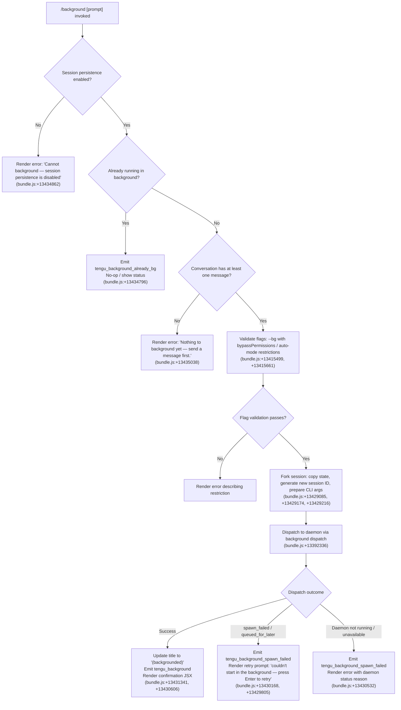

# `/background`

> Analysis basis: CC v2.1.195 bundle.js (AST extraction + Claude interpretation)
> Minimum version: v2.1.195

---

## Overview

The `/background` command (alias `/bg`) sends the current interactive REPL session to the background daemon, freeing the terminal for other work while the session continues running asynchronously. It achieves this by forking the session state, dispatching the session to the Claude Code daemon process, and updating the terminal title to indicate the backgrounded state. An optional prompt argument can be passed to the session as a follow-up task before detaching.

---

## Registration

| Field | Value |
|---|---|
| type | `local-jsx` |
| name | `background` |
| description | `Send this session to the background and free the terminal` |
| aliases | `["bg"]` |
| argumentHint | `[prompt]` |
| immediate | `null` |
| module_id | `voc` |
| load_inline | `true` |
| loc_byte | `13435542` |
| loc_byte_end | `13435782` |
| loc_line | `9333` |
| arbor_handler.name | `IQf` |
| arbor_handler.fqn | `claude-2.1.195::IQf` |
| arbor_handler.kind | `AsyncFunction` |
| arbor_handler.resolution_path | `module_id` |
| arbor_handler.n_hits | `0` |

Analysis basis: CC v2.1.195 bundle.js:+13435542

---

## Input Branching

The handler has more than 3 distinct branches covering precondition checks, daemon availability states, and dispatch outcomes.



---

## Behavioral Spec

### 1. Handler Entry Point (`IQf`)

The Arbor-resolved handler `IQf` is an `AsyncFunction` that orchestrates the entire `/background` flow.

```
async function handleBackgroundCommand(args, context):
    prompt = args.remainder  // optional text after /background

    // Precondition 1: session persistence
    if not context.sessionPersistenceEnabled:
        return renderError("Cannot background — session persistence is disabled, ...")
        // bundle.js:+13434862

    // Precondition 2: already backgrounded
    if context.isAlreadyBackground:
        emit("tengu_background_already_bg")  // bundle.js:+13434796
        return renderCurrentBackgroundStatus()

    // Precondition 3: conversation must exist
    if conversationMessages.length == 0:
        return renderError("Nothing to background yet — send a message first.")
        // bundle.js:+13435038

    // Flag validation (bypassPermissions, auto mode)
    validateFlagsForBackground(context)  // bundle.js:+13415499, +13415661

    // Build forked session arguments
    cliArgs = buildBackgroundArgs(context, prompt)
    // Includes: --resume, --fork-session, --reply-on-resume, --allowed-tools,
    //           --disallowed-tools, --model, --effort, --permission-mode,
    //           --add-dir flags
    // bundle.js:+13429161, +13429174, +13429216, +13429303, +13429344,
    //            +13429375, +13429404, +13429421, +13429268

    // Dispatch to daemon
    result = await dispatchToBackground(cliArgs, context)
    // bundle.js:+13392336

    // Handle dispatch outcome
    return renderDispatchResult(result, context)
```

Analysis basis: CC v2.1.195 bundle.js:+13434782

---

### 2. Flag Validation (`buildBackgroundArgs` sub-step)

Before forking, the handler applies two safety gates:

```
function validateFlagsForBackground(context):
    if context.permissionMode == "bypassPermissions":
        if not context.bypassPermissionsDisclaimerAccepted:
            renderError("--bg with bypassPermissions requires accepting the disclaimer first...")
            // bundle.js:+13415499
            abort()

    if context.permissionMode == "auto":
        if not context.autoModeOptedIn:
            renderError("--bg with auto mode requires opting in first...")
            // bundle.js:+13415661
            abort()
```

Analysis basis: CC v2.1.195 bundle.js:+13415330, +13415499, +13415641, +13415661

---

### 3. Session Fork and Argument Construction (`Qar`)

The primary call-graph entry for background dispatch is `Qar`. It collects the current session state and assembles a flat argument array for the daemon-spawned child process.

```
function buildBackgroundArgs(context, prompt):
    args = []

    // Identity / session continuity
    args.push("--resume", currentSessionId)          // bundle.js:+13429161
    args.push("--fork-session")                      // bundle.js:+13429174
    if prompt:
        args.push("--reply-on-resume", prompt)       // bundle.js:+13429216

    // Tool configuration (flatMap over allowed/disallowed sets)
    args.push(...flatMap(allowedTools, t => ["--allowed-tools", t]))   // bundle.js:+13429303
    args.push(...flatMap(disallowedTools, t => ["--disallowed-tools", t])) // bundle.js:+13429344

    // Model, effort, permission mode, additional directories
    if context.model:
        args.push("--model", context.model)          // bundle.js:+13429375
    if context.effort:
        args.push("--effort", context.effort)        // bundle.js:+13429404
    if context.permissionMode:
        args.push("--permission-mode", context.permissionMode) // bundle.js:+13429421
    for dir in context.additionalDirs:
        args.push("--add-dir", dir)                  // bundle.js:+13429268

    // Sentinel to stop arg parsing
    args.push("--")                                   // bundle.js:+13429449

    return args
```

Analysis basis: CC v2.1.195 bundle.js:+13429045, +13429085, +13429252, +13429287, +13429328

---

### 4. Daemon Dispatch (`p6o` / `TZ` sub-graph)

The dispatch layer (`TZ` → `iQf` → `p6o`) connects to the background daemon over a Unix socket, writes a dispatch file, and awaits an acknowledgement.

```
async function dispatchToBackground(args, context):
    // Ensure daemon is running (may spawn transiently)
    daemonStatus = await ensureDaemonRunning()   // bundle.js:+13348589
    // Timeout: 40000 ms for daemon poll          // bundle.js:+13348645

    if daemonStatus == "not_running":
        emit("tengu_bg_daemon_cold_start_ask")
        return { status: "daemon_unavailable" }

    // Generate unique dispatch directory
    dispatchId = crypto.randomUUID()             // bundle.js:+13395433
    tmpDir = path.join(daemonDir, "tmp", dispatchId.slice(0, 8))
    fs.mkdir(tmpDir)                             // bundle.js:+13395493

    // Write dispatch file (job description JSON)
    writeDispatchFile(tmpDir, args)              // bundle.js:+13391198

    // Connect to daemon socket and wait for ack
    // Ack timeout: 6000 ms                      // bundle.js:+13390723
    ackResult = await waitForAck(dispatchId)     // bundle.js:+13391378

    if ackResult == "EALIVE":
        emit("tengu_bg_dispatch")
        return { status: "dispatched" }
    elif ackResult == "ESTALE" or ackResult == "stale-short":
        emit("tengu_bg_dispatch_fallback")
        return { status: "stale_short" }
    elif ackResult == "ESTARTING":
        return { status: "short_alive" }
    else:
        return { status: "spawn_failed", reason: ackResult }
```

Analysis basis: CC v2.1.195 bundle.js:+13392336, +13390494, +13390502, +13390723, +13391378, +13391474

---

### 5. Spare-Session Management (`PZo`, `h` sub-graph)

The daemon maintains a pool of spare sessions to reduce cold-start latency. On dispatch, a spare session may be claimed:

```
function trySpareClaim(dispatchId):
    emit("tengu_bg_spare_claim")              // bundle.js:+17886514
    result = backgroundKeeper.claim(dispatchId)  // bundle.js:+17878018

    if result.ok:
        sendClaimFrame(result.socket)         // bundle.js:+17878366
        return result.sessionId
    else:
        emit("tengu_bg_spare_claim_fail")     // bundle.js:+17886780
        // Fall back to spawning a new process
        return spawnNewBackgroundProcess()
```

A SIGKILL escalation is triggered if a backgrounded session does not exit within a timeout:

```
// Retry budget: 100 iterations, 30s / 15s timeouts
// bundle.js:+17885163, +17885043, +17885054
// Emit: tengu_bg_dispatch_sigkill_escalate  // bundle.js:+17885088
```

Analysis basis: CC v2.1.195 bundle.js:+17878018, +17885088, +17885535

---

### 6. Dispatch Result Rendering (`IQf` / `Zar` JSX layer)

After dispatch, the handler renders the outcome as a JSX component:

```
function renderDispatchResult(result, context):
    if result.status == "dispatched":
        emit("tengu_background")              // bundle.js:+13430606
        updateTerminalTitle("(backgrounded)") // bundle.js:+13431341
        // Wait up to 120 seconds for repl_background_fork confirmation
        // bundle.js:+13431111
        return <BackgroundSuccessComponent sessionId=result.sessionId />

    if result.status in ["spawn_failed", "stale_short", "short_alive"]:
        emit("tengu_background_spawn_failed") // bundle.js:+13429805
        // Show: "couldn't start in the background — press Enter to retry"
        // bundle.js:+13430168
        return <RetryPromptComponent />

    if result.status == "daemon_unavailable":
        emit("tengu_background_spawn_failed")
        return <DaemonUnavailableComponent reason=result.reason />
```

Analysis basis: CC v2.1.195 bundle.js:+13430458, +13430481, +13430532, +13430606

---

### 7. Low-Memory Guard (`yar` / `h` sub-graph)

Before spawning a spare process, the daemon checks available system memory:

```
function checkMemoryBeforeSpawn():
    freeMem = os.freemem()                    // bundle.js:+17885519
    emit("tengu_bg_low_mem_mb", freeMem / 1e6)  // bundle.js:+13326605
    if freeMem < LOW_MEM_THRESHOLD:
        emit("tengu_bg_dispatch_low_mem")     // bundle.js:+17885689
        return false
    return true
```

Analysis basis: CC v2.1.195 bundle.js:+17885519, +17885535, +13326605

---

### 8. Flush Timeout Before Detach (`Ic`)

Before detaching the terminal, any pending writes are flushed with a 2000 ms timeout:

```
async function flushBeforeDetach():
    return Promise.race([
        flushPendingWrites(),
        timeout(2000, "flush timeout")   // bundle.js:+13429105, +13429110
    ])
```

Analysis basis: CC v2.1.195 bundle.js:+13429097, +13429105, +13429110

---

### 9. Daemon Process Lifecycle (`Cs` / `SF` sub-graph)

When the daemon needs to exit (e.g., idle), it performs a controlled shutdown:

```
function daemonShutdown(reason):
    emit("cli_error")                    // bundle.js:+13393561
    logDaemonStop()
    process.exit(1)                      // bundle.js:+13393574

// Idle exit timeout: 300000 ms (5 minutes)  // bundle.js:+17894197
// Emit: tengu_daemon_idle_exit              // bundle.js:+17907799
// Emit: tengu_daemon_control               // bundle.js:+17924594
```

Analysis basis: CC v2.1.195 bundle.js:+13393551, +13393574, +17907799

---

## State & Side Effects

| Item | Detail |
|---|---|
| Telemetry — primary | `tengu_background` (bundle.js:+13430606) — emitted on successful dispatch |
| Telemetry — already bg | `tengu_background_already_bg` (bundle.js:+13434796) — emitted when session is already in background |
| Telemetry — spawn fail | `tengu_background_spawn_failed` (bundle.js:+13429805) — emitted on dispatch failure |
| Telemetry — dispatch | `tengu_bg_dispatch` (bundle.js:+13392336), `tengu_bg_dispatch_fallback` (bundle.js:+13392866), `tengu_bg_dispatch_rescued` (bundle.js:+13399437) |
| Telemetry — spare | `tengu_bg_spare_claim` (bundle.js:+17886514), `tengu_bg_spare_claim_fail` (bundle.js:+17886780), `tengu_bg_spare_enable` (bundle.js:+17886386) |
| Telemetry — daemon | `tengu_daemon_control` (bundle.js:+17924594), `tengu_daemon_idle_exit` (bundle.js:+17907799), `tengu_daemon_config_reload` (bundle.js:+17902328) |
| Telemetry — memory | `tengu_bg_dispatch_low_mem` (bundle.js:+17885689), `tengu_bg_low_mem_mb` (bundle.js:+13326605) |
| Telemetry — SIGKILL | `tengu_bg_dispatch_sigkill_escalate` (bundle.js:+17885088) |
| Telemetry — feature flags | `tengu_feature_ok` (bundle.js:+1027363), `tengu_feature_bad` (bundle.js:+1027430), `tengu_feature_sad` (bundle.js:+1027511) |
| Terminal title | Updated to `"(backgrounded)"` on success (bundle.js:+13431341) |
| Fork event | Emits `repl_background_fork` literal (bundle.js:+13430458) |
| Dispatch file | Writes a JSON job file to a `tmp/<8-char-uuid>` directory under the daemon directory (bundle.js:+13395493) |
| Daemon socket | Connects to Unix domain socket; emits `"detach-request"` frame type (bundle.js:+11475123) |
| Session state | Creates a forked session with `--fork-session` and `--resume <id>`; optional `--reply-on-resume <prompt>` |
| Idle cleanup timeout | Background sessions removed from roster after 300,000 ms inactivity (bundle.js:+17894197) |
| appState changes | Session state transitions: `"bg"`, `"working"`, `"idle"`, `"resuming"`, `"claimed"`, `"done"`, `"stopped"`, `"killed"`, `"crashed"` (bundle.js:+17892889, +17892725, +17893329, +17894411, +17886652, +17892173, +17892200, +17892191, +17892357) |
| Sound | <!-- TODO: not found in depth-2 traversal; needs --depth 4 --> |
| Hook registration | `krs.register` called from `vi` during feature-flag initialization (bundle.js:+68053) |

---

## Version History

| Version | Change |
|---|---|
| v2.1.195 | Initial analysis |

---

## Common Mistakes

1. **Running `/background` before sending any messages** — The command guards against this with "Nothing to background yet — send a message first." (bundle.js:+13435038). A fresh session with no conversation history cannot be backgrounded.

2. **Using `--bg` with `bypassPermissions` without interactive opt-in** — The `--dangerously-skip-permissions` flag must have been accepted in an interactive session first (bundle.js:+13415499). Attempting to background without prior acceptance produces an error.

3. **Using `--bg` with `auto` permission mode without prior opt-in** — Similarly, `auto` mode requires one interactive `--permission-mode auto` run before it can be used in a background session (bundle.js:+13415661).

4. **Combining `--bg` and `--cloud`** — These are distinct backends. The bundle explicitly states: "--bg and --cloud are different backends. Use `claude --cloud '<task>'` directly to start a cloud session." (bundle.js:+13359141).

5. **Expecting immediate availability after `/background`** — The daemon may be starting transiently. If the ack does not arrive within 6000 ms (bundle.js:+13390723), the dispatch is considered failed. The user is prompted to press Enter to retry.

6. **Assuming the alias `/bg` is identical** — `/bg` is a registered alias and behaves identically to `/background` (bundle.js:+13435542), but users must be aware that the alias exists to avoid confusion when reading logs or error messages.

---

## Appendix — Identifier Mapping

> For bundle debugging only. Identifiers change across versions.

| Identifier | Role |
|---|---|
| `IQf` | Main handler for `/background` command (AsyncFunction, Arbor-resolved) |
| `Qar` | Session fork and CLI argument builder for background dispatch |
| `Zar` | JSX result renderer for background command outcome |
| `TZ` | Background session dispatch orchestrator (calls `iQf` / `mQf`) |
| `iQf` | Inner dispatch function (daemon connection, ack wait, session setup) |
| `mQf` | Background flag parser and validation helper |
| `p6o` | Daemon communication layer (socket write, ack protocol) |
| `FZo` | Background session state manager (roster, state transitions) |
| `PZo` | Spare session claim handler |
| `h` | Daemon worker session lifecycle manager |
| `Cs` | Daemon error/exit handler (`cli_error`, `process.exit`) |
| `SF` | Daemon control event emitter (`daemon_stop`, `daemon_stop_failed`) |
| `yj` | Daemon graceful shutdown sequencer (`Promise.race`, `Promise.all`) |
| `yar` | Low-memory check before spare spawn |
| `Ic` | Flush-before-detach with 2000 ms timeout |
| `I6o` | Feature flag / gate check for background command |
| `Lv` | Gate-blocked handler (calls `zc`) |
| `q$e` | Background precondition validator |
| `DK` | CLI argument classification / flag parser |
| `KNe` | Flag argument accumulator |
| `$ar` | Remote-control flag handler |
| `uoc` | Session-id argument parser (`--resume=`, `--session-id=`) |
| `gQf` | Background session flag validator (Wse / KNe chain) |
| `Far` | Additional flag handler (session-id, startsWith checks) |
| `poc` | Permission-mode argument processor |
| `doc` | Dispatch-type argument processor |
| `vV` | Path argument builder |
| `rI` | File path resolver |
| `fee` | Flag existence checker |
| `EEr` | Flag prefix extractor |
| `LZl` | Daemon status file writer (`daemon.status.json`) |
| `Hte` | Daemon status helper |
| `Vs` | Async-local-storage store accessor |
| `WXt` | Daemon status path resolver |
| `dAt` | REPL background fork runner |
| `HPo` | Background session initialiser |
| `As` | Agent/model resolver |
| `Ko` | Model name canonicaliser |
| `l3f` | Session fork runner with abort signal |
| `fx` | Main REPL query executor |
| `Mzn` | App-state mutation handler during query |
| `sP` | Session ID sanitiser |
| `Jpe` | Feature gate check at query time |
| `RU` | Subagent exit / command lifecycle handler |
| `LCf` | Fork agent query renderer |
| `DO` | REPL outer loop orchestrator |
| `rlc` | Core query-loop implementation (streaming, tool use, fallback) |
| `CZn` | Context normalisation and file attachment handler |
| `ux` | Message normaliser / tool schema builder |
| `g7e` | Query dispatcher (CZn + rlc bridge) |
| `kPo` | Fallback request builder |
| `rj` | Daemon ensure-running / service poll |
| `TQt` | Daemon cold-start interaction (install prompt) |
| `u6o` | Path-bearing argument formatter |
| `ynr` | Daemon socket lease handler |
| `hS` | Background socket connection and I/O handler |
| `Vfe` | Session state file reader |
| `noc` | Session-not-found / unreachable handler |
| `p6` | Daemon event emitter helper |
| `y4e` | First-party event tag |
| `GKr` | Daemon event constructor (randomUUID, emit) |
| `T_e` | MCP shutdown helper |
| `k_e` | Timeout clear on shutdown |
| `Un` | Graceful abort/timeout promise |
| `V` | Kill-with-delay helper (SIGKILL escalation) |
| `C7e` | Job state file reader/writer |
| `Vtc` | Job state column formatter |
| `E` | SDK / MCP connection stop handler |
| `A` | Auth/userinfo stop handler |
| `EWc` | Heartbeat initialiser |
| `I` | Input event suppressor during stop |
| `Z` | Roster retire-if-settled handler |
| `Hse` | Roster file reader |
| `AUl` | Roster entry unlinker |
| `Ki` | Job/session file watcher |
| `sE` | Session cache invalidator |
| `CSt` | Session save-to-disk handler |
| `y4` | Session file reader with validation |
| `OOf` | Session directory writer |
| `qYt` | Session path builder (jYt chain) |
| `Rbe` | PTY-pids path builder |
| `Vk` | PTY path resolver |
| `PUl` | PTY directory path builder |
| `pR` | PTY socket path builder |
| `PD` | PTY late-error path builder |
| `eZ` | PTY err-path builder |
| `VYt` | Auth token path builder |
| `jYt` | Auth directory path builder |
| `e8o` | Auth token writer |
| `JNm` | Socket claim sender (5000 ms timeout) |
| `XNm` | Socket connect-once handler |
| `YNm` | Claim frame builder |
| `Gk` | Binary frame encoder (Buffer, writeUInt32BE, writeUInt8) |
| `Ld` | JSON log helper |
| `G0e` | Tool/flag line parser |
| `Szd` | Tool-set argument accumulator |
| `zd` | Atomic file writer (randomBytes tmp, rename) |
| `eg` | Atomic write implementation |
| `_c` | Jobs directory path builder |
| `mk` | Base jobs path resolver |
| `qFt` | Pins file path builder |
| `q5e` | Pinned-file reader/cleaner |
| `Tzd` | Directory scanner for sessions |
| `azi` | Session subdirectory creator |
| `Jf` | File-watch registration |
| `xe` | Error logger / telemetry writer |
| `Zr` | Error formatter |
| `ut` | String coercer |
| `qi` | Log rotation handler |
| `rSs` | Log file writer |
| `BMu` | Log ring-buffer shift |
| `at` | Token/session store accessor |
| `bxn` | Deduplication set manager |
| `Mt` | Token metric recorder |
| `Cxe` | Token metric boolean filter |
| `Hr` | Logger context accessor |
| `Ot` | Log-store accessor (xpn.getStore) |
| `Rpn` | Log-store resolver |
| `Ic` | Flush-with-timeout (2000 ms) |
| `Lv` | Gate-blocked re-entry handler |
| `I6o` | Feature gate evaluator |
| `zc` | Feature flag core |
| `vi` | Feature flag registrar (`krs.register`) |
| `SM` | Session metadata updater |
| `yft` | Session title formatter |
| `ASe` | App state setter for background |
| `wt` | Feature sad/bad outcome logger |
| `DH` | Compact boundary slicer |
| `Uer` | Compact boundary pA helper |
| `tue` | Session file touch/update |
| `XV` | Array-type checker |
| `Afe` | Array `some` predicate |
| `NO` | No-op / filter wrapper |
| `fQ` | Filter-query helper |
| `Sfe` | Prefix-check helper |
| `Wg` | Feature-flag + zc composite |
| `gK` | Feature-flag + zc composite (variant) |
| `Xs` | Daemon-worker initialiser (`tLe`) |
| `tLe` | Worker thread entry |
| `Tbe` | Detach-request frame handler |
| `UAn` | Detach frame validator |
| `UDl` | Detach frame encoder (`VQn`, `yn`) |
| `VQn` | Frame type constant holder |
| `yn` | Frame serialiser |
| `CW` | Write-to-socket helper |
| `Mfe` | Detach-frame finaliser |
| `f4` | Production/test environment selector |
| `Csc` | Test-mode checker |
| `n5` | Environment constant |
| `s3e` | Tmux/shell environment detector |
| `TL` | Terminal-type resolver |
| `Cf` | Context-store accessor (`v0`) |
| `v0` | Async-store `n3r.getStore` |
| `Ppd` | Shell spawn wrapper |
| `Opd` | `nsi.spawnSync` executor |
| `Gm` | Session list collector |
| `r_` | Session array initialiser |
| `D5` | Model-effort default resolver |
| `f3` | Settings loader (`Hn`) |
| `Hn` | Settings hierarchy walker |
| `J5o` | Cloud-flag conflict checker |
| `Y5o` | Cloud-flag alternative suggester |
| `lQf` | Background list subcommand handler |
| `pce` | Background status subcommand handler |
| `v_e` | Status formatter (`JL`) |
| `Wz` | Session-dir watcher |
| `mH` | Background session history reader |
| `my` | Amber-anchor / token tracker |
| `yxe` | Amber-anchor helper (`at`) |
| `ivt` | Background initialisation helper |
| `Dzn` | App-state diff logger |
| `Rn` | Random-UUID message ID generator |
| `_` | Message builder |
| `u6l` | Message whitespace normaliser |
| `w5` | Text trim helper |
| `ror` | Message array flattener |
| `Q6` | Meta-message tagger |
| `Ec` | Render context builder |
| `IZn` | Streaming state initialiser |
| `fvf` | Content block formatter |
| `Kxl` | SHA1 hash helper |
| `p0` | Log level accessor (`u0`) |
| `GC` | Auth/gateway resolver |
| `lw` | Gateway/API URL builder |
| `fr` | Gateway formatter (`Lm`, `ut`) |
| `_u` | OEn config resolver |
| `zBr` | Managed-key prefix stripper |
| `K5` | Gateway key builder |
| `bN` | Network error classifier |
| `of` | Return-code mapper (`Rt`) |
| `Rt` | Return code resolver (`u0`) |
| `Kl` | Message filter |
| `nse` | Notification / streaming-event helper |
| `pZn` | Stream phase tracker |
| `Vrl` | Tombstone/stream-event classifier |
| `Bpe` | Stream-event push helper |
| `kR` | Stream watchdog |
| `OVe` | Stream-event type checker |
| `LCf` | Fork-agent JSX renderer |