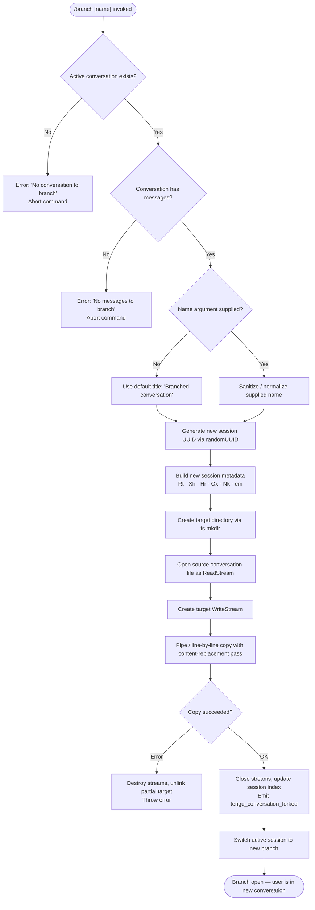

# `/branch`

> Analysis basis: CC v2.1.195 bundle.js (AST extraction + Claude interpretation)
> Minimum version: v2.1.195

---

## Overview

`/branch` creates a divergent copy of the current conversation at its present point, allowing the user to explore an alternative dialogue path without losing the original. The command copies the existing conversation history into a new session identified by an optional user-supplied name (defaulting to `"Branched conversation"`), then opens that new session as the active context. The fork operation is recorded via the `tengu_conversation_forked` telemetry event.

---

## Registration

| Field | Value |
|---|---|
| type | `local-jsx` |
| name | `branch` |
| description | `Create a branch of the current conversation at this point` |
| argumentHint | `[name]` |
| module_id | `QOo` |
| load_inline | `true` |
| loc_byte | `12815404` |
| loc_byte_end | `12815581` |
| loc_line | `8797` |
| arbor_handler.name | `_xf` |
| arbor_handler.fqn | `claude-2.1.195::_xf` |
| arbor_handler.kind | `AsyncFunction` |
| arbor_handler.resolution_path | `module_id` |
| arbor_handler.n_hits | `0` |

Analysis basis: CC v2.1.195 bundle.js:+12815404

---

## Input Branching

There are 4 distinct execution paths depending on whether there is an active conversation, whether the conversation has messages, whether a name argument is supplied, and whether the copy stream succeeds or fails.



Analysis basis: CC v2.1.195 bundle.js:+11397533, +11397980, +11399099, +11400132, +11400328

---

## Behavioral Spec

### 1. Guard Checks

```
async function branchCommand(args, appState):
    conversation = findActiveConversation(appState)   // dMl → t.find
    if conversation is null:
        raise UserError("No conversation to branch")  // literal @ +11397980

    messages = conversation.messages
    if messages is empty:
        raise UserError("No messages to branch")      // literal @ +11399099
```

Analysis basis: CC v2.1.195 bundle.js:+11397585, +11397980, +11399099

### 2. Name Resolution

```
function resolvebranchName(rawArg):
    if rawArg is blank:
        return "Branched conversation"                // literal @ +11397533
    sanitized = rawArg.replace(problematicChars, "")  // dMl → n.replace @ +11397663
    truncated  = sanitized.slice(0, 100)              // numeric limit 100 @ +11397700
    return truncated
```

- Default title: `"Branched conversation"` (bundle.js:+11397533)
- Maximum branch name length: 100 characters (bundle.js:+11397700)

Analysis basis: CC v2.1.195 bundle.js:+11397533, +11397663, +11397700

### 3. New Session Scaffolding

```
async function scaffoldBranchSession(sourcePath, branchName, appState):
    newId     = crypto.randomUUID()                   // pMl → lMl.randomUUID @ +11397772
    metadata  = buildSessionMetadata(                 // Rt, Xh, Hr, Ox, Nk, em @ +11397791–11397823
                    id:    newId,
                    title: branchName,
                    origin: "fork"                    // literal @ +11400849
                )
    targetDir = computeSessionPath(newId)             // em → UB, Hr, Xh, Rt
    await fs.mkdir(targetDir, { recursive: true })    // pMl → Per.mkdir @ +11397834
    return { newId, targetDir, metadata }
```

Analysis basis: CC v2.1.195 bundle.js:+11397772, +11397791, +11397834, +11400849

### 4. Conversation File Copy

```
async function copyConversationFile(sourcePath, targetPath):
    readStream  = fs.createReadStream(sourcePath)     // pMl → Der.createReadStream @ +11397883
    readStream.on("open", ...)                        // pMl → XOo.once @ +11397931
    if readStream fails to open:
        raise Error("No conversation to branch")

    writeStream = fs.createWriteStream(targetPath, { flags: "w", mode: 0o600 })
                                                      // pMl → Der.createWriteStream @ +11398029
                                                      // mode literal 384 (0o600) @ +11398075

    rl = readline.createInterface({ input: readStream })
                                                      // pMl → cMl.createInterface @ +11398123

    for each line in rl:
        transformed = applyContentReplacement(line)   // "content-replacement" @ +11398460
        writeStream.write(transformed + "\n")         // pMl → c.write @ +11398312

    writeStream.on("drain", ...)                      // literal "drain" @ +11398340
    await streamFinished(writeStream)                 // pMl → uMl.finished @ +11399509

    on error:
        readStream.destroy()
        writeStream.destroy()
        await fs.unlink(targetPath)                   // pMl → Per.unlink @ +11398243
        raise error
```

- Write mode: `0o600` (octal 384) — owner-only read/write (bundle.js:+11398075)
- Encoding: `"utf8"` (bundle.js:+11397916)
- Line copy uses a `"content-replacement"` transformation pass (bundle.js:+11398460)

Analysis basis: CC v2.1.195 bundle.js:+11397883, +11398029, +11398075, +11398123, +11398460, +11399509

### 5. Post-Copy Session Activation

```
async function activateBranchSession(newId, metadata, appState):
    updateSessionIndex(appState, newId, metadata)     // pMl → h, Me @ +11398995–11398997
    registerProgressEvent(newId)                      // "progress" literal @ +11399017
    emitTelemetry("tengu_conversation_forked")        // @ +11400328
    switchActiveSession(appState, newId)              // fMl → W @ +11400326
```

Analysis basis: CC v2.1.195 bundle.js:+11399017, +11400326, +11400328

### 6. Handler Entry Point (`_xf`)

```
async function _xf(commandContext):
    // Resolved via module_id "QOo" → Arbor path: module_id
    setupConversationRegistry(commandContext)         // _xf → fMl @ +11401132
    result = await forkCoordinator(commandContext)    // fMl → pMl @ +11400132
    branchName = resolvebranchName(commandContext.args)
    guardChecks(commandContext)                       // fMl → dMl @ +11400191
    findExistingWorktree(commandContext)              // fMl → l.find @ +11400195
    sessionTitleHelper(commandContext)               // fMl → Hxf @ +11400264
    writeSessionLog(commandContext)                  // fMl → IW @ +11400295
    setAgentName(commandContext)                     // fMl → kKe @ +11400313
    emitForkCompleted()                              // fMl → W @ +11400326
    timestamp = new Date().toISOString()             // fMl → u.toISOString @ +11400418
    resumeInputStream()                              // fMl → e.resume @ +11400836
    initializeFileTracking()                         // fMl → tue @ +11400857
    logBranchFile()                                  // fMl → JS @ +11400861
```

Analysis basis: CC v2.1.195 bundle.js:+11401132, +11400132, +11400191, +11400295, +11400313, +11400326, +11400861

### 7. Error Fallback

```
function handleUnknownError(err):
    if err.message is absent:
        return "Unknown error occurred"               // literal @ +11401016
    logError(err)                                    // xe → Gee.logError @ +11401016 region
```

Analysis basis: CC v2.1.195 bundle.js:+11401016

---

## State & Side Effects

| Item | Detail |
|---|---|
| Telemetry | `tengu_conversation_forked` (bundle.js:+11400328) |
| New session directory | Created via `fs.mkdir` with `{ recursive: true }` |
| Conversation file | Copied from source to new session path with content-replacement pass; file mode `0o600` |
| Session index | Updated with new session metadata after successful copy |
| Active session | Switched to the new branch session upon completion |
| Input stream | Resumed after branch scaffolding completes (`e.resume` @ +11400836) |
| File tracking | Re-initialized for the new session (`tue` subsystem @ +11400857) |
| Partial-copy cleanup | On error: streams destroyed, partial target file unlinked |
| Progress event | `"progress"` event emitted during copy (bundle.js:+11399017) |

---

## Version History

| Version | Change |
|---|---|
| v2.1.195 | Initial analysis |

---

## Common Mistakes

1. **Invoking `/branch` before any messages exist** — the guard at bundle.js:+11399099 rejects the command with `"No messages to branch"`. Exchange at least one message before branching.
2. **Supplying a name longer than 100 characters** — the name is silently truncated to 100 characters (bundle.js:+11397700); downstream display may show a different title than intended.
3. **Expecting the original conversation to be modified** — `/branch` creates a new independent session; the source conversation is read-only during the operation and remains intact.
4. **Assuming the branch is a git branch** — `/branch` operates on Claude Code's internal conversation history, not on the underlying git repository. Use git commands separately if a git branch is also needed.
5. **Running `/branch` with no active conversation** — if no conversation context is loaded, the command fails immediately with `"No conversation to branch"` (bundle.js:+11397980).

---

## Appendix — Identifier Mapping

> For bundle debugging only. Identifiers change across versions.

| Identifier | Role |
|---|---|
| `_xf` | Main async handler for `/branch` (Arbor-resolved entry point) |
| `fMl` | Fork coordinator — orchestrates the full branch workflow |
| `pMl` | Low-level file copy worker — manages streams and readline |
| `dMl` | Guard / name-sanitize helper — validates conversation and cleans arg |
| `Hxf` | Session title helper — assigns display title to new session |
| `IW` | Session log writer — records new session metadata |
| `kKe` | Agent-name setter — propagates agent name into branched session |
| `GQ` | Conversation selector / context loader |
| `sAe` | Worktree detection helper |
| `Wsc` | File-system context scanner used during session setup |
| `B7e` | Buffer/checksum utility used in session file handling |
| `Wg` | Session registry updater |
| `zc` | Session path resolver |
| `vi` | Module registration helper |
| `JS` | Branch file logger |
| `tue` | File-tracking initializer for new session |
| `Ki` | File stat / cache manager for tracked files |
| `_c` | Session directory path builder |
| `mk` | Session path joiner |
| `sE` | Cache entry eviction helper |
| `zd` | Atomic file write coordinator |
| `eg` | Atomic write implementation (random-byte temp name, rename) |
| `Jf` | Notification / event dispatcher for file changes |
| `ye` | String coercion utility |
| `Cn` | Error code classifier (e.g. `ENOENT`) |
| `on` | Structured logger / event emitter |
| `Rt` | Session metadata builder |
| `Hr` | Session history path helper |
| `Ox` | Output path composer |
| `em` | Conversation path assembler |
| `UB` | Base path resolver |
| `Xh` | Session filename helper |
| `Nk` | Session namespace key builder |
| `Bt` | JSON parser wrapper |
| `Me` | JSON stringifier wrapper |
| `rc` | Home/config directory resolver |
| `xe` | Error logger / reporter |
| `Zr` | Error constructor helper |
| `ut` | String-coercion utility (String cast) |
| `qi` | Telemetry queue flusher |
| `rSs` | Telemetry rate/sampling helper |
| `BMu` | Telemetry ring-buffer manager |
| `yi` | String slice / index-of utility |
| `wL` | Regex-escape helper |
| `Vg` | Completion candidate scorer |
| `qt` | Log format helper |
| `nY` | Persisted settings reader/writer |
| `JDt` | Settings file I/O coordinator |
| `ATe` | Append-log writer with mkdir |
| `f4` | Log serialization helper |
| `Ld` | Event bus `on` wrapper |
| `Cs` | CLI error exit handler |
| `yn` | Background session event handler |
| `thr` | Message role normalizer |
| `o8` | Path normalizer (Windows backslash fixer) |

---

Note: index built via Arbor fallback; some signals (telemetry, literals) may be missing — see arbor-fallback.js.