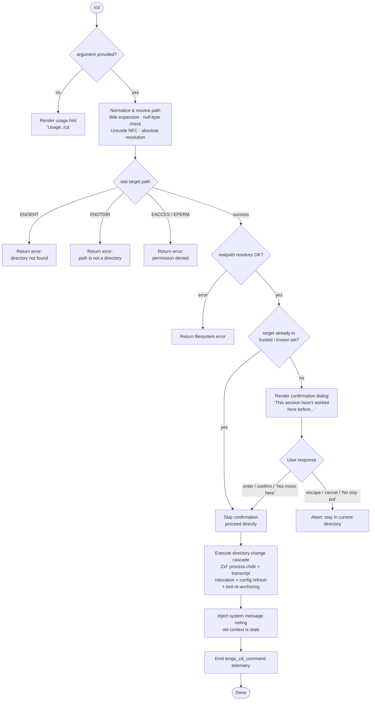

# `/cd`

> Analysis basis: CC v2.1.195 bundle.js (AST extraction + Claude interpretation)
> Minimum version: v2.1.195

---

## Overview

The `/cd` command moves the current Claude Code session to a new working directory specified by `<path>`. It resolves the target path (with tilde expansion and normalization), validates it against filesystem constraints and permission rules, optionally prompts the user for confirmation when navigating to an unrecognized directory, then performs the actual process working-directory change plus a cascade of side effects including transcript relocation, config refresh, and tool-context re-anchoring.

---

## Registration

| Field | Value |
|---|---|
| type | `local-jsx` |
| name | `cd` |
| description | Move this session to a new working directory |
| argumentHint | `<path>` |
| module_id | `KMl` |
| load_inline | `true` |
| loc_byte | `11441870` |
| loc_byte_end | `11442030` |
| arbor_handler.name | `t0f` |
| arbor_handler.fqn | `claude-2.1.195::t0f` |
| arbor_handler.kind | `AsyncFunction` |
| arbor_handler.resolution_path | `module_id` |
| arbor_handler.n_hits | `0` |

Analysis basis: CC v2.1.195 bundle.js:+11441870

---

## Input Branching

The command has more than three distinct execution branches (no argument / bad path / unrecognized directory requiring confirmation / fully trusted path / stat errors), so a Mermaid flowchart is used.



---

## Behavioral Spec

### 1. Argument Validation

```
function validateArgument(rawArg):
    if rawArg is empty or whitespace-only:
        renderUsageHint("Usage: /cd <path>")
        return ABORT
    return OK
```

Analysis basis: CC v2.1.195 bundle.js:+11440393 (usage string literal)

---

### 2. Path Normalization (`ds`)

```
function normalizePath(rawInput, currentWorkingDir):
    if rawInput contains null bytes ('\0'):
        raise TypeError("Path contains null bytes")

    trimmed = rawInput.trim()

    // Tilde expansion
    if trimmed starts with "~/":
        home = os.homedir()
        trimmed = home + trimmed.slice(2)
    else if trimmed starts with "~\\":   // Windows variant
        home = os.homedir()
        trimmed = home + trimmed.slice(2)

    // Windows-style path detection
    if platform is "windows":
        apply platform path adjustments

    // Unicode normalization
    normalized = path.normalize(trimmed).normalize("NFC")

    // Make absolute
    if not path.isAbsolute(normalized):
        resolved = path.resolve(currentWorkingDir, normalized)
    else:
        resolved = path.resolve(normalized)

    return resolved
```

Analysis basis: CC v2.1.195 bundle.js:+1097337 (`ds` / `Ot` path-normalization block), +1097590 (null-byte error string), +1097718 (tilde literal), +66395 (NFC normalization)

---

### 3. Filesystem Stat and Error Handling (`t0f` main handler)

```
async function checkTargetDirectory(resolvedPath):
    try:
        stat = await fs.stat(resolvedPath)
    catch err:
        switch err.code:
            case "ENOENT":  return { error: "directory not found" }
            case "ENOTDIR": return { error: "path is not a directory" }
            case "EACCES":  return { error: "permission denied (EACCES)" }
            case "EPERM":   return { error: "permission denied (EPERM)" }
            default:        return { error: err.message }

    realPath = await fs.realpath(resolvedPath)
    displayPath = boldFormat(Y7t.dirname equivalent of realPath)
    return { ok: true, realPath, displayPath }
```

Error codes checked: `ENOENT`, `ENOTDIR`, `EACCES`, `EPERM`

Analysis basis: CC v2.1.195 bundle.js:+11440484 (`Ger.stat`), +11440678–11440721 (error code literals), +11440864 (`Ger.realpath`)

---

### 4. Trust / Permission Check (`jMl`)

```
function isTrustedDirectory(resolvedPath, appState):
    allowedRoots = getConfiguredAllowedRoots(appState)   // i_
    normalizedTarget = normalizePlatformPath(resolvedPath) // K7t

    // Check whether the target falls inside any configured allowed root
    for root in allowedRoots:
        if normalizedTarget starts with root:
            return { trusted: true }

    // Run glob / rule matching (Jxf)
    ruleResult = evaluatePathRules(resolvedPath)
    if ruleResult is "deny":
        return { trusted: false, reason: "blockedByRule" }
    if ruleResult is "allowed":
        return { trusted: true }

    // Check whether the specific directory has been previously visited
    if appState.knownDirectories.has(resolvedPath):
        return { trusted: true }

    return { trusted: false, reason: "outsideAllowedPatterns" }
```

Analysis basis: CC v2.1.195 bundle.js:+11440997 (`jMl` call), +11435796 (`K7t`), +11435830 (`l.some` trusted-roots scan), +11435842 (`Jxf` rule evaluator), +11436222 ("outsideAllowedPatterns" literal), +11435988 ("blockedByRule" literal)

---

### 5. Confirmation Dialog (`qMl` JSX component)

When the target directory is not trusted, a full-screen interactive confirmation dialog is rendered:

- **Warning label**: "Moving to a new directory:" followed by the bold target path.  
  Analysis basis: CC v2.1.195 bundle.js:+11438475
- **Body text**: warns that the session has not worked in this directory before and asks whether the user trusts it.  
  Analysis basis: CC v2.1.195 bundle.js:+11437585, +11437609
- **Product name** cited in the body: "Claude Code"  
  Analysis basis: CC v2.1.195 bundle.js:+11437709
- **Security guide link**: `https://code.claude.com/docs/en/security` labelled "Security guide"  
  Analysis basis: CC v2.1.195 bundle.js:+11437919, +11437971
- **Buttons / key bindings**:

| Key / Button | Semantic | Action |
|---|---|---|
| `enter` / `confirm` | "Yes, move here" | Accept and proceed |
| `escape` / `cancel` | "No, stay put" | Abort |

Analysis basis: CC v2.1.195 bundle.js:+11438065 ("Yes, move here"), +11438094 ("No, stay put"), +11438295 ("enter"), +11438310 ("confirm"), +11438339 ("escape"), +11438355 ("cancel")

---

### 6. Directory-Change Cascade (`Zxf`)

```
async function performDirectoryChange(resolvedPath, appState):
    // Step 1: Update shell working directory store (FH)
    setShellCwd(resolvedPath)           // emits tengu_shell_set_cwd
    // FH calls path.isAbsolute / path.resolve, updates the async-context store

    // Step 2: Change Node.js process working directory
    process.chdir(resolvedPath)         // bundle.js:+11438946

    // Step 3: Emit internal CWD-changed event (EM / QCt)
    emitCwdChangedEvent(resolvedPath)   // normalizes path, fires o_r.emit

    // Step 4: Relocate transcript (E1o)
    beginTranscriptRelocation(newPath)
        mkdir(newTranscriptDir, mode=448)  // 0o700
        moveOrCopyTranscriptFiles()
        endTranscriptRelocation()

    // Step 5: Update CLAUDE.md / tool context (T, czi)
    refreshClaudeRulesContext()         // re-reads CLAUDE.md from new CWD
    invalidateFileContextCache()        // czi: clears stale file entries

    // Step 6: Re-anchor MCP tools (_7)
    Oae.reanchor(resolvedPath)          // bundle.js:+1155418

    // Step 7: Refresh project config (Lo.refreshConfig)
    refreshProjectConfig()              // bundle.js:+11439302

    // Step 8: Rebuild allowed-paths set (Qxf)
    rebuildAllowedPathsFromNewCwd(resolvedPath)

    // Step 9: Emit telemetry
    emit("tengu_cd_command")            // bundle.js:+11439323

    // Step 10: Sanitize HTML entities in path for display (Wer)
    displayPath = escapeHtmlEntities(resolvedPath)
    // replaces & < > &#13; &#10;
```

Analysis basis: CC v2.1.195 bundle.js:+11438946 (`process.chdir`), +11438963 (`FH`), +11438969 (`EM`), +11438997 (`E1o`), +11439241 (`czi`), +11439251 (`_7`), +11439302 (`Lo.refreshConfig`), +11439358 (`Qxf`), +11439367 (`Wer`)

Transcript-directory mode bits: octal `700` (decimal `448`)  
Analysis basis: CC v2.1.195 bundle.js:+13552313

---

### 7. Session System Message Injection (`Br`, `e0f`)

After the directory change succeeds, a **system-role message** is injected into the conversation context informing the model that tool-call results referencing the previous directory are stale:

- The injected text contains the fragment `"previous directory — that information is stale. All tool calls and "` (continuing to describe the new context).  
  Analysis basis: CC v2.1.195 bundle.js:+11439517
- Role set to `"system"`.  
  Analysis basis: CC v2.1.195 bundle.js:+11441211
- `Br` reads `appState`, searches for the most recent `working_directory` / `allowed_tools` / `disallowed_tools` / `avoid_prompts` / `permission_mode` / `bypassPermissions` block (`findLast`) and synthesizes the new system-turn content (`uZn`, `dZn`).  
  Analysis basis: CC v2.1.195 bundle.js:+11065876, +11065981, +11066036, +11066091, +11066152, +11066254, +11066285

---

### 8. New Working Directory Display (`KEt`, `J7t`)

Two helper functions compute the display representation of the new working directory after the change:

```
function formatNewCwdForDisplay(rawPath):
    normalized = normalizePlatformPath(rawPath)   // o8: NFC + replaceAll
    resolved   = path.resolve(normalized)
    return resolved

function formatCwdWithFallback(rawPath):
    // J7t: same normalization, then writes to config via gn
    normalized = normalizePlatformPath(rawPath)
    resolved   = path.resolve(normalized)
    persistCwdToSessionConfig(resolved)   // gn → xZt → config write pipeline
    return resolved
```

Analysis basis: CC v2.1.195 bundle.js:+11441441 (`KEt`), +11441516 (`J7t`), +1098354 (`o8` normalization)

---

## State & Side Effects

| Item | Detail |
|---|---|
| Telemetry — `tengu_cd_command` | Fired once per successful `/cd` invocation (bundle.js:+11439323) |
| Telemetry — `tengu_shell_set_cwd` | Fired when the shell CWD async-context store is updated (bundle.js:+7223361) |
| Telemetry — `tengu_disable_bypass_permissions_mode` | May fire if bypass-permissions mode is disabled on CWD change (bundle.js:+3420569) |
| Telemetry — `tengu_daemon_config_reload` | Fires when daemon config is reloaded after move (bundle.js:+17902328) |
| Telemetry — `tengu_config_lock_contention` | Fires when config lock acquisition is slow (bundle.js:+14069271) |
| Telemetry — `tengu_config_stale_write` | Fires if a stale config write is detected (bundle.js:+14069407) |
| Telemetry — `tengu_config_parse_error` | Fires on config JSON parse failure (bundle.js:+14073004) |
| Telemetry — `tengu_config_auto_repaired` | Fires when config is auto-repaired (bundle.js:+14069784) |
| Telemetry — `tengu_config_auth_loss_prevented` | Fires when a write that would erase auth is blocked (bundle.js:+14070114) |
| Telemetry — `tengu_config_fallback_write` | Fires on fallback config write path (bundle.js:+14068887) |
| Telemetry — `tengu_claude_rules_md_permission_error` | Fires if CLAUDE.md cannot be read in new CWD (bundle.js:+5223884) |
| Telemetry — `tengu_paper_halyard` | Fires during CLAUDE.md context assembly (bundle.js:+5226622) |
| Telemetry — `tengu_bg_state_read_transient` | Fires during background-session state read (bundle.js:+4312062) |
| Telemetry — `tengu_daemon_control` | Fires on daemon lifecycle control events (bundle.js:+17924594) |
| `process.chdir` | Changes the Node.js process working directory (bundle.js:+11438946) |
| Async-context CWD store | Updated via `FH` / `Jxr` / `xpn.getStore` (bundle.js:+11438963) |
| CWD-changed event | Emitted on internal event bus via `EM` / `o_r.emit` (bundle.js:+46839) |
| Transcript relocation | Transcript directory moved/copied to new CWD path via `E1o` (bundle.js:+13552227) |
| CLAUDE.md context | Re-read from new CWD; stale file-context cache cleared via `czi` (bundle.js:+11439241) |
| MCP tool re-anchoring | `Oae.reanchor` called with new path (bundle.js:+1155418) |
| Project config refresh | `Lo.refreshConfig()` called (bundle.js:+11439302) |
| Allowed-paths set | Rebuilt from new CWD by `Qxf` (bundle.js:+11439358) |
| System message injection | Stale-context system turn appended to conversation via `Br` / `e0f` (bundle.js:+11441035) |
| Session config persistence | New CWD written to session config via `gn` / `xZt` pipeline (bundle.js:+11441516) |
| Bypass-permissions mode | May be disabled if it was enabled — `xF` / `at` check (bundle.js:+11441035) |
| Sound | None observed in traversal |

---

## Version History

| Version | Change |
|---|---|
| v2.1.195 | Initial analysis |

---

## Common Mistakes

1. **Omitting the path argument** — `/cd` with no argument prints the usage hint `Usage: /cd <path>` and does nothing. The argument is mandatory.
2. **Using a relative path from a shell assumption** — the path is resolved relative to the *current session working directory*, not the shell's CWD outside of Claude Code; pass an absolute path to avoid ambiguity.
3. **Expecting instant tool-context availability** — after `/cd`, the model receives a system message marking previous tool-call results as stale. Any in-flight agent steps that reference the old directory should be considered unreliable.
4. **Bypassing the confirmation dialog** — if the target directory is not in the trusted/known set, the dialog must be explicitly confirmed. Pressing `Escape` or choosing "No, stay put" leaves the session in the original directory without error.
5. **Assuming the transcript stays in the old location** — `/cd` triggers a full transcript relocation; the transcript directory moves alongside the session (mode `0o700`).
6. **Navigating to a path with null bytes** — the path normalization layer will throw a `TypeError("Path contains null bytes")` before any filesystem access occurs.

---

## Appendix — Identifier Mapping

> For bundle debugging only. Identifiers change across versions.

| Identifier | Role |
|---|---|
| `t0f` | Main `/cd` command async handler (Arbor handler; `claude-2.1.195::t0f`) |
| `ds` | Path normalization function (tilde expansion, null-byte check, NFC, absolute resolution) |
| `Ot` | CWD async-context getter (reads from `xpn` store) |
| `Rpn` | Async-context store reader helper |
| `Rz` | Async-context store value extractor |
| `Hr` | CWD value accessor / unwrapper |
| `u0` | Underlying async-context primitive |
| `qt` | General-purpose assertion / invariant helper |
| `o_` | Unicode NFC path normalizer |
| `on` | Logging / debug utility |
| `jMl` | Trust / permission checker for target directory |
| `i_` | Allowed-roots set builder (collects trusted directory roots) |
| `Bc` | Path component utility (used during root scanning) |
| `Vp` | Path component utility |
| `IC` | Path segment normalization helper (split/pop/push logic) |
| `Wwt` | Symlink-aware path resolution helper |
| `LZl` | Recently-visited directory cache/tracker |
| `rae` | Recursive symlink resolution helper |
| `Gd` | Real-path-with-symlink-resolution helper |
| `K7t` | Platform-aware path prefix normalizer |
| `Jxf` | Path rule evaluator (glob/pattern matching against allowed rules) |
| `q7t` | Glob-pattern-to-regex compiler |
| `kem` | Rule application engine (calls `ds` + `Hr` + `oBe`) |
| `ZKe` | Rule-set fetcher (`Vt` + `CM`) |
| `Xxf` | Auxiliary path rule helper |
| `pK` | "deny" rule processor (`wWo`) |
| `wWo` | Rule-push helper for deny entries |
| `wg` | Shell-command substring helper (used in pattern matching) |
| `bbe` | "allow" rule processor (`xlc`, `wg`, `Iqe`) |
| `xlc` | Allow-list entry formatter |
| `Iqe` | Cached path-pattern evaluator |
| `Ixo` | Pattern cache initializer (`jkr`) |
| `Iqt` | Pattern compilation step (`Cqt`) |
| `vqt` | Pattern string tokenizer/matcher |
| `Txo` | Pattern cache writer (`wM`) |
| `Br` | Session-state reader that builds the stale-context system message |
| `uZn` | New working-directory system-message builder (`Fo`) |
| `dZn` | Disallowed-tools system-message builder (`Fo`) |
| `xF` | Bypass-permissions mode disabler (`at`, `Go`) |
| `at` | Permission-mode state mutator |
| `lUt` | Permission-mode helper |
| `cUt` | Permission-mode helper |
| `f6` | Permission-mode sub-step (`p6`) |
| `bxn` | Permission-mode registry accessor (`VKr`, `hxe`, `WKr`, `JKr`) |
| `Mt` | Telemetry event emitter helper (`qt`, `S0`, `Mjo`, `oTt`, `Csm`) |
| `e0f` | System-message composer for stale-context injection (`Dp`, `v1e`, `Ct.bold`) |
| `Dp` | Text sanitizer for system messages (`dNu`) |
| `dNu` | String replaceAll helper for display sanitization |
| `v1e` | Message-role helper (`mIs`) |
| `Zxf` | Full directory-change cascade orchestrator |
| `FH` | Shell CWD async-context updater; emits `tengu_shell_set_cwd` |
| `Cn` | Error-boundary / catch helper |
| `Jxr` | Async-context store CWD writer (`xpn.getStore`, `o_`, `cee`) |
| `cee` | CWD store commit helper (`QCt`) |
| `W` | General async fire-and-forget / scheduling utility |
| `EM` | CWD-changed internal event emitter (`QCt`, `o_r.emit`) |
| `QCt` | Path normalizer used by event emitter (`e.normalize`) |
| `E1o` | Transcript relocation orchestrator (`beginTranscriptRelocation` … `endTranscriptRelocation`) |
| `Rt` | Transcript path helper (`u0`) |
| `zc` | Hook registration helper (`vi`) |
| `vi` | Hook registrar (`krs.register`) |
| `f4` | Environment/config sub-step (`ut`, `Csc`, `n5`, `s3e`) |
| `ut` | String coercion utility |
| `DA` | Transcript event emitter (`yrs`, `_rs`) |
| `_rs` | Internal event bus emitter (`Jon.emit`) |
| `psc` | Transcript file mover (rename / rm / copyFile / `ksc`) |
| `ksc` | Recursive directory copy helper (`bl.mkdir`, `bl.readdir`, `bl.copyFile`) |
| `T` | Rich text / log-entry formatter (debug/system messages) |
| `RYc` | Log-entry writer (`w1`, `eAr`, `Drs`) |
| `Me` | JSON serializer (`JSON.stringify`) |
| `Lc` | Log-field redactor (`[REDACTED]` string) |
| `jXe` | Log-entry auxiliary formatter (`ais`) |
| `PYc` | Log-entry persistence writer (`_Xe`, `Qge`, `w1`, `vi`) |
| `xe` | Telemetry / error logger (`Zr`, `ut`, `qi`, `BMu`, `GZe`, `Gee.logError`) |
| `Zr` | Error/string wrapper |
| `qi` | Essential-traffic logger (`rSs`) |
| `BMu` | Telemetry ring-buffer manager (`Tpn`) |
| `czi` | File-context cache invalidator (`sE`, `Ki`, `zd`, `Jf`) |
| `sE` | Cache-entry deleter (`Gne.delete`) |
| `Ki` | File-state cache reloader (stat, lstat, readFile, parse, etc.) |
| `zd` | Cache metadata updater (`eg`, `oE.join`, `Me`, `sE`) |
| `eg` | Atomic file writer (`Xxr.randomBytes`, `f7.writeFile`, `f7.rename`) |
| `Jf` | Cache-entry invalidator / reloader (`on`, `eae`, `T`, `ye`, `xe`) |
| `ye` | String error formatter |
| `_7` | MCP tool re-anchorer (`Oae.reanchor`) |
| `yE` | Post-change UI refresh helper |
| `Qxf` | Allowed-paths-set rebuilder after CWD change (`VI`, `fI`, `_3t`, `H3t`) |
| `fI` | Path normalizer for allowed-paths entries (`jf.normalize`, `Vt`, `t.replaceAll`) |
| `_3t` | CLAUDE.md discovery walker (`Om`, `J6`, `KRe`, `m3t`) |
| `Om` | Config-file path constructor (`NC`) |
| `J6` | Single-directory CLAUDE.md scanner (`Gd`, `Xip`, `Bc`, `Vp`, `IC`) |
| `KRe` | Recursive directory walker for CLAUDE.md files |
| `m3t` | Path relativity checker for CLAUDE.md entries |
| `H3t` | Allowed-paths list assembler (`at`, `n.push`, `n.join`) |
| `Wer` | HTML entity escaper for path display (`&amp;`, `&lt;`, `&gt;`, `&#13;`, `&#10;`) |
| `lC` | Post-change layout/display refresh |
| `KEt` | New-CWD display formatter (`Mt`, `o8`, `bE.resolve`) |
| `o8` | Platform path normalizer (NFC + `replaceAll`, `Vt`) |
| `J7t` | New-CWD formatter with config persistence (`o8`, `bE.resolve`, `gn`) |
| `gn` | Session-config save orchestrator (`xZt`, `S0`, `sUe`, `Djo`, `wZt`, `T`, `vZt`, `sTt`, `W`, `Mcr`, `Oe`) |
| `xZt` | Config write-with-lock implementation |
| `Osi` | Config object merger (`I3r`, `Object.assign`) |
| `oTt` | Config reader (`r.readFileSync`, `Bt`, `v5`) |
| `Ujo` | Config backup path builder (`bE.join`, `tr`) |
| `aRt` | Atomic file write with sync/flush (`Tf.writeFileSync`, `Tf.fsyncSync`, `Tf.fchmodSync`) |
| `Mcr` | Fallback config-save path (`wZt`, `S0`, `qt`, `aRt`, `T`, `W`, `Oe`) |
| `Oe` | OS-level error wrapper (`OJe`) |
| `qMl` | JSX confirmation-dialog component renderer |
| `Fo` | System-message content builder (used by `uZn`, `dZn`, `jMl`) |
| `Wwt` | Symlink-resolution loop (lstat → readlink → resolve) |
| `wZt` | Timestamp helper for config staleness detection (`Date.now`) |
| `vZt` | Config-read sub-step (`oTt`, `S0`) |
| `sTt` | Config-write sub-step |
| `sUe` | Session config merger |
| `Djo` | Session config entry iterator (`Object.entries`) |

---

Note: index built via Arbor fallback; some signals (telemetry, literals) may be missing — see arbor-fallback.js.