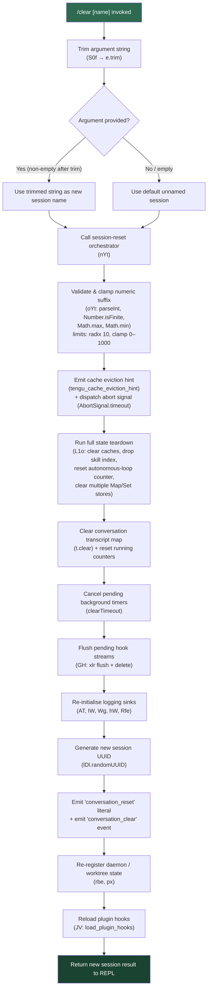

# `/clear`

> Analysis basis: CC v2.1.195 bundle.js (AST extraction + Claude interpretation)
> Minimum version: v2.1.195

---

## Overview

`/clear` starts a fresh conversation session with an empty context window, while preserving the current session's transcript on disk so it remains resumable via `/resume`. The command accepts an optional name argument, trims it, and then executes a multi-stage teardown-and-reinitialise sequence that clears in-memory state, resets caches, persists a new session record, and emits a `conversation_clear` telemetry event.

---

## Registration

| Field | Value |
|---|---|
| type | `local` |
| name | `clear` |
| description | `Start a new session with empty context; previous session stays on disk (resumable with /resume)` |
| aliases | `reset`, `new` |
| argumentHint | `[name]` |
| supportsNonInteractive | `true` |
| thinClientDispatch | `post-text` |
| module_id | `dDl` |
| load_inline | `true` |
| loc_byte | `11459151` |
| loc_byte_end | `11459442` |
| loc_line | `7255` |
| arbor_handler.name | `S0f` |
| arbor_handler.fqn | `claude-2.1.195::S0f` |
| arbor_handler.kind | `AsyncFunction` |
| arbor_handler.resolution_path | `module_id` |
| arbor_handler.n_hits | `0` |

Analysis basis: CC v2.1.195 bundle.js:+11459151

---

## Input Branching

The handler has more than three distinct paths depending on argument presence, backgrounded state, and the many internal reset sub-routines. A Mermaid flowchart is used.



---

## Behavioral Spec

### 1 — Argument Normalisation

The handler `S0f` immediately trims the raw input string. An empty post-trim value causes the session to receive a default (unnamed) label; a non-empty value becomes the session's display name.

```
function clearCommandHandler(rawArg):
    trimmedArg = rawArg.trim()          // bundle.js:+11458977
    sessionName = trimmedArg if trimmedArg != "" else DEFAULT_NAME
    return runSessionReset(sessionName)
```

Analysis basis: CC v2.1.195 bundle.js:+11458977

---

### 2 — Session Reset Orchestrator (`sessionResetOrchestrator`)

The orchestrator (`nYt`) is called by the handler and performs all teardown work in a fixed sequence.

```
async function sessionResetOrchestrator(sessionName, context):
    signal = AbortSignal.timeout(...)          // +11456737
    emitTelemetry("tengu_cache_eviction_hint") // +11456781
    emitEvent("clear", "conversation_clear")   // +11456693, +11456819

    runFullStateTeardown(context)              // +11455636 (L1o)
    clearConversationStore(context)            // +11457224
    cancelAllPendingTimers()                   // +11457524
    flushPendingHookStreams()                  // +11457625 (GH)
    reinitialiseLoggingSinks()                 // +11458121 (AT)
    reinitialiseWorktreeHandlers()             // +11458167 (Wg)
    newSessionId = generateUUID()              // +11458264
    emitLiteral("conversation_reset")          // +11458225
    reRegisterDaemonAndWorktree()              // +11458542 (rbe), +11458551 (px)
    reloadPluginHooks(context)                 // +11458731 (JV)
    return buildSessionResult(newSessionId, sessionName)
```

Analysis basis: CC v2.1.195 bundle.js:+11456677

---

### 3 — Numeric Suffix Clamping (`numericSuffixValidator`)

The helper `oYt` processes any numeric suffix embedded in the name or session identifier.

```
function numericSuffixValidator(value):
    parsed = parseInt(value, 10)               // radix=10, +13680254, +13680265
    if not Number.isFinite(parsed):
        return handleNonFinite()               // +13680276
    clamped = Math.max(0, Math.min(parsed, 1000))  // limits 0–1000, +13680472, +13680485
    return clamped
```

Analysis basis: CC v2.1.195 bundle.js:+13680254

---

### 4 — Full State Teardown (`fullStateTeardown`)

`L1o` is the primary cache-clearing function. It iterates over many subsystems and clears them all atomically before the new session is initialised.

```
function fullStateTeardown(context):
    clearSkillIndexCache()           // LG.clearSkillIndexCache, +13518704
    clearZZn()                       // ZZn, +13518756
    clearArl()                       // aRl, +13518762
    clearHKe()                       // HKe → hzt, +13518768
    clearYVCache()                   // _ca → YV.clear, +5371172
    clearGe()                        // _Ge → dca / pca, +5359685
    clearUvt()                       // Uvt, +11455662
    clearYfe()                       // yfe subsystem (MCP/model caches), +11455672
    clearX6()                        // X6 → y7t.clear, +11189184
    clearYQa()                       // YQa → Y8e.clear + iTo.clear, +8783284
    clearThl()                       // thl → tyt.clear + qqt.clear, +10068261
    clearLRr()                       // lRr → uve.clear, +1157871
    clearADl()                       // aDl, +11455960
    clearMrl()                       // Mrl → Nqn.clear, +9042289
    clearSEr()                       // sEr, +11455975
    clearX0r()                       // X0r → fet.clear, +1149109
    clearDIl()                       // dIl → hzt, +10680707
    clearHka()                       // Hka → Ure.clear + SMe.clear, +7069539
    // then re-resolves new session references
    resolveMxo()                     // mxo, +11456030
    resolveOUn()                     // oUn, +11456108
    resolveNEe()                     // nEe, +11456284
```

Analysis basis: CC v2.1.195 bundle.js:+11455636

---

### 5 — Model-Cache Sub-Teardown (`modelCacheTeardown`)

`yfe` is called within `L1o` and clears model-specific caches including the MCP skill caches and autonomous-loop state.

```
function modelCacheTeardown():
    clearH4eCache()                              // h4e → RP, +10894390
    clearGQn()                                   // gQn (TW/aDo/kzt/vKe caches), +10893918
    clearG3t()                                   // g3t → cx, +10894457
    clearNvt()                                   // Nvt, +10894472
    clearFvt()                                   // Fvt, +10894489
    clearOwl()                                   // uQn → owl.clear, +10871458
    clearK4tAndTpo()                             // $La → k4t.clear + tpo.clear, +6852933
    clearAll()                                   // All, +9369131
    clearVPe()                                   // VPe, +9368221
    resetAutonomousLoopDelivered()               // ITf.resetAutonomousLoopDelivered, +10894533
    clearWy()                                    // Wy → nXe + Object.values, +48320
    callGDo()                                    // gDo, +10894689
```

Analysis basis: CC v2.1.195 bundle.js:+10894390

---

### 6 — Hook Stream Flushing (`hookStreamFlusher`)

`GH` ensures any in-flight hook async-tracking is cleanly terminated before the new session starts.

```
function hookStreamFlusher():
    pendingLics = klr(...)            // track active locks, +13636331
    for each entry in xlr:
        stream = xlr.get(key)         // +13637747
        stream.flush()                // +13637769
        xlr.delete(key)               // +13637779
```

Analysis basis: CC v2.1.195 bundle.js:+13637726

---

### 7 — Plugin Hook Reload (`pluginHookReloader`)

After the state teardown, `JV` reloads all plugin hooks. This involves re-resolving session context, re-registering MCP skills, and emitting the `hook_session_start_reload_skills` event.

```
async function pluginHookReloader(context):
    lc(context)                               // re-resolve session config, +3433452
    U_(context)                               // apply policy settings, +3435276
    OY(context)                               // enumerate hook entries, +3434408
    T(context)                                // re-build hook formatter, +5383056
    det(context)                              // timestamp hook, +1145163
    bEe(context)                              // safe-mode guard, +5380454

    if safeMode:
        log("Skipping plugin hooks - safe mode...")   // +5383063
        return

    clonePlugins(...)                         // +5383362 (network/permission error handling)
    j3t(context)                              // run main REPL loop hooks, +13669971
    emitEvent("hook_session_start_reload_skills")  // +5384506
    ai(context)                               // attach queued_command UUID, +11194790
```

Analysis basis: CC v2.1.195 bundle.js:+5382980

---

### 8 — Non-Interactive / Thin-Client Path

Because `supportsNonInteractive: true` and `thinClientDispatch: "post-text"` are set, `/clear` (and its aliases `/reset`, `/new`) can be invoked in headless pipelines. In that path the REPL is bypassed and the result is dispatched as a post-text message to the calling client.

Analysis basis: CC v2.1.195 bundle.js:+11459151 (registration block)

---

## State & Side Effects

| Item | Detail |
|---|---|
| Telemetry | `tengu_cache_eviction_hint` (bundle.js:+11456781), `tengu_run_hook` (+13721014), `tengu_feature_ok` (+1027363), `tengu_feature_bad` (+1027430), `tengu_hook_plugin_metrics` (+13699055), `tengu_repl_hook_finished` (+13704749), `tengu_hook_plugin_injected` (+13719343), `tengu_session_renamed` (+13571665), `tengu_shell_set_cwd` (+7223361), `tengu_mcp_skills` (+6800612), `tengu_transcript_write_failed` (+13577492), `tengu_bg_state_read_transient` (+4312062), `tengu_daemon_config_reload` (+17902328), `tengu_daemon_control` (+17924594) |
| Literal events emitted | `"conversation_clear"` (+11456819), `"conversation_reset"` (+11458225), `"SessionEnd"` (+13670703) |
| Hook registration | Plugin hooks are fully torn down and re-registered via `JV` / `bEe` after the state reset. Safe-mode flag suppresses plugin hooks but allows managed-settings-file hooks. |
| Cache clearance | Clears skill index, MCP model caches, YV, TW, aDo, kzt, vKe, y7t, Y8e, iTo, tyt, qqt, uve, Nqn, fet, Ure, SMe, k4t, tpo, owl; resets autonomous-loop counter. |
| Session UUID | New UUID generated via `lDl.randomUUID` (+11458264) and associated with the new session. |
| Conversation store | `t.clear()` wipes the in-memory conversation message map (+11457224). Previous messages remain on disk (resumable). |
| Background timer teardown | All pending `setTimeout` handles cancelled via `clearTimeout` (+11457524). |
| Abort signal | An `AbortSignal.timeout` is issued at the start of teardown to interrupt any running agent turn (+11456737). |
| appState changes | Session role set to `"coordinator"` / `"normal"` depending on context (+11458644, +11458658); `isBackgrounded` flag read during teardown (+11456892). |
| Sound | <!-- TODO: not found in depth-2 traversal; needs --depth 4 --> |

---

## Version History

| Version | Change |
|---|---|
| v2.1.195 | Initial analysis |

---

## Common Mistakes

1. **Confusing `/clear` with a permanent delete** — the old session transcript is preserved on disk and fully resumable with `/resume`. Only the in-memory context window is reset.
2. **Omitting the name argument thinking it is required** — the `[name]` argument is optional; omitting it resets to a default unnamed session.
3. **Expecting immediate hook re-execution** — after `/clear`, plugin hooks go through a full teardown and reload cycle (`JV`). Hooks set up mid-session are not preserved; they are re-registered from the stored configuration.
4. **Using `/clear` in safe mode expecting plugins** — safe mode suppresses plugin hook registration (literal: `"Skipping plugin hooks - safe mode disables plugins..."` +5383063). Only managed-settings-file hooks remain active.
5. **Assuming aliases are identical in all contexts** — `/reset` and `/new` are registered as aliases (+registration) and behave identically to `/clear`, including in non-interactive mode.
6. **Triggering `/clear` during an active agent turn** — the handler issues an `AbortSignal.timeout` to interrupt any running turn before resetting state; the interrupted turn may leave partial tool outputs in the transcript log.

---

## Appendix — Identifier Mapping

> For bundle debugging only. Identifiers change across versions.

| Identifier | Role |
|---|---|
| `S0f` | Main async handler for `/clear` command (arbor_handler) |
| `nYt` | Session reset orchestrator — coordinates full teardown and reinit |
| `oYt` | Numeric suffix validator — parseInt/clamp for session name suffix |
| `U_` | Policy settings applier |
| `Tl` | Configuration loader helper |
| `_ce` | Policy enforcement sub-routine (reads `policySettings`, calls `Hn`/`Go`) |
| `r5` | Utility — reads `u0` store value |
| `RF` | Reset finalizer — calls cache-map clearer `n_` and hook-state resetter `jzr` |
| `Wzr` | Cache map read/write coordinator (`vUi.get` / `vUi.set`) |
| `n_` | Clears `Kon` and `QHr` map stores |
| `jzr` | Hook-state resetter — calls `Hn`, `Tl`, `qS`, `Go` |
| `nze` | Conversation session init — calls `Td`, `Jx`, `Rt`, `Cwo` |
| `Td` | Session data builder — calls `Rt`, `v1`, `YC`, `MP`, `Ox`, `Ot` |
| `YC` | Model capability checker (claude-3, opus-4, sonnet-4 literals) |
| `MP` | Effort/quality setting resolver (reads `"high"`) |
| `Ox` | Output formatter joining `Ih` path segments |
| `Ot` | Result builder calling `Rpn`/`Hr` |
| `Jx` | REPL main loop — orchestrates hooks, tool calls, message routing |
| `U3` | Hook context builder (calls `Hn`) |
| `TTe` | Async tracking helper (`_xe`) |
| `$Go` | Hook event dispatcher (PreToolUse, PostToolUse, SessionStart, etc.) |
| `UGo` | Third-party hook filter (`e.filter`, `Klr`) |
| `Nn` | Notification renderer |
| `Me` | JSON serialiser helper (`JSON.stringify`) |
| `xe` | Error logger (`Zr`, `ut`, `qi`, `BMu`, `GZe.push`, `Gee.logError`) |
| `ke` | Feature-ok gate (`W`, `Oe`) |
| `E2e` | Feature entrypoint wrapping `cpn` |
| `Rk` | Abort-and-timeout controller (`El`, `o.abort`, `clearTimeout`, `setTimeout`) |
| `Glr` | Worktree state resolver (`r1`, `U2o`, `$2o`, `T`) |
| `MGo` | MCP tool executor (`eFe`, `T`, `ntm`, `Rk`, `Object.keys`) |
| `Vlr` | Hook output parser — detects `{` prefix; logs plain-text fallback |
| `Cfe` | Hook context merger (`Object.entries`, `Object.fromEntries`, `Oe`, `Xc`) |
| `kGo` | HTTP hook executor (`Zem`, `u4t`, `ly.post`, `Content-Type`) |
| `Qic` | HTTP response parser (`e.trim`, `Jbt`, `t.startsWith`, `t.slice`, `Xic`) |
| `qlr` | Subprocess hook spawner (`Date.now`, `Wlr.spawn`, `CLAUDE_PLUGIN_ROOT`, `utf8`) |
| `GWe` | Hook result aggregator |
| `Le` | Feature-ok result builder (`W`, `Oe`) |
| `n9` | Telemetry emitter (`Fzd.emit`, `Date.now`, `J0e.get/set`, `process.on`, `setTimeout`) |
| `Cwo` | Context wrapper (`e`, `T`) |
| `svt` | Signal timeout helper |
| `je` | OJe-based utility |
| `br` | Branch resolver (`xh`, `je`); `"nonconforming"` literal |
| `xh` | OJe helper |
| `Cs` | CLI exit handler (`D7e`, `aI`, `process.exit`, `"cli_error"`) |
| `o8` | Path normaliser (`U1.normalize`, `Vt`, `t.replaceAll`) |
| `Vtc` | Column-width calculator (`Object.keys`, `Math.max`, `k_`) |
| `kIt` | SDK connection type handler (`O2c`) |
| `Zr` | Error stringifier (`Error`, `String`) |
| `nhr` | Array/item router (`Array.isArray`, `thr`) |
| `thr` | String prefix handler (`t.startsWith`, `t.slice`, `r.replace`) |
| `EWc` | Daemon heartbeat connector (`dce`) |
| `L1o` | Full state teardown — iterates all subsystem clears |
| `T1o` | Teardown pre-check |
| `V0` | Skill index re-resolver (`LG`, `ZZn`, `aRl`, `HKe`) |
| `LG` | Skill index cache clearer (`e.clearSkillIndexCache`) |
| `_ca` | YV cache clearer (`YV.clear`, `_Ge`) |
| `_Ge` | Config-store file writer (`dca`, `pca`, `dUn.writeFile`) |
| `yfe` | Model-cache teardown sub-routine |
| `gQn` | TW/aDo/kzt/vKe cache clearer |
| `g3t` | cx-store clearer |
| `Fvt` | u0/jie-based cache clearer |
| `uQn` | owl.clear caller |
| `$La` | k4t and tpo cache clearer |
| `All` | All-cache flusher |
| `VPe` | VPe subsystem clearer |
| `Wy` | nXe/Object.values walker |
| `X6` | y7t.clear caller |
| `YQa` | Y8e and iTo cache clearer |
| `thl` | tyt and qqt cache clearer |
| `lRr` | uve.clear caller |
| `Mrl` | Nqn.clear caller |
| `sEr` | e.has-based state checker |
| `X0r` | fet.clear caller |
| `dIl` | hzt teardown caller |
| `hzt` | wXn.get / mzt reader |
| `Hka` | Ure and SMe cache clearer (calls `T`) |
| `Hr` | u0-based result renderer |
| `FH` | CWD resolver (`l3n.isAbsolute`, `l3n.resolve`, `qt`, `Cn`, `Jxr`) |
| `Jxr` | Store path resolver (`xpn.getStore`, `o_`, `cee`) |
| `o_` | Path normaliser (`e.normalize`) |
| `cee` | QCt-based path helper |
| `rc` | u0-based display renderer |
| `GH` | Hook stream flusher (`klr`, `xlr.get`, `t.flush`, `xlr.delete`) |
| `klr` | Active-lock tracker (`lic.add`, `e.finally`, `lic.delete`) |
| `zpt` | mOa-based state tracker |
| `AT` | Logging sink reinitialiser (`wWe`, `o.cleanup`, `_x`) |
| `wWe` | Hash-based config watcher (`aMe`) |
| `aMe` | Config hash builder (`Me`, `Array.isArray`, `Object.keys`, `Fva.createHash`) |
| `_x` | at-based MCP skill loader |
| `at` | MCP skill registration (`lUt`, `cUt`, `f6`, `bxn`, `iUt.add`, `rV`) |
| `uDl` | eCe-based utility |
| `Wg` | Worktree registration (`Rt`, `zc`) |
| `zc` | vi-based registration wrapper |
| `vi` | krs.register caller |
| `em` | Output builder (`UB`, `Xh`, `Hr`, `yke.join`, `Rt`) |
| `rYt` | zc-based resetter |
| `r_r` | UUID emitter (`Ige.randomUUID`, `yrs`, `_rs`) |
| `_rs` | Jon.emit caller |
| `LNa` | e-based listener |
| `WQ` | zc-based hook registration |
| `uzi` | Background state sync (`sE`, `Ki`, `zd`, `Cn`, `Jf`) |
| `sE` | Gne.delete caller |
| `Ki` | File-state reader (`oE.join`, `gT.lstat`, `Gne.get/set`, `W0e`, `gT.readFile`) |
| `Ld` | on-based utility |
| `Bt` | JSON.parse wrapper |
| `zd` | File-writer coordinator (`eg`, `oE.join`, `Me`, `sE`) |
| `eg` | Atomic file writer (`Xxr.randomBytes`, `f7.writeFile`, `f7.rename`, `f7.copyFile`) |
| `Jf` | Cached-state checker (`on`, `eae.has`, `T`, `ye`, `xe`) |
| `IW` | Session-init finaliser (`Ox`, `ATe`, `Rt`, `zc`, `nZt.emit`, `W`, `Oe`) |
| `ATe` | Log-file appender (`f4`, `qt`, `Me`, `n.appendFileSync`, `n.mkdirSync`) |
| `f4` | Log path builder (`ut`, `Csc`, `n5`, `s3e`) |
| `Oe` | OJe-based gate |
| `rbe` | Worktree symlink manager (`klr`, `IGo`, `Bm`, `Kse.symlink`, `Kse.unlink`) |
| `IGo` | Worktree dir creator (`Kse.mkdir`, `Fpt`) |
| `Fpt` | Worktree path builder (`bGo.join`, `ETe`, `Rt`) |
| `Bm` | Worktree path resolver (`bGo.join`, `Fpt`) |
| `Cht` | Worktree open helper (`klr`, `IGo`, `Bm`, `Kse.open`) |
| `px` | Subagent path builder (`UB`, `Xh`, `Hr`, `Rt`, `Cao.get`, `yke.join`) |
| `ro` | Module init (`k$e`, `AHr`, `son.call`, `ion.bind`, `tjc`, `ces.set`) |
| `hW` | Worktree-state emitter (`zc`, `eZn.emit`, `ATe`, `Rt`) |
| `Rfe` | Isolation-latch handler (`zc`, `jJn`, `Rt`, `on`, `gd`, `T`, `ye`, `xe`, `W`, `je`) |
| `jJn` | Log appender (`f4`, `Me`, `bl.appendFile`, `bl.mkdir`, `Ih.dirname`, `zc`) |
| `JV` | Plugin hook reloader — full plugin hook re-registration |
| `lc` | Session config resolver (`Tl`, `md`) |
| `md` | Config reader (`ut`, `Usn`) |
| `OY` | Hook entry enumerator (`Hn`, `Object.entries`, `n.includes`, `t.add`) |
| `Hn` | gmn/p3-based hook context builder |
| `det` | Timestamp hook logger (`Date.now`, `wn`) |
| `wn` | File-append logger (`TOu`, `qt`, `Me`, `s.appendFileSync`) |
| `bEe` | Safe-mode hook guard (`Tl`, `T`, `wca`) |
| `j3t` | Main REPL hook runner (`Td`, `Wg`, `By`, `Rt`, `Iv`, `Ulr.randomUUID`) |
| `Iv` | Full hook execution pipeline (tool hooks, MCP, HTTP, spawn, callbacks) |
| `LZl` | Subagent log writer (`Hte`, `Date.now`, `Vs`, `WXt`, `Me`) |
| `ai` | Session UUID attacher (`oOo.randomUUID`, `t.uuid`, `t.now`) |
| `SF` | Daemon stop controller (`p6`, `vY.push`, `y4e`, `GKr`) |
| `yj` | Process exit race (`Promise.race`, `Promise.all`, `T_e`, `k_e`, `Un`, `process.exit`) |
| `p` | Exit handler (`YT`, `process.exit`, `u.abort`) |
| `u` | Abort + daemon-stop handler (`Le`, `ke`, `SF`, `yj`) |
| `EWc` | Daemon config writer (`dce`) |
| `I` | Auth/request rate limiter (`Math.max`, `Math.floor`, `M.preventDefault`, `A`) |
| `M` | OAuth/gateway HTTP handler (device auth, token, session, managed settings) |
| `gd` | Worktree-state guard |
| `Gm` | Context-mode selector |
| `ion` | Module init binding |

---

Note: index built via Arbor fallback; some signals (telemetry, literals) may be missing — see arbor-fallback.js.