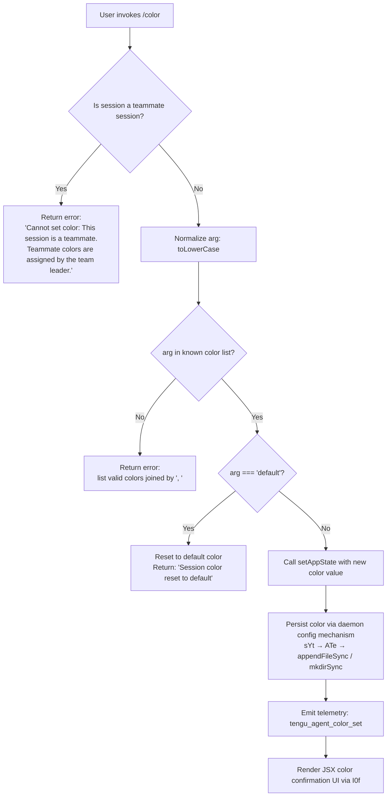

# `/color`

> Analysis basis: CC v2.1.195 bundle.js (AST extraction + Claude interpretation)
> Minimum version: v2.1.195

---

## Overview

The `/color` command sets the prompt bar color for the current Claude Code session. It accepts a named color (case-insensitive) or the special keyword `default` to reset to the default color, then persists the change through `appState` and emits a telemetry event. In team/teammate sessions, the command is blocked entirely, as colors in that context are controlled by the team leader.

---

## Registration

| Field | Value |
|---|---|
| type | `local-jsx` |
| name | `color` |
| description | `Set the prompt bar color for this session` |
| argumentHint | `null` |
| immediate | `true` |
| module_id | `gDl` |
| load_inline | `true` |
| loc_byte | `11461033` |
| loc_byte_end | `11461250` |
| loc_line | `7255` |
| arbor_handler.name | `T0f` |
| arbor_handler.fqn | `claude-2.1.195::T0f` |
| arbor_handler.kind | `AsyncFunction` |
| arbor_handler.resolution_path | `module_id` |
| arbor_handler.n_hits | `0` |

Analysis basis: CC v2.1.195 bundle.js:+11461033

---

## Input Branching

The command has four distinct execution paths: teammate guard, unknown-color error, explicit `default` reset, and valid color set. A Mermaid flowchart is used.



Analysis basis: CC v2.1.195 bundle.js:+11459810 (entry via `T0f → Qer`)

---

## Behavioral Spec

### 1. Entry Point and Handler Dispatch

The Arbor-resolved handler is `T0f` (AsyncFunction, `claude-2.1.195::T0f`, resolved via `module_id`). On invocation, `T0f` calls the primary logic function (`Qer`) and a supporting helper (`e`).

```
async function colorCommandHandler(context):
    argument = context.argument
    appStateAccessor = context.appState
    return await primaryColorLogic(argument, appStateAccessor)
```

Analysis basis: CC v2.1.195 bundle.js:+11459802 (`T0f → e`), +11459810 (`T0f → Qer`)

---

### 2. Teammate Guard

Before any color change is attempted, the handler checks whether the current session is a teammate session via a context-store lookup (`Cf → v0 → n3r.getStore`). If the session is identified as a teammate session, execution halts immediately and returns a fixed error message.

```
function checkTeammateGuard(sessionContext):
    store = getSessionStore()   // Cf → v0 → n3r.getStore
    if store.isTeammate:
        return errorResult(
            "Cannot set color: This session is a teammate. " +
            "Teammate colors are assigned by the team leader."
        )
    return null  // no guard triggered
```

Error string (citation fragment): `"Cannot set color: This session…"` — full literal at bundle.js:+11459882.

Analysis basis: CC v2.1.195 bundle.js:+11459871 (`Qer → Cf`), +11459882 (literal)

---

### 3. Color Normalization and Validation

The argument string is converted to lowercase (`n.toLowerCase`, bundle.js:+11460048). The normalized value is then checked against the known color list (`b0f.includes`, bundle.js:+11460066). If the color is not recognized, the list of valid colors is assembled via `zH.join(", ")` (bundle.js:+11460112) and returned as an error message to the user.

```
function validateColor(rawArg, knownColors, validColorList):
    normalized = rawArg.toLowerCase()
    if not knownColors.includes(normalized):
        validList = validColorList.join(", ")
        return errorResult("Unknown color. Valid colors: " + validList)
    return normalized
```

The separator used in the error list is `", "` (bundle.js:+11460120).

Analysis basis: CC v2.1.195 bundle.js:+11460048, +11460066, +11460090, +11460112, +11460120

---

### 4. Default Color Reset

If the validated color value equals the string `"default"` (bundle.js:+11460210), the handler triggers a reset path: it updates `appState` to remove or clear the session color, and returns a fixed confirmation string.

```
function handleDefaultReset(appStateAccessor):
    appStateAccessor.setAppState({ sessionColor: null })  // or cleared value
    return successResult("Session color reset to default")
```

Confirmation literal: `"Session color reset to default"` — bundle.js:+11460471.

Analysis basis: CC v2.1.195 bundle.js:+11460210 (literal `"default"`), +11460252 (`Qer → t.setAppState`), +11460471 (reset confirmation literal)

---

### 5. Valid Color Application

When the color is recognized and is not `"default"`, the handler calls `t.setAppState` (bundle.js:+11460252) to persist the new color in application state, then invokes `t.getAppState` (bundle.js:+11460295) to confirm the updated value. The color value is then forwarded to the daemon configuration persistence layer (`sYt`, bundle.js:+11460241), which resolves through `ATe` to perform file I/O (directory creation via `mkdirSync` at bundle.js:+13570602, atomic append via `appendFileSync` at bundle.js:+13570563). A random component is generated via `Math.floor(Math.random())` (bundle.js:+11460011, +11460022), likely used for file naming or deduplication. The telemetry event `tengu_agent_color_set` is emitted after successful persistence (bundle.js:+13576550).

```
async function applyColor(color, appStateAccessor, daemonConfigWriter):
    appStateAccessor.setAppState({ sessionColor: color })
    currentState = appStateAccessor.getAppState()

    // Persist to daemon config
    randomSuffix = Math.floor(Math.random() * ...)
    await daemonConfigWriter.persist(currentState, randomSuffix)
    // daemonConfigWriter internally: mkdirSync → appendFileSync

    emitTelemetry("tengu_agent_color_set")
    return renderColorConfirmation(color)
```

Analysis basis: CC v2.1.195 bundle.js:+11460241 (`Qer → sYt`), +11460252 (`Qer → t.setAppState`), +11460295 (`Qer → t.getAppState`), +13570563 (`ATe → appendFileSync`), +13570602 (`ATe → mkdirSync`), +13576550 (telemetry event)

---

### 6. Known Color List Helpers

Two helpers assist color lookup:

- `Jer` (bundle.js:+11460271): enumerates the keys of the color registry object using `Object.keys` (bundle.js:+11459575) to build the list of valid named colors.
- `JS` (bundle.js:+11460404): uses `oE.basename` (bundle.js:+4310332) and `Rt` (bundle.js:+4310354) — likely used for display name resolution of colors within the UI rendering path.

```
function getKnownColorKeys(colorRegistry):
    return Object.keys(colorRegistry)   // Jer
```

Analysis basis: CC v2.1.195 bundle.js:+11460271 (`Qer → Jer`), +11459575 (`Jer → Object.keys`)

---

### 7. JSX Confirmation Rendering

Upon a successful color operation (either set or reset), the handler invokes the JSX renderer `I0f` (bundle.js:+11460462). This renderer constructs the React element for the command's output, using:

- `yE` (bundle.js:+11460555): likely a styled component or color swatch element
- `cfe` (bundle.js:+11460596): content or text fragment helper
- `n1e` (bundle.js:+11460632): formatting or layout helper
- `ufe` (bundle.js:+11460702): additional UI utility

For the default-reset case, the string `"Session color reset to default"` is rendered (bundle.js:+11460471). For a named color, the color name is embedded in the rendered JSX output.

```
function renderColorResult(color, isReset):
    if isReset:
        label = "Session color reset to default"
    else:
        label = buildColorDisplay(color)   // using yE, cfe, n1e, ufe
    return JSXElement(label)
```

Analysis basis: CC v2.1.195 bundle.js:+11460462 (`Qer → I0f`), +11460471, +11460555, +11460596, +11460632, +11460702

---

### 8. Daemon Config Persistence Detail

The `sYt` → `ATe` sub-chain handles durable persistence of the color change to the agent's configuration store (the `"agent-color"` key, literal at bundle.js:+13576466). It also invokes `zc` (bundle.js:+13576516) and `W` (bundle.js:+13576548) for finalization and notification. The `ATe` function performs:

1. Format the config update via `f4` (bundle.js:+13570524), which calls `qt` for serialization and `Me` → `JSON.stringify` (bundle.js:+193083).
2. Ensure the config directory exists (`mkdirSync`, path resolved via `Ih.dirname`, bundle.js:+13570614).
3. Write the config atomically (`appendFileSync`, bundle.js:+13570563).
4. Register completion via `zc → vi → krs.register` (bundle.js:+68053).

```
async function persistAgentColor(colorValue, configPath):
    serialized = JSON.stringify(buildConfigEntry("agent-color", colorValue))
    mkdirSync(dirname(configPath), { recursive: true })
    appendFileSync(configPath, serialized)
    registerCompletion()
    emitTelemetry("tengu_agent_color_set")
```

Analysis basis: CC v2.1.195 bundle.js:+13576466 (`"agent-color"` literal), +13570524 (`ATe → f4`), +13570563 (`appendFileSync`), +13570602 (`mkdirSync`), +13570614 (`Ih.dirname`), +13576550 (telemetry)

---

## State & Side Effects

| Item | Detail |
|---|---|
| Telemetry | `tengu_agent_color_set` (bundle.js:+13576550) — emitted on successful color set; `tengu_daemon_config_reload` (bundle.js:+17902328) — emitted by daemon config reload path reachable via `$Dn`; `tengu_feature_ok` / `tengu_feature_bad` (bundle.js:+1027363, +1027430) — emitted in feature-flag validation paths reachable from the call graph; `tengu_daemon_control` (bundle.js:+17924594) — daemon lifecycle telemetry reachable via `SF`; `tengu_bg_state_read_transient` (bundle.js:+4312062) — background state read telemetry reachable via `Ki` |
| appState changes | `t.setAppState` called with new session color value (bundle.js:+11460252); `t.getAppState` read back after set (bundle.js:+11460295) |
| Daemon config persistence | Writes `"agent-color"` key to config file via `appendFileSync` + `mkdirSync` (bundle.js:+13570563, +13570602); uses `zc → vi → krs.register` for hook registration (bundle.js:+68053) |
| Teammate guard | Hard-blocks color change if session is a teammate; no state mutation occurs (bundle.js:+11459882) |
| Hook registration | `krs.register` invoked via `vi → zc` as part of daemon config write completion (bundle.js:+68053) |
| Sound | <!-- TODO: not found in depth-2 traversal; needs --depth 4 --> |
| Random number usage | `Math.floor(Math.random())` called during color logic (bundle.js:+11460011, +11460022) — purpose is likely temp file suffix or deduplication token |

---

## Version History

| Version | Change |
|---|---|
| v2.1.195 | Initial analysis |

---

## Common Mistakes

1. **Invoking `/color` in a teammate session**: The command will immediately return the error `"Cannot set color: This session is a teammate. Teammate colors are assigned by the team leader."` — no color is set. Only the team leader's session can assign colors.
2. **Passing an unrecognized color name**: If the argument is not in the known color list (`b0f`), the command fails and prints the valid options joined by `", "`. Color names are matched case-insensitively, but must still match an entry in the color registry.
3. **Expecting instant daemon-level persistence without a running daemon**: The `sYt → ATe` path writes to the filesystem via `appendFileSync`/`mkdirSync`, but downstream daemon config reload (`tengu_daemon_config_reload`) depends on daemon availability.
4. **Omitting the argument**: The registration has `argumentHint: null` and `immediate: true`. The command executes immediately upon selection; providing no argument may invoke a default path (the `"default"` reset branch) or produce an error depending on how the empty input is normalized.
5. **Assuming the color persists across all sessions**: The color is set per-session via `appState`. Its durability depends on the daemon config write succeeding and the agent reloading that config on startup.

---

## Appendix — Identifier Mapping

> For bundle debugging only. Identifiers change across versions.

| Identifier | Role |
|---|---|
| `T0f` | Arbor-resolved async handler for `/color` command (entry point) |
| `Qer` | Primary color logic function; performs guard, validation, state update, persistence dispatch |
| `Cf` | Session context accessor (calls `v0` → `n3r.getStore`) |
| `v0` | Store accessor helper (calls `n3r.getStore`) |
| `Jer` | Color registry key enumerator (calls `Object.keys` on color map) |
| `sYt` | Daemon config persistence dispatcher (calls `ATe`, `Ox`, `Rt`, `zc`, `W`) |
| `ATe` | Config file writer; performs `mkdirSync` + `appendFileSync` for agent-color config |
| `f4` | Config entry formatter (calls `ut`, `Csc`, `n5`, `s3e`) |
| `Ox` | Rendering/output helper called from `sYt` (calls `Rt`, `Nk`, `em`, `Xh`, `Hr`) |
| `Nk` | Sub-helper within `Ox` path |
| `em` | UI output helper (calls `UB`, `Xh`, `Hr`, `yke.join`, `Rt`) |
| `UB` | Output utility (calls `u0`) |
| `Hr` | Output utility (calls `u0`) |
| `Rt` | Base rendering/output primitive (calls `u0`) |
| `u0` | Low-level output sink |
| `zc` | Daemon config registration dispatcher (calls `vi`) |
| `vi` | Hook/handler registrar (calls `krs.register`) |
| `$Dn` | Background state / daemon config management (calls `_c`, `Ki`, `sE`, `zd`, `Cn`, `Jf`) |
| `_c` | Path resolution helper (calls `oE.join`, `mk`) |
| `mk` | Path join helper (calls `oE.join`, `tr`) |
| `Ki` | Background state reader/writer with file I/O (calls `gT.lstat`, `gT.readFile`, `Gne.*`, `W0e.*`, etc.) |
| `sE` | Cache/store entry deleter (calls `Gne.delete`) |
| `zd` | Atomic file writer (calls `eg`, `oE.join`, `Me`, `sE`) |
| `eg` | Low-level atomic write primitive (calls `Xxr.randomBytes`, `f7.writeFile`, `f7.rename`, etc.) |
| `Jf` | File-based lock/queue manager (calls `on`, `eae.has`, `T`, `ye`, `xe`) |
| `xe` | Async task executor with error logging (calls `Zr`, `ut`, `qi`, `BMu`, `GZe.push`, `Gee.logError`) |
| `Zr` | Error constructor/formatter (calls `Error`, `String`) |
| `qi` | Traffic queue helper (calls `rSs`) |
| `BMu` | Bounded queue manager (calls `Tpn.shift`, `Tpn.push`) |
| `I0f` | JSX confirmation renderer for color result (calls `yE`, `cfe`, `n1e`, `r`, `ufe`) |
| `yE` | Color swatch or styled display component |
| `cfe` | Content/text fragment helper in JSX render |
| `n1e` | Layout/formatting helper in JSX render |
| `ufe` | UI utility in JSX render |
| `JS` | Color display name resolver (calls `oE.basename`, `Rt`) |
| `pht` | Helper invoked after color list lookup (purpose: <!-- TODO: not found in depth-2 traversal; needs --depth 4 -->) |
| `Cs` | Error/exit handler (calls `D7e`, `aI`, `process.exit`) |
| `s3e` | Store/state commit helper (calls `TL`, `Cf`, `Ppd`) |
| `qt` | Serialization helper |
| `Me` | JSON serializer wrapper (calls `JSON.stringify`) |
| `Bt` | JSON parser wrapper (calls `JSON.parse`) |
| `ut` | String coercion utility (calls `String`) |
| `Cn` | Notification/event emitter (calls `on`) |
| `Ld` | Listener registration helper (calls `on`) |
| `ye` | String error helper (calls `String`) |
| `Le` | Daemon stop reporter — success path (calls `W`, `Oe`) |
| `ke` | Daemon stop reporter — failure path (calls `W`, `Oe`) |
| `SF` | Daemon control helper (calls `p6`, `vY.push`, `y4e`, `GKr`) |
| `yj` | Daemon lifecycle orchestrator (calls `Promise.race`, `Promise.all`, `T_e`, `k_e`, `Un`, `process.exit`) |
| `u` | Daemon stop coordinator (calls `Le`, `ke`, `SF`, `yj`) |
| `E` | Session/SDK stop handler (calls `kIt`, `cD`, `uD`, `Promise.all`, `yX`, `w9`, `xe`, `Zr`) |
| `A` | Auth/user-info manager (calls `nhr`, `thr`, `H.userinfo`, `Error`) |
| `EWc` | Heartbeat/connection event handler (calls `dce`) |
| `I` | Input event handler (calls `Math.max`, `Math.floor`, `M.preventDefault`, `A`) |
| `d` | Supervisor/session orchestrator (calls `C7e`, `r.write`, `Vtc`, `i.get`, `E.stop`, `A.stop`, `A.updateConfig`, `A.start`, `EWc`, `I.start`, `W`) |
| `C7e` | File stat and read helper with size limit (calls `jtc.stat`, `on`, `Promise.reject`, `i.isFile`, `Vs`, `y5o`, `ye`, `wa`, `_5o`, `Object.keys`, `o.has`) |
| `Vtc` | Column-width calculator (calls `Object.keys`, `Math.max`, `k_`) |
| `Lc` | Path/filename sanitizer (calls `_is`, `e.replace`, `r.at`, `n.lastIndexOf`, `n.slice`) |
| `jXe` | Symbol/alias resolver (calls `ais`) |
| `PYc` | File context builder (calls `_Xe`, `Qge`, `Xge.dirname`, `w1`, `qt`, `tae`, `Sis`, `oAr`, `Buffer.byteLength`, `iAr`, `Win.then`, `DYc.bind`, `vi`) |
| `RYc` | Request/response handler (calls `w1`, `eAr`, `Drs`) |
| `T` | File content reader with encoding (calls `AFe`, `RYc`, `e.includes`, `Me`, `t.toUpperCase`, `Lc`, `e.trim`, `L1`, `jXe`, `PYc`) |
| `Csc` | Config schema checker |
| `n5` | Config normalization helper |
| `W` | State notification / event dispatch primitive |

---

Note: index built via Arbor fallback; some signals (telemetry, literals) may be missing — see arbor-fallback.js.