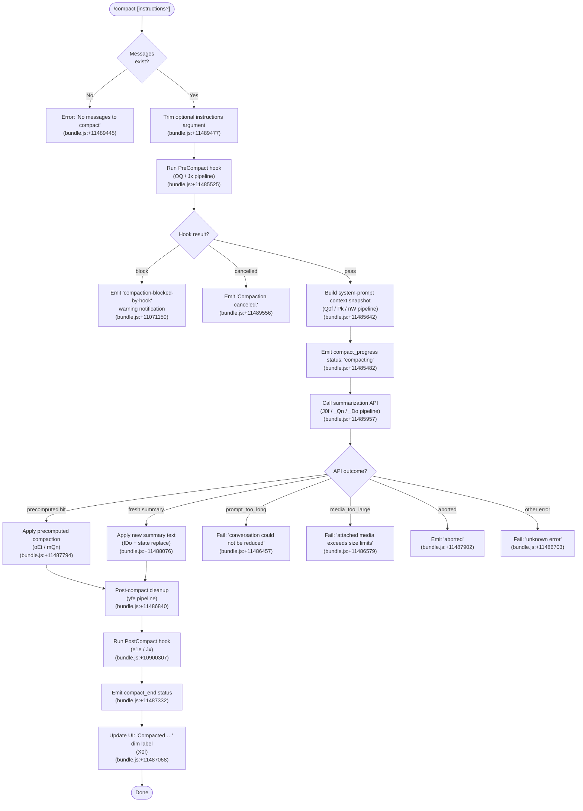

# `/compact`

> Analysis basis: CC v2.1.195 bundle.js (AST extraction + Claude interpretation)
> Minimum version: v2.1.195

---

## Overview

`/compact` summarizes the current conversation history into a condensed form, freeing up context-window space without ending the session. It optionally accepts a custom summarization instruction string that guides how the summary is generated. The command is also invocable in non-interactive (SDK/pipeline) modes via `thinClientDispatch: "post-text"`.

---

## Registration

| Field | Value |
|---|---|
| type | `local` |
| name | `compact` |
| description | `Free up context by summarizing the conversation so far` |
| argumentHint | `<optional custom summarization instructions>` |
| supportsNonInteractive | `true` |
| thinClientDispatch | `post-text` |
| module_id | `nPl` |
| load_inline | `true` |
| loc_byte | `11489945` |
| loc_byte_end | `11490245` |
| arbor_handler.name | `z0f` |
| arbor_handler.fqn | `claude-2.1.195::z0f` |
| arbor_handler.kind | `AsyncFunction` |
| arbor_handler.resolution_path | `module_id` |
| arbor_handler.n_hits | `0` |

Analysis basis: CC v2.1.195 bundle.js:+11489945

---

## Input Branching

More than three distinct execution paths are present (no messages, hook block, pre-compact, API call, post-compact cleanup, error variants). A flowchart is mandatory.



---

## Behavioral Spec

### Top-level handler (`z0f`)

```
async function compactCommandHandler(context, args):
    rawInstructions = args  // may be empty string

    // Guard: conversation must have at least one message
    if conversationMessages.length == 0:
        throw Error("No messages to compact")          // bundle.js:+11489445

    customInstructions = rawInstructions.trim()        // bundle.js:+11489477

    // Delegate all compaction logic to orchestrator
    result = await runCompaction(context, customInstructions)

    // Surface any cancellation string to the caller
    if result.cancelled:
        return String(result.message)                  // bundle.js:+11489769

    return result
```

Analysis basis: CC v2.1.195 bundle.js:+11489414

---

### Compaction orchestrator (`Y0f`)

```
async function runCompaction(context, customInstructions):
    startTime = performance.now()                      // bundle.js:+11485503

    // Stage 1 — fire PreCompact hooks in parallel with context snapshot
    [hookResult, contextSnapshot] = await Promise.all([
        runPreCompactHook(context),                    // qI  bundle.js:+11485525
        buildContextSnapshot(context),                 // Q0f bundle.js:+11485642
    ])

    // Stage 2 — handle hook outcomes
    if hookResult.decision == "block":
        emitNotification("compaction-blocked-by-hook", "warning")  // bundle.js:+11071150
        return { blocked: true }

    // Stage 3 — emit progress status
    emitStatus("compact_progress", { status: "compacting" })       // bundle.js:+11485482

    // Stage 4 — call summarization model
    try:
        summaryResult = await callSummarizationAPI(
            context,
            contextSnapshot,
            customInstructions,
            mode = "manual"                            // bundle.js:+11485579
        )                                              // J0f  bundle.js:+11485957
    catch err:
        handleCompactionError(err)                     // bundle.js:+11486387
        return { error: true }

    // Stage 5 — post-compact cleanup (clear caches, reset state)
    await postCompactCleanup(context, summaryResult)   // yfe  bundle.js:+11486840

    // Stage 6 — run PostCompact hook
    await runPostCompactHook(context)                  // _Qn → e1e  bundle.js:+10900307

    // Stage 7 — update UI
    updateUIAfterCompaction(summaryResult)             // X0f  bundle.js:+11487068

    emitStatus("compact_end")                          // bundle.js:+11487332
    return { success: true }
```

Analysis basis: CC v2.1.195 bundle.js:+11485503

---

### Context-boundary insertion (`DH` / `Uer`)

Before the summarization request is formed, a special `system`-role message tagged `"compact_boundary"` is inserted to delimit what will be summarized from what follows.

```
function insertCompactBoundary(messages):
    boundaryMsg = {
        role: "system",
        tag:  "compact_boundary"    // bundle.js:+14009760
    }
    // Boundary is placed at index derived from message slice
    trimmed = messages.slice(1, ...)   // DH → e.slice  bundle.js:+14009913
    return [boundaryMsg, ...trimmed]
```

Analysis basis: CC v2.1.195 bundle.js:+11489414 (call to `DH`), +14009738, +14009760

---

### PreCompact hook pipeline (`qI` → `_vf` → `vZn` / `OQ` → `Jx`)

```
async function runPreCompactHook(context):
    // Serialize current conversation to hook-input format
    serializedMessages = serializeMessagesForHook(messages)   // _vf  bundle.js:+11120422

    // Execute all registered PreCompact hook handlers
    hookResults = await Promise.all(
        hooks.map(h => executeHook("PreCompact", serializedMessages, h))
    )                                                          // OQ / Jx  bundle.js:+11485554

    // Collect block / cancel decisions
    for result in hookResults:
        if result.decision == "block":
            return { decision: "block" }
    return { decision: "pass" }
```

Hook-dispatch string observed: `"PreCompact"` (bundle.js:+13665862).

Analysis basis: CC v2.1.195 bundle.js:+11485525

---

### Summarization API call (`J0f`)

```
async function callSummarizationAPI(context, snapshot, instructions, mode):
    // Check for a precomputed compaction first
    precomputed = getPrecomputedCompaction(context)    // dDo  bundle.js:+11487739

    if precomputed != null and precomputed.ready:
        // Consume precomputed result
        emitTelemetry("tengu_precomputed_compact_consumed")   // bundle.js:+10892968
        applied = applyPrecomputedSummary(precomputed)        // oEt  bundle.js:+11487794
        return applied

    // Otherwise request a fresh summary from the model
    response = await requestFreshSummary(snapshot, instructions)   // _Qn  bundle.js:+11486043

    if response.status == "aborted":
        recordMiss("miss_not_ready")                   // bundle.js:+11487824
        throw AbortError("aborted")

    // Validate: find boundary index in response
    boundaryIndex = findBoundaryIndex(response)        // fDo  bundle.js:+11488076
    if boundaryIndex == -1:
        throw Error("boundary_uuid_missing")           // bundle.js:+11488156

    return response.slice(boundaryIndex)
```

Analysis basis: CC v2.1.195 bundle.js:+11487713

---

### Reactive compaction path (`_Do` → `CUn` → `cup`)

When the summarization API response indicates the context is still too long (prompt too long / media too large), the runtime attempts a reactive (automatic) compaction strategy:

```
async function reactiveCompact(context, messages):
    groups = groupMessagesForCompaction(messages)      // CUn  bundle.js:+10898180

    if groups.length < 2:
        log("Reactive compact: fewer than 2 groups, nothing to compact")
        // bundle.js:+5407829
        return { status: "too_few_groups" }

    // Attempt summarization of oldest groups
    for attempt in [withMedia, strippedMedia]:
        result = await summarizeGroup(groups, attempt) // cup  bundle.js:+5408853
        if result.ok:
            emitTelemetry("tengu_reactive_compact_succeeded")   // bundle.js:+10900903
            return result
        if result.error == "media_too_large" and attempt == withMedia:
            log("Reactive compact: summarize hit media-size error, retrying stripped")
            // bundle.js:+5409520
            continue
        break

    emitTelemetry("tengu_reactive_compact_failed")     // bundle.js:+10898434
    return { status: "exhausted" }
```

Analysis basis: CC v2.1.195 bundle.js:+11486094

---

### Post-compact cleanup (`yfe`)

After a successful summary is applied, `yfe` resets all session-scoped caches so stale data is not carried forward:

```
function postCompactCleanup(context, summaryResult):
    clearPrecomputationCache()          // gQn / uQn  bundle.js:+10894400
    clearPluginCaches()                 // $La         bundle.js:+10894501
    resetAgentLoopCounters()            // All / VPe   bundle.js:+10894507
    resetAutonomousLoopDelivered()      // ITf.resetAutonomousLoopDelivered  bundle.js:+10894533
    clearKeyboardBindings()             // Wy           bundle.js:+10894583
    storeCompactMetadata(summaryResult) // compactMetadata  bundle.js:+11486787
    runPostCompactFileRestore()         // EQn / ZOe   bundle.js:+11088011
    emitTelemetry("tengu_post_compact_file_restore_success")  // bundle.js:+11088289
```

Analysis basis: CC v2.1.195 bundle.js:+11486840

---

### UI update after compaction (`X0f`)

```
function updateUIAfterCompaction(summaryResult):
    registerKeyBinding("app:toggleTranscript", "Global", "ctrl+o")
    // bundle.js:+11488706, +11488729, +11488738

    label = "Compacted " + formatCount(summaryResult.messageCount)
    // bundle.js:+11488845

    renderDimLabel(label)              // Ct.dim  bundle.js:+11488838
    joinParts(parts)                   // o.join  bundle.js:+11488858
```

Analysis basis: CC v2.1.195 bundle.js:+11487068

---

### Error classification

| Condition | User-visible message | Literal source |
|---|---|---|
| No messages | `"No messages to compact"` | bundle.js:+11489445 |
| Prompt too long | `"Compaction failed · conversation could not be reduced below the context limit"` | bundle.js:+11486457 |
| Media too large | `"Compaction failed · attached media exceeds size limits"` | bundle.js:+11486579 |
| Hook blocked | `"compaction blocked by PreCompact hook"` | bundle.js:+11071184 |
| Hook cancelled | `"Compaction canceled."` | bundle.js:+11489556 |
| Unknown | `"unknown error"` | bundle.js:+11486703 |

---

## State & Side Effects

| Item | Detail |
|---|---|
| Telemetry — precomputed hit | `tengu_precomputed_compact_consumed` (bundle.js:+10892968) |
| Telemetry — precomputed miss | `tengu_precomputed_compact_discarded` (bundle.js:+10893607) |
| Telemetry — reactive success | `tengu_reactive_compact_succeeded` (bundle.js:+10900903) |
| Telemetry — reactive failure | `tengu_reactive_compact_failed` (bundle.js:+10898434) |
| Telemetry — reactive attempt | `tengu_reactive_compact_attempt` (bundle.js:+5408638) |
| Telemetry — reactive aborted | `compact_reactive_aborted` literal (bundle.js:+10898943) |
| Telemetry — file restore OK | `tengu_post_compact_file_restore_success` (bundle.js:+11088289) |
| Telemetry — file restore error | `tengu_post_compact_file_restore_error` (bundle.js:+11088331) |
| Telemetry — credits clamp | `tengu_compact_credits_clamp_rescue` (bundle.js:+5408481) |
| Telemetry — hook run | `tengu_run_hook` (bundle.js:+13721014) |
| Hook registration (pre) | `PreCompact` hook event fired before summarization (bundle.js:+13665862) |
| Hook registration (post) | `PostCompact` hook event fired after summary applied (bundle.js:+13700281) |
| appState changes | Conversation messages replaced with summary; `compactMetadata` key written (bundle.js:+11486787); `O3t.setState` called via `fut` (bundle.js:+11487068) |
| Cache resets | Precomputation cache, plugin/skills cache, keyboard bindings, autonomous-loop counters all cleared in `yfe` (bundle.js:+10894400–10894583) |
| Key binding | `ctrl+o` bound to `app:toggleTranscript` / `Global` after compact (bundle.js:+11488738) |
| Sound | <!-- TODO: not found in depth-2 traversal; needs --depth 4 --> |
| Progress statuses emitted | `compact_progress` → `compacting`, `compact_start`, `stream_mode`, `requesting`, `response_length`, `reset`, `notification` (bundle.js:+11485366–11485860) |

---

## Version History

| Version | Change |
|---|---|
| v2.1.195 | Initial analysis |

---

## Common Mistakes

1. **Running `/compact` on an empty session** — the command throws immediately with `"No messages to compact"` if the message list is empty. Ensure at least one exchange has occurred.
2. **Expecting instant context relief in the same turn** — compaction is asynchronous and involves an API round-trip; subsequent tool calls issued before `compact_end` is emitted may still see the old (large) context.
3. **Assuming custom instructions change the model used** — the summarization always uses the session's configured model; custom instructions only influence the *content* of the summary prompt, not model selection.
4. **Ignoring PreCompact hook blocks** — if a `PreCompact` hook returns `"block"`, the command silently skips compaction. Scripts that depend on context being reduced should check the output message for the `compaction-blocked-by-hook` notification.
5. **Treating reactive compaction as equivalent to manual `/compact`** — reactive compaction (auto-triggered near context limits) uses a different code path (`_Do` / `CUn`) and may drop media attachments during retry; it should not be relied upon as a substitute for explicit user-initiated compaction.
6. **Using `/compact` in non-interactive pipelines without `--output-format`** — the command supports `supportsNonInteractive: true` and dispatches via `thinClientDispatch: "post-text"`, but the result text must be captured explicitly by the calling pipeline.

---

## Appendix — Identifier Mapping

> For bundle debugging only. Identifiers change across versions.

| Identifier | Role |
|---|---|
| `z0f` | Top-level `/compact` command handler (AsyncFunction) |
| `DH` | Compact-boundary message inserter |
| `Uer` | Message-slice helper called by `DH` |
| `pA` | Inner utility called by `Uer` |
| `Y0f` | Compaction orchestrator — runs hooks, API call, cleanup |
| `qI` | PreCompact hook runner dispatcher |
| `_vf` | Message serializer for hook input |
| `DRe` | Hook-input builder (role filter: assistant/user/api_system) |
| `vZn` | Full conversation serializer (handles all content types) |
| `OQ` | PreCompact hook execution coordinator |
| `Td` | API model configuration builder |
| `YC` | Model selection helper (claude-3/opus/sonnet/haiku variants) |
| `MP` | Effort/thinking-budget setter |
| `Ox` | Tool-list builder for summarization request |
| `Ot` | Request options assembler |
| `Jx` | Hook dispatch engine (PreCompact / PostCompact) |
| `U3` | Policy settings loader |
| `T` | Message role normaliser / formatter |
| `TTe` | Hook result merger |
| `$Go` | Hook-registry resolver (PreToolUse, PostToolUse, PreCompact … ) |
| `UGo` | Third-party hook filter |
| `Nn` | Hook matcher |
| `W` | User message constructor |
| `Me` | JSON stringifier wrapper |
| `xe` | Hook error logger |
| `ke` | Feature flag evaluator (ok/bad) |
| `E2e` | Hook callback executor |
| `Rk` | Timeout / abort controller for hook execution |
| `Glr` | Hook result post-processor |
| `MGo` | MCP tool hook runner |
| `Vlr` | Hook JSON/plain-text output parser |
| `Cfe` | Hook environment variable builder |
| `kGo` | HTTP hook runner |
| `Qic` | Hook output parser (slice / startsWith logic) |
| `qlr` | Shell-spawn hook executor |
| `Le` | Assistant message constructor |
| `n9` | Telemetry event emitter |
| `Q0f` | Context snapshot builder (app-state + system prompt) |
| `Pk` | System-prompt assembler (all prompt sections) |
| `nWo` | Worktree/session context injector |
| `mo` | Model-feature-flag checker |
| `JZn` | Tool-list formatter for system prompt |
| `Mr` | Memory / CLAUDE.md loader |
| `QLe` | Brief-mode prompt loader |
| `wtm` | Core behavioural instruction injector |
| `Ltm` | Irreversible-action confirmation instruction |
| `xtm` | Outward-facing action instruction |
| `xvn` | Fable identity checker |
| `x8` | Platform/OS info injector |
| `dNi` | Tool parameter JSON instruction |
| `$te` | Fable-5 mitigation injector |
| `at` | Memory directory loader |
| `iWo` | Slate-harrier flag handler |
| `anm` | Slate-harrier wrapper |
| `qq` | Memory coordinator |
| `jtm` | Orchid-mantis / scheduling prompt handler |
| `BUt` | CLAUDE.md / memory-file loader |
| `Ztm` | Env-info-static prompt builder |
| `Qtm` | Env-info-simple prompt builder |
| `Otm` | Language instruction injector |
| `Ntm` | Output-style injector |
| `tnm` | Background-session prompt handler |
| `Ozn` | Scratchpad instruction injector |
| `rnm` | Brief-mode context-management injector |
| `inm` | Reproduce-verify workflow injector |
| `Ktm` | Act-dont-rederive injector |
| `Dtm` | Heron-brook instruction injector |
| `Ptm` | Autonomy-append injector |
| `Tyl` | MCP tool-description cache |
| `qtm` | Task-continuity injector |
| `$tm` | System section builder |
| `Ftm` | Verified-vs-assumed injector |
| `Btm` | Fable identity section |
| `Gtm` | Tool-param-json injector |
| `Vtm` | SDK injector |
| `XUi` | Memory-dir UI helper |
| `ZLe` | First-party / Anthropic-AWS account checker |
| `Eac` | Compact-context extra-section builder |
| `Br` | Conversation history reader (getAppState + findLast) |
| `uZn` | User-message extractor |
| `dZn` | Assistant-message extractor |
| `xF` | Permission-mode reader |
| `nW` | Agent memory loader / system-prompt fetcher |
| `Ec` | Environment info collector |
| `jI` | Tool-list serializer for system prompt |
| `ro` | Module loader bootstrap |
| `Eh` | System prompt builder (main-thread) |
| `Oe` | User message factory |
| `je` | Assistant message factory |
| `gZn` | Compact guard (quick context check) |
| `SPo` | SDK-status emitter |
| `J0f` | Summarization API caller (precomputed vs fresh) |
| `dDo` | Precomputed compaction fetcher |
| `Mzt` | Precomputation state map |
| `oEt` | Precomputed summary applier |
| `pQn` | Summarization model configuration |
| `$h` | Token-count helper |
| `No` | Message factory (No role) |
| `fDo` | Boundary index finder in response |
| `mQn` | Summary metadata recorder |
| `_Qn` | Fresh summarization request handler |
| `h4e` | Context type classifier |
| `RP` | Agent-custom prefix checker |
| `eA` | API request builder for summarization |
| `Mia` | Pre/post request hooks for API |
| `fre` | API fetch helper |
| `f3t` | Header map normaliser |
| `gGe` | Context token measurer |
| `YJ` | Cache key generator |
| `U3t` | Per-turn cache lookup |
| `_Ge` | Cache write helper |
| `sXe` | Summary text extractor |
| `iEt` | Post-compact state writer |
| `zc` | Conversation state updater |
| `Dzt` | UUID generator for summary boundary |
| `DQ` | Message-set accumulator |
| `cvf` | Tool-result content checker |
| `lvf` | Tool-result text extractor |
| `CTf` | Post-compact orchestrator (file restore + hook) |
| `EQn` | File-restore coordinator |
| `TQn` | App-state post-compact validator |
| `SQn` | SD/ED message rebuilder |
| `bQn` | Conversation rebuilder after compact |
| `AQn` | Attachment restorer |
| `FAe` | Session-start hook runner |
| `ZOe` | File-content restore engine |
| `wKe` | Working-set update after restore |
| `ai` | Message UUID / timestamp stamper |
| `JV` | Plugin/hook loader at session start |
| `e1e` | PostCompact hook runner |
| `yDo` | Summary group builder |
| `BKe` | First-party message filter |
| `UAe` | Token usage aggregator |
| `iUn` | Token counter (Math.round wrapper) |
| `sUn` | Per-message usage stats collector |
| `ux` | Full message serializer for API payload |
| `wf` | Token weight calculator |
| `icp` | Per-content-block serializer |
| `uk` | Model + policy options builder |
| `gg` | App-state snapshot getter |
| `_Do` | Reactive compact controller |
| `CUn` | Reactive compact grouper / executor |
| `q3t` | Summarize-set builder (DH wrapper) |
| `Bca` | Group-size calculator |
| `cup` | Per-group summarization caller |
| `uup` | Retry wrapper for reactive compact |
| `Vct` | AbortError classifier |
| `C9` | Path / URL redactor for telemetry |
| `oup` | Path tail redactor |
| `Xcp` | Phone number redactor |
| `Zcp` | Email redactor |
| `Kcp` | IP address redactor |
| `Wcp` | Email address variant redactor |
| `Bcp` | Home-directory path redactor |
| `tup` | API-body redactor |
| `eup` | MCP server-name redactor |
| `rup` | Plugin-root redactor |
| `aio` | Reactive-compact abort handler |
| `wt` | Feature flag (sad/ok) reporter |
| `ye` | String coercion helper |
| `yfe` | Post-compact cleanup orchestrator |
| `gQn` | Precomputation cache cleaner |
| `g3t` | Cache store reference |
| `cx` | LRU cache implementation |
| `Nvt` | Session-context resetter |
| `Fvt` | Output-token counter resetter |
| `uQn` | Owl cache cleaner |
| `$La` | k4t/tpo cache cleaner |
| `All` | Autonomous loop state resetter |
| `VPe` | Autonomous loop delivered-flag resetter |
| `Wy` | Object.values iterator helper |
| `gDo` | Post-cleanup telemetry emitter |
| `fut` | App state setter (O3t.setState) |
| `X0f` | UI updater post-compact |
| `YVe` | Model display name resolver |
| `prf` | Model profile (opus/sonnet) resolver |
| `tv` | Key-binding registrar |
| `oMn` | Binding action dispatcher |
| `sMn` | Binding scheduler |
| `X0e` | OTEL metrics emitter for compact event |
| `Xc` | Metric recorder |
| `X5e` | OTEL attribute builder |
| `Bvt` | Metric value formatter |
| `Q_r` | Metric series emitter |
| `Z_r` | Metric flush helper |
| `Zie` | Cancellation check utility |