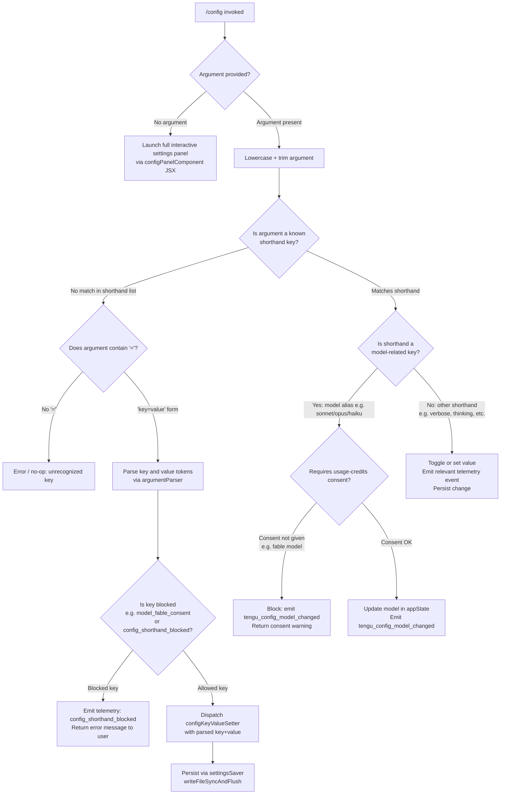

# `/config`

> Analysis basis: CC v2.1.195 bundle.js (AST extraction + Claude interpretation)
> Minimum version: v2.1.195

---

## Overview

The `/config` command (also reachable as `/settings`) opens an interactive settings panel that allows users to browse and modify a wide range of Claude Code behavioral preferences. It supports both a full TUI panel launch and a shorthand `key=value` inline syntax for setting individual configuration keys directly from the command line.

---

## Registration

| Field | Value |
|---|---|
| type | `local-jsx` |
| name | `config` |
| description | `Open settings` |
| aliases | `["settings"]` |
| argumentHint | `[key=value]` |
| module_id | `cNl` |
| load_inline | `true` |
| loc_byte | `11728408` |
| loc_byte_end | `11728686` |
| loc_line | `7437` |
| arbor_handler.name | `UDf` |
| arbor_handler.fqn | `claude-2.1.195::UDf` |
| arbor_handler.kind | `AsyncFunction` |
| arbor_handler.resolution_path | `module_id` |
| arbor_handler.n_hits | `0` |

Analysis basis: CC v2.1.195 bundle.js:+11728408

---

## Input Branching

The command distinguishes at least four distinct input paths based on argument content, so a Mermaid flowchart is used.



Analysis basis: CC v2.1.195 bundle.js:+11727480, +11727541, +11727560, +11727576, +11727593, +11727670, +11727712

---

## Behavioral Spec

### Top-level Handler: configCommandHandler (UDf)

The handler `UDf` is an `AsyncFunction` resolved via `module_id` → `cNl`.

Analysis basis: CC v2.1.195 bundle.js:+11727480

```
async function configCommandHandler(context, argument):
    argument_normalized = argument.toLowerCase().trim()

    if argument_normalized is empty:
        return renderConfigPanel(context)   // JSX panel via iUo.jsx

    if argument_normalized in knownShorthands:
        return handleShorthand(context, argument_normalized)

    if '=' not in argument_normalized:
        return error("Unrecognized config key")

    [key, value] = argumentParser(argument_normalized)

    if key in blockedKeys:
        emitTelemetry("config_shorthand_blocked")
        return error("needs usage-credits consent — run /model first")

    applyKeyValueSetting(context, key, value)
    persistSettings()
```

Analysis basis: CC v2.1.195 bundle.js:+11727541, +11727560, +11727576, +11727593

---

### Settings Panel Renderer: configPanelComponent (oSt)

When invoked without arguments, the command launches a full interactive panel implemented in `oSt`. This is the primary UI for the `/config` command and exposes grouped settings rows.

Analysis basis: CC v2.1.195 bundle.js:+11509884

```
function configPanelComponent(context):
    appState = context.getAppState()
    settings = loadCurrentSettings(appState)

    rows = buildSettingRows([
        modelRow(settings),
        verboseRow(settings),
        thinkingRow(settings),
        fastModeRow(settings),
        autoCompactRow(settings),
        notificationsRow(settings),
        tipsRow(settings),
        reduceMotionRow(settings),
        promptSuggestionsRow(settings),
        sessionRecapRow(settings),
        checkpointsRow(settings),
        workflowsRow(settings),
        verboseOutputRow(settings),
        progressBarRow(settings),
        terminalTabStatusRow(settings),
        turnDurationRow(settings),
        precomputeCompactionRow(settings),
        timestampsRow(settings),
        permissionModeRow(settings),
        worktreeBaseRefRow(settings),
        gitignoreRow(settings),
        copyFullResponseRow(settings),
        copyOnSelectRow(settings),
        autoScrollRow(settings),
        agentsViewRow(settings),
        autoUpdatesChannelRow(settings),
        themeRow(settings),
        notifChannelRow(settings),
        outputStyleRow(settings),
        defaultViewRow(settings),
        languageRow(settings),
        editorModeRow(settings),
        externalEditorContextRow(settings),
        prStatusRow(settings),
        diffToolRow(settings),
        autoConnectIdeRow(settings),
        autoInstallIdeExtensionRow(settings),
        chromeRow(settings),
        teammateModeRow(settings),
        teammateDefaultModelRow(settings),
        remoteControlRow(settings),
        externalIncludesRow(settings),
        apiKeyRow(settings),
    ])

    return renderPanel(rows)
```

Analysis basis: CC v2.1.195 bundle.js:+11509884, +11509948, +11509965

---

### Settings Loader: settingsLoader (io)

Loads all settings layers and merges them for panel display.

Analysis basis: CC v2.1.195 bundle.js:+11509965

```
async function settingsLoader(context):
    policySettings  = loadLayer("policySettings")   // bundle.js:+1344871
    flagSettings    = loadLayer("flagSettings")      // bundle.js:+1344893
    userSettings    = loadLayer("userSettings")      // bundle.js:+1345517
    projectSettings = loadLayer("projectSettings")   // bundle.js:+1345632
    localSettings   = loadLayer("localSettings")     // bundle.js:+1345655

    merged = mergeSettingsLayers(
        policySettings,
        flagSettings,
        userSettings,
        projectSettings,
        localSettings
    )

    invalidate caches: clearKonCache(), clearQHrCache()  // bundle.js:+29196, +29208
    return merged
```

Settings files reside at:
- `~/.claude/settings.json` (user-level) (bundle.js:+1325246, +1325256)
- `~/.claude/settings.local.json` (local override) (bundle.js:+1325318)

---

### Model Row Handler: modelRowHandler (VQ / Ko)

Handles the Model setting row inside the panel. Supports model aliases resolved at runtime.

Analysis basis: CC v2.1.195 bundle.js:+11501044

```
function modelRowHandler(currentModel, context):
    candidates = [
        "fable",     // bundle.js:+2316844
        "sonnet",    // bundle.js:+2316956
        "haiku",     // bundle.js:+2316999
        "opus",      // bundle.js:+2317041
        "best",      // bundle.js:+2317079
        "opusplan",  // bundle.js:+2316911
    ]

    display = resolveModelAlias(currentModel)
    // Specific pinned model IDs found: "opus-4-6" (bundle.js:+11497513),
    // "sonnet-4-6" (bundle.js:+11497538), "opus-4-7" (bundle.js:+2284807),
    // "opus-4-8" (bundle.js:+2284831), "claude-fable-5" (bundle.js:+2301413)

    onChange = async (newAlias):
        if requiresUsageCreditsConsent(newAlias):
            emitTelemetry("tengu_config_model_changed")
            return showConsentError("needs usage-credits consent — run /model first")
        updateModelInAppState(newAlias)
        emitTelemetry("tengu_config_model_changed")    // bundle.js:+11509886
```

The display hint for fable-class models: `" · Draws from usage credits"` (bundle.js:+11510109).
Session-only model hint: `" · this session only — /model to set up"` (bundle.js:+11510149).

---

### Notification Preferences Patcher: notifPrefsPatcher (iRf)

Handles changes to notification channel and push notification preferences.

Analysis basis: CC v2.1.195 bundle.js:+11502404

```
async function notifPrefsPatcher(prefKey, newValue, context):
    if not authenticated:
        emitTelemetry("notif_prefs_patch")  // bundle.js:+11502470
        log("no_auth")                       // bundle.js:+11502490
        return

    result = await patchNotifPrefs(prefKey, newValue)

    if result.ok:
        log("notif_prefs_patch_ok")          // bundle.js:+11502518
        emitTelemetry("tengu_push_notif_pref_changed")  // bundle.js:+11510662
    else if result.httpError:
        log("notif_prefs_patch_failed")      // bundle.js:+11502606
        emitTelemetry("notif_prefs_patch_failed")
```

Notification channel options: `terminal_bell` / `bell`, `iterm2_with_bell` / `iterm2+bell`, `notifications_disabled` / `none` (bundle.js:+11504314–+11504421).

---

### Config Persistence: saveConfigWithLock (xZt)

Atomic file write with lock acquisition, backup rotation, and parse-error auto-repair.

Analysis basis: CC v2.1.195 bundle.js:+14068971

```
async function saveConfigWithLock(configData, filePath):
    acquireLock(filePath, timeout=60000ms)  // bundle.js:+14070320

    if lockContention detected (>100ms):    // bundle.js:+14069176
        emitTelemetry("tengu_config_lock_contention")   // bundle.js:+14069271
        warn("Lock acquisition took longer than expected...")

    onDisk = reReadConfig(filePath)

    if onDisk has parseError:
        emitTelemetry("tengu_config_auto_repaired")     // bundle.js:+14069784
        // Auto-repair from cached config; see GH #3117  bundle.js:+14069656
        onDisk = cachedConfig

    if onDisk is missing auth that cache has:
        emitTelemetry("tengu_config_auth_loss_prevented")  // bundle.js:+14070114
        // Refuse write to avoid wiping ~/.claude.json; see GH #3117  bundle.js:+14069962
        return

    merged = mergeConfigs(onDisk, configData)

    // Backup rotation: keep up to 5 backups (bundle.js:+14070575)
    // Backup filename prefix ".backup." (bundle.js:+14070436)
    rotatePreviousBackups(filePath, maxBackups=5)

    writeFileSyncAndFlush(filePath, merged, permissions=384)  // bundle.js:+14070857
    emitTelemetry("tengu_config_stale_write")   // when stale: bundle.js:+14069407

    releaseLock(filePath)
```

---

### Shorthand Key=Value Parser: argumentParser (SYt)

Parses a raw `key=value` string from the command argument.

Analysis basis: CC v2.1.195 bundle.js:+11526229

```
function argumentParser(rawArg):
    trimmed = rawArg.trim()

    if not trimmed.includes('='):
        return { error: "no equals sign" }

    eqIndex = trimmed.indexOf('=')
    key   = trimmed.slice(0, eqIndex)
    value = trimmed.slice(eqIndex + 1)

    // Handle array values separated by comma-like delimiters
    if value includes list marker:
        values = value.split(listSeparator)
        // push each value to result list

    return { key, value }
```

Accepted value hint tokens: `"true|false"` (bundle.js:+11528155), `"<value>"` (bundle.js:+11528231).

---

### Fast Mode Row: fastModeRowHandler (dle / WL)

Fast Mode is a conditional feature gated on API type and org status.

Analysis basis: CC v2.1.195 bundle.js:+2282765

```
function fastModeRowHandler(context):
    authType = getAuthType()   // "oauth" | "api-key" (bundle.js:+2284212, +2284220)

    if authType != "oauth":
        return displayRow(
            label="Fast mode",
            status=UNAVAILABLE,
            hint="Fast mode is only available when using the Anthropic API directly"
            // bundle.js:+2283338
        )

    orgStatus = getOrgStatus()

    switch orgStatus:
        case "pending":
            hint = "Checking fast mode availability"  // bundle.js:+2283994
        case "disabled":
            hint = "Fast mode is not available"       // bundle.js:+2283406
        case "network_error":
            hint = orgStatusHint
        case "unknown":
            hint = orgStatusHint
        default:
            // Active; show toggle ON/OFF
            emitTelemetry("tengu_penguins_off")   // bundle.js:+2283444 (when disabled)

    // Fast mode unavailable in Agent SDK  bundle.js:+2283753
    // Flagship fast model: Opus 4.8       bundle.js:+2284323
```

Fast Mode toggle emits `tengu_chomp_inflection` (bundle.js:+11512529).

---

### Config Panel Telemetry Dispatcher

Each settings row change emits a dedicated telemetry event (full list in State & Side Effects). Internally the emitter resolves through `Le` / `wt` / `ke` (bundle.js:+11521436) which map to `tengu_feature_ok`, `tengu_feature_bad`, `tengu_feature_sad` patterns (bundle.js:+1027363, +1027430, +1027511).

---

## State & Side Effects

| Item | Detail |
|---|---|
| Telemetry: model changed | `tengu_config_model_changed` (bundle.js:+11509886) |
| Telemetry: feature ok/bad/sad | `tengu_feature_ok`, `tengu_feature_bad`, `tengu_feature_sad` (bundle.js:+1027363, +1027430, +1027511) |
| Telemetry: push notif pref | `tengu_push_notif_pref_changed` (bundle.js:+11510662) |
| Telemetry: auto-compact | `tengu_auto_compact_setting_changed` (bundle.js:+11511100) |
| Telemetry: refusal fallback | `tengu_refusal_fallback_setting_changed` (bundle.js:+11511338) |
| Telemetry: tips | `tengu_tips_setting_changed` (bundle.js:+11511569) |
| Telemetry: reduce motion | `tengu_reduce_motion_setting_changed` (bundle.js:+11511867) |
| Telemetry: thinking toggle | `tengu_thinking_toggled` (bundle.js:+11512088) |
| Telemetry: fast mode (penguins) | `tengu_penguins_off` (bundle.js:+2283444) |
| Telemetry: fast mode toggle | `tengu_chomp_inflection` (bundle.js:+11512529) |
| Telemetry: prompt suggestions | `tengu_sedge_lantern` (bundle.js:+11512763) |
| Telemetry: checkpoints | `tengu_file_history_snapshots_setting_changed` (bundle.js:+11513206) |
| Telemetry: rewind (checkpoints) | `tengu_maple_sundial` (bundle.js:+11507753) |
| Telemetry: progress bar | `tengu_terminal_progress_bar_setting_changed` (bundle.js:+11514196) |
| Telemetry: terminal sidebar | `tengu_terminal_sidebar` (bundle.js:+11514263) |
| Telemetry: terminal tab status | `tengu_terminal_tab_status_setting_changed` (bundle.js:+11514511) |
| Telemetry: turn duration | `tengu_show_turn_duration_setting_changed` (bundle.js:+11514735) |
| Telemetry: precompute compaction | `tengu_sepia_moth` / `tengu_precompute_compaction_setting_changed` (bundle.js:+11514799, +11515055) |
| Telemetry: silk hinge | `tengu_silk_hinge` (bundle.js:+11515126) |
| Telemetry: timestamps | `tengu_show_message_timestamps_setting_changed` (bundle.js:+11515370) |
| Telemetry: gitignore | `tengu_respect_gitignore_setting_changed` (bundle.js:+11517061) |
| Telemetry: default view | `tengu_default_view_setting_changed` (bundle.js:+11519956) |
| Telemetry: editor mode | `tengu_editor_mode_changed` (bundle.js:+11520545) |
| Telemetry: external editor | `tengu_external_editor_context_changed` (bundle.js:+11520860) |
| Telemetry: PR status footer | `tengu_pr_status_footer_setting_changed` (bundle.js:+11521174) |
| Telemetry: shorthand blocked | `config_shorthand_blocked` (bundle.js:+11521461) |
| Telemetry: diff tool | `tengu_diff_tool_changed` (bundle.js:+11521747) |
| Telemetry: auto-connect IDE | `tengu_auto_connect_ide_changed` (bundle.js:+11522019) |
| Telemetry: auto-install IDE ext | `tengu_auto_install_ide_extension_changed` (bundle.js:+11522323) |
| Telemetry: chrome setting | `tengu_claude_in_chrome_setting_changed` (bundle.js:+11522659) |
| Telemetry: amber flint | `tengu_amber_flint` (bundle.js:+7241362) |
| Telemetry: teammate mode | `tengu_teammate_mode_changed` (bundle.js:+11523055) |
| Telemetry: CCR bridge | `tengu_ccr_bridge` (bundle.js:+14051753) |
| Telemetry: auto mode config | `tengu_auto_mode_config` (bundle.js:+13929876) |
| Telemetry: kairos push notifs | `tengu_kairos_push_notifications` / `tengu_kairos_input_needed_push` (bundle.js:+5080283, +5080346) |
| Telemetry: config lock | `tengu_config_lock_contention`, `tengu_config_stale_write`, `tengu_config_auto_repaired`, `tengu_config_auth_loss_prevented`, `tengu_config_fallback_write` (bundle.js:+14069271, +14069407, +14069784, +14070114, +14068887) |
| Telemetry: amber creek / pewter brook | `tengu_amber_creek`, `tengu_pewter_brook` (bundle.js:+3564041, +3563948) |
| Telemetry: config panel open | `config_panel` emitted on open (bundle.js:+11520591) |
| appState changes | Model, verbose, thinking mode, fast mode, notification prefs, theme, and all other row values are written back to `appState` via `e.setAppState` (bundle.js:+11530283) |
| File writes | Settings persisted to `~/.claude/settings.json` and/or `~/.claude/settings.local.json`; atomic write via `writeFileSyncAndFlush` with lock (bundle.js:+1325246, +1325256, +1325318) |
| Config telemetry panel event | `config_panel` string (bundle.js:+11520591) marks panel open |
| Hook registration | `Fet.emit` called after settings change (bundle.js:+1346089) |

---

## Version History

| Version | Change |
|---|---|
| v2.1.195 | Initial analysis |

---

## Common Mistakes

1. **Using `/config model=<alias>` without usage-credits consent for fable-class models** — the command will block the change and return `"needs usage-credits consent — run /model first"` (bundle.js:+11521502). Run `/model` interactively first to complete consent.

2. **Omitting the `=` in shorthand form** — `/config verbose` (without a value) is not parsed as a toggle; the argument must be `verbose=true` or `verbose=false`. Arguments without `=` that do not match a recognized shorthand key result in an error.

3. **Expecting `/config` to directly expose all fields as shorthand keys** — only the explicitly registered shorthand keys are accepted as inline `key=value` pairs. For arbitrary deep settings (e.g. custom API key, theme, external editor), use the interactive panel launched by `/config` with no argument.

4. **Assuming settings are saved instantly** — the lock-based atomic write (`saveConfigWithLock`) can experience contention if another Claude Code instance is running concurrently (bundle.js:+14069182). The lock timeout is 60 000 ms (bundle.js:+14070320); a warning is emitted if lock acquisition exceeds 100 ms (bundle.js:+14069176).

5. **Editing `~/.claude/settings.json` externally while Claude Code is running** — the config re-read logic detects a parse error and auto-repairs from the cached config under lock (bundle.js:+14069656, GH #3117), which may silently overwrite manual edits.

---

## Appendix — Identifier Mapping

> For bundle debugging only. Identifiers change across versions.

| Identifier | Role |
|---|---|
| `UDf` | Top-level async handler for `/config` command |
| `Cs` | CLI error reporter (writes error, calls process.exit) |
| `D7e` | Error output formatter (console.error + red color) |
| `aI` | Settings file writer (writeFileSync + path.join) |
| `bYt` | Config command dispatch wrapper |
| `oSt` | Full settings panel React/JSX component |
| `VQ` | Settings row builder / panel layout |
| `nb` | Model selection helper (Ha, mo, x8 routing) |
| `Ko` | Model alias resolver with trim/toLowerCase + multi-model dispatch |
| `b3t` | Supplementary model builder (Vue, pio) |
| `io` | Settings loader (loads all layers, merges, fires events) |
| `Lg` | Layer loader helper (wve, p3) |
| `Tkr` | Settings file tracker / watcher |
| `p3` | Per-layer settings parser |
| `Xv` | Watcher registration (Wee) |
| `Cn` | ENOENT handler for settings |
| `T` | Generic text/model-name normalizer |
| `RRr` | Timestamp tracker for settings (Cfn.set + Date.now) |
| `oBe` | Settings object builder (fmn, p3) |
| `aRt` | Atomic file write with temp path (writeFileSyncAndFlush) |
| `Me` | JSON serializer (JSON.stringify wrapper) |
| `n_` | Cache invalidator (Kon.clear + QHr.clear) |
| `eIs` | Git-aware file inclusion resolver |
| `M5` | Settings directory path builder (z1.join + ".claude") |
| `Hr` | User home directory resolver |
| `Le` | Feature telemetry emitter — OK path |
| `wt` | Feature telemetry emitter — sad path |
| `ke` | Feature telemetry emitter — bad path |
| `d8` | Settings disk loader (loadSettingsFromDisk) |
| `xe` | Error push handler (GZe.push, Gee.logError) |
| `A` | User-info resolver (nhr, thr, H.userinfo) |
| `nhr` | Array-aware user info helper |
| `thr` | Token prefix normalizer (startsWith, slice, replace) |
| `H` | Process kill helper (o.values, O.kill) |
| `w` | Away-summary scheduler (WY, Date.now, Math.min, L) |
| `L` | Away-summary generator (_.getState, URe, jCm, mkc, gkc) |
| `mkc` | Most-recent-message accessor (e.at) |
| `gkc` | Away-summary route picker (Rfr) |
| `A3` | Settings row composer for model/provider (yo, TAn, SH, Ko) |
| `yo` | JSX row renderer (eE, y3, js) |
| `TAn` | Model type/tier row builder (VBr, AAn, SAn, Oh, dp, Cp, etc.) |
| `SH` | Model selection + billing connector (Ko, BC) |
| `L1e` | Model list builder for panel (Ko, SH, rg, x8, r2, gEe, Vue, EH) |
| `o` | Column padder for model list display (s.map, i.padEnd) |
| `rg` | Provider/fast-mode row (sc, BC, Ko, tF, mo) |
| `x8` | Model alias lookup entry (Ha) |
| `r2` | First-party model row builder (fr, yo, AHe, i6) |
| `gEe` | Zero-credit model row builder (jue, $_r) |
| `Vue` | Model tile component (kap, Mi, Rap) |
| `EH` | Auth-aware model gating (SHe) |
| `oT` | Model provider type row (SHe, bHe, fr, yo, Mi) |
| `SHe` | Provider display helper (ut) |
| `bHe` | Pro-plan indicator (Mi) |
| `fr` | Provider gateway/bedrock/foundry/vertex router |
| `Mi` | Model item renderer (EFr, yFr, eE, js) |
| `yw` | Session config writer (calls io) |
| `tNo` | Notification preferences panel section |
| `EPl` | Notification channel picker (Mr, Mt) |
| `iRf` | Notification preference API patcher (eNo, Ns.patch, wt, wn, Le, OA, ke) |
| `je` | JSX element factory wrapper (OJe) |
| `kNn` | Switch-models-on-flag row (jJ) |
| `sc` | Styled component base (fr, ut) |
| `ut` | String primitive wrapper |
| `WL` | Fast mode wrapper row (sc, dle) |
| `dle` | Fast mode detail row (sc, fr, at, T, La, YBe, As, UA, rg, j5, Hn, wr, etc.) |
| `YBe` | Fast mode status row (oT) |
| `at` | Checkbox/toggle widget (lUt, cUt, f6, bxn, iUt.add, rV.has/get, Mt) |
| `bxn` | Toggle dedup helper (VKr.has/add, hxe.get, WKr, JKr) |
| `Mt` | Settings mutator / write dispatcher (qt, S0, Mjo, oTt, Date.now, Csm) |
| `Ezr` | Session recap section (Szr) |
| `Szr` | Recap row renderer (nNd) |
| `nSt` | Verbose output row (x1e → at) |
| `gn` | Global config saver (xZt, S0, e, sUe, Djo, wZt, T, vZt, sTt, W, Mcr) |
| `xZt` | saveConfigWithLock — atomic write with lock, backup, parse-error repair |
| `Djo` | Config entries enumerator (Object.entries) |
| `wZt` | Config write timestamper (Date.now) |
| `vZt` | Config slot writer (oTt, S0) |
| `Mcr` | Config merge + fallback writer (wZt, S0, qt, bE.dirname, dI, Me, aRt, T, W, Oe) |
| `O` | Permission/filter array accumulator |
| `$` | Rate-limit event emitter ($Vl, X$, D.enqueue, mL.randomUUID, Rt) |
| `D` | Stream writer (d.write, W) |
| `Rt` | User info accessor (u0) |
| `V1` | Permission mode validator (_P.includes) |
| `UL` | Notification bubble dispatcher (jfn) |
| `Hn` | History/config snapshot helper (gmn, p3) |
| `gmn` | Config snapshot writer (qns, Tkr, Kns) |
| `O6t` | Permission rules section (ij, zWo, GB, wTe) |
| `ij` | Permission rules enumerator (Object.entries, wg, UWo, T, Dp, Blc) |
| `zWo` | Permission rule type resolver (D5, eC, Wkr) |
| `wTe` | Permission rule display builder (Object.entries, PH, o.map) |
| `Us` | Fullscreen toggle row (t3, GM, Y7r, dne, T, z7r, Mr, rFd, at) |
| `t3` | Agent type check (z0u.has) |
| `GM` | Feature flag checker (ACi.isEnabled) |
| `Y7r` | Fullscreen row renderer (ut) |
| `dne` | Fullscreen disabled reason resolver (nFd) |
| `z7r` | Fullscreen availability checker (Vt, Boolean) |
| `Mr` | Config disk reader (d8) |
| `rFd` | Fullscreen setting writer (at) |
| `JL` | Session persistence layer (Ost) |
| `Ost` | Session store writer (szr) |
| `OOe` | Session overlay compositor (JL, da) |
| `da` | Overlay data accessor |
| `lc` | Safe-mode / bare-mode row (Tl, md) |
| `Tl` | Safe-mode row (`--safe-mode` flag) (ut, Usn) |
| `md` | Bare-mode row (`--bare` flag) (ut, Usn) |
| `h6` | Prefix stripper for value parsing (e.startsWith, e.slice) |
| `rNo` | Worktree base ref row |
| `V1n` | Notification push row (at) |
| `Rge` | Output style enumeration helper |
| `Oe` | JSX element outlet (OJe) |
| `TPl` | Theme / notification channel section (hle, HHe.filter, J1o, X1o, La) |
| `hle` | Notification channel option builder (fr, _u, yHe, _He) |
| `J1o` | Sonnet model channel option (e.toLowerCase, mre, oT, t.includes) |
| `X1o` | Sonnet-4-6 channel option (e.toLowerCase, mEe, t.includes) |
| `La` | Theme selector row (mkt, gkt, fte, w8, Go, Ha, sF, C0, HAn, qoi, Hn, Ant, Voi, hpd, Ko, PDt, Hpd) |
| `x` | File-watcher path splitter (k.split, P.indexOf, P.slice) |
| `k` | File watcher (clearInterval, setInterval, P.watch, I.on, h.clear) |
| `P` | Background sweep scheduler (Date.now, U.values, X.shiftGraceClocksForward, at, etc.) |
| `el` | Agent-teams row (ut, $Rp, at) |
| `ogo` | Chrome extension row |
| `sgo` | Chrome extension description renderer (T) |
| `eKt` | Chrome extension status row |
| `ctr` | Teammate mode config section (A3, tKt) |
| `tKt` | Teammate model row (fr, qp) |
| `xv` | Remote control row (Icr, AZt, v2, qVe) |
| `AZt` | Remote control config accessor (c0) |
| `v2` | Remote control value renderer (ut, da) |
| `qVe` | Remote control toggle (Ql, rTt, at) |
| `Pfe` | Auto-update channel section (kcr, Sv, ro) |
| `kcr` | Update channel reader (c0, Mt) |
| `ro` | Module initializer (k$e, AHr, son.call, ion.bind, tjc, ces.set) |
| `lNo` | External includes section |
| `oI` | External includes status |
| `Q$` | API key masker (e.slice, length 20) |
| `rSt` | Settings reloader trigger (Mt, Mr) |
| `cNo` | Full config panel container component |
| `Cc` | Session config context builder (NC, n.includes, Get, Hn, Pst.includes, Mt) |
| `NC` | Config-set tracker (Cvt, t.add, mI.filter, t.has) |
| `n` | String toLowerCase helper |
| `Get` | Settings path resolver (Lg, qae.resolve) |
| `Wxn` | Workflow enable/disable dispatcher (vNi, ut, Szr) |
| `vNi` | Workflow permission writer (Fs) |
| `R1e` | Permission rule accessor (D5) |
| `dze` | Auto-mode config writer (jWo) |
| `jWo` | Auto-mode rule patcher (at, WWo) |
| `Uue` | Notification push row writer (at) |
| `qi` | Network quality classifier (rSs) |
| `rSs` | Network quality string mapper (ut) |
| `jS` | JSX span renderer (js) |
| `gWe` | IDE connection status checker (e.some) |
| `qSe` | Auto-update section (BZe, Mt) |
| `SYt` | `key=value` argument parser (trim, includes, split, indexOf, slice) |
| `Nn` | Named settings constant resolver (t) |

---

Note: index built via Arbor fallback; some signals (telemetry, literals) may be missing — see arbor-fallback.js.