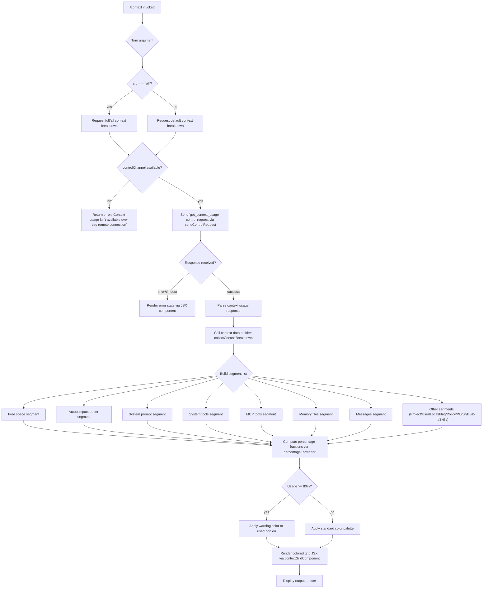

# `/context`

> Analysis basis: CC v2.1.195 bundle.js (AST extraction + Claude interpretation)
> Minimum version: v2.1.195

---

## Overview

`/context` visualizes the current conversation's context window usage as a colored grid displayed in the terminal. It dispatches a `get_context_usage` control request through the thin-client channel to retrieve token-usage data, then renders a structured breakdown of each context segment (system prompt, tools, messages, free space, etc.) with percentage labels and color-coded cells.

---

## Registration

| Field | Value |
|---|---|
| type | `local-jsx` |
| name | `context` |
| description | `Visualize current context usage as a colored grid` |
| argumentHint | `[all]` |
| thinClientDispatch | `control-request` |
| module_id | `kNl` |
| load_inline | `true` |
| loc_byte | `11747641` |
| loc_byte_end | `11747867` |
| loc_line | `7474` |
| arbor_handler.name | `CPf` |
| arbor_handler.fqn | `claude-2.1.195::CPf` |
| arbor_handler.kind | `AsyncFunction` |
| arbor_handler.resolution_path | `module_id` |
| arbor_handler.n_hits | `0` |

Analysis basis: CC v2.1.195 bundle.js:+11747641

---

## Input Branching

The command has 3+ distinct branches based on the argument value, connection type, and context data availability.



Analysis basis: CC v2.1.195 bundle.js:+11746255, +11746339, +11746421, +11746451, +11746787

---

## Behavioral Spec

### 1. Handler Entry — `contextCommandHandler` (bundle ident: `CPf`)

```
async function contextCommandHandler(options, argument):
    trimmedArg = argument.trim()
    isAllMode = (trimmedArg === "all")     // literal "all" at +11746286

    // Check if a control channel is available
    if not options.controlChannel:
        return earlyExit("Context usage isn't available over this remote connection")
        // literal at +11746339

    // Dispatch control request
    response = await options.sendControlRequest({
        type: "get_context_usage"           // literal at +11746451
    })

    // Render loading/result via JSX
    jsx = buildContextDisplayJSX(response, isAllMode)
    return jsx
```

Analysis basis: CC v2.1.195 bundle.js:+11746255, +11746261, +11746294, +11746309, +11746337, +11746421

---

### 2. Context Data Collection — `collectContextBreakdown` (bundle ident: `NYt`)

```
function collectContextBreakdown(contextResponse, isAllMode):
    segments = []

    // Filter and find segments from raw response
    allItems = contextResponse.filter(...)
    primaryItem = contextResponse.find(...)

    // Always-present synthetic segments
    segments.push({ label: "Free space",          ... })  // +11744393
    segments.push({ label: "Autocompact buffer",  ... })  // +11744416

    // Settings-source segments (shown in 'all' mode or when non-zero)
    for source in ["projectSettings", "userSettings", "localSettings", ...]:
        label = {
            "projectSettings" : "Project",    // +11745362
            "userSettings"    : "User",        // +11745399
            "localSettings"   : "Local",       // +11745434
            flagSettings      : "Flag",        // +11745469
            policy            : "Policy",      // +11745505
            plugin            : "Plugin",      // +11745535
            "built-in"        : "Built-in",    // +11745567
        }[source]
        if isAllMode or source.tokenCount > 0:
            segments.push({ label, tokenCount: source.tokenCount })

    // System-level segments
    segments.push({ label: "System prompt",   color: "promptBorder" })  // +11104029
    segments.push({ label: "System tools",    ... })                     // +11104110
    segments.push({ label: "MCP tools",       ... })                     // +11104175
    segments.push({ label: "Memory files",    ... })                     // +11104493
    segments.push({ label: "Skills",          ... })                     // +11104555
    segments.push({ label: "Messages",        ... })                     // +11104973

    return segments
```

Analysis basis: CC v2.1.195 bundle.js:+11744317, +11744358, +11744676, +11745342–11745567

---

### 3. Percentage Formatter — `percentageFormatter` (bundle ident: `lae`)

```
function percentageFormatter(tokenCount, totalTokens):
    fraction = tokenCount / totalTokens
    rounded  = Math.round(fraction * 100)      // +222591

    // Special threshold display
    if rounded < 20:
        label = "< 20"                          // literal "< 20" at +222571
    else:
        label = String(rounded) + ".0"         // literal ".0" at +222532

    // Locale formatting
    formatted = Intl.NumberFormat("en-US", { notation: "compact" })  // +224546, +224564
    return { percentage: rounded, label, formattedCount: formatted(tokenCount) }
```

Analysis basis: CC v2.1.195 bundle.js:+222518, +222532, +222562, +222571, +222588, +222591

---

### 4. Warning Threshold Check — `applyUsageThreshold` (bundle ident: `IPf` → `DH`)

```
function applyUsageThreshold(usedTokens, totalTokens):
    ratio = usedTokens / totalTokens
    WARNING_THRESHOLD = 0.80                   // literal 80 at +11746787

    if ratio >= WARNING_THRESHOLD:
        return { style: "warning", compact_boundary: ... }
        // "compact_boundary" literal at +14009760

    return { style: "normal" }
```

Analysis basis: CC v2.1.195 bundle.js:+11746754, +11746787, +14009760, +14009890, +14009913

---

### 5. Context Grid Renderer — `contextGridComponent` (bundle ident: `_Zn`)

```
function contextGridComponent(segments, totalTokens, isAllMode):
    // Compute slot widths for each segment using Math.round/floor/max/min
    // +11105392, +11105554, +11104784, +11104795

    grid = []
    for segment in segments:
        cells = computeCells(segment.tokenCount, totalTokens)
        colorLabel = mapSegmentToColor(segment.label)
        // Color constants: "cyan_FOR_SUBAGENTS_ONLY", "purple_FOR_SUBAGENTS_ONLY",
        //                  "warning", "claude", "permission"
        // literals at +11104202, +11104999, +11104579, +11104523, +11104457
        grid.push(renderColoredCells(cells, colorLabel))

    // Append summary rows
    grid.push(renderLegend(segments))
    return JSXElement(grid)
```

Analysis basis: CC v2.1.195 bundle.js:+11102880, +11103030, +11104015, +11105311, +11105392, +11105554, +11106647

---

### 6. System Prompt Truncation Helper — `systemPromptSlicer` (bundle ident: `DH` → `Uer`)

```
function systemPromptSlicer(promptText, maxSlice):
    // Reads "compact_boundary" marker to know where compaction occurred
    boundary = findCompactBoundary(promptText)   // "compact_boundary" at +14009760
    sliced   = promptText.slice(0, boundary)     // +14009913
    return sliced
```

Analysis basis: CC v2.1.195 bundle.js:+11746217, +14009843, +14009890, +14009913

---

## State & Side Effects

| Item | Detail |
|---|---|
| Telemetry | No `tengu_*` events found directly on the `CPf` → `NYt` path at depth ≤ 2. Downstream helpers (system-prompt assembly `_Zn`) fire: `tengu_silent_harbor` (+13788536), `tengu_sparrow_ledger` (+13787920), `tengu_heron_brook` (+13768609), `tengu_amber_sextant` (+13768774), `tengu_verified_vs_assumed` (+13776302), `tengu_tool_pear` (+13803490), `tengu_fgts` (+13803834), `tengu_amber_redwood2` (+5242234), `tengu_amber_redwood3` (+5242265). |
| Hook registration | Keyboard hook registered via `krs.register` (ident `vi`, +68053) during terminal control-request setup |
| appState changes | None detected on this command path; read-only display command |
| Network | Sends one `get_context_usage` control-request over the thin-client channel (`thinClientDispatch: "control-request"`) |
| Sound | None |
| Rendering | Outputs JSX (`local-jsx` type); renders directly in the terminal via `dUo.jsx` (+11746485) and `ggt.jsx` (+8353403) |

---

## Version History

| Version | Change |
|---|---|
| v2.1.195 | Initial analysis |

---

## Common Mistakes

1. **Running over a remote/non-control channel**: The command immediately exits with `"Context usage isn't available over this remote connection"` if `options.controlChannel` is falsy. This occurs in SSH or thin-client sessions that do not expose the control channel.
2. **Expecting token counts in `all` mode vs. default mode**: Without the `all` argument, segments with zero tokens (e.g., empty settings layers like `Flag`, `Policy`, `Plugin`) are hidden. Pass `/context all` to see every segment regardless of token count.
3. **Interpreting the `< 20` label**: Segments occupying less than 20% of the context window display `< 20` rather than an exact percentage — this is by design, not a rendering bug.
4. **Warning threshold confusion**: The grid switches to warning styling when used context reaches **80%** of the total window, not at 100%. Users who see warning colors still have 20% remaining.
5. **Mismatch between displayed total and model context window**: The displayed total reflects the active model's context window as reported by the running session, not a hard-coded value. Different models yield different totals.

---

## Appendix — Identifier Mapping

> For bundle debugging only. Identifiers change across versions.

| Identifier | Role |
|---|---|
| `CPf` | Main command handler (`contextCommandHandler`), AsyncFunction |
| `NYt` | Context breakdown data builder (`collectContextBreakdown`) |
| `lae` | Percentage / label formatter (`percentageFormatter`) |
| `gl` | Number formatter helper (wraps `ou` / `GYc`) |
| `IPf` | Warning-threshold wrapper |
| `DH` | System prompt boundary slicer |
| `Uer` | Compact-boundary locator used by `DH` |
| `_Zn` | Context grid JSX renderer (`contextGridComponent`) |
| `Us` | Fullscreen / terminal environment detector |
| `nFd` | iTerm2 / tmux detection helper |
| `tFd` | Terminal type prefix checker |
| `YZe` | tmux client control mode probe |
| `dne` | Dark/light theme resolver |
| `Y7r` | Terminal capability string builder (`ut` wrapper) |
| `ut` | Low-level string converter (wraps `String`) |
| `T` | Environment/argument normalizer |
| `Lc` | Path/token redactor (`[REDACTED]` emitter) |
| `_is` | wYc mapper used by `Lc` |
| `PYc` | Conversation log manager (write/flush) |
| `_Xe` | Batched-write scheduler (setTimeout/setImmediate) |
| `Qge` | Log rotation helper |
| `DYc` | Append-file writer |
| `Mr` | Settings/state reader |
| `d8` | Settings loader entry point |
| `Ikr` | Async settings fetch with telemetry |
| `p3` | Per-source settings parser |
| `at` | Conversation state accessor |
| `Mt` | App-state getter |
| `rFd` | Remote-connection feature gate |
| `bxn` | Feature-flag cache lookup |
| `hgt` | Control-request response streamer |
| `AV` | JSX response wrapper |
| `KXr` | React element factory |
| `xne` | Environment context component |
| `f0e` | Full-environment info sub-component |
| `OXr` | Simplified-environment sub-component |
| `bet` | Context segment token counter |
| `IPf` | Usage threshold applier (80% gate) |
| `zR` | System-prompt assembly orchestrator |
| `q5` | Prompt builder (calls `La`, `$B`, `Go`) |
| `La` | Instruction block assembler |
| `oT` | Model/provider switch router |
| `iF` | Policy / model-enforcement resolver |
| `Yoi` | Available-models enforcer |
| `Ko` | Model alias normalizer |
| `fv` | Auto-compact window calculator |
| `I9` | Context-window budget resolver |
| `Wue` | Env-var integer parser |
| `dre` | Context window min-capper |
| `Wct` | Max output tokens resolver (`CLAUDE_CODE_MAX_OUTPUT_TOKENS`) |
| `XLe` | Per-model window size lookup |
| `Pk` | Full system-prompt assembler |
| `BUt` | Memory directory prompt loader |
| `lu` | Memory file reader |
| `qUi` | Memory index/content formatter |
| `VUi` | Memory team-dir formatter |
| `JUi` | Memory base formatter |
| `ux` | Context message normalizer / compactor |
| `vZn` | System-context block builder |
| `oe` | System-context segment list |
| `X` | Voice/recording + main interaction loop handler |
| `Fe` | Session cache map |
| `nc` | Module exports helper |
| `vi` | Keyboard hook registrar (`krs.register`) |
| `Ec` | Environment capability detector |
| `jI` | Terminal-dimension reader |
| `ro` | Module registry helper |
| `sn` | MCP debug logger |
| `ue` | MCP tool-list change handler |
| `ve` | MCP server connection manager |
| `aka` | MCP SDK connect/reconnect |
| `Pe` | Conversation history manager |
| `zc` | Hook-registration dispatcher |
| `XQt` | Hook lifecycle manager |