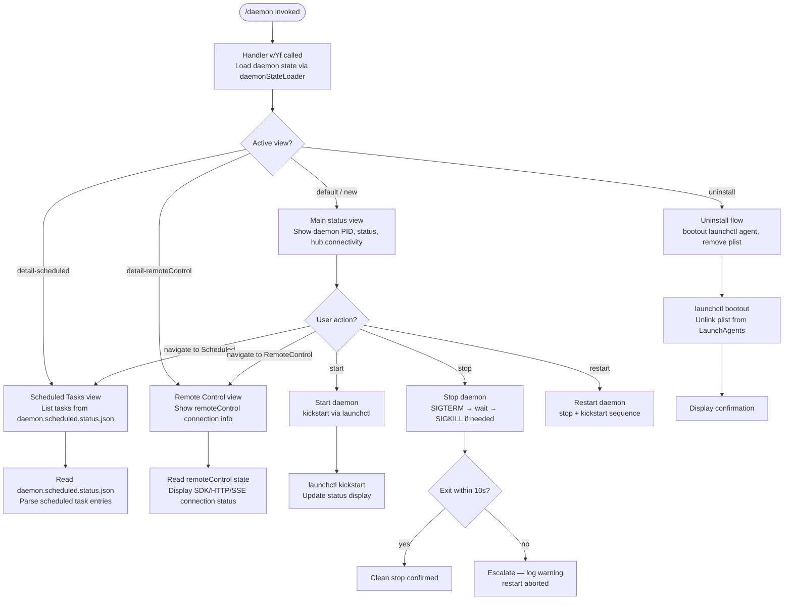

# `/daemon`

> Analysis basis: CC v2.1.195 bundle.js (AST extraction + Claude interpretation)
> Minimum version: v2.1.195

---

## Overview

The `/daemon` command provides an interactive management interface for the Claude Code background daemon and its associated background services. It exposes sub-views and actions covering daemon status inspection, scheduled-task management, remote-control mode, and service lifecycle operations (start, stop, restart, uninstall). The command renders a JSX component directly within the CLI terminal, making it a `local-jsx` type that executes immediately without sending a prompt to the AI agent.

---

## Registration

| Field | Value |
|---|---|
| type | `local-jsx` |
| name | `daemon` |
| description | `Manage background services and routines` |
| loc_byte | `13269321` |
| loc_byte_end | `13269489` |
| loc_line | `9064` |
| immediate | `true` |
| module_id | `T5o` |
| load_inline | `true` |
| arbor_handler.name | `wYf` |
| arbor_handler.fqn | `claude-2.1.195::wYf` |
| arbor_handler.kind | `AsyncFunction` |
| arbor_handler.resolution_path | `module_id` |
| arbor_handler.n_hits | `0` |

Analysis basis: CC v2.1.195 bundle.js:+13269321

---

## Input Branching

The command supports 5+ distinct UI views/sub-states, so a Mermaid flowchart is used.



---

## Behavioral Spec

### Top-level handler — `wYf` (main async entry)

The Arbor-resolved handler `wYf` is an `AsyncFunction` reached via `module_id` resolution path (`T5o`).

```
async function wYf(commandContext):
    stateBundle = await daemonStateLoader(commandContext)   // A5o
    reactNode   = renderJSX(DaemonUI, stateBundle)          // Kc.jsx + snc
    return reactNode
```

Analysis basis: CC v2.1.195 bundle.js:+13259171

---

### Daemon state loader — `daemonStateLoader` (`A5o`)

Collects all daemon-related state in parallel before the UI renders.

```
async function daemonStateLoader(ctx):
    [scheduledStatus, socketStatus] = await Promise.all([
        readScheduledStatusFile(),   // Ztc
        readDaemonStatusFile()       // qtc
    ])

    daemonPidInfo  = await readAndKillStale(ctx)            // dR
    rosterData     = await readRosterFile(ctx)              // RZl
    scheduledPid   = await readScheduledPidFile(ctx)        // itc
    logInfo        = await readLogFile(ctx)                 // y4
    launchctlInfo  = await queryLaunchctl(ctx)              // QQ
    keys           = Object.keys(combinedState)

    return {
        scheduledStatus,
        socketStatus,
        daemonPidInfo,
        rosterData,
        scheduledPid,
        logInfo,
        launchctlInfo,
        keys
    }
```

Analysis basis: CC v2.1.195 bundle.js:+13258730

---

### Scheduled status reader — `readScheduledStatusFile` (`Ztc`)

```
async function readScheduledStatusFile():
    results = await Promise.all([
        readStatusJSON(),    // gbt  — reads daemon.scheduled.status.json
        readSocket(),        // xe   — opens essential-traffic socket
        readPidFile()        // dR   — reads PID and checks liveness
    ])
    return results
```

Status filename literal: `"daemon.scheduled.status.json"` (bundle.js:+13164840)

Analysis basis: CC v2.1.195 bundle.js:+13253557

---

### Scheduled tasks JSON parser — `gbt` / `b4o`

```
async function parseScheduledTasksJSON(filePath):
    stat = await fs.stat(filePath)
    if not stat.isFile():
        throw Error   // file guard
    raw = await fs.readFile(filePath, "utf8")   // encoding: "utf8" (+13072614)
    if raw.trim() is empty:
        return null
    parsed = JSON.parse(raw)
    validateSchema(parsed)                       // v5
    if not Array.isArray(parsed):
        return null
    return parsed
```

Maximum file size guard: 1 048 576 bytes (1 MiB) — bundle.js:+13072495

Task type discriminator string: `"scheduled"` — bundle.js:+13166346

Analysis basis: CC v2.1.195 bundle.js:+13072437

---

### Daemon status file reader — `readDaemonStatusFile` (`qtc` / `C7e`)

```
async function readDaemonStatusFile(ctx):
    try:
        stat = await fs.stat(statusFilePath)
    except ENOENT:
        return Promise.reject(ENOENT_sentinel)
    if not stat.isFile():
        return Promise.reject(...)
    appStore = getAppStore()           // Vs → Nld.getStore
    formatRow = padEnd helper          // y5o / _5o
    content   = parseFileContents()    // ye, wa, _5o
    keys      = Object.keys(content)
    return {keys, content}
```

Status filename literal: `"daemon.status.json"` — bundle.js:+13071674

Status entries include `"same-dir"` disposition — bundle.js:+13247352

Analysis basis: CC v2.1.195 bundle.js:+13245394

---

### PID file reader / stale-process reaper — `dR` / `Hse`

```
async function readAndKillStale(ctx):
    pidFilePath = path.join(daemonDir, "daemon.json")     // literal +11786733
    stat = await fs.lstat(pidFilePath)
    if not stat.isFile():
        await fs.rm(pidFilePath, {force:true, recursive: false,
                                  flag: 65536})           // +11785234
        return null
    raw = await fs.readFile(pidFilePath)
    data = JSON.parse(raw)                                // Cn decode
    pid  = data.pid
    try:
        process.kill(pid, 0)                              // liveness probe
        return {pid, alive: true}
    except:
        return {pid, alive: false}
```

PID file base name: `"daemon.json"` — bundle.js:+11786733

Process command string used for matching: `"claude daemon"` — bundle.js:+11786159

Signal used for liveness probe: `0` (numeric) — bundle.js:+11786870

Analysis basis: CC v2.1.195 bundle.js:+11786240

---

### Roster file reader — `rosterReader` (`RZl` / `y4`)

```
async function rosterReader(ctx):
    rosterPath = path.join(daemonDir, "roster.json")     // literal +11793678

    stat = await fs.lstat(rosterPath)
    if not stat.isFile():
        logWarning("is not a regular file — removing")   // literal +11797989
        await fs.rm(rosterPath)
        return null

    raw  = await fs.readFile(rosterPath)
    text = Cn(raw)                                        // decode helper

    try:
        parsed = JSON.parse(text)                         // Bt
    except E2BIG or EFTYPE:                               // literals +11798115/+11798127
        emitTelemetry("tengu_bg_roster_parse_failed")     // +11798035
        return null

    entries = validateRosterEntries(parsed)               // UUl — Array.isArray + Object.keys
    return entries
```

Error codes guarded: `"E2BIG"` (bundle.js:+11798115), `"EFTYPE"` (bundle.js:+11798127)

Analysis basis: CC v2.1.195 bundle.js:+11797842

---

### Scheduled PID file reader / stale reaper — `itc` / `stc`

```
async function readScheduledPidFile(ctx):
    pidFile = path.join(daemonDir, "daemon.scheduled.status.json")  // stc +13164840
    raw     = await fs.readFile(pidFile)
    pid     = parsePid(raw)                               // wa decode
    try:
        process.kill(pid, 0)                              // liveness probe
        return {pid, alive: true}
    except:
        return {pid, alive: false}
```

Analysis basis: CC v2.1.195 bundle.js:+13165048

---

### launchctl status query — `QQ` / `fnr` / `CUl`

```
async function queryLaunchctl():
    uid = process.getuid()                               // CUl +11787117
    args = ["launchctl", "print",                        // literals +11790321/+11790334
            "gui/" + uid + "/com.anthropic.claudeCode"]
    result = await spawnWithTimeout(args, 5000)          // timeout 5000ms +11790368
    return parseOutput(result)                           // Mn
```

The `fnr` helper also obtains the `uid` for label construction.

Analysis basis: CC v2.1.195 bundle.js:+11790318

---

### Service lifecycle actions (start / stop / restart)

All three actions are coordinated inside the `WYt` / `RUo` flow:

```
async function serviceControl(action, ctx):
    // action ∈ {"start", "stop", "restart", "kickstart"}

    uid = getUID()                         // fnr/CUl
    if action == "stop" or action == "restart":
        sendSIGTERM(daemonPid)             // process.kill(pid, "SIGTERM") via itc/RZl
        waitForExit(50 polls, 200ms each)  // 50 retries literal +11789474
        if not exited after ~10s:
            log("daemon did not exit within 10s of SIGTERM; restart aborted…")
                                           // literal +11789503
            return {aborted: true}

    if action == "start" or action == "restart":
        launchctlArgs = ["launchctl", "kickstart",       // literal +11789181
                         "gui/" + uid + "/com.anthropic.claudeCode"]
        await spawn(launchctlArgs)

    return {ok: true}
```

Stop timeout threshold: approximately 10 s (50 × 200 ms polling) — bundle.js:+11789474, +11789503

Analysis basis: CC v2.1.195 bundle.js:+11789064

---

### Uninstall flow — `SSt`

```
async function uninstallService():
    plistDir  = path.join(homedir(), "Library", "LaunchAgents")  // literals +11787048/+11787058
    plistPath = path.join(plistDir, "com.anthropic.claudeCode.plist")

    uid = getUID()
    try:
        await spawn(["launchctl", "bootout",             // literal +11788819
                     "gui/" + uid + "/com.anthropic.claudeCode"])
    except:
        log("service uninstall not available on darwin") // literal +11788950

    await fs.unlink(plistPath)                           // XQ.unlink
    return {done: true}
```

Note: uninstall is only available on `"darwin"` — bundle.js:+11789829

Analysis basis: CC v2.1.195 bundle.js:+11788791

---

### UI component — `b5o` (DaemonUI React component)

```
function DaemonUI(props):
    [view, setView] = useState("new")         // initial view literal +13260003
    clock = useClock()                        // xs → kGi.useContext
    timestamp = Date.now()                    // b5o +13259352

    // Load daemon state
    stateResult = useAsync(daemonStateLoader) // A5o reference +13259546

    // Shutdown handler
    shutdownRef = useRef(null)                // MK.useRef +13259563
    keyHandler  = useKeyboardInput(Wc)        // Wc: useRef/useContext/useMemo

    // Background worker manager
    workerLoop  = startWorkerLoop(k)          // periodic setInterval
    watcherInst = startFileWatcher(P.watch)   // watches status files

    // Views
    switch view:
        case "new":               return MainStatusView(stateResult)
        case "detail-scheduled":  return ScheduledView(scheduledData)
        case "detail-remoteControl": return RemoteControlView(rcData)
        case "uninstall":         return UninstallView()

    // Footer navigation items
    navItems = [
        {key: "Scheduled", view: "detail-scheduled"},    // literal +13260453
        {key: "Remote Control", view: "detail-remoteControl"}, // literal +13260739
        {key: "Claude daemon", label: …},                 // literal +13261013
        {key: "permission", …}                            // literal +13261101
    ]
```

Analysis basis: CC v2.1.195 bundle.js:+13259303

---

### Background worker loop — `k` (periodic maintenance sweep)

```
function workerLoop():
    clearInterval(existingTimer)

    timer = setInterval(async () => {
        // Process pending task queue
        pending = filterPending(taskQueue)                // k.filter
        for task in pending:
            await runTask(task)                           // $7o

        // Rotate/write status file
        await writeStatusFile()                           // RDc / iie.writeFile
        logStatus("[ScheduledTasks] released scheduler lock")  // literal +16893315

        // Housekeeping: unlink stale pid files
        await fs.unlink(stalePidPath)                     // Wtn
    }, intervalMs)

    // Watch config file for changes
    watcher = P.watch(configFile)
    watcher.on("add",    handleAdd)                       // literal +16897426
    watcher.on("change", handleChange)                    // literal +16897453
    watcher.on("unlink", handleUnlink)                    // literal +16897483
    return timer
```

Analysis basis: CC v2.1.195 bundle.js:+16896876

---

### Daemon yield / supervisor handoff — `d` (transient worker)

When a foreground or service daemon supersedes a background instance, the background worker yields:

```
function yieldToForeground(reason):
    log("yielding to a foreground/service daemon — bg workers will be re-adopted")
                                                         // literal +17906675
    emitTelemetry("tengu_daemon_yield")                  // +17906757
    d.write("transient")                                 // literal +17901535, type literal "transient" +17906622
```

Analysis basis: CC v2.1.195 bundle.js:+17901510

---

### Graceful shutdown handler — `u` / `yj`

```
async function gracefulShutdown():
    emitTelemetry("tengu_daemon_control")               // +17924594

    try:
        shutdownResult = await Promise.race([
            triggerShutdown(),                           // T_e → b_e.shutdown
            timeout(500)                                 // Un: 500ms literal +17919653
        ])
        await Promise.all(cleanupTasks)
        return shutdownResult
    except AbortError("aborted"):                        // literal +2363688
        emitTelemetry("tengu_daemon_control")
    finally:
        clearInterval / clearTimeout                     // k_e
        process.exit(exitCode)                           // +17919692
```

Shutdown timeout: 500 ms — bundle.js:+17919653

"forced shutdown" label used in UI exit path — bundle.js:+17920916

Analysis basis: CC v2.1.195 bundle.js:+17924516

---

### Spare-worker claim flow — `h` / `PZo` / `FZo`

```
async function claimSpareWorker(ctx):
    existing = workerMap.get(ctx.key)
    if existing and existing.status != "closed":         // literal +17884950
        // Escalation path
        if retryCount > 100:                             // literal +17885163
            emitTelemetry("tengu_bg_dispatch_sigkill_escalate")  // +17885088
            existing.kill("SIGKILL")                    // literal +17885136
        else:
            existing.kill("SIGTERM")                    // literal +17887036

    // Try to claim a "spare" slot
    spareSlot = findSpare()                              // "spare" literal +17885873
    if spareSlot:
        emitTelemetry("tengu_bg_spare_claim")            // +17886514
        conn = await connectSocket(PZo)
        conn.on("connect", …)                            // literal +17878417
        conn.on("kill", …)                               // literal +17878446
        workerMap.set(ctx.key, conn)
        return conn
    else:
        emitTelemetry("tengu_bg_spare_claim_fail")       // +17886780
        throw Error("no spare slot")
```

Duplicate-retry exhaustion marker: `"dup_retry_exhausted"` — bundle.js:+17885431

Analysis basis: CC v2.1.195 bundle.js:+17884970

---

### Background session creation telemetry

When a new background session is created:

```
function createBgSession(params):
    emitTelemetry("tengu_daemon_bg_session_create",      // +17885404
                  {outcome: "spawned" | "dup-live" | "dropped"})
    // outcome literals: +17887020, +17885502, +17885454
```

Analysis basis: CC v2.1.195 bundle.js:+17885404

---

### Low-memory handling — `h` / `_Qt` / `Hrc`

```
async function handleLowMemory(ctx):
    freeMem = os.freemem()                               // BZo.freemem +17885519
    emitTelemetry("tengu_bg_low_mem_mb",                 // +13326605
                  {mb: Math.round(freeMem / 1048576)})

    // Shed non-pinned settled workers first
    for worker in workerMap.values():
        await worker.retireIfSettled()                   // Z.retireIfSettled

    // If memory still low, retire pinned workers as last resort
    if freeMem still below threshold:
        log("bg: low memory persists after shedding…")  // literal +17890188
        emitTelemetry("tengu_bg_retire_pinned_low_mem")  // +17890299
        for worker in pinnedWorkers:
            worker.retireIfSettled()

    emitTelemetry("tengu_bg_dispatch_low_mem")           // +17885689
```

Memory polling interval: 60 000 ms; minimum free threshold: 480 MB — bundle.js:+13326764, +13326759

Analysis basis: CC v2.1.195 bundle.js:+17885519

---

## State & Side Effects

| Item | Detail |
|---|---|
| Telemetry: `tengu_bg_roster_parse_failed` | Fired when `roster.json` fails E2BIG/EFTYPE validation (+11798035) |
| Telemetry: `tengu_feature_ok` | Fired on successful feature gate check (+1027363) |
| Telemetry: `tengu_feature_bad` | Fired on failed feature gate check (+1027430) |
| Telemetry: `tengu_daemon_control` | Fired on daemon stop/shutdown actions (+17924594) |
| Telemetry: `tengu_daemon_config_reload` | Fired when daemon config is reloaded (+17902328) |
| Telemetry: `tengu_daemon_yield` | Fired when background daemon yields to foreground (+17906757) |
| Telemetry: `tengu_daemon_idle_exit` | Fired on daemon idle-exit condition (+17907799) |
| Telemetry: `tengu_bg_roster_parse_failed` | See above |
| Telemetry: `tengu_bg_retire_grace_bridged_min` | Fired on grace-clock bridging (+13326723) |
| Telemetry: `tengu_bg_retire_pinned_low_mem` | Fired when pinned workers are forcibly retired under low memory (+17890299) |
| Telemetry: `tengu_bg_attach_upgrade` | Fired on worker attach-upgrade event (+13326795) |
| Telemetry: `tengu_bg_prewarm_per_sweep` | Fired each prewarm sweep (+17890424) |
| Telemetry: `tengu_bg_dispatch_sigkill_escalate` | Fired when SIGTERM escalates to SIGKILL (+17885088) |
| Telemetry: `tengu_bg_low_mem_mb` | Reports free memory in MB (+13326605) |
| Telemetry: `tengu_bg_dispatch_low_mem` | Fired when low-memory dispatch triggers (+17885689) |
| Telemetry: `tengu_bg_spare_enable` | Fired when spare-slot feature enabled (+17886386) |
| Telemetry: `tengu_bg_sendclaim_failed` | Fired when socket claim send fails (+17878219) |
| Telemetry: `tengu_bg_spare_claim` | Fired on successful spare-slot claim (+17886514) |
| Telemetry: `tengu_bg_spare_claim_fail` | Fired when no spare slot is available (+17886780) |
| Telemetry: `tengu_daemon_bg_session_create` | Fired on new background session creation (+17885404) |
| Telemetry: `tengu_voice_*` | Several voice telemetry events reachable via deep call path (not primary daemon path) |
| File reads | `daemon.json`, `daemon.status.json`, `daemon.scheduled.status.json`, `roster.json` |
| File writes | `daemon.status.json`, scheduled status JSON, state.json |
| File watches | Config file and status files via `P.watch` (add/change/unlink events) |
| Process signals | Sends `SIGTERM` (stop/restart), `SIGKILL` (escalation), probes with signal `0` |
| launchctl interactions | `print`, `kickstart`, `bootout` subcommands on macOS (`darwin` only) |
| appState changes | Worker map updates; spare-slot registry; clock store via `Nld.getStore` |
| Timer effects | `setInterval` for worker sweep loop; `setTimeout` for shutdown timeout (500 ms) |
| Sound | None identified |

---

## Version History

| Version | Change |
|---|---|
| v2.1.195 | Initial analysis |

---

## Common Mistakes

1. **Running uninstall on non-macOS**: The `uninstall` sub-action calls `launchctl bootout` and manipulates `~/Library/LaunchAgents/`, which is macOS-specific. On Linux/Windows, the uninstall path is not available and will surface an error.
2. **Stale PID file causing false-positive status**: If `daemon.json` contains a PID that belongs to an unrelated process (PID reuse), the liveness probe (`process.kill(pid, 0)`) will report `alive: true` incorrectly. Manual removal of `daemon.json` resolves this.
3. **Restart timing**: The restart sequence sends SIGTERM and polls for exit across approximately 50 iterations. If the daemon is performing heavy I/O, it may not exit within this window, causing the restart to abort with a warning rather than completing. Allow the daemon to reach an idle state before restarting.
4. **Roster schema violations**: `roster.json` is validated against `E2BIG`/`EFTYPE` type codes. A corrupted or manually edited roster will silently return `null` with a telemetry event rather than surfacing a user-facing error.
5. **Scheduled status file race**: `daemon.scheduled.status.json` is read and written concurrently by the scheduler loop. Reading it immediately after issuing a stop command may return stale data; a brief delay is needed before expecting the status to reflect the stopped state.

---

## Appendix — Identifier Mapping

> For bundle debugging only. Identifiers change across versions.

| Identifier | Role |
|---|---|
| `wYf` | Main async handler for `/daemon` command (Arbor-resolved entry point) |
| `OYf` | Secondary render/dispatch function called within the command flow |
| `A5o` | Daemon state loader — aggregates all status files in parallel |
| `z1e` | Initialization helper called by state loader |
| `Ztc` | Scheduled status file composite reader |
| `gbt` | Scheduled task JSON file parser coordinator |
| `b4o` | Low-level JSON file reader with size guard and schema validation |
| `Q4o` | Array validation helper for task entries |
| `xe` | Socket / essential-traffic communication helper |
| `Zr` | Error-wrapping utility |
| `ut` | String conversion utility |
| `qi` | Queue helper used in socket path |
| `BMu` | Ring-buffer shift/push helper (traffic queue) |
| `dR` | PID file reader and stale-process reaper |
| `Hse` | Inner PID-file lstat/rm/readFile helper |
| `CUo` | Process command-line parser (splits `/proc` or ps output) |
| `EI` | Process info helper delegating to `JR` |
| `qtc` | Daemon status file reader coordinator |
| `C7e` | Daemon status file low-level reader with store access |
| `on` | Text encoding/decoding utility |
| `Vs` | App-store accessor (`Nld.getStore`) |
| `y5o` | Row formatter for status display |
| `ye` | String-to-string conversion helper |
| `OW` | Path joiner for daemon directory |
| `RZl` | Roster file reader — reads `roster.json` and kills stale entries |
| `WXt` | Path joiner for worker directory |
| `itc` | Scheduled PID file reader/reaper |
| `stc` | Path builder for `daemon.scheduled.status.json` |
| `y4` | Roster JSON full parser (lstat, readFile, validate) |
| `_se` | Roster path builder |
| `Gfe` | Inner roster path join helper |
| `W` | Generic async wrapper / promise utility |
| `je` | Internal dispatch helper |
| `OJe` | Core event emitter base |
| `Enr` | Roster file rotation/rename helper |
| `KYt` | Timestamp helper using `Date.now` |
| `Bt` | JSON.parse wrapper |
| `Cn` | Buffer-to-string decoder |
| `Ld` | Text formatter utility |
| `Wz` | Text alignment helper |
| `UUl` | Roster entry structure validator (Array.isArray + Object.keys) |
| `NXe` | Composite text/format helper |
| `xh` | Sub-emitter helper |
| `No` | Another sub-emitter helper |
| `QQ` | launchctl status query coordinator |
| `Mn` | launchctl output parser |
| `Wr` | Spawn-with-output helper |
| `Ot` | Spawn-and-collect helper |
| `fnr` | UID resolver (`process.getuid`) |
| `CUl` | Direct `process.getuid` caller |
| `e` | String replace utility / context variable |
| `snc` | JSX component tree assembler passed to render |
| `ake` | Root UI component factory |
| `zct` | Context/store integration layer for UI |
| `zap` | Model/config resolution dispatcher |
| `T` | Log-level classifier and formatter |
| `Jap` | Model list builder |
| `Kia` | UI routing helper |
| `mo` | Inference-profile type checker |
| `SH` | Shell/environment classifier |
| `Ko` | Model name normalizer (lowercase, alias resolution) |
| `a` | Spend/billing response handler |
| `age` | JSON.stringify wrapper for responses |
| `b5o` | DaemonUI React functional component |
| `xs` | Clock context hook (`useClock`) |
| `s` | Pending-set tracker (add/finally/delete) |
| `Wc` | Keyboard/input hook (useRef, useContext, useMemo) |
| `u` | UI orchestrator combining shutdown and worker sub-hooks |
| `Le` | Feature-ok telemetry wrapper |
| `Oe` | Feature-bad telemetry wrapper |
| `ke` | Alternate feature gate path |
| `SF` | Daemon-control telemetry emitter |
| `p6` | Telemetry batch helper |
| `y4e` | YL-based telemetry scheduler |
| `GKr` | UUID-generating event emitter |
| `yj` | Graceful shutdown orchestrator (Promise.race + process.exit) |
| `T_e` | Shutdown trigger (`b_e.shutdown`) |
| `k_e` | Timeout clearer for shutdown |
| `Un` | Timed-abort helper (setTimeout/clearTimeout/unref) |
| `l` | Log-writer reference used in component |
| `LZl` | Daemon log writer (path builder + Date.now + Vs) |
| `Hte` | Log-entry formatter |
| `THe` | Log-line trimmer and dispatcher |
| `Me` | JSON.stringify log serializer |
| `H` | Worker-map SIGTERM broadcaster |
| `O` | Process handle / worker handle |
| `m` | Task-list filter and array processor |
| `thr` | Path segment normalizer (startsWith/slice/replace) |
| `k` | Background worker loop (setInterval, file watcher, task runner) |
| `$7o` | Task executor with lock, log, and status-write |
| `LDc` | Scheduler lock manager (wDc Set, readFile, appendFile) |
| `rc` | Path utility (`u0`-based) |
| `Rt` | Another path utility (`u0`-based) |
| `RDc` | Status JSON writer (writeFile, mkdir) |
| `U7o` | Status-write helper (vi + Wtn) |
| `kDc` | Status JSON reader (readFile, JSON.parse) |
| `Btn` | Base path builder (`Gtn.join` + `rc`) |
| `YR` | Process-kill wrapper used by scheduled tasks |
| `Wtn` | Scheduler cleanup (unlink pid file, release lock) |
| `D` | Worker output writer |
| `d` | Worker stream handler (write, stop, updateConfig, start) |
| `oEe` | Config file path builder |
| `P` | Main file-watcher / memory-monitor / prewarm sweep loop |
| `U` | Worker-pool values iterator |
| `X` | Individual background worker state machine (voice + bg sessions) |
| `$` | Rate-limit event enqueuer |
| `_Qt` | Memory-free sampler (`hrc.freemem`) |
| `Hrc` | Telemetry helper for memory retire grace |
| `q5e` | Stale socket file cleaner (lstat/rm/readFile) |
| `K` | Worker registry map (allow/deny filter) |
| `Nn` | Utility delegating to `t` |
| `ne` | Settled-worker retire helper |
| `Ear` | Attach-upgrade telemetry helper |
| `at` | Prewarm-per-sweep telemetry helper (lUt/cUt/f6/hxe) |
| `oe` | Worker respawn coordinator (X, ne, A, v) |
| `I` | Input event handler (Math.max/floor, preventDefault) |
| `M` | HTTP gateway/OAuth request handler (large, multi-route) |
| `A` | OAuth userinfo fetch handler |
| `h` | Main background-worker lifecycle manager (claim, kill, spawn) |
| `V` | Worker kill-timer handler (setTimeout/clearTimeout) |
| `yar` | macOS memory-tier classifier |
| `Z` | Worker retire-if-settled helper |
| `PZo` | Socket claim/connect handler |
| `FZo` | Worker session full lifecycle (claim→connect→monitor→retire) |
| `g` | Utility delegating to `f` |
| `SSt` | macOS service uninstall handler (bootout + plist unlink) |
| `xUo` | LaunchAgents plist directory builder |
| `WYt` | Service control action dispatcher (start/stop/restart) |
| `RUo` | Restart sequence (SIGTERM → poll → kickstart) |
| `Hr` | UI component helper (`u0`-based) |
| `u0` | Low-level render primitive |
| `E` | SDK/remote-control connection manager |
| `kIt` | Object.keys-based connection config iterator |
| `O2c` | Connection type resolver (http/sse/dynamic) |
| `_` | Utility delegating to `a` |
| `n` | String toLowerCase normalizer |
| `p` | Process-exit and abort handler |
| `YT` | Forced-shutdown signal emitter |

---

Note: index built via Arbor fallback; some signals (telemetry, literals) may be missing — see arbor-fallback.js.