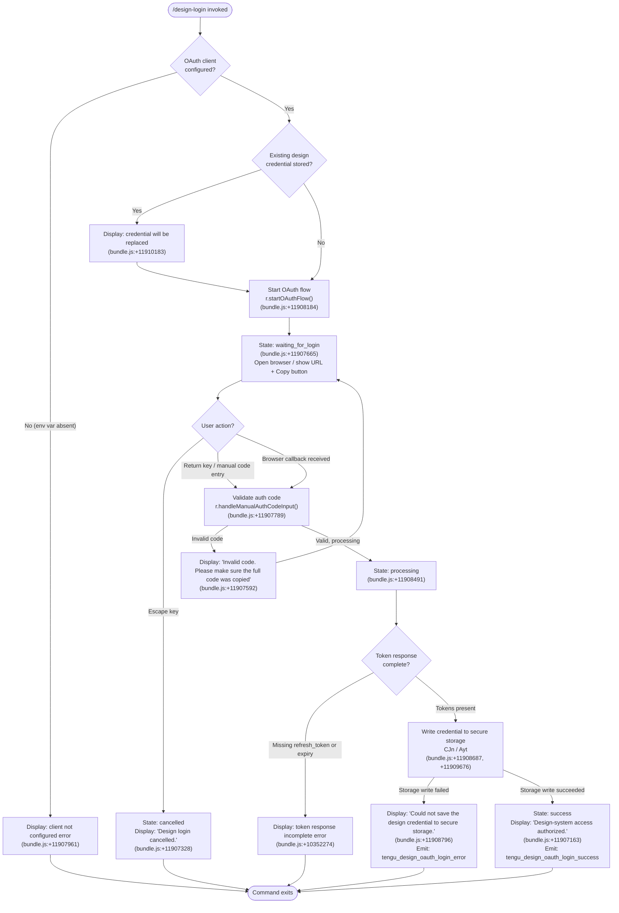

# `/design-login`

> Analysis basis: CC v2.1.195 bundle.js (AST extraction + Claude interpretation)
> Minimum version: v2.1.195

---

## Overview

`/design-login` launches an OAuth authorization flow that grants Claude Code access to the design-system API (read and write access to an organization's `claude.ai/design` projects) using the user's `claude.ai` account. It operates entirely independently of the main API session credential and produces a separate, durably stored design credential. On success the credential is written to secure storage and confirmed in the terminal UI.

---

## Registration

| Field | Value |
|---|---|
| type | `local-jsx` |
| name | `design-login` |
| description | `Authorize design-system access for /design-sync with your claude.ai account` |
| loc_byte | `11913109` |
| loc_byte_end | `11913308` |
| loc_line | `8016` |
| module_id | `xFl` |
| load_inline | `true` |
| arbor_handler.name | `kFl` |
| arbor_handler.fqn | `claude-2.1.195::kFl` |
| arbor_handler.kind | `Function` |
| arbor_handler.resolution_path | `direct` |
| arbor_handler.n_hits | `1` |

Analysis basis: CC v2.1.195 bundle.js:+11913109

---

## Input Branching

The command renders a React/Ink JSX component (`LFl`) that drives the flow through multiple distinct UI states. Six or more named states were identified from literals in the implementation, requiring a Mermaid flowchart.



---

## Behavioral Spec

### Top-level render component (`LFl`)

```
function designLoginComponent(props):
    [flowState, setFlowState] = useState("starting")   // literal "starting" bundle.js:+11906867
    codeInputRef             = useRef(null)
    clockContext             = requireClockContext()    // xs; throws if missing ClockProvider
    terminalSize             = requireTerminalSize()   // yr; throws if missing Ink App
    columnWidth              = Math.max(50, terminalSize.columns * 0.4) // literals 50, 4 → bundle.js:+11907077,+11907101

    // Keyboard handling
    onKeyPress(event):
        if event.key == "escape":
            setFlowState("escape")         // → displays "Design login cancelled."
            props.onDone()
        if event.key == "return":
            validateAndSubmitCode(codeInputRef.current)

    // Manual code submission
    onManualCodeSubmit(code):
        splitCode = code.split(...)        // I.split bundle.js:+11907543
        if !isValidCodeFormat(splitCode):
            showError("Invalid code. Please make sure the full code was copied")
            return
        setFlowState("waiting_for_login")
        props.oauth.handleManualAuthCodeInput(splitCode)

    // OAuth start
    onMount / useEffect:
        clientId = resolveDesignOAuthClientId()        // DKt → wJn → Os; bundle.js:+11907929
        if !clientId or clientId.startsWith("00000000-"):
            // Non-production placeholder — not a real client
            showError("The Claude Design OAuth client is not configured in this build …")
            return
        setFlowState("waiting_for_login")
        props.oauth.startOAuthFlow(clientId)
        scheduleTimeout(3000, handleTimeout)           // literal 3000 bundle.js:+11908286

    // Telemetry on manual entry
    if userTypedManually:
        emit("tengu_design_oauth_manual_entry")       // bundle.js:+11907751

    // Token receipt processing
    onTokensReceived(tokenResponse):
        if !tokenResponse.refreshToken or !tokenResponse.expiry:
            showError("The token response was missing a refresh token …")
            return
        setFlowState("processing")

        // Persist to secure storage
        result = writeDesignCredential(tokenResponse) // CJn bundle.js:+11908687
        if result.failed:
            emit("tengu_design_oauth_login_error")    // bundle.js:+11909045
            showError("Could not save the design credential to secure storage.")
            after(1500ms):                            // literal 1500 bundle.js:+11909021
                props.onDone()
            return

        emit("tengu_design_oauth_login_success")      // bundle.js:+11908892
        setFlowState("success")
        after(1500ms):
            props.onDone()

    // Polling / retry loop (xRo)
    pollForCallback():
        activePollers = filterActivePollers(pollerList)  // Cae.filter bundle.js:+10351891
        for each poller:
            result = pollStep(poller)                    // oN bundle.js:+10351969
        if allDone(pollerList):                          // Cae.some bundle.js:+10352505
            stop()

    // JSX render — two layout regions
    return renderColumn(
        header: "Design login"                          // literal bundle.js:+11909896
        body:   fullDescription                         // literal bundle.js:+11909944
        content: renderStateContent(flowState)
    )
```

Analysis basis: CC v2.1.195 bundle.js:+11906848 – +11909869

---

### OAuth client ID resolution (`DKt` → `wJn` → `Os`)

```
function resolveDesignOAuthClientId():
    envClientId = process.env["CLAUDE_CODE_DESIGN_OAUTH_CLIENT_ID"]
    if envClientId:
        validated = validateOAuthUrl(envClientId)       // Os bundle.js:+11908163
        return validated
    // Fallback: production hard-coded client
    return getBuiltInDesignClientId()                   // wJn bundle.js:+11908170

function validateOAuthUrl(url):
    if url contains approved-endpoint list:             // Hdn.includes bundle.js:+865618
        return url
    throw Error("CLAUDE_CODE_CUSTOM_OAUTH_URL is not an approved endpoint.")
                                                        // literal bundle.js:+865646
```

Analysis basis: CC v2.1.195 bundle.js:+11907929

---

### Secure credential storage (`CJn` / `Ayt`)

```
function writeDesignCredential(tokens):
    // Primary: OS keychain / secure storage (Cl → Gsi)
    try:
        primaryResult = secureStorageWrite(tokens)      // Gsi bundle.js:+10348567
        if primaryResult.ok:
            emit_metric("secure_storage_credentials_write") // literal bundle.js:+2356220
            return { ok: true }
        if primaryResult.isTransientError:
            // "primary_transient_skip_fallback" — do not fall through
            emit_metric("primary_transient_skip_fallback")  // literal bundle.js:+2356318
            return { failed: true }
    except:
        pass

    // Fallback: plaintext credential file
    try:
        plaintextWrite(tokens)                          // Gsi fallback path
        emit_metric("plaintext_fallback_used")          // literal bundle.js:+2356467
        return { ok: true }
    except:
        emit_metric("primary_and_fallback_failed")      // literal bundle.js:+2356570
        logError("Failed to save design OAuth tokens")  // literal bundle.js:+10348796
        return { failed: true }
```

Analysis basis: CC v2.1.195 bundle.js:+11908687, +10348403, +2356220

---

### URL copy-to-clipboard helper (`Tw`)

When the browser does not open automatically, the UI displays the authorization URL along with a **Copy** button. The clipboard write path resolves a platform-appropriate copy tool:

```
function copyToClipboard(text):
    platform = detectPlatform()
    if platform == "macos":
        spawn("pbcopy", stdin=text)                     // literals bundle.js:+3556082,+3556093
    elif platform == "linux":
        if hasWaylandDisplay:
            spawn("wl-copy", text)                      // literal bundle.js:+3554851
        else:
            tryInOrder(["xclip", "xsel"], text)         // literals bundle.js:+3554920,+3554961
    elif platform == "windows" or platform == "wsl":
        spawn("powershell.exe", ["-NoProfile", "-NonInteractive",
              "-Command", clipboardCommand])             // literals bundle.js:+3556495–3556544
    else:
        // tmux buffer or OSC-52 escape fallback
        useOSC52(text)                                  // literals bundle.js:+3554733,+3555340
    displayConfirmation("(Copied!)")                    // literal bundle.js:+11910530
```

Analysis basis: CC v2.1.195 bundle.js:+11909414, +3555688

---

### OAuth server-side flow endpoints (background helper server `M`)

The implementation contains a local HTTP helper process that brokers the OAuth dance. Key endpoints surfaced in the call graph and literals:

| Endpoint path | Purpose |
|---|---|
| `/.well-known/oauth-authorization-server` | Serve OIDC/OAuth metadata (bundle.js:+17731813) |
| `/oauth/device_authorization` | Device authorization initiation (bundle.js:+17732890) |
| `/device` | Display device user-code page, CSRF-checked (bundle.js:+17733596) |
| `/oauth/callback` | Browser redirect callback receiver (bundle.js:+17735298) |
| `/oauth/token` | Token exchange / polling endpoint (bundle.js:+17737133) |
| `/healthz` | Liveness probe (bundle.js:+17730641) |
| `/readyz` | Readiness probe; checks internal store (bundle.js:+17730716) |

Device-flow polling states observed in literals:

| State string | HTTP status hint |
|---|---|
| `authorization_pending` | Continue polling (bundle.js:+17737565) |
| `slow_down` | Back off (bundle.js:+17733143, HTTP 429) |
| `access_denied` | User denied (bundle.js:+17737641) |
| `expired_token` | Code expired (bundle.js:+17737443) |

Analysis basis: CC v2.1.195 bundle.js:+17732890

---

### Token refresh path (`M` → `H.refresh` → `re.claims`)

```
function refreshDesignToken(currentSession):
    refreshed = oauthClient.refresh(currentSession)     // H.refresh bundle.js:+17737938
    if !refreshed.idToken and !refreshed.accessToken:
        throw Error("IdP refresh response had neither id_token nor access_token")
                                                        // literal bundle.js:+17738048
    newClaims = refreshed.claims()                      // re.claims bundle.js:+17737962
    // Persist updated session
    saveSession(newClaims)
    emit_metric("session.refresh")                      // literal bundle.js:+17738207
```

Analysis basis: CC v2.1.195 bundle.js:+17737938

---

## State & Side Effects

| Item | Detail |
|---|---|
| Telemetry: `tengu_design_oauth_manual_entry` | Fired when user manually types or pastes the auth code (bundle.js:+11907751) |
| Telemetry: `tengu_design_oauth_login_success` | Fired after credential successfully written to storage (bundle.js:+11908892) |
| Telemetry: `tengu_design_oauth_login_error` | Fired when credential storage write fails (bundle.js:+11909045) |
| Secure storage write | Writes design OAuth tokens (access token, refresh token, expiry) to OS keychain via `Gsi`; plaintext file fallback used if keychain unavailable (bundle.js:+2356220) |
| Replaces existing credential | If a design credential is already stored, completing the flow silently replaces it; user is warned in UI (bundle.js:+11910183) |
| Local OAuth helper server | Spawns an ephemeral HTTP process on `localhost` to serve OAuth redirect and device-code pages; terminates on flow completion |
| Clipboard side effect | Writing the auth URL to the system clipboard via platform clipboard tool when user clicks **copy** (bundle.js:+11910530) |
| React/Ink UI state | Component manages internal state machine: `starting` → `waiting_for_login` → `processing` → `success` / error (bundle.js:+11906867, +11907665, +11908491) |
| Timeout | A 3 000 ms browser-open timeout is scheduled on flow start (bundle.js:+11908286); a 1 500 ms auto-dismiss on success/fatal error (bundle.js:+11909021) |
| appState changes | Design OAuth credential stored; session state not otherwise modified |
| Sound | None observed |

---

## Version History

| Version | Change |
|---|---|
| v2.1.195 | Initial analysis |

---

## Common Mistakes

1. **Missing OAuth client configuration** — If `CLAUDE_CODE_DESIGN_OAUTH_CLIENT_ID` is unset and the build does not embed the production client ID, the command immediately errors with a descriptive message asking the user to set the environment variable or upgrade their build (bundle.js:+11907961).
2. **Using this as the primary login command** — `/design-login` authorizes access to `claude.ai/design` projects only. It is entirely separate from `/login` and the main Anthropic API credential; running it does not affect normal Claude Code sessions.
3. **Copying a partial code** — The auth code is validated for format after splitting; a partial copy produces "Invalid code. Please make sure the full code was copied" and re-presents the input prompt rather than failing permanently (bundle.js:+11907592).
4. **Browser/device mismatch** — The callback page enforces that the browser completing the flow is on the same device that showed the code; a mismatch produces a `browser_mismatch` error and the flow must be restarted (bundle.js:+17735892).
5. **CSRF on the device page** — The `/device` endpoint checks `sec-fetch-site: same-origin`; opening it from another site or a cross-origin iframe produces a `csrf_rejected` error (bundle.js:+17733906). Always open the URL directly.
6. **Transient keychain failures treated as permanent** — If the OS keychain returns a transient error, the implementation skips the plaintext fallback to avoid storing credentials insecurely (literal `primary_transient_skip_fallback`; bundle.js:+2356318). The user must retry the entire flow once the keychain is available again.

---

## Appendix — Identifier Mapping

> For bundle debugging only. Identifiers change across versions.

| Identifier | Role |
|---|---|
| `kFl` | Arbor-resolved top-level handler function for `/design-login` (registration entry point) |
| `SNf` | Outer render/factory wrapper — calls `EE.jsx` with the login component |
| `LFl` | Main React/Ink login component (state machine, keyboard handler, JSX render) |
| `xs` | `useClock` context hook — asserts ClockProvider presence |
| `yr` | `useTerminalSize` context hook — asserts Ink App presence |
| `DKt` | Design OAuth client-ID resolver — delegates to `wJn` |
| `wJn` | OAuth environment / build config reader |
| `Os` | OAuth URL validator — checks against approved endpoint list |
| `CJn` | Credential persistence orchestrator — calls secure storage writer |
| `Ayt` | Alternative credential persistence path (retry / cleanup) |
| `Cl` | Secure storage facade — delegates to `Gsi` |
| `Gsi` | Low-level keychain read/write/delete operations |
| `oN` | OAuth polling step — HTTP post via `po.post`, error normalisation |
| `xRo` | OAuth poll loop controller — filters active pollers, joins results |
| `Dd` | Theme / display context hook aggregator |
| `Tw` | Clipboard write helper — selects platform tool |
| `WFi` | Platform clipboard dispatcher (macOS/Linux/Windows/WSL) |
| `Mn` | macOS `pbcopy` executor |
| `Wr` | Generic child-process spawn wrapper |
| `j7r` | Linux clipboard tool dispatcher (`wl-copy`, `xclip`, `xsel`) |
| `K$d` | tmux buffer clipboard path |
| `W7r` | OSC-52 escape-sequence clipboard path |
| `ex` | OSC-52 string encoder |
| `QE` | Terminal escape join helper |
| `GFi` | Base64 encoder for OSC-52 payload |
| `M` | Local OAuth helper HTTP server request router |
| `LFl` (inner) | (same as outer — the component is the handler) |
| `I` | Keyboard / input event handler inside `LFl` |
| `xRo` | Poll-loop aggregator (see above) |
| `c` | Short timer scheduler (`yn` delegate) |
| `yn` | Async timeout utility |
| `v` | Cleanup callback reference in `LFl` |
| `Ayt` | Secondary credential-save attempt (see above) |
| `d` | Daemon-process write/control handle |
| `ge` | Session-token store helpers (set / delete / persist) |
| `ye` | String normalisation / coercion utility |
| `re` | OIDC claims extractor for refresh path |
| `a` | Spend-check / pre-check helper |
| `$ms` | OAuth environment constant set |
| `zhu` | OAuth environment label resolver |
| `thr` | Token URL path string manipulator |
| `nZo` / `ZQo` / `eZo` | IP address parsing/validation helpers (local server) |
| `oJe` | HTML response body builder (device page) |
| `rhr` | Random bytes generator (PKCE / nonce) |
| `W6c` / `c1m` | PKCE code-verifier and challenge generators |
| `YQo` | SHA-256 hash helper (PKCE challenge) |
| `Ygr` / `_Om` | HTTP header case-normalisation helpers |
| `KQo` / `FQo` | Encrypted state cookie seal/unseal helpers |
| `sJe` | HTML success/error page renderer (callback) |
| `j5c` / `BQo` | Device-grant token exchange helpers |
| `zQo` | Token-exchange retry dispatcher |
| `ie` | OIDC claims batch resolver (`Promise.all`) |
| `Kjt` | Organisation/team look-up helper (`z_`) |
| `Yum` | Session token list deduplicator and appender |
| `tGc` | Rate-limit / quota enforcement helper |
| `oGc` | Upstream API request dispatcher with circuit-breaker |
| `iCt` | Individual upstream HTTP fetch with TLS identity check |
| `M6c` / `lZo` | Model-list endpoint handler / upstream model cache |
| `x6c` | `/v1/messages` proxy request handler |
| `C6c` | Auth application helper for proxied requests |
| `v6c` | Auth-applied upstream fetch helper |
| `xg` | Proxy-Authorization header builder |
| `He` | Audio chunk ring-buffer (voice; depth-2 callgraph only) |
| `car` | Voice WebSocket stream manager (depth-2 callgraph only) |
| `X` | Voice recording session controller (depth-2 callgraph only) |