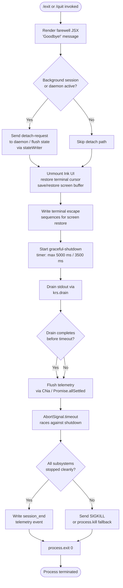

# `/exit`

> Analysis basis: CC v2.1.195 bundle.js (AST extraction + Claude interpretation)
> Minimum version: v2.1.195

---

## Overview

`/exit` (aliased as `/quit`) terminates the Claude Code CLI session immediately. When invoked, it displays a farewell message, performs an orderly shutdown of all active subsystems (background tasks, daemon connections, MCP transports, telemetry buffers), and finally calls `process.exit`. It is classified as a `local-jsx` command with `immediate: true`, meaning no additional user confirmation is required before the shutdown sequence begins.

---

## Registration

| Field | Value |
|---|---|
| type | `local-jsx` |
| name | `exit` |
| description | `null` |
| aliases | `["quit"]` |
| immediate | `true` |
| module_id | `_Xl` |
| load_inline | `true` |
| loc_byte | `12966456` |
| loc_byte_end | `12966652` |
| loc_line | `8924` |
| arbor_handler.name | `uqf` |
| arbor_handler.fqn | `claude-2.1.195::uqf` |
| arbor_handler.kind | `AsyncFunction` |
| arbor_handler.resolution_path | `module_id` |
| arbor_handler.n_hits | `1` |

Analysis basis: CC v2.1.195 bundle.js:+12966456

---

## Input Branching

The shutdown flow has more than three distinct branches (active-task check, detach-request path, UI teardown, drain/timeout race, forced-kill fallback), so a Mermaid flowchart is used.



Analysis basis: CC v2.1.195 bundle.js:+12965715 – +12965888

---

## Behavioral Spec

### 1. Entry Point — `exitCommandHandler` (`uqf`)

The Arbor-resolved handler is `uqf` (AsyncFunction, resolved via `module_id → _Xl`).

```
async function exitCommandHandler(context):
    // 1. Render farewell UI
    render JSX component with text "Goodbye!"         // loc +12965792

    // 2. Check whether a background / daemon session is running
    sessionType = getSessionType(context)             // calls Xs → tLe
    if sessionType in ["bg", "daemon", "daemon-worker"]:
        sendDetachRequest(context)                    // calls Tbe

    // 3. Schedule and run UI teardown
    teardownUI(context)                               // calls cqf → Ik

    // 4. Begin graceful exit sequence
    gracefulExit(context)                             // calls xi
```

Analysis basis: CC v2.1.195 bundle.js:+12965715

---

### 2. Session-Type Resolver (`Xs` → `tLe`)

```
function resolveSessionType(context):
    // Reads process environment / app-state to determine one of:
    //   "bg", "daemon", "daemon-worker", or foreground
    return sessionTypeString
```

Constants observed: `"bg"`, `"daemon"`, `"daemon-worker"` (bundle.js:+2328115, +2328125, +2328139).

---

### 3. Detach-Request Sender (`Tbe`)

```
function sendDetachRequest(context):
    // 3a. Retrieve pending task info
    taskInfo = getActiveTasks()                       // calls UAn
    // 3b. Tear down daemon link
    closeDaemonLink(context)                          // calls UDl → VQn, yn
    // 3c. Write detach-request record to state store
    writeToStateChannel(                              // calls CW → $Q.write, Me → JSON.stringify
        type: "detach-request"                        // literal +11475123
    )
    // 3d. Notify any registered detach listeners
    notifyDetachListeners()                           // calls Mfe
```

Analysis basis: CC v2.1.195 bundle.js:+12965731

---

### 4. Scheduled-Task Formatter (`Zer` / `N0f`)

```
function formatScheduledTasks(taskList):
    // Prefixes each item with "scheduled task" label  // literal +11467846
    result = []
    for each task in taskList:
        formatted = formatSingleTask(task)            // calls iO
        padded    = padEnd(formatted)                 // calls VN
        result.push(padded)
    // Compute next-run time relative to now
    delta = max(0, nextRun.getTime() - Date.now())    // calls N0f, Yi
    return result
```

Time-formatting helpers observed (via `Yi`): `Math.floor`, `Math.round`; duration units include `60000` ms, `3600000` ms, `86400000` ms (bundle.js:+221461, +221622, +221588).

Analysis basis: CC v2.1.195 bundle.js:+12965762

---

### 5. UI Teardown Component (`cqf` → `Ik`)

```
function teardownUIComponent():
    // Unmounts the Ink React tree cleanly
    inkComponent = getInkInstance()                   // calls Ik
    inkComponent.unmount()
```

Analysis basis: CC v2.1.195 bundle.js:+12965875

---

### 6. Graceful Exit Orchestrator (`xi`)

This is the core shutdown sequencer reached from `exitCommandHandler`.

```
async function gracefulExit(context):
    // Phase 1: resolve, then immediately begin teardown
    await Promise.resolve()

    // Phase 2: clean terminal state
    writeScreenRestoreEscapes()                       // calls cje → bSe.writeSync
    restoreCursorPosition()                           // calls Hho → bSe.writeSync, Ct.dim

    // Phase 3: start a forced-kill timer (max of 5000 ms, 3500 ms)
    killTimer = setTimeout(forceKill, max(5000, 3500)) // literals +7399470, +7399477
    killTimer.unref()                                 // calls JMe.unref — does not block event loop

    // Phase 4: drain stdout
    await drainStdout()                               // calls yXe → krs.drain

    // Phase 5: race drain completion against a 2000 ms abort timeout
    await Promise.race([
        drainComplete,
        AbortSignal.timeout(2000)                     // literal +7399655
    ])

    // Phase 6: flush telemetry & MCP connections
    await flushAllSettled()                           // calls CNa → Promise.allSettled, Array.from

    // Phase 7: write session_end telemetry
    recordSessionEnd()                                // literal "session_end" +7399867

    // Phase 8: emit prompt_input_exit event
    emitPromptInputExit()                             // literal "prompt_input_exit" +12965893

    // Phase 9: clear forced-kill timer and exit cleanly
    clearTimeout(killTimer)
    writeSync(stdout, "")                             // calls bSe.writeSync +7399941
    process.exit(0)
```

Analysis basis: CC v2.1.195 bundle.js:+12965888

---

### 7. Terminal Screen-Restore Writer (`Hho`)

```
function restoreTerminalScreen(context):
    // Determine working directory info
    cwdInfo  = getCwdInfo()                           // calls x6t → r.statSync
    pathInfo = getPathInfo()                          // calls Wg → zc → vi

    // Escape-encode special characters for terminal output
    escaped  = text.replaceAll("\\", "\\\\")          // literals +7396749, +7396772

    // Write to stdout using terminal control sequences
    bSe.writeSync(stdout, formattedText)              // +7396830
    bSe.writeSync(stdout, Ct.dim(dimText))            // +7396846

    // Emit scroll-summary telemetry
    emit("tengu_scroll_summary")                      // +7398886
```

Terminal detection constants: `"ghostty"` v`"1.2.0"`, `"iTerm.app"` v`"3.6.6"`, `"tmux"`, `"screen"` (bundle.js:+3631192, +3631261, +3554395, +3554468). Screen-save/restore ANSI escapes `\x1b7` / `\x1b8` (bundle.js:+3909525, +3909536).

Analysis basis: CC v2.1.195 bundle.js:+7396661

---

### 8. Forced-Kill Fallback (`_ho`)

```
function forceKill(context):
    clearTimeout(pendingTimer)
    instance = vu.get(context)
    if instance exists:
        process.exit(1)                               // +7397038
    else:
        process.kill(process.pid, "SIGKILL")          // literal +7397088, +7397063
    // If neither branch applies, throw unreachable error  // literal +7397111
    throw new Error("unreachable")
```

Analysis basis: CC v2.1.195 bundle.js:+7396957

---

### 9. Telemetry Flush (`eLt` / `Nis` / `Gis`)

```
async function flushTelemetry():
    // Resolve telemetry file path and write pending events
    profileDir = path.dirname(telemetryPath)          // calls Nis → Xwt.dirname
    ensureDir(profileDir)                             // calls qt
    writeAtomically(events)                           // calls mCe → Kge.openSync / writeFileSync / fsyncSync / closeSync
    // Post-flush: record startup-perf mark
    performanceMark("main_after_run")                 // literal +226770
    emit("tengu_startup_perf")                        // +227721
```

Analysis basis: CC v2.1.195 bundle.js:+7399791

---

## State & Side Effects

| Item | Detail |
|---|---|
| Telemetry — `tengu_scroll_summary` | Emitted during terminal screen restore (bundle.js:+7398886) |
| Telemetry — `tengu_startup_perf` | Emitted after telemetry flush on clean exit (bundle.js:+227721) |
| Telemetry — `tengu_daemon_config_reload` | Emitted if daemon config is reloaded mid-shutdown (bundle.js:+17902328) |
| Telemetry — `tengu_amber_creek` | Emitted from UI/fullscreen subsystem during teardown (bundle.js:+3564041) |
| Telemetry — `tengu_pewter_brook` | Emitted from fullscreen-detection path (bundle.js:+3563948) |
| Telemetry — `tengu_cache_eviction_hint` | Emitted from cache-management path reached on shutdown (bundle.js:+7399829) |
| Literal event — `session_end` | Written as a structured event to session log (bundle.js:+7399867) |
| Literal event — `prompt_input_exit` | Emitted to signal prompt input subsystem (bundle.js:+12965893) |
| Terminal state | ANSI screen-save (`\x1b7`) / screen-restore (`\x1b8`) sequences written; cursor position restored |
| Ink UI | React/Ink component tree unmounted via `e.unmount()` |
| Detach-request | Written to state channel as `"detach-request"` record when daemon/bg session is active |
| stdout drain | `krs.drain` called; raced against `AbortSignal.timeout(2000 ms)` |
| Forced-kill timer | `setTimeout` at `max(5000, 3500)` ms, unref'd; sends `SIGKILL` if clean path stalls |
| process.exit | Called with code `0` on clean path; code `1` on forced-kill path |

---

## Version History

| Version | Change |
|---|---|
| v2.1.195 | Initial analysis |

---

## Common Mistakes

1. **Typing `/exit` with trailing arguments** — The command takes no arguments; any text after `/exit` is ignored. Use plain `/exit` or `/quit`.
2. **Expecting instant termination in daemon/bg mode** — When a background or daemon session is active, the handler must send a detach-request and flush state before exiting. There may be a short but visible delay (up to ~5 s before the forced-kill timer fires).
3. **Relying on `/quit` as a separate command** — `/quit` is merely an alias registered in the same entry. Both names share identical behavior; neither has priority.
4. **Killing the process externally while drain is pending** — Sending `SIGTERM` externally before `krs.drain` completes may interrupt telemetry flush. Always prefer `/exit` for a clean shutdown so all telemetry buffers are written.
5. **Confusing `immediate: true` with "no shutdown sequence"** — `immediate` means the command executes without an extra confirmation prompt, not that process termination is instantaneous. The full drain-and-flush sequence still runs.

---

## Appendix — Identifier Mapping

> For bundle debugging only. Identifiers change across versions.

| Identifier | Role |
|---|---|
| `uqf` | Main exit command handler (`exitCommandHandler`), AsyncFunction, Arbor-resolved entry point |
| `Xs` | Session-type resolver — reads process/app-state to return session category string |
| `tLe` | Inner session-type helper called by `Xs` |
| `Tbe` | Detach-request sender — coordinates daemon/bg detach before exit |
| `UAn` | Active-task retrieval helper called by `Tbe` |
| `UDl` | Daemon-link teardown function |
| `VQn` | Sub-helper of `UDl` |
| `yn` | Generic async utility called by `UDl` and elsewhere |
| `CW` | State-channel writer — calls `$Q.write` to persist detach-request record |
| `Me` | JSON serialization wrapper (`JSON.stringify`) |
| `Mfe` | Detach-listener notifier |
| `Gm` | Auxiliary context helper referenced from `uqf` |
| `Zer` | Scheduled-task list formatter |
| `TC` | Helper called by `Zer` for task enumeration |
| `u0` | Low-level utility (called by `TC`, `Rt`, `UB`, `Hr`) |
| `N0f` | Next-run-time calculator for scheduled tasks |
| `iO` | Single-task formatter (trim, regex match, parseInt) |
| `VN` | Task label padder/trimmer |
| `hop` | Cron-expression parser (split, match, parseInt) |
| `Ect` | Date/time resolution helper (setSeconds, setMinutes, setHours, etc.) |
| `Yi` | Duration formatter (Math.floor / Math.round) |
| `Oa` | String-truncation / display-width helper |
| `rn` | String-width measurer (`Bun.stringWidth`) |
| `Rs` | Display-width wrapper calling `rn` and `$E` |
| `$E` | Inner display helper used by `Rs` |
| `cqf` | UI-teardown component wrapper — retrieves Ink instance via `Ik` |
| `Ik` | Ink component instance accessor |
| `xi` | Graceful-exit orchestrator — phases drain, telemetry flush, `process.exit` |
| `cje` | First-phase terminal cleanup (unmount Ink, write sync, call `vN`, `wkn`) |
| `vN` | Cursor/state restore helper called by `cje` |
| `wkn` | Terminal-state writer (writes ANSI escapes, calls `s5e`, `Z4e`, `ex`, `gd`, `T`) |
| `s5e` | Terminal-emulator detection (ghostty, iTerm, etc.) |
| `Z4e` | Post-detection terminal setup helper |
| `ex` | tmux/screen escape-sequence adjuster (replaceAll) |
| `gd` | Additional terminal-state helper |
| `T` | Log/output formatting utility (includes debug, trim, toUpperCase) |
| `Hho` | Terminal screen-restore writer — formats and writes final output lines |
| `TL` | Shared terminal-line helper called by `Hho` and `H9n` |
| `n5` | Helper accessed during screen restore |
| `Rt` | Path/file utility calling `u0` |
| `x6t` | CWD info resolver (`r.statSync`, `Ih.join`) |
| `UB` | Sub-helper of `x6t` |
| `Hr` | Sub-helper of `x6t` |
| `qt` | Directory-ensure utility |
| `Wg` | Path-info resolver calling `Rt` and `zc` |
| `zc` | Inner path-resolution helper → `vi` |
| `mNa` | Scroll/display metric helper used by `Hho` |
| `_ho` | Forced-kill fallback — clears timer, calls `process.exit(1)` or `process.kill(SIGKILL)` |
| `yXe` | stdout drain wrapper (`krs.drain`) |
| `d` | Supervisor / daemon-manager stop-and-restart helper |
| `C7e` | File-existence checker (`jtc.stat`, `i.isFile`, `Promise.reject`) |
| `on` | Callback used within `C7e` |
| `Vs` | Async-local-storage store getter (`Nld.getStore`) |
| `y5o` | Sub-helper of `C7e` |
| `ye` | String-coercion utility (`String(...)`) |
| `Vtc` | Config-key formatter (`Object.keys`, `Math.max`, `k_`) |
| `E` | MCP/SDK transport stop orchestrator (`Promise.all`, `yX`, `w9`, `xe`, `Zr`) |
| `kIt` | Inner transport-stop helper → `O2c` |
| `xe` | Transport cleanup helper (`Zr`, `ut`, `qi`, `BMu`) |
| `Zr` | Error-normalization utility (`Error`, `String`) |
| `A` | Agent/process manager (stop/start/updateConfig/userinfo) |
| `nhr` | Array-check helper for agent manager |
| `thr` | String-prefix/slice/replace utility |
| `H` | OAuth/identity provider client |
| `EWc` | Daemon-config-reload helper → `dce` |
| `dce` | Inner config-reload implementation |
| `I` | Request-handler / server loop (Math.max, Math.floor, M.preventDefault) |
| `M` | Main HTTP request router (large; handles OAuth, device auth, managed settings, inference) |
| `W` | Shared state/config object referenced throughout shutdown |
| `CNa` | Telemetry-flush coordinator (`Promise.allSettled`, `Array.from`) |
| `eLt` | Telemetry writer — entry point calling `yAr` and `Nis` |
| `yAr` | Telemetry record serializer → `Gis` |
| `Gis` | Telemetry stats aggregator (Object.entries, Math.round, Number.parseInt, etc.) |
| `Nis` | Telemetry file writer (dirname, qt, mCe, Mis, Gis, JSON.stringify) |
| `Fis` | File-path resolver for telemetry output (`Xwt.join`, `tr`, `Rt`) |
| `mCe` | Atomic file writer (`Kge.openSync/writeFileSync/fsyncSync/closeSync`) |
| `Mis` | Telemetry record formatter (entries, push, join) |
| `a5` | Module `require` wrapper for `perf_hooks` |
| `Bis` | Alternate file-path resolver for telemetry |
| `H9n` | Post-exit summary renderer (scroll summary, calls `pNa`, `Us`) |
| `fNa` | Formatting helper called by `H9n` |
| `pNa` | Timing calculator (Date.now, Math.max, Math.round, Object.assign) |
| `uNa` | Sub-helper of `pNa` |
| `Us` | Full-screen / UI-mode controller |
| `t3` | Session-store lookup helper |
| `GM` | Feature-flag checker (`ACi.isEnabled`) |
| `Y7r` | Utility calling `ut` |
| `dne` | Sub-helper → `nFd` |
| `z7r` | Fullscreen-detection helper (`Vt`, `Boolean`) |
| `Mr` | Metrics helper → `d8` |
| `rFd` | Rendering fallback helper → `at` |
| `at` | UI-render dispatcher (`lUt`, `cUt`, `f6`, `bxn`, `iUt.add`, `rV`, `Mt`) |
| `svt` | Cache-eviction-hint emitter (related to `tengu_cache_eviction_hint`) |
| `je` | OJe-based helper (called during session-end path) |
| `OJe` | Low-level primitive referenced by `je` and `xh` |
| `br` | Session-conformance helper (`xh`, `je`, "nonconforming") |
| `xh` | Conformance-check helper → `OJe` |
| `dje` | Deferred-resolution wrapper (`Promise.resolve`, `f9n`) |
| `f9n` | Inner deferred helper |

---

*Note: index built via Arbor fallback; some signals (telemetry, literals) may be missing — see arbor-fallback.js.*