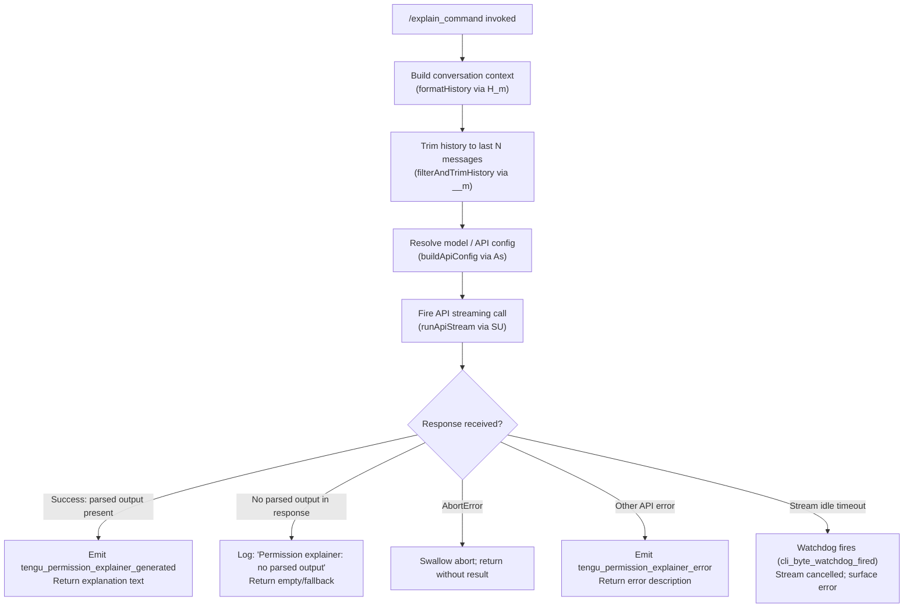

# `/explain_command`

> Analysis basis: CC v2.1.195 bundle.js (AST extraction + Claude interpretation)
> Minimum version: v2.1.195

---

## Overview

`/explain_command` is an internal tool-type slash command that generates a human-readable explanation for why a particular tool or command requires the permissions it does. It invokes a dedicated "permission explainer" sub-flow against the Claude API, formats the conversation context, and returns the explanation string (or an error description) to the caller. It is distinct from user-facing help commands: its primary consumer is the permission-prompt UI that surfaces justification text before a sensitive tool is allowed to run.

---

## Registration

| Field | Value |
|---|---|
| type | `tool` |
| name | `explain_command` |
| description | `null` (no description field set) |
| loc_byte | `14928440` |
| loc_byte_end | `14928476` |
| loc_line | `11434` |
| arbor_handler.name | `lbc` |
| arbor_handler.fqn | `claude-2.1.195::lbc` |
| arbor_handler.kind | `AsyncFunction` |
| arbor_handler.resolution_path | `direct` |
| arbor_handler.n_hits | `1` |

Analysis basis: CC v2.1.195 bundle.js:+14928440

---

## Input Branching

The handler (`lbc`) has five or more distinct execution paths based on API response shape and error conditions, so a Mermaid flowchart is used.



Analysis basis: CC v2.1.195 bundle.js:+14928923, +14929025, +14929270, +14929593, +14929664

---

## Behavioral Spec

### 1. Entry Point — `permissionExplainerHandler` (bundle: `lbc`)

```
async function permissionExplainerHandler(toolName, toolInput, appState):
    startTime = Date.now()

    # Build the assistant-role conversation slice
    history = buildHistoryForExplainer(appState, toolName, toolInput)  # H_m
    trimmedHistory = filterAndTrimHistory(history, limit=1000, role="assistant", maxEntries=3)  # __m

    # Resolve API parameters
    apiConfig = buildApiConfig(appState, profileName="permission_explainer")  # As

    # Run the API call
    result = await runApiStream(apiConfig, trimmedHistory, ...)  # SU

    if result has parsed output:
        emit("tengu_permission_explainer_generated")
        return result.explanation
    else if result is AbortError:
        return null
    else if result has api_error:
        emit("tengu_permission_explainer_error")
        return errorDescription
    else:
        log("Permission explainer: no parsed output in response")
        return fallbackText
```

Analysis basis: CC v2.1.195 bundle.js:+14928135, +14928159, +14928180, +14928198, +14928345, +14928358, +14928921, +14928923, +14929135, +14929474, +14929629

---

### 2. History Formatting — `buildHistoryForExplainer` (bundle: `H_m`)

```
function buildHistoryForExplainer(appState, toolName, toolInput):
    # Serialize tool input to a stable string representation
    inputString = jsonStringify(toolInput, indent=2)   # Me → JSON.stringify
    labelString = String(toolName)                     # H_m → String()
    return [{ role: "assistant", content: inputString + labelString }]
```

- Uses `JSON.stringify` (via `Me`) with an indent of `2` spaces (literal `2` at bundle.js:+14927660).
- Truncates or stringifies content exceeding `1000` characters (literal at bundle.js:+14927704).

Analysis basis: CC v2.1.195 bundle.js:+14927650, +14927676, +14927660, +14927704

---

### 3. History Trimming — `filterAndTrimHistory` (bundle: `__m`)

```
function filterAndTrimHistory(messages, limit, role, maxEntries):
    # Keep only "assistant" role messages
    filtered = messages.filter(m => m.role == role)     # e.filter

    # Take the most-recent N entries (reversed then unshifted)
    recent = filtered.reverse().slice(0, maxEntries)    # n.reverse, xL
    recent.unshift(sentinel)                            # r.unshift
    return recent.join(separator)                       # r.join
```

- Filters to `"assistant"` role messages (literal at bundle.js:+14927739).
- Keeps at most `3` entries (literal at bundle.js:+14927759).
- Ellipsis sentinel `"..."` used when content is clipped (literal at bundle.js:+14927935).
- `"text"` content type expected (literal at bundle.js:+14927842).

Analysis basis: CC v2.1.195 bundle.js:+14927716, +14927784, +14927927, +14927943, +14927976

---

### 4. API Config Resolution — `buildApiConfig` (bundle: `As`)

```
function buildApiConfig(appState, profileName):
    # Resolve the model tier / alias
    model = resolveModel(appState.config)      # q5 → La → Ko

    # Build request headers including provider info
    headers = buildHeaders(appState)           # q5 → SH → BC

    # Attach the "permission_explainer" profile label
    config = { ...baseConfig, profile: profileName }
    return config
```

- The profile name `"permission_explainer"` is hard-coded (literal at bundle.js:+14928498).
- Model resolution handles aliases: `"sonnet"`, `"haiku"`, `"opus"`, `"best"`, `"fable"`, `"opusplan"` (literals at bundle.js:+2316956, +2316999, +2317041, +2317079, +2316844, +2316911).

Analysis basis: CC v2.1.195 bundle.js:+14928345, +2300526, +2300562, +2300575

---

### 5. Streaming API Call — `runApiStream` (bundle: `SU`)

```
async function runApiStream(config, messages, abortSignal):
    # Attach standard headers (User-Agent, session IDs, etc.)
    headers = buildRequestHeaders(config)   # q8 → XBr

    # OAuth token check (if applicable)
    checkOAuthToken()                       # q8 → ch → Kvn

    # Fire streaming HTTP request
    stream = await fetch(endpoint, { headers, body: messages, signal: abortSignal })

    # Process SSE / event stream with byte-level watchdog
    chunks = []
    for chunk in readStream(stream):        # qxd
        if idleTimeout exceeded:            # 15000 ms default (literal at bundle.js:+3048239)
            emit("cli_byte_watchdog_fired")
            cancel()
        chunks.push(chunk)

    return parseStreamResult(chunks)        # eE → TH → Mt
```

- Byte watchdog idle timeout: `15000` ms (bundle.js:+3048239); hard ceiling: `120000` ms (bundle.js:+3048257).
- `"permission_explainer_generate"` is used as the telemetry sub-label (literal at bundle.js:+14929025).
- Request carries `X-Claude-Code-Session-Id`, `x-app`, `User-Agent`, and related headers (literals at bundle.js:+3041535, +3041489, +3041517).

Analysis basis: CC v2.1.195 bundle.js:+8645510, +8645523, +8645616, +8645648, +8647015, +3048239, +3048257

---

### 6. Result Parsing and Error Dispatch (bundle: `lbc` tail)

```
function dispatchResult(streamResult, startTime):
    if streamResult.parsed != null:
        emit("tengu_permission_explainer_generated", { durationMs: now() - startTime })
        return streamResult.parsed.explanation

    if streamResult.error.name == "AbortError":
        return null   # silent abort

    if streamResult.error.type == "api_error":
        emit("tengu_permission_explainer_error")
        return streamResult.error.message

    # Fallback: no parsed output
    log("Permission explainer: no parsed output in response")
    return ""
```

Analysis basis: CC v2.1.195 bundle.js:+14928921, +14928923, +14929025, +14929135, +14929270, +14929593, +14929664

---

## State & Side Effects

| Item | Detail |
|---|---|
| Telemetry — success | `tengu_permission_explainer_generated` (bundle.js:+14928923) |
| Telemetry — error | `tengu_permission_explainer_error` (bundle.js:+14929135) |
| Telemetry — stream watchdog | `tengu_stream_watchdog_default_on` (bundle.js:+3049998); `tengu_byte_watchdog_fired_late` (bundle.js:+3049290) |
| Telemetry — config | `tengu_config_parse_error` (bundle.js:+14073004) |
| Telemetry — API success | `tengu_api_success` (bundle.js:+8647228) |
| Telemetry — lone surrogate | `tengu_lone_surrogate_sanitized` (bundle.js:+8646924) |
| appState changes | None observed; command is read-only with respect to app state |
| Hook registration | None observed within depth-2 traversal |
| Sound | None observed |
| Config access guard | Throws `"Config accessed before allowed."` if config accessed prematurely (bundle.js:+14071590) |
| Backup files | Config loader may write to `"backups"` subdirectory on migration (bundle.js:+14071158) |

---

## Version History

| Version | Change |
|---|---|
| v2.1.195 | Initial analysis |

---

## Common Mistakes

1. **Treating `/explain_command` as a user-facing help command.** It is a `tool`-type registration consumed programmatically by the permission-prompt UI, not a human chat command.
2. **Expecting output when the request is aborted.** An `AbortError` is silently swallowed; callers must handle a `null` return value.
3. **Assuming any model is used.** The command resolves via the `"permission_explainer"` profile, which may select a different model tier than the active conversation model.
4. **Ignoring the byte-watchdog timeout.** Streams idle for more than `15000` ms are cancelled; integration tests that stub slow responses must account for this limit.
5. **Passing more than 3 recent messages.** The history trimmer caps input at `3` assistant-role messages; excess history is silently dropped.

---

## Appendix — Identifier Mapping

> For bundle debugging only. Identifiers change across versions.

| Identifier | Role |
|---|---|
| `lbc` | Main handler for `/explain_command` (`permissionExplainerHandler`) |
| `YKo` | Config/context loader called at handler entry |
| `Mt` | Config file read/parse orchestrator |
| `qt` | Path resolution utility |
| `Mjo` | Config migration helper |
| `oTt` | Low-level config file loader (reads, parses JSON, handles backups) |
| `Bt` | JSON parse wrapper |
| `v5` | String prefix stripper |
| `Ojo` | Directory scanner for config resolution |
| `Ujo` | Backup path builder |
| `T` | Log-level router / debug formatter |
| `Csm` | Config change watcher / file-watch coordinator |
| `hRt` | File watch registration helper |
| `xme` | Config change event emitter |
| `vi` | Hook/listener registrar |
| `H_m` | History formatter (builds explainer conversation slice) |
| `Me` | JSON stringify wrapper |
| `__m` | History filter and trim function |
| `xL` | Surrogate-aware string slicer |
| `As` | API config builder (resolves model, headers, profile) |
| `q5` | API config assembler (sub-components: model resolve, header build) |
| `La` | Model resolution core |
| `mkt` | Model tier mapper (internal) |
| `gkt` | Model key/alias lookup table builder |
| `fte` | Config feature-flag checker |
| `w8` | Provider type resolver (firstParty / gateway) |
| `Ha` | String normalizer (replace / trim) |
| `sF` | Feature flag inclusion checker |
| `C0` | Capability gate checker |
| `HAn` | Recursive model alias resolver |
| `qoi` | Object-entry permission mapper |
| `Hn` | Policy settings accessor |
| `Ant` | Model entry builder from Object.entries |
| `Voi` | Version/index finder in model list |
| `hpd` | Pinned model descriptor builder |
| `Ko` | Full model name resolver (alias → canonical) |
| `PDt` | Model prefix / claude- normalization |
| `Hpd` | Higher-level pinned model picker |
| `SH` | Request header set builder |
| `BC` | Base API request composer |
| `VBr` | HTTP request object builder |
| `AAn` | Full API message array builder |
| `SAn` | System prompt / header assembler |
| `SU` | Streaming API call orchestrator |
| `of` | Entrypoint resolver |
| `Rt` | Runtime config accessor |
| `q8` | Core HTTP streaming request handler |
| `eY` | Session ID / app header injector |
| `w8r` | Header line parser (split / trim / indexOf) |
| `Xs` | App-type string selector |
| `tLe` | App-type constant table |
| `yY` | Sub-agent context accessor |
| `vAn` | AsyncLocalStorage store getter |
| `XBr` | URL path encoder / replacer |
| `ut` | String conversion utility |
| `ch` | OAuth token check coordinator |
| `Kvn` | JWT refresh handler |
| `eE` | API response dispatcher |
| `md` | Metric / duration recorder |
| `ab` | API auth profile selector |
| `Ql` | Request finalizer |
| `oI` | Response stream reader |
| `TH` | Streaming response processor (main loop) |
| `lNt` | Late-response token handler |
| `jot` | Token accumulator |
| `Bxd` | Retry/backoff dispatcher |
| `Dot` | Retry delay calculator |
| `DHn` | Proxy auth helper checker |
| `CBe` | Auth credential builder |
| `m9s` | Auth mode resolver |
| `Mzu` | Integer parse helper |
| `xM` | Proxy config accessor |
| `Zv` | B2e-based retry signal |
| `zxd` | SSE/event-stream parser and byte watchdog |
| `fr` | Request finalizer / fetch wrapper |
| `EIi` | Event stream internal reader |
| `k8r` | Stream chunk decoder |
| `Yxd` | Response header inspector |
| `SIi` | Stream init helper |
| `yIi` | Streaming output accumulator |
| `x8r` | Numeric bound clamper |
| `qxd` | Byte-level watchdog and chunk router |
| `l_` | Provider endpoint selector |
| `QMt` | Endpoint URL builder |
| `Tld` | Anthropic-prefix endpoint checker |
| `E8` | Provider enum normalizer |
| `s3` | AWS region resolver |
| `xg` | Proxy configuration loader |
| `ml` | String coercion helper |
| `_8` | Proxy URL parser |
| `Ket` | Proxy credential key builder |
| `N1r` | IP / hostname classifier |
| `F1r` | Proxy bypass rule evaluator |
| `Kxd` | Stream-cancel coordinator |
| `hIi` | Stream abort helpers |
| `Gxd` | Provider endpoint factory |
| `Ivn` | Provider instance builder |
| `Qie` | Command-prefix MCP tool finder |
| `Os` | OAuth custom URL validator |
| `sLe` | Gateway JWT refresh scheduler |
| `Tfd` | Gateway token refresh HTTP caller |
| `xyr` | Timestamp utility |
| `K1t` | Response header case-normalizer |
| `YLe` | SDK log error emitter |
| `D` | Terminal output writer (write / W) |
| `d` | Supervisor/daemon process manager |
| `x` | Cookie/path string splitter |
| `k` | File watcher with interval |
| `P` | Worker pool sweep controller |
| `w` | Away-summary gate controller |
| `L` | Away-summary generate orchestrator |
| `v` | State store accessor |
| `mkc` | Most-recent message accessor |
| `gkc` | Conversation transcript builder |
| `uw` | Streaming response unwrapper |
| `iLe` | WIF credential exchange handler |
| `urt` | HTTP fetch with WIF token |
| `Le` | Feature flag resolver (W / Oe) |
| `ke` | Feature flag resolver variant |
| `xfd` | WIF error type classifier |
| `I` | UI input event handler |
| `M` | Gateway HTTP route handler (large) |
| `A` | Gateway userinfo sub-validator |
| `h` | Daemon background-session dispatcher |
| `V` | Process kill timer |
| `O` | Process object accessor |
| `Un` | Abort/timeout promise wrapper |
| `c` | yn-based background session stopper |
| `yar` | macOS memory pressure checker |
| `at` | Telemetry event dispatcher / rV accessor |
| `q5e` | Pinned file pruner |
| `qFt` | Pin file path builder |
| `Cn` | `on`-based event broadcaster |
| `Tzd` | Recursive directory file lister |
| `xe` | Log entry recorder / GZe pusher |
| `Zr` | Error string coercer |
| `qi` | rSs-based log sink |
| `BMu` | Rolling log buffer manager |
| `Z` | Worker retire-if-settled controller |
| `Hse` | Worker state file reader |
| `AUl` | Worker state file unlinker |
| `PZo` | Background session claim sender |
| `e8o` | Session roster file writer |
| `JNm` | Claim send timeout handler |
| `YNm` | Claim frame builder |
| `Ld` | `on`-based event emitter wrapper |
| `ye` | String(…) error serializer |
| `Gk` | Binary frame encoder (Buffer) |
| `FZo` | Background session lifecycle manager |
| `_c` | oE.join path helper |
| `Ki` | Worker state file reader/writer with cache |
| `qh` | F0 state helper |
| `G0e` | Glob-match / path-filter builder |
| `zd` | State-file write helper |
| `CSt` | Deferred promise chain helper |
| `qYt` | Session path builder |
| `Rbe` | Roster entry path builder |
| `Vk` | PUl session list accessor |
| `pR` | Session state path builder |
| `PD` | PUl session state accessor |
| `eZ` | Session split path builder |
| `VYt` | Session working-dir path builder |
| `p` | Process exit controller |
| `g` | f-based background worker starter |
| `f` | o8-based worker factory |
| `Oe` | OJe-based observable emitter |
| `K` | f/Y-based disposable resource |
| `Y` | zZt-based resource wrapper |
| `F9e` | Structured outputs / model-version gate |
| `mo` | Model capability descriptor builder |
| `O_` | Model name normalizer (toLowerCase / replace) |
| `dp` | Model display name replacer |
| `nN` | fr-based provider name resolver |
| `_le` | gvt-based resource URL resolver |
| `gvt` | Resource URL base getter |
| `$3r` | Foundry resource URL builder |
| `_` | Active-tool list (push / includes) |
| `iJp` | Tool-list finder (e.find / n.find) |
| `vbo` | Session hash generator (createHash) |
| `LAn` | SSE cache-control builder |
| `_u` | OEn-based internal state accessor |
| `OEn` | Snt-based state node |
| `eLe` | Extended SSE config helper |
| `e0n` | fr-based endpoint override |
| `$8e` | Prompt cache config builder |
| `yo` | eE/y3/js streaming output combiner |
| `y3` | Array-type message validator |
| `uEr` | Extended cache entry builder |
| `dEr` | Cache duration calculator |
| `LP` | G8r/$9e provider config loader |
| `G8r` | fr-based config fetch |
| `$9e` | HIPAA-flag config accessor |
| `v8` | Vnt inclusion checker |
| `eXa` | Extra param builder |
| `Dvn` | K8/mo model descriptor dispatcher |
| `gw` | e.map content transformer |
| `uke` | Main turn runner (Mt/eE orchestrator) |
| `a6` | Sub-agent turn launcher |
| `gn` | Sub-agent session bootstrapper |
| `kc` | eE/Mt connector |
| `Fin` | Message array pop/push normalizer |
| `Uin` | Message content validator |
| `aP` | structuredClone config copier |
| `qXe` | Message array replace-in-place |
| `$in` | lis/replace content patcher |
| `je` | OJe-based side-effect emitter |
| `B3r` | fr/uii stream builder |
| `uii` | NDJSON / text stream line splitter |
| `F3r` | $3r/gvt foundry resource resolver |
| `JIe` | <!-- TODO: not found in depth-2 traversal; needs --depth 4 --> |
| `br` | xh/je non-conforming response handler |
| `xh` | OJe-based observable helper |
| `No` | OJe-based notification emitter |
| `t2t` | Mzi/flt/e2t agent-tool ID router |
| `Mzi` | Ozd/xe agent-type dispatcher |
| `Ozd` | xzi/VDn builtin agent checker |
| `flt` | xh-based agent frame builder |
| `e2t` | flt/ZFt custom agent frame builder |
| `ZFt` | wzi.createHash agent fingerprinter |
| `YF` | Pzd/RP agent prefix resolver |
| `Pzd` | Agent ID prefix stripper (startsWith / slice) |
| `jDn` | _Kr secondary agent ID parser |
| `_Kr` | e.indexOf / e.slice ID segment extractor |
| `RP` | e.startsWith agent-prefix tester |
| `avt` | <!-- TODO: not found in depth-2 traversal; needs --depth 4 --> |
| `Fi` | Object.hasOwn / mcp__ tool-name checker |
| `wt` | W/Oe observable wrapper |

---

Note: index built via Arbor fallback; some signals (telemetry, literals) may be missing — see arbor-fallback.js.