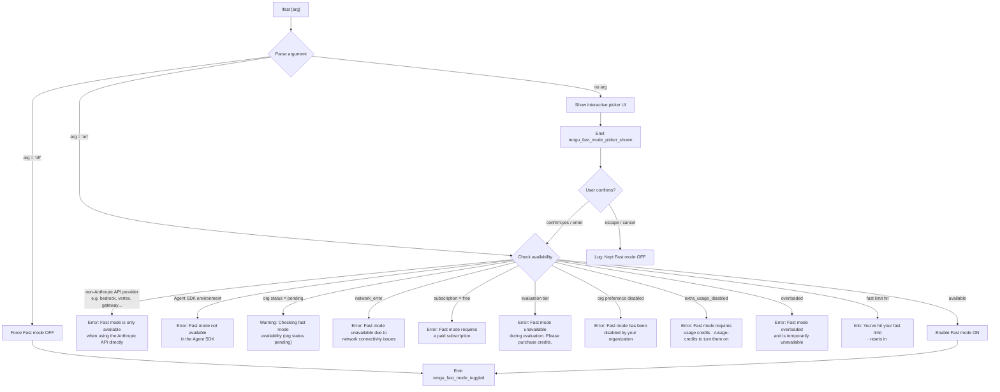

# `/fast`

> Analysis basis: CC v2.1.195 bundle.js (AST extraction + Claude interpretation)
> Minimum version: v2.1.195

---

## Overview

`/fast` toggles Fast mode in Claude Code — a research-preview capability that enables accelerated model responses by switching to an optimized inference path. The command accepts an optional `on` or `off` argument; when omitted it presents an interactive picker UI. Availability is gated by subscription tier, API provider, and organizational policy, producing distinct feedback messages for each blocking condition.

---

## Registration

| Field | Value |
|---|---|
| type | `local-jsx` |
| name | `fast` |
| description | `Toggle fast mode ( ... )` |
| argumentHint | `[on\|off]` |
| immediate | `null` |
| thinClientDispatch | `control-request` |
| isHidden | `null` |
| module_id | `ZKl` |
| load_inline | `true` |
| loc_byte | `12759354` |
| loc_byte_end | `12759626` |
| loc_line | `8699` |
| arbor_handler.name | `sjf` |
| arbor_handler.fqn | `claude-2.1.195::sjf` |
| arbor_handler.kind | `AsyncFunction` |
| arbor_handler.resolution_path | `module_id` |
| arbor_handler.n_hits | `3` |

Analysis basis: CC v2.1.195 bundle.js:+12759354

---

## Input Branching

The command has more than three distinct branches based on argument value, availability state, and API provider, so a flowchart is used.



Analysis basis: CC v2.1.195 bundle.js:+12758364 (handler entry `sjf`), +2283338, +2283406, +2283753, +2282857, +2282898, +2282989, +2283073, +2283170, +12757576, +12757630

---

## Behavioral Spec

### Main Handler (`sjf`)

The Arbor-resolved handler `sjf` is an `AsyncFunction` reached via `module_id` resolution from the `ZKl` module.

```
async function fastCommandHandler(userArgs, appContext):
    // 1. Detect "off" shortcut
    if userArgs contains "off":
        disableFastMode(appContext)
        emitTelemetry("tengu_fast_mode_toggled", {value: false})
        return renderNotification("Fast mode OFF")

    // 2. Validate provider eligibility
    provider = getActiveProvider(appContext)  // sc -> fr
    if provider in ["bedrock", "vertex", "gateway", "foundry",
                    "anthropicAws", "mantle"]:
        return renderError("Fast mode is only available when using the Anthropic API directly")

    // 3. Agent SDK guard
    if runningInAgentSDK(appContext):
        return renderError("Fast mode is not available in the Agent SDK")

    // 4. No-arg path: show picker
    if userArgs is empty:
        emitTelemetry("tengu_fast_mode_picker_shown")
        result = await showFastModePicker(appContext)   // Nsr component
        if result == "cancel" or "escape":
            log("Kept Fast mode OFF")
            return
        // fall through with user's choice

    // 5. Fetch org/availability status (Knt -> apd -> Os)
    status = await fetchFastModeAvailability(appContext)
    match status:
        "pending"          -> renderWarning("Checking fast mode availability (org status pending)")
        "network_error"    -> renderError("Fast mode unavailable due to network connectivity issues")
        "free"             -> renderError("Fast mode requires a paid subscription")
        "evaluation"       -> renderError("Fast mode unavailable during evaluation. Please purchase credits.")
        "preference"       -> renderError("Fast mode has been disabled by your organization")
        "extra_usage_disabled" -> renderError("Fast mode requires usage credits · /usage-credits to turn them on")
        "overloaded"       -> renderError("Fast mode overloaded and is temporarily unavailable")
        "fast_limit_hit"   -> renderInfo("You've hit your fast limit · resets in <countdown>")
        "available"        -> enableFastMode(appContext)
                              emitTelemetry("tengu_fast_mode_toggled", {value: true})
```

Analysis basis: CC v2.1.195 bundle.js:+12758364, +12758376, +12758426, +12758498, +12758602

---

### Availability Prefetch (`Knt`)

Before the `/fast` command is invoked interactively, a prefetch path is triggered. If a prefetch is already in flight it returns the same promise rather than issuing a second request.

```
async function prefetchFastModeAvailability(context):
    if inFlightPromise exists:
        log("Fast mode prefetch in progress, returning in-flight promise")
        return inFlightPromise

    if lastFetchTimestamp is recent:
        log("Skipping fast mode prefetch, fetched recently")
        return cachedStatus

    auth = await resolveAuth(context)  // apd -> Os
    if auth is null:
        throw Error("No auth available")

    response = await callFastModeEndpoint(auth)  // rF -> k0d
    if response.status == 401 or 403:
        handleOAuthRecovery(response)
    if po.isAxiosError(response):
        return "network_error"

    store result in cache
    emitEvent(kBr, result)
    return result
```

Analysis basis: CC v2.1.195 bundle.js:+2287642, +2287731, +2287978, +2288148, +2288154, +2288731

---

### Fast Mode Picker UI (`Nsr`)

When no argument is provided, the command renders an interactive React-based JSX picker component. The picker displays the current Fast mode status (ON / OFF), a countdown if the fast limit has been reached, a documentation link, and keyboard shortcut hints.

```
function FastModePickerComponent(props):
    state = useAppState()
    currentValue = state.fastMode   // key: "fastMode" literal

    render:
        title: " Fast mode (research preview)"
        statusRow:
            label: "Fast mode"
            value: currentValue ? "ON " : "OFF"
            if overloaded:
                note: "Fast mode overloaded and is temporarily unavailable"
            if limitHit:
                note: "You've hit your fast limit · resets in " + formatCountdown()
        docLink: "https://code.claude.com/docs/en/fast-mode"
        keyHints:
            tab    -> "toggle"
            enter  -> "confirm"
            escape -> "cancel"

    on keyboard event:
        "confirm:yes"       -> submitChoice(true)
        "confirm:nextField" -> advance field
        "confirm:next"      -> advance option
        "confirm:previous"  -> go back
        "confirm:cycleMode" -> cycle through modes
        "confirm:toggle"    -> toggle current value
        "escape" / "cancel" -> dismiss; log("Kept Fast mode OFF")
```

Analysis basis: CC v2.1.195 bundle.js:+12755172, +12756685, +12756312–12756410, +12757335, +12757403, +12757409, +12757576, +12757630, +12757659, +12757845, +12758604

---

### Provider Eligibility Check (`sc` → `fr`)

The provider check reads the active API profile and compares against a fixed set of non-Anthropic identifiers.

```
function isDirectAnthropicProvider(context):
    profile = getActiveProfile(context)  // fr
    provider = profile.providerType
    BLOCKED = ["gateway", "bedrock", "foundry", "anthropicAws",
               "mantle", "vertex", "firstParty"]
    return provider NOT IN BLOCKED
```

Constant string values observed: `"gateway"`, `"bedrock"`, `"foundry"`, `"anthropicAws"`, `"mantle"`, `"vertex"`, `"firstParty"`.

Analysis basis: CC v2.1.195 bundle.js:+2139683, +2139694, +2139751, +2139801, +2139857, +2139911, +2139959, +2139968

---

### Fast Mode State Persistence (`dle` → `La`)

Enabling or disabling Fast mode writes the new state to settings. The setting key is `"fastMode"`. The function also handles the `flagSettings` and `policySettings` sub-keys within the broader settings schema.

```
function applyFastModeState(enabled, context):
    settingsKey = "fastMode"
    writeUserSetting(settingsKey, enabled)  // La -> w8 -> ODt -> Mt
    broadcastStateChange(context)
    if enabled:
        clearCooldownTimer()
    else:
        scheduleCooldownCheck()   // RBr -> cooldown handling
```

Observed literals: `"fastMode"` (bundle.js:+12753811), `"flagSettings"` (bundle.js:+2283691), `"policySettings"` (bundle.js:+2297114), `"fast_mode"` (bundle.js:+2284721).

Analysis basis: CC v2.1.195 bundle.js:+2283306, +2283529, +2283557, +2283691

---

### Cooldown / Rate Limit Display (`Yi`)

The countdown timer for the fast-limit message uses a floor/round formatting function.

```
function formatCountdown(millisRemaining):
    if millisRemaining >= 86400000:
        return floor(ms / 86400000) + "d"
    if millisRemaining >= 3600000:
        return floor(ms / 3600000) + "h"
    if millisRemaining >= 60000:
        return round(ms / 60000) + "m"
    if millisRemaining > 0:
        return round(ms / 1000) + "s"
    return "0s"
```

Analysis basis: CC v2.1.195 bundle.js:+221536, +221483, +221588, +221622, +221695

---

### Opus Fast-Mode Deprecation Guard (`Aoi`)

A separate check tests whether the active model is an Opus 4.x variant known to have a fast-mode deprecation notice (`"opus-fast-mode-deprecation"`). If so, it evaluates experiment flags before proceeding.

```
function checkOpusFastModeDeprecation(context):
    modelId = getActiveModel(context)
    OPUS_FAST_DEPRECATED = ["opus-4-6", "opus-4-7", "opus-4-8"]
    if modelId contains any of OPUS_FAST_DEPRECATED:
        experimentFlag = evaluateFeatureFlag("opus-fast-mode-deprecation")
        if experimentFlag.variant == "immediate":
            // Block or warn accordingly
            return {deprecated: true, policy: experimentFlag.policy}
    return {deprecated: false}
```

Observed literals: `"opus-fast-mode-deprecation"` (bundle.js:+12754129), `"opus-4-6"` (bundle.js:+2284783), `"opus-4-7"` (bundle.js:+2284807), `"opus-4-8"` (bundle.js:+2284831), `"claude-opus-4-8"` (bundle.js:+12754879), `"immediate"` (bundle.js:+12754242).

Analysis basis: CC v2.1.195 bundle.js:+12754094, +2284864, +2284957, +2284974

---

## State & Side Effects

| Item | Detail |
|---|---|
| Telemetry: `tengu_fast_mode_toggled` | Fired when Fast mode is explicitly turned on or off (bundle.js:+12754748) |
| Telemetry: `tengu_fast_mode_picker_shown` | Fired when the interactive picker UI is rendered (bundle.js:+12758604) |
| Telemetry: `tengu_penguins_off` | Fired inside `dle` sub-path when fast mode is disabled (bundle.js:+2283444) |
| Telemetry: `tengu_org_penguin_mode_fetch_failed` | Fired if org fast-mode status fetch fails (bundle.js:+2289150) |
| Telemetry: `tengu_config_parse_error` | Fired if config file cannot be parsed during settings write (bundle.js:+14073004) |
| Telemetry: `tengu_config_lock_contention` | Fired when config-file lock is contested (bundle.js:+14069271) |
| Telemetry: `tengu_config_stale_write` | Fired on stale config write detection (bundle.js:+14069407) |
| Telemetry: `tengu_config_auto_repaired` | Fired when config is auto-repaired (bundle.js:+14069784) |
| Telemetry: `tengu_config_auth_loss_prevented` | Fired when write is aborted to protect auth (bundle.js:+14070114) |
| Telemetry: `tengu_config_fallback_write` | Fired when a fallback write path is used (bundle.js:+14068887) |
| Telemetry: `tengu_feature_ok` / `tengu_feature_bad` / `tengu_feature_sad` | Feature flag evaluation outcomes (bundle.js:+1027363, +1027430, +1027511) |
| Telemetry: `tengu_oauth_401_*` | OAuth recovery events during fast-mode fetch (bundle.js:+3093223, +3093951, +3094390, +3094627, +3094889) |
| appState changes | `fastMode` key in app state is toggled; `"fastMode"` is written to user settings JSON |
| Settings key | `"fastMode"` persisted under user settings (bundle.js:+12753811) |
| Config write path | `xZt` / `Mt` with lock contention handling; up to 5 backups maintained (bundle.js:+14070575) |
| Event emission | `kBr.emit` dispatched with new fast-mode status after prefetch completes (bundle.js:+2288781) |
| Cooldown timer | `RBr` monitors cooldown expiry; logs "Fast mode cooldown expired, re-enabling fast mode" (bundle.js:+2285221) |
| Hook registration | `vi` → `krs.register` (bundle.js:+68053) |
| Sound | None observed |
| thinClientDispatch | `"control-request"` — command is dispatched as a control request in thin-client mode |

---

## Version History

| Version | Change |
|---|---|
| v2.1.195 | Initial analysis |

---

## Common Mistakes

1. **Using `/fast` on a non-Anthropic provider** (Bedrock, Vertex, Gateway, Foundry, Mantle): The command immediately returns an error — "Fast mode is only available when using the Anthropic API directly." There is no workaround other than switching to direct Anthropic API authentication.
2. **Using `/fast` on a free-tier account**: The command returns "Fast mode requires a paid subscription" and does not proceed. Upgrading the subscription is required.
3. **Invoking `/fast on` while the org status is `pending`**: The command returns a warning ("Checking fast mode availability") and does not enable fast mode until the org status resolves.
4. **Expecting `/fast` to work in the Agent SDK**: The command blocks with "Fast mode is not available in the Agent SDK" regardless of other eligibility criteria.
5. **Ignoring the fast-limit countdown**: When the fast limit is hit, the status shows a reset countdown. Attempting to re-enable fast mode before the timer expires will not succeed.
6. **Trying `/fast on` with usage credits disabled**: When `extra_usage_disabled` is set by org policy, fast mode is blocked with "Fast mode requires usage credits · /usage-credits to turn them on." The user must enable usage credits first via `/usage-credits`.

---

## Appendix — Identifier Mapping

> For bundle debugging only. Identifiers change across versions.

| Identifier | Role |
|---|---|
| `sjf` | Main `/fast` command handler (AsyncFunction, Arbor-resolved) |
| `sc` | Get active API profile / provider info |
| `fr` | Extract provider type string from profile; maps to gateway/bedrock/etc. literals |
| `Lm` | Provider-type sub-helper called from `fr` |
| `ut` | Utility: string/value coercion helper |
| `dle` | Fast-mode settings dispatcher; routes toggle to config writers |
| `at` | Growthbook / feature-flag evaluation entry point |
| `lUt` | Feature flag sub-helper (called from `at`) |
| `cUt` | Feature flag sub-helper (called from `at`) |
| `f6` | Feature flag resolution helper |
| `p6` | Feature flag inner resolution |
| `bxn` | Growthbook experiment runner |
| `WKr` | Growthbook result emitter; generates UUID, emits `GrowthbookExperimentEvent` |
| `JKr` | Growthbook assignment / variant resolver |
| `Mt` | Config save with lock (writes settings JSON) |
| `qt` | Config path resolver |
| `Mjo` | Config merge helper |
| `oTt` | Config backup/rotation helper (maintains up to 5 backups) |
| `Csm` | Config file watcher cleanup |
| `T` | Settings value formatter / logger |
| `RYc` | Log entry formatter |
| `Drs` | Log output dispatcher |
| `Me` | JSON serializer wrapper |
| `Lc` | Log message truncation / redaction helper |
| `_is` | Sensitive-field mapping table |
| `jXe` | Write-to-stream helper |
| `ais` | Stream write executor |
| `PYc` | Transcript / conversation log writer |
| `_Xe` | Debounced log flush helper |
| `Qge` | Log rotation helper |
| `tae` | Directory error guard (`EISDIR` handler) |
| `Sis` | Log path resolver |
| `oAr` | Atomic file rename helper (`.txt` suffix pattern) |
| `DYc` | Append-file writer with rotation |
| `vi` | Hook registration dispatcher → `krs.register` |
| `La` | Settings merge / resolution layer (merges user, project, local settings) |
| `mkt` | Settings filter builder |
| `_vs` | Settings array filter |
| `Hvs` | Settings option aggregator |
| `gkt` | Settings key enumerator |
| `Qns` | Settings namespace resolver |
| `Vae` | Settings value validator |
| `Amn` | Settings amendment handler |
| `vve` | Remote-managed settings reader |
| `p3` | Per-key settings policy evaluator |
| `jae` | Settings inheritance helper |
| `dkt` | Settings delta applicator |
| `Zns` | Settings namespace cleaner |
| `fte` | Settings parse entry point |
| `Ha` | Settings value normalizer (string replace) |
| `C0` | Settings allowlist checker (`HHe.includes`) |
| `Ko` | Model alias resolver (maps `sonnet`, `haiku`, `opus`, `best`, etc. to full model IDs) |
| `mo` | Model string parser (handles `application-inference-profile` prefix) |
| `w8` | Fast-mode write helper; calls `fr` for provider, `gpd` for dedup |
| `gpd` | Fast-mode state deduplicator (tracks pending writes) |
| `ODt` | Fast-mode persistence caller → `Mt` |
| `LZl` | Timestamp/event emitter helper |
| `sF` | Feature-support check (`fpd.includes`) |
| `HAn` | Settings helper: handles policy override path |
| `PDt` | Model ID prefix parser (`"claude-"` prefix) |
| `qoi` | Settings entry iterator (`Object.entries`) |
| `Hn` | Tool/permission group resolver |
| `gmn` | Tool group name lookup |
| `Ant` | Tool permission enumerator |
| `Mr` | Tool permission map reader |
| `Voi` | Setting value index finder |
| `hpd` | Settings hierarchy parser |
| `Woi` | Index-of helper for settings paths |
| `Hpd` | Settings path prefix checker |
| `joi` | StartsWith check for settings paths |
| `YBe` | Fast-mode availability state machine (org status → message mapping) |
| `oT` | Availability status renderer |
| `SHe` | String utility wrapper called from `oT` |
| `bHe` | Pro-tier guard (`"pro"` literal) |
| `yo` | React element / JSX helper |
| `Mi` | React element factory |
| `As` | Org availability message builder |
| `q5` | Message component builder |
| `r_` | Inner content resolver |
| `$B` | Content formatter |
| `SH` | Status-message selector |
| `BC` | Variant/branch content picker |
| `UA` | UI action dispatcher |
| `Xu` | UI event emitter |
| `tFe` | UI event type constant holder |
| `rg` | Fast-mode-specific model check (`"fast_mode"` key, Opus 4.x variants) |
| `tF` | Model compatibility checker |
| `Kwe` | Model compatibility inner check (`rpd`) |
| `j5` | JSX child helper |
| `wr` | Environment guard (`"claude-vscode"` check) |
| `dXe` | VS Code environment detector |
| `pAn` | Notification renderer |
| `opd` | Output path dispatcher |
| `Knt` | Fast-mode prefetch / org status fetcher (async) |
| `MBr` | Auth-fetch sub-helper |
| `qi` | Request priority setter (`"essential-traffic"` / `"no-telemetry"` / `"default"`) |
| `rSs` | Request tag applicator |
| `uw` | HTTP client builder |
| `TH` | Full HTTP request executor |
| `md` | Request header builder (`"--bare"` flag) |
| `sk` | Request URL resolver |
| `sNt` | Request body serializer |
| `oI` | Response stream reader |
| `iDt` | File-descriptor OAuth token reader (`CLAUDE_CODE_API_KEY_FILE_DESCRIPTOR`) |
| `ab` | Auth credential assembler |
| `Ql` | Request method selector |
| `Q$` | Response slice/truncation |
| `dw` | Response type discriminator |
| `apd` | Auth resolver entry point |
| `Os` | OAuth / API-key endpoint resolver |
| `$ms` | OAuth endpoint base URL selector |
| `zhu` | Auth URL builder |
| `rF` | In-flight request map manager (`K8r` map) |
| `k0d` | Full API call orchestrator (retry, token refresh, error handling) |
| `gF` | Request factory |
| `cvt` | Content-type setter |
| `Le` | Feature gate: `tengu_feature_ok` emitter |
| `Bot` | Token expiry checker |
| `ke` | Feature gate: `tengu_feature_bad` emitter |
| `A8` | Token field extractor (`Fld` / `VYs`) |
| `Cl` | Client context builder |
| `uee` | Unknown error handler |
| `Ivt` | Retry policy evaluator |
| `xe` | Streaming response processor |
| `R0d` | Response error classifier |
| `aCi` | OAuth 401 recovery orchestrator |
| `ch` | Keychain token retrieval |
| `io` | Settings loader from disk (full pipeline) |
| `Lg` | Settings resolver: user vs project |
| `wve` | Settings file path builder |
| `Tkr` | Settings watcher / reload coordinator |
| `ZCs` | Settings object key merger |
| `u8` | Settings layer builder |
| `XCs` | SDK inline settings injector |
| `Xv` | Settings validation wrapper |
| `Wee` | Settings file reader (with 4096-byte slice) |
| `Cn` | EISDIR guard for settings load |
| `on` | Error code normalizer |
| `RRr` | Settings load timestamp recorder |
| `oBe` | Settings merge finisher |
| `fmn` | Settings file path resolver (`z1.resolve`) |
| `aRt` | Atomic file write (temp → rename, fsync) |
| `Gd` | Real path resolver (`realpathSync`) |
| `ZZe` | fsync error suppressor (EINVAL/ENOTSUP/EPERM/ENOSYS) |
| `lAs` | File property definer |
| `n_` | Cache clear helper (`Kon.clear`, `QHr.clear`) |
| `eIs` | Git-ignore check helper |
| `Ot` | Git ignore rule resolver |
| `fRr` | Git exclude-file reader |
| `Sfn` | Git check-ignore runner |
| `e1u` | Global excludes file path resolver |
| `QTs` | Git ls-files tracker |
| `ZTs` | Git tracking status checker |
| `M5` | Settings path joiner (`z1.join` + `.claude`) |
| `Hr` | Permissions / umask helper |
| `wt` | Feature flag: `tengu_feature_sad` emitter |
| `Oe` | Feature flag condition evaluator |
| `d8` | Settings disk-load orchestrator |
| `c0` | Settings lock acquirer |
| `pa` | Memory usage sampler (`process.memoryUsage`) |
| `Ikr` | Settings load inner loop |
| `zon` | Settings post-load normalizer |
| `gn` | Global config save entry point |
| `xZt` | Config save with lock and backup |
| `Osi` | Config object merger (`Object.assign`) |
| `sTt` | Config serializer |
| `Ujo` | Backup directory path builder |
| `sUe` | Config pre-save validator |
| `Djo` | Config entry enumerator |
| `wZt` | Config write timestamp recorder |
| `vZt` | Config validation wrapper |
| `Mcr` | Config fallback write handler |
| `Osr` | Full fast-mode toggle orchestrator (called from `sjf`) |
| `Psr` | Flag-settings applicator (`apply_flag_settings` event) |
| `zwe` | Flag validation helper |
| `xNe` | Flag value coercer (String/Number/Boolean) |
| `LNe` | Status display renderer (dim text, status badges) |
| `H6` | Theme / color context resolver |
| `q4e` | Color profile loader |
| `$0n` | Theme name validator (`FRr.includes`) |
| `h6` | Theme prefix stripper |
| `mFi` | Theme fallback resolver |
| `Cc` | Session/legacy-config migrator |
| `NC` | Config deduplication set manager |
| `Get` | Settings resolver: `Lg` + `qae.resolve` |
| `wo` | Terminal color string parser |
| `zxe` | ANSI/hex/RGB color mapper |
| `GY` | Foreground color resolver |
| `oF` | Number formatter (`Doi`: integer check + toFixed) |
| `Doi` | Integer/decimal display formatter |
| `znt` | Notification scheduler helper |
| `W3o` | Opus deprecation experiment evaluator |
| `Aoi` | Opus fast-mode deprecation variant checker |
| `Nsr` | Fast mode picker React component |
| `bt` | App state store accessor |
| `eQr` | App state context reader |
| `ki` | Interactive picker keyboard handler |
| `Mc` | Store selector: app state |
| `bo` | Store selector: secondary state |
| `xs` | Clock context reader |
| `aGd` | Keyboard event reducer |
| `dWi` | Picker field fold helper |
| `sFt` | Picker submit handler |
| `RBr` | Cooldown timer / re-enable scheduler |
| `je` | JSX null-element helper |
| `OJe` | React null element constant |
| `Uo` | Global keyboard handler registrar |
| `zS` | Context reader for keyboard scope |
| `Yi` | Countdown formatter (days/hours/minutes/seconds) |

---

Note: index built via Arbor fallback; some signals (telemetry, literals) may be missing — see arbor-fallback.js.