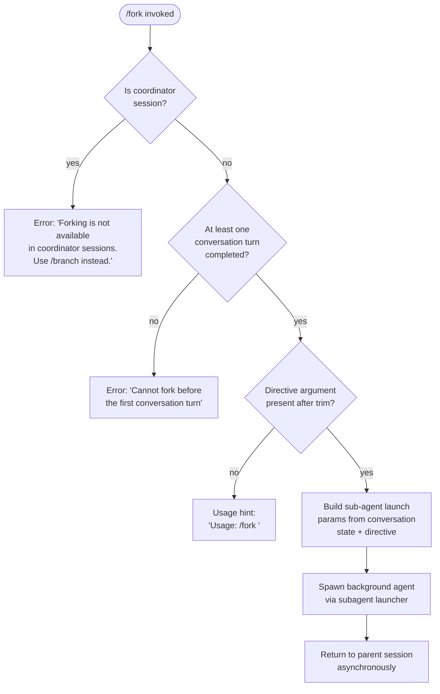

# `/fork`

> Analysis basis: CC v2.1.195 bundle.js (AST extraction + Claude interpretation)
> Minimum version: v2.1.195

---

## Overview

`/fork` spawns a background sub-agent that inherits the full current conversation context. The caller supplies a `<directive>` string that becomes the task instruction sent to the forked agent, which then runs asynchronously while the parent session continues. The command is gated: it refuses to operate inside coordinator sessions and requires at least one completed conversation turn.

---

## Registration

| Field | Value |
|---|---|
| type | `local-jsx` |
| name | `fork` |
| description | `Spawn a background agent that inherits the full conversation` |
| argumentHint | `<directive>` |
| module_id | `n7l` |
| load_inline | `true` |
| loc_byte | `12816096` |
| loc_byte_end | `12816299` |
| loc_line | `8797` |
| arbor_handler.name | `Djf` |
| arbor_handler.fqn | `claude-2.1.195::Djf` |
| arbor_handler.kind | `AsyncFunction` |
| arbor_handler.resolution_path | `module_id` |
| arbor_handler.n_hits | `0` |

Analysis basis: CC v2.1.195 bundle.js:+12816096

---

## Input Branching

Four distinct paths exist based on session state and argument presence; Mermaid is used accordingly.



Analysis basis: CC v2.1.195 bundle.js:+12815655 (trim/guard), +12815793 (coordinator guard), +12815866 (turn guard), +12815679 (usage string)

---

## Behavioral Spec

### Main Handler — `forkCommandHandler` (`Djf`)

```
async function forkCommandHandler(context, rawArgument):
    directive = rawArgument.trim()                       // +12815655

    if context.isCoordinatorSession():
        display error: "Forking is not available in coordinator sessions. Use /branch instead."
        return                                           // +12815793

    if context.getConversationTurns().length == 0:
        display error: "Cannot fork before the first conversation turn"
        return                                           // +12815866

    if directive is empty:
        display usage: "Usage: /fork <directive>"       // +12815679
        return

    sanitizedDirective = sanitizeWhitespace(directive)  // via string replacement utility (e) +12815677

    subagentParams = buildSubagentLaunchParams(context, sanitizedDirective)
    launchBackgroundSubagent(subagentParams)             // YOo +12815747
```

Analysis basis: CC v2.1.195 bundle.js:+12815655

---

### Conversation Context Snapshot — `buildConversationSnapshot` (maps through `YOo`)

```
function buildConversationSnapshot(context, directive):
    // Collect existing transcript messages
    messages = context.getReplContexts()                 // +11395117

    // Trim conversation tail to last 50 messages        // +11395293 (literal 50)
    // or last 49 messages depending on branch           // +11395306 (literal 49)
    messages = messages.slice(-50)

    // Generate a unique fork session ID
    sessionId = generateId()                             // sP +11395323
    timestamp = Date.now()                              // +11395350

    // Tag as 'fork' mode                               // +11395077 (literal "fork")
    // Include 'resume' hint when applicable             // +11395196 (literal "resume")

    // Attach system-level message scope "system"       // +12815719
    // Mark output style as background ("bg")            // +13795466

    forkContext = {
        messages: messages,
        directive: directive,
        sessionId: sessionId,
        timestamp: timestamp,
        mode: "fork",
        outputStyle: "bg",
        replContexts: collectReplContexts(context),
    }
    return forkContext
```

Analysis basis: CC v2.1.195 bundle.js:+11395117, +11394871 (`jI`), +11394883 (`ke`), +11394990 (`hxf`)

---

### Sub-agent System Prompt Construction — `buildSystemPrompt` (via `hxf` → `Pk`)

The system prompt for the forked agent is assembled from many feature-flag-conditional segments. Key segments identified from literals:

```
function buildSystemPrompt(appState, featureFlags):
    parts = []

    // Core identity / task ownership sentence (flag-conditional variants):
    //   "You work alongside the user on software engineering tasks and own the outcome..."
    //   "You are an interactive agent that helps users with software engineering tasks."
    // +13786717, +13786818

    // Inject tool guidance section "# Using your tools"  // +13780371
    // Inject task section "# Doing tasks"                // +13776661
    // Inject tone/style section "# Tone and style"       // +13786602

    // Background-session-specific instruction:
    //   mode = "bg-session"                              // +13788918
    //   outputStyle = "bg" / "none"                      // +13795466, +13795539
    //   worktree / tmp context injected if applicable    // +13795783, +13796875

    // Inject environment block "# Environment"           // +13792832
    //   Includes git-worktree notice if detected:
    //   "This is a git worktree..."                      // +13790942
    //   Adds "Additional working directories:" block     // +13791140

    // Context management (brief / compact)               // +13789006, +13789045

    // Agent path safety note:
    //   "Agent threads always have their cwd reset between bash calls..."  // +13794452

    // Prompt injection warning                           // +13772325

    // Compression/compaction notice                      // +13772514

    // Version/help footer                                // +13774592 "2.1.195"

    return join(parts)
```

Analysis basis: CC v2.1.195 bundle.js:+11396708 (`e.getAppState`), +13788052, +13788103

---

### Sub-agent Launch — `launchSubagent` (via `lyt`)

```
async function launchSubagent(forkContext):
    // Create working directory symlink for sub-agent     // rbe +13638654
    //   mkdir if needed (IGo +13636224)
    //   create symlink path (Bm +13636278)
    //   handle EEXIST gracefully                         // +13638744

    // Build process descriptor                           // px +5389361
    //   set cwd                                          // Cao.get +5389385
    //   join subagents path                              // yke.join +5389400

    // Register abort controller                          // xia +5249770
    // Set mode = "background"                            // +9160886

    agent = spawnBackgroundProcess(forkContext)           // BK.spawn ultimately

    // Store agent reference under "subagents"            // +5389413

    // Register as local_agent                            // +10725953
    // Record status "running"                            // +10725998
    // Task type "general-purpose"                        // +10726116

    return agent
```

Analysis basis: CC v2.1.195 bundle.js:+10725906 (`rbe`), +10725912 (`px`), +10725931 (`pO`), +11395386 (`lyt`)

---

### Agent Execution Loop — `runAgentLoop` (via `jVe`)

```
async function runAgentLoop(agentState):
    // Set mode to "background"                           // +9160886
    // Set watchdog timeout: 600 000 ms                  // +9161037
    // Status transitions: "responding" → "unknown"      // +9161128, +9161412
    // On stall, emit "watchdog_stall"                    // +9161692

    while not done:
        turn = await callModel(agentState)               // via mCf
        processToolCalls(turn)                           // via oKn, EKe
        updateTranscript(turn)                           // i.updateTranscript +9163204
        emitProgress()                                   // query_progress +9162636

        if subagentComplete:
            emit "subagent_complete"                     // +9162351
            break
        if stalled:
            emit "subagent_stall_timeout"                // +9162371
            break

    finalizeAgent(agentState)                            // GCo, FCo
```

Analysis basis: CC v2.1.195 bundle.js:+9160864 (`jVe`), +9161037, +9162351, +9162371

---

### Completion & Handoff Classifier — `finalizeSubagent` (via `GCo` → `FCo`)

```
function finalizeSubagent(agentState):
    // Locate last assistant message                      // Nw +13950807
    // Run handoff safety classifier (SHt)               // +9145188 - +9146637
    //   classifier result: "allowed", "blocked", "unavailable"  // +9159597, +9159587, +9159559
    //   on "unavailable": warn user, allow with warning  // +9160077
    //   on "blocked": suppress output

    // Emit subagent completion event                     // "subagent_completed" +9158208
    // Emit "subagent_end"                               // +9158508

    // Clean up abort controller
    // Delete agent from registry                         // D.delete +9163000, N.delete +9163018
```

Analysis basis: CC v2.1.195 bundle.js:+9159220 (`bol`), +9159253 (`SHt`), +9157498 (`FCo`)

---

### Coordinator-Mode Guard

The literal `"Forking is not available in coordinator sessions. Use /branch instead."` is emitted when the session is a coordinator session.

Analysis basis: CC v2.1.195 bundle.js:+12815793

### Pre-turn Guard

The literal `"Cannot fork before the first conversation turn"` is emitted when no conversation turns exist yet.

Analysis basis: CC v2.1.195 bundle.js:+12815866

---

## State & Side Effects

| Item | Detail |
|---|---|
| Telemetry | `tengu_forked_agent_default_turns_exceeded` (+11064727); `tengu_quartz_heron` (+9170282); `tengu_slim_subagent_claudemd` (+9432167); `tengu_shale_finch` (+9153366); `tengu_async_agent_stall_timeout` (+9162111); `tengu_async_agent_stranded_tools_cleared` (+9163071); `tengu_agent_tool_completed` (+9157913); `tengu_agent_tool_terminated` (+9165783); `tengu_auto_mode_decision` (+9159612); `tengu_agent_summary_skipped` (+9050447) |
| Sub-agent lifecycle events | `subagent_launch` (+11394886); `subagent_fork_coordinator_mode` (+11394904); `subagent_fork_prompt_missing` (+11395028); `subagent_complete` (+9162351); `subagent_stall_timeout` (+9162371); `subagent_completed` (+9158208); `subagent_end` (+9158508); `subagent_async_errored` (+9166380) |
| File system | Creates working directory symlink under a `subagents/` path; mkdir with EEXIST tolerance; unlinks on cleanup |
| appState changes | `getAppState` consulted for permission_mode, model, effort, flag_settings, allowed_tools, disallowed_tools; `setAppState` called during agent lifecycle |
| Agent registry | Agent added to local task registry with status `running`; removed on completion or error |
| Abort controller | Registered per forked agent; aborted on parent kill or timeout |
| Watchdog | 600 000 ms stall timeout on the background agent stream |
| Output style | Forked agent runs with output style `"bg"` and session type `"bg-session"` |
| Context slice | Last 50 messages (or 49 in alternate branch) of the parent conversation are passed to the fork |
| Transcript | Agent transcript stored under a subdirectory; `.meta.json` and `.jsonl` files written |
| Handoff classifier | Safety classifier run on agent output before surfacing to parent; result: `allowed` / `blocked` / `unavailable` |

---

## Version History

| Version | Change |
|---|---|
| v2.1.195 | Initial analysis |

---

## Common Mistakes

1. **Running `/fork` in a coordinator session** — The command unconditionally rejects with "Forking is not available in coordinator sessions. Use /branch instead." Use `/branch` in that context.
2. **Invoking `/fork` before any conversation turn** — The guard checks that at least one turn has completed; issuing `/fork` as the very first message will produce an error.
3. **Omitting the `<directive>` argument** — Without a directive the command prints the usage hint and does nothing; always supply a non-empty task description.
4. **Expecting synchronous output** — The forked agent runs in the background (`"bg"` output style); the parent session returns immediately and the agent's results surface asynchronously.
5. **Assuming the fork inherits unlimited context** — Only the last 50 messages of the parent conversation are sliced and forwarded; very long conversations will lose older context in the fork.

---

## Appendix — Identifier Mapping

> For bundle debugging only. Identifiers change across versions.

| Identifier | Role |
|---|---|
| `Djf` | Main async handler for `/fork` command (arbor_handler) |
| `YOo` | Sub-agent launch coordinator / conversation snapshot builder |
| `hxf` | System prompt assembly router |
| `Pk` | Core system prompt builder (feature-flag-conditional sections) |
| `Br` | AppState reader for working directory / tool lists |
| `uZn` | Working-directory context builder |
| `dZn` | Disallowed-tools context builder |
| `xF` | Permission-mode resolver |
| `jI` | Session identifier builder |
| `ke` | React-like UI component (sub-agent display) |
| `lyt` | Sub-agent spawner (orchestrates `rbe`, `px`, `pO`) |
| `rbe` | File system setup for sub-agent working directory (symlink/mkdir) |
| `klr` | Concurrency lock for directory creation |
| `IGo` | mkdir helper for sub-agent working directory |
| `Bm` | Path builder for sub-agent symlink |
| `px` | Process descriptor builder |
| `pO` | AbortController setup / signal registration |
| `xia` | Signal registration helper |
| `DT` | Timestamp + path recorder for agent |
| `jVe` | Background agent execution loop (main async loop) |
| `vAe` | Agent state updater |
| `WVe` | Speculation and state flush handler |
| `MXn` | Agent metric update |
| `LMo` | Timestamp helper for agent loop |
| `GH` | Flush and delete from agent registry |
| `CHt` | Transcript update helper |
| `hHt` | Transcript update dispatcher |
| `Tde` | Mode state machine (responding/thinking/unknown) |
| `PMe` | Spinner/mode state updater |
| `zrl` | Agent turn processor (tool-call resolution, stream events) |
| `fx` | Stream event processor |
| `FCo` | Sub-agent finalizer (summary + classifier) |
| `GCo` | Sub-agent completion renderer |
| `SHt` | Handoff safety classifier runner |
| `bol` | Classifier initialization |
| `Nw` | Last assistant message finder |
| `bCo` | Tool-use tracking set operations |
| `Rn` | UUID generator for agent |
| `Jrl` | Agent registry update on turn complete |
| `a4` | Full background agent startup function (main orchestrator below `jVe`) |
| `mCf` | Main agent query / model call loop |
| `RU` | Agent query entry point |
| `gQn` | Agent exit cleanup |
| `Mzn` | MCP state initializer for sub-agent |
| `Pzn` | MCP tool reconciler for sub-agent |
| `BAe` | Sub-agent session initializer |
| `Iv` | Hook runner for sub-agent lifecycle events |
| `JVt` | SubagentStart hook trigger |
| `Td` | Hook configuration builder |
| `UO` | RF/WB policy resolver |
| `Lt` | Worker/bridge connection setup |
| `kVo` | Worker event bridge |
| `st` | Worker connection state machine |
| `Gt` | Worker batch writer |
| `FAe` | Tool availability filter |
| `xPo` | Deferred tools pool manager |
| `oKn` | Tool execution classifier |
| `EKe` | Tool result classifier |
| `Pol` | Transcript update on tool result |
| `mVt` | WCo mirror of agent state |
| `Xnf` | Agent memory trigger propagation |
| `bHt` | Agent summary timing tracker |
| `iKn` | Agent-local tool state |
| `bAe` | Agent state deleter/flusher |
| `IHt` | Tool prefix state checker |
| `Ool` | Agent notification emitter |
| `nKn` | Agent metric recorder (turn-level) |
| `Ccl` | Agent session slot checker |
| `Prl` | Agent parallel runner |
| `Wrl` | Shell task finalization |
| `AAe` | Shell monitor cleanup |
| `Orl` | Non-shell monitor finalization |
| `SAe` | Monitor state updater |
| `OVe` | Agent output filter |
| `Mwo` | Stream response tracker |
| `Pvo` | Cache clear for agent |
| `Ovo` | Cache get/set/update for agent |
| `yZt` | Token ceil estimator |
| `iGe` | Token round estimator |
| `sP` | Random ID generator |
| `iMl` | Directive trimmer |
| `fJn` | Message context collector |
| `rgf` | Tool-use message filter |
| `ogf` | Tool-result message filter |
| `ngf` | Code-type message filter |
| `sgf` | Duplicate message filter |
| `Hoe` | System prompt renderer |
| `zR` | Model configuration resolver |
| `Ko` | Model name parser/normalizer |
| `La` | Provider/model combination builder |
| `mZp` | System prompt segment joiner |
| `wtm` | Output style system prompt segment |
| `Ltm` | Confirmation behavior segment |
| `xtm` | OI initiative segment |
| `Dtm` | Autonomy/append segment builder |
| `Ptm` | Flag settings segment |
| `BUt` | Memory load prompt builder |
| `Ztm` | Environment info (static) builder |
| `Qtm` | Environment info (simple) builder |
| `tnm` | Background session mode builder |
| `Ozn` | Scratchpad/context management builder |
| `rnm` | Brief mode segment |
| `inm` | Reproduce/verify workflow segment |
| `Ktm` | Act-don't-rederive segment |
| `Eac` | System prompt final assembler |
| `nW` | Agent system prompt injector |
| `Tyl` | Compute-cache prompt segment |
| `qtm` | Task-continuity segment |
| `Utm` | Fable identity segment |
| `$tm` | System segment appender |
| `Ftm` | Tool-param JSON segment |
| `Btm` | SDK segment |
| `Gtm` | Orchid-mantis segment |
| `Vtm` | Autonomy segment |
| `XUi` | First-party provider check |
| `ZLe` | AnthropicAws check |
| `qq` | Model list resolver |
| `jtm` | Session/schedule segment builder |
| `JZn` | Plugin tool injection |
| `QLe` | Pewter-owl tool check |
| `Cs` | CLI error / process exit handler |
| `n` | toLowerCase utility |
| `i` | close/session close handler |
| `r` | Cs invocation wrapper |
| `s` | Set add/delete/finally registration |
| `e` | String replace utility |
| `T` | Log/message formatter |
| `Zr` | Error/string coercer |
| `xe` | Error logger |
| `on` | Generic event emitter |
| `Bm` | Path join for agent directory |
| `ut` | String coercer |
| `z5` | Session state reader |
| `Le` | UI component renderer |
| `Oe` | OJe renderer |
| `je` | OJe renderer variant |
| `No` | OJe renderer variant 2 |
| `wt` | UI component variant |
| `ye` | String coercer for display |
| `sg` | Token counter |
| `YM` | Language/model set checker |
| `Xc` | Event emitter wrapper |
| `Cye` | Case-normalizer |
| `br` | Nonconforming message handler |
| `Ynf` | Vqn cache checker |
| `gVt` | UUID generator for turn |
| `Pvt` | Turn duration tracker |
| `krl` | Nqn cleanup |
| `anm` | iWo wrapper |
| `iWo` | Model parameter injector |
| `Oqn` | Object-entry iterator for agent state |
| `x0` | Tool state resolver |
| `Mzn` | MCP state init |
| `cZn` | MCP UUID generator |
| `pke` | MCP policy keys extractor |
| `Cwa` | MCP config assembler |
| `nn` | Headless plugin install runner |
| `det` | Timing/wait helper |
| `pJo` | Headless marketplace reconciler |
| `Zc` | Math.round wrapper |
| `Bpe` | Agent output buffer |
| `pA` | Output buffer init |
| `Ztf` | Output buffer finder |
| `mE` | Message extractor |
| `Nrm` | HZt wrapper |
| `Urm` | iXt/Rn wrapper |
| `Nzn` | Outer/inner message pair |
| `h_t` | Tool progress emitter |
| `Xoe` | Directive trimmer (secondary) |
| `Dyt` | Tool result assembler |
| `Ccl` | Session slot reader |
| `Prl` | Parallel runner for object values |
| `Wrl` | Shell task object iterator |
| `AAe` | Shell monitor finalizer |
| `Orl` | Non-shell monitor object iterator |
| `SAe` | Non-shell monitor state machine |
| `YJ` | uca invoker |
| `Hca` | YV deleter / _Ge invoker |
| `_Ge` | dca/pca/writeFile helper |
| `Rr` | Stream-json / commands_changed emitter |
| `zI` | Ring-buffer shift/push |
| `Ese` | Workflow/builtin resolver |
| `Rwo` | y7t.delete invoker |
| `hWe` | b2n/ipo cleanup |
| `yxa` | OTel span attribute setter |
| `_We` | OTel status setter |
| `yMe` | OTel context restorer |
| `Oca` | Cao cache deleter |
| `t3t` | Turn counter |
| `jMe` | Turn finalizer |

---

Note: index built via Arbor fallback; some signals (telemetry, literals) may be missing — see arbor-fallback.js.