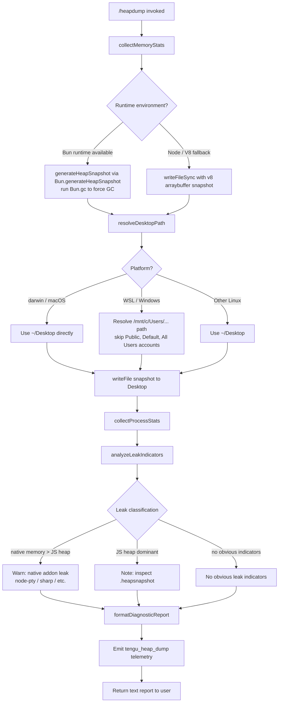

# `/heapdump`

> Analysis basis: CC v2.1.195 bundle.js (AST extraction + Claude interpretation)
> Minimum version: v2.1.195

---

## Overview

`/heapdump` is a hidden diagnostic command that captures the current JavaScript heap to a snapshot file on the user's Desktop, simultaneously collecting a broad set of memory and process statistics. It then analyzes those statistics for potential memory-leak indicators and returns a formatted diagnostic report together with instructions for inspecting the heap snapshot in Chrome DevTools. The command is intended for internal debugging of the Claude Code process itself and is not surfaced to end users under normal operation.

---

## Registration

| Field | Value |
|---|---|
| type | `local` |
| name | `heapdump` |
| description | `Dump the JS heap to ~/Desktop` |
| loc_byte | `12915554` |
| loc_byte_end | `12915982` |
| loc_line | `8919` |
| supportsNonInteractive | `true` |
| isHidden | `true` |
| module_id | `sJl` |
| load_inline | `true` |
| arbor_handler.name | `nVf` |
| arbor_handler.fqn | `claude-2.1.195::nVf` |
| arbor_handler.kind | `AsyncFunction` |
| arbor_handler.resolution_path | `module_id` |
| arbor_handler.n_hits | `0` |

Analysis basis: CC v2.1.195 bundle.js:+12915554

---

## Input Branching

The command follows a predominantly linear flow with three significant branching points: (1) runtime environment detection (Bun vs. Node/V8), (2) platform detection (macOS vs. other) for Desktop path resolution, and (3) memory-leak heuristic classification. A Mermaid flowchart is used below.



---

## Behavioral Spec

### Top-Level Handler (`heapDumpHandler`)

Analysis basis: CC v2.1.195 bundle.js:+12914423

```
async function heapDumpHandler(commandContext):
    snapshotPath = await captureHeapSnapshot(commandContext)
    reportLines  = [buildInstructionLine(snapshotPath)]
    reportLines += buildMemoryReport()
    return reportLines.join("\n")
```

The handler (`nVf`) calls `captureHeapSnapshot` (`H9o`) to write the file and collect diagnostics, then calls `buildMemoryReport` (`rVf`) to format the output, and finally joins the result lines before returning a plain-text response.

---

### Heap Snapshot Capture (`captureHeapSnapshot`)

Analysis basis: CC v2.1.195 bundle.js:+12913085 – +12913931

```
async function captureHeapSnapshot(context):
    # Resolve output path
    desktopPath = resolveDesktopPath()          # cAs
    timestamp   = currentTimestamp()            # qt
    filename    = path.join(desktopPath, timestamp + ".heapsnapshot")

    # Collect pre-snapshot memory statistics
    stats = collectMemoryStats()                # rJl

    # Write heap snapshot
    snapshotData = generateSnapshot()           # tVf
    await fs.writeFile(filename, snapshotData, mode=0o600)  # octal 384

    # Emit telemetry
    emit("tengu_heap_dump")                     # loc_byte 12913675

    # Build per-section report content
    reportContent = formatStats(stats)          # Me
    return { path: filename, report: reportContent }
```

The file-permission mask `384` (octal `0o600`) restricts snapshot access to the owner only.
Analysis basis: CC v2.1.195 bundle.js:+12913568

---

### Desktop Path Resolution (`resolveDesktopPath`)

Analysis basis: CC v2.1.195 bundle.js:+1108851 – +1109343

```
function resolveDesktopPath():
    home = os.homedir()                         # s0r.homedir
    if platform == "darwin":
        return path.join(home, "Desktop")
    # WSL / Windows path handling
    wslBase = "/mnt/c/Users"
    if home.startsWith(wslBase):
        # Exclude system accounts: Public, Default, "Default User", "All Users"
        segments = home.replace(wslBase, "").split(sep)
        username = segments[0]
        if username not in ["Public", "Default", "Default User", "All Users"]:
            return path.join(wslBase, username, "Desktop")
    # Generic Linux fallback
    return path.join(home, "Desktop")
```

Analysis basis: CC v2.1.195 bundle.js:+1108858 (homedir), +1109126 (WSL base), +1109170–+1109234 (excluded usernames), +1108904 ("Desktop" segment)

---

### Memory Statistics Collection (`collectMemoryStats`)

Analysis basis: CC v2.1.195 bundle.js:+12910586 – +12911171

```
function collectMemoryStats():
    mem      = process.memoryUsage()
    heapStat = v8.getHeapStatistics()              # tir.getHeapStatistics
    res      = process.resourceUsage()
    uptime   = process.uptime()
    spaces   = v8.getHeapSpaceStatistics()         # tir.getHeapSpaceStatistics
    handles  = process._getActiveHandles()
    requests = process._getActiveRequests()

    # Linux-specific: read open file-descriptor count
    fdList   = await fs.readdir("/proc/self/fd")   # loc_byte 12910829

    # Linux-specific: read smaps_rollup for RSS breakdown
    smaps    = await fs.readFile(
                   "/proc/self/smaps_rollup", "utf8")  # loc_byte 12910892

    # Load Bun JSC module for additional heap info
    jsc      = require("bun:jsc")                  # loc_byte 12910977

    # Build process-list snapshot for cross-referencing (H)
    processList = buildProcessList()

    # Constants used for unit conversion
    MB_DIVISOR = 1048576                           # loc_byte 12911123
    MAX_AGE_S  = 3600                              # loc_byte 12911118

    return {
        mem, heapStat, res, uptime, spaces,
        handles, requests, fdList, smaps, jsc,
        processList
    }
```

The divisor `1048576` (1 MiB) is used to convert raw byte values to megabytes throughout the report.
Analysis basis: CC v2.1.195 bundle.js:+12911123

---

### Snapshot Generation (`generateSnapshot`)

Analysis basis: CC v2.1.195 bundle.js:+12914103 – +12914180

```
function generateSnapshot():
    if typeof Bun != "undefined":
        Bun.gc(true)                               # force synchronous GC
        return Bun.generateHeapSnapshot()          # Bun-native snapshot
    else:
        # Node.js / V8 path
        v8mod = require("v8")
        buf   = v8mod.writeHeapSnapshot()          # nJl.writeFileSync path
        return Buffer.from(buf, "arraybuffer")     # loc_byte 12914153
```

The string `"v8"` (loc_byte 12914148) and `"arraybuffer"` (loc_byte 12914153) mark the Node.js serialization branch.
Analysis basis: CC v2.1.195 bundle.js:+12914123, +12914148

---

### Memory Report Builder (`buildMemoryReport`)

Analysis basis: CC v2.1.195 bundle.js:+12914542 – +12915110

```
function buildMemoryReport(stats, snapshotPath):
    lines = []

    # Opening instruction line
    lines.push(
        "Open the .heapsnapshot in Chrome DevTools → Memory → Load to inspect retainers."
    )                                              # loc_byte 12914579

    # Compute memory fractions
    heapUsedMB   = stats.mem.heapUsed  / MB_DIVISOR
    rssMB        = stats.mem.rss       / MB_DIVISOR
    nativeMB     = rssMB - heapUsedMB
    threshold    = Math.max(rssMB * 0.5, 500)     # loc_byte 12914798; 500 MB floor

    # Classify dominant memory region
    if nativeMB > heapUsedMB:
        classification = "— most memory is native (NOT in the .heapsnapshot)"  # loc_byte 12914926
        # Also emit: "Native memory > heap - leak may be in native addons (node-pty, sharp, etc.)"
    else:
        classification = "— most memory is JS heap (inspect the .heapsnapshot)"  # loc_byte 12914866

    # Append leak indicators section
    indicators = detectLeakIndicators(stats)       # ebt
    if indicators is empty:
        lines.push("  (no obvious leak indicators)")   # loc_byte 12915063
    else:
        lines += indicators

    lines.push(classification)

    # Numeric formatting: values rounded to fixed decimal places
    # percentage threshold uses value 100 (loc_byte 12911270)
    # GiB boundary uses 1073741824 (loc_byte 12915472)
    # column width 8 (loc_byte 12915198)

    return lines
```

The report uses a fixed `500` MB floor (loc_byte 12914798) and `1 073 741 824` bytes (1 GiB, loc_byte 12915472) as a boundary constant for large-heap annotations.

---

### Leak Indicator Detection (`detectLeakIndicators`)

Analysis basis: CC v2.1.195 bundle.js:+12915110

```
function detectLeakIndicators(stats):
    indicators = []

    nativeMB = (stats.mem.rss - stats.mem.heapUsed) / MB_DIVISOR

    if nativeMB > heapUsedMB:
        indicators.push(
            "Native memory > heap - leak may be in native addons (node-pty, sharp, etc.)"
        )                                          # loc_byte 12911356

    if indicators is empty:
        return ["No obvious leak indicators. Check heap snapshot for retained objects."]
                                                   # loc_byte 12912475
    return indicators
```

Analysis basis: CC v2.1.195 bundle.js:+12911356, +12912475

---

### Additional Stats Formatting (within `collectMemoryStats`)

The `h.toFixed` call (loc_byte 12911479) formats floating-point MB values to a fixed number of decimal places. The threshold `100` (loc_byte 12911270) is used as a percentage cap when computing heap utilization ratios. The uptime field (from `process.uptime()`) is displayed in seconds.

Analysis basis: CC v2.1.195 bundle.js:+12911479

---

## State & Side Effects

| Item | Detail |
|---|---|
| Telemetry | `tengu_heap_dump` (loc_byte 12913675) — fired once per invocation after the snapshot file is written. Additional telemetry reachable via the background-process utilities in the call graph: `tengu_bg_dispatch_sigkill_escalate`, `tengu_daemon_idle_exit`, `tengu_feature_bad`, `tengu_feature_ok`, `tengu_bg_low_mem_mb`, `tengu_bg_dispatch_low_mem`, `tengu_bg_spare_enable`, `tengu_bg_sendclaim_failed`, `tengu_bg_spare_claim`, `tengu_bg_spare_claim_fail` — these are not directly emitted by the heapdump flow but are reachable through shared process-management utilities. |
| File system write | Writes a `.heapsnapshot` file to `~/Desktop` (or the platform-equivalent path) with permissions `0o600` (owner read/write only). Analysis basis: CC v2.1.195 bundle.js:+12913533, +12913568 |
| GC side effect | On Bun runtime: triggers a synchronous garbage collection (`Bun.gc(true)`) before capturing the snapshot, which briefly pauses the process. Analysis basis: CC v2.1.195 bundle.js:+12914180 |
| Process introspection | Reads `/proc/self/fd` and `/proc/self/smaps_rollup` on Linux; these are Linux-only kernel virtual files. Analysis basis: CC v2.1.195 bundle.js:+12910829, +12910892 |
| Hook registration | <!-- TODO: not found in depth-2 traversal; needs --depth 4 --> |
| appState changes | None observed in depth-2 traversal. |
| Sound | None. |

---

## Version History

| Version | Change |
|---|---|
| v2.1.195 | Initial analysis |

---

## Common Mistakes

1. **Expecting output on non-Desktop systems** — The command always writes to `~/Desktop`. If that directory does not exist (common on headless Linux servers), the `writeFile` call will fail with `ENOENT`. The command does not create the directory automatically.
2. **Running on Windows natively (not WSL)** — The Desktop path resolution logic handles WSL paths under `/mnt/c/Users/` but does not handle a native Windows environment. On native Windows, the command may resolve an incorrect path.
3. **Snapshot reflects post-GC state on Bun** — Because `Bun.gc(true)` runs immediately before snapshot capture, the resulting `.heapsnapshot` shows the heap *after* a full GC pass. Objects that would be collected but have not yet been freed are absent, which can make some leak classes harder to identify.
4. **Confusing native-memory leaks with JS-heap leaks** — The diagnostic message "Native memory > heap" indicates that memory pressure originates outside the V8/JSC heap (e.g., `node-pty`, `sharp`). The `.heapsnapshot` file will not contain this memory; the warning message explicitly states `"NOT in the .heapsnapshot"` (loc_byte 12914926).
5. **Treating `/proc` data as cross-platform** — The `fd` count and `smaps_rollup` readings are silently absent on macOS and Windows because those paths do not exist on those platforms. Reports generated on macOS will omit the fd-count and RSS-breakdown sections.
6. **Expecting the command to appear in `/help`** — `isHidden: true` means the command is invisible in normal help output and must be typed explicitly.

---

## Appendix — Identifier Mapping

> For bundle debugging only. Identifiers change across versions.

| Identifier | Role |
|---|---|
| `nVf` | Top-level handler (`heapDumpHandler`) — AsyncFunction; entry point for `/heapdump` |
| `H9o` | `captureHeapSnapshot` — orchestrates Desktop path resolution, stat collection, file write, and telemetry emit |
| `Rt` | Shared result/response wrapper utility |
| `u0` | Low-level result constructor called by `Rt` |
| `rJl` | `collectMemoryStats` — gathers `process.memoryUsage`, V8 heap stats, resource usage, uptime, heap spaces, handles, requests, fd list, and smaps |
| `y` | File-system or messaging utility called from `collectMemoryStats` |
| `dVe` | `TeammateMailbox.markMessagesAsRead` — shared mailbox utility reached via `y` |
| `H` | Process-list builder (iterates `o.values`, can send `SIGTERM`) |
| `h` | Background subprocess manager / process-record handler |
| `W` | Shared logging or event-emitter utility |
| `V` | Subprocess kill/timeout handler (sends `SIGTERM` → `SIGKILL` with timeout) |
| `Un` | Promise-based abort/timeout wrapper |
| `e` | String replacement utility |
| `ke` | Feature-flag "bad" reporter (emits `tengu_feature_bad`) |
| `Le` | Feature-flag "ok" reporter (emits `tengu_feature_ok`) |
| `yar` | Low-memory check utility (emits `tengu_bg_low_mem_mb`; macOS-aware, 1024 MiB threshold) |
| `q5e` | File-stat + conditional-read + cleanup utility |
| `xe` | Error logging / push utility (calls `Gee.logError`) |
| `Z` | Promise retirement helper (`retireIfSettled`) |
| `at` | Process-registry lookup / claim utility |
| `PZo` | Background session socket connect utility (emits `tengu_bg_sendclaim_failed`) |
| `FZo` | Background job lifecycle manager (tracks done/killed/stopped/failed/crashed states) |
| `l` | Lazy loader or list builder (`LZl`) |
| `g` | Generator or formatter utility |
| `on` | Event emitter / observer utility |
| `Oe` | Feature routing dispatcher (calls `OJe`) |
| `K` | Disposable resource manager (`dispose` method) |
| `T` | Shell-command formatter / runner |
| `RYc` | Command-line argument builder |
| `Drs` | Environment variable helpers (`NKc`, `UKc`) |
| `Me` | JSON stringifier wrapper |
| `Lc` | Path/string sanitiser (redacts values, handles `[REDACTED]`) |
| `_is` | Mapping utility over `wYc` array |
| `r` | Shared string/data stream object |
| `n` | String normaliser (lowercases) |
| `jXe` | Output writer (calls `ais` → `e.write`) |
| `ais` | Raw stream write helper |
| `PYc` | Transcript / log-file writer (mkdir, appendFile, rotate) |
| `_Xe` | Buffered output chunker with `setTimeout`/`setImmediate` flush |
| `Qge` | Log segment joiner / flusher |
| `qt` | Timestamp generator |
| `tae` | Event notifier (calls `on`) |
| `Sis` | Path-join + result wrapper |
| `oAr` | File rename/unlink helper (handles `.txt` suffix, 4-char slice) |
| `DYc` | Log-file append + rotation handler |
| `vi` | Hook / signal registrar (`krs.register`) |
| `cAs` | `resolveDesktopPath` — resolves `~/Desktop` cross-platform including WSL |
| `tVf` | `generateSnapshot` — Bun or Node.js heap snapshot writer |
| `Zr` | Error constructor wrapper |
| `gd` | Debug logger |
| `rVf` | `buildMemoryReport` — formats memory statistics and leak classification into report lines |
| `ebt` | `detectLeakIndicators` — scans stats for anomaly signals |