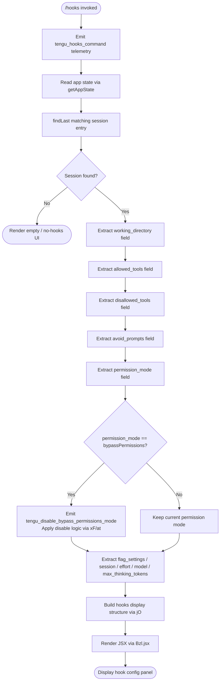

# `/hooks`

> Analysis basis: CC v2.1.195 bundle.js (AST extraction + Claude interpretation)
> Minimum version: v2.1.195

---

## Overview

The `/hooks` command displays the currently active hook configurations for tool events in a Claude Code session. It reads app state to resolve the effective hook settings — including allowed tools, disallowed tools, working directory overrides, permission modes, and other session-scoped flag settings — then renders them as a JSX component in the terminal UI. The command is marked `immediate`, meaning it executes synchronously without spawning an agent turn.

---

## Registration

| Field | Value |
|---|---|
| type | `local-jsx` |
| name | `hooks` |
| description | `View hook configurations for tool events` |
| immediate | `true` |
| module_id | `Fzl` |
| load_inline | `true` |
| loc_byte | `12806081` |
| loc_byte_end | `12806231` |
| loc_line | `8797` |
| arbor_handler.name | `Ijf` |
| arbor_handler.fqn | `claude-2.1.195::Ijf` |
| arbor_handler.kind | `AsyncFunction` |
| arbor_handler.resolution_path | `module_id` |
| arbor_handler.n_hits | `0` |

Analysis basis: CC v2.1.195 bundle.js:+12806081

---

## Input Branching

The command follows a multi-branch resolution path: it reads app state, finds the most-recent session entry, classifies it against several hook-category fields, and conditionally includes or excludes each category. Five or more distinct field-based branches are present, warranting a Mermaid flowchart.



Analysis basis: CC v2.1.195 bundle.js:+12805889, +12805923, +12805931, +11065876, +11065956, +11066054, +11066091, +11066152, +11066254, +11066285, +11066307, +12805961

---

## Behavioral Spec

### Top-Level Handler (`Ijf`)

The async handler `Ijf` is the entry point resolved by Arbor via `module_id` path. It orchestrates three sequential operations before rendering.

```
async function hooksCommandHandler(context):
    emit telemetry("tengu_hooks_command")          // +12805891
    sessionInfo = resolveCurrentSession(context)   // calls Br  (+12805923)
    hooksDisplayData = buildHooksDisplay(context)  // calls jO  (+12805931)
    return renderJSX(Bzl, hooksDisplayData)        // calls Bzl.jsx (+12805961)
```

Analysis basis: CC v2.1.195 bundle.js:+12805889

---

### Session Resolution (`Br`)

`Br` (session resolver) retrieves the live app state and locates the most recent relevant session entry. It uses `getAppState` to obtain the current state tree, then `findLast` to walk the session list in reverse.

```
function resolveCurrentSession(context):
    state = context.getAppState()                          // +11065876
    session = state.sessions.findLast(entry =>
        entry.toLowerCase() matches current context)       // +11065956
    return session
```

Key field names extracted from this function (all confirmed by literals):

| Literal | Loc byte |
|---|---|
| `"working_directory"` | +11065981 |
| `"allowed_tools"` | +11066036 |
| `"disallowed_tools"` | +11066091 |
| `"avoid_prompts"` | +11066152 |
| `"permission_mode"` | +11066254 |
| `"bypassPermissions"` | +11066285 |
| `"session"` | +11066584 |
| `"effort"` | +11066609 |
| `"model"` | +11066622 |
| `"max_thinking_tokens"` | +11066634 |
| `"flag_settings"` | +11066660 |

Analysis basis: CC v2.1.195 bundle.js:+11065876

---

### Allowed-Tools Extraction (`uZn`)

`uZn` collects the set of tools that are explicitly permitted for the session and calls a shared formatting helper `Fo`.

```
function extractAllowedTools(session):
    allowedSet = session["allowed_tools"]   // +11066036
    return formatToolList(allowedSet)        // Fo (+11058645)
```

Analysis basis: CC v2.1.195 bundle.js:+11066054

---

### Disallowed-Tools Extraction (`dZn`)

`dZn` mirrors `uZn` but reads `"disallowed_tools"` and similarly delegates to `Fo` for formatting.

```
function extractDisallowedTools(session):
    disallowedSet = session["disallowed_tools"]  // +11066091
    return formatToolList(disallowedSet)           // Fo (+11058793)
```

Analysis basis: CC v2.1.195 bundle.js:+11066112

---

### Permission-Mode Gate (`xF` / `at`)

When the resolved `permission_mode` equals `"bypassPermissions"`, a separate branch (`xF`) fires. It calls `at`, which internally checks a feature-flag registry (`hxe.has`, `rV.has`, `rV.get`) and may emit `tengu_disable_bypass_permissions_mode` telemetry. The literal `"disable"` (+3420670) is used as the action token passed to `at`.

```
function handlePermissionMode(session):
    mode = session["permission_mode"]         // +11066254
    if mode == "bypassPermissions":           // +11066285
        applyFeatureFlagAction("disable",     // +3420670
            featureRegistry,                  // at (+3420566)
            bypassFlagKey)
        emit telemetry("tengu_disable_bypass_permissions_mode")  // +3420569
```

Analysis basis: CC v2.1.195 bundle.js:+11066307, +3420566, +3420569, +3420670

---

### Hooks Display Builder (`jO`)

`jO` is the main data-assembly function for the display. It builds a structured list of hook configuration entries by:

1. Calling `Dw` to resolve the transport/mode context (`"cli"` or `"remote"`, literals at +5116105 and +5116116).
2. Pushing entries via `d.push` into an output array.
3. Calling `pko` to assemble supervisor-related config (literal `"supervisor"` at +17901535).
4. Calling `XE` to validate/resolve tool-narrowing data.
5. Calling `zoe` to filter blocked items (literal `"blocked"` at +10498499).
6. Calling `fko` to assemble final key-value items.
7. Calling `Eu` to finalize the entry list.
8. Pushing UI elements via `u.push`.
9. Calling `p4` for additional session/effort/model configuration rows.
10. Checking `n.has` and `o.some` for conditional inclusion.
11. Calling `Zl` and verifying `cl.isEnabled` / `c.isEnabled` feature flags.
12. Filtering via `o.filter` and `kct.has`.
13. Mapping final display rows via `o.map`.

```
function buildHooksDisplay(context):
    transportMode = resolveTransport(context)      // Dw (+5115953)
    entries = []

    supervisorConfig = buildSupervisorConfig()     // pko (+10498790)
    entries.push(supervisorConfig)                 // d.push (+10499075)

    toolNarrowingData = resolveToolNarrowing()     // XE (+3396842)
    blockedFiltered = filterBlocked(toolNarrowingData)  // zoe (+10498438)
    entries.push(blockedFiltered)

    finalItems = assembleFinalItems()              // fko (+10498904)
    entries.push(finalItems)

    sessionRows = buildSessionRows()               // p4 (+10497864)

    if hasRelevantHooks(entries):                  // n.has (+10499338)
        if anyHookEnabled(entries):                // o.some (+10499366)
            enabledRows = filterEnabled(entries)   // o.filter (+10499465)
            mappedRows = enabledRows
                .filter(e => !kct.has(e))          // kct.has (+10499480)
                .map(e => renderRow(e))            // o.map (+10499508)
            return mappedRows

    return entries
```

Analysis basis: CC v2.1.195 bundle.js:+10499003, +10499075, +10499090, +10499104, +10499126, +10499141, +10499153, +10499213, +10499320, +10499338, +10499366, +10499378, +10499465, +10499480, +10499508

---

### Transport Mode Resolution (`Dw`)

`Dw` determines whether the CLI is operating in `"cli"` or `"remote"` mode, branching on a context property. It calls `_5`, `ml` (String coercion), `ut` (another String path), and `at` (feature flag lookup).

```
function resolveTransport(context):
    raw = context.mode                    // _5 (+5115953)
    if raw == "cli":                      // +5116105
        return "cli"
    else if raw == "remote":              // +5116116
        return "remote"
    else:
        return coerceToString(raw)        // ml/ut (+5115970, +5116015)
```

Analysis basis: CC v2.1.195 bundle.js:+5115953

---

### Hook File Validation (`C7e`)

When building supervisor config, `C7e` validates that referenced hook script files actually exist on disk. It calls `jtc.stat` to check for file presence, catching `ENOENT` errors (literal `"ENOENT"` at +13245425). It enforces a file size limit of **1,048,576 bytes** (1 MiB, literal at +13245485). If the file is not a regular file (`i.isFile`), it rejects with `Promise.reject`. On success it reads the content via `Vs` (which calls `Nld.getStore`) and hands it to `y5o`/`_5o` for further processing.

```
async function validateHookFile(filePath):
    try:
        stat = await fs.stat(filePath)          // jtc.stat (+13245394)
    catch err:
        if err.code == "ENOENT":                // +13245425
            return Promise.reject(err)          // +13245439
    if not stat.isFile():                       // +13245466
        return Promise.reject(notFileError)
    if stat.size > 1048576:                     // +13245485
        return Promise.reject(tooLargeError)
    store = getContextStore()                   // Vs/Nld.getStore (+2162607)
    content = await readContent(filePath)       // y5o (+13245631)
    return processContent(content)              // ye/wa (+13245696, +13245711)
```

Analysis basis: CC v2.1.195 bundle.js:+13245394, +13245425, +13245439, +13245466, +13245485

---

### Daemon Status Check (`LZl`)

`LZl` reads the daemon status file (`"daemon.status.json"`, literal at +13071674) to determine if a background session is active. It records a timestamp via `Date.now` (+13071787), reads the store via `Vs` (+13071819), and assembles the path via `WXt`/`wZl.join` (+13071660).

```
function checkDaemonStatus():
    statusPath = joinPath(daemonDir, "daemon.status.json")  // WXt (+13071836)
    timestamp = Date.now()                                   // +13071787
    store = getContextStore()                                // Vs (+13071819)
    entry = readStatusFile(statusPath)                       // Hte (+13071771)
    return formatStatus(entry, timestamp)                    // Me (+13071842)
```

Analysis basis: CC v2.1.195 bundle.js:+13071674, +13071787

---

### Feature Flag Checks

Several `isEnabled` checks gate whether certain hook rows are shown:

- `cl.isEnabled` (+10499389) — checks a feature-flag named `Zl` (+10499378).
- `c.isEnabled` (+10499519) — checks a per-hook-category flag; internally calls `yn` (+17924466).

```
function shouldShowHookCategory(category, featureFlags):
    if not featureFlags.cl.isEnabled(Zl):   // +10499378, +10499389
        return false
    if not category.c.isEnabled():          // +10499519
        return false
    return true
```

Analysis basis: CC v2.1.195 bundle.js:+10499378, +10499389, +10499519

---

## State & Side Effects

| Item | Detail |
|---|---|
| Telemetry | `tengu_hooks_command` (+12805891) — fired once on command entry |
| Telemetry (conditional) | `tengu_disable_bypass_permissions_mode` (+3420569) — fired only when `permission_mode == "bypassPermissions"` |
| Telemetry (deep call) | `tengu_slate_harbor` (+5116135), `tengu_daemon_config_reload` (+17902328), `tengu_workflows_enabled` (+3397370), `tengu_cobalt_ridge` (+5113430), `tengu_feature_ok` (+1027363), `tengu_feature_bad` (+1027430), `tengu_daemon_control` (+17924594) — all reachable via depth-2 call graph but not directly triggered by `/hooks` in normal flow |
| appState changes | None — command is read-only with respect to app state |
| Hook registration | None — this command only reads existing hook config, does not register new hooks |
| File I/O | `jtc.stat` called to validate hook script files; `Nld.getStore` used to read context store |
| Sound | None observed |
| Render | Outputs a JSX panel via `Bzl.jsx` (+12805961); `immediate: true` so no agent turn is spawned |

---

## Version History

| Version | Change |
|---|---|
| v2.1.195 | Initial analysis |

---

## Common Mistakes

1. **Expecting output from a non-configured session**: `/hooks` reads the current session's hook configuration from app state. If no hooks are configured, the panel will show empty or minimal output — this is expected, not an error.
2. **Confusing `/hooks` with hook registration**: This command only *views* hook configuration; it does not create, modify, or delete hooks. Hook configuration is done via settings files, not via this command.
3. **Assuming the command triggers an agent turn**: The `immediate: true` flag means the command executes inline without invoking the model. No tokens are consumed.
4. **Expecting `bypassPermissions` to persist after viewing**: If the session's `permission_mode` is `bypassPermissions`, the display logic may fire a disable event (`tengu_disable_bypass_permissions_mode`) as a side effect of rendering — this is a conditional branch, not guaranteed.
5. **File size limit for hook scripts**: Hook script files referenced in config must be ≤ 1,048,576 bytes (1 MiB). Files exceeding this limit are rejected during validation (+13245485).

---

## Appendix — Identifier Mapping

> For bundle debugging only. Identifiers change across versions.

| Identifier | Role |
|---|---|
| `Ijf` | Top-level async handler for `/hooks` command (arbor_handler) |
| `W` | Generic utility / event emitter helper called at handler entry |
| `Br` | Session resolver — reads app state and finds last matching session |
| `uZn` | Allowed-tools extractor |
| `dZn` | Disallowed-tools extractor |
| `xF` | Permission-mode branch handler (bypassPermissions gate) |
| `at` | Feature-flag action applicator |
| `lUt` | Feature-flag sub-helper A (called by `at`) |
| `cUt` | Feature-flag sub-helper B (called by `at`) |
| `f6` | Feature-flag sub-helper C (called by `at`) |
| `bxn` | Feature-flag registry mutation helper |
| `Mt` | Telemetry/metrics recorder |
| `jO` | Hooks display data builder |
| `Dw` | Transport-mode resolver (`"cli"` / `"remote"`) |
| `_5` | Raw mode property extractor |
| `ml` | String coercion helper |
| `ut` | Secondary string coercion helper |
| `C7e` | Hook file validator (stat + size check) |
| `on` | File read success handler |
| `Vs` | Context store accessor (wraps `Nld.getStore`) |
| `y5o` | Hook content processor A |
| `ye` | String-to-output formatter |
| `Vtc` | Table column width calculator (`Object.keys` + `Math.max`) |
| `E` | MCP/SDK transport controller (stop/start lifecycle) |
| `kIt` | HTTP transport sub-controller |
| `xe` | Transport error/log handler |
| `Zr` | Error-to-string converter |
| `A` | Process/supervisor manager |
| `nhr` | Array detection helper for process args |
| `thr` | Argument string transformer (startsWith / slice / replace) |
| `H` | OAuth/userinfo client |
| `EWc` | Config reload handler |
| `dce` | Daemon config event emitter |
| `I` | Input/scroll controller (Math.max / Math.floor) |
| `M` | MCP HTTP server request router (large multi-route handler) |
| `pko` | Supervisor config assembler |
| `ro` | Module export bootstrapper |
| `XE` | Tool-narrowing data resolver |
| `Bxn` | Tool-narrowing sub-resolver A |
| `c0` | Tool-narrowing sub-resolver B |
| `vNi` | Tool feature validator |
| `Fs` | Feature-set membership checker |
| `Szr` | Tool narrowing schema validator |
| `nNd` | Narrowing data normalizer |
| `tNd` | Narrowing data type coercer |
| `zoe` | Blocked-hook filter |
| `XKt` | Hook category classifier |
| `COe` | Permission registry checker (`prm.has`) |
| `pK` | Hook policy resolver |
| `LWo` | Hook display line builder |
| `RWo` | Hook display line finalizer |
| `fko` | Final hook item assembler |
| `YN` | Platform-aware item builder (checks `"windows"`) |
| `Eu` | Entry list finalizer |
| `Le` | UI list element (feature-ok path) |
| `Oe` | UI element base renderer |
| `ke` | UI list element (feature-bad path) |
| `SF` | Hook subscription / event emitter registrar |
| `p6` | Event bus node |
| `y4e` | Hook label resolver |
| `GKr` | UUID-generating hook registration helper |
| `yj` | Process lifecycle manager (race/all + exit) |
| `T_e` | Shutdown coordinator |
| `k_e` | Timeout clearer |
| `Un` | Timeout/abort promise factory |
| `p4` | Session/model/effort row builder |
| `$pt` | Local-agent config resolver |
| `Hv` | Config value fetcher with `gyr` helper |
| `Ab` | Effort/model string formatter |
| `Eyt` | Extended session settings extractor |
| `aO` | API mode selector |
| `VBt` | Billing/plan resolver (`standard`, `tst`, `tst-auto`) |
| `T` | API provider type resolver (`debug`, `gateway`, `bedrock`, etc.) |
| `fr` | Gateway/provider formatter |
| `_u` | Provider environment override handler |
| `Zl` | Feature flag key for hooks display gate |
| `c` | Per-category feature flag checker |
| `yn` | Category flag inner evaluator |
| `l` | Daemon status inclusion check |
| `LZl` | Daemon status file reader |
| `Hte` | Status file entry parser |
| `WXt` | Status file path assembler |
| `Me` | JSON serializer wrapper |

---

Note: index built via Arbor fallback; some signals (telemetry, literals) may be missing — see arbor-fallback.js.