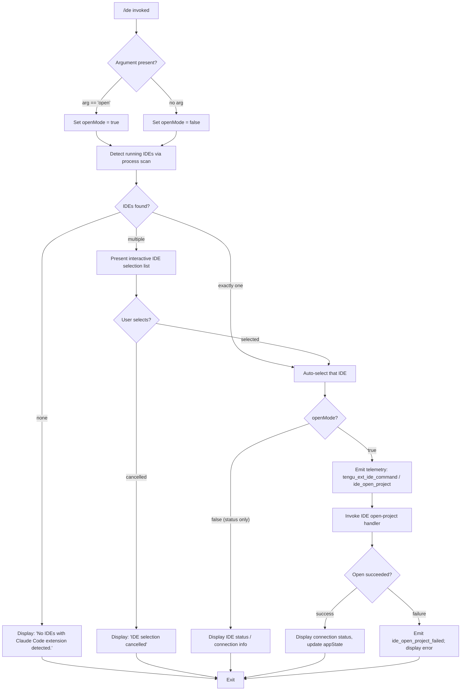

# `/ide`

> Analysis basis: CC v2.1.195 bundle.js (AST extraction + Claude interpretation)
> Minimum version: v2.1.195

---

## Overview

The `/ide` command manages IDE integrations for Claude Code, allowing users to view the status of connected IDEs, select an active IDE, and optionally open a project in the chosen editor. It operates by detecting running IDE processes that have the Claude Code extension installed, presenting an interactive selection UI when multiple IDEs are available, and then optionally invoking the IDE's open-project capability.

---

## Registration

| Field | Value |
|---|---|
| type | `local-jsx` |
| name | `ide` |
| description | `Manage IDE integrations and show status` |
| argumentHint | `[open]` |
| module_id | `dFl` |
| load_inline | `true` |
| loc_byte | `11871405` |
| loc_byte_end | `11871561` |
| loc_line | `7532` |
| arbor_handler.name | `uNf` |
| arbor_handler.fqn | `claude-2.1.195::uNf` |
| arbor_handler.kind | `AsyncFunction` |
| arbor_handler.resolution_path | `module_id` |
| arbor_handler.n_hits | `0` |

Analysis basis: CC v2.1.195 bundle.js:+11871405

---

## Input Branching

Five or more distinct behavioral branches exist depending on the presence of the `open` argument, the number of detected IDEs, user selection, and connection outcome. A Mermaid flowchart is used.



Analysis basis: CC v2.1.195 bundle.js:+11867600 (handler entry `uNf`), +11867708 (`"open"` literal), +11867817 (no-IDE message), +11867937 (no-selection message), +11868135 (`ide_open_project` telemetry string)

---

## Behavioral Spec

### 1. Handler Entry and Telemetry Initialization

The primary handler (`uNf`, an `AsyncFunction`) fires first on any `/ide` invocation and immediately emits the `tengu_ext_ide_command` telemetry event. It then inspects the first argument token against the literal `"open"` to set the operation mode.

```
async function ideCommandHandler(args, toolContext):
    emit(telemetry.tengu_ext_ide_command)
    openMode = (args[0] == "open")
    ideList = await detectRunningIDEs()
    if ideList is empty:
        render("No IDEs with Claude Code extension detected.")
        return
    selectedIDE = await selectIDE(ideList)
    if selectedIDE is null:
        render("No IDE selected.")   // covers cancellation path
        return
    if openMode:
        await openProjectInIDE(selectedIDE, toolContext)
    else:
        renderIDEStatus(selectedIDE)
```

Analysis basis: CC v2.1.195 bundle.js:+11867600, +11867708, +11867815, +11867877

---

### 2. IDE Detection (`ideDetectHandler` — `_2n`)

The detection routine scans the host system for running IDE processes. It normalizes the detected process names and filters them against a known set of IDE identifiers.

Recognized IDE keywords include (from literals):
- `"windsurf"` (bundle.js:+6841067)
- `"devin"` (bundle.js:+6841091)
- `"cursor"` (bundle.js:+6841131)
- `"insiders"` (bundle.js:+6841171)
- `"vscode"` / `"vs code"` / `"visual studio code"` (bundle.js:+6841196, +6841218, +6841241)
- `"vscodium"` / `"code - oss"` / `"codium"` (bundle.js:+6841275, +6841299, +6841518)
- JetBrains family detected via `"jetbrains"` prefix and a `ps aux` grep pattern (bundle.js:+6834381, +6842967)
- `"Devin Desktop"` as a display name (bundle.js:+6841387)
- `"IDE"` as generic fallback label (bundle.js:+6843806)

On Linux the detection uses a `ps aux | grep -E "code|cursor|windsurf|devin-desktop|idea|pycharm|webstorm|phpstorm|rubymine|clion|goland|rider|datagrip|dataspell|aqua|gateway|fleet|android-studio" | grep -v grep` shell invocation (bundle.js:+6842967). On macOS a different system API path is taken. Windows paths normalize paths through a `"windows"` platform check (bundle.js:+1098380) and handle `.cmd` suffixes (bundle.js:+6841650).

Telemetry is emitted on both success (`"ide_detect"`, bundle.js:+6839556) and failure (`"ide_detect_failed"`, bundle.js:+6839620).

```
async function detectRunningIDEs():
    platform = getPlatform()
    rawProcessList = await scanProcesses(platform)
    normalized = rawProcessList.map(entry => normalizeIDEEntry(entry))
    detected = normalized.filter(entry => matchesKnownIDE(entry))
    if detected is empty:
        emit(telemetry.ide_detect_failed)
    else:
        emit(telemetry.ide_detect)
    return detected
```

Analysis basis: CC v2.1.195 bundle.js:+6838201 (`_2n` entry), +6839556, +6839620

---

### 3. IDE Name Normalization (`ideNameNormalizer` — `yx`)

This helper converts raw process executable names into canonical IDE labels. It lowercases the input, strips path prefixes using `yO.basename`, and then maps the result to a display name.

```
function normalizeIDEName(rawName):
    lower = rawName.toLowerCase()
    base  = path.basename(lower)
    label = mapToDisplayName(base)   // e.g. "code" -> "VS Code", "cursor" -> "Cursor"
    return label
```

Analysis basis: CC v2.1.195 bundle.js:+6843861, +6843919

---

### 4. IDE Type Classification (`ideTypeClassifier` — `TLa`)

Classifies a candidate string as a known IDE type by lowercasing it and checking membership in a set of known type tokens.

```
function classifyIDEType(name):
    lower = name.toLowerCase()
    if lower includes known token:
        return matchedType
    return "unknown"
```

Analysis basis: CC v2.1.195 bundle.js:+6841037, +6841056

---

### 5. IDE Socket Path Construction (`socketPathBuilder` — `bCp`)

Builds the file-system path to the IDE's Unix socket or named-pipe endpoint. On macOS it consults `os.homedir()` and appends `.claude/ide` under the user home directory. On WSL it checks under `/mnt/c/Users` (bundle.js:+6836207) while excluding system accounts `"Public"`, `"Default"`, `"Default User"`, and `"All Users"` (bundle.js:+6836301, +6836320, +6836340, +6836365). The path is normalized to NFC Unicode form.

Errors with codes `ENOENT`, `EACCES`, `EPERM`, `ENOTDIR`, `ELOOP`, `ENAMETOOLONG`, `EROFS` are handled gracefully (bundle.js:+184555–184644).

```
async function buildSocketPath(ideEntry):
    home = os.homedir()
    base = path.join(home, ".claude", "ide")   // bundle.js:+6836000
    if platform == "wsl":
        base = resolveWslPath()
    resolvedPath = fs.realpath(base)
    return resolvedPath
```

Analysis basis: CC v2.1.195 bundle.js:+6834670, +6835909, +6836000, +6836207

---

### 6. IDE Connection (`ideConnector` — `h` / `PZo`)

Establishes a Unix-domain socket connection to the selected IDE's Claude Code extension endpoint. It sends a claim frame within a 5000 ms timeout (bundle.js:+17878653). On `ECONNREFUSED` (bundle.js:+17878801) the connection is considered unavailable. On timeout a `"send-claim timeout"` error is raised (bundle.js:+17878709).

Connection states emitted through the UI and telemetry:
- `"pending"` (bundle.js:+11869588)
- `"connected"` (bundle.js:+11869617) → emits `ide_connect` (bundle.js:+11869632)
- `"ide_connect_failed"` (bundle.js:+11869719)
- `"ide_connect_timeout"` (bundle.js:+11869826) → renders `"Error connecting to IDE."` (bundle.js:+11869944)
- `"ide_disconnect"` (bundle.js:+11870325)

The claim frame is a binary buffer built with `Buffer.allocUnsafe`, a `writeUInt32BE` length prefix (4 bytes, bundle.js:+11469795), and a `writeUInt8` type byte, then copied into a final buffer for sending (bundle.js:+11469750, +11469778, +11469798).

```
async function connectToIDE(socketPath, claimToken):
    socket = net.connect(socketPath)
    claimFrame = buildClaimFrame(claimToken)
    writeWithTimeout(socket, claimFrame, timeoutMs=5000)
    outcome = await Promise.race([connectionEvent, timeoutPromise])
    if outcome == "connected":
        emit(telemetry.ide_connect)
        return ConnectionHandle
    else if outcome == "timeout":
        raise Error("send-claim timeout")
    else:
        emit(telemetry.ide_connect_failed)
        raise ConnectionError
```

Analysis basis: CC v2.1.195 bundle.js:+17878018, +17878366, +17878640, +17878653, +17878709, +17878801, +11869632, +11869719

---

### 7. Open Project Flow (`openProjectHandler` — called from `uNf`)

When `openMode` is `true`, after a successful connection the handler invokes `t.onInstallIDEExtension` (bundle.js:+11868709) and calls into the IDE-specific open-project routine. Telemetry `ide_open_project` is emitted on success (bundle.js:+11868135); `ide_open_project_failed` on failure (bundle.js:+11868242). The context includes whether the path is a `"worktree"` or plain `"project"` (bundle.js:+11868169, +11868180).

On failure the UI displays `"Exited without opening IDE"` (bundle.js:+11868532).

If the extension is not yet installed a hint to `"restart your IDE"` is shown (bundle.js:+11868801).

```
async function openProjectInIDE(ideHandle, context):
    emit(telemetry.ide_open_project)
    pathKind = isWorktree(context.cwd) ? "worktree" : "project"
    result = await ideHandle.openProject(context.cwd, pathKind)
    if result.success:
        updateConnectionStatus(ideHandle)
    else:
        emit(telemetry.ide_open_project_failed)
        render("Exited without opening IDE")
        if extensionMissing:
            render("restart your IDE")
```

Analysis basis: CC v2.1.195 bundle.js:+11868135, +11868169, +11868242, +11868532, +11868709, +11868801

---

### 8. MCP IDE Tool Name Prefix

IDE-related MCP tool names registered during an active IDE connection carry the prefix `"mcp__ide__"` (bundle.js:+11870222). The connection transport is either SSE (`"sse-ide"`, bundle.js:+11865641) or WebSocket (`"ws-ide"`, bundle.js:+11865661). WebSocket connection strings are detected by the `"ws:"` prefix (bundle.js:+11870442). Dynamic MCP registration is labelled `"dynamic"` (bundle.js:+11870559).

---

### 9. Display Formatting (`displayTruncator` — `a$o`)

When rendering a list of connected IDE paths for status display, the list is truncated to 100 items maximum (bundle.js:+11870847) starting from offset 0 (bundle.js:+11870866). Items beyond a count threshold are shown with a `", …"` ellipsis suffix (bundle.js:+11871159). Multiple items are joined with `", "` (bundle.js:+11871145). Path strings are Unicode-normalized to NFC (bundle.js:+11870988) before display. The truncation arithmetic uses `Math.floor` (bundle.js:+11870951).

```
function formatIDEList(items):
    truncated = items.slice(0, 100)
    normalized = truncated.map(p => p.normalize("NFC"))
    if items.length > truncated.length:
        return normalized.join(", ") + ", …"
    return normalized.join(", ")
```

Analysis basis: CC v2.1.195 bundle.js:+11870847, +11870866, +11870988, +11871145, +11871159

---

## State & Side Effects

| Item | Detail |
|---|---|
| Telemetry: `tengu_ext_ide_command` | Fired on every `/ide` invocation (bundle.js:+11867602) |
| Telemetry: `tengu_feature_ok` | Fired when a feature check passes (bundle.js:+1027363) |
| Telemetry: `tengu_feature_bad` | Fired when a feature check fails (bundle.js:+1027430) |
| Telemetry: `tengu_feature_sad` | Fired on a sad-path feature outcome (bundle.js:+1027511) |
| Telemetry: `tengu_daemon_control` | Fired during daemon lifecycle operations triggered by IDE commands (bundle.js:+17924594) |
| Telemetry: `tengu_bg_spare_claim` | Fired when a spare background worker is claimed (bundle.js:+17886514) |
| Telemetry: `tengu_bg_spare_claim_fail` | Fired when spare worker claim fails (bundle.js:+17886780) |
| Telemetry: `tengu_bg_sendclaim_failed` | Fired when sending the background claim frame fails (bundle.js:+17878219) |
| Telemetry: `tengu_mcp_skills` | Fired during MCP skill registration for the IDE connection (bundle.js:+6800612) |
| Telemetry: `ide_detect` / `ide_detect_failed` | Fired on IDE detection success/failure (literals, bundle.js:+6839556, +6839620) |
| Telemetry: `ide_open_project` / `ide_open_project_failed` | Fired on project-open success/failure (literals, bundle.js:+11868135, +11868242) |
| Telemetry: `ide_connect` / `ide_connect_failed` / `ide_connect_timeout` / `ide_disconnect` | Fired on connection state transitions (literals, bundle.js:+11869632, +11869719, +11869826, +11870325) |
| MCP tool registration | IDE MCP tools registered under `"mcp__ide__"` prefix via dynamic module `dFl` (bundle.js:+11870222) |
| Socket connection | Unix-domain socket or named-pipe created and held for IDE communication lifetime |
| appState changes | Connection state (`"pending"`, `"connected"`, `"ide_disconnect"`) reflected in app state via `useSyncExternalStore` hook (bundle.js:+11869415) |
| File I/O | Reads `.claude` directory and socket lock files; resolves real paths via `fs.realpath` (bundle.js:+6836662) |
| Process scan | Spawns `sh -c <ps grep pipeline>` on Linux to enumerate IDE processes (bundle.js:+6842967) |
| Sound | None observed in traversal |

---

## Version History

| Version | Change |
|---|---|
| v2.1.195 | Initial analysis — IDE detection, connection, open-project, MCP tool registration |

---

## Common Mistakes

1. **Invoking `/ide open` before an IDE with the Claude Code extension is running.** Detection returns an empty list and the command exits immediately with `"No IDEs with Claude Code extension detected."` — start the IDE and install the extension first.
2. **Cancelling the selection prompt.** When multiple IDEs are detected and the user dismisses the picker, the command exits with `"No IDE selected."` and performs no connection or open action.
3. **Expecting instant project open after extension install.** The extension requires an IDE restart to register its socket endpoint; the UI hint `"restart your IDE"` is shown when the extension is present but not yet active.
4. **Mixing SSE and WebSocket transports.** The command auto-detects transport from the connection string (`"ws:"` prefix = WebSocket, otherwise SSE). Manually supplying a mismatched URL results in a connection failure.
5. **WSL path confusion.** On WSL the socket path is resolved under `/mnt/c/Users/<username>/.claude/ide`; system-account folders (`Public`, `Default`, `Default User`, `All Users`) are explicitly excluded and will not be matched.

---

## Appendix — Identifier Mapping

> For bundle debugging only. Identifiers change across versions.

| Identifier | Role |
|---|---|
| `uNf` | Primary async handler for `/ide` (Arbor-resolved, `module_id` path) |
| `a$o` | IDE list display formatter / truncator |
| `_2n` | IDE detection orchestrator |
| `h2n` | IDE socket file enumerator |
| `bCp` | Socket path builder (home-dir + `.claude/ide` logic) |
| `SCp` | Per-IDE status collector |
| `QBr` | Shell command runner for process scanning |
| `Wr` | Shell process execution wrapper |
| `nVi` | IDE name pattern matcher (regex) |
| `TLa` | IDE type classifier (lowercase + includes check) |
| `y2n` | IDE display-name resolver |
| `yx` | IDE name normalizer (basename + lowercasing) |
| `yi` | String index/slice utility |
| `RCp` | IDE process list parser (entries + includes checks) |
| `Qdo` | IDE selection list builder |
| `Zv` | Process-info value extractor |
| `B2e` | Shell execution core |
| `Mn` | IDE metadata aggregator (Wr + Ot) |
| `h` | IDE connection manager / daemon session handler |
| `PZo` | IDE socket claim sender |
| `JNm` | Claim timeout watchdog |
| `YNm` | Claim frame builder dispatcher |
| `Gk` | Binary frame encoder (Buffer write helpers) |
| `FZo` | IDE daemon worker lifecycle manager |
| `Ki` | Daemon worker state-file reader/writer |
| `G0e` | Daemon state filter / categorizer |
| `zd` | Daemon state-directory path helper |
| `CSt` | Daemon connection state tracker |
| `qYt` | Daemon roster path helper |
| `Rbe` | Daemon roster entry builder |
| `Vk` | Daemon pool manager (PUl) |
| `pR` | Daemon state-file path resolver |
| `PD` | Daemon pool secondary manager |
| `eZ` | Daemon state log splitter |
| `VYt` | Daemon roster path builder |
| `Z` | Worker lifecycle controller (retire/respawn) |
| `Hse` | Worker state-file reader |
| `AUl` | Worker state-file unlinker |
| `q5e` | Pins file reader |
| `qFt` | Pins file path builder |
| `Tzd` | Pins directory scanner |
| `Cn` | POSIX error code classifier |
| `qo` | Filesystem error handler |
| `xe` | Logging / error recorder |
| `BMu` | Log buffer shift/push manager |
| `Zr` | Error string converter |
| `ut` | String coercion utility |
| `qi` | Queue traffic classifier (`essential-traffic`) |
| `Ot` | Feature flag checker |
| `Rpn` | Feature store getter |
| `Hr` | Feature flag value resolver |
| `u0` | Feature flag boolean extractor |
| `SF` | MCP session factory |
| `p6` | MCP session initializer |
| `GKr` | MCP session event emitter |
| `y4e` | MCP session registry updater |
| `Le` | Process/feature OK path handler |
| `ke` | Process/feature bad path handler |
| `wt` | Feature sad path handler |
| `Oe` | Feature event dispatcher (OJe) |
| `W` | Telemetry event emitter |
| `yj` | Daemon graceful-shutdown orchestrator |
| `T_e` | MCP shutdown trigger |
| `k_e` | Timeout clear + notification (Wjo) |
| `Un` | Abort/timeout promise factory |
| `p` | Path normalizer with process.exit guard |
| `YT` | Forced-shutdown handler |
| `u` | Daemon abort controller |
| `SLa` | Process signal sender (process.kill) |
| `ILa` | Path replacement helper |
| `kLa` | IDE command argument validator |
| `H` | Kill-all-workers helper |
| `O` | Worker kill dispatcher |
| `yar` | macOS memory monitor |
| `at` | Background memory/pin checker |
| `Hte` | Memory threshold evaluator |
| `l` | Daemon log writer |
| `LZl` | Log flush handler |
| `Vs` | Log rotation helper |
| `WXt` | Log write-buffer helper |
| `g` | Daemon I/O forwarder |
| `K` | Permission/allow checker |
| `Y` | Allow-rule evaluator |
| `D` | Daemon write forwarder |
| `P` | Worker-pool sweep scheduler |
| `Ear` | Pool sweep event emitter |
| `Nn` | Pool sweep notifier |
| `oEe` | Scheduled-task path helper |
| `I` | Input event handler (scroll/resize) |
| `k` | ScheduledTasks loop manager |
| `$7o` | Task execution runner |
| `Wtn` | Task cleanup runner |
| `uFl` | JSX UI component for `/ide` status panel |
| `bt` | App-state hook (useState wrapper) |
| `bo` | Secondary app-state hook |
| `eQr` | App-state context accessor |
| `Dd` | Input/display context hook |
| `m` | Filtered message-list memo |
| `thr` | Message string normalizer |
| `k` | ScheduledTasks interval manager (duplicate short name) |
| `AT` | MCP tool-state cleanup handler |
| `wWe` | MCP tool hash updater |
| `aMe` | MCP tool hashing utility |
| `Me` | JSON.stringify wrapper |
| `_x` | MCP tool background registrar |
| `c` | IDE connection status yield helper |
| `yn` | Yield/suspend helper |
| `Dre` | IDE extension install handler |
| `oNf` | IDE option builder for selection list |
| `Gm` | IDE selection prompt renderer |
| `g2n` | IDE status label generator |
| `f2` | Output formatter helper |
| `V` | Process kill timer |
| `d` | Daemon stdio writer |
| `e8o` | Daemon config file writer |
| `Ld` | Logging dispatch helper |
| `ye` | String coercion (String()) |
| `T` | Log-level / color formatter |
| `qt` | Filesystem stat wrapper |
| `Vt` | Verbose/trace logger |
| `on` | Error code matcher |
| `Bt` | JSON.parse wrapper |
| `Mn` | Metadata aggregator (also maps to above) |
| `nzi` | Daemon state-file JSON validator |
| `Szd` | State directory scanner |

---

Note: index built via Arbor fallback; some signals (telemetry, literals) may be missing — see arbor-fallback.js.