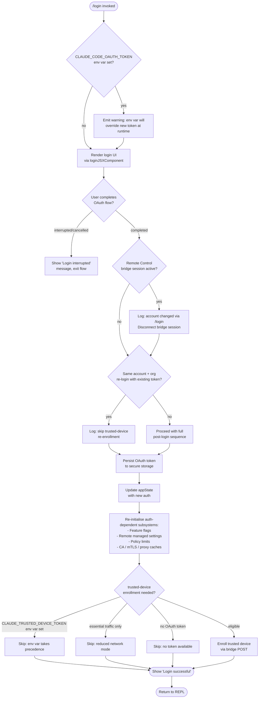

# `/login`

> Analysis basis: CC v2.1.195 bundle.js (AST extraction + Claude interpretation)
> Minimum version: v2.1.195

---

## Overview

The `/login` command allows a user to switch between Anthropic accounts or sign in fresh with an Anthropic account. It launches an interactive OAuth flow inside the CLI, persists new credentials to secure storage, and then re-initialises all auth-dependent subsystems (remote settings, policy limits, feature flags, trusted-device enrollment) before returning the user to the main REPL.

---

## Registration

| Field | Value |
|---|---|
| type | `local-jsx` |
| name | `login` |
| description | `Switch Anthropic accounts \| Sign in with your Anthropic account` |
| module_id | `Isl` |
| load_inline | `true` |
| loc_byte | `11913346` |
| loc_byte_end | `11913566` |
| loc_line | `8016` |
| arbor_handler.name | `DFl` |
| arbor_handler.fqn | `claude-2.1.195::DFl` |
| arbor_handler.kind | `Function` |
| arbor_handler.resolution_path | `direct` |
| arbor_handler.n_hits | `2` |

The registration block spans bytes `(11913346, 11913566)` and is defined on source line 8016. The Arbor resolver found the handler (`DFl`) directly inside the registration byte range — no module-id indirection was needed.

Analysis basis: CC v2.1.195 bundle.js:+11913346

---

## Input Branching

The command has more than three distinct execution paths depending on the state of: existing API-key/env-var credentials, the current app-state (remote bridge active, same-account re-login, trusted-device enrollment), and the outcome of the OAuth exchange. A Mermaid flowchart is therefore used.



Analysis basis: CC v2.1.195 bundle.js:+9196570, +9197293, +9197554, +9197657, +9198607, +9198626

---

## Behavioral Spec

### 1. Top-level handler (`loginHandlerComponent` / `Crf`)

The Arbor-resolved handler for the registration is `DFl`; the call-graph entry point into the implementation is `Crf`, which renders the React-JSX login UI. These are consistent — `DFl` wraps `Crf` as its React component factory.

```
function loginHandlerComponent(props):
    state = loadAppState()
    [loginDone, setLoginDone] = useState(false)
    keyboardHandler = registerKeyboardHandler()        // Or / Or → s.registerHandler

    if loginDone:
        return renderLoginResult()

    return renderLoginFlow(props, onDone=handleLoginComplete)
```

Analysis basis: CC v2.1.195 bundle.js:+9198526, +9198648, +9198868

### 2. API-key change callback (`apiKeyChangeHandler` / `UPe`)

`UPe` is the main state-machine function called when the user's API key is committed or when the OAuth flow delivers a new token. It is the dominant node in the call graph.

```
function apiKeyChangeHandler(context):
    applyMessageOp(context)                           // UPe → e.applyMessageOp

    // Determine timestamp / sequence
    timestamp = getTimestamp()                        // UPe → lXe → Date.now

    // Identify API provider type
    provider = resolveProvider(context)               // UPe → fr → {gateway, bedrock, foundry,
                                                      //   anthropicAws, mantle, vertex, firstParty}

    // Load/refresh remote managed settings
    refreshRemoteSettings(context)                    // UPe → _je

    // Rebuild global config
    newConfig = rebuildGlobalConfig(context)          // UPe → r4
    Object.assign(globalConfig, newConfig)

    // Clear caches invalidated by auth change
    clearCACertCache()                                // Dvs → T → "Cleared CA certificates cache"
    clearMTLSCache()                                  // $vs → T → "Cleared mTLS configuration cache"
    clearProxyAgentCache()                            // V1r → T → "Cleared proxy agent cache"

    // Re-initialise feature flags
    refreshFeatureFlags(context)                      // UPe → IKn → Ixn → e.refreshFeatures

    // Check for active remote-control bridge
    if appState.bridgeSessionActive:
        log("[bridge:repl] Account changed via /login — disconnecting Remote Control session")
        disconnectBridge()                            // loc_byte: 9197295

    appState = context.getAppState()
    context.setAppState(newAppState)                  // UPe → e.setAppState

    // Trusted-device re-enrollment guard
    if isSameAccountReloginWithExistingToken():
        log("[trusted-device] Same account+org re-login with existing token, skipping re-enrollment")
        // loc_byte: 9197562
    else:
        enrollTrustedDevice(context)                  // UPe → H6t

    // Policy limits refresh
    refreshPolicyLimits(context)                      // UPe → CVt

    // Feature-settings update
    updateFeatureSettings(context)                    // UPe → AVt, bVt

    // Trigger process relaunch if required
    if shouldRelaunch:
        context.execRelaunch()                        // UPe → f.execRelaunch

    // Credential persistence
    persistCredentials(context)                       // UPe → xe, Zr

    // Feature-flag client cleanup on old account
    tearDownFeatureFlagClient()                       // UPe → cce
```

Analysis basis: CC v2.1.195 bundle.js:+9196570, +9196589, +9196705, +9196711, +9196739, +9196823, +9196845, +9196874, +9196943, +9196958, +9197001, +9197007, +9197040, +9197210, +9197293, +9197383, +9197515, +9197554, +9197657, +9197669, +9197705, +9197740, +9197744, +9197778, +9197784

### 3. Remote managed settings refresh (`remoteSettingsRefresh` / `_je`)

```
function remoteSettingsRefresh(context):
    // Load policy settings key
    policySettingsKey = "policySettings"               // loc_byte: 7438699

    // Fire and await managed-settings fetch
    fetchResult = fetchManagedSettings(context)        // _je → Zho → CUa → vUa

    // Handle fetch result branches
    switch fetchResult.status:
        case 200:
            // Validate and apply
            applyNewSettings(fetchResult.body)
            log("Remote settings: Applied new settings successfully")
        case 204, 304:
            log("Remote settings: Using cached settings (304)")
        case 404:
            log("Remote settings: Saved empty sentinel (404 response)")
        case 401:
            log("Not authorized for remote settings")
            emitTelemetry("tengu_remote_settings_401_force_refresh_retry")
        case >= 500:
            log("Remote settings: Using stale cache after fetch failure")
        default:
            emitTelemetry("remote_managed_settings_unexpected")

    // Notify subscribers of change
    notifySettingsChange(context)                      // _je → N9n → sO.notifyChange

    // Schedule background polling
    schedulePoll(context)                              // _je → xUa → Oxn (setInterval/clearInterval)
```

Analysis basis: CC v2.1.195 bundle.js:+7438463, +7438469, +7438493, +7438505, +7438514, +7438556, +7438571, +7438580, +7438631, +7438637

### 4. Managed-settings security check dialog (`securityCheckHandler` / `nHo`)

```
function securityCheckHandler(context, newSettings):
    // Compute hash of incoming settings
    hash = createHash("sha256", stringify(newSettings))   // E9n → FNa.createHash, loc_byte: 7409024

    // Check if user approval is needed
    if noCheckNeeded(hash):
        return "no_check_needed"                          // loc_byte: 7430703

    if alreadyApproved(hash):
        return "approved"                                 // loc_byte: 7430469

    // Show security dialog to user
    emitTelemetry("tengu_managed_settings_security_dialog_shown")
    response = await showSecurityDialog()

    if response == "approved":
        emitTelemetry("tengu_managed_settings_security_dialog_accepted")
        storeApproval(hash)
    else:
        emitTelemetry("tengu_managed_settings_security_dialog_rejected")
        log("Remote settings: User rejected new settings, using cached settings")
        return "rejected"

    // Write approved settings to disk (atomic)
    fd = openFile(settingsPath, flags=384)               // IUa → wft.open, loc_byte: 7436317
    writeFile(fd, JSON.stringify(newSettings), "utf-8")  // loc_byte: 7436367
    datasync(fd)
    close(fd)

    // Clear stale caches
    clearKonCache()                                      // n_ → Kon.clear, QHr.clear
```

Analysis basis: CC v2.1.195 bundle.js:+7436692, +7436743, +7436914, +7436944, +7437127, +7437302, +7437451, +7437475, +7437488, +7437625

### 5. Trusted-device enrollment (`trustedDeviceEnroll` / `H6t`)

```
function trustedDeviceEnroll(context):
    // Skip conditions (checked in order)
    if env.CLAUDE_TRUSTED_DEVICE_TOKEN:
        log("[trusted-device] CLAUDE_TRUSTED_DEVICE_TOKEN env var is set, skipping enrollment")
        return                                           // loc_byte: 7381620

    if essentialTrafficOnly:
        log("[trusted-device] Essential traffic only, skipping enrollment")
        return                                           // loc_byte: 7381934

    if not oauthToken:
        log("[trusted-device] No OAuth token, skipping enrollment")
        return                                           // loc_byte: 7382047

    // Enroll
    response = await HTTP.POST(enrollmentEndpoint, {
        headers: {
            "Content-Type": "application/json",
            timeout: 10000                               // loc_byte: 7382341
        },
        body: deviceInfo
    })

    emitTelemetry("bridge_trusted_device_enroll")        // loc_byte: 7382443

    if response.status == 201:                           // loc_byte: 7382529
        deviceToken = response.body.device_token
        if not deviceToken:
            log("[trusted-device] Enrollment response missing device_token field")
            // emit "missing_token"
            return
        persistDeviceToken(deviceToken)                  // Cl → Gsi
    else:
        // emit "http_error" or "storage_failed"
```

Analysis basis: CC v2.1.195 bundle.js:+7381797, +7381820, +7381926, +7382116, +7382148, +7382220, +7382341, +7382443, +7382529

### 6. Policy limits refresh (`policyLimitsRefresh` / `CVt`)

```
function policyLimitsRefresh(context):
    // Unlink stale token file if present
    unlinkTokenFile()                                    // CVt → z7e.unlink

    // Determine auth type for fetch
    authPath = resolveAuthPath()                         // CVt → TF → HUt → {wif, oauth, api_key}

    // Fetch from server
    fetchResult = fetchPolicyLimits(context)             // CVt → Tcr → Vcc

    switch fetchResult.status:
        case "succeeded":
            log("Policy limits: Applied new restrictions successfully")
            emitTelemetry("tengu_policy_limits_fetch")
        case "failed":
            log("Policy limits: Using stale cache after fetch failure")
        case "in_flight":
            // Already loading
        case "stale_cache_used":
            log("Policy limits: Using stale cache after error")

    // Schedule background poll
    startPoll(context)                                   // CVt → Tcr → qcc → Oxn
```

Analysis basis: CC v2.1.195 bundle.js:+14049986, +14049992, +14049999, +14050021, +14050032, +14050052, +14050058

### 7. Login UI React component (`loginUIComponent` / `$Pe`)

```
function loginUIComponent(props):
    [state, setState] = Tsl.useState(initialState)       // loc_byte: 9198720
    memoCache = Symbol.for("react.memo_cache_sentinel")  // loc_byte: 9198749

    keyHandler = registerKeyboardEscapeHandler()         // Or → s.registerHandler
    // "confirm:no" action registered                    // loc_byte: 9199027

    if state == "authentication_failed":                 // loc_byte: 9198050
        renderError("authentication_failed")

    if env.CLAUDE_CODE_OAUTH_TOKEN:
        renderWarning(
            "Warning: CLAUDE_CODE_OAUTH_TOKEN is set in your environment..."
        )                                                // loc_byte: 9198187

    // Render the 21-column wide login box
    width = 21                                           // loc_byte: 9198696
    renderBox(
        title="Login",                                   // loc_byte: 9199705
        children=[
            renderOAuthFlow(ig),
            renderActionHint("Press Esc to cancel"),
            renderFooter("continue" | "cancel")
        ]
    )

    onDone = (result) =>
        if result == "success":
            setState("Login successful")                 // loc_byte: 9198607
        else:
            setState("Login interrupted")               // loc_byte: 9198626
        props.onDone()
```

Analysis basis: CC v2.1.195 bundle.js:+9198690, +9198709, +9198720, +9198749, +9198795, +9198868, +9199024, +9199051, +9199118, +9199179

### 8. Feature-flag client teardown on account change (`featureFlagTeardown` / `cce`)

```
function featureFlagTeardown():
    emitEvent(Rst, "exit")                              // cce → Rst.emit, loc_byte: 3356867
    teardownFeatureClient(f6)                           // cce → f6
    removeListeners(kst)                                // cce → kst → process.off
    clearAllCaches():
        hxe.clear()
        Axn.clear()
        iUt.clear()
        VKr.clear()
        rV.clear()
    logErrors(xe, Zr)
```

Analysis basis: CC v2.1.195 bundle.js:+9197001, +3356845, +3356861, +3356867, +3356882, +3356899

---

## State & Side Effects

| Item | Detail |
|---|---|
| Telemetry — `tengu_remote_settings_401_force_refresh_retry` | Fired when the remote settings server returns HTTP 401 during post-login refresh (bundle.js:+7435771) |
| Telemetry — `tengu_managed_settings_security_dialog_shown` | Fired when the consent dialog is shown to the user for new managed settings (bundle.js:+7430796) |
| Telemetry — `tengu_managed_settings_security_dialog_accepted` | Fired when user accepts the managed-settings security dialog (bundle.js:+7430480) |
| Telemetry — `tengu_managed_settings_security_dialog_rejected` | Fired when user rejects the managed-settings security dialog (bundle.js:+7430530) |
| Telemetry — `tengu_config_auth_loss_prevented` | Fired when `saveGlobalConfig` detects re-read config is missing auth that the cache holds — write is refused (bundle.js:+14066165) |
| Telemetry — `tengu_policy_limits_fetch` | Fired after a successful policy-limits fetch during post-login re-init (bundle.js:+14048105) |
| Telemetry — `tengu_policy_limits_cache_write_failed` | Fired when writing the policy-limits cache to disk fails (bundle.js:+14047508) |
| Telemetry — `tengu_feature_ok` / `tengu_feature_bad` / `tengu_feature_sad` | Feature-flag health events fired during feature-flag re-init (bundle.js:+1027363, +1027430, +1027511) |
| Telemetry — `tengu_disable_bypass_permissions_mode` | Fired if `bypassPermissions` mode is disallowed after auth change (bundle.js:+13929301) |
| Telemetry — `tengu_auto_mode_config` | Fired when the auto-mode availability is recalculated post-login (bundle.js:+13927092) |
| Telemetry — `tengu_daemon_config_reload` | Fired after the daemon re-reads its config following auth update (bundle.js:+17902328) |
| Telemetry — `tengu_keybinding_fallback_used` | Fired when a keyboard-binding fallback is triggered inside the login UI (bundle.js:+4274204) |
| Telemetry — `bridge_trusted_device_enroll` | Fired after the trusted-device enrollment HTTP call completes (bundle.js:+7382443) |
| Hook registration | `Or` (keyboard handler) registers an Escape key handler via `s.registerHandler` to allow the user to cancel the flow (bundle.js:+4221978) |
| appState changes | `e.setAppState` is called with the updated auth context after login completes (bundle.js:+9197383) |
| Credential persistence | OAuth token is written to secure storage via `Cl → Gsi`; plaintext fallback is used if primary storage fails (`plaintext_fallback_used` path, bundle.js:+2356467) |
| Remote Control bridge | If a bridge session is active, it is disconnected on account change (bundle.js:+9197293) |
| Cache invalidation | CA certificate cache, mTLS config cache, and proxy-agent cache are all cleared (bundle.js:+9194775, +9194781, +9194787) |
| Feature-flag client | Torn down and restarted on account change via `cce` / `kst` (bundle.js:+9197001) |
| Sound | None observed in traversal |

---

## Version History

| Version | Change |
|---|---|
| v2.1.195 | Initial analysis |

---

## Common Mistakes

1. **Leaving `CLAUDE_CODE_OAUTH_TOKEN` set after `/login`** — The command explicitly warns (bundle.js:+9198187) that the environment variable will override the newly stored token at runtime. Users must unset the variable for the new credentials to take effect.
2. **Expecting instant effect in bridged/Remote-Control sessions** — The bridge session is disconnected on account change (bundle.js:+9197295); any in-flight remote operations will be aborted.
3. **Assuming re-login of the same account is a no-op** — Even on same-account re-login, the full post-login subsystem re-initialisation runs; only the trusted-device re-enrollment step is skipped (bundle.js:+9197554).
4. **Running `/login` in essential-traffic-only mode** — Trusted-device enrollment is silently skipped (bundle.js:+7381934), which may affect remote-control capabilities.
5. **Interrupting the OAuth flow mid-way** — If the browser tab is closed or the user presses Escape before completion, the state machine lands in the "Login interrupted" terminal (bundle.js:+9198626) and no credentials are written; the previous session credentials remain unchanged.

---

## Appendix — Identifier Mapping

> For bundle debugging only. Identifiers change across versions.

| Identifier | Role |
|---|---|
| `UPe` | Main API-key-change / post-login state machine |
| `Crf` | Login handler React component (top-level JSX renderer) |
| `DFl` | Arbor-resolved handler function wrapping `Crf` |
| `lXe` | Timestamp helper (calls `Date.now`) |
| `fr` | Provider-type resolver |
| `Lm` | Locale/string utility |
| `ut` | String coercion utility |
| `_je` | Remote managed settings refresh orchestrator |
| `RUa` | Remote settings sub-utility |
| `hje` | Remote settings sub-utility (calls `UIs`) |
| `UIs` | Remote settings lower-level helper |
| `wX` | Managed settings fetch function |
| `Rhe` | Filesystem/path helper |
| `$ae` | Managed settings ETag/cache helper |
| `Q$e` | Managed settings response parser |
| `_u` | Settings notification helper |
| `OEn` | Settings change notifier |
| `jS` | Settings serialisation helper |
| `pNt` | Settings persistence helper |
| `TH` | Auth configuration builder |
| `md` | Config reader |
| `sk` | Config sub-reader (flag settings) |
| `sNt` | API-key-helper resolver |
| `oI` | Auth-none resolver |
| `dXe` | VS Code integration helper |
| `iDt` | File-descriptor key reader (`CLAUDE_CODE_API_KEY_FILE_DESCRIPTOR`) |
| `ab` | Auth profile builder (`profile-implicit`, `user_oauth`) |
| `Ql` | Gateway resolver |
| `Mt` | Telemetry/metrics emitter |
| `Q$` | Token slicer (first 20 chars) |
| `N9n` | Settings-change notifier (calls `sO.notifyChange`) |
| `$Is` | Settings identity helper |
| `xe` | Error-handling / async executor |
| `Zr` | Error stringifier |
| `qi` | Queue processor |
| `BMu` | Pending-request queue manager |
| `Zho` | Consent-dialog / settings-load gate |
| `CUa` | Remote settings consent sub-flow |
| `BNa` | Consent branch utility |
| `tHo` | Settings load branch (calls `wX`) |
| `Hje` | Consent resolution helper |
| `yUa` | Settings load timeout utility |
| `T` | General async/transport utility |
| `RYc` | HTTP transport wrapper |
| `Me` | JSON stringify helper |
| `Lc` | Log-redaction helper (replaces secrets with `[REDACTED]`) |
| `jXe` | Debug trace helper |
| `PYc` | File-write helper (uses `Buffer.byteLength`, 1000-byte chunk limit) |
| `nHo` | Security-check / settings-approval handler |
| `khe` | Cache-clear helper |
| `y1u` | Value extraction helper |
| `n_` | Cache-clear (Kon / QHr) |
| `E9n` | Settings hash computation (`sha256`) |
| `Mho` | Recursive object mapper |
| `SPp` | Remote settings polling scheduler |
| `yPp` | Poll interval helper |
| `vUa` | Managed settings HTTP fetch (User-Agent, Cache-Control, If-None-Match headers) |
| `LX` | Exponential back-off calculator (max 32000 ms, jitter 0.25) |
| `Un` | Abort/timeout wrapper |
| `ke` | Feature-flag evaluator |
| `W` | General event emitter |
| `Oe` | Event subscriber |
| `Iet` | Cache invalidation on enrollment |
| `Le` | Feature-flag loader |
| `je` | Feature-flag JS bridge |
| `OJe` | Core JS object helper |
| `TUa` | Settings validation helper |
| `Cve` | Config-field extractor |
| `EUa` | Settings approval + write orchestrator |
| `S9n` | Settings key enumerator |
| `Ift` | Settings field validator |
| `KNa` | Settings normaliser |
| `TL` | Telemetry logger for settings |
| `_Ua` | Settings approval branch |
| `fPp` | Pending-approval queue manager |
| `AV` | Atomic write helper |
| `o` | Generic map/pad utility |
| `s` | Set-lifecycle manager |
| `r` | Data-stream helper |
| `pU` | Poll utility |
| `SUa` | Settings post-apply handler |
| `$c` | MCP/channel context helper |
| `IUa` | Atomic file write (fd open → writeFile → datasync → close, 384 flags) |
| `kfn` | File-path joiner |
| `n` | File write helper |
| `LUa` | Timeout resolve helper |
| `xUa` | Background-poll scheduler (setInterval/clearInterval via `Oxn`) |
| `Oxn` | Interval manager |
| `bPp` | Poll execution body |
| `vi` | Hook/event registry (`krs.register`) |
| `AKn` | Deep-equality account check (`Bun.deepEquals`) |
| `Ryr` | Current-account reader |
| `Hn` | State hook orchestrator |
| `gmn` | Cache-backed state getter |
| `qns` | Cache map getter |
| `Tkr` | State subscriber |
| `Kns` | Cache map setter |
| `p3` | Multi-hook initialiser |
| `Hr` | Hook runner |
| `Cvt` | App state reader/writer |
| `byr` | State change subscriber |
| `bvt` | App-state reset helper |
| `Y$e` | Session hook |
| `J$e` | Settings hook |
| `wvt` | Feature-flag hook |
| `jae` | Model hook |
| `Rve` | Permission hook |
| `Amn` | Audit hook |
| `gvs` | Global config hook |
| `Jee` | Project config hook |
| `akt` | Platform hook (`wsl` / `windows`) |
| `f` | Process relaunch wrapper |
| `o8` | Path normaliser (handles `windows` path style) |
| `IKn` | Feature-flag re-initialiser |
| `asn` | Feature-flag sub-init |
| `Fte` | Feature-flag loader |
| `Hsl` | Feature-flag cache clearer (`lvo.clear`) |
| `jle` | Feature-flag JWT helper |
| `exe` | Feature-flag exchange helper |
| `gsl` | Feature-flag signing helper |
| `uvo` | Feature-flag key helper |
| `Ixn` | Feature-flag client reload (`e.refreshFeatures`) |
| `f6` | Feature-flag client factory |
| `p6` | Feature-flag lower-level client |
| `G1i` | Feature-flag payload applier |
| `W1i` | Feature-flag state exporter |
| `gn` | Feature-flag telemetry sender (`save_global`) |
| `r4` | Global config rebuild |
| `_sl` | Config field slicer |
| `l7` | Allowlist checker (`Y0u.has`) |
| `PHt` | Header policy inspector |
| `Srf` | Header allow-list |
| `Erf` | Header entry filter |
| `yrf` | Proxy/env-var header filter |
| `QKi` | Header case-normaliser |
| `ZKi` | Header deny-list checker |
| `brf` | BYOC header filter |
| `Hrf` | Header merge helper |
| `NC` | Allowlist set builder |
| `Qxn` | Config notify helper |
| `Dvs` | CA-cert cache clearer |
| `$vs` | mTLS cache clearer |
| `V1r` | Proxy-agent cache clearer |
| `_Mt` | Proxy/network config builder |
| `xM` | Proxy URL builder |
| `f9s` | Socket factory |
| `i` | Socket close helper |
| `p9s` | Socket error constructor |
| `_8` | HTTP/S URL parser |
| `F1r` | Proxy credential reader |
| `a` | Spend-limit response handler |
| `CVt` | Policy limits refresh orchestrator |
| `yjo` | Policy limits file-cleanup helper |
| `Sjo` | Policy limits file locator |
| `L_e` | Auth-type detector |
| `_oi` | Policy-limits event emitter |
| `Acr` | Policy limits fetch driver |
| `TF` | Auth-header builder |
| `HUt` | Auth-header assembler (calls `fr`, `_u`, `TH`, `ab`) |
| `Sxe` | Policy limits file path helper |
| `Tcr` | Policy limits polling controller |
| `Vcc` | Policy limits HTTP fetch + apply |
| `_Ut` | Policy limits file reader |
| `Wcc` | Policy limits freshness checker |
| `hUt` | Policy limits parse helper |
| `nsm` | Policy limits hash computer |
| `rsm` | Policy limits write helper |
| `osm` | Policy limits retry scheduler |
| `No` | Event emitter (OJe-based) |
| `cw` | Auth-type config builder |
| `wt` | Hook subscriber |
| `ism` | Policy limits atomic file writer |
| `qcc` | Policy limits poll body |
| `lsm` | Policy limits poll iteration |
| `rxe` | Cleanup helper |
| `cce` | Feature-flag client teardown |
| `kst` | Feature-flag listener removal |
| `QKr` | Interval/listener cleanup |
| `kc` | UI rendering helper |
| `eE` | Login result message renderer |
| `lNt` | Notification component |
| `jot` | Utility: config-read with fallback |
| `sFt` | Same-account-relogin detector |
| `rho` | Credential persistence initiator |
| `ro` | Secure storage write function |
| `ion` | Storage binder |
| `KMe` | Feature-flags-at-time-of-write helper |
| `at` | Feature-value fetcher |
| `lUt` | Feature-client getter |
| `cUt` | Feature-flag initialiser guard |
| `bxn` | Feature-flag cache populator |
| `Cl` | Secure storage orchestrator |
| `Gsi` | Secure storage read/write dispatcher |
| `p3e` | Async storage read helper |
| `H6t` | Trusted-device enrollment handler |
| `AF` | Feature-flag read at enrollment |
| `V1i` | Feature-flag value reader |
| `fDp` | Storage-state reader |
| `Qgo` | Gc storage reader |
| `Os` | URL/hostname builder |
| `$ms` | Prod URL constant |
| `zhu` | Environment URL helper |
| `Ppn` | Enrollment endpoint builder |
| `ye` | String coercion helper |
| `Esl` | Post-login cleanup helper |
| `AVt` | Permission-settings updater |
| `CKn` | Permission-mode loader |
| `XKr` | Permission-flag reader |
| `P6t` | Permission handler |
| `PH` | Permission rule processor |
| `Dp` | DNS utility |
| `Br` | Session-init parameter reader |
| `uZn` | Allowed-tools extractor |
| `Fo` | Session field extractor |
| `dZn` | Disallowed-tools extractor |
| `xF` | Go/disable permission helper |
| `fvo` | Post-login hook |
| `bVt` | Feature-settings batch updater |
| `TVt` | Auto-mode / model settings updater |
| `xY` | Auto-mode flag reader |
| `Txn` | Auto-mode feature resolver |
| `WWo` | Model preference writer |
| `GWo` | Permission go-mode setter |
| `As` | Model resolver |
| `q5` | Model tier resolver |
| `Ko` | Model name normaliser |
| `SH` | Model-selection helper |
| `c_e` | Model availability filter |
| `mo` | Application-inference-profile detector |
| `$ot` | Model string utility |
| `R1e` | Model policy enforcer |
| `D5` | Policy model extractor |
| `d` | Daemon config reload handler |
| `C7e` | File stat helper |
| `Vtc` | Config diff calculator |
| `E` | SDK session stopper |
| `A` | Remote-control bridge client |
| `EWc` | Heartbeat handler |
| `I` | Render/layout manager |
| `vZ` | Model tier logger |
| `GB` | Auto-mode gate event logger |
| `Iye` | Permission-mode-changed event emitter |
| `Xc` | Event dispatcher |
| `wTe` | Permission entry mapper |
| `UHt` | Auth-failure UI helper |
| `Nw` | Last-assistant-message finder |
| `$Pe` | Login UI React component (renders OAuth box, Escape handler) |
| `Rb` | App-state selector hook |
| `bt` | useSyncExternalStore hook wrapper |
| `eQr` | App state context reader |
| `ZVe` | State reducer + effect hook |
| `wY` | Store subscriber |
| `F1i` | Promise-resolve micro-task helper |
| `W_` | App-state hook alias |
| `EKn` | Model enforcement hook |
| `zE` | Enforcement-state resolver |
| `Ha` | String replacement/sanitiser |
| `Znt` | Enforcement null-check helper |
| `Joi` | Enforcement join helper |
| `iF` | Model-enforcement policy loader |
| `Yoi` | Per-source enforcement evaluator |
| `La` | Model allowlist compiler |
| `C0` | Common model check (`HHe.includes`) |
| `td` | Gateway resolver (via `fr`) |
| `mle` | Model-name includes check |
| `HAn` | Enforcement aggregator |
| `BC` | Bundled config reader |
| `VBr` | Profile config reader |
| `AAn` | Config parser / model-field normaliser |
| `SAn` | Config section parser |
| `YS` | Theme context reader |
| `Or` | Keyboard handler registrar |
| `zS` | Keyboard context reader |
| `ig` | OAuth flow renderer |
| `IKi` | OAuth UI inner component |
| `MZr` | OAuth state machine component |
| `e9` | OAuth step helper |
| `Fu` | OAuth cancel/abort handler |
| `X3` | Debounced input component |
| `p` | Force-exit helper (`process.exit`) |

---

Note: index built via Arbor fallback; some signals (telemetry, literals) may be missing — see arbor-fallback.js.