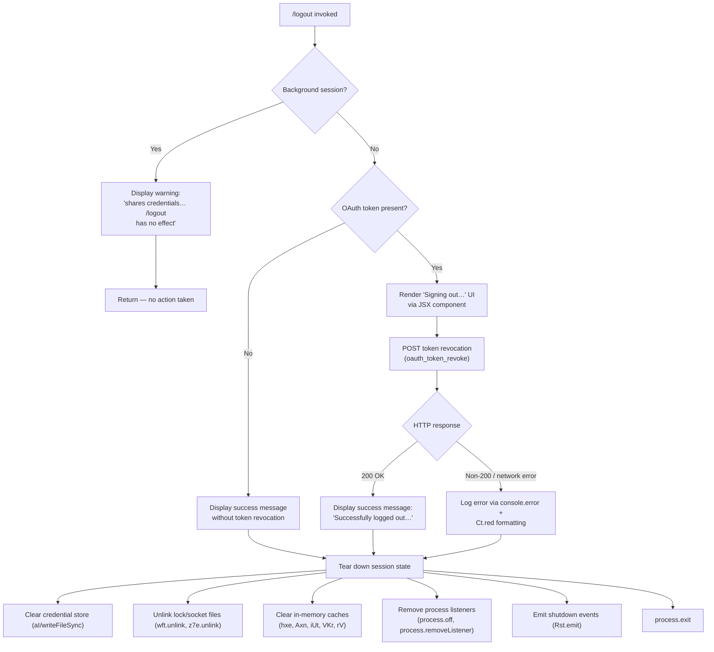

# `/logout`

> Analysis basis: CC v2.1.195 bundle.js (AST extraction + Claude interpretation)
> Minimum version: v2.1.195

---

## Overview

The `/logout` command signs the user out of their Anthropic account by revoking the current OAuth token, removing stored credentials, and tearing down all active session state. It is a `local-jsx` command that renders transient UI feedback before performing the sign-out sequence and, in standard (non-background) sessions, terminates the CLI process after completion.

---

## Registration

| Field | Value |
|---|---|
| type | `local-jsx` |
| name | `logout` |
| description | Sign out from your Anthropic account |
| loc_byte | `11913627` |
| loc_byte_end | `11913911` |
| loc_line | `8016` |
| module_id | `rAo` |
| load_inline | `true` |
| arbor_handler.name | `MKp` |
| arbor_handler.fqn | `claude-2.1.195::MKp` |
| arbor_handler.kind | `AsyncFunction` |
| arbor_handler.resolution_path | `module_id` |
| arbor_handler.n_hits | `0` |

Analysis basis: CC v2.1.195 bundle.js:+11913627

---

## Input Branching

Four distinct execution branches exist, governed by session type and OAuth token presence.



---

## Behavioral Spec

### 1. Handler Entry Point (`MKp`)

The primary handler is the async function `MKp`, resolved by Arbor via the `module_id` path (`rAo`). It is called when `/logout` is typed in any session context.

Analysis basis: CC v2.1.195 bundle.js:+8338469

```
async function logoutHandler(context):
    sessionType = readSessionType(context)        // calls sessionTypeReader

    if sessionType is "bg" or "daemon" or "daemon-worker":
        renderJSXMessage(WARNING_BACKGROUND_SESSION)
        // literal: "This background session shares credentials…"
        return                                    // early exit, no credential change

    renderJSXSigningOut()                         // JSX component with "Signing out…"
    setTimeout(performLogout, delay)              // deferred to allow UI render cycle
```

Analysis basis: CC v2.1.195 bundle.js:+8338542 (deferred call), +8338579 (background warning literal), +8338928 ("Signing out…" literal)

---

### 2. Session-Type Guard (`Xs` / `tLe`)

Before any credential action the handler reads the current session type string. The literals `"bg"`, `"daemon"`, and `"daemon-worker"` are the three background-mode values that trigger the early-return path.

Analysis basis: CC v2.1.195 bundle.js:+2328115 (`"bg"`), +2328125 (`"daemon"`), +2328139 (`"daemon-worker"`)

```
function readSessionType(context):
    return sessionTypeReader(context)   // sessionTypeReader = Xs → tLe
```

---

### 3. OAuth Token Revocation (`oN`)

When the session is interactive, the handler calls the token-revocation function.

```
async function revokeOAuthToken(token):
    response = await httpPost(
        endpoint  = buildOAuthEndpoint(),          // Os → environment-specific URL
        body      = { grant_type: "refresh_token", token: token },
        headers   = { "Content-Type": "application/json" },
        timeout   = 5000                           // literal: 5000 ms
    )
    telemetryLabel = "oauth_token_revoke"          // literal at +2152006
    if response.status != 200:
        logAxiosError(response)                    // oN → po.isAxiosError branch
    return response
```

Analysis basis: CC v2.1.195 bundle.js:+2151838 (POST call), +2151898 (`"refresh_token"`), +2151996 (5000 ms timeout), +2152006 (`"oauth_token_revoke"` label)

The `Os` helper resolves the correct OAuth base URL based on environment (`"prod"`, `"staging"`, `"local"`, or a custom URL validated against an approved-endpoints list). An unapproved custom URL raises an `Error` with the literal message "CLAUDE_CODE_CUSTOM_OAUTH_URL is not an approved endpoint." (bundle.js:+865646).

---

### 4. Credential Removal (`aI`)

After revocation (or directly if no token existed) the persisted credential file is overwritten/cleared.

```
function clearStoredCredentials():
    credPath = pathJoin(configDir, credentialFileName)   // VSr.join
    writeFileSync(credPath, emptyCredential)             // oae.writeFileSync
```

Analysis basis: CC v2.1.195 bundle.js:+201306 (`oae.writeFileSync`), +201324 (`VSr.join`)

---

### 5. Lock and Socket File Cleanup (`wUa`, `oAo`)

Two distinct cleanup helpers unlink filesystem artefacts:

```
function cleanupLockFile():                // wUa
    resolveAndDelete(lockFilePath)         // wft.unlink at +7436641
    clearPathCache()                       // RUa

function cleanupSocketFiles():             // oAo
    stopSocketWatcher()                    // yjo → clearTimeout at +14044668
    unlinkSocketFile(socketPath)           // z7e.unlink at +14050143
    removeSocketRef(socketDir)             // Sxe → hNi.join + tr
```

Analysis basis: CC v2.1.195 bundle.js:+7436641, +14050143

---

### 6. Full Session Teardown (`GWt`)

`GWt` is the central teardown coordinator called by the main logout flow.

```
function teardownSession():
    stopRenderLoop()                       // r9n
    flushPendingFrames()                   // Fte
    clearDisplayCache()                    // d_e → KIi.clear at +3071397
    drainOutputQueue()                     // rxe

    // Deep cleanup via cce:
    stopInternalTimers()                   // kst → QKr → clearInterval at +3357732
    removeProcessListeners()               // kst → process.removeListener, process.off
    clearRegisteredCaches([hxe, Axn, iUt, VKr, rV])  // .clear() on each
    emitShutdownEvent()                    // cce → Rst.emit at +3356867
    logFinalError()                        // xe → Gee.logError at +1058231

    cleanupLockFile()                      // wUa
    cleanupSocketFiles()                   // oAo
```

Analysis basis: CC v2.1.195 bundle.js:+8338326–+8338435 (GWt call sites), +3357732 (clearInterval), +3357767 (process.removeListener), +3356867 (Rst.emit)

---

### 7. Error Path (`Cs`, `D7e`)

On a CLI-level error during logout the error handler writes a red-coloured message to stderr and terminates with a `"cli_error"` classification.

```
function handleCliError(err):
    formattedMessage = colorRed(err.message)    // D7e → Ct.red at +13393520
    console.error(formattedMessage)             // D7e → console.error at +13393506
    clearStoredCredentials()                    // aI
    process.exit(1)                             // Cs → process.exit at +13393574
```

The exit code stored in credentials on error is labelled `"cli_error"` (literal at bundle.js:+13393561).

Analysis basis: CC v2.1.195 bundle.js:+13393551 (`Cs`), +13393506 (`console.error`)

---

### 8. Post-Logout Process Exit (`$c` → `xi`)

After the success message is displayed the handler schedules a graceful shutdown that races a clean shutdown path against an `AbortSignal.timeout` deadline.

```
async function gracefulExit():
    await drainTelemetry()                        // yXe → krs.drain at +68096
    await Promise.race([
        cleanShutdown(),                          // dje path
        AbortSignal.timeout(3500)                 // literal: 3500 ms at +7399477
    ])
    clearTimeout(pendingTimer)
    process.exit(0)
```

If the clean shutdown path does not resolve within 3500 ms the process is forcibly killed via `process.kill(pid, "SIGKILL")` (literal at bundle.js:+7397088).

Analysis basis: CC v2.1.195 bundle.js:+7399477 (3500 ms), +7397038 (`process.exit`), +7397063 (`process.kill`), +7397088 (`"SIGKILL"`)

---

### 9. Config Write Safety (`gn` / `xZt`)

During credential clearing the config-write subsystem applies a file-lock with contention detection and maintains rolling backups.

```
function saveConfigWithLock(config):
    acquireFileLock(lockPath)                     // xZt
    if lockWaitExceeded:
        emitTelemetry("tengu_config_lock_contention")
    reRead = readConfigFile()
    if reRead has parse error:
        emitTelemetry("tengu_config_auto_repaired")
        // message: "saveConfigWithLock: re-read hit a parse error…" (+14069656)
    if reRead missing auth that cache has:
        emitTelemetry("tengu_config_auth_loss_prevented")
        // message: "saveConfigWithLock: re-read config is missing auth…" (+14069962)
        return                                    // refuse write to protect credentials
    rotateBackups(maxCount=5)                     // literal: 5 at +14070575, dir "backups"
    writeFileSyncAndFlush(configPath, config)     // aRt
    emitTelemetry("tengu_config_stale_write")
```

Lock acquisition timeout: 60 000 ms (bundle.js:+14070320). Backup directory name: `"backups"` (bundle.js:+14071158). Max backup count: 5 (bundle.js:+14070575). File mode for new config: 384 (octal 0o600, bundle.js:+14070857).

Analysis basis: CC v2.1.195 bundle.js:+14069271 (`tengu_config_lock_contention`), +14069962 (auth-loss guard message)

---

## State & Side Effects

| Item | Detail |
|---|---|
| Telemetry — `tengu_feature_ok` | Emitted on successful credential store operation (bundle.js:+1027363) |
| Telemetry — `tengu_feature_sad` | Emitted on transient credential store failure (bundle.js:+1027511) |
| Telemetry — `tengu_feature_bad` | Emitted on hard credential store failure (bundle.js:+1027430) |
| Telemetry — `tengu_config_lock_contention` | Config lock wait exceeded (bundle.js:+14069271) |
| Telemetry — `tengu_config_stale_write` | Stale config write detected (bundle.js:+14069407) |
| Telemetry — `tengu_config_parse_error` | Config file failed JSON parse (bundle.js:+14073004) |
| Telemetry — `tengu_config_auto_repaired` | Config auto-repaired from cache (bundle.js:+14069784) |
| Telemetry — `tengu_config_auth_loss_prevented` | Write refused to prevent credential wipe (bundle.js:+14070114) |
| Telemetry — `tengu_config_fallback_write` | Config written via fallback path (bundle.js:+14068887) |
| Telemetry — `tengu_daemon_config_reload` | Daemon reloads config post-logout (bundle.js:+17902328) |
| Telemetry — `tengu_startup_perf` | Startup profiling emitted during shutdown path (bundle.js:+227721) |
| Telemetry — `tengu_scroll_summary` | Scroll summary emitted during teardown (bundle.js:+7398886) |
| Telemetry — `tengu_pewter_brook` | Session-end metrics event (bundle.js:+3563948) |
| Telemetry — `tengu_cache_eviction_hint` | Cache eviction hint during teardown (bundle.js:+7399829) |
| Credential file | Overwritten/cleared via `oae.writeFileSync` (bundle.js:+201306) |
| Lock file | Unlinked via `wft.unlink` (bundle.js:+7436641) |
| Socket file | Unlinked via `z7e.unlink` (bundle.js:+14050143) |
| In-memory caches | Five named caches cleared (`hxe`, `Axn`, `iUt`, `VKr`, `rV`) via `.clear()` |
| Display cache | `KIi.clear()` called (bundle.js:+3071397) |
| Process listeners | All registered listeners removed via `process.off` and `process.removeListener` (bundle.js:+3356988, +3357767) |
| Interval timers | All `clearInterval` calls executed (bundle.js:+3357732) |
| Shutdown event | `Rst.emit` fires the shutdown event (bundle.js:+3356867) |
| Process exit | `process.exit` called after teardown (bundle.js:+13393574, +7397038); SIGKILL fallback after 3500 ms (bundle.js:+7397063) |
| Background session | No credential changes; warning message displayed; early return |
| Config backup rotation | Up to 5 backups in `"backups"` subdirectory with 60 s lock timeout |

---

## Version History

| Version | Change |
|---|---|
| v2.1.195 | Initial analysis |

---

## Common Mistakes

1. **Running `/logout` in a background session** — The command detects `"bg"`, `"daemon"`, and `"daemon-worker"` session types and exits immediately with a warning. Credential revocation does **not** occur. Users must run `/logout` from the primary interactive terminal.

2. **Expecting the process to stay alive** — `/logout` terminates the CLI process unconditionally on success. Any work in the current session will be lost. Save all work before running the command.

3. **Network timeouts during token revocation** — The OAuth revocation POST has a hard 5000 ms timeout. On slow or restricted networks the revocation request may fail, but local credentials are still cleared. The token may remain valid server-side until it expires naturally.

4. **Assuming instant exit** — The command schedules a graceful 3500 ms drain window before SIGKILL. Automation scripts should wait for the process to terminate rather than polling for it immediately.

5. **Confusing credential clearing with full config deletion** — `/logout` clears the authentication section of the config only. Project settings, preferences, and history files are **not** removed.

---

## Appendix — Identifier Mapping

> For bundle debugging only. Identifiers change across versions.

| Identifier | Role |
|---|---|
| `MKp` | Primary logout handler (AsyncFunction, arbor-resolved) |
| `DKp` | Inner logout execution wrapper / sub-handler |
| `fgt` | Core logout operation orchestrator |
| `GWt` | Session teardown coordinator |
| `Cs` | CLI error handler (writes error, clears creds, exits) |
| `D7e` | Error formatter (red-coloured stderr output) |
| `aI` | Credential file writer (clears stored credentials) |
| `Xs` | Session-type reader (dispatches bg/daemon guard) |
| `tLe` | Session-type resolver (returns type string) |
| `r9n` | Render loop stop function |
| `Fte` | Frame flush / pending-frame drain |
| `d_e` | Display cache clear (wraps `KIi.clear`) |
| `rxe` | Output queue drain |
| `cce` | Deep cleanup coordinator (timers, listeners, events) |
| `f6` | Sub-cleanup step A |
| `p6` | Sub-cleanup step B |
| `kst` | Timer and listener teardown |
| `QKr` | Interval and process-listener removal |
| `xe` | Error logging utility |
| `Zr` | Error constructor wrapper |
| `ut` | String conversion utility |
| `qi` | Traffic-queue helper (`"essential-traffic"`) |
| `BMu` | Ring-buffer manager (shift/push) |
| `wUa` | Lock-file cleanup |
| `RUa` | Path-cache clear helper |
| `hje` | File-handle resolver |
| `UIs` | File-handle index accessor |
| `Rhe` | Resolved path helper |
| `kfn` | Path-join + file-remove helper |
| `oAo` | Socket-file cleanup coordinator |
| `yjo` | Socket watcher teardown |
| `Sjo` | Socket watcher state object |
| `L_e` | Socket watcher predicate helper |
| `Sxe` | Socket directory path builder |
| `fr` | Provider-type resolver (gateway/bedrock/foundry/etc.) |
| `Lm` | Logger / structured-output helper |
| `Cl` | Storage-read coordinator |
| `Gsi` | Async storage accessor |
| `e` | Generic variable (context-dependent) |
| `t` | Generic variable (context-dependent) |
| `p3e` | Storage-read sub-helper |
| `gfd` | Storage-context resolver (async-local store) |
| `Le` | Storage write — primary path |
| `W` | Storage write — low-level helper |
| `Oe` | Storage write — `OJe` wrapper |
| `wt` | Storage write — secondary path |
| `ke` | Storage write — tertiary path |
| `s` | Generic variable (context-dependent) |
| `i` | Generic variable (context-dependent) |
| `n` | Generic variable (context-dependent) |
| `oN` | OAuth token revocation HTTP caller |
| `Os` | OAuth endpoint URL builder |
| `$ms` | OAuth base-URL constant holder |
| `zhu` | OAuth URL environment selector |
| `T` | Telemetry / logging dispatcher |
| `RYc` | Telemetry event builder |
| `Drs` | Telemetry network helper |
| `Me` | JSON serializer wrapper |
| `Lc` | Log-line formatter / redactor |
| `_is` | Redaction map builder |
| `jXe` | Output writer (wraps `ais.write`) |
| `ais` | Raw stream writer |
| `PYc` | Rotating log-file writer |
| `_Xe` | Buffered write / flush scheduler |
| `Qge` | Log file path builder |
| `qt` | File-existence / mkdir-sync helper |
| `tae` | EISDIR error handler |
| `Sis` | Log path joiner |
| `oAr` | Atomic file rename helper |
| `DYc` | Async log-append writer |
| `vi` | Log sink registration (`krs.register`) |
| `uee` | Unknown utility reached during logout flow |
| `uVr` | Keychain / secure-storage coordinator |
| `iCi` | Keychain entry accessor |
| `YYs` | Keychain platform helper |
| `sN` | Credential hash builder (SHA-256/hex) |
| `Zv` | Secure-storage backend selector |
| `IP` | OS user-info resolver |
| `ye` | String coercion utility |
| `gn` | Config save coordinator (global config) |
| `xZt` | Config save with file-lock |
| `Osi` | Config object merger (`Object.assign`) |
| `on` | `ENOENT` error guard |
| `oTt` | Config file reader (with backup logic) |
| `sTt` | Config post-process helper |
| `Ujo` | Backup path builder |
| `v` | Generic variable (context-dependent) |
| `y` | Generic variable (context-dependent) |
| `I` | Generic variable (context-dependent) |
| `aRt` | `writeFileSyncAndFlush` — atomic safe writer |
| `sUe` | Config state comparator |
| `Djo` | Config entry iterator |
| `wZt` | Timestamp helper (`Date.now`) |
| `vZt` | Config-read sub-helper |
| `Mcr` | Fallback global config writer |
| `rbn` | Cleanup registration helper |
| `o` | Generic variable (context-dependent) |
| `kge` | Unknown cleanup step |
| `DKp` | Logout sub-handler / render wrapper |
| `Q5e` | JSX render helper for logout UI |
| `OA` | JSX output helper |
| `Xc` | Event emitter for UI events |
| `X5e` | OTEL attribute builder |
| `a6` | Session ID / random bytes generator |
| `Rt` | React render helper |
| `JDn` | Frozen config object builder |
| `o2t` | Object utility |
| `t3` | Set membership checker |
| `kc` | Render context resolver |
| `Kzd` | JWT / base64url decoder |
| `Fzi` | Attribute filter pair |
| `Bvt` | Event payload builder |
| `Q_r` | Event name constant |
| `a` | Generic variable (context-dependent) |
| `age` | JSON-stringify event serializer |
| `Z_r` | Event type constant |
| `$c` | Graceful-exit scheduler |
| `xi` | Core process-exit runner |
| `cje` | UI unmount + final write helper |
| `vN` | Terminal restore helper |
| `wkn` | Terminal escape-sequence writer |
| `Hho` | Final status-line renderer |
| `TL` | Terminal line helper |
| `n5` | Terminal column helper |
| `x6t` | Terminal stat helper |
| `Wg` | Terminal width/height resolver |
| `mNa` | Backslash/quote escaper |
| `_ho` | Force-exit helper (SIGKILL path) |
| `yXe` | Telemetry drain (`krs.drain`) |
| `d` | Generic variable — MCP/supervisor stop context |
| `C7e` | File stat helper |
| `Vtc` | Column-width calculator |
| `E` | MCP server stop coordinator |
| `A` | Agent/supervisor stop coordinator |
| `EWc` | Daemon heartbeat helper |
| `CNa` | `Promise.allSettled` wrapper |
| `eLt` | Startup profiler writer |
| `yAr` | Profiler output helper |
| `Nis` | Profiler file writer |
| `H9n` | Scroll-summary emitter |
| `fNa` | Scroll-summary data collector |
| `pNa` | Scroll metrics aggregator |
| `Us` | Session-end event emitter (`tengu_pewter_brook`) |
| `svt` | Cache eviction hint emitter |
| `je` | OJe wrapper A |
| `OJe` | Low-level OS write helper |
| `br` | OJe wrapper B |
| `xh` | OJe wrapper C |
| `dje` | Deferred promise resolver |
| `f9n` | Deferred promise factory |

---

Note: index built via Arbor fallback; some signals (telemetry, literals) may be missing — see arbor-fallback.js.