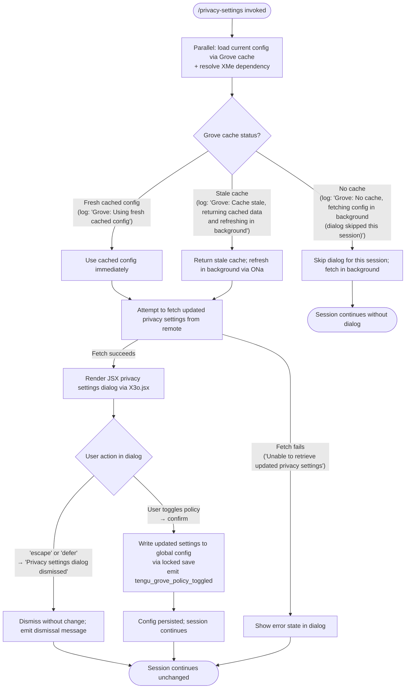

# `/privacy-settings`

> Analysis basis: CC v2.1.195 bundle.js (AST extraction + Claude interpretation)
> Minimum version: v2.1.195

---

## Overview

`/privacy-settings` opens an interactive dialog that allows the user to view and modify their privacy-related configuration (collectively referred to as "Grove policy" in the bundle). The command loads the current global configuration asynchronously — using a cache-aware fetching strategy — then renders a JSX dialog where the user can toggle policy settings. Upon dismissal or confirmation, it persists the updated settings back to the global config file with a file-system lock, emitting a `tengu_grove_policy_toggled` telemetry event on change.

---

## Registration

| Field | Value |
|---|---|
| type | `local-jsx` |
| name | `privacy-settings` |
| description | `View and update your privacy settings` |
| module_id | `fzl` |
| load_inline | `true` |
| loc_byte | `12774965` |
| loc_byte_end | `12775148` |
| loc_line | `8709` |
| arbor_handler.name | `mjf` |
| arbor_handler.fqn | `claude-2.1.195::mjf` |
| arbor_handler.kind | `AsyncFunction` |
| arbor_handler.resolution_path | `module_id` |
| arbor_handler.n_hits | `0` |

Analysis basis: CC v2.1.195 bundle.js:+12774965

---

## Input Branching

The handler exhibits four or more distinct execution paths (config cache status, dialog dismissal vs. confirmation, settings fetch failure, and policy toggle). A Mermaid flowchart is used.



Analysis basis: CC v2.1.195 bundle.js:+12774035, +12774140, +12774154, +12774165, +12774521, +12774292

---

## Behavioral Spec

### 1. Entry Point — Handler (`mjf`)

The async handler `mjf` is the root of all execution for `/privacy-settings`.

```
async function privacySettingsHandler(context):
    // Load config and dependency in parallel
    [currentConfig, resolvedDep] = await Promise.all([
        fetchConfigViaGroveCache(),      // Aft
        resolveExternalDependency()      // XMe
    ])

    // Attempt to fetch latest privacy settings from remote/store
    updatedSettings = await fetchUpdatedPrivacySettings(currentConfig)
      catch error:
        log("Unable to retrieve updated privacy settings")
        updatedSettings = currentConfig.privacySettings  // fall back to cached

    // Render interactive JSX dialog
    dialogResult = await renderPrivacyDialog(updatedSettings)  // X3o.jsx + je/OJe

    // Handle user response
    if dialogResult.action in ["escape", "defer"]:
        emit("Privacy settings dialog dismissed")
        return

    // User confirmed a change — persist and emit telemetry
    await saveGlobalConfigWithLock(updatedSettings)
    emitTelemetry("tengu_grove_policy_toggled")
```

Analysis basis: CC v2.1.195 bundle.js:+12773976, +12774016, +12774029, +12774140, +12774154, +12774165, +12774234, +12774519, +12774521, +12774582, +12774632

---

### 2. Grove Cache Strategy — Config Fetcher (`Aft`)

The config-loading subsystem (`Aft`) implements a three-tier freshness strategy before handing config to the handler.

```
function fetchConfigViaGroveCache():
    cacheStatus = evaluateCache()   // K9e, yo

    if cacheStatus == FRESH:
        log("Grove: Using fresh cached config")
        return cachedConfig

    if cacheStatus == STALE:
        log("Grove: Cache stale, returning cached data and refreshing in background")
        scheduleBackgroundRefresh()    // ONa
        return cachedConfig            // return stale immediately

    if cacheStatus == MISSING:
        log("Grove: No cache, fetching config in background (dialog skipped this session)")
        scheduleBackgroundRefresh()    // ONa
        return null                    // caller skips dialog

    // After background config is available, call Mt to read from disk
    rawConfig = readConfigFromDisk()   // Mt → oTt → r.readFileSync (utf-8)
    return rawConfig
```

Analysis basis: CC v2.1.195 bundle.js:+7405991, +7406012, +7406051, +7406106, +7406226, +7406332

---

### 3. Cache Freshness Evaluation (`K9e`, `yo`, `Mi`)

```
function evaluateCacheFreshness(cacheEntry):
    // Mi checks API key environment and plan tier
    apiKey = readEnvOrConfig("ANTHROPIC_API_KEY", "apiKeyHelper")
    planTier = determinePlanTier()   // literals: "max", "pro"

    // yo checks array membership and inclusion
    if isArray(cacheEntry) and cacheEntry.includes(expectedTier):
        return FRESH

    // dCi handles additional disambiguation
    return checkAdditionalCriteria()  // dCi
```

String literals observed: `"ANTHROPIC_API_KEY"` (bundle.js:+3077631), `"apiKeyHelper"` (bundle.js:+3077656), `"max"` (bundle.js:+3102541), `"pro"` (bundle.js:+3102552).

Analysis basis: CC v2.1.195 bundle.js:+3102579, +3102591, +3099124

---

### 4. Global Config Read (`oTt` — called from `Mt`)

```
function readConfigFile(configPath):
    if accessNotPermitted():
        throw Error("Config accessed before allowed.")

    try:
        raw = fs.readFileSync(configPath, "utf-8")
        parsed = parseJSON(raw)   // Bt, v5
        return parsed
    catch ENOENT:
        return defaultConfig()
    catch parseError:
        log("error", parseError)
        return fallbackConfig()
```

Constant: `"Config accessed before allowed."` (bundle.js:+14071590), encoding `"utf-8"` (bundle.js:+14071673), error code `"ENOENT"` (bundle.js:+14071856).

Analysis basis: CC v2.1.195 bundle.js:+14071584, +14071646, +14071693, +14071856

---

### 5. Locked Config Save (`xZt` — invoked via `gn` → `ONa`)

The save path uses a file-system lock with a 60 000 ms timeout and up to 5 backup copies.

```
async function saveConfigWithLock(newConfig, configPath):
    ensureDir(dirname(configPath))       // s.mkdirSync
    lockAcquiredAt = Date.now()

    if lockAcquisitionTime > expected:
        log("Lock acquisition took longer than expected - another Claude instance may be running")
        emit("tengu_config_lock_contention")

    // Re-read under lock to detect concurrent writes
    reRead = fs.statSync(configPath)
    reReadParsed = parseJSON(reRead)

    if reReadParsed has parseError:
        log("saveConfigWithLock: re-read hit a parse error; auto-repairing from cached config under lock. See GH #3117.")
        emit("tengu_config_auto_repaired")
        // continue with cached config

    if reReadParsed is missing auth that cache has:
        log("saveConfigWithLock: re-read config is missing auth that cache has; refusing to write to avoid wiping ~/.claude.json. See GH #3117.")
        emit("tengu_config_auth_loss_prevented")
        return  // abort write

    // Rotate backups: keep up to 5, prefix ".backup."
    backups = fs.readdirStringSync(backupDir).filter(startsWith(".backup."))
    if backups.length >= 5:
        removeOldestBackup()   // I.slice + s.unlinkSync
    fs.copyFileSync(configPath, newBackupPath)

    // Write new config
    fs.writeSync(configPath, JSON.stringify(newConfig))
    emit("tengu_config_stale_write")  // if applicable
```

Constants: lock timeout `60000` ms (bundle.js:+14070320), max backups `5` (bundle.js:+14070575), backup prefix `".backup."` (bundle.js:+14070436), permission bits `384` (bundle.js:+14070857), `"EEXIST"` (bundle.js:+14070297).

Analysis basis: CC v2.1.195 bundle.js:+14068971, +14069043, +14069182, +14069271, +14069407, +14069560, +14069656, +14069784, +14069962, +14070114, +14070320, +14070436, +14070575

---

### 6. Global Config Fallback Save (`Mcr`)

A secondary write path (`save_global`) is used if the primary locked write cannot proceed.

```
function saveGlobalConfigFallback(newConfig):
    if cache has auth but re-read does not:
        log("saveGlobalConfig fallback: re-read config is missing auth that cache has; refusing to write. See GH #3117.")
        return  // safety abort

    writeConfigFile(configPath, newConfig)   // dI, Me, aRt
    emit("tengu_config_fallback_write")
```

String literal: `"save_global"` (bundle.js:+14066283), log safety message (bundle.js:+14066037).

Analysis basis: CC v2.1.195 bundle.js:+14068610, +14068887, +14068925

---

### 7. Config Parse-Error Telemetry (`oTt`)

```
function handleConfigParseError(parseError, cachedConfig):
    emit("tengu_config_parse_error")
    // Auto-repair: write cached config back to disk
    writeRepaired(cachedConfig)
    emit("tengu_config_auto_repaired")
```

Analysis basis: CC v2.1.195 bundle.js:+14073004, +14069784

---

### 8. Dialog Render and Dismissal (`je`, `X3o.jsx`)

```
function renderPrivacyDialog(settings):
    component = buildJSXComponent(settings)   // X3o.jsx
    dialog = showDialog(component)             // je → OJe

    // OJe registers key handler
    onKey("escape") or onDefer():
        return { action: "escape" | "defer",
                 message: "Privacy settings dialog dismissed" }

    onConfirm(newSettings):
        return { action: "confirm", settings: newSettings }
```

String literals: `"escape"` (bundle.js:+12774140), `"defer"` (bundle.js:+12774154), `"Privacy settings dialog dismissed"` (bundle.js:+12774165), `"system"` (bundle.js:+12774210), `"settings"` (bundle.js:+12774585).

Analysis basis: CC v2.1.195 bundle.js:+12774582, +12774632

---

### 9. Sensitivity Redaction in Logging (`Lc`)

When logging config values that may contain secrets, the logger replaces sensitive content with `[REDACTED]` and truncates the string to the last 2 characters of the visible portion.

```
function redactSensitiveValue(value):
    // _is maps known sensitive keys
    sensitiveKeys = buildSensitiveKeyList()   // _is → wYc.map
    if isSensitive(value):
        return "[REDACTED]"   // literal at bundle.js:+207067
    else:
        return value.replace(pattern, safeReplacement)
```

Constant: `"[REDACTED]"` (bundle.js:+207067), truncation tail length `2` (bundle.js:+207096).

Analysis basis: CC v2.1.195 bundle.js:+206988, +207015, +207067, +207096

---

### 10. Transcript / Log Write (`PYc`, `_Xe`)

The command's internal logging buffers entries and flushes them in batches with debouncing.

```
function writeToTranscript(entries):
    // _Xe: debounced batch writer
    clearTimeout(pendingFlush)
    buffer.push(entries)
    if buffer.length >= 100:
        flush immediately via setImmediate
    else:
        setTimeout(flush, 1000)   // 1000 ms debounce

function flush():
    combined = buffer.join + secondaryBuffer.join
    appendToFile(combined)   // DYc → b$.appendFile
    rotateIfNeeded()         // oAr → b$.rename / b$.unlink
```

Constants: debounce delay `1000` ms (bundle.js:+65840), immediate-flush threshold `100` entries (bundle.js:+65861), rotation suffix `".txt"` (bundle.js:+214567), rotation tail length `4` (bundle.js:+214589), max log size `1024` (bundle.js:+17797372).

Analysis basis: CC v2.1.195 bundle.js:+65840, +65861, +215138, +215163, +215340, +215379

---

## State & Side Effects

| Item | Detail |
|---|---|
| Telemetry: `tengu_grove_policy_toggled` | Emitted when the user confirms a privacy-policy change (bundle.js:+12774521) |
| Telemetry: `tengu_config_lock_contention` | Emitted when the config file lock takes longer than expected (bundle.js:+14069271) |
| Telemetry: `tengu_config_stale_write` | Emitted on detecting a stale write conflict during locked save (bundle.js:+14069407) |
| Telemetry: `tengu_config_auto_repaired` | Emitted when a config parse error triggers automatic repair from cache (bundle.js:+14069784) |
| Telemetry: `tengu_config_auth_loss_prevented` | Emitted when a write is aborted to avoid overwriting auth credentials (bundle.js:+14070114) |
| Telemetry: `tengu_config_fallback_write` | Emitted when the fallback (non-locked) save path is used (bundle.js:+14068887) |
| Telemetry: `tengu_config_parse_error` | Emitted when the config JSON cannot be parsed (bundle.js:+14073004) |
| Hook registration | `vi` registers a hook via `krs.register` (bundle.js:+68053) |
| appState changes | Global config (`~/.claude.json`) is updated with new privacy/Grove policy values when the user confirms |
| File I/O | Reads config via `fs.readFileSync` (utf-8); writes via `fs.appendFile` / `fs.copyFileSync` / `fs.mkdirSync`; creates timestamped `.backup.*` files (up to 5 retained) |
| Log / Transcript | Batched, debounced writes to the transcript log file; log entries containing secrets are redacted to `[REDACTED]` |
| Sound | <!-- TODO: not found in depth-2 traversal; needs --depth 4 --> |
| Background refresh | When cache is stale or missing, a background config refresh is scheduled via `ONa`/`gn`/`xZt` without blocking the current session |

---

## Version History

| Version | Change |
|---|---|
| v2.1.195 | Initial analysis |

---

## Common Mistakes

1. **Expecting the dialog when there is no cached config.** If Grove has no cache at all for this session, the command logs a skip message and does not open the dialog. The user will not see a privacy settings UI until a subsequent invocation after the background fetch completes.

2. **Assuming settings are saved immediately on toggle.** The save goes through a file-system lock with up to 60 000 ms contention timeout. If another Claude instance holds the lock, the write is delayed and `tengu_config_lock_contention` is emitted. Do not treat the command's return as a guarantee that the file has been written.

3. **Modifying `~/.claude.json` externally while Claude is running.** The locked save path checks whether the re-read file still contains the same auth credentials as the in-memory cache. If they differ, the write is aborted and `tengu_config_auth_loss_prevented` is emitted. This is intentional protection (see GH #3117).

4. **Expecting detailed error messages on fetch failure.** When the remote privacy-settings fetch fails, the dialog shows the generic string `"Unable to retrieve updated privacy settings"` and falls back to the locally cached values.

5. **Confusing `"escape"` and `"defer"` dismissals.** Both produce the `"Privacy settings dialog dismissed"` message and leave settings unchanged; there is no behavioral difference visible to the user between these two dismissal paths.

---

## Appendix — Identifier Mapping

> For bundle debugging only. Identifiers change across versions.

| Identifier | Role |
|---|---|
| `mjf` | Main async handler for `/privacy-settings` (arbor_handler; AsyncFunction in module `fzl`) |
| `Aft` | Grove cache orchestrator — selects fresh/stale/missing path and delegates to config reader |
| `K9e` | Cache freshness evaluator — coordinates `Mi`, `yo`, `dCi` |
| `Mi` | Config metadata resolver — reads API key env var and plan tier |
| `EFr` | Sub-helper called from `Mi` (role not fully resolved at depth 2) |
| `yFr` | Sub-helper called from `Mi` (role not fully resolved at depth 2) |
| `eE` | Config environment reader — checks `ANTHROPIC_API_KEY`, `apiKeyHelper`, and numeric/string fields |
| `yo` | Cache array membership checker — uses `Array.isArray` and `e.includes` |
| `y3` | Inclusion utility used by `yo` |
| `dCi` | Additional cache disambiguation helper |
| `kc` | Config composite loader — calls `eE` and `Mt` |
| `Mt` | Config disk reader — coordinates `qt`, `S0`, `Mjo`, `oTt`, timestamps |
| `qt` | Config path resolver |
| `Mjo` | Config schema/default builder |
| `oTt` | Low-level config file reader — `readFileSync`, parse, ENOENT handling, backup rotation |
| `Csm` | Config watcher/cleanup — `unwatchFile`, `Jcc.unwatchFile` |
| `T` | Log/trace writer — formats and dispatches internal debug messages |
| `RYc` | Log formatter |
| `Drs` | Log level classifier |
| `Me` | JSON serializer wrapper — `JSON.stringify` |
| `Lc` | Sensitive-value redactor — replaces secrets with `[REDACTED]` |
| `_is` | Sensitive key list builder — maps `wYc` |
| `jXe` | Stream/pipe write helper |
| `ais` | Raw write helper — `e.write` |
| `PYc` | Transcript/log file write orchestrator |
| `_Xe` | Debounced batch buffer for transcript writes |
| `Qge` | Transcript flush coordinator |
| `tae` | Error-type classifier (`EISDIR` guard) |
| `Sis` | Path join helper for transcript |
| `oAr` | Log file rotation handler — stat, rename, unlink |
| `DYc` | Transcript append writer — `b$.mkdir`, `b$.appendFile` |
| `vi` | Hook registration — `krs.register` |
| `ONa` | Background config refresh scheduler |
| `gn` | Global config save entry point — delegates to `xZt`, `Djo`, `wZt`, `vZt`, `sTt`, `Mcr` |
| `xZt` | Locked config save implementation (60 000 ms lock, 5-backup rotation) |
| `sUe` | Config save helper (role not fully resolved at depth 2) |
| `Djo` | Config entries iterator — `Object.entries` |
| `wZt` | Timestamp helper for config writes |
| `vZt` | Config write pre-validator |
| `sTt` | Config write post-validator |
| `W` | Warning/error logger |
| `Mcr` | Fallback global config save (`save_global` path) |
| `a` | Spend/billing response handler — checks `spend.blocked`, `billing_error`, HTTP 429 |
| `age` | Response serializer — `JSON.stringify` wrapper |
| `je` | Dialog orchestrator — wraps `OJe` |
| `OJe` | Low-level dialog/key-event handler |

---

Note: index built via Arbor fallback; some signals (telemetry, literals) may be missing — see arbor-fallback.js.