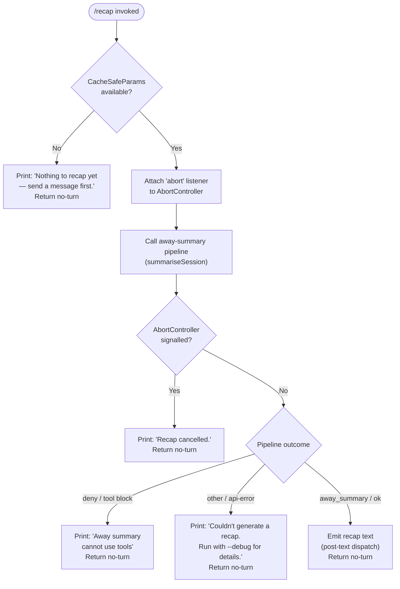

# `/recap`

> Analysis basis: CC v2.1.195 bundle.js (AST extraction + Claude interpretation)
> Minimum version: v2.1.195

---

## Overview

The `/recap` command immediately triggers an on-demand one-line session recap, summarising the current conversation without waiting for a natural turn boundary. It is implemented as an async handler (`HJf`) that invokes the same "away summary" pipeline used for background session summarisation, then prints the result (or an appropriate status message) to the terminal.

---

## Registration

| Field | Value |
|---|---|
| type | `local` |
| name | `recap` |
| description | `Generate a one-line session recap now` |
| loc_byte | `13284125` |
| loc_byte_end | `13284341` |
| loc_line | `9077` |
| supportsNonInteractive | `false` |
| thinClientDispatch | `post-text` |
| load_inline | `true` |
| load_ident | `HJf` |
| arbor_handler.name | `HJf` |
| arbor_handler.fqn | `claude-2.1.195::HJf` |
| arbor_handler.kind | `AsyncFunction` |
| arbor_handler.resolution_path | `load_ident` (followed inline `Promise.resolve({call: HJf})`) |
| arbor_handler.n_hits | `0` |

Analysis basis: CC v2.1.195 bundle.js:+13284125

---

## Input Branching

The handler has five distinct outcome branches depending on session state and the result of the away-summary pipeline, so a Mermaid flowchart is used.



Analysis basis: CC v2.1.195 bundle.js:+13283733 (handler entry `HJf`), +13283875, +13283967, +13284025 (output literals), +7238923, +7238981, +7239037, +7239214, +7239297, +7239441, +7239530, +7239591

---

## Behavioral Spec

### 1. Guard — check session prerequisites

```
async function recapHandler(context):
    params = getCacheSafeParams(context)
    if params is null or missing:
        printMessage("Nothing to recap yet — send a message first.")
        return { turn: "no-turn" }
```

If no `CacheSafeParams` have been stored for the current session (i.e. no API turn has yet been completed), the handler exits immediately with a user-facing message and the `"no-turn"` disposition so that no new conversation turn is created.

Analysis basis: CC v2.1.195 bundle.js:+7238923 (`"[awaySummary] no CacheSafeParams saved, skipping"`), +13283875

---

### 2. Abort listener registration

```
function recapHandler (continued):
    abortController = context.abortController
    abortController.addEventListener("abort", () => {
        // signal propagation to pipeline
    })
```

An `"abort"` event listener is attached to the session's `AbortController` before the summary pipeline is started, enabling cancellation if the user interrupts (e.g. Ctrl-C) while the recap is being generated.

Analysis basis: CC v2.1.195 bundle.js:+7239018, +7239037, +7239049

---

### 3. Away-summary pipeline invocation

```
function recapHandler (continued):
    result = await awaySummaryPipeline(context, params)
    // pipeline internally calls:
    //   buildSystemPrompt()      → model tier selection, message normalisation
    //   runAgentQuery()          → single API call, no tools permitted
    //   writeSessionLog()        → append to transcript log file
```

The core work is delegated to the away-summary pipeline (`K5t` → `Cde` → `As`). Key internal behaviours observed in the call graph:

- **Model selection** (`Ko` and literals at +2316844–+2317079): the pipeline resolves a model tier from identifiers including `"fable"`, `"opusplan"`, `"sonnet"`, `"haiku"`, `"opus"`, and `"best"`, using the `"[1m]"` token-limit marker.
- **Tool restriction** (literal `"Away summary cannot use tools"` at +7239229): the pipeline runs with tools disabled; if the agent attempts a tool call the outcome is `"deny"`.
- **Log writing** (`PYc` / `DYc`): the result is appended to the session log via `b$.appendFile`, with rotation via `oAr` when the file already exists.

Analysis basis: CC v2.1.195 bundle.js:+7239096 (`fx`), +7238902 (`K5t`→`Cde`), +7239116 (`Rn` UUID generation), +7239458 (`r.find`)

---

### 4. Result dispatch

```
function recapHandler (continued):
    outcome = result.outcome   // "away_summary" | "ok" | "aborted" | "deny" | "other" | "api-error"

    switch outcome:
        case "aborted":
            printMessage("Recap cancelled.")
            return { turn: "no-turn" }

        case "deny":
            printMessage("Away summary cannot use tools")
            return { turn: "no-turn" }

        case "other", "api-error":
            printMessage("Couldn't generate a recap. Run with --debug for details.")
            return { turn: "no-turn" }

        case "away_summary", "ok":
            dispatchPostText(result.text)   // thinClientDispatch = "post-text"
            return { turn: "no-turn" }
```

All paths return `"no-turn"` so the recap output is treated as an out-of-band annotation rather than a new conversation message. Successful text is dispatched via the `post-text` thin-client channel.

Analysis basis: CC v2.1.195 bundle.js:+7239214 (`"deny"`), +7239282 (`"other"`), +7239297 (`"away_summary"`), +7239441 (`"aborted"`), +7239530 (`"api-error"`), +7239547 (`QPa`), +7239591 (`"ok"`), +13283967 (`"Recap cancelled."`), +13284025 (`"Couldn't generate…"`)

---

### 5. Session-log append (transcript persistence)

```
function writeSessionLog(content, logPath):
    dir = dirname(logPath)
    mkdir(dir, { recursive: true })
    appendFile(logPath, content)
    if fileSize > rotationThreshold:
        rotateLogs(logPath)     // rename + unlink old segments
    updateLogMetadata()
```

The pipeline writes the generated recap text to a transcript log file. File operations involve `b$.mkdir`, `b$.appendFile`, `b$.rename`, and `b$.unlink`. A buffer byte-length check (`Buffer.byteLength`) guards rotation decisions. The `.txt` extension is used for rotation staging (literal at +214567); a slice offset of `4` bytes strips it during rename (literal at +214589).

Analysis basis: CC v2.1.195 bundle.js:+214892 (`b$.mkdir`), +214951 (`b$.appendFile`), +214619 (`b$.rename`), +214659 (`b$.unlink`), +215346 (`Buffer.byteLength`), +214567 (`".txt"`), +214589 (`4`)

---

### 6. UUID tagging

```
function recapHandler (continued, step 3 detail):
    turnId = crypto.randomUUID()   // i1.randomUUID
    // attached to the summary request for deduplication
```

Each recap invocation generates a fresh UUID for the internal request, preventing duplicate log entries if the command is invoked rapidly.

Analysis basis: CC v2.1.195 bundle.js:+13952925 (`i1.randomUUID`)

---

## State & Side Effects

| Item | Detail |
|---|---|
| Telemetry | The recap handler itself fires no dedicated `tengu_*` event; telemetry is emitted by the shared query/away-summary sub-system it invokes (see Appendix). Relevant upstream events include `tengu_query_error` (+11025707), `tengu_auto_compact_succeeded` (+11003869), `tengu_fork_agent_query` (+11065170). |
| Hook registration | `vi` → `krs.register` (+68053): the session-log writer registers a cleanup hook on initialisation. |
| appState changes | `e.getAppState` / `e.setAppState` called within `Mzn` (away-summary query orchestrator) to read and update session context during the recap run. |
| Log file I/O | Appends recap text to the session transcript log; rotates if size threshold is exceeded. |
| AbortController | Listens for `"abort"` signal on the session controller; cancels gracefully. |
| Sound | <!-- TODO: not found in depth-2 traversal; needs --depth 4 --> |
| New conversation turn | None — all outcomes return `"no-turn"`. |

---

## Version History

| Version | Change |
|---|---|
| v2.1.195 | Initial analysis |

---

## Common Mistakes

1. **Running `/recap` before any messages have been sent.** The handler exits immediately with "Nothing to recap yet — send a message first." — at least one completed API turn must exist in the session for `CacheSafeParams` to be populated.
2. **Expecting a new chat turn.** Because all outcome paths return `"no-turn"`, the recap text is posted as an out-of-band annotation and does not appear in the conversation message history or affect context window accounting.
3. **Expecting tool use during recap.** The away-summary pipeline runs with tools disabled; any attempt by the model to call a tool results in a `"deny"` outcome and a "Away summary cannot use tools" message rather than recap text.
4. **Using `/recap` in non-interactive mode.** `supportsNonInteractive: false` means the command is unavailable in headless / `--non-interactive` sessions.
5. **Assuming `--debug` surfaces detailed errors by default.** On `"api-error"` or `"other"` outcomes the user-facing message explicitly instructs re-running with `--debug`; without that flag the underlying error is suppressed.

---

## Appendix — Identifier Mapping

> For bundle debugging only. Identifiers change across versions.

| Identifier | Role |
|---|---|
| `HJf` | Main recap command handler (AsyncFunction); entry point resolved via `load_ident` |
| `K5t` | Away-summary orchestrator; called by `HJf` to run the full summary pipeline |
| `Cde` | Session-context builder; prepares parameters for the away-summary query |
| `As` | System-prompt / message assembler; builds the prompt sent to the model |
| `q5` | Message normalisation helper; pre-processes conversation messages |
| `Ko` | Model-tier resolver; maps tier names (`"fable"`, `"sonnet"`, `"haiku"`, etc.) to model identifiers |
| `SH` | Secondary message-normalisation pass; calls `Ko` and `BC` |
| `T` | Prompt-formatting utility; handles redaction, upper-casing, trimming, and API-path suffix resolution |
| `RYc` | API request builder; constructs the HTTP request structure |
| `Drs` | Request-header utility; calls `NKc` and `UKc` |
| `Me` | JSON serialisation helper; wraps `JSON.stringify` |
| `Lc` | Path suffix resolver; maps model shorthand to canonical API path segment |
| `_is` | Model-alias mapper; iterates `wYc` map |
| `jXe` | Stream writer; dispatches streamed tokens via `ais` → `e.write` |
| `ais` | Low-level write helper; writes bytes to output stream |
| `PYc` | Session-log write coordinator; orchestrates `mkdir`, `appendFile`, rotation, and hook registration |
| `_Xe` | Debounced batch-write helper; uses `setTimeout`/`setImmediate`/`clearTimeout` and join buffers |
| `Qge` | Log-segment join utility; builds final log content from segments |
| `qt` | Log path resolver |
| `tae` | EISDIR-aware directory handler |
| `Sis` | Log path joiner using `Xge.join` and `Rt` |
| `oAr` | Log rotation helper; stats, renames, and unlinks old log files |
| `DYc` | Async log-append executor; calls `mkdir`, `appendFile`, `tae`, `Sis`, `oAr` |
| `vi` | Hook registration wrapper; calls `krs.register` |
| `fx` | Forked-agent query runner; drives the single-turn away-summary API call |
| `Mzn` | Session-state query orchestrator; reads/writes `appState`, generates UUID, calls model |
| `pO` | Platform / environment accessor |
| `dEe` | State serialisation helper; load/dump of session state |
| `pke` | Pre-query policy checker |
| `Cwa` | Context-window accounting helper |
| `a` | Spend-limit / billing error handler |
| `cZn` | Request-context builder for `Mzn` |
| `sP` | Session-ID generator; uses `Von.randomBytes` with hex encoding (63-byte input → 8-byte output) |
| `Dzn` | Post-query cleanup helper |
| `Jpe` | Tool-restriction enforcer; denies tool calls during away-summary |
| `zc` | Hook-registration accessor |
| `BKe` | Tool-filter applying "ant" namespace restriction |
| `RU` | Turn completion handler; calls `mCf` and `gQn` |
| `mCf` | Core agent-query loop; handles streaming, tool execution, compaction, refusal fallback, model fallback |
| `gQn` | Turn-state cleanup; deletes entries from `TW`, `aDo`, `kzt`, `vKe` maps |
| `Le` | Feature-flag gate emitting `tengu_feature_ok` |
| `ke` | Feature-flag gate emitting `tengu_feature_bad` |
| `kR` | Request-key resolver |
| `OVe` | Active-session membership checker; queries `snf` set |
| `nse` | No-summary-entry handler |
| `pZn` | Post-query state patcher |
| `Vrl` | Session-validity checker; calls `OVe` |
| `f` | Path-normalisation accumulator |
| `o8` | OS path normaliser; uses `U1.normalize`, `Vt`, and `t.replaceAll` with `"windows"` guard |
| `Bpe` | Notification/summary filter; uses `pA` and `Ztf` |
| `pA` | Notification priority accessor |
| `Ztf` | Summary-entry finder |
| `s` | Promise-lifecycle tracker; `add`/`delete` on set `r`, `finally` chain |
| `W` | Core application-state store |
| `LCf` | Forked-agent query wrapper; calls `W`, `Oe`, `br` |
| `Oe` | Observable/reactive accessor; wraps `OJe` |
| `br` | Message renderer; calls `xh` (non-conforming handler) and `je` |
| `Rn` | Turn UUID generator; calls `i1.randomUUID` |
| `_` | Internal state-transition helper |
| `y` | Teammate mailbox accessor; routes to `dVe` |
| `dVe` | TeammateMailbox message-read marker; acquires lock, filters, marks messages |
| `QPa` | Result flat-mapper; assembles final output array via `e.flatMap` |

---

Note: index built via Arbor fallback; some signals (telemetry, literals) may be missing — see arbor-fallback.js.