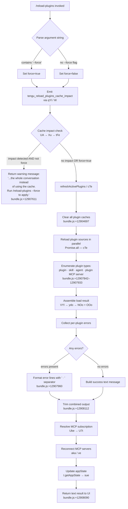

# `/reload-plugins`

> Analysis basis: CC v2.1.195 bundle.js (AST extraction + Claude interpretation)
> Minimum version: v2.1.195

---

## Overview

`/reload-plugins` applies pending plugin changes (MCP servers, skills, agents, and LSP servers) to the current running session without restarting Claude Code. It inspects all registered plugin types, refreshes their caches, reconnects MCP transport, and reports the outcome as a structured text message. An optional `--force` flag bypasses cache-preservation heuristics and triggers a full conversation-wide cache flush.

---

## Registration

| Field | Value |
|---|---|
| type | `local` |
| name | `reload-plugins` |
| description | `Activate pending plugin changes in the current session` |
| argumentHint | `[--force]` |
| supportsNonInteractive | `false` |
| thinClientDispatch | `control-request` |
| module_id | `KYl` |
| load_inline | `true` |
| loc_byte | `12909028` |
| loc_byte_end | `12909272` |
| loc_line | `8912` |
| arbor_handler.name | `z8f` |
| arbor_handler.fqn | `claude-2.1.195::z8f` |
| arbor_handler.kind | `AsyncFunction` |
| arbor_handler.resolution_path | `module_id` |
| arbor_handler.n_hits | `0` |

Analysis basis: CC v2.1.195 bundle.js:+12909028

---

## Input Branching

The handler presents four distinct runtime paths based on the presence of the `--force` flag and the state of each plugin subsystem (cache-impact analysis, plugin-type enumeration, and error collection), warranting a Mermaid flowchart.



---

## Behavioral Spec

### 1. Argument Parsing and Force Flag Detection

```
async function reloadPluginsHandler(context, rawArgString):
    args = rawArgString.trim()                     // bundle.js:+12908112
    forceFlag = args.includes("--force")           // bundle.js:+12908148, +12908163

    cacheImpact = await assessCacheImpact(context) // UA → Xu → tFe  bundle.js:+12907726
    emit telemetry: tengu_reload_plugins_cache_impact
                                                   // qYl → W  bundle.js:+12907018, +12908332

    if cacheImpact AND NOT forceFlag:
        return warningMessage(
            "...the whole conversation instead of using the cache. " +
            "Run /reload-plugins --force to apply."
        )                                          // bundle.js:+12907611
```

Analysis basis: CC v2.1.195 bundle.js:+12907726, +12908148, +12908332

---

### 2. Plugin Cache Flush (`cTe` / refreshActivePlugins)

When the force gate passes (either no cache impact, or `--force` is set):

```
async function refreshActivePlugins(context):
    log("refreshActivePlugins: clearing all plugin caches")
                                                   // bundle.js:+12904697
    clearAllPluginCaches(context)                  // Ah → V0 → LG, X6  bundle.js:+11220252

    [pluginResults, skillResults, agentResults, mcpResults] =
        await Promise.all([                        // bundle.js:+12904804
            reloadPluginType("plugin"),            // bundle.js:+12907842
            reloadPluginType("skill"),             // bundle.js:+12907873
            reloadPluginType("agent"),             // bundle.js:+12907901
            reloadPluginType("plugin MCP server"), // bundle.js:+12907933
        ])

    lspErrors = reloadLspPlugins(context)          // q8f, K8f  bundle.js:+12905374, +12905407
    emit i2.emit(...)                              // bundle.js:+12905804

    return assembleResult(
        pluginResults, skillResults, agentResults,
        mcpResults, lspErrors
    )
```

Analysis basis: CC v2.1.195 bundle.js:+12904697, +12904804

---

### 3. Plugin-Load Result Assembly (`VYl` / assemblePluginLoadResult)

```
function assemblePluginLoadResult(loadResults, context):
    if context.originalCwdChanged():
        log("assemblePluginLoadResult: originalCwd changed mid-scan; " +
            "skipping side-effects (stale early-kick)")
                                                   // bundle.js:+11338467
        return earlyAbort()

    // Check membership of each plugin type across sets
    for each plugin in loadResults:
        checkPresence(pluginSet, mcpSet)           // VYl → t.has, n.has  bundle.js:+12906794, +12906833

    // Resolve plugin status codes
    resolvePluginStatus(plugin)                    // aO → VBt → $9e, Boo, Vop
    normalizePluginKey(plugin)                     // kJ → Kop → at
    collectPluginWarnings(plugin)                  // Wy → nXe

    // Emit telemetry counts
    emit("plugin_load_all", count)                 // bundle.js:+11338314
    emit("plugin_load_total_failure", ...)         // bundle.js:+11338332
    emit("plugin_load_partial_failures", ...)      // bundle.js:+11338401
```

Analysis basis: CC v2.1.195 bundle.js:+12906794, +11338314, +11338467

---

### 4. MCP Server Discovery and Reconnection (`ydo` / `lX` / `OOo` / `NOo`)

```
async function discoverAndReconnectMcpServers(context):
    // Phase 1: Scan configuration sources
    configs = await scanMcpConfigs(context)        // lX  bundle.js:+6739839

    for each configSource in ["project", "user", "local", "enterprise"]:
                                                   // bundle.js:+6735385, +6735843, +6736045, +6736186
        parseConfigFile(source)                    // ST → GEe.parse  bundle.js:+6735229
        // Project configs read .mcp.json          // bundle.js:+6735317

    mcpAutoDiscoveredEntries = resolveAutoDiscovered(configs)
                                                   // lc → mcpAutoDiscovered  bundle.js:+6736794

    // Phase 2: Connect each discovered server
    connectionResults = await Promise.allSettled(  // OOo  bundle.js:+11316891
        servers.map(server => connectMcpServer(server))
    )

    // Phase 3: Resolve tool/resource manifests
    for each result in connectionResults:
        if result.status == "fulfilled":           // bundle.js:+11318755
            processSuccessfulConnection(result)
        else:                                      // "rejected"  bundle.js:+11318811
            recordFailure(result, errorCode)       // codes: "generic-error", "marketplace-blocked-by-policy" etc.

    return aggregateConnectionState()
```

Analysis basis: CC v2.1.195 bundle.js:+6736794, +6735317, +11316891, +11318755

---

### 5. MCP Subscription and State Update (`Ube` / `U7t`)

```
async function updateMcpSubscriptions(context, newPluginState):
    current = pluginMap.get(context.sessionId)     // Ube → t.get  bundle.js:+12048683

    // Diff old vs. new tool sets
    added   = newState.tools.filter(t => !current.has(t))
    removed = current.tools.filter(t => !newState.has(t))

    pluginMap.set(context.sessionId, newState)     // Ube → t.set  bundle.js:+12048719

    // Apply dependency graph resolution
    resolveDependencies(newState)                  // U7t → l2t, Zzi  bundle.js:+11280609, +11278044

    // Reconnect changed MCP transport slots
    for each changedSlot in diffSlots:
        if slotConfigChanged:
            log("applyConnectionResult: disposing orphaned connect " +
                "(slot config changed mid-flight)")  // bundle.js:+17087157
        connectTransport(slot)                     // aka → u.connect  bundle.js:+7034736

    // Notify registered listeners
    triggerMcpListChangedEvent()                   // tengu_mcp_list_changed  bundle.js:+17343695
    appState = context.getAppState()               // bundle.js:+12908226
    updatePluginsInAppState(appState, newPluginState)
```

Analysis basis: CC v2.1.195 bundle.js:+12048683, +12048719, +12908226

---

### 6. LSP Plugin Handling (`q8f` / `K8f`)

```
function collectLspPluginErrors(loadedPlugins, lspManagerSet):
    // Filter for LSP-manager type plugins
    lspPlugins = loadedPlugins.filter(
        p => p.type == "lsp-manager"               // bundle.js:+12906219
    )

    errors = []
    for each plugin in lspPlugins:
        if plugin.name.startsWith("plugin:"):      // bundle.js:+12906254
            result = reloadLspPlugin(plugin)
            if result.hasError:
                errors.push({
                    kind: result.errorCode,        // possible: "lsp-config-invalid",
                                                   // "lsp-server-start-failed", "lsp-server-crashed"
                                                   // bundle.js:+4335171, +4335299, +4335416
                    plugin: plugin.name
                })
    return errors
```

Analysis basis: CC v2.1.195 bundle.js:+12906219, +12906254, +4335171

---

### 7. Output Message Construction

```
function buildOutputMessage(allResults):
    lines = []
    for each pluginType in ["plugin", "skill", "agent", "plugin MCP server", "hook", "plugin LSP server"]:
                                                   // bundle.js:+12908707, +12908766
        statusLine = formatStatusLine(pluginType, results)
        if statusLine:
            lines.push(statusLine)

    // Join sections with separator
    combined = lines.join(" · ")                   // bundle.js:+12907960
    trimmed  = combined.trim()                     // bundle.js:+12908112

    return { type: "text", content: trimmed }      // bundle.js:+12908090
```

Analysis basis: CC v2.1.195 bundle.js:+12907960, +12908090

---

## State & Side Effects

| Item | Detail |
|---|---|
| Telemetry | `tengu_reload_plugins_cache_impact` (bundle.js:+12907020); `tengu_mcp_list_changed` (bundle.js:+17343695); `tengu_plugin_state_file_error` (bundle.js:+11257857); `tengu_feature_ok` / `tengu_feature_bad` / `tengu_feature_sad` (bundle.js:+1027363, +1027430, +1027511) |
| Plugin cache clear | All installed-plugin caches flushed via `Ah → V0 → LG → e.clearSkillIndexCache` (bundle.js:+13518704); message "Cleared installed plugins cache" (bundle.js:+11257678) |
| Plugin load telemetry | `plugin_load_all`, `plugin_load_total_failure`, `plugin_load_partial_failures` emitted by `NOo` (bundle.js:+11338314, +11338332, +11338401) |
| MCP server connections | `aka` calls `u.connect`, `u.getServerCapabilities`, `u.getInstructions`, and `u.close` on each discovered server; uses `Promise.allSettled` (bundle.js:+11316891) |
| MCP transport slots | Orphaned slot connections are disposed with log messages when config changes mid-flight (bundle.js:+17087157, +17087242) |
| appState changes | `t.getAppState()` read at bundle.js:+12908226; plugin subscription map updated in `Ube` at bundle.js:+12048683, +12048719 |
| Dependency resolution | Semantic-version graph resolved via `l2t` / `mJ.validRange`, `mJ.minVersion`, `mJ.satisfies` (bundle.js:+4364245, +11277995) |
| LSP reload | LSP plugins reloaded if present; errors collected via `q8f` / `K8f` (bundle.js:+12905374, +12905407) |
| Safe-mode guard | `bEe` checks for `--safe-mode` flag; if set, emits "Safe mode: skipping plugin hook registration" and skips hook wiring (bundle.js:+5380462) |
| Sound | Not found in depth-2 traversal |
| Non-interactive support | `supportsNonInteractive: false` — command cannot run in headless/pipe mode |
| Thin-client dispatch | `thinClientDispatch: "control-request"` — in thin-client sessions the command is forwarded as a control request rather than executed locally |

---

## Version History

| Version | Change |
|---|---|
| v2.1.195 | Initial analysis |

---

## Common Mistakes

1. **Omitting `--force` when cache impact is detected.** If the reload would invalidate the entire conversation cache, the command returns a warning and performs no reload. Pass `--force` explicitly to proceed despite the cache cost (bundle.js:+12907611, +12908148).
2. **Running in non-interactive mode.** `supportsNonInteractive` is `false`; invoking `/reload-plugins` in a piped or headless script will be rejected.
3. **Expecting immediate MCP tool availability.** The reconnection phase uses `Promise.allSettled`, so individual server failures do not block the overall reload — but those servers' tools will be absent until the next successful connection cycle.
4. **Ignoring the "originalCwd changed" stale-kick guard.** If the working directory changes between the command invocation and the scan completing, side effects are skipped silently (bundle.js:+11338467). Re-run the command from the correct directory.
5. **Assuming LSP plugins are always reloaded.** LSP entries are only reloaded if they match the `lsp-manager` / `plugin:` prefix filter; plugins outside this pattern are skipped in that phase (bundle.js:+12906219, +12906254).
6. **Confusing plugin status error codes.** Many plugin-load failure codes (`marketplace-blocked-by-policy`, `plugin-not-found`, `cache-miss`, `dependency-unsatisfied`, etc.) are informational statuses in the result object, not thrown exceptions; inspect the returned text message for details rather than expecting an error throw.

---

## Appendix — Identifier Mapping

> For bundle debugging only. Identifiers change across versions.

| Identifier | Role |
|---|---|
| `z8f` | Main async handler for `/reload-plugins` (arbor_handler) |
| `UA` | Cache-impact assessment entry point |
| `Xu` | Cache-impact check helper |
| `tFe` | Cache-impact computation leaf |
| `pZ` | Plugin-state validation helper |
| `yn` | Plugin-state normalizer |
| `VYl` | `assemblePluginLoadResult` — assembles final plugin-load state |
| `ydo` | MCP server discovery orchestrator |
| `zIe` | MCP discovery sub-routine A |
| `Ado` | MCP discovery sub-routine B |
| `NOo` | Plugin load aggregator (emits `plugin_load_*` telemetry) |
| `OOo` | MCP config parser / connection builder |
| `lX` | MCP config file scanner (project/user/local/enterprise) |
| `lc` | Config loader entry |
| `d2` | Object-creation utility for plugin config |
| `ST` | Settings tree walker for MCP config files |
| `sde` | Plugin definition deserializer |
| `qS` | Plugin type classifier |
| `Awn` | Transport-type resolver (`http`, `dynamic`) |
| `iE` | Plugin-install error formatter |
| `T` | Generic logger / formatter utility |
| `xFn` | MCP extension field extractor |
| `glt` | Plugin path glob helper |
| `g` | Plugin set manager |
| `f` | Plugin registry set |
| `m` | Plugin metadata filter |
| `hx` | Plugin hook connector |
| `Nva` | Plugin version constraint checker |
| `w` | Window-focus/blur state tracker (blur/focused/3600000) |
| `p` | Forced-shutdown handler |
| `M` | HTTP server / OAuth handler (large multi-role function) |
| `r` | Plugin registry reference |
| `Cs` | CLI error handler (calls `process.exit`) |
| `n` | Key normalizer (toLowerCase) |
| `i` | Transport close handler |
| `s` | Async resource tracker |
| `aO` | Plugin version string parser |
| `VBt` | Plugin tier/version resolver |
| `$9e` | Plugin compliance check (`hipaa`/`standard`) |
| `Boo` | `auto:` prefix version parser |
| `Vop` | `auto` version flag checker |
| `ut` | Boolean string coercer (`yes`/`on`/`no`/`off`) |
| `ml` | Boolean string coercer variant |
| `fr` | Auth provider resolver (`gateway`, `bedrock`, etc.) |
| `Lm` | Auth provider base resolver |
| `_u` | OAuth environment resolver |
| `OEn` | OAuth environment normalizer |
| `kJ` | Plugin key normalizer (toLowerCase + scope check) |
| `Kop` | Plugin key builder |
| `at` | Plugin registration entry builder |
| `Wy` | Plugin warning collector |
| `qYl` | Cache-impact telemetry emitter |
| `W` | Telemetry event emitter (core) |
| `Y8f` | Plugin name splitter (n.split) |
| `cTe` | `refreshActivePlugins` — top-level cache-flush and reload orchestrator |
| `PRl` | Plugin reload sub-step |
| `Ah` | Plugin cache invalidation dispatcher |
| `Xwf` | Skill-index / plugin-index cache clearer |
| `Ow` | Plugin system reset helper |
| `ZZn` | Cache-clear notification |
| `oer` | MCP capability observer |
| `EUn` | MCP server enumeration helper |
| `Sao` | Plugin root resolver |
| `xe` | Error logger / stack capturer |
| `wFn` | MCP watcher factory |
| `HOo` | MCP server health observer |
| `yRl` | MCP reload trigger |
| `V0` | Skill-index cache clearer (calls `e.clearSkillIndexCache`) |
| `LG` | Skill-index refresh gate |
| `aRl` | Agent reload helper |
| `HKe` | Hook-set reloader |
| `LW` | LSP watcher |
| `Coo` | Component observer |
| `X6` | y7t cache clear |
| `Vtl` | Plugin state validator |
| `bPa` | Plugin approval checker |
| `Hr` | Logging helper |
| `u0` | Null/undefined guard |
| `o` | String padding / map utility |
| `xre` | Plugin file reader / manifest parser |
| `sq` | File extension checker (`.mcpb`, `.dxt`) |
| `Mae` | Manifest entry normalizer |
| `ido` | Plugin definition reader (reads `manifest.json`) |
| `qt` | Path utilities (join/resolve) |
| `Cn` | ENOENT / error code classifier |
| `Bt` | JSON safe-parser |
| `bva` | Plugin source status classifier |
| `l4t` | MCPB archive extractor and installer |
| `ye` | String coercer |
| `MWe` | LSP config file reader (`.lsp.json`) |
| `exp` | LSP extension expander |
| `ZLp` | Path-traversal guard for plugin-relative paths |
| `l` | Async log writer |
| `LZl` | Daemon status writer |
| `Hte` | Telemetry histogram helper |
| `Vs` | AsyncLocalStorage store accessor |
| `WXt` | Daemon status file path builder |
| `Me` | JSON.stringify wrapper |
| `c` | Background-session sentinel |
| `_Bn` | LSP extension conflict deduplicator |
| `a` | Spend/billing response handler |
| `age` | JSON.stringify with error mapping |
| `q8f` | LSP error collector pass 1 |
| `jYl` | LSP plugin filter |
| `K8f` | LSP error collector pass 2 |
| `bEe` | Hook registration guard (safe-mode check) |
| `Tl` | Boolean/flag string parser |
| `Usn` | Safe-mode flag reader |
| `Ube` | Plugin subscription map manager |
| `wD` | Known-marketplace file reader |
| `om` | Marketplace JSON loader |
| `cer` | Marketplace path builder |
| `n6e` | Plugin capability entry parser |
| `Hn` | Plugin capability formatter |
| `gmn` | Telemetry capability helper |
| `p3` | Plugin capability set builder |
| `JM` | Managed-scope error thrower |
| `Qo` | Plugin ID splitter / includes check |
| `yb` | Plugin URL/source validator |
| `GBn` | URL protocol extractor |
| `kpt` | Plugin source resolver (git, npm, github, file) |
| `w5t` | Plugin source Hn formatter |
| `lDa` | Host-pattern matcher |
| `cDa` | Path-pattern matcher |
| `Yxp` | GitHub/npm source resolver |
| `SG` | Source group formatter |
| `uDa` | URL-based source dispatcher |
| `SRt` | URL scheme checker (`http:`, `https:`) |
| `aDa` | Advanced source matcher |
| `RW` | Plugin config file reader (`.claude-plugin/marketplace.json`) |
| `L7t` | Plugin install directory resolver |
| `bOo` | Plugin marketplace JSON parser |
| `on` | Error code extractor (`errno`) |
| `bk` | Plugin loader (reads config, marketplace, calls `om`) |
| `IOo` | Plugin config reader with fallback |
| `EUf` | Plugin enable/disable filter |
| `U7t` | Full plugin-resolution engine (dependency graph, version checks, MCP wiring) |
| `Vw` | Plugin version formatter |
| `yer` | Plugin load verifier |
| `ekt` | Local-path plugin checker (`./` prefix) |
| `u` | Daemon control dispatcher |
| `Le` | `tengu_feature_ok` emitter |
| `ke` | `tengu_feature_bad` emitter |
| `SF` | Daemon stop handler |
| `yj` | Async race/all coordinator |
| `Ot` | AsyncLocalStorage context runner |
| `Rpn` | Context store fetcher |
| `Bk` | Plugin binary loader (reads `plugin.json` / JSON manifest) |
| `COo` | Plugin file sync reader |
| `vOo` | Plugin entry iterator |
| `M7t` | Plugin load-from-disk handler |
| `y` | TeammateMailbox message reader |
| `dVe` | Mailbox mark-as-read helper |
| `XP` | Plugin scope validator |
| `B0` | Plugin scope builder |
| `oPn` | Semver validity checker (`mJ.valid`, `mJ.coerce`, `mJ.satisfies`) |
| `E` | MCP SDK connection manager |
| `kIt` | SSE transport factory |
| `Zr` | Error string constructor |
| `Zzi` | Dependency cycle detector |
| `NC` | Capability set accumulator |
| `Cvt` | Capability entry builder |
| `H` | Worker process kill dispatcher |
| `O` | Worker process set |
| `D` | Daemon writer |
| `d` | Daemon supervisor |
| `N` | File-watcher / mtime change handler |
| `bWc` | Realpath/stat file watcher helper |
| `gd` | Daemon state getter |
| `gUm` | Daemon write helper (`fVn`) |
| `jRl` | Plugin slot queue manager |
| `k` | Scheduled-tasks / file-watcher controller |
| `$7o` | Scheduled task executor |
| `Wtn` | Scheduled task cleanup |
| `oEe` | Task directory builder |
| `P` | Grace-clock sweep / worker lifecycle manager |
| `I` | Input event throttler |
| `h` | Worker spawn/retire/memory manager |
| `io` | Settings file loader (`loadSettingsFromDisk`) |
| `Lg` | Settings path resolver |
| `Tkr` | Settings key transformer |
| `Xv` | Settings schema validator |
| `RRr` | Settings write tracker |
| `oBe` | Settings path builder |
| `aRt` | Atomic file write helper (`writeFileSyncAndFlush`) |
| `n_` | Cache-clear on settings load (`Kon.clear`, `QHr.clear`) |
| `eIs` | `.gitignore` rule tracker |
| `M5` | `.claude/settings.json` path builder |
| `wt` | `tengu_feature_sad` emitter |
| `d8` | Settings disk loader |
| `Eer` | Plugin path escape validator |
| `V` | Debounced writer with setTimeout |
| `me` | Conversation message enqueuer |
| `cc` | UUID generator (`i1.randomUUID`) |
| `_oe` | Message state initializer |
| `As` | Message queue dispatcher |
| `Rt` | Queue entry builder |
| `pe` | Pending-response map |
| `we` | Abort controller set |
| `Ce` | AbortController wrapper |
| `ge` | OAuth token store (`KQo`, `Ygr`) |
| `KQo` | OAuth token getter (`FQo`) |
| `Ygr` | OAuth token setter (`_Om`) |
| `l2t` | Semver range dependency validator |
| `_eo` | Semver too-complex guard |
| `her` | Plugin resolution error formatter |
| `ROo` | Resolution error entry builder |
| `P7t` | Plugin error path builder |
| `_er` | Git-tag version resolver (`ls-remote --tags`) |
| `TLf` | Git credential helper |
| `Mn` | Git subprocess runner |
| `DV` | Git credential interactive flag (`credential.interactive`) |
| `Her` | Git ref normalizer |
| `N7t` | NPM plugin installer and unpacker |
| `UEt` | NPM package fetcher and extractor |
| `der` | NPM dependency resolver |
| `KRl` | NPM registry helper |
| `dse` | Plugin hash/SHA deduplicator |
| `WU` | Plugin install path builder (`Ter`, `kw`) |
| `mer` | Plugin directory scanner (`FRl.readdir`) |
| `uK` | Plugin name encoder |
| `E1e` | Plugin install verifier |
| `ner` | Plugin cleanup handler |
| `wOo` | Plugin install state updater |
| `K` | MCP slot config store |
| `Y` | MCP slot config entry (`zZt`) |
| `z` | MCP slot state applier (`bmr`, `xWe`) |
| `bmr` | MCP connection result applier |
| `xWe` | MCP slot config diffuser |
| `j` | MCP message queue |
| `q` | MCP backspace / key event handler |
| `Fe` | Truncated function-call tag formatter |
| `Sn` | Session cleanup handler |
| `ie` | MCP tool-list refresher on `list_changed` |
| `A` | HTTP userinfo fetcher |
| `Kjt` | JWT decoder (`z_`) |
| `Yum` | MCP notification handler |
| `le` | Elicitation tracker |
| `ue` | MCP tools/list refresh handler |
| `He` | MCP server capability set |
| `sn` | MCP debug logger (`Gee.logMCPDebug`) |
| `je` | MCP tool-list fetch (`OJe`) |
| `Qn` | MCP tool-list retry |
| `k5` | MCP reconnect helper (`hc`) |
| `ILf` | MCP server load-result integrator |
| `ve` | MCP server slot reconnector |
| `cr` | MCP server state record |
| `Wn` | MCP server watcher set |
| `cs` | MCP server cleanup handler |
| `aka` | MCP server connect-all orchestrator (uses `Promise.allSettled`) |
| `Fo` | MCP server capability finalizer |
| `fo` | MCP server filter set |
| `$9` | MCP server `hc` + `startsWith` checker |
| `oua` | VS Code companion discovery (`claude-vscode`) |
| `kNn` | MCP notification normalizer |
| `jJ` | MCP server name joiner |
| `kWl` | MCP server config serializer |
| `OFc` | CCD-session MCP dispatcher |
| `Z` | Temp-file cleanup handler |
| `Hse` | Temp-file lstat / rm helper |
| `AUl` | Temp-file unlink helper |
| `X` | Voice recording session manager |
| `Npr` | Voice buffer push helper |
| `ae` | Voice PCM buffer accumulator |
| `wTc` | Voice RMS energy calculator |
| `Mr` | Voice settings loader |
| `oXe` | Locale resolver |
| `wis` | DateTimeFormat locale formatter |
| `car` | Voice WebSocket stream manager |
| `Tym` | Voice transcript handler |
| `be` | MCP elicitation handler |
| `he` | Voice session lifecycle manager |
| `czo` | Voice recording file writer |
| `ne` | Plugin neighbour-map accessor |
| `YM` | Semver scope validator |
| `sg` | Plugin scope string coercer |
| `Xc` | OTEL metric emitter |
| `X5e` | OTEL resource attribute builder |
| `Bvt` | OTEL event attribute builder |
| `Q_r` | OTEL event name attribute |
| `Z_r` | OTEL event sequence attribute |
| `ee` | Voice focus-gain handler |
| `sue` | Plugin dependency summary builder |