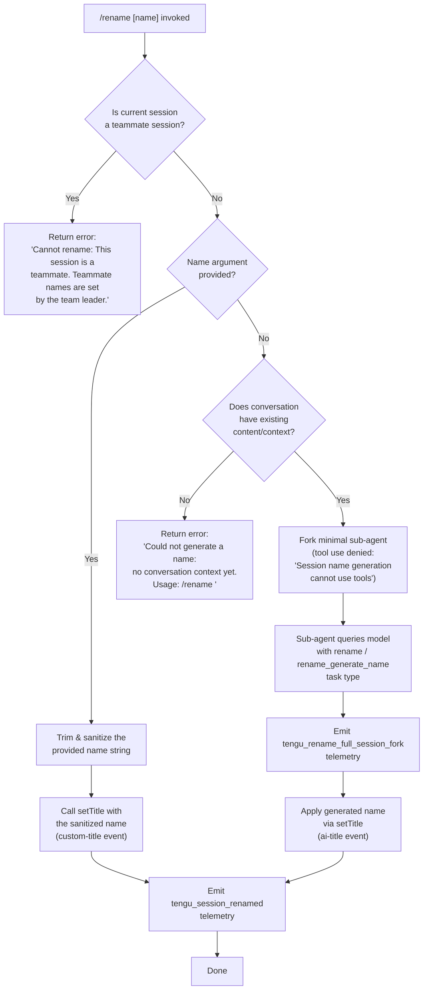

# `/rename`

> Analysis basis: CC v2.1.195 bundle.js (AST extraction + Claude interpretation)
> Minimum version: v2.1.195

---

## Overview

The `/rename` command (aliased as `/name`) renames the current conversation session. When called with an explicit name argument, it applies that name immediately; when called with no argument, it attempts to auto-generate a name by forking a minimal sub-agent query against the existing conversation context. Teammate sessions cannot be renamed by a non-leader participant.

---

## Registration

| Field | Value |
|---|---|
| type | `local-jsx` |
| name | `rename` |
| description | `Rename the current conversation` |
| aliases | `["name"]` |
| argumentHint | `[name]` |
| immediate | `true` |
| module_id | `d6l` |
| load_inline | `true` |
| loc_byte | `12352480` |
| loc_byte_end | `12352679` |
| loc_line | `8343` |
| arbor_handler.name | `c3f` |
| arbor_handler.fqn | `claude-2.1.195::c3f` |
| arbor_handler.kind | `AsyncFunction` |
| arbor_handler.resolution_path | `module_id` |
| arbor_handler.n_hits | `0` |

Analysis basis: CC v2.1.195 bundle.js:+12352480

---

## Input Branching

Four distinct paths exist (teammate guard → explicit name supplied → no conversation context → auto-generate), requiring a flowchart.



---

## Behavioral Spec

### Top-Level Handler (`c3f`)

The Arbor-resolved handler is `c3f` (AsyncFunction, resolution via `module_id`).

```
async function mainRenameHandler(toolInput, appContext):
    // callGraph: c3f → ior, e, sor  (bundle.js:+12352176, +12352192, +12352234)

    sanitizedInput = sanitizeHtmlEntities(toolInput.rawArg)
    // Wer performs HTML entity replacement: &amp; &lt; &gt; &#13; &#10;
    // bundle.js:+12351492, +13984587

    currentStore = getAsyncLocalStore(appContext)
    // Cf → v0 → n3r.getStore  (bundle.js:+12351624, +2325964, +2324647)

    return await executeRenameLogic(sanitizedInput, appContext, currentStore)
```

Analysis basis: CC v2.1.195 bundle.js:+12352176

---

### HTML Entity Sanitization (`Wer`)

```
function sanitizeHtmlEntities(rawString):
    // bundle.js:+12351492
    result = rawString
        .replaceAll("&amp;",  "&")
        .replaceAll("&lt;",   "<")
        .replaceAll("&gt;",   ">")
        .replaceAll("&#13;",  "\r")
        .replaceAll("&#10;",  "\n")
    return result
```

Analysis basis: CC v2.1.195 bundle.js:+13984587

---

### Inner Rename Execution (`ior`)

```
async function innerRenameExecution(name, ctx, store):
    // bundle.js:+12351624 .. +12352029

    // 1. Teammate guard
    if isTeammateSession(store):
        // bundle.js:+12351624
        return renderError(
            "Cannot rename: This session is a teammate. " +
            "Teammate names are set by the team leader."
        )
        // literal at bundle.js:+12351644

    // 2. Trim user-supplied argument
    trimmedName = name.trim()
    // bundle.js:+12351743

    // 3. Branch: explicit name vs auto-generate
    if trimmedName is non-empty:
        await setTitleWithName(trimmedName, ctx, "custom-title")
        ctx.setAppState(...)
        emitHookEvents(ctx)       // Jer → Object.keys  (bundle.js:+12351983, +11459575)
        await persistTitleRecord(ctx)  // tue  (bundle.js:+12352025)
        await renderSidebarUpdate(ctx) // JS   (bundle.js:+12352029)
    else:
        await autoGenerateName(ctx)    // dAt  (bundle.js:+12351777)
```

Analysis basis: CC v2.1.195 bundle.js:+12351624

---

### Auto-Generate Name Path (`dAt`)

```
async function autoGenerateName(ctx):
    // bundle.js:+12350293

    // Step 1: persist session fork telemetry
    forkResult = await forkSessionForRename(ctx)
    // at → lUt, cUt, f6, hxe.has, bxn  (bundle.js:+3356084 .. +3356196)
    emit("tengu_rename_full_session_fork")
    // bundle.js:+12350296

    // Step 2: run the naming sub-request
    namingResult = await runNamingQuery(ctx)
    // HPo → As, ivt  (bundle.js:+12350334, +11058224 .. +11058300)

    // Step 3: stream forked agent query
    await streamForkedAgentQuery(ctx)
    // l3f  (bundle.js:+12350353)

    // Step 4: collect rename text output
    renameText = await collectRenameOutput(ctx)
    // ror  (bundle.js:+12350405)

    // Step 5: push display result / render JSX
    displayResult = await buildDisplayOutput(ctx, renameText)
    // DO  (bundle.js:+12350446)

    // Step 6: if no conversation context yet, surface error
    if not hasConversationContext(ctx):
        return renderError(
            "Could not generate a name: no conversation context yet. " +
            "Usage: /rename <name>"
        )
        // literal at bundle.js:+12351855

    // Step 7: finalise
    applyGeneratedName(renameText)
    // Ec, of, Kl, u6l, T, ye  (bundle.js:+12350463 .. +12351017)
```

Analysis basis: CC v2.1.195 bundle.js:+12350293

---

### Sub-Agent Fork for Name Generation (`l3f` / forked query pipeline)

```
async function streamForkedAgentQuery(ctx):
    // bundle.js:+12349492

    // Abort controller setup
    abortController = new AbortController()
    // l3f → e.addEventListener, n.abort  (bundle.js:+12349542, +12349573)
    // event literal: "abort"  (bundle.js:+12349561)

    // Tool permission override: deny all tools
    // literal "deny" at bundle.js:+12349738
    // literal "Session name generation cannot use tools" at bundle.js:+12349753

    // Task type identification
    taskType = "rename"              // bundle.js:+12349832
    taskSubtype = "rename_generate_name"  // bundle.js:+12349856
    otherCategory = "other"          // bundle.js:+12349817

    // Run the streaming query
    streamResult = await runForkedAgentStream(ctx, abortController)
    // fx  (bundle.js:+12349620)

    // Build flat message list from conversation
    messageList = conversationMessages.flatMap(...)
    // l3f → r.flatMap  (bundle.js:+12349978)

    // Build display shell
    displayShell = buildDisplayShell(messageList, ctx)
    // l3f → u6l, T, ye  (bundle.js:+12350143, +12350173, +12350211)

    // UUID for turn tracking
    turnId = randomUUID()
    // l3f → Rn → i1.randomUUID  (bundle.js:+12349640, +13952925)
```

Analysis basis: CC v2.1.195 bundle.js:+12349492

---

### Forked Agent Stream Execution (`fx`)

```
async function runForkedAgentStream(ctx, abortController):
    // bundle.js:+11063070

    startTime = Date.now()
    // bundle.js:+11063070

    // Prepare agent state
    agentState = await prepareAgentAppState(ctx)
    // Mzn → e.getAppState, e.setAppState, Object.assign
    // bundle.js:+11059841 .. +11061265

    // Build sanitized session ID
    sessionId = sanitizeSessionId(ctx)
    // sP → Gns.test, e.replace, Von.randomBytes
    // bundle.js:+27930 .. +27986

    // Retrieve context window / message limits
    contextWindow = getContextWindowInfo(agentState)
    // Jpe → zc, BKe  (bundle.js:+13550730, +13550754)

    // Format title string from first message
    titleCandidate = formatTitleFromMessage(agentState.at(-1))
    // bundle.js:+11063594 (e.at)

    // Check for subagent lifecycle exit codes
    exitReason = checkSubagentExitCondition(ctx)
    // RU → mCf, gQn, Le, ke  (bundle.js:+11000683 .. +11001153)
    // literals: "subagent_exit", "command_lifecycle", "completed", etc.

    // Determine tombstone / summary message filtering
    filteredMessages = filterMessageTypes(agentState.messages)
    // OVe → snf.has  (bundle.js:+9048223)
    // Vrl → OVe  (bundle.js:+9048258)

    // Run tool set build
    toolSet = await buildToolPermissions(ctx)
    // Bpe → pA, Ztf, e.filter, s.has, e.push  (bundle.js:+9043414 .. +9043552)

    // Emit fork query telemetry
    emit("tengu_fork_agent_query")
    // bundle.js:+11065170

    // Build render output
    renderOutput = buildForkedRenderOutput(toolSet, filteredMessages)
    // LCf → W, Oe, br  (bundle.js:+11065168 .. +11065622)

    if defaultTurnsExceeded(ctx):
        emit("tengu_forked_agent_default_turns_exceeded")
        // bundle.js:+11064727
```

Analysis basis: CC v2.1.195 bundle.js:+11063070

---

### Title Persistence and Sidebar Update (`tue` / `JS`)

```
async function persistTitleAndUpdateSidebar(name, ctx):
    // tue: bundle.js:+4314193
    // Resolves paths via _c, mk → oE.join  (bundle.js:+4310266, +4310223)

    // Load or create config record
    configRecord = await loadConfigFile(ctx)
    // Ki → gT.lstat, gT.readFile, Bt, nzi  (bundle.js:+4311338, +4312262, +4312432, +4312440)

    // Write new title atomically
    await atomicWrite(configRecord)
    // zd → eg → Xxr.randomBytes, f7.writeFile, f7.rename, f7.copyFile
    // bundle.js:+4310809 .. +1063127

    // Validate and clean stale cache
    await validateFileEntries(ctx)
    // sE → Gne.delete  (bundle.js:+4311197)

    // Update sidebar display
    sidebarTitle = basename(currentPath)
    // JS → oE.basename, Rt  (bundle.js:+4310332, +4310354)
```

Analysis basis: CC v2.1.195 bundle.js:+4314193

---

### Session Title Event Emission

When the user provides an explicit name, the command emits a `"custom-title"` event label (bundle.js:+13571573). When the name is AI-generated, it emits `"ai-title"` (bundle.js:+13571741). Both paths ultimately fire the `tengu_session_renamed` telemetry event.

Analysis basis: CC v2.1.195 bundle.js:+13571665

---

## State & Side Effects

| Item | Detail |
|---|---|
| Telemetry: `tengu_rename_full_session_fork` | Emitted when the auto-generate path forks a sub-session (bundle.js:+12350296) |
| Telemetry: `tengu_fork_agent_query` | Emitted when the forked agent stream query is dispatched (bundle.js:+11065170) |
| Telemetry: `tengu_forked_agent_default_turns_exceeded` | Emitted when the forked agent exceeds its default turn limit (bundle.js:+11064727) |
| Telemetry: `tengu_session_renamed` | Emitted on every successful rename (both explicit and AI-generated) (bundle.js:+13571665) |
| Telemetry: `tengu_agent_name_set` | Emitted when an agent-level name is applied (bundle.js:+13576371) |
| Telemetry: `tengu_config_parse_error` | Emitted if the config file cannot be parsed during title persistence (bundle.js:+14073004) |
| appState changes | `setAppState` is called to update the conversation title in the live session state (bundle.js:+12351983) |
| File system | Title record written atomically via `randomBytes` temp-file + `rename` syscall (bundle.js:+1062917, +1063017) |
| Hook registration | Hook events emitted via `Jer → Object.keys` iteration (bundle.js:+11459575); abort listener registered on `AbortController` with `"abort"` event (bundle.js:+12349561) |
| Session title event type | `"custom-title"` for user-supplied names; `"ai-title"` for AI-generated names (bundle.js:+13571573, +13571741) |
| Tool use in sub-agent | Blocked entirely during name generation; permission override literal: `"Session name generation cannot use tools"` (bundle.js:+12349753) |
| Sound | <!-- TODO: not found in depth-2 traversal; needs --depth 4 --> |

---

## Version History

| Version | Change |
|---|---|
| v2.1.195 | Initial analysis |

---

## Common Mistakes

1. **Calling `/rename` in a teammate session** — the command will immediately return an error. Only the team leader can set teammate session names.
2. **Calling `/rename` with no argument before any conversation exists** — if there is no conversation context, auto-generation fails with `"Could not generate a name: no conversation context yet. Usage: /rename <name>"` (bundle.js:+12351855). Provide an explicit name instead.
3. **Expecting instant AI name generation** — the no-argument path forks a sub-agent and performs a streaming API call. It may take several seconds and will not stream visible tokens to the user during generation.
4. **Assuming the alias `/name` behaves differently** — `/name` is a registered alias for `/rename` and is identical in behavior.
5. **Providing HTML-encoded characters in the name** — the command strips HTML entities (`&amp;`, `&lt;`, `&gt;`, `&#13;`, `&#10;`) from the input before applying the name; the stored title will be the decoded form.

---

## Appendix — Identifier Mapping

> For bundle debugging only. Identifiers change across versions.

| Identifier | Role |
|---|---|
| `c3f` | Top-level async rename command handler (Arbor-resolved, `module_id` path) |
| `sor` | HTML entity sanitizer dispatcher |
| `Wer` | HTML entity replacement implementation (`replaceAll` chain) |
| `lC` | Logging / context helper called alongside sanitizer |
| `ior` | Inner rename execution function (teammate guard, trim, branch) |
| `Cf` | Async-local store accessor |
| `v0` | Store retrieval wrapper |
| `dAt` | Auto-generate name orchestrator |
| `at` | Session fork state manager |
| `lUt` | Fork state initializer (sub-call of `at`) |
| `cUt` | Fork state cleanup (sub-call of `at`) |
| `f6` | Fork session record builder |
| `p6` | Persistent session record accessor |
| `bxn` | Fork deduplication checker (VKr.has / hxe.get / VKr.add) |
| `WKr` | Fork execution core (randomUUID, Me, f1d, zte.emit) |
| `JKr` | Fork result collector (ICi, Mr, j1i, t3, kg, Mt) |
| `Mt` | Title-write orchestrator (qt, S0, Mjo, oTt, Csm, Date.now) |
| `oTt` | Config file read/write with backup/rotation logic |
| `Csm` | Config file unwatch + save finalizer |
| `HPo` | Naming query launcher (Date.now, As, ivt) |
| `As` | Conversation context assembler (q5, Ko, SH) |
| `q5` | Message list builder (r_, $B, Go, La) |
| `Ko` | Model name normalizer (trim, toLowerCase, EH, Ha, C0, QBe…) |
| `SH` | Session header builder (Ko, BC) |
| `ivt` | Naming invocation tracker |
| `l3f` | Forked agent stream setup (AbortController, fx, Rn, flatMap, u6l, T, ye) |
| `Cde` | Conversation context extractor for fork |
| `fx` | Forked agent stream execution (Date.now, Mzn, sP, Jpe, T, RU, OVe, Bpe, LCf…) |
| `Mzn` | Agent app-state preparator (getAppState, setAppState, Object.assign, cZn, sP, Cxl.randomUUID) |
| `Dzn` | Delta/diff helper for agent state |
| `sP` | Session ID sanitizer (Gns.test, e.replace, Von.randomBytes) |
| `Jpe` | Context-window info retrieval (zc, BKe) |
| `T` | Title formatter / string builder (AFe, RYc, Me, Lc, L1, jXe, PYc) |
| `RU` | Subagent lifecycle exit checker (mCf, gQn, Le, ke) |
| `kR` | Stream key/record manager |
| `OVe` | Message-type tombstone filter (snf.has) |
| `nse` | Notification / side-effect emitter |
| `pZn` | Partial state accumulator |
| `Vrl` | Variant filter wrapper (OVe) |
| `Bpe` | Tool-permission set builder (pA, Ztf, e.filter, s.has, e.push) |
| `LCf` | Forked render output builder (W, Oe, br) |
| `Rn` | Turn UUID generator (i1.randomUUID, y) |
| `ror` | Rename text output collector (Q6, t.push, Array.isArray, t.join, n.slice) |
| `Q6` | Output record formatter |
| `DO` | Display output builder (Ec, CZn, Rn, g7e, kR, p0, GC, bN) |
| `Ec` | JSX render helper |
| `CZn` | Conversation message normalizer (IZn, ux, fvf, Ot, Me, Bt, hbe, Kxl, p7t…) |
| `IZn` | Message identity normalizer |
| `ux` | Full message serialization pipeline (Mvn, $rm, YWo, Hcc, jrm, zrm, Vrm, qrm, Yrm…) |
| `fvf` | Fallback message formatter (e.map, n.map, TZn, mvf) |
| `Ot` | Output token renderer (Rpn, Hr) |
| `Me` | JSON.stringify wrapper |
| `Bt` | JSON.parse wrapper |
| `Kxl` | Conversation cache key builder (gvf) |
| `g7e` | Top-level conversation query dispatcher (kPo, rlc, Error) |
| `kPo` | Query fallback request builder (IZn, CZn, n.push) |
| `rlc` | Full streaming API query engine (extensive sub-calls; see call graph) |
| `p0` | Primitive render helper (u0) |
| `GC` | Gateway/auth context builder (lw, fr, _u, zBr, As, K5) |
| `lw` | Auth token lookup |
| `fr` | Auth format resolver (Lm, ut) |
| `_u` | Auth unknown-mode handler (OEn) |
| `zBr` | Auth key prefix classifier (TH, e.startsWith, e.slice) |
| `K5` | Key-set builder (lw, jBr) |
| `bN` | Build-number / version stamp |
| `of` | Output finalizer (Rt) |
| `Rt` | JSX render primitive (u0) |
| `Kl` | Message list filter (e.filter) |
| `pbe` | Hook event dispatcher (Rt, Nk, em, IW, UQ, yE, cfe, n1e, a, ufe, kKe, Xu, wI, nY) |
| `Nk` | Notification key helper |
| `em` | Event message builder (UB, Xh, Hr, yke.join, Rt) |
| `UB` | Event bus primitive (u0) |
| `Hr` | Hook render helper (u0) |
| `IW` | Inbound write handler (Ox, ATe, Rt, zc, nZt.emit, W, Oe) |
| `Ox` | Output exchange formatter (Rt, Nk, em, Xh, Hr, Ih.join) |
| `ATe` | Append-file-sync title writer (f4, qt, Me, n.appendFileSync, n.mkdirSync, Ih.dirname, zc) |
| `f4` | File format helper (ut, Csc, n5, s3e) |
| `zc` | File-close / resource cleanup helper (vi) |
| `Oe` | Output error renderer (OJe) |
| `UQ` | Update-queue handler (ATe, Ox, Rt, zc, nZt.emit) |
| `yE` | Y-event / yield emitter |
| `cfe` | Callback finalizer emitter |
| `age` | Agent event serializer (JSON.stringify) |
| `ufe` | Update finalizer event |
| `kKe` | Agent-name setter handler (Ox, ATe, Rt, zc, nY, uGo.emit, W, Oe) |
| `nY` | Title record persister (JDt, Date.now) |
| `JDt` | JSON title-file read/write helper (IHe.join, XDt, l3r.then, Bt, cF.readFile, cF.writeFile, Me, T, ye) |
| `Xu` | Transfer helper (tFe) |
| `Jer` | Hook key enumerator (Object.keys) |
| `tue` | Title-update-event dispatcher (_c, Ki, sE, zd, Cn, Jf) |
| `_c` | Path joiner for config dir (oE.join, mk) |
| `mk` | Config path constructor (oE.join, tr) |
| `Ki` | Config file reader/writer with cache (gT.lstat, gT.readFile, Bt, nzi, Gne.get/set/delete/clear, W0e…) |
| `d` | Daemon/supervisor process record manager |
| `C7e` | File-stat-based existence checker (jtc.stat, on, i.isFile, Vs, y5o, ye, wa…) |
| `Vtc` | Visual table column-width calculator (Object.keys, Math.max, k_) |
| `E` | MCP server lifecycle manager (kIt, cD, uD, Promise.all, yX, w9, xe, Zr) |
| `A` | Agent/auth session manager (nhr, thr, H.userinfo, Error) |
| `EWc` | Config-reload event wire-up (dce) |
| `I` | Input renderer / interactive prompt |
| `u` | Daemon control dispatcher (Le, ke, SF, yj) |
| `Le` | Daemon-stop success handler (W, Oe) |
| `ke` | Daemon-stop failure handler (W, Oe) |
| `SF` | State-fan-out broadcaster (p6, vY.push, y4e, GKr) |
| `yj` | Daemon join/exit orchestrator (Promise.race, Promise.all, T_e, k_e, Un, process.exit) |
| `Cn` | Conditional no-op / null handler (on) |
| `Ld` | Lazy-delete wrapper (on) |
| `sE` | Stale-entry eviction helper (Gne.delete) |
| `zd` | Atomic-write orchestrator (eg, oE.join, Me, sE) |
| `eg` | Atomic-file-write impl (Xxr.randomBytes, f7.writeFile, f7.rename, f7.copyFile, f7.chmod, f7.unlink) |
| `Jf` | Job-finalizer (on, eae.has, T, ye, xe) |
| `xe` | Exception handler / error formatter (Zr, ut, qi, BMu, GZe.push, Gee.logError) |
| `Zr` | Error-to-string converter (Error, String) |
| `ut` | String coercion utility (String) |
| `qi` | Queue inspector (rSs) |
| `BMu` | Bounded-message-history updater (Tpn.shift, Tpn.push) |
| `JS` | Sidebar/basename display updater (oE.basename, Rt) |

---

Note: index built via Arbor fallback; some signals (telemetry, literals) may be missing — see arbor-fallback.js.