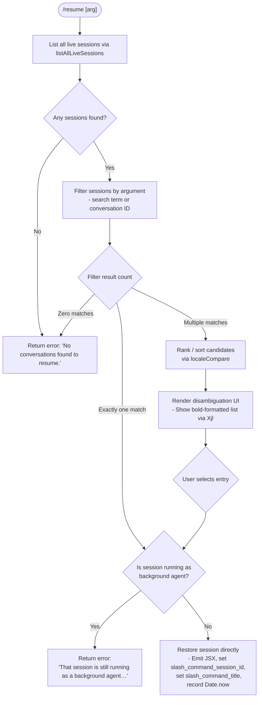

# `/resume`

> Analysis basis: CC v2.1.195 bundle.js (AST extraction + Claude interpretation)
> Minimum version: v2.1.195

---

## Overview

`/resume` (also aliased as `/continue`) allows users to return to a previously saved conversation by supplying a conversation ID or a search term. The command queries all live conversation sessions, filters and ranks candidates matching the user's input, and then either directly restores the selected session or renders a disambiguation UI when multiple matches exist. It also detects running background-agent sessions and blocks resumption of those with an informative error.

---

## Registration

| Field | Value |
|---|---|
| type | `local-jsx` |
| name | `resume` |
| description | `Resume a previous conversation` |
| aliases | `["continue"]` |
| argumentHint | `[conversation id or search term]` |
| module_id | `e8l` |
| load_inline | `true` |
| loc_byte | `12519226` |
| loc_byte_end | `12519423` |
| loc_line | `8381` |
| arbor_handler.name | `Z5f` |
| arbor_handler.fqn | `claude-2.1.195::Z5f` |
| arbor_handler.kind | `AsyncFunction` |
| arbor_handler.resolution_path | `module_id` |
| arbor_handler.n_hits | `0` |

Analysis basis: CC v2.1.195 bundle.js:+12519226

---

## Input Branching

The handler has five or more distinct branches depending on session enumeration results, background-agent state, and match count; a Mermaid flowchart is used.



Analysis basis: CC v2.1.195 bundle.js:+12517756, +12517870, +12518091, +12518281, +12518156, +12518818

---

## Behavioral Spec

### 1. Session enumeration (`sessionLister` / `Cpe`)

```
async function listSessions(options):
    await Promise.resolve()
    sessions = await hht()                   // hydrate session store
    liveSessions = n.listAllLiveSessions()   // returns all persisted sessions
    filter by type == "interactive"          // only interactive sessions
    return liveSessions
```

The enumeration calls `n.listAllLiveSessions` (Analysis basis: CC v2.1.195 bundle.js:+8806612) and narrows to sessions whose type equals `"interactive"` (Analysis basis: CC v2.1.195 bundle.js:+8806703).

---

### 2. Search / filter pass (`filterHandler` / `Zjl`)

```
function filterSessions(sessions, arg):
    normalized = arg.replace(...)            // normalise search string
    candidates = sessions.filter(s =>
        s.id.includes(normalized) OR
        s.title.toLowerCase().includes(normalized.toLowerCase())
    )
    return candidates
```

- `e.filter` is called at bundle byte `+12517756`.
- `t.replace` normalises the raw argument (Analysis basis: CC v2.1.195 bundle.js:+17509774).
- `Vg` (session-ranking helper) is invoked at `+12517786` and again later at `+12518414`.

---

### 3. Background-agent guard

```
function checkNotBackgroundAgent(session):
    if session.isRunningAsBackgroundAgent:
        throw userFacingError(
            "That session is still running as a background agent. " +
            "Open `claude agents` to attach to it, " +
            "or stop it there first to resume here."
        )
```

The exact user-visible message is sourced at Analysis basis: CC v2.1.195 bundle.js:+12517870.

---

### 4. No-match early exit

```
function handleNoMatches():
    return renderError("No conversations found to resume.")
```

Message literal sourced at Analysis basis: CC v2.1.195 bundle.js:+12518281.

---

### 5. Session restoration (`mainHandler` / `Z5f`)

```
async function resumeHandler(input, context):
    sessions = await listSessions(context)
    candidates = filterSessions(sessions, input.arg)

    if candidates.length == 0:
        return handleNoMatches()

    if candidates.length == 1:
        session = candidates[0]
        checkNotBackgroundAgent(session)
        timestamp = Date.now()
        context.set("slash_command_session_id", session.id)  // +12518543
        context.set("slash_command_title", session.title)    // +12518768
        startSession(session, sAe, Hr, Qor)
        return renderJSX(T4.jsx, sessionComponent)           // +12518156

    // Multiple candidates
    sorted = candidates.sort(localeCompare)
    sliced = sorted.slice(0, limit)                          // via GQ +12518668
    return renderDisambiguationUI(sliced, Xjl)               // +12518818
```

Analysis basis: CC v2.1.195 bundle.js:+12518189 (Date.now timestamp), +12518213 (session start via `sAe`), +12518231 (worktree/context init via `Qor`).

---

### 6. Disambiguation UI (`disambiguationRenderer` / `Xjl`)

```
function renderDisambiguationList(candidates):
    for each candidate in candidates:
        line = Ct.bold(candidate.title + candidate.id)   // bold formatting
    return JSX list component
```

`Ct.bold` is called at Analysis basis: CC v2.1.195 bundle.js:+12515572. The UI exposes `sessionNotFound` (literal at `+12515537`) and `multipleMatches` (literal at `+12515608`) state keys for downstream error handling.

---

### 7. Conversation store initialisation (`conversationLoader` / `cAe` → `Lpe`)

On successful match, the conversation store is fully hydrated via `Lpe` (Analysis basis: CC v2.1.195 bundle.js:+13578372). This restores metadata keys including:

| Key | Literal source |
|---|---|
| `summary` | +13586229 |
| `last-prompt` | +13586296 |
| `custom-title` | +13586500 |
| `ai-title` | +13586578 |
| `tag` | +13586648 |
| `agent-name` | +13586709 |
| `agent-color` | +13586783 |
| `mode` | +13586939 |
| `permission-mode` | +13587002 |
| `worktree-state` | +13587160 |
| `fork-context-ref` | +13587931 |

---

### 8. Worktree detection (`worktreeDetector` / `sAe`)

```
async function detectWorktree(context):
    timestamp = Date.now()
    output = spawn("git", ["worktree", "list", "--porcelain"])
    lines = output.split("\n")
    for line in lines:
        if line.startsWith("worktree "):
            path = line.slice(9)           // strip "worktree " prefix (length 9)
            normalizedPath = o_.normalize(path)
            ...
    emit telemetry: tengu_worktree_detection
```

Literals: `"worktree"` at +8794535, `"list"` at +8794546, `"--porcelain"` at +8794553, `"worktree "` prefix at +8794754, slice offset `9` at +8794788.
Analysis basis: CC v2.1.195 bundle.js:+8794526

---

## State & Side Effects

| Item | Detail |
|---|---|
| Telemetry | `tengu_worktree_detection` (+8794635), `tengu_daemon_control` (+17924594), `tengu_transcript_phantom_parent` (+13584971), `tengu_transcript_parent_cycle` (+13589073), `tengu_chain_parent_cycle` (+13562820), `tengu_chain_timestamp_fallback` (+13562969), `tengu_chain_parallel_tr_recovered` (+13564835), `tengu_relink_walk_broken` (+13562326), `tengu_bg_dispatch_sigkill_escalate` (+17885088), `tengu_bg_dispatch_low_mem` (+17885689) |
| App state keys written | `slash_command_session_id` (+12518543), `slash_command_title` (+12518768) |
| Session store hydration | `Lpe` initialises/restores all conversation metadata maps (summaries, titles, tags, modes, worktree state, etc.) |
| Background-agent check | Blocks resume if session is live background agent; surfaces inline message to user |
| Worktree detection | Runs `git worktree list --porcelain` as a side effect; emits `tengu_worktree_detection` telemetry |
| JSX rendering | Produces a `T4.jsx` component for the restored session or a disambiguation list rendered with bold formatting via `Ct.bold` |
| Sound | <!-- TODO: not found in depth-2 traversal; needs --depth 4 --> |
| Hook registration | <!-- TODO: not found in depth-2 traversal; needs --depth 4 --> |

---

## Version History

| Version | Change |
|---|---|
| v2.1.195 | Initial analysis |

---

## Common Mistakes

1. **Resuming a background-agent session directly** — If the target conversation is currently running as a background agent, `/resume` will reject the attempt with a message directing the user to `claude agents`. Stop or detach the agent first.
2. **Ambiguous search terms** — Providing a partial title that matches multiple conversations will show a disambiguation list rather than immediately resuming. Use a full session UUID to bypass disambiguation.
3. **Confusing `/resume` and `/continue`** — Both are identical aliases; `continue` is registered as an alias of `resume` and invokes the same handler.
4. **Expecting `/resume` to work across devices** — Session list is sourced from local live sessions via `listAllLiveSessions`; sessions not present in the local store will not appear.
5. **Missing argument** — Calling `/resume` with no argument applies an empty filter, which typically returns all sessions and forces disambiguation rather than resuming the most recent session automatically.

---

## Appendix — Identifier Mapping

> For bundle debugging only. Identifiers change across versions.

| Identifier | Role |
|---|---|
| `Z5f` | Main async handler for `/resume` (arbor_handler) |
| `Zjl` | Session filter / search function |
| `Cpe` | Session enumerator (wraps `listAllLiveSessions`) |
| `sAe` | Worktree detection and session start helper |
| `Wr` | Child-process spawner (used by `sAe`) |
| `B2e` | Process execution wrapper |
| `xe` | Error formatting / reporting utility |
| `Zr` | Error constructor wrapper |
| `ut` | String conversion utility |
| `qi` | Traffic/telemetry routing helper |
| `rSs` | Telemetry sub-router |
| `BMu` | History queue manager (shift/push) |
| `ye` | String helper (String cast) |
| `Vg` | Session ranking / comparison helper |
| `GQ` | Candidate sorting and slicing (disambiguation preparation) |
| `Xjl` | Disambiguation UI renderer (uses `Ct.bold`) |
| `cAe` | Conversation data loader (delegates to `Lpe`) |
| `Lpe` | Conversation store hydration (restores all metadata maps) |
| `aAe` | Alternate conversation loader path |
| `Gsc` | Store assembly helper |
| `dem` | Directory/path resolver for conversation files |
| `oZt` | Context builder (joins paths, builds worktree context) |
| `Wsc` | File-system conversation scanner |
| `XNe` | Conversation entry processor |
| `z6o` | Directory recursive reader |
| `KQt` | Conversation cache getter/setter |
| `B7e` | Conversation binary/buffer parser |
| `yem` | Conversation file reader sub-routine |
| `Qor` | Worktree/context initialiser |
| `Hr` | Home directory resolver |
| `u0` | Path utility |
| `Hte` | Daemon status file reader |
| `LZl` | Daemon status and worktree poller |
| `Vs` | AsyncLocalStorage store accessor |
| `WXt` | Daemon status path builder |
| `o_` | Path normaliser (NFC) |
| `yM` | UUID pattern tester |
| `goe` | Conversation list getter |
| `DZf` | Store initialiser |
| `eW` | Store entry wrapper |
| `qXe` | Message content parser |
| `Uin` | Content type validator |
| `$in` | Content replacement helper |
| `pA` | Persistence adapter |
| `dTe` | Flag filter (bitmask 64/32) |
| `msc` | Session map manager |
| `qZf` | Dependency graph walker |
| `No` | Notification helper |
| `Nn` | Node event emitter wrapper |
| `lem` | Binary message log parser |
| `cem` | Conversation event marshaller |
| `mve` | Multi-version parser dispatcher |
| `c1u` | Parser format selector |
| `u1u` | V1 message parser |
| `p1u` | V2 message parser |
| `d1u` | V3 message parser |
| `qo` | Event emitter binder |
| `lAe` | Session chain resolver |
| `YZf` | Timestamp validator |
| `JZf` | Session chain sorter |
| `KZf` | Session chain walker |
| `$sc` | Session chain accumulator |
| `Eht` | Message mapper |
| `sGo` | Conversation text formatter |
| `lXt` | Conversation content extractor |
| `Ll` | Markdown-line parser |
| `lGo` | Content type filter |
| `XZf` | Image/document type checker |
| `QZf` | Array-type content checker |
| `rAe` | Rate-limit state reader |
| `iPe` | Permission state reader |
| `Hlr` | Session header reader |
| `_lr` | Session header value extractor |
| `iGo` | Session date parser |
| `U7e` | Timestamp field parser |
| `T` | Shell-command executor / message builder |
| `Me` | JSON stringify wrapper |
| `Lc` | Log-line formatter |
| `PYc` | File content loader |
| `RYc` | Working-directory resolver |
| `SOu` | String coercion utility |
| `gd` | Daemon directory locator |
| `on` | Event listener binder |
| `EOu` | Event bus connector |
| `HTs` | Process stdio handler |
| `U0r` | Spawn option builder |
| `$0r` | Environment variable builder |
| `B0r` | Platform executable resolver |
| `Ibs` | Number validation guard |
| `cRt` | Child-process runner |
| `N0r` | Reflect apply wrapper |
| `tTs` | Exit event listener |
| `Tbs` | Timeout race helper |
| `Cbs` | Process kill helper |
| `Abs` | stdout data collector |
| `bbs` | SIGKILL escalation handler |
| `Zbs` | Promise.all process runner |
| `fRt` | Process handle finaliser |
| `Xbs` | Pipe attacher |
| `Qbs` | Signal set manager |
| `xbs` | v0r bind helper |
| `p` | Forced-shutdown handler |
| `YT` | Shutdown logger |
| `u` | Abort controller manager |
| `Le` | Oe-wrapper (feature-ok path) |
| `ke` | W-wrapper (feature-bad path) |
| `W` | Core telemetry emitter |
| `Oe` | Secondary telemetry emitter |
| `L` | Away-summary controller |
| `MKe` | Rate-limit state getter |
| `PVt` | Background task tracker |
| `URe` | Loop-state checker |
| `jCm` | Rfr helper |
| `mkc` | Message array accessor (at) |
| `gkc` | Rfr-state getter |
| `K5t` | Away-summary generator |
| `Ccc` | UUID generator |
| `w` | Blurred/focused state tracker |
| `WY` | Window focus state |
| `jXe` | ais helper |
| `k` | File watcher / interval manager |
| `Z` | File cleanup helper |
| `Hse` | File lstat/rm/read helper |
| `AUl` | File unlink helper |
| `ee` | Voice session state holder |
| `X` | Voice recording manager |
| `V` | Write-debounce timer |
| `M` | OAuth / API request handler |
| `re` | Token parser |
| `zge` | JSON.parse wrapper |
| `Bt` | JSON.parse guard |
| `aem` | Buffer comparison helper |
| `Bsc` | Buffer sub-array accessor |
| `ne` | Buffer comparison set |
| `K` | Buffer/set dual-use identifier |
| `Y` | Push-queue / zZt caller |
| `x` | Split/index/slice pipeline |
| `P` | Session-pool sweep manager |
| `h` | Worker-pool / memory monitor |
| `d` | Supervisor manager |
| `I` | Math-based layout helper |
| `A` | URL/userinfo helper |
| `m` | Array-filter pipeline |
| `g` | Flat-map source |
| `_` | Flat-map source (alt) |
| `o` | Pad-end formatter |
| `E` | MCP SDK connector |
| `D` | Write-queue dispatcher |
| `$` | Rate-limit event emitter |
| `c` | yn-wrapper |
| `f` | o8 path normaliser |
| `H` | o.values / O.kill controller |
| `O` | Session O-handler |
| `v` | State version tracker |
| `z` | MCP update applicator |
| `j` | i/O session pair |
| `Fo` | File open helper |
| `a` | Response.json / age wrapper |
| `age` | JSON.stringify adapter |
| `Rt` | u0 caller |
| `$Vl` | Store value getter |
| `X$` | kc caller |
| `yn` | c-inner helper |
| `o8` | Path normaliser (windows) |
| `pA` | Persistence adapter (dup) |
| `DZf` | Store initialiser (dup) |
| `Xh` | File existence checker |
| `UB` | u0 home-dir caller |
| `OL` | Directory lister |
| `kS` | Path segment slicer |
| `Ybe` | Post-restore hook |
| `q6o` | Conversation entry sub-loader |

---

Note: index built via Arbor fallback; some signals (telemetry, literals) may be missing — see arbor-fallback.js.