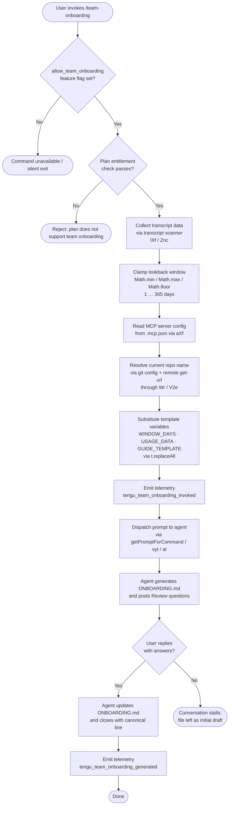

# `/team-onboarding`

> Analysis basis: CC v2.1.195 bundle.js (AST extraction + Claude interpretation)
> Minimum version: v2.1.195

---

## Overview

`/team-onboarding` is a `prompt`-type slash command that analyzes the invoking user's local Claude Code conversation transcripts from a configurable lookback window, then co-authors a Markdown onboarding guide (`ONBOARDING.md`) tailored to the team's actual usage patterns. The resulting guide is designed to be pasted directly into Claude Code by a new teammate for an interactive, self-guided onboarding tour. The command is gated behind the `allow_team_onboarding` feature flag and is only offered to accounts with sufficient plan entitlements.

---

## Registration

| Field | Value |
|---|---|
| type | `prompt` |
| name | `team-onboarding` |
| description | `Help teammates ramp on Claude Code with a guide from your usage` |
| isHidden | `false` |
| handler_method | `getPromptForCommand` |
| handler_method_start (byte) | `13317446` |
| handler_method_end (byte) | `13318156` |
| loc_byte | `13317083` |
| loc_byte_end | `13318157` |
| loc_line | `9219` |
| prompt_body.length | `4539` characters |
| prompt_body.trace | `identifier→l (local→1 ext vars)` |
| arbor_handler.name | `getPromptForCommand` |
| arbor_handler.kind | `Method` |
| arbor_handler.fqn | `claude-2.1.195::getPromptForCommand` |
| arbor_handler.resolution_path | `direct` |
| arbor_handler.n_hits | `2` |
| `handler_method_start` | `13317446` |
| `handler_method_end` | `13318156` |

Analysis basis: CC v2.1.195 bundle.js:+13317083

---

## Input Branching

The handler has more than three distinct paths: feature-flag gate → plan entitlement check → transcript scanning → window-day clamping → template substitution → prompt dispatch. A flowchart best represents this shape.



Analysis basis: CC v2.1.195 bundle.js:+13317446 – +13318156

---

## Behavioral Spec

### 1. Feature-Flag and Plan Gate

Before any transcript work begins, the handler checks two preconditions.

```
function checkEntitlement(appState):
    if not featureFlagEnabled(appState, "allow_team_onboarding"):   // bundle.js:+10443308
        return BLOCKED
    accountTier = resolveAccountTier(appState)                       // bundle.js:+3376226
    if accountTier not in {TEAM, ENTERPRISE, PROSUMER_OAUTH}:
        return BLOCKED
    return ALLOWED
```

The literal string `"allow_team_onboarding"` is the flag key checked at call site `vyt → Fs` (bundle.js:+10443308). Account tier strings observed in the implementation include `"team"`, `"enterprise"`, and `"prosumer_oauth"` (bundle.js:+3376226, +3376191, +3376239).

Analysis basis: CC v2.1.195 bundle.js:+10443305

---

### 2. Transcript Collection (lXf / Znc)

`lXf` orchestrates transcript discovery; `Znc` does the per-file parsing.

```
function collectTranscripts(projectsDir, windowDays):
    cutoffTimestamp = Date.now() - windowDays * 24 * 60 * 60 * 1000  // bundle.js:+13317795
    transcriptFiles = readdir(projectsDir)                             // bundle.js:+13306041
        .filter(f => extname(f) == ".jsonl")                           // bundle.js:+13306128
    results = []
    for each file in transcriptFiles (parallel via Promise.all):       // bundle.js:+13306147
        stat = stat(file)
        if not stat.isFile(): continue
        rawLines = readFile(file, "utf-8")                             // bundle.js:+13306384
        lines = rawLines.split("\n", limit=10)                         // bundle.js:+13306524
        sessionDescriptor = extractDescriptor(lines, file)
        results.push(sessionDescriptor)
    return results.filter(d => d.timestamp >= cutoffTimestamp)
```

Key parsing details inside `Znc`:
- Looks for the pattern `"name":"mcp__` (bundle.js:+13306707) to count MCP tool calls per session.
- Looks for `"content":[` (bundle.js:+13307057) to locate message bodies.
- Uses regex exec via `nXf`, `rXf`, and `oXf` to extract session title, PR numbers, and first user message (bundle.js:+13306848, +13306904, +13307079).
- Only the first 10 lines of each transcript file are read to keep scanning fast (literal `10` at bundle.js:+13306524).
- Transcript directory is computed from the projects config path via `u3 → N1` (bundle.js:+13308466).

Analysis basis: CC v2.1.195 bundle.js:+13308480

---

### 3. MCP Server Config Reader (aXf)

```
function readMcpConfig(workspaceRoot):
    configPath = join(workspaceRoot, ".mcp.json")              // bundle.js:+13308158
    raw = readFile(configPath, "utf8")                         // bundle.js:+13308134 / +13308171
    parsed = JSON.parse(raw)                                   // via Bt
    servers = parsed["mcpServers"] ?? {}                       // bundle.js:+13308214
    return servers
```

On parse failure `Cn` (error logger) captures the error and the function returns an empty object; this is a soft failure that does not abort the command (bundle.js:+13308310).

Analysis basis: CC v2.1.195 bundle.js:+13308597

---

### 4. Repo Name Resolution (Wr / V2e)

```
function resolveCurrentRepo(cwd):
    // Try git config first
    gitName = runCommand("git", ["config", "user.name"], cwd)    // bundle.js:+13308797
    remoteUrl = runCommand("git", ["remote", "get-url", "origin"], cwd)  // bundle.js:+13308862
    repoName = parseRepoNameFromRemoteUrl(remoteUrl)             // V2e: bundle.js:+13308961
    if repoName is null:
        repoName = basename(cwd)                                 // bundle.js:+13308969
    return repoName
```

`V2e` trims the remote URL, strips a `git/` prefix where present (bundle.js:+1161759), lowercases, and splits on `/` to extract the final path segment as the repo slug (bundle.js:+1161787, +1161842).

Analysis basis: CC v2.1.195 bundle.js:+13308778

---

### 5. Window-Day Clamping and Template Substitution

```
function buildPromptPayload(rawTranscripts, windowDaysInput):
    windowDays = Math.floor(                    // bundle.js:+13317667
        Math.max(1,                             // bundle.js:+13317658
            Math.min(365, windowDaysInput)      // bundle.js:+13317649
        )
    )
    // Minimum: 1 day; Maximum: 365 days (literals at bundle.js:+13317692 / +13317695)

    usageData = JSON.stringify({
        sessionDescriptors: rawTranscripts,
        generatedBy:        currentUserName,
        currentRepo:        resolvedRepoName,
        mcpServers:         mcpConfig,
        totalSessions:      rawTranscripts.length
    })

    prompt = basePromptTemplate
        .replaceAll("{{WINDOW_DAYS}}", String(windowDays))   // bundle.js:+13317893 / +13317924
        .replaceAll("{{USAGE_DATA}}", usageData)              // bundle.js:+13317981
        .replaceAll("{{GUIDE_TEMPLATE}}", guideTemplate)      // bundle.js:+13317946

    return prompt
```

- Minimum lookback window: **1 day** (bundle.js:+13317692)
- Maximum lookback window: **365 days** (bundle.js:+13317695)
- The current Unix timestamp is captured at invocation time (`Date.now`, bundle.js:+13317795) to anchor relative day calculations.

Analysis basis: CC v2.1.195 bundle.js:+13317649

---

### 6. Prompt Dispatch (vyt → at)

```
function dispatchPrompt(promptText, sessionContext):
    emitTelemetry("tengu_team_onboarding_invoked", {...})   // bundle.js:+13317706
    queryInterface = buildQueryInterface(promptText)         // vyt → qi: bundle.js:+10443287
    shareTelemetry("tengu_flint_harbor_share", ...)         // bundle.js:+10443370
    result = at(queryInterface, sessionContext)              // bundle.js:+10443367
    emitTelemetry("tengu_team_onboarding_generated", {...}) // bundle.js:+13318025
    return result
```

`at` is the shared prompt-dispatch routine used across first-party prompt commands (literal `"firstParty"` at bundle.js:+3349140). It handles session deduplication via `hxe` / `VKr` sets and event emission via `zte.emit` (bundle.js:+3349634).

Analysis basis: CC v2.1.195 bundle.js:+13318002

---

### 7. Agent-Side Guide Generation (Prompt Behavior)

The 4539-character system prompt (bundle.js:+13317083) instructs the agent to perform the following steps in strict order:

**Step 0 — Immediate acknowledgment (before any reasoning):**  
The agent must emit an acknowledgment blockquote referencing the `{{WINDOW_DAYS}}` value as its very first visible output — no tool calls, no chain-of-thought, no classification work before this line. This is an explicit latency-management instruction: the user sees a response within milliseconds.

**Step 1 — Session classification into work-type taxonomy:**  
The agent reads the `sessionDescriptors` array and classifies each session into one of seven canonical task types: `build_feature`, `debug_fix`, `improve_quality`, `analyze_data`, `plan_design`, `prototype`, or `write_docs`. Review sessions are re-attributed to whatever artifact is being reviewed (e.g., a code review falls under `improve_quality`). The agent picks the top 3–5 types with rough percentage breakdowns. In the rendered guide, labels appear in Title Case with spaces (e.g., "Build Feature"). If too few sessions exist, the breakdown is left as a TODO placeholder.

**Step 2 — Workspace and MCP enumeration:**  
Using `currentRepo` and sibling workspace directories, the agent lists the relevant repositories. For each MCP server in `mcpServers`, it infers purpose and access instructions from the `name` and optional `urlOrigin` fields.

**Step 3 — Guide generation and file write:**  
The agent renders the guide following the `{{GUIDE_TEMPLATE}}` structure into `ONBOARDING.md`. It fills in real numbers from `usageData` (no placeholder values), uses `generatedBy` as the author name (omitting it if absent), and renders ASCII bar charts using `█` (filled) and `░` (empty) characters at 20 characters wide. A specific HTML comment instruction at the template's bottom is preserved verbatim.

**Step 4 — Review dialogue (first turn close):**  
After the code block containing the guide, the agent appends a `---` rule and a `**Review**` heading, then poses exactly three numbered questions: team name confirmation, optional starter task link, and additional team tips not already captured in `CLAUDE.md`.

**Step 5 — Revision and canonical close:**  
After the user answers, the agent updates `ONBOARDING.md` with the provided information and closes with the exact canonical sentence (beginning with "Saved to `ONBOARDING.md`…") — not paraphrased. Subsequent edit requests continue to be applied to the file.

Analysis basis: CC v2.1.195 bundle.js:+13317446

---

## State & Side Effects

| Item | Detail |
|---|---|
| Telemetry: `tengu_flint_harbor_prompt` | Fired at prompt dispatch entry (bundle.js:+13317483) |
| Telemetry: `tengu_team_onboarding_invoked` | Fired after window clamping, before agent call (bundle.js:+13317706) |
| Telemetry: `tengu_team_onboarding_generated` | Fired after agent returns result (bundle.js:+13318025) |
| Telemetry: `tengu_flint_harbor_share` | Fired via `vyt → Fs` path (bundle.js:+10443370) |
| Telemetry: `tengu_config_lock_contention` | May fire if config lock is slow (bundle.js:+14069271) |
| Telemetry: `tengu_config_stale_write` | May fire on stale config write (bundle.js:+14069407) |
| Telemetry: `tengu_config_parse_error` | Fires if config JSON is unparseable (bundle.js:+14073004) |
| Telemetry: `tengu_config_auto_repaired` | Fires when config is auto-repaired from cache (bundle.js:+14069784) |
| Telemetry: `tengu_config_auth_loss_prevented` | Fires when a write is blocked to protect auth fields (bundle.js:+14070114) |
| Telemetry: `tengu_config_fallback_write` | Fires on global config fallback write path (bundle.js:+14068887) |
| Telemetry: `tengu_daemon_control` | Background daemon lifecycle event (bundle.js:+17924594) |
| File write | Creates/overwrites `ONBOARDING.md` in the working directory after the first review dialogue turn |
| Feature flag check | Reads `allow_team_onboarding` from account entitlements before proceeding (bundle.js:+10443308) |
| Config lock acquisition | Uses file-system lock during config reads/writes; max contention window: 60000 ms (bundle.js:+14070320) |
| Config backups | Config backup directory key: `"backups"` (bundle.js:+14071158); up to 5 backups retained (bundle.js:+14070575) |
| Session deduplication | Prompt session IDs tracked in `hxe` / `VKr` sets to prevent duplicate dispatch (bundle.js:+3356173, +3353379) |
| Random UUID | New session UUID generated via `FKr.randomUUID` per invocation (bundle.js:+3349266) |
| appState changes | Account-tier and feature-flag fields read (not written) from appState during entitlement check |
| Sound | None observed in depth-2 traversal |

---

## Common Mistakes

1. **Invoking on an ineligible plan:** `/team-onboarding` silently fails or is not surfaced if the account tier is not `team`, `enterprise`, or `prosumer_oauth`, or if the `allow_team_onboarding` feature flag is off. Verify account plan before reporting the command as missing.

2. **No transcripts found:** If the local `~/.claude/projects/` directory contains no `.jsonl` files, or all transcripts are older than the lookback window, `sessionDescriptors` will be empty and the agent will leave the work-type breakdown as a TODO placeholder. Run at least one Claude Code session before invoking.

3. **Guide template placeholders left unfilled:** The variables `{{WINDOW_DAYS}}`, `{{USAGE_DATA}}`, and `{{GUIDE_TEMPLATE}}` are substituted in the handler before the prompt is dispatched. If the agent's response contains any of these literal strings, it indicates a substitution failure in `t.replaceAll` (bundle.js:+13317893), not an agent error.

4. **Skipping the Review dialogue:** The agent deliberately defers Team Tips and the starter task to the Review step. Pressing ahead without answering the three Review questions will leave those sections as TODO placeholders in `ONBOARDING.md`.

5. **Expecting an immediate file on disk:** `ONBOARDING.md` is not written until after the Review dialogue's first turn is completed. The file does not exist at the end of the agent's initial response.

6. **Window-day argument ignored silently:** The lookback window is clamped to 1–365 days. Values outside this range are silently adjusted, not rejected; callers should not assume their raw input was used.

---

## Version History

| Version | Change |
|---|---|
| v2.1.195 | Initial analysis; command registered at bundle.js:+13317083 with `getPromptForCommand` handler (Arbor direct resolution) |

---

## Appendix — Identifier Mapping

> For bundle debugging only. Identifiers change across versions.

| Identifier | Role |
|---|---|
| `__handler_team-onboarding` | Synthetic BFS entry node for the command handler; resolved to `getPromptForCommand` by Arbor |
| `at` | Shared first-party prompt dispatch routine |
| `lUt` | Helper called by prompt dispatch (exact role: <!-- TODO: not found in depth-2 traversal; needs --depth 4 -->) |
| `cUt` | Helper called by prompt dispatch (exact role: <!-- TODO: not found in depth-2 traversal; needs --depth 4 -->) |
| `f6` | Intermediate dispatch layer called by `at` |
| `p6` | Session state initialization called by `f6` and `WKr` |
| `D3` | Session construction helper calling `gOd`, `Lm`, `bhe` |
| `bxn` | Session deduplication check using `hxe` / `VKr` sets |
| `WKr` | Session creation and event emitter setup |
| `y4e` | Sub-helper of `WKr` for session labeling |
| `a6` | Random hex ID generator using `Njo.randomBytes` (32 bytes → hex) |
| `Me` | JSON serialization wrapper around `JSON.stringify` |
| `f1d` | Post-session-creation hook |
| `JKr` | Prompt payload builder |
| `ICi` | Sub-helper of `JKr` calling `zot` |
| `Mr` | Sub-helper of `JKr` calling `d8` |
| `j1i` | Sub-helper of `JKr` |
| `t3` | Set-membership guard using `z0u` |
| `kg` | Telemetry metadata builder calling `Rme`, `Mt`, `wa` |
| `Mt` | API message constructor using `qt`, `S0`, `Mjo`, `oTt`, `Date.now`, `Csm` |
| `W` | Utility / environment accessor |
| `gn` | Config file writer orchestrator |
| `xZt` | Atomic file write with lock (using `s.mkdirSync`, `s.statSync`, `s.copyFileSync`, `s.unlinkSync`) |
| `t` | Filesystem abstraction layer |
| `qt` | Internal config path resolver |
| `s` | Filesystem stream / lock helper |
| `r` | Filesystem module reference |
| `i` | Stream / resource handle |
| `Osi` | Config object merger using `I3r` + `Object.assign` |
| `I3r` | Config merge sub-helper calling `Psi` |
| `T` | Prompt/token content builder |
| `RYc` | API request constructor using `w1`, `eAr`, `Drs` |
| `e` | Generic string/array variable (context-dependent) |
| `Lc` | Path/string truncation utility |
| `jXe` | Helper calling `ais` |
| `PYc` | File content loader with byte-length check using `Buffer.byteLength` |
| `on` | Error / log event emitter |
| `oTt` | Config file reader using `r.readFileSync` and `JSON.parse` |
| `Bt` | JSON.parse wrapper |
| `v5` | String prefix stripper (`e.startsWith` / `e.slice`) |
| `Ojo` | Directory listing helper using `readdirStringSync` |
| `Ujo` | Path join helper using `bE.join` + `tr` |
| `m` | Array filter utility using `thr` and `Array.isArray` |
| `sTt` | Transcript stat helper |
| `n` | Lowercase normalizer (`i.toLowerCase`) |
| `v` | String prefix check |
| `y` | Transcript session parser dispatching to `dVe` |
| `dVe` | Session descriptor extractor (reads tool counts, MCP names, first message) |
| `I` | Slice/pagination utility using `Math.max` / `Math.floor` |
| `M` | HTTP request handler (OAuth / gateway routes) |
| `A` | Userinfo fetch helper |
| `aRt` | Atomic file write with fsync and rename |
| `Gd` | Realpath resolver using `e.realpathSync` |
| `u` | FS stat / symlink helper |
| `Cn` | Error logger / silent error capture |
| `ZZe` | Extended attribute / xattr error suppressor |
| `lAs` | `Object.defineProperty` wrapper for file metadata |
| `sUe` | Config value accessor |
| `Djo` | Config entries iterator (`Object.entries`) |
| `wZt` | Timestamp utility for config writes (`Date.now`) |
| `vZt` | Config read-back validator |
| `Mcr` | Global config save with lock calling `aRt` |
| `Oe` | UI / React render helper calling `OJe` |
| `OJe` | Root UI component |
| `lXf` | Transcript collection orchestrator |
| `Hr` | Home directory resolver calling `u0` |
| `u0` | OS home directory accessor |
| `u3` | Projects directory path builder |
| `N1` | Config path join helper |
| `kS` | Relative path formatter |
| `vDu` | Absolute offset calculator using `Math.abs` |
| `Znc` | Per-transcript-file parser (reads `.jsonl`, extracts session descriptors) |
| `qo` | Error event emitter calling `on` |
| `o` | String padding helper |
| `c` | File stat result object |
| `yn` | File type classifier |
| `l` | Transcript file line reader / session log reader |
| `LZl` | Session log entry decoder |
| `p` | Process / abort controller |
| `YT` | Process exit helper |
| `aXf` | MCP server config reader (reads `.mcp.json`) |
| `iXf` | Additional context collector (role: <!-- TODO: not found in depth-2 traversal; needs --depth 4 -->) |
| `Wr` | Git subprocess runner (executes `git config user.name` and `git remote get-url`) |
| `B2e` | Child process spawner |
| `HTs` | Process argument builder for Windows (`cmd /q`) |
| `U0r` | Async task scheduler calling `aTs` |
| `$0r` | Promise-based process wait using `pOu` |
| `B0r` | Output buffer accumulator calling `gOu` |
| `Ibs` | Numeric validation guard (`Number.isFinite`) |
| `cRt` | Child process error handler |
| `N0r` | Reflect.apply wrapper |
| `tTs` | Process event listener binder (`e.on("exit")`) |
| `Tbs` | Timeout-wrapped promise using `Promise.race` |
| `Cbs` | Process kill handler using `e.kill` |
| `Abs` | stdout stream handler |
| `bbs` | Kill signal sender |
| `Zbs` | Parallel process output collector using `Promise.all` |
| `fRt` | Process stdio finalizer calling `H0r` |
| `Xbs` | stdout pipe connector |
| `Qbs` | stderr collector using `zbs.default` |
| `xbs` | Stream binder using `v0r.bind` |
| `SOu` | String coercion for process output |
| `gd` | Process output sanitizer |
| `EOu` | Error event handler calling `on` |
| `xe` | Essential-traffic HTTP client |
| `Zr` | HTTP error constructor |
| `ut` | String coercion utility |
| `qi` | HTTP request builder |
| `BMu` | Request queue manager (`Tpn.shift` / `Tpn.push`) |
| `V2e` | Remote URL parser for repo name extraction |
| `QOu` | URL host extractor calling `yi` |
| `yi` | String index/slice helper |
| `vyt` | Team-onboarding prompt dispatch entry (calls `qi`, `Fs`, `jS`, `at`) |
| `Fs` | Flint Harbor share emitter (checks `allow_team_onboarding` flag) |
| `HNi` | Flint Harbor notification helper calling `g6` |
| `g6` | Notification payload builder using `TF`, `_Ut`, `L_e` |
| `TF` | Authentication tier resolver calling `HUt` |
| `HUt` | Auth tier classifier returning `"third_party_provider"`, `"custom_base_url"`, `"no_auth"`, etc. |
| `y_e` | Auth tier fallback helper calling `ut` |
| `jS` | Session JavaScript helper calling `js` |

---

Note: index built via Arbor fallback; some signals (telemetry, literals) may be missing — see arbor-fallback.js.