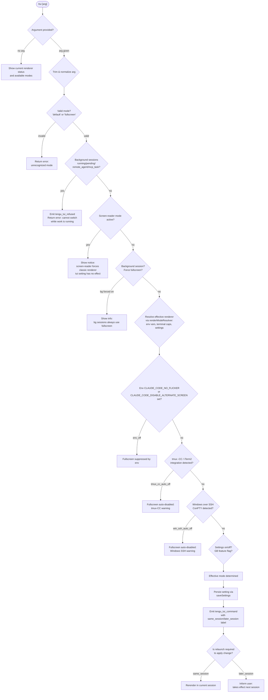

# `/tui`

> Analysis basis: CC v2.1.195 bundle.js (AST extraction + Claude interpretation)
> Minimum version: v2.1.195

---

## Overview

The `/tui` command lets the user switch the terminal UI renderer between `default` (classic inline) and `fullscreen` (alternate-screen) modes. It validates the requested mode against a set of environmental and session constraints—such as active background tasks, screen-reader mode, and terminal-type detection—and, when all checks pass, persists the new setting and relaunches the CLI into the chosen renderer. The command is a `local-jsx` command whose handler (`TWf`) runs as an async function resolved via module `fKl`.

---

## Registration

| Field | Value |
|---|---|
| type | `local-jsx` |
| name | `tui` |
| description | `Set the terminal UI renderer (default \| fullscreen)` |
| argumentHint | `[default\|fullscreen]` |
| module_id | `fKl` |
| load_inline | `true` |
| loc_byte | `12723541` |
| loc_byte_end | `12723723` |
| loc_line | `8697` |
| arbor_handler.name | `TWf` |
| arbor_handler.fqn | `claude-2.1.195::TWf` |
| arbor_handler.kind | `AsyncFunction` |
| arbor_handler.resolution_path | `module_id` |
| arbor_handler.n_hits | `0` |

Analysis basis: CC v2.1.195 bundle.js:+12723541

---

## Input Branching

The handler has five or more distinct decision paths (argument validation → background-session guard → screen-reader guard → env/terminal-capability checks → effective-renderer resolution → relaunch or UI update), so a Mermaid flowchart is used.



---

## Behavioral Spec

### Handler Entry Point — `tuiCommandHandler` (bundle identifier: `TWf`)

The handler is an `AsyncFunction` resolved via module `fKl` through `module_id` resolution (Arbor path: `module_id`).

Analysis basis: CC v2.1.195 bundle.js:+12721159

```
async function tuiCommandHandler(commandInput, appContext):
    arg = commandInput.trim()                          # +12721159

    # Read current effective renderer state
    rendererState = resolveEffectiveRenderer(appContext)   # Us at +12721184

    # If no argument, display status and return
    if arg is empty:
        display current rendererState info
        return

    # Validate argument against allowed modes
    allowedModes = ["default", "fullscreen"]           # +12721271, +12721317
    if arg not in allowedModes:
        return error("unrecognized mode")

    # Guard: reject if background work is in-flight
    activeTasks = getActiveTasks(appContext)           # Object.values at +12721976
    for task in activeTasks:
        if task.status in ["running", "pending", "remote_agent", "mcp_task"]:  # +12722015..+12722083
            emit("tengu_tui_refused")                  # +12722104
            return error(
                "Cannot switch renderers while work is running in the background"
                " — wait for it to finish (or stop it via /tasks), then run /tui again."
            )                                          # +12722145

    # Guard: screen-reader mode
    if isScreenReaderMode(appContext):                 # GM at +12721665
        display notice(
            "Screen-reader mode always uses the classic renderer, "
            "so the tui setting has no effect while it is active."
        )                                              # +12721679
        return

    # Guard: background session always forces fullscreen
    if isBackgroundSession(appContext):                # Xs at +12721455
        display info(
            "Background sessions always use the fullscreen renderer "
            "so scrolling and mouse work when attached. "
            "The tui setting applies to sessions started directly with `claude`."
        )                                              # +12721469
        return

    # Persist the new setting
    saveSettings(arg)                                  # Mr at +12721852

    # Determine whether the change applies now or next session
    label = computeSessionLabel(appContext)            # same_session/later_session +12723024/+12723039

    # Emit telemetry
    emit("tengu_tui_command", {
        mode: arg,
        session_label: label,
        uptime: Math.round(process.uptime()),          # +12722669, +12722680
    })                                                 # +12722578

    # Render JSX result panel
    return renderResultPanel(arg, label, rendererState)  # LK.jsx at +12722961
```

### Effective Renderer Resolution — `resolveEffectiveRenderer` (bundle identifier: `Us`)

Determines the actual renderer mode in effect by consulting multiple override layers in priority order.

Analysis basis: CC v2.1.195 bundle.js:+3563295

```
function resolveEffectiveRenderer(appContext):
    # Layer 1: background-session forces fullscreen ("bg_forced_on")
    if isBackgroundSession():                          # +3563367 "bg"
        return { mode: "fullscreen", reason: "bg_forced_on" }  # +3564369

    # Layer 2: screen-reader auto-disables fullscreen ("sr_auto_off")
    if isScreenReaderModeEnabled():                    # GM at +3563384
        return { mode: "default", reason: "sr_auto_off" }     # +3564398

    # Layer 3: env var CLAUDE_CODE_NO_FLICKER or DISABLE_ALTERNATE_SCREEN → off
    if envVarSuppressesFullscreen():
        return { mode: "default", reason: "env_off" }         # +3564427

    # Layer 4: env var CLAUDE_CODE_FORCE_FULLSCREEN_UPSELL → on
    if envVarForcesFullscreen():
        return { mode: "fullscreen", reason: "env_on" }       # +3564477

    # Layer 5: tmux -CC (iTerm2 integration) auto-disables fullscreen
    if isTmuxCCMode():
        # message: "fullscreen disabled: tmux -CC (iTerm2 integration mode) detected
        #           · set CLAUDE_CODE_NO_FLICKER=1 to override"  (+3563523)
        return { mode: "default", reason: "tmux_cc_auto_off" }  # +3564502

    # Layer 6: Windows over SSH (ConPTY) auto-disables fullscreen
    if isWindowsOverSSH():
        # message: "fullscreen disabled: Windows over SSH (ConPTY re-rendering) detected
        #           · set CLAUDE_CODE_NO_FLICKER=1 to override"  (+3563709)
        return { mode: "default", reason: "win_ssh_auto_off" }  # +3564536

    # Layer 7: user settings persisted value
    if userSettingsValue == "fullscreen":              # +3563857
        return { mode: "fullscreen", reason: "settings_on" }   # +3564595
    if userSettingsValue == "default":                 # +3563883
        return { mode: "default", reason: "settings_off" }     # +3564629

    # Layer 8: growthbook feature flag downsell
    if downsellFlagOn():
        return { mode: "fullscreen", reason: "downsell_on" }   # +3564702

    # Layer 9: GB flag final
    if gbFlagOn():
        return { mode: "fullscreen", reason: "gb_on" }         # +3564767
    return { mode: "default", reason: "gb_off" }               # +3564775
```

### Relaunch Sequence — `relaunchForRendererSwitch` (bundle identifier: `CNe`)

When a renderer switch requires restarting the process, this async function orchestrates teardown and `spawnSync` relaunch.

Analysis basis: CC v2.1.195 bundle.js:+12716444

```
async function relaunchForRendererSwitch(options):
    # Resolve current binary path and version directory
    binaryPath = resolveClaudeBinaryPath()             # x2 at +12716444
    # binary is under ~/.local/share/claude/versions/bin  (+7203953, +7203962, +8756099, +8756108, +7204033)

    # Save state with --resume flag for reattachment    # +12716590
    saveResumeState()

    # Teardown current Ink/TUI instance
    teardownInkRenderer()                              # cje at +12716618
    # writes ANSI escape \x1b7 / \x1b8 save/restore   # +3909525, +3909536

    # Start new render loop for transition animation
    startTransitionAnimation()                         # H9n at +12716624

    # Race: analytics flush vs 30-second hard timeout
    await Promise.race([
        flushAnalytics(),                              # yXe at +12716708
        timeout(30000, "flush timeout (relaunch)"),   # +12716657, +12716663
    ])

    # Race: cleanup vs 2-second timeout
    await Promise.race([
        runCleanup(),                                  # dje at +12716764
        timeout(2000, "cleanup timeout"),              # +12716714, +12716719
    ])

    # Analytics flush timeout label                    # +12716775 "analytics flush timeout"

    # Build argv for relaunch, propagating --add-dir, --effort,
    # --permission-mode, --allow-dangerously-skip-permissions flags
    newArgv = buildRelunchArgv(options)               # iKl at +12717092
    # uses bun:ffi on macOS (/usr/lib/libSystem.B.dylib)  # +12715694, +12715738
    # or libc.so.6 on Linux                           # +12715767

    # Remove all signal listeners, then re-register for clean handoff
    process.removeAllListeners(...)                    # +12717159
    process.on("beforeExit", ...)                     # +12717189, +12717305
    process.on("exit", ...)                           # +12717346

    # Exec relaunch via spawnSync with stdio: inherit
    result = lKl.spawnSync(binaryPath, newArgv, { stdio: "inherit" })  # +12717216, +12717251

    # On spawn error, write error file and exit
    if spawnError:
        writeErrorFile("relaunch_spawn_error")        # aI at +12717438, +12717441
        process.exit(...)                             # +12717465

    # Propagate exit code; base signal offset = 128
    exitCode = result.status ?? (128 + signalOffset)  # +12717578
    process.exit(exitCode)                            # +12717465

    # If parent process still alive, send SIGINT/SIGTERM/SIGHUP
    process.kill(...)                                 # +12717530
```

### Terminal Capability Detection — `detectTerminalCapabilities` (bundle identifier: `wN`)

Determines whether the terminal can reliably support fullscreen alternate-screen mode.

Analysis basis: CC v2.1.195 bundle.js:+3634420

```
function detectTerminalCapabilities():
    # Check $TERM_PROGRAM / terminal environment strings
    termProgram = process.env.TERM_PROGRAM            # e8.includes at +3634460

    # JetBrains IDE terminal: special handling
    if IN.isJetBrainsIdeTerminal():                   # +3634488
        return { supported: false, reason: "jetbrains" }

    # Ghostty: require >= 1.2.0
    if termProgram includes "ghostty":                # +3631192
        version = parseVersion()
        if version >= "1.2.0": return { supported: true }  # +3631222

    # iTerm.app: require >= 3.6.6
    if termProgram includes "iTerm.app":              # +3631261
        version = parseVersion()
        if version >= "3.6.6": return { supported: true }  # +3631293

    # tmux: check for double-escape sequences
    if isTmux():                                      # +3554395
        # Escape prefix \x1b\x1b signals tmux passthrough  # +3554441
        ...

    # screen multiplexer
    if isScreen():                                    # +3554468
        ...

    # Darwin / macOS platform
    if platform == "darwin":                          # +3634697
        return checkMacOSTerminal()

    # Win32
    if platform == "win32":                           # +3634744
        return checkWindowsTerminal()

    # Cursor IDE / VS Code embedded terminal
    if termProgram in ["cursor", "vscode"]:           # +3635164, +3635213
        # xterm.js version range 1092000–1105000      # +3635289, +3635300
        return checkXtermJsVersion()                  # +3635333

    # Max column heuristic: cap at 20                 # +3635671
    columns = Math.min(process.stdout.columns, 20)

    return { supported: true, columns }
```

### Argument Vector Builder — `buildRelaunchArgv` (bundle identifier: `xsr`)

Reconstructs the CLI argument vector for the re-exec, preserving session-critical flags.

Analysis basis: CC v2.1.195 bundle.js:+12717939

```
function buildRelaunchArgv(sessionState):
    argv = Array.from(process.argv)                   # +12717939

    # Source priorities: cliArg > session              # +12718014, +12718035
    for dir in additionalDirs:
        argv.push("--add-dir", dir)                   # +12718114

    # Skip permissions flag
    if sessionState.bypassPermissions:
        argv.push("--allow-dangerously-skip-permissions")  # +12718229

    # Effort level
    if sessionState.effort:
        argv.push("--effort", sessionState.effort)    # +12718371

    # Permission mode
    if sessionState.permissionMode:
        argv.push("--permission-mode", sessionState.permissionMode)  # +12718388

    # Filter includes check
    if argv.includes(someFlag):                        # r.includes at +12718218
        ...

    # Flatten nested arrays
    return argv.flatMap(x => x)                        # n.flatMap at +12718333
```

---

## State & Side Effects

| Item | Detail |
|---|---|
| Telemetry: `tengu_tui_command` | Fired on every successful mode change (loc: +12722578). Carries mode, session label (`same_session`/`later_session`), and process uptime. |
| Telemetry: `tengu_tui_refused` | Fired when the renderer switch is blocked because background tasks are active (loc: +12722104). |
| Telemetry: `tengu_scroll_summary` | Fired from scroll/animation subsystem during transition (loc: +7398886). |
| Telemetry: `tengu_amber_creek` | Fired from effective-renderer resolver (loc: +3564041). |
| Telemetry: `tengu_pewter_brook` | Fired from effective-renderer resolver (loc: +3563948). |
| Telemetry: `tengu_feature_ok` | Feature-flag success path (loc: +1027363). |
| Telemetry: `tengu_feature_bad` | Feature-flag failure path (loc: +1027430). |
| Telemetry: `tengu_feature_sad` | Feature-flag degraded path (loc: +1027511). |
| Telemetry: `tengu_daemon_control` | Daemon lifecycle event emitted during relaunch teardown (loc: +17924594). |
| Telemetry: `tengu_config_parse_error` | Settings parse error during config load (loc: +14073004). |
| Telemetry: `tengu_disable_bypass_permissions_mode` | Emitted if bypass-permissions is stripped on relaunch (loc: +3420569). |
| Settings persistence | Writes new `tui` value to user settings (`settings.json` under `~/.claude/`). Layered over `projectSettings`, `localSettings`, `policySettings`, `flagSettings`. |
| Process relaunch | `lKl.spawnSync` with `stdio: inherit`. Current process exits with propagated exit code (base signal offset 128). |
| Signal handling | Removes all listeners (`SIGINT`, `SIGTERM`, `SIGHUP`) before re-exec; re-registers `beforeExit` and `exit` handlers. |
| Ink/TUI teardown | Unmounts current Ink renderer, emits ANSI save-cursor (`\x1b7`) / restore-cursor (`\x1b8`) sequences. |
| Analytics flush | Drained with a 30 000 ms hard timeout before relaunch (+12716657). |
| Cleanup timeout | 2 000 ms timeout for cleanup tasks before relaunch (+12716714). |
| `appState` changes | Renderer mode preference is updated in app state after settings write; tasks state is read (not mutated) during the background-work guard. |
| Hook registration | `krs.register` / `krs.drain` used for hook lifecycle during relaunch sequence (+68053, +68096). |
| Sound | None detected in depth-2 traversal. |
| Environment variables read | `CLAUDE_CODE_NO_FLICKER`, `CLAUDE_CODE_DISABLE_ALTERNATE_SCREEN`, `CLAUDE_CODE_FORCE_FULLSCREEN_UPSELL` (+12718619, +12718644, +12718683). |

---

## Version History

| Version | Change |
|---|---|
| v2.1.195 | Initial analysis |

---

## Common Mistakes

1. **Running `/tui` while background tasks are active.** The command will refuse with an explicit error message and emit `tengu_tui_refused`. Use `/tasks` to stop or await completion of all background work first.
2. **Expecting an immediate effect in a background (`daemon`) session.** Background sessions always use the fullscreen renderer regardless of the `/tui` setting; the setting only affects sessions started directly via `claude`.
3. **Expecting `/tui` to override screen-reader mode.** When screen-reader mode is active, the classic renderer is always used and the `tui` setting has no effect.
4. **Typing an argument other than `default` or `fullscreen`.** Any other string is rejected as an unrecognized mode; only these two literals are accepted.
5. **Assuming the change takes effect immediately in all cases.** Depending on the session context, the label may be `later_session`, meaning the new renderer applies only on the next `claude` invocation, not in the current session.
6. **Setting `CLAUDE_CODE_NO_FLICKER=1` and expecting fullscreen to work.** This environment variable suppresses fullscreen mode (`env_off`) regardless of the `/tui` setting; it is designed as a permanent override, not a toggle.

---

## Appendix — Identifier Mapping

> For bundle debugging only. Identifiers change across versions.

| Identifier | Role |
|---|---|
| `TWf` | Main `/tui` command handler (`tuiCommandHandler`), AsyncFunction, entry point resolved via module `fKl` |
| `EXt` | Outer wrapper / environment-flag checker that gates fullscreen upsell and delegates to `CNe` |
| `CNe` | Relaunch orchestrator (`relaunchForRendererSwitch`): teardown → flush → spawnSync |
| `x2` | Claude binary path resolver (reads `~/.local/share/claude/versions/bin`) |
| `fVn` | Version-directory path helper |
| `Zm` | Array normalizer used in path construction |
| `Bre` | Path segment joiner (versions dir) |
| `Ade` | Bin-path segment joiner |
| `e3n` | Home-directory base path helper (`ePa.homedir`) |
| `Nk` | Resume-state writer (--resume flag) |
| `Rt` | State serializer helper |
| `u0` | Low-level serializer utility |
| `w6t` | Interval/animation clearer before teardown |
| `Cho` | `clearInterval` wrapper |
| `cje` | Ink renderer teardown (`unmount` + ANSI save/restore) |
| `vN` | ANSI cursor-save emitter |
| `wkn` | Terminal escape sequence writer (`Lne.writeSync`) |
| `s5e` | Terminal compatibility checker (ghostty/iTerm version gates) |
| `Z4e` | Escape-sequence builder |
| `ex` | tmux/screen escape passthrough handler |
| `gd` | General escape sequence utility |
| `T` | Log/debug utility (level: debug/error/warn) |
| `H9n` | Transition animation starter |
| `TL` | Animation ticker |
| `fNa` | Animation frame renderer |
| `W` | React/Ink render helper |
| `pNa` | Frame-rate timing helper (`Date.now`, `Math.max`, `Math.round`) |
| `uNa` | Animation state updater |
| `Us` | Effective renderer resolver (resolves bg_forced_on / sr_auto_off / env_off / env_on / tmux_cc_auto_off / win_ssh_auto_off / settings / gb) |
| `t3` | Local-agent mode detector |
| `GM` | Screen-reader / accessibility mode checker (`ACi.isEnabled`) |
| `Y7r` | Background-session detector |
| `dne` | Daemon-mode helper |
| `z7r` | Windows platform detector |
| `Mr` | Settings saver / settings-write function |
| `rFd` | Settings write helper |
| `at` | Settings storage writer (uses `hxe`, `iUt`, `rV` caches) |
| `Ic` | Promise timeout racer (`setTimeout` / `Promise.race` / `clearTimeout`) |
| `Lv` | Hook lifecycle manager |
| `zc` | Hook registry wrapper |
| `vi` | `krs.register` caller |
| `yXe` | Analytics drain caller (`krs.drain`) |
| `dje` | Cleanup task runner (`Promise.resolve`, `f9n`) |
| `f9n` | Cleanup callback |
| `M3o` | Module path resolver (`dKl.dirname`, `Xh`, `rc`) |
| `Hr` | Path utility |
| `rc` | Require/path helper |
| `iKl` | Relaunch exec builder: FFI dlopen, Buffer.from, BigInt, execve via bun:ffi |
| `LZl` | FFI library loader (`Date.now`, `Vs`, `WXt`, `Me`) |
| `o8` | Path normalizer (`U1.normalize`, `replaceAll`) |
| `yn` | Symbol/string utility |
| `age` | JSON.stringify wrapper |
| `Le` | Daemon-stop event handler |
| `ke` | Daemon-stop-failed handler |
| `SF` | First-party analytics event emitter |
| `yj` | Process-exit racer (`Promise.race`, `Promise.all`, `process.exit`) |
| `ye` | String coercer |
| `aI` | Error-file writer (`oae.writeFileSync`) |
| `nxe` | Environment-flag reader (`ACi.isEnabled`, `CLAUDE_CODE_NO_FLICKER`, etc.) |
| `xsr` | Relaunch argv builder (`buildRelaunchArgv`) |
| `q$e` | Argv token builder |
| `Cxe` | Boolean coercer for argv flags |
| `Mt` | Settings loader/cacher (reads config from disk) |
| `qt` | Config path resolver |
| `Mjo` | Config merge helper |
| `oTt` | Config file reader (`r.readFileSync`, backup, migration) |
| `Csm` | Config watcher (`Jcc.unwatchFile`) |
| `Br` | App-state session reader (`e.getAppState`, `n.findLast`) |
| `uZn` | Session field extractor (working_directory, allowed_tools) |
| `Fo` | Session field getter |
| `dZn` | Session field extractor (disallowed_tools, avoid_prompts, bypassPermissions) |
| `xF` | Permission-mode reader (`at`, `Go`) |
| `gg` | App-state getter (`e.getAppState`) |
| `Xs` | Session-type classifier (daemon / daemon-worker) |
| `tLe` | Session-type enum |
| `Bxe` | Renderer-reason code builder (bg_forced_on / sr_auto_off / env_off / env_on / tmux_cc_auto_off / win_ssh_auto_off / settings_on / settings_off / downsell_on / gb_on / gb_off) |
| `io` | Settings-from-disk loader (merges policySettings, flagSettings, userSettings, projectSettings, localSettings) |
| `Lg` | Settings file locator |
| `wve` | Settings path builder (`z1.join`, `fmn`, `xNu`, `M5`, `LNu`) |
| `fmn` | Settings directory resolver |
| `xNu` | WSL path handler |
| `M5` | `.claude/settings.json` path builder |
| `LNu` | `managed-settings.json` path builder |
| `p3` | Settings file object constructor |
| `Tkr` | Settings load orchestrator (`ZCs`, `wve`, `u8`, `XCs`, `n8`) |
| `ZCs` | Settings merge/validation layer |
| `bkr` | Settings conflict resolver |
| `u8` | Settings cache reader/writer (`ors`, `aP`, `Ekr`, `srs`) |
| `ors` | `QHr.get` cache getter |
| `aP` | `structuredClone` wrapper |
| `Ekr` | Settings parse/validate (`Gd`, `qt`, `Xv`, `aP`, `wa`, `Ohe`, `hkr`, `Net`, `yP`, `lkt`, `Cn`, `String`) |
| `srs` | `QHr.set` cache setter |
| `XCs` | SDK inline settings handler |
| `Ohe` | Settings overlay merger (`TNu`, `CNu`, `wNu`) |
| `Net` | Settings field validator/normalizer |
| `Xv` | File content reader/parser wrapper |
| `Wee` | File reader with BOM detection (`qt`, `Gd`, `T`, `kpn`, `t.readFileSync`) |
| `Gd` | Real-path resolver (`Bc`, `Vp`, `IC`, `Wwt`, `e.realpathSync`) |
| `kpn` | Read-buffer size helper (4096 bytes) |
| `Mpn` | Content post-processor |
| `Cn` | Error code classifier (`on`) |
| `on` | Error code string mapper |
| `RRr` | Cache timestamp recorder (`Cfn.set`, `Date.now`) |
| `oBe` | Settings-file object builder (`fmn`, `p3`) |
| `aRt` | Atomic file writer (temp + rename + fchmod + fsync) |
| `ZZe` | fsync error-code filter (EINVAL / ENOTSUP / EPERM / ENOSYS) |
| `lAs` | Property-definition helper (`Object.defineProperty`) |
| `Me` | `JSON.stringify` wrapper |
| `n_` | Cache clear utility (`Kon.clear`, `QHr.clear`) |
| `eIs` | Gitignore manager (`fve.mkdir`, `fve.readFile`, `fve.appendFile`, `fve.writeFile`) |
| `Ot` | Async-local-storage store getter (`Rpn`) |
| `Rpn` | Store resolver (`xpn.getStore`, `Rz`) |
| `fRr` | File resolver (`Tu`) |
| `Sfn` | Git ignore checker (`Wr`) |
| `Wr` | Git subprocess runner (`B2e`, `SOu`, `gd`, `T`, `on`, `EOu`, `xe`) |
| `e1u` | Path normalizer for gitignore (home-dir tilde expansion) |
| `QTs` | Git ls-files checker |
| `ZTs` | Ignore-result classifier |
| `wt` | Feature-flag checker (`W`, `Oe`) |
| `Oe` | Feature-flag result handler (`OJe`) |
| `OJe` | Feature-flag base resolver |
| `d8` | Settings-load-with-perf-mark wrapper (`pa`, `Ikr`, `p3`, `zon`) |
| `c0` | Perf mark starter |
| `pa` | Memory-usage sampler (`kis`, `a5`, `EAr.push`, `process.memoryUsage`) |
| `Ikr` | Settings-load inner loop (`Date.now`, `wn`, `Yon`, `n8`, `ikt`, `ZCs`, `s`, `o.push`, `wve`, `z1.resolve`, `u8`, `XCs`) |
| `wn` | Log appender (`s.appendFileSync`, `s.mkdirSync`) |
| `Yon` | Load-timing recorder |
| `ikt` | Include-set tracker (`t.add`, `mI.filter`, `t.has`) |
| `zon` | Perf mark ender |
| `xe` | Error logger (`Zr`, `ut`, `qi`, `BMu`, `GZe.push`, `Gee.logError`) |
| `Zr` | Error stringifier |
| `ut` | String coercer |
| `qi` | Error queue reader (`rSs`) |
| `rSs` | Error string formatter |
| `BMu` | Rolling error buffer (`Tpn.shift`, `Tpn.push`) |
| `wN` | Terminal capability detector (`detectTerminalCapabilities`) |
| `H$t` | Terminal info getter |
| `fH` | Terminal flag reader |
| `GYr` | Ghostty / iTerm version handler (`_9d`, `H$t`) |
| `_9d` | Version comparison helper |
| `Hy` | JetBrains terminal handler (`fH`) |
| `y9d` | Column/dimension capper (`WYr`, `parseFloat`, `Number.isNaN`, `Math.min`) |
| `WYr` | Terminal-size reader |
| `p6` | JSX renderer entry (`D3`) |
| `D3` | Ink render bootstrap (`gOd`, `Lm`, `bhe`) |
| `gOd` | Ink output stream handler (`ut`, `Ql`) |
| `Ql` | Stream framer (`fr`) |
| `Lm` | Ink lifecycle manager |
| `bhe` | Error boundary helper (`rSs`) |
| `Fs` | Feedback/rating feature-flag gate (`HNi`, `$1d.has`, `TF`, `F1d.has`, `qi`, `y_e`, `g6`, `r.includes`) |
| `HNi` | Feature-gate resolver (`g6`) |
| `g6` | Feature-gate evaluator (`TF`, `_Ut`, `L_e`) |
| `TF` | Feature-flag truth evaluator (`HUt`) |
| `_Ut` | Flag-file reader (`gNi.readFileSync`, `Sxe`, `wa`, `Pxn`) |
| `L_e` | Flag inclusion checker (`_oi`, `n.some`, `t.includes`, `Fte`) |
| `y_e` | Flag fallback resolver (`ut`) |

---

Note: index built via Arbor fallback; some signals (telemetry, literals) may be missing — see arbor-fallback.js.