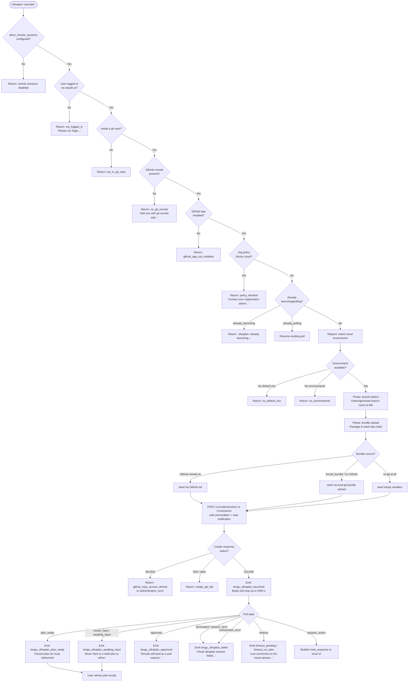

# `/ultraplan`

> Analysis basis: CC v2.1.195 bundle.js (AST extraction + Claude interpretation)
> Minimum version: v2.1.195

---

## Overview

`/ultraplan` launches a **cloud-based planning session** that drafts an editable plan inside Claude Code on the web. The command packages the current repository state, teleports it to a remote cloud environment, executes a planning agent there, and then polls for results — returning either a ready-to-refine plan or a pull request when the session completes. If the user is not logged in, not in a Git repository with a valid remote, or if the organization policy blocks remote sessions, the command exits early with a descriptive error.

---

## Registration

| Field | Value |
|---|---|
| type | `local-jsx` |
| name | `ultraplan` |
| description | `Draft an editable plan in Claude Code on the web ( ... ) · See  ...` |
| argumentHint | `<prompt>` |
| load_inline | `true` |
| load_ident | `T6f` |
| loc_byte | `12553118` |
| loc_byte_end | `12553350` |
| loc_line | `8472` |
| arbor_handler.name | `T6f` |
| arbor_handler.fqn | `claude-2.1.195::T6f` |
| arbor_handler.kind | `AsyncFunction` |
| arbor_handler.resolution_path | `load_ident` |
| arbor_handler.n_hits | `1` |

Analysis basis: CC v2.1.195 bundle.js:+12553118

The handler is inlined via a `load:()=>Promise.resolve({call: T6f})` shape; `T6f` is the authoritative entry point resolved by Arbor through the `load_ident` path.

---

## Input Branching

The command has more than three distinct decision branches (eligibility checks, duplicate-launch guard, Git/GitHub preflight, environment selection, session creation, and polling state machine), so a Mermaid flowchart is used.



Analysis basis: CC v2.1.195 bundle.js:+12551253 (handler entry), +12548441 (duplicate guard), +8853551 (not_logged_in), +8853652 (not_in_git_repo), +8853786 (no_git_remote), +8853899 (github_app_not_installed), +8854011 (policy_blocked)

---

## Behavioral Spec

### 1. Handler Entry — `ultraplanHandler` (`T6f`)

```
async function ultraplanHandler(context):
    # Check remote-sessions feature flag
    if not checkRemoteSessionsAllowed(context):
        return error("allow_remote_sessions disabled")

    # Retrieve app state
    appState = context.getAppState()

    # Check authentication
    eligibility = await checkRemoteEligibility(appState)
    if eligibility.not_logged_in:
        return userError("not_logged_in",
            "Please run /login and sign in with your Claude.ai account (not Console).")
    if eligibility.not_in_git_repo:
        return userError("not_in_git_repo")
    if eligibility.no_git_remote:
        return userError("no_git_remote",
            "Cloud agents require a GitHub remote. Add one with `git remote add origin REPO_URL`.")
    if eligibility.github_app_not_installed:
        return userError("github_app_not_installed")
    if eligibility.policy_blocked:
        return userError("policy_blocked",
            "Cloud sessions are disabled by your organization's policy. Contact your organization admin to enable them.")

    # Deduplicate concurrent launches
    if alreadyLaunching(appState):
        return userError("already_launching",
            "ultraplan: already launching. Please wait for the session to start.")

    # Normalise prompt
    prompt = extractPromptText(context, source="slash")

    # Mark launch in progress then delegate
    context.setAppState(markLaunching(appState))
    result = await launchSession(context, prompt)
    context.setAppState(clearLaunching(appState))
    return result
```

Analysis basis: CC v2.1.195 bundle.js:+12551253, +12551306, +12551588, +12551810

---

### 2. Remote Eligibility Check — `checkRemoteEligibility` (`GZn` / `BZn` / `JPo`)

```
async function checkRemoteEligibility(appState):
    # Parse billing / spend state
    billingState = parseBillingState(appState)   # GZn → BZn
    if billingState.spend_blocked:
        return { blocked: true, reason: "spend.blocked" }
    if billingState.store_error:
        return { blocked: true, reason: "store_error",
                 message: "spend limit unavailable" }
    if billingState.spend_limit_reached:
        return { blocked: true, reason: "spend limit reached" }

    # Additional pre-flight via JPo: scan tokens for known error tags
    for each token in tokenStream:
        if token.startsWith(errorPrefix):
            tag = extractTag(token)      # uses matchAll with /gi flag
            result.push(tag)
    return mergedResult
```

Key literals observed:
- `"spend.blocked"` (bundle.js:+17703886)
- `"spend limit unavailable"` (bundle.js:+17703961)
- `"spend limit reached"` (bundle.js:+17703987)
- Buffer chunk size: `1024` bytes (bundle.js:+17797372)

Analysis basis: CC v2.1.195 bundle.js:+11163253, +11163590

---

### 3. Duplicate-Launch Guard — `sessionLaunchGuard` (`dXt`)

```
function sessionLaunchGuard(appState, workflowName):
    if appState has "already_polling" flag:
        # Resume existing poll, skip new session creation
        resumePolling(appState)
        return CONTINUE

    if appState has "already_launching" flag:
        emitTelemetry("tengu_ultraplan_create_failed")
        return userError("already_launching",
            "ultraplan: already launching. Please wait for the session to start.")

    # Validate prompt presence
    if prompt is empty:
        return userError(
            'Usage: /ultraplan <prompt>, or include "ultraplan" anywhere\nin your prompt')

    # Kick off session creation branch
    return await createSessionBranch(appState, workflowName)
```

Analysis basis: CC v2.1.195 bundle.js:+12548441, +12548478, +12548700, +12548718, +12548765

---

### 4. Teleport — Session Creation (`QG`)

The core teleport routine handles environment selection, Git packaging, API call, and error mapping.

```
async function teleportToRemote(options):
    # Phase: env-select  (bundle.js:+8841355)
    environmentList = await listRemoteEnvironments()
    if environmentList is empty:
        return error("no_environments",
            "No environments available for session creation")

    # Auto-create a default environment if none exists
    if no default environment in list:
        try:
            newEnv = await createDefaultEnvironment()  # "Default" env, ccr-byoc-2025-07-29
            log("[teleportToRemote] Auto-created default cloud env")
        catch:
            warn("Could not create a cloud environment. Set one up at https://claude.ai/code/onboarding?magic=env-setup")
            return error("no_default_env")

    # Phase: branch-detect  (bundle.js:+8843160)
    branchInfo = await detectOrGenerateBranch(options)
        # generateTitle via LLM: schema { title, branch } max 75 chars (bundle.js:+8823690)
        # branch name template: "claude/task/{description}" (bundle.js:+8823696)

    # Phase: bundle-upload  (bundle.js:+8844819)
    bundleMode = decideBundleMode(options)
    # bundleMode ∈ { "github", "forced_bundle", "bundle", "git_repository",
    #                "explicit_env_bundle", "no_git_at_all" }
    if bundleMode == "github":
        sourceRef = resolveGitHubRef(branchInfo)
    elif bundleMode in { "forced_bundle", "bundle" }:
        uploadResult = await uploadLocalBundle()   # teleport_git_bundle_upload
        if uploadResult.failed:
            return error("upload_failed")
    else:
        log("[teleportToRemote] No repository detected — session will have an empty sandbox")

    # Phase: POST-sent  (bundle.js:+8846884)
    payload = buildSessionPayload(
        environment = selectedEnv,
        sourceRef   = sourceRef or bundleRef,
        prompt      = userPrompt,
        type        = "precondition" + "task-notification",
        workflowName = "Ultraplan",
    )
    response = await httpClient.post(sessionEndpoint, payload)
    # endpoint: "/v1/code/sessions" (v1alpha2) or "/v1/sessions" (v1)

    # Map HTTP errors
    if response.status in {401, 403}:
        return error("github_repo_access_denied")
    if response.status >= 500:
        return error("create_api_fail")
    if response.body has no session_id:
        return error("malformed_response",
            "Server returned a malformed session response (no session id)")

    emitTelemetry("tengu_ultraplan_launched")
    return { sessionId: response.body.session_id, env: selectedEnv }
```

Key literals:
- Session endpoints: `"/v1/code/sessions"` (bundle.js:+8837286), `"/v1/sessions"` (bundle.js:+8837306)
- Beta header: `"anthropic-beta"` (bundle.js:+8837379)
- Org UUID header: `"x-organization-uuid"` (bundle.js:+8837341)
- Default environment image tag: `"ccr-byoc-2025-07-29"` (bundle.js:+7372987)
- Branch name max length: `75` characters (bundle.js:+8823690)

Analysis basis: CC v2.1.195 bundle.js:+8837519, +8838111, +8838944, +8839031, +8839563

---

### 5. Poll Loop — `pollUltraplanSession` (`y6f` / `E8l`)

```
async function pollUltraplanSession(sessionId, appState):
    POLL_TIMEOUT_S = 5400          # 90 minutes (bundle.js:+12544007)
    POLL_INTERVAL_MS = 1000        # 1 second   (bundle.js:+8860577)
    MAX_SESSION_MS   = 1800000     # 30 minutes (bundle.js:+8860584)

    startTime = Date.now()
    emitTelemetry("tengu_ultraplan_timeout_seconds")

    loop:
        elapsed = Date.now() - startTime
        if elapsed > POLL_TIMEOUT_S * 1000:
            if plan was never received:
                return error("timeout_no_plan",
                    "Lost connection to the cloud session after repeated retries — the session may still be running")
            else:
                return error("timeout_pending")

        sessionState = await fetchSessionState(sessionId)   # GET via ZG

        switch sessionState.status:
            case "plan_ready":
                emitTelemetry("tengu_ultraplan_plan_ready")
                return presentPlan(sessionState.plan)

            case "needs_input":
            case "awaiting_input" (remote-workflow):
                emitTelemetry("tengu_ultraplan_awaiting_input")
                planText = extractPlanText(sessionState)
                return presentDraftPlan("Here is a draft plan to refine:", planText)

            case "approved":
                emitTelemetry("tengu_ultraplan_approved")
                return userMessage(
                    "Results will land as a pull request when the cloud session finishes. There is nothing to do here.")

            case "requires_action":
                bubbleHookToLocalUI(sessionState.hook_response)
                continue

            case "terminated":
            case "session_error":
            case "orchestrator_error":
                emitTelemetry("tengu_ultraplan_failed")
                return error("Cloud ultraplan session failed. Wait for the user's next instructions.")

            case "running":
            case "starting":
            case "pending":
                sleep(POLL_INTERVAL_MS)
                continue

        # Retry on transient network errors up to threshold
        if networkError:
            if retryCount exceeds threshold:
                return error("network_or_unknown",
                    "Lost connection to the cloud session after repeated retries — the session may still be running")
            retryCount++
            continue
```

Key literals:
- `"Here is a draft plan to refine:"` (bundle.js:+12544314)
- `"Results will land as a pull request when the cloud session finishes. There is nothing to do here."` (bundle.js:+12545595)
- `"Cloud ultraplan session failed. Wait for the user's next instructions."` (bundle.js:+12546418)
- Poll timeout: `5400` seconds / 90 minutes (bundle.js:+12544007)
- Polling interval: `1000` ms (bundle.js:+8860577)
- Max session duration: `1800000` ms / 30 minutes (bundle.js:+8860584)

Analysis basis: CC v2.1.195 bundle.js:+12543970, +12534835, +12535199, +12535971, +12536023

---

### 6. Git Bundle Upload — `uploadGitBundle` (`CTo`)

```
async function uploadGitBundle(sessionId, options):
    # Verify git repository exists and is not empty
    if not isGitRepo():
        return error("empty_repo", "Not in a git repository")

    # Clean up any leftover seed refs from prior run
    git("update-ref", "-d", "refs/seed/stash")
    git("update-ref", "-d", "refs/seed/root")

    # Check for commits
    commitCount = git("for-each-ref", "--count=1", "refs/")
    if commitCount == 0:
        return error("empty_repo",
            "Repository has no commits — run `git add . && git commit -m "initial"` then retry")

    # Create stash snapshot
    stashRef = git("stash", "create")
    headRef  = git("rev-parse", "--verify", "HEAD")

    # Pack bundle with ccr-seed prefix
    bundlePath = tempDir + "/ccr-seed.bundle"
    git("bundle", "create", bundlePath, ...)

    # Upload to presigned URL obtained from session endpoint
    uploadResponse = await httpClient.post(uploadUrl, bundleFile)
    if uploadResponse != 200:
        return error("upload_failed")

    # Record bundle mode in telemetry
    emitTelemetry("tengu_ccr_bundle_upload")

    # Cleanup temp bundle file
    fs.unlink(bundlePath)

    return { result: "success", mode: bundleMode }
        # bundleMode ∈ { "head", "fallback_head", "squashed", "fallback_squashed" }
```

Key literals:
- `"refs/seed/stash"` (bundle.js:+8820359)
- `"refs/seed/root"` (bundle.js:+8820377)
- `"ccr-seed"` (bundle.js:+8821554), `".bundle"` (bundle.js:+8821565)
- `"_source_seed.bundle"` (bundle.js:+8821861)

Analysis basis: CC v2.1.195 bundle.js:+8820229, +8820549, +8821554, +8822162

---

### 7. Environment List — `listRemoteEnvironments` (`jre`) and Default Create (`gft`)

```
async function listRemoteEnvironments(orgUuid, accessToken):
    # Require first-party Anthropic API
    if not isFirstPartyProvider():
        return error("not_first_party",
            "Remote environments are only available on the first-party Anthropic API provider.")

    if not accessToken:
        throw Error("No access token available")
    if not orgUuid:
        throw Error("Unable to get organization UUID")

    response = await httpClient.get(
        "/v1alpha2/...",
        headers: { "x-organization-uuid": orgUuid },
        timeout: 15000   # ms (bundle.js:+7371835)
    )
    emitTelemetry("teleport_environments_list")
    return response.data.environments

async function createDefaultCloudEnvironment(orgUuid, accessToken):
    # POST to create a "Default" environment
    payload = {
        name: "Default",
        image: "ccr-byoc-2025-07-29",
        runtime: { python: "3.11", node: "20" },
        homeDir: "/home/user",
    }
    response = await httpClient.post(environmentCreateEndpoint, payload)
    emitTelemetry("teleport_default_environment_create")
    return response.data
```

Key literals:
- `"anthropic_cloud"` provider tag (bundle.js:+7372671)
- `"Default"` environment name (bundle.js:+7372231)
- `"Default - trusted network access"` (bundle.js:+7372701)
- Environment list timeout: `15000` ms (bundle.js:+7371835)

Analysis basis: CC v2.1.195 bundle.js:+7371197, +7372253

---

### 8. Title & Branch Generation — `generateTitleAndBranch` (`qQp`)

```
async function generateTitleAndBranch(prompt):
    # Ask the model to produce a short title and branch name
    schema = {
        type: "json_schema",
        fields: { title: string, branch: string },
    }
    truncatedPrompt = prompt.slice(0, 75)   # max 75 chars (bundle.js:+8823690)
    branchTemplate  = "claude/task/{description}"  # (bundle.js:+8823696)

    response = await modelCall(
        prompt: truncatedPrompt,
        schema: schema,
    )
    emitTelemetry("teleport_generate_title")
    return { title: response.title, branch: response.branch }
```

Analysis basis: CC v2.1.195 bundle.js:+8823685, +8823816, +8823994

---

### 9. Plan Presentation — `presentDraftPlan` (`_6f` / `H6f`)

```
function buildPlanMessage(planText):
    lines = []
    lines.push("Here is a draft plan to refine:")   # (bundle.js:+12544314)
    lines.push(formatPlanBody(planText))             # H6f → m6f formatting
    return lines.join("\n")

function formatPlanBody(text):
    # m6f applies padding and text normalisation
    return normalise(text)
```

Analysis basis: CC v2.1.195 bundle.js:+12544307, +12544367, +12544397

---

### 10. Session Polling HTTP — `fetchSessionState` (`ZG`)

```
async function fetchSessionState(sessionId, orgUuid, accessToken):
    response = await httpClient.post(
        sessionStatusEndpoint,
        { session_id: sessionId },
        headers: { "x-organization-uuid": orgUuid },
        timeout: 10000   # ms (bundle.js:+8849509)
    )
    if httpClient.isCancel(response):
        return { status: "cancelled" }

    # Map response to normalised status string
    rawStatus = response.data.status
    return mapSessionStatus(rawStatus)
        # statuses include: pending, starting, running, plan_ready,
        #   needs_input, approved, requires_action, terminated,
        #   session_error, orchestrator_error, completed, archived
```

Key literals:
- Fetch timeout: `10000` ms (bundle.js:+8849509)
- Retry on 409 conflict (bundle.js:+8849798)

Analysis basis: CC v2.1.195 bundle.js:+8849149, +8849158, +8849165

---

## State & Side Effects

| Item | Detail |
|---|---|
| Telemetry: `tengu_ultraplan_create_failed` | Fired when a duplicate launch is detected (bundle.js:+12548478) |
| Telemetry: `tengu_ultraplan_prompt_identifier` | Fired when the prompt is first ingested into the session record (bundle.js:+12544140) |
| Telemetry: `tengu_ultraplan_launched` | Fired after a successful session creation POST (bundle.js:+12550185) |
| Telemetry: `tengu_ultraplan_timeout_seconds` | Fired at poll-loop start with timeout config (bundle.js:+12543973) |
| Telemetry: `tengu_ultraplan_awaiting_input` | Fired when session returns needs_input / awaiting_input (bundle.js:+12544617) |
| Telemetry: `tengu_ultraplan_plan_ready` | Fired when session returns plan_ready (bundle.js:+12544685) |
| Telemetry: `tengu_ultraplan_approved` | Fired when remote session is approved (bundle.js:+12545105) |
| Telemetry: `tengu_ultraplan_failed` | Fired on session_error / terminated / orchestrator_error (bundle.js:+12545994) |
| Telemetry: `tengu_ccr_bundle_seed_enabled` | Fired when bundle-seed mode is selected for the repo (bundle.js:+7376208) |
| Telemetry: `tengu_ccr_bundle_upload` | Fired after a successful local bundle upload (bundle.js:+8820551) |
| Telemetry: `tengu_teleport_bundle_mode` | Records which bundle mode was chosen (bundle.js:+8839176) |
| Telemetry: `tengu_ccr_session_link` | Records the resulting session URL/link (bundle.js:+8830565) |
| Telemetry: `tengu_teleport_source_decision` | Records source strategy (github/bundle/empty) (bundle.js:+8845729) |
| Telemetry: `tengu_daemon_config_reload` | Fired when daemon config is refreshed during session lifecycle (bundle.js:+17902328) |
| Telemetry: `tengu_config_parse_error` | Fired on config file parse failure (bundle.js:+14073004) |
| appState: `already_launching` | Set before session creation POST; cleared on completion or error |
| appState: `already_polling` | Set while poll loop is active; prevents duplicate polls |
| appState: `setAppState` / `getAppState` | Called at handler entry and exit (bundle.js:+12551588, +12551810) |
| File I/O | Temporary git bundle written then unlinked via `bht.unlink` / `bl.unlink` (bundle.js:+8822506, +13533452) |
| File I/O | Config read with `readFileSync` / `readdirStringSync`; backed up via `copyFileSync` (bundle.js:+14071646, +14072587) |
| File watch | `CTs.watchFile` / `Jcc.unwatchFile` used for config hot-reload (bundle.js:+1147333, +14067673) |
| Hook registration | `krs.register` called by `vi` (bundle.js:+68053) for task-notification hook |
| Random UUID | `Tht.randomUUID()` used for control-request event IDs (bundle.js:+8836488) |
| Random bytes | `pic.randomBytes(8)` used for session token generation (bundle.js:+13639621) |
| Sound | None detected in depth-2 traversal |

---

## Version History

| Version | Change |
|---|---|
| v2.1.195 | Initial analysis |

---

## Common Mistakes

1. **Running without a claude.ai login** — `/ultraplan` requires a Claude.ai account login (`/login`), not just an Anthropic API key. API-key-only authentication is explicitly rejected with the `not_logged_in` error (bundle.js:+8853551).
2. **No GitHub remote configured** — The command requires `git remote add origin <REPO_URL>` to be set before invocation; otherwise it exits with `no_git_remote` (bundle.js:+8853786).
3. **GitHub App not installed** — Even with a remote, the Anthropic GitHub App must be installed on the repository's organization. Without it the command exits with `github_app_not_installed` (bundle.js:+8853899).
4. **Invoking twice in quick succession** — A second invocation while the first is still launching returns the `already_launching` user error and fires `tengu_ultraplan_create_failed`; the user must wait for the session to start (bundle.js:+12548718).
5. **Organization policy blocking remote sessions** — Enterprise organizations can disable cloud sessions; the `policy_blocked` error directs the user to contact their org admin (bundle.js:+8854011).
6. **Empty repository** — If the git repository has no commits, bundle upload fails with guidance to run `git add . && git commit -m "initial"` first (bundle.js:+8845158).
7. **Using a non-first-party API provider** — Remote environments and cloud sessions are only available through the Anthropic first-party API; third-party or proxy endpoints are rejected (bundle.js:+7371274).

---

## Appendix — Identifier Mapping

> For bundle debugging only. Identifiers change across versions.

| Identifier | Role |
|---|---|
| `T6f` | Main async handler for `/ultraplan` (Arbor-resolved entry point) |
| `GZn` | Remote eligibility / billing-state check orchestrator |
| `BZn` | Billing state parser (inner layer of eligibility check) |
| `JPo` | Token-stream error-tag scanner used by eligibility check |
| `Fs` | Feature-flag / telemetry-consent resolver |
| `HNi` | Feature-flag lookup helper |
| `g6` | Config reader called by feature-flag resolver |
| `TF` | Telemetry-consent mode resolver |
| `_Ut` | File-based config loader (readFileSync + UTF-8 decode) |
| `L_e` | Config inclusion / allowance predicate |
| `qi` | Telemetry-mode gate |
| `rSs` | Telemetry routing helper |
| `ut` | String coercion utility |
| `y_e` | Alternate telemetry-mode utility |
| `hoe` | Prompt / context accessor |
| `dXt` | Duplicate-launch guard + session-creation dispatcher |
| `W` | React JSX renderer / component factory |
| `je` | JSX element creator |
| `OJe` | Core JSX implementation |
| `w8l` | App-state write helper |
| `isr` | Inner session-request builder |
| `ssr` | Session-state record constructor |
| `at` | App-state read/merge helper |
| `g6f` | Session record finaliser |
| `b6f` | Main session-creation + poll orchestration function |
| `xpe` | Remote eligibility pre-check wrapper |
| `G1a` | Background remote eligibility evaluator |
| `ls` | Logging / output stream helpers |
| `u0` | Output write primitive |
| `$u` | Stderr write primitive |
| `_6f` | Plan message builder (assembles lines + joins) |
| `H6f` | Plan body formatter (delegates to `m6f`) |
| `QG` | Core teleport-to-remote function |
| `Ot` | Organisation UUID resolver |
| `m6` | Model/provider string builder |
| `Ql` | First-party API check |
| `NZa` | Session endpoint URL selector (v1alpha2 vs v1) |
| `ch` | Auth token refresh checker |
| `RVn` | HTTP request builder for session API |
| `xe` | Token / auth-state accessor |
| `E3` | Error mapper for session API responses |
| `ZZa` | Session list fetcher (v1alpha2) |
| `CTo` | Git bundle upload handler (teleport_git_bundle_upload) |
| `Rt` | Output renderer |
| `Os` | OAuth / API base URL resolver |
| `T` | Message formatter / i18n helper |
| `Oe` | UI element wrapper |
| `$1` | Git remote URL retriever (runs `git config --get remote.origin.url`) |
| `QZa` | Control-request / set-permission-mode event builder |
| `p6t` | Payload options builder for session POST |
| `Me` | JSON serialiser wrapper |
| `ae` | Network status checker |
| `TTo` | Session-create error handler (4xx/5xx mapping) |
| `wTo` | Session-create response validator (checks for session id) |
| `LTo` | Post-create session-link telemetry emitter |
| `eel` | Session-creation error categoriser |
| `Rh` | Object merge / assign helper |
| `XZa` | Session-create error-code mapper (authentication_error, rate_limit_error, etc.) |
| `X3n` | BYOC / environment pre-flight check |
| `jre` | Remote environment list fetcher (teleport_environments_list) |
| `gft` | Default remote environment creator (teleport_default_environment_create) |
| `ye` | String coercion / display helper |
| `d` | Daemon / supervisor process manager |
| `qQp` | Title & branch name generator (LLM call, teleport_generate_title) |
| `XQp` | Environment list filter |
| `AF` | Full app-state reader (with feature flags) |
| `Pm` | GitHub remote URL parser / www-prefix stripper |
| `nje` | GitHub App installation checker |
| `vM` | Default branch detector (symbolic-ref / show-ref) |
| `As` | Session status display helper |
| `Nae` | Git remote URL normaliser (https/http scheme check) |
| `Z` | Network connectivity state |
| `de` | Stream enqueue / output dispatcher |
| `Zr` | Generic error coercion |
| `lh` | Cancel-detection helper |
| `R_` | Request cancellation token |
| `dE` | HTTP client factory |
| `ro` | Axios-based HTTP client constructor |
| `c9t` | HTTP client config builder |
| `S6f` | Session-type / source label resolver |
| `pAe` | Session polling orchestrator |
| `uU` | Session token generator (randomBytes) |
| `Cht` | Browser/external URL opener for session link |
| `DT` | Session-start timestamp recorder |
| `nZp` | Poll status display string builder |
| `oel` | Core poll-loop implementation |
| `Uk` | Task / workflow state manager |
| `W_f` | Task retain-state handler |
| `B_f` | Task update handler |
| `y3n` | App state setter via zustand `setState` |
| `Dko` | Task state transition helper |
| `j_f` | Task-started event emitter |
| `V_f` | Task-updated event builder |
| `mfe` | Task lifecycle event handler (user_typed, active, aborted) |
| `y6f` | Session poll driver (calls `E8l` + `f6f` + `ZG`) |
| `E8l` | Poll iteration executor (network fetch + retry logic) |
| `f6f` | Poll timeout enforcer (delegates to `at`) |
| `A6f` | Poll-result application helper |
| `a8t` | Temp-file cleanup after poll (unlink seed bundle) |
| `o` | Column padding / display formatter |
| `ZG` | Session-state HTTP fetcher (POST to status endpoint) |
| `vi` | Hook registration caller |
| `E6f` | Error-state renderer for session launch failures |
| `Mt` | Config manager (read + watch) |
| `qt` | Config file path resolver |
| `Mjo` | Config schema validator |
| `oTt` | Config file loader (readFileSync + backup) |
| `Bt` | JSON parse wrapper |
| `v5` | Config value prefix stripper |
| `on` | Config write helper |
| `Ojo` | Config backup file locator |
| `Ujo` | Config backup directory path builder |
| `l` | Lazy / deferred value wrapper |
| `m` | Multi-value / array config accessor |
| `thr` | Path prefix normaliser |
| `k` | File watcher (chokidar-style: add/change/unlink events) |
| `Csm` | Config hot-reload manager |
| `hRt` | Config file watch registrar |
| `xme` | Config reload callback |
| `xAt` | Concurrent eligibility + telemetry pre-flight (Promise.all) |

Note: index built via Arbor fallback; some signals (telemetry, literals) may be missing — see arbor-fallback.js.