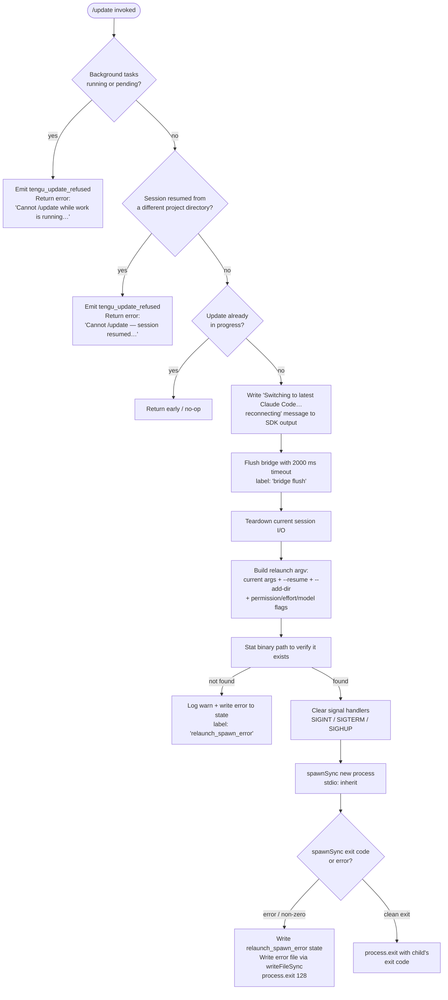

# `/update`

> Analysis basis: CC v2.1.195 bundle.js (AST extraction + Claude interpretation)
> Minimum version: v2.1.195

---

## Overview

The `/update` command performs an in-place upgrade of Claude Code to the latest available version while preserving the active conversation session. It resolves the target binary, validates preconditions (no background work running, no cross-directory resume), flushes pending I/O, then uses `execve`-style process replacement (via `spawnSync` + `process.exit`) to relaunch the CLI on the new version with a `--resume` flag so the conversation continues seamlessly.

---

## Registration

| Field | Value |
|---|---|
| type | `local` |
| name | `update` |
| description | `Switch to the latest version (conversation continues)` |
| loc_byte | `12978794` |
| loc_byte_end | `12979035` |
| loc_line | `8927` |
| supportsNonInteractive | `false` |
| isHidden | `true` |
| module_id | `RXl` |
| load_inline | `true` |
| arbor_handler.name | `hqf` |
| arbor_handler.fqn | `claude-2.1.195::hqf` |
| arbor_handler.kind | `AsyncFunction` |
| arbor_handler.resolution_path | `module_id` |
| arbor_handler.n_hits | `0` |

Analysis basis: CC v2.1.195 bundle.js:+12978794

---

## Input Branching

The handler has 5+ distinct decision paths (background-work guard, cross-directory-resume guard, tool-activity check, update-already-running check, actual relaunch success/failure). A Mermaid flowchart is used.



Analysis basis: CC v2.1.195 bundle.js:+12976676 – +12978112

---

## Behavioral Spec

### 1. Binary Resolution

Before the handler (`hqf`) is entered, a helper (`getClaudeBinaryPath`, `uir`) resolves the `claude` executable path:

```
function getClaudeBinaryPath():
    candidate = whichBinary("claude")        # calls Bun.which
    if candidate is valid:
        return candidate
    fallback = joinPath(
        homedir(),
        ".local", "share", "versions", "<versionDir>", "bin", "claude"
    )
    return fallback
```

Analysis basis: CC v2.1.195 bundle.js:+12976590 (`Wf` → `Bun.which`), +12976643 (`x2` path-building), +867909, +8756064, +7203680, +7203953, +7203962, +7204033

---

### 2. Pre-flight Guards

```
async function updateCommandHandler(context):

    # Guard 1 — Background work
    backgroundStates = getAppState().tasks  # Object.values at +12976913
    if any task.status in {"running", "pending"}:
        emit telemetry("tengu_update_refused")
        return errorMessage(
            "Cannot /update while work is running in the background — " +
            "wait for it to finish, then try again."
        )

    # Guard 2 — Cross-directory resume
    sessionInfo = getLastMessageWorkingDir()    # Br / findLast
    if sessionInfo.workingDirectory != process.cwd():
        emit telemetry("tengu_update_refused")
        return errorMessage(
            "Cannot /update — this session was resumed from a different " +
            "project directory. Restart manually with --resume to continue " +
            "on the latest version."
        )

    # Guard 3 — Already in progress
    if updateInProgress flag is set:
        return  # silent no-op
```

Error string for guard 1: `"Cannot /update while work is running in the background…"` (bundle.js:+12977054)
Error string for guard 2: `"Cannot /update — this session was resumed from a different project directory…"` (bundle.js:+12977298)
`tengu_update_refused` fires for both guard-1 and guard-2 refusals (bundle.js:+12976690)

---

### 3. Session State Snapshot and Message Write

```
function captureSessionStateAndNotify(context):
    # Read current app state (t.getAppState at +12977558)
    currentState = context.getAppState()

    # Compute session flags to forward (Br / gg at +12978112, +12978118)
    sessionFlags = extractResumeFlags(currentState)
        # includes: working_directory, allowed_tools, disallowed_tools,
        #           avoid_prompts, permission_mode, bypassPermissions,
        #           effort, model, max_thinking_tokens, flag_settings

    # Generate resume UUID (LXl / crypto.randomUUID at +12977779)
    resumeId = crypto.randomUUID()

    # Write "Switching…" message to SDK output stream
    context.writeSdkMessages([{
        role: "assistant",
        type: "text",
        content: "Switching to latest Claude Code… reconnecting"
    }])
    # literal at bundle.js:+12977783

    # Persist last-prompt entry so --resume picks up conversation
    appendLastPromptEntry("last-prompt", resumeId)
    # kXt / n.appendEntry at +13550303, literal "last-prompt" at +13550323
```

Analysis basis: CC v2.1.195 bundle.js:+12977558, +12977673, +12977759, +12977779, +12977850

---

### 4. Flush, Teardown, and Relaunch

```
async function flushAndRelaunch(context, binaryPath, argv):

    # Flush bridge with timeout
    await Promise.race([
        context.flush(),
        timeout(2000, "bridge flush")
    ])
    # 2000 ms literal at +12977863, label at +12977868

    # Tear down I/O
    context.teardown()
    # +12977904

    # Build relaunch argv
    relaunchArgs = buildRelаunchArgv(argv, resumeId)
    # xsr at +12978108:
    #   - copies original argv
    #   - appends "--resume"         (literal at +12716590)
    #   - appends "--add-dir" dirs   (literal at +12718114)
    #   - forwards --allow-dangerously-skip-permissions if set (+12718229)
    #   - forwards --effort          (+12718371)
    #   - forwards --permission-mode (+12718388)

    # Verify binary exists (CNe / cKl.stat at +12716538)
    stat = fs.stat(binaryPath)
    if stat fails:
        logWarn("warn")          # +12716175
        writeErrorState("relaunch_spawn_error")   # +12717441
        process.exit(128)        # literal at +12717578

    # Flush analytics (yXe / krs.drain at +68096)
    await drainAnalytics(timeout=30000, label="flush timeout (relaunch)")
    # 30000 ms at +12716657

    # Cleanup timeouts
    await cleanupWithTimeout(label="cleanup timeout")
    # label at +12716719

    # Analytics flush timeout
    await analyticsFlushWithTimeout(label="analytics flush timeout")
    # label at +12716775

    # Remove existing signal handlers
    process.removeAllListeners("SIGINT")
    process.removeAllListeners("SIGTERM")
    process.removeAllListeners("SIGHUP")
    # literals at +12717130, +12717139, +12717149

    # Load native libc execve via FFI (iKl at +12717092)
    loadNativeLibrary()
    # uses bun:ffi (+12715694), libSystem.B.dylib on macOS (+12715738)
    # or libc.so.6 on Linux (+12715767)

    # Attempt execve-style replacement
    result = spawnSync(binaryPath, relaunchArgs, { stdio: "inherit" })
    # lKl.spawnSync at +12717216, "inherit" at +12717251

    if result.error or result.status != 0:
        # Write error file (aI / oae.writeFileSync at +201306)
        writeFileSync(joinPath(stateDir, "relaunch_spawn_error"), errorText)
        process.exit(128)
    else:
        process.exit(result.status)
    # process.exit at +12717465 and +12717530
```

Analysis basis: CC v2.1.195 bundle.js:+12977850, +12977853, +12977904, +12978069, +12978108

---

### 5. Feature-Flag Check

```
function checkAutoUpdateEnabled():
    # nxe / ACi.isEnabled at +3118815
    return featureFlags.isEnabled("auto-update")
    # Also checked in GM sub-call at +3118781
```

This flag influences whether the relaunch pathway is available; when disabled the command falls through to a dimmed error message rendered via `Ct.dim` (bundle.js:+12978196).

Analysis basis: CC v2.1.195 bundle.js:+12978010, +12978033

---

### 6. Error Reporting Metadata

The command embeds the following constants for use in error output and issue links:

| Constant | Value | loc_byte |
|---|---|---|
| Package name | `@anthropic-ai/claude-code` | +12978323 |
| Docs URL | `https://code.claude.com/docs/en/overview` | +12978362 |
| Version string | `2.1.195` | +12978413 |
| Issue tracker | `https://github.com/anthropics/claude-code/issues` | +12978440 |
| Build timestamp | `2026-06-26T01:00:56Z` | +12978502 |
| Commit SHA | `4603aa3f2ea164bd0974f82eb413ae7acc99a7ee` | +12978533 |

Analysis basis: CC v2.1.195 bundle.js:+12978240

---

## State & Side Effects

| Item | Detail |
|---|---|
| Telemetry — update refused | `tengu_update_refused` (bundle.js:+12976690) — fires when background tasks are active or session directory mismatch detected |
| Telemetry — scroll summary | `tengu_scroll_summary` (bundle.js:+7398886) — emitted by the display rendering sub-path during teardown |
| Telemetry — amber creek | `tengu_amber_creek` (bundle.js:+3564041) — fullscreen / terminal capability tracking |
| Telemetry — pewter brook | `tengu_pewter_brook` (bundle.js:+3563948) — fullscreen / terminal capability tracking |
| Telemetry — feature ok/bad | `tengu_feature_ok` / `tengu_feature_bad` (bundle.js:+1027363, +1027430) — feature-flag evaluation results |
| Telemetry — daemon control | `tengu_daemon_control` (bundle.js:+17924594) — daemon start/stop lifecycle events |
| Telemetry — config parse error | `tengu_config_parse_error` (bundle.js:+14073004) — config file parse failures during binary stat |
| Telemetry — disable bypass perms | `tengu_disable_bypass_permissions_mode` (bundle.js:+3420569) — emitted when bypass-permissions mode is cleared before relaunch |
| appState changes | `t.setAppState` called to mark update-in-progress and clear ephemeral state (+12977673); `t.getAppState` read to snapshot session flags (+12977558) |
| SDK message written | `"Switching to latest Claude Code… reconnecting"` injected into the conversation transcript via `l.writeSdkMessages` (+12977759) |
| Last-prompt entry | Appended to the log store (key `"last-prompt"`) so `--resume` can reconstruct the session (+13550303) |
| Bridge flush | Up to 2000 ms wait on `l.flush()` (+12977853) |
| Analytics drain | Up to 30 000 ms wait on analytics drain (+12716657) |
| Signal handler cleanup | `process.removeAllListeners` for SIGINT, SIGTERM, SIGHUP before exec (+12717159, +12717189) |
| Native FFI load | `bun:ffi` used to load `libSystem.B.dylib` (macOS) or `libc.so.6` (Linux) for low-level execve call (+12715694) |
| Error file written | On spawn failure: file written via `oae.writeFileSync` (+201306) |
| process.exit | Called unconditionally after `spawnSync` returns (+12717465, +12717530) |
| Hook registration | `krs.register` called via the entry-logging sub-path (+68053); `krs.drain` called before relaunch (+68096) |
| Sound | <!-- TODO: not found in depth-2 traversal; needs --depth 4 --> |

---

## Version History

| Version | Change |
|---|---|
| v2.1.195 | Initial analysis — `hqf` AsyncFunction handler; in-place binary upgrade via `spawnSync` + `process.exit`; 2 000 ms bridge flush; 30 000 ms analytics drain; FFI-based native execve on macOS/Linux |

---

## Common Mistakes

1. **Running `/update` while background tasks are active.** The command aborts immediately with an error if any task has status `"running"` or `"pending"`. Wait for all background work to complete first.

2. **Using `/update` in a session that was `--resume`d from a different project directory.** The working-directory check will refuse the update; you must manually restart with `--resume` from the original project directory.

3. **Expecting an interactive prompt or confirmation.** `supportsNonInteractive` is `false` and the command is hidden (`isHidden: true`); it performs the update immediately upon invocation with no confirmation step.

4. **Assuming the conversation is lost after `/update`.** The handler writes a `"last-prompt"` entry and passes `--resume` to the relaunched process; the conversation resumes on the new binary.

5. **Interrupting the process during the 2-second flush window.** The bridge flush has only a 2 000 ms timeout; killing the process during this window may leave the session state partially written, causing resume failures.

6. **Expecting `/update` to work when the auto-update feature flag is disabled.** If the `ACi.isEnabled` feature-flag check returns `false`, the command path degrades and shows a dimmed error rather than performing the update.

---

## Appendix — Identifier Mapping

> For bundle debugging only. Identifiers change across versions.

| Identifier | Role |
|---|---|
| `hqf` | Main async handler for `/update` (resolved via Arbor `module_id` path from `RXl`) |
| `uir` | Binary-path resolution helper — wraps `Bun.which("claude")` and XDG fallback |
| `Wf` | `Bun.which` wrapper — checks PATH for `claude` executable |
| `Wms` | Inner helper inside `Wf` calling `Bun.which` directly |
| `x2` | XDG-based path builder for versioned binary under `~/.local/share/versions/…/bin` |
| `fVn` | Path-component assembler used by `x2` (joins version dirs) |
| `Zm` | Array validation helper (`Array.isArray`) used inside path assembly |
| `Bre` | Home-directory segment builder calling `ePa.homedir()` |
| `e3n` | `os.homedir()` wrapper |
| `Ade` | `bin` sub-path appender inside XDG path builder |
| `Xs` | Entry-type resolver — distinguishes `bg`, `daemon`, `daemon-worker` modes |
| `tLe` | Inner lookup used by `Xs` |
| `W` | Utility/logger helper (called at multiple sites) |
| `JS` | basename + permissions helper; uses `oE.basename` with offset `8` |
| `Rt` | General render/output helper calling `u0` |
| `u0` | Low-level output primitive |
| `Nk` | Notification/state-key helper |
| `M3o` | Directory-change helper: resolves `dKl.dirname`, calls `Xh` and `rc` |
| `Hr` | Sub-helper of `M3o` calling `u0` |
| `rc` | Sub-helper of `M3o` calling `u0` |
| `gme` | <!-- TODO: not found in depth-2 traversal; needs --depth 4 --> |
| `Fse` | Attachment/hook-filter; checks `fem.has` for `"ant"` hook type |
| `flr` | Inner helper of `Fse` |
| `kXt` | Last-prompt log writer; calls `n.appendEntry` with key `"last-prompt"` |
| `zc` | Hook/event registration dispatcher; calls `vi` |
| `vi` | Registers hooks via `krs.register` |
| `n` | Log store object; methods include `appendEntry`, `toLowerCase` |
| `i` | Session/stream object; has `close`, `finally` |
| `r` | Stream/resource set; has `close`, `add`, `delete` |
| `s` | Resource-set manager; coordinates `r.add`, `i.finally`, `r.delete` |
| `xe` | Telemetry/error-event dispatcher; queues errors via `GZe.push`, logs via `Gee.logError` |
| `Zr` | Error normalizer wrapping `Error` + `String` |
| `ut` | String coercion utility |
| `qi` | Event queue helper calling `rSs` |
| `rSs` | Inner queue helper calling `ut` |
| `BMu` | Circular-buffer helper; shifts/pushes on `Tpn` |
| `Cf` | AsyncLocalStorage accessor; retrieves store via `n3r.getStore` |
| `v0` | Inner store getter for `Cf` |
| `yE` | <!-- TODO: not found in depth-2 traversal; needs --depth 4 --> |
| `l` | SDK message writer object; methods `writeSdkMessages`, `flush`, `teardown` |
| `LZl` | SDK message serializer; uses `Date.now`, `Vs`, `WXt`, `Me` |
| `Hte` | Message formatter calling `THe` |
| `THe` | Text trimmer/decorator calling `Dae` and `t.trim` |
| `Vs` | Store accessor calling `Nld.getStore` |
| `WXt` | Status-file path builder: joins `"daemon.status.json"` |
| `Me` | JSON serializer calling `JSON.stringify` |
| `LXl` | UUID generator calling `xXt.randomUUID` |
| `Ic` | Timeout-race helper: `setTimeout`, `Promise.race`, `clearTimeout` |
| `nxe` | Auto-update feature-flag checker; calls `ACi.isEnabled` |
| `j0e` | String coercion helper (`String`) for binary path |
| `CNe` | Relaunch orchestrator: stat, flush, signal-clear, `spawnSync`, `process.exit` |
| `w6t` | Interval-clear helper calling `Cho` / `clearInterval` |
| `Cho` | `clearInterval` wrapper |
| `cje` | Terminal cleanup: unmounts Ink, writes via `bSe.writeSync`, calls `vN`, `wkn` |
| `vN` | <!-- TODO: not found in depth-2 traversal; needs --depth 4 --> |
| `wkn` | Terminal restore: `Lne.writeSync`, `s5e`, `Z4e`, `ex`, `gd`, `T` |
| `s5e` | Terminal capability checker: Ghostty ≥1.2.0, iTerm ≥3.6.6 |
| `Z4e` | <!-- TODO: not found in depth-2 traversal; needs --depth 4 --> |
| `ex` | tmux/screen escape handler; replaces `\x1b\x1b` sequences |
| `gd` | <!-- TODO: not found in depth-2 traversal; needs --depth 4 --> |
| `T` | Message formatter/logger; handles debug/warn/info levels |
| `H9n` | Scroll-summary renderer; calls `TL`, `fNa`, `W`, `pNa`, `Us` |
| `TL` | <!-- TODO: not found in depth-2 traversal; needs --depth 4 --> |
| `fNa` | <!-- TODO: not found in depth-2 traversal; needs --depth 4 --> |
| `pNa` | Timing calculator: `Date.now`, `Math.max`, `Math.round`, `Object.assign` |
| `uNa` | Sub-helper of `pNa` |
| `Us` | Fullscreen UI manager: `t3`, `GM`, `Y7r`, `dne`, `T`, `z7r`, `Mr`, `rFd`, `at` |
| `t3` | Feature-set checker using `z0u.has` |
| `GM` | Feature-flag checker calling `ACi.isEnabled` |
| `Y7r` | String formatter calling `ut` |
| `dne` | Display helper calling `nFd` |
| `z7r` | Platform check: `"windows"` detection via `Boolean` |
| `Mr` | Render helper calling `d8` |
| `rFd` | Render sub-path calling `at` |
| `at` | Ink render coordinator: `lUt`, `cUt`, `f6`, `hxe.has`, `bxn`, `iUt.add`, `rV.has/get`, `Mt` |
| `Lv` | Hook lifecycle handler calling `zc` |
| `yXe` | Analytics drain caller: `krs.drain` |
| `dje` | Post-relaunch cleanup: `Promise.resolve`, `f9n` |
| `f9n` | <!-- TODO: not found in depth-2 traversal; needs --depth 4 --> |
| `iKl` | Native FFI loader: `bun:ffi`, `dlopen`, `execve`, `process.chdir`, `process.exit` |
| `f` | FFI symbol iterator calling `o8` |
| `o8` | Path normalizer: `U1.normalize`, `Vt`, `t.replaceAll` |
| `c` | FFI callback helper calling `yn` |
| `yn` | <!-- TODO: not found in depth-2 traversal; needs --depth 4 --> |
| `a` | Spend/billing response handler: `age`, `Response.json` |
| `age` | JSON serializer for billing responses |
| `u` | Background session manager: `Le`, `ke`, `SF`, `yj` |
| `Le` | Session start helper: `W`, `Oe` |
| `ke` | Session stop helper: `W`, `Oe` |
| `SF` | Daemon-control dispatcher: `p6`, `vY.push`, `y4e`, `GKr` |
| `yj` | Exit race: `Promise.race`, `Promise.all`, `T_e`, `k_e`, `Un`, `process.exit` |
| `ye` | String coercer (`String`) for error text |
| `aI` | Error-file writer: `oae.writeFileSync` + `VSr.join` |
| `xsr` | Argv builder: `Array.from`, `q$e`, `r.push`, `Cxe`, `r.includes`, `n.flatMap` |
| `q$e` | <!-- TODO: not found in depth-2 traversal; needs --depth 4 --> |
| `Cxe` | Boolean flag filter calling `Mt` |
| `Mt` | Ink mount: `qt`, `S0`, `Mjo`, `oTt` |
| `qt` | <!-- TODO: not found in depth-2 traversal; needs --depth 4 --> |
| `Mjo` | <!-- TODO: not found in depth-2 traversal; needs --depth 4 --> |
| `oTt` | Config file reader: `readFileSync`, `mkdirSync`, `copyFileSync`, `readdirStringSync` |
| `Csm` | File-watcher helper: `S0`, `hRt`, `qt`, `wa`, `v5`, `Mjo`, `vi`, `Jcc.unwatchFile` |
| `Br` | Session-flag extractor: `getAppState`, `findLast`, `uZn`, `dZn`, `xF` |
| `uZn` | Allowed-tools resolver calling `Fo` |
| `Fo` | Tools set builder |
| `dZn` | Disallowed-tools resolver calling `Fo` |
| `xF` | Permission-mode resolver: `at`, `Go` |
| `gg` | App-state reader: `e.getAppState` for session metadata snapshot |

---

Note: index built via Arbor fallback; some signals (telemetry, literals) may be missing — see arbor-fallback.js.