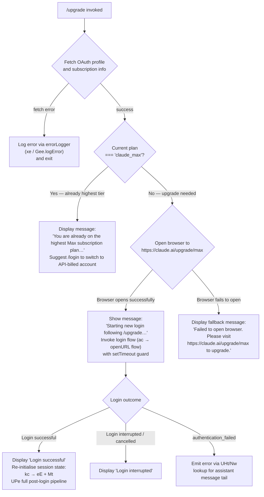

# `/upgrade`

> Analysis basis: CC v2.1.195 bundle.js (AST extraction + Claude interpretation)
> Minimum version: v2.1.195

---

## Overview

The `/upgrade` command guides a user from a lower-tier subscription to the **Claude Max** plan, which provides higher rate limits and greater access to Opus models. When invoked, it inspects the current account's subscription tier and either notifies the user that they are already on the highest Max plan, opens a browser to the upgrade URL (`https://claude.ai/upgrade/max`), or initiates a new login flow so a freshly authenticated Max-tier account can be used immediately.

---

## Registration

| Field | Value |
|---|---|
| type | `local-jsx` |
| name | `upgrade` |
| description | `Upgrade to Max for higher rate limits and more Opus` |
| loc_byte | `13028727` |
| loc_byte_end | `13028974` |
| loc_line | `8933` |
| module_id | `o4o` |
| load_inline | `true` |
| arbor_handler.name | `UXt` |
| arbor_handler.fqn | `claude-2.1.195::UXt` |
| arbor_handler.kind | `AsyncFunction` |
| arbor_handler.resolution_path | `module_id` |
| arbor_handler.n_hits | `0` |

Analysis basis: CC v2.1.195 bundle.js:+13028727

---

## Input Branching

The handler resolves across four distinct paths depending on subscription state and outcome of the browser/login step, requiring a flowchart.



Analysis basis: CC v2.1.195 bundle.js:+13027609, +13027839, +13027940, +13028083, +13028206, +13028235, +13028429, +13028448, +13028499, +13028520

---

## Behavioral Spec

### 1. Entry Point — Upgrade Handler (`UXt`)

The handler is an `AsyncFunction` resolved via `module_id` → `o4o` by Arbor.

```
async function upgradeHandler(commandContext):
    // Step 1 — fetch current OAuth profile and plan tier
    profileResult = await fetchOAuthProfile(commandContext)   // yo → eE path
    if profileResult is error:
        logError(profileResult)
        return

    // Step 2 — check subscription tier
    planTier = extractPlanTier(profileResult)                 // literal: "claude_max" @ +13027839
    featureTier = extractFeatureFlag(profileResult)           // literal: "default_claude_max_20x" @ +13027720
    // Note: "max" plan identifier literal found at +13027695

    if planTier === "claude_max":
        // Already on highest tier
        displayAlreadyMaxMessage()
        // Message: "You are already on the highest Max subscription plan…" @ +13027940
        return

    // Step 3 — attempt browser open
    opened = await openURL("https://claude.ai/upgrade/max")  // literal @ +13028086; ac → $Ci path
    if not opened:
        displayFallbackMessage()
        // Message: "Failed to open browser. Please visit https://claude.ai/upgrade/max to upgrade." @ +13028520
        return

    // Step 4 — notify user and start login flow
    displayMessage("Starting new login following /upgrade. Exit with Ctrl-C to use existing account.")
    // Literal @ +13028235

    // Step 5 — render JSX confirmation prompt (_Ql.jsx call @ +13028206)
    renderJSXPrompt(commandContext)                           // _Ql.jsx @ +13028206

    // Step 6 — invoke login with setTimeout safety net
    // setTimeout guard @ +13027925
    loginResult = await initiateLogin(commandContext)         // ac @ +13028083

    if loginResult === "success":
        displayMessage("Login successful")                    // literal @ +13028429
        await postLoginPipeline(commandContext)               // UPe @ +13028348
    else if loginResult === "interrupted":
        displayMessage("Login interrupted")                   // literal @ +13028448
    else:
        handleAuthFailure(commandContext)                     // UHt/Nw @ +13028470

    // Step 7 — re-establish connection context
    errorLogger(commandContext)                               // xe @ +13028499
```

Analysis basis: CC v2.1.195 bundle.js:+13027609, +13027695, +13027720, +13027839, +13027925, +13028083, +13028086, +13028206, +13028235, +13028348, +13028429, +13028448, +13028470, +13028499, +13028520

---

### 2. OAuth Profile Fetch (`yo` → `eE`)

```
async function fetchOAuthProfile(ctx):
    // yo dispatches to eE (full profile resolution chain)
    // eE coordinates:
    //   - getAuthSource(ctx)           → md  (checks env ANTHROPIC_API_KEY @ +3079776)
    //   - buildProfileRecord(ctx)      → ab  (sets profile-implicit flag @ +3075816,
    //                                         user_oauth identifier @ +3075889)
    //   - resolveQueryStrings(ctx)     → Ql  (gateway/bedrock/foundry/vertex checks
    //                                         @ +2139694 … +2139959)
    //   - getOAuthFlags(ctx)           → Go
    //   - buildAPIProfile(ctx)         → TH  (checks ANTHROPIC_API_KEY, apiKeyHelper,
    //                                         flagSettings @ +3079776, +3079870, +3080850)
    //   - resolveTokenSources(ctx)     → lNt / jot

    // Within TH: throws if no valid credentials found
    // Error text: "ANTHROPIC_API_KEY, ANTHROPIC_AUTH_TOKEN, CLAUDE_CODE_OAUTH_TOKEN,
    //              or WIF env vars … required" @ +3080245

    return profileRecord
```

Analysis basis: CC v2.1.195 bundle.js:+3099124, +3077351, +3077449, +3077470, +3077556, +3079776, +3079870, +3080245, +3080850

---

### 3. Open Upgrade URL and Launch Login (`ac` → `$Ci` → `Mn`)

```
async function openUpgradeURL(url):
    // vRd validates URL protocol — accepts "http:" or "https:" only
    //   @ +3139417, +3139467, +3139489
    //   throws Error on invalid protocol

    if protocol not in ["http:", "https:"]:
        throw Error("invalid URL protocol")

    // $Ci orchestrates platform-aware open:
    //   - On darwin: spawn "open" command  @ +3140721, +3140740
    //   - Mn / Wr provide process-spawn primitives:
    //       Wr → B2e (spawn), SOu, gd, EOu, xe
    //       Ot → Rpn / Hr (process management)
    //   - Timeout: 10 seconds (10000 ms literal @ +2146967)

    return openResult
```

Analysis basis: CC v2.1.195 bundle.js:+3140591, +3140604, +3140662, +3140721, +3140740, +3139417, +3139467, +3139489, +2146967

---

### 4. Post-Login Re-initialisation Pipeline (`UPe`)

After a successful login triggered by `/upgrade`, the post-login pipeline performs a comprehensive session reset:

```
async function postLoginPipeline(ctx):
    // a. API key change notification
    notifyAPIKeyChange(ctx)          // e.onChangeAPIKey @ +9196570

    // b. Apply any buffered message operations
    applyMessageOps(ctx)             // e.applyMessageOp @ +9196589

    // c. Timestamp capture
    captureTimestamp()               // lXe → Date.now @ +9196705

    // d. Resolve login state transition
    resolveLoginTransition(ctx)      // _je @ +9196739 which calls:
        //  - hje → UIs (auth identity check)
        //  - wX  (session writer)
        //  - N9n → sO.notifyChange (change notification)
        //  - Zho (remote settings refresh — timeout-guarded)
        //  - nHo (remote managed settings apply)
        //  - LUa (task queue drain)
        //  - xUa → bPp (background poll restart with Oxn interval)

    // e. Account comparison (deep-equals check)
    compareAccounts(ctx)             // AKn → Bun.deepEquals @ +9189788
    updateSessionIdentity(ctx)       // Hn / p3 subtree @ +9189805

    // f. Feature flag refresh
    refreshFeatureFlags(ctx)         // IKn → Ixn → G1i/W1i @ +9192666

    // g. Global config rebuild
    rebuildConfig(ctx)               // r4 → PHt / NC / Hn @ +9194634

    // h. Policy limits reload
    reloadPolicyLimits(ctx)          // CVt → Tcr / Vcc / qcc @ +9196995

    // i. Feature store cleanup
    cleanupFeatureStore(ctx)         // cce → kst / Rst.emit @ +9197007

    // j. Session state update (getAppState / setAppState)
    updateAppState(ctx)              // e.getAppState @ +9197210, e.setAppState @ +9197383
    // Note: if bridge REPL session active, disconnect it:
    //   "[bridge:repl] Account changed via /login — disconnecting Remote Control session" @ +9197295

    // k. Trusted-device enrollment check
    enrollTrustedDevice(ctx)         // rho → KMe → at / Cl @ +9197657
    fetchTrustedDevicePolicy(ctx)    // H6t → po.post @ +7382148

    // l. Auto-mode and permission mode configuration
    configureAutoMode(ctx)           // bVt → TVt @ +9197784
    configurePermissions(ctx)        // AVt → CKn / XKr / P6t / PH @ +9197740

    // m. Conversation tail lookup for auth failure message
    lookupAssistantTail(ctx)         // UHt → Nw → e.findLast @ +9198000
```

Analysis basis: CC v2.1.195 bundle.js:+9196570, +9196589, +9196705, +9196739, +9196793, +9196845, +9196943, +9196958, +9196995, +9197007, +9197040, +9197210, +9197295, +9197383, +9197515, +9197554, +9197657, +9197669, +9197705, +9197740, +9197744, +9197778, +9197784, +9198000

---

### 5. Already-on-Max Early Exit

```
function displayAlreadyMaxMessage():
    // Shown when plan identifier equals "claude_max" (literal @ +13027839)
    // Full message literal @ +13027940:
    // "You are already on the highest Max subscription plan.
    //  For additional usage, run /login to switch to an API usage-billed account."
    printMessage(ALREADY_MAX_TEXT)
    return   // no browser open, no login
```

Analysis basis: CC v2.1.195 bundle.js:+13027839, +13027940

---

### 6. Error Logging and Connection Cleanup (`xe`)

```
function handleConnectionCleanup(ctx):
    // xe validates connection string via Zr (String coercion + Error on bad type)
    // qi → rSs performs queue drain
    // BMu maintains a ring buffer (Tpn.shift / Tpn.push)
    // GZe.push appends to error accumulator
    // Gee.logError emits structured error @ +1058231
```

Analysis basis: CC v2.1.195 bundle.js:+13028499, +1057830, +1057843, +1058089, +1058172, +1058191, +1058231

---

## State & Side Effects

| Item | Detail |
|---|---|
| Telemetry — `tengu_feature_ok` | Emitted by the feature-flag resolution path (`Le` → `W`) on successful feature check (bundle.js:+1027363) |
| Telemetry — `tengu_feature_sad` | Emitted when feature flag lookup returns a degraded result (`wt` path) (bundle.js:+1027511) |
| Telemetry — `tengu_feature_bad` | Emitted when feature flag lookup encounters an error (`ke` path) (bundle.js:+1027430) |
| Telemetry — `tengu_managed_settings_security_dialog_shown` | Emitted when remote-managed settings security dialog is presented (bundle.js:+7430796) |
| Telemetry — `tengu_managed_settings_security_dialog_accepted` | Emitted when user accepts remote-managed settings (bundle.js:+7431133) |
| Telemetry — `tengu_managed_settings_security_dialog_rejected` | Emitted when user rejects remote-managed settings (bundle.js:+7431292) |
| Telemetry — `tengu_policy_limits_fetch` | Emitted during policy limits reload in post-login pipeline (bundle.js:+14048105) |
| Telemetry — `tengu_disable_bypass_permissions_mode` | Emitted if `bypassPermissions` mode is suppressed during permission reconfiguration (bundle.js:+13929301) |
| Telemetry — `tengu_auto_mode_config` | Emitted during auto-mode gate check in post-login pipeline (bundle.js:+13927092) |
| Telemetry — `tengu_daemon_config_reload` | Emitted when daemon config reloads after login (bundle.js:+17902328) |
| Browser open | Spawns OS-level `open` (macOS) or equivalent process for `https://claude.ai/upgrade/max` |
| OAuth profile fetch | Issues HTTP GET with `Content-Type: application/json`, 10 000 ms timeout; emits `oauth_profile_fetch` and `oauth_profile_token_failed` telemetry strings (bundle.js:+2146983, +2147050) |
| Session state | `e.setAppState` called to persist post-login identity; `e.getAppState` read beforehand |
| Remote settings | `Zho` / `nHo` re-fetch remote managed settings with timeout guard and cache fallback |
| Policy limits | `CVt` → `Vcc` / `qcc` polls policy limits endpoint with interval management (`Oxn` — `setInterval`/`clearInterval`) |
| Feature flags | `G1i` clears and rebuilds `hxe` / `Axn` feature-flag caches; emits `Rst.emit` change event |
| Trusted-device enrollment | `H6t` → `po.post` HTTP call; emits `bridge_trusted_device_enroll` telemetry string (bundle.js:+7382443) |
| Secure credential storage | `Gsi` may write credentials via `secure_storage_credentials_write` path (bundle.js:+2356220) |
| Hook registration | `vi` → `krs.register` registers process hook (bundle.js:+68053) |
| Process listeners | `kst` removes `process.off` / `process.removeListener` listeners on cleanup (bundle.js:+3356988, +3357767) |
| Sound | <!-- TODO: not found in depth-2 traversal; needs --depth 4 --> |

---

## Version History

| Version | Change |
|---|---|
| v2.1.195 | Initial analysis |

---

## Common Mistakes

1. **Running `/upgrade` on an API-billed account** — the command is designed for subscription-tier users. If you are already using an API key (`ANTHROPIC_API_KEY`), the plan-tier check may not detect a Max subscription and may open the upgrade URL unnecessarily; use `/login` to switch accounts instead.
2. **No browser environment** — in headless or remote SSH sessions, the browser-open step will fail. The command displays the fallback URL message, but the subsequent login flow is still launched; users must manually visit `https://claude.ai/upgrade/max` and then complete `/login`.
3. **Interrupting mid-flow with Ctrl-C** — the pre-login message explicitly warns that Ctrl-C aborts the process and the existing account remains active. Interrupting after the browser step but before login completes leaves the session in its original state.
4. **Confusing `/upgrade` with `/login`** — `/upgrade` always attempts to open the browser upgrade page first; it is not a general re-authentication tool. Use `/login` directly to switch to an already-upgraded Max account without opening the upgrade page.
5. **Expecting immediate rate-limit changes** — after a successful `/upgrade` + login, the post-login pipeline refreshes feature flags, policy limits, and remote settings asynchronously. Rate-limit enforcement may reflect the new tier only after the full `UPe` pipeline completes.

---

## Appendix — Identifier Mapping

> For bundle debugging only. Identifiers change across versions.

| Identifier | Role |
|---|---|
| `UXt` | Main upgrade command handler (AsyncFunction, entry point) |
| `yo` | OAuth profile fetch dispatcher |
| `eE` | Full profile resolution coordinator |
| `md` | Auth source resolver (checks env vars) |
| `ut` | String utility helper |
| `Usn` | Supplemental auth utility |
| `ab` | Profile record builder (sets profile-implicit, user_oauth) |
| `VEn` | Profile sub-builder step 1 |
| `jot` | Token source resolver |
| `A8` | OAuth file-descriptor accessor (CLAUDE_CODE_OAUTH_TOKEN_FILE_DESCRIPTOR) |
| `sk` | Flag-settings applier |
| `y3` | Array-inclusion check utility |
| `Ql` | Gateway/provider query-string resolver |
| `fr` | Provider type classifier (gateway, bedrock, foundry, vertex…) |
| `oI` | OAuth identity helper |
| `TH` | API profile builder (validates credentials, throws if none) |
| `sNt` | API helper key validator |
| `dXe` | VSCode integration detector |
| `iDt` | OAuth file-descriptor reader (CLAUDE_CODE_API_KEY_FILE_DESCRIPTOR) |
| `Mt` | Telemetry event emitter |
| `Q$` | Slice/trim utility for token strings |
| `lNt` | Token fallback resolver |
| `Uwe` | OAuth profile HTTP fetcher |
| `Os` | OAuth base-URL builder |
| `$ms` | Environment config reader |
| `zhu` | URL construction helper |
| `Le` | Feature-flag OK path emitter |
| `W` | Feature-flag registry lookup |
| `Oe` | Feature-flag OJe delegate |
| `OJe` | Core feature-flag evaluator |
| `wt` | Feature-flag degraded-result path |
| `R_` | OAuth request retry helper |
| `T` | HTTP transport / request dispatcher |
| `RYc` | Request pre-processor |
| `Drs` | Platform key normaliser (NKc/UKc) |
| `Me` | JSON serialiser wrapper |
| `Lc` | Path/header sanitiser (redacts values) |
| `_is` | Header-map iterator |
| `jXe` | Stream writer coordinator |
| `ais` | Raw stream writer |
| `PYc` | Persistent log writer (mkdir, appendFile, rotate) |
| `_Xe` | Buffered write scheduler (setTimeout/setImmediate) |
| `Qge` | Log-file path assembler |
| `qt` | Timestamp formatter |
| `tae` | Log rotation trigger |
| `Sis` | Log path joiner |
| `oAr` | Log file rotator (rename/unlink) |
| `DYc` | Log append + rotation cycle |
| `vi` | Process hook registrar (krs.register) |
| `xe` | Connection/error logger with ring buffer |
| `Zr` | String-coercion error guard |
| `qi` | Queue drain coordinator |
| `rSs` | Queue drain worker |
| `BMu` | Sliding-window ring buffer (Tpn.shift/push) |
| `ac` | Browser-open orchestrator |
| `vRd` | URL protocol validator |
| `$Ci` | Platform-aware URL opener (darwin: "open") |
| `fH` | Spawn argument builder |
| `Mn` | Process spawner |
| `Wr` | Child-process manager |
| `Ot` | Process handle tracker (Rpn/Hr) |
| `kc` | Session re-initialiser (eE + Mt) |
| `UPe` | Post-login full pipeline |
| `lXe` | Timestamp capture helper |
| `_je` | Login state transition resolver |
| `RUa` | Auth identity pre-check |
| `hje` | Auth identity verifier (UIs) |
| `UIs` | Identity store reader |
| `wX` | Session writer |
| `Rhe` | Session identity holder |
| `$ae` | Session auxiliary data |
| `Q$e` | Session token slice |
| `Lm` | Provider-type helper |
| `_u` | OAuth event notifier (OEn) |
| `jS` | Session-state JS writer |
| `pNt` | Session-state persistence helper |
| `N9n` | Change notification dispatcher (sO.notifyChange) |
| `$Is` | Notification payload builder |
| `Zho` | Remote-settings refresher (timeout-guarded) |
| `CUa` | Remote-settings fetch coordinator |
| `yUa` | Remote-settings timeout resolver |
| `nHo` | Remote managed settings apply pipeline |
| `khe` | Settings identity diff helper |
| `E9n` | Settings hash calculator (sha256) |
| `SPp` | Settings validation and apply |
| `ke` | Feature-flag error path emitter |
| `Iet` | Settings identity reader (n_) |
| `je` | Settings identity delegate (OJe) |
| `TUa` | Settings change event emitter (Cve) |
| `EUa` | Remote settings security check / dialog |
| `SUa` | Settings acceptance recorder ($c) |
| `IUa` | Settings file writer (writeFile, datasync, close) |
| `LUa` | Task-queue drain (Tq) |
| `xUa` | Background poll restart coordinator |
| `Oxn` | Poll interval manager (setInterval/clearInterval) |
| `bPp` | Background poller (calls nHo on interval) |
| `AKn` | Account deep-equals comparator (Bun.deepEquals) |
| `Ryr` | Account record reader |
| `Hn` | Session identity updater |
| `gmn` | Token/key set updater (qns, Tkr, Kns) |
| `p3` | Full identity record rebuilder |
| `f` | Process exec-relaunch helper |
| `o8` | Path normaliser (U1.normalize, replaceAll) |
| `IKn` | Feature-flag store refresher |
| `asn` | Feature store pre-check |
| `Fte` | Feature availability checker |
| `Hsl` | Feature live-value cache clearer (lvo.clear) |
| `jle` | Feature polling helper |
| `exe` | Feature experiment evaluator |
| `gsl` | Feature gate resolver |
| `uvo` | Feature override applier |
| `Ixn` | Feature payload fetcher (G1i/W1i/Rst.emit) |
| `f6` | Feature-flag config reader (p6) |
| `G1i` | Feature-flag cache rebuilder (hxe/Axn) |
| `W1i` | Feature-flag snapshot exporter |
| `r4` | Global config rebuilder |
| `_sl` | Settings loader (ut, l7) |
| `l7` | Settings key existence check (Y0u.has) |
| `PHt` | Config field merger (Srf, Erf, yrf, brf, Hrf) |
| `Srf` | Config merge base |
| `Erf` | Config entry filter (EVt.has) |
| `yrf` | Config rule filter (_rf.has, QKi, ZKi) |
| `brf` | Config block filter (Arf.has) |
| `Hrf` | Config merge finaliser |
| `NC` | Conversation set builder (Cvt, t.add/has) |
| `Cvt` | Conversation record constructor |
| `Qxn` | Config validation helper |
| `Dvs` | CA certificate cache clearer |
| `$vs` | mTLS configuration cache clearer |
| `V1r` | Proxy agent cache clearer |
| `_Mt` | Network config rebuilder (xM, Xkr, f9s, _8) |
| `xM` | Network identity resolver |
| `f9s` | Network record builder (j$, O5, ut) |
| `_8` | Proxy URL parser (split, toLowerCase, includes, startsWith) |
| `CVt` | Policy limits poller |
| `yjo` | Policy limits fetch initiator (clearTimeout) |
| `Sjo` | Policy limits HTTP request builder |
| `L_e` | Policy limits filter (_oi, n.some) |
| `Acr` | Policy limits timeout setter |
| `TF` | Policy limits state reader |
| `Sxe` | Policy limits cache path builder |
| `Tcr` | Policy limits cache manager |
| `Vcc` | Policy limits cache writer (z7e.utimes, z7e.rename) |
| `qcc` | Policy limits interval scheduler (Oxn, lsm, vi) |
| `rxe` | Policy limits cleanup helper |
| `cce` | Feature-store cleanup (kst, Rst.emit, lk, xe, Zr) |
| `kst` | Feature-store teardown (process.off, hxe/Axn/iUt/VKr/rV clear) |
| `QKr` | Interval/listener cleanup (clearInterval, process.removeListener) |
| `sFt` | Trusted-device flag reader |
| `rho` | Trusted-device enrollment coordinator |
| `ro` | Trusted-device record builder (k$e, AHr, son.call, ion.bind) |
| `KMe` | Trusted-device apply helper (at) |
| `at` | Feature-flag + trusted-device check (lUt, cUt, f6, hxe.has, bxn, iUt.add, rV) |
| `Cl` | Credential storage coordinator (Gsi) |
| `Gsi` | Secure storage read/write/delete with fallback |
| `H6t` | Trusted-device HTTP enroller (po.post) |
| `AF` | Trusted-device feature check (lUt, cUt, f6, Mt, hxe.has, bxn, iUt.add, V1i) |
| `lUt` | Feature live-value getter |
| `cUt` | Feature control-value getter |
| `bxn` | Feature variant resolver (VKr, hxe.get, WKr, JKr) |
| `V1i` | Feature store variant getter (rV, s.getFeatureValue) |
| `fDp` | Trusted-device data-store fetcher (S2, ro) |
| `Qgo` | Trusted-device org getter (Gc, ro) |
| `Ppn` | Trusted-device request payload builder |
| `ye` | String coercion wrapper |
| `Esl` | Trusted-device enrollment skip checker |
| `AVt` | Permissions and auto-mode configurator |
| `CKn` | Permission mode reader (XKr) |
| `XKr` | Permission-mode feature-flag accessor (lUt, cUt, f6, Mt) |
| `P6t` | Permission-mode setter (PH) |
| `PH` | Permission-mode state machine (setMode, addRules, replaceRules, removeRules, addDirectories, removeDirectories) |
| `Br` | Conversation tail context builder (uZn, dZn, xF) |
| `uZn` | Conversation working-directory extractor (Fo) |
| `dZn` | Conversation allowed/disallowed tools extractor (Fo) |
| `xF` | Conversation tail appender (at, Go) |
| `fvo` | Session flag reader |
| `bVt` | Auto-mode and daemon config manager |
| `TVt` | Daemon config rebuilder (xY, WWo, GWo, As, c_e, R1e, T, d, $ot, fr, vZ, GB, Iye, PH, wTe) |
| `xY` | Daemon state reader (Txn) |
| `WWo` | Daemon supervisor writer |
| `GWo` | Daemon permission-mode reader (Go) |
| `As` | Daemon sub-agent configurator (q5, Ko, SH) |
| `c_e` | Model family classifier (mo, fr, $ot, claude-3-/opus/sonnet/haiku families) |
| `R1e` | Daemon config validator (D5) |
| `d` | Daemon process manager (C7e, r.write, Vtc, E.stop/start, A.stop/updateConfig/start, EWc, I.start, W) |
| `$ot` | Model-name normaliser (ut) |
| `vZ` | Daemon config diff helper |
| `GB` | Daemon restart helper |
| `Iye` | Permission event emitter (Xc — `permission_mode_changed`) |
| `wTe` | Daemon config entry mapper (Object.entries, PH, o.map) |
| `UHt` | Auth-failure tail lookup coordinator (Nw) |
| `Nw` | Conversation tail finder (e.findLast for `assistant` role message) |

---

Note: index built via Arbor fallback; some signals (telemetry, literals) may be missing — see arbor-fallback.js.