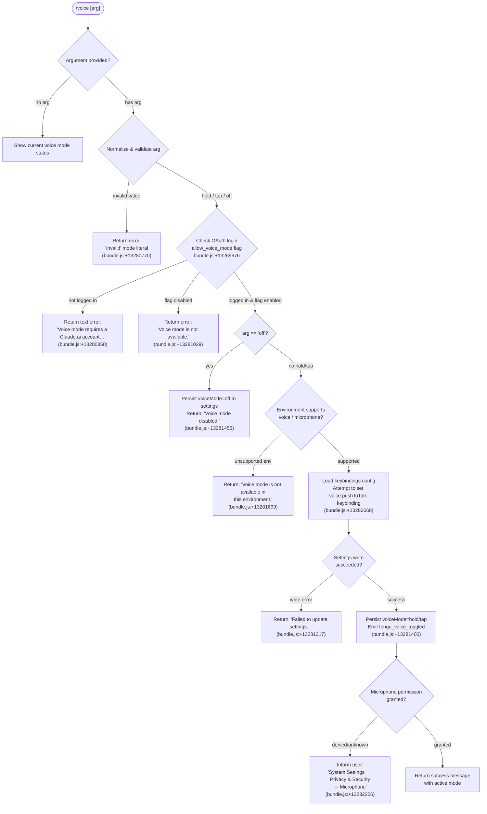

# `/voice`

> Analysis basis: CC v2.1.195 bundle.js (AST extraction + Claude interpretation)
> Minimum version: v2.1.195

---

## Overview

The `/voice` command toggles voice input mode for Claude Code, supporting three named sub-modes (`hold`, `tap`, `off`). It validates user authentication (requires a Claude.ai account via OAuth), checks that the `allow_voice_mode` feature flag is enabled in the current policy, and—when all preconditions pass—persists the chosen mode to user settings and optionally configures a push-to-talk keybinding. Non-interactive sessions are not supported.

---

## Registration

| Field | Value |
|---|---|
| type | `local` |
| name | `voice` |
| description | `Toggle voice mode` |
| argumentHint | `[hold\|tap\|off]` |
| supportsNonInteractive | `false` |
| isHidden | `null` |
| module_id | `Enc` |
| load_inline | `true` |
| loc_byte | `13283410` |
| loc_byte_end | `13283652` |
| loc_line | `9077` |
| arbor_handler.name | `mJf` |
| arbor_handler.fqn | `claude-2.1.195::mJf` |
| arbor_handler.kind | `AsyncFunction` |
| arbor_handler.resolution_path | `module_id` |
| arbor_handler.n_hits | `1` |

Analysis basis: CC v2.1.195 bundle.js:+13283410

---

## Input Branching

Five or more distinct branches exist based on argument value, authentication state, feature-flag state, and environment support — a Mermaid flowchart is required.



Analysis basis: CC v2.1.195 bundle.js:+13280726 through +13283126

---

## Behavioral Spec

### 1. Argument Parsing and Mode Normalization

The handler (`mJf`, resolved via `module_id` → `Enc`) reads the raw argument string, trims whitespace (Analysis basis: CC v2.1.195 bundle.js:+13281150), and compares it against three recognized literal strings: `"hold"` (bundle.js:+13280726), `"tap"` (bundle.js:+13280738), and `"off"` (bundle.js:+13280749). Any value not matching one of these three literals produces an `"invalid"` sentinel (bundle.js:+13280770).

```
function parseVoiceArg(rawArg):
    trimmed = rawArg.trim()
    if trimmed in ["hold", "tap", "off"]:
        return trimmed
    if trimmed == "":
        return null          // no argument — display status
    return "invalid"
```

Analysis basis: CC v2.1.195 bundle.js:+13280726, +13280738, +13280749, +13280770

---

### 2. Feature-Flag and Authentication Gate

Before acting on any mode change, the handler calls an authentication resolver (`Sbt` → `iar`) that:

1. Checks the `allow_voice_mode` permission flag in the loaded policy settings (literal `"allow_voice_mode"`, bundle.js:+13269676). If absent or `false`, the command exits with the "not available" error.
2. Verifies that the current session has a valid OAuth token (`user_oauth` scope, bundle.js:+13075889). If no OAuth login is present, it returns the login-prompt error message (bundle.js:+13280850).

Settings are loaded via `loadSettingsFromDisk` (entry `d8`, bundle.js:+13281067), which reads from `~/.claude/settings.json` and `settings.local.json` (bundle.js:+13325256, +13325318) with a locking protocol that emits `tengu_config_lock_contention` when contested.

```
async function checkVoiceGate(context):
    settings = await loadSettingsFromDisk()
    if not settings.allow_voice_mode:
        return { ok: false, reason: "flag_disabled" }
    if not hasOAuthToken(context):
        return { ok: false, reason: "not_logged_in" }
    return { ok: true }
```

Analysis basis: CC v2.1.195 bundle.js:+13269676, +13280850, +13281029, +13281067

---

### 3. Voice Mode Persistence

On a successful gate check with a valid mode (`hold` or `tap`), the handler calls the settings-writer (`io`, bundle.js:+13281219) which:

1. Acquires a file-system lock on the config file (may emit `tengu_config_lock_contention`, bundle.js:+14069271).
2. Re-reads the on-disk config under the lock to guard against concurrent writes. If a parse error is detected, it emits `tengu_config_auto_repaired` (bundle.js:+14069784) and proceeds from the cached copy.
3. Writes the updated `voiceMode` field.
4. Flushes and renames atomically via temp-file pattern (bundle.js:+1104779).

If the write fails entirely, the "Failed to update settings" error message is returned (bundle.js:+13281317).

For the `off` case the same persistence path is used and then returns `"Voice mode disabled."` (bundle.js:+13281455).

```
async function persistVoiceMode(mode, context):
    try:
        acquireConfigLock()
        currentConfig = readConfigUnderLock()
        currentConfig.voiceMode = mode
        writeConfigAtomic(currentConfig)
        releaseConfigLock()
    except ParseError:
        emit("tengu_config_auto_repaired")
        writeConfigAtomic(cachedConfig)
    except WriteError:
        return "Failed to update settings. Check your settings file for syntax errors."
    return null   // success
```

Analysis basis: CC v2.1.195 bundle.js:+13281317, +13281455, +14069271, +14069784

---

### 4. Keybinding Registration (hold/tap modes only)

When the mode is `hold` or `tap`, the handler invokes the keybinding loader (`tv`, bundle.js:+13282665) with action name `"voice:pushToTalk"` (bundle.js:+13282668), context `"Chat"` (bundle.js:+13282687), and default key `"space"` (bundle.js:+13282694).

The keybinding loader (`aFt`) reads `keybindings.json` (bundle.js:+13998450) from the user config directory and validates its structure:

- Must contain a `"bindings"` top-level array (bundle.js:+14000699).
- Each block requires `"context"` (string) and `"bindings"` (object) (bundle.js:+14001028).
- Duplicate keys within the same context emit a warning (bundle.js:+13996211) and the last value wins.

If no custom keybinding overrides the push-to-talk action, the built-in default (`space` in `Chat` context) is used and `tengu_keybinding_fallback_used` is emitted (bundle.js:+14007455).

```
function loadPushToTalkBinding(configDir):
    raw = readFile(path.join(configDir, "keybindings.json"))
    if raw is null:
        emit("tengu_keybinding_fallback_used")
        return defaultBinding("voice:pushToTalk", "Chat", "space")
    parsed = JSON.parse(raw)
    validate(parsed)   // emits tengu_keybinding_config_invalid_format on error
    binding = findBinding(parsed, action="voice:pushToTalk", context="Chat")
    if binding is null:
        emit("tengu_keybinding_fallback_used")
        return defaultBinding("voice:pushToTalk", "Chat", "space")
    return binding
```

Analysis basis: CC v2.1.195 bundle.js:+13282668, +13282687, +13282694, +14000699, +14007455

---

### 5. Environment and Microphone Permission Check

After persisting the mode, the handler checks whether the runtime environment supports voice (call to `oXe`, bundle.js:+13282799). This performs a locale/platform check (language tag `"en"`, bundle.js:+30405). If the environment is unsupported, `"Voice mode is not available in this environment."` is returned (bundle.js:+13281699).

For supported environments, microphone permission status is checked. If access is denied or the status is unknown, the user is instructed to enable it at `"System Settings → Privacy & Security → Microphone"` (bundle.js:+13282206). The telemetry event `tengu_voice_toggled` is emitted regardless of microphone status once persistence succeeds (bundle.js:+13281400).

```
function checkEnvironmentAndMicPermission(mode):
    if not environmentSupportsVoice():
        return "Voice mode is not available in this environment."
    micStatus = queryMicrophonePermission()
    emit("tengu_voice_toggled", { mode: mode })
    if micStatus != "granted":
        return hint("System Settings → Privacy & Security → Microphone")
    return null
```

Analysis basis: CC v2.1.195 bundle.js:+13281699, +13282206, +13281400, +13282799

---

### 6. Settings Load Infrastructure

The settings-load chain (`d8` → `p3`, `Ikr`, `io`) loads five tiers of settings in priority order: flag settings, policy settings, user settings (`~/.claude/settings.json`), project settings, and local settings (`settings.local.json`) (bundle.js:+13325246, +13325256, +13325318). Telemetry events `settings_load_started` and `settings_load_completed` are logged at INFO level around the disk read (bundle.js:+13330110, +13331010).

Analysis basis: CC v2.1.195 bundle.js:+13342444, +13342500, +13325246

---

## State & Side Effects

| Item | Detail |
|---|---|
| Telemetry — `tengu_voice_toggled` | Fired at bundle.js:+13281400 whenever a mode change is successfully persisted |
| Telemetry — `tengu_feature_ok` | Fired by feature-flag check path at bundle.js:+1027363 |
| Telemetry — `tengu_feature_bad` | Fired by feature-flag check path at bundle.js:+1027430 |
| Telemetry — `tengu_feature_sad` | Fired by feature-flag check path at bundle.js:+1027511 |
| Telemetry — `tengu_daemon_control` | Fired during daemon coordination at bundle.js:+17924594 |
| Telemetry — `tengu_config_lock_contention` | Fired when config write lock is contested (bundle.js:+14069271) |
| Telemetry — `tengu_config_auto_repaired` | Fired when on-disk config parse error is auto-healed (bundle.js:+14069784) |
| Telemetry — `tengu_config_stale_write` | Fired when a stale write is detected (bundle.js:+14069407) |
| Telemetry — `tengu_config_auth_loss_prevented` | Fired when a write is blocked to prevent wiping auth (bundle.js:+14070114) |
| Telemetry — `tengu_config_fallback_write` | Fired on global-config fallback write (bundle.js:+14068887) |
| Telemetry — `tengu_config_parse_error` | Fired on config parse error during save (bundle.js:+14073004) |
| Telemetry — `tengu_custom_keybindings_loaded` | Fired when keybindings.json is successfully loaded (bundle.js:+13998356) |
| Telemetry — `tengu_keybinding_fallback_used` | Fired when no custom binding is found and default is used (bundle.js:+14007455) |
| Telemetry — `tengu_keybinding_customization_release` | Fired during keybinding config release path (bundle.js:+13997936) |
| appState changes | `voiceMode` field written to `~/.claude/settings.json` or `settings.local.json` |
| Keybinding side-effect | `voice:pushToTalk` bound to `space` in `Chat` context if hold/tap mode selected |
| Settings file watch | `hRt` registers `CTs.watchFile` on the settings path (bundle.js:+1147333) |
| Config lock | File-system advisory lock acquired and released around every settings write |
| Sound | <!-- TODO: not found in depth-2 traversal; needs --depth 4 --> |

---

## Version History

| Version | Change |
|---|---|
| v2.1.195 | Initial analysis |

---

## Common Mistakes

1. **Running without a Claude.ai account**: Using `/voice hold` or `/voice tap` while authenticated only with an API key (no OAuth) returns `"Voice mode requires a Claude.ai account. Please run /login to sign in."` — run `/login` first.
2. **Flag not enabled by policy**: Even with a valid account, `allow_voice_mode` must be present and `true` in the effective policy. Enterprise-managed environments may block voice mode entirely.
3. **Passing an unrecognized argument**: Anything other than `hold`, `tap`, or `off` (including `on`, `enable`, `true`) is treated as `"invalid"`. The only accepted values are the three literals shown in `argumentHint`.
4. **Expecting non-interactive support**: `supportsNonInteractive` is `false`; the command cannot be used in piped or headless invocations.
5. **Corrupted keybindings.json**: If `keybindings.json` lacks a top-level `"bindings"` array, the keybinding step fails. The command will report the parse error and leave voice keybindings at their default.
6. **Microphone permissions not granted on macOS**: The mode is persisted to disk before the permission check. If microphone access is denied, voice mode is stored as active but unusable until the user grants access in System Settings.

---

## Appendix — Identifier Mapping

> For bundle debugging only. Identifiers change across versions.

| Identifier | Role |
|---|---|
| `mJf` | Main `/voice` command handler (AsyncFunction, entry point) |
| `Sbt` | Authentication + feature-flag pre-check dispatcher |
| `iar` | Inner auth resolver; calls feature-flag checker and login verifier |
| `eE` | Authentication context builder (loads OAuth token, API key, etc.) |
| `md` | Platform/environment utility |
| `ab` | Auth config accessor (reads profile, OAuth fields) |
| `Ql` | First-party auth type resolver |
| `oI` | OAuth identity reader |
| `TH` | API-key / token validation logic |
| `lNt` | Login-state helper |
| `jot` | Utility: token/string formatter |
| `jS` | JSON serialization helper |
| `cQt` | Voice-flag capability query |
| `aar` | Feature-allowance resolver |
| `Fs` | Feature-flag lookup (checks `allow_voice_mode`, `allow_product_feedback`) |
| `HNi` | Feature-flag hydration |
| `TF` | Feature-flag default resolver |
| `qi` | Remote settings query |
| `y_e` | Utility: settings field accessor |
| `g6` | Feature-flag cache/getter |
| `r` | Generic runtime module reference |
| `m6` | Argument string transformer (capitalize first char, slice) |
| `t` | Generic argument/input variable |
| `Mr` | Settings loader (outer wrapper) |
| `d8` | `loadSettingsFromDisk` — disk read with performance marks |
| `c0` | Config path resolver |
| `pa` | Performance mark helper (`loadSettingsFromDisk_start`) |
| `a5` | `require("perf_hooks")` accessor |
| `Ikr` | Settings file reader and merger |
| `wn` | File append / log writer |
| `Yon` | Settings layer merger |
| `ikt` | Flag-settings set builder |
| `ZCs` | Multi-layer settings combiner |
| `s` | Generic set/store reference |
| `o` | Generic output/array reference |
| `wve` | User-settings file path builder |
| `i` | Generic iterator / connection reference |
| `u8` | SDK inline-settings extractor |
| `XCs` | SDK settings validator |
| `p3` | Settings path registry (lists userSettings, projectSettings, localSettings) |
| `Hr` | Home-directory resolver |
| `Cvt` | Config version tag |
| `byr` | Backup settings path helper |
| `bvt` | Settings base-path helper |
| `Y$e` | Settings file existence checker |
| `J$e` | Settings JSON parser |
| `wvt` | Settings write helper |
| `jae` | Settings merge strategy |
| `Rve` | Settings layer priority resolver |
| `Amn` | Settings annotation helper |
| `gvs` | Settings validation helper |
| `Jee` | Settings defaults applier |
| `akt` | Platform detection (WSL check) |
| `zon` | Settings load end-marker |
| `uQt` | Voice-capability environment probe |
| `fJf` | Argument trim/normalize helper |
| `e` | Generic element / error variable |
| `io` | Config save-with-lock orchestrator |
| `Lg` | Config directory path resolver |
| `qt` | Logger / diagnostics emitter |
| `Tkr` | Telemetry key-result logger |
| `Xv` | File-path safety checker |
| `Wee` | File reader with encoding detection (UTF-8/UTF-16 BOM) |
| `Gd` | Real-path resolver |
| `T` | Path-safety validator |
| `kpn` | File size checker |
| `Mpn` | BOM stripper |
| `Cn` | ENOENT error classifier |
| `on` | Error code extractor |
| `RRr` | Request-timestamp recorder |
| `oBe` | Settings-file backup helper |
| `fmn` | Settings-file path resolver (user settings) |
| `aRt` | Atomic file write (temp + rename + fsync) |
| `u` | Daemon-control utility bundle |
| `Le` | Daemon stop (ok) handler |
| `ke` | Daemon stop (error) handler |
| `SF` | Daemon control dispatcher |
| `yj` | Process-exit race handler |
| `ZZe` | fsync error classifier (EINVAL, ENOTSUP, etc.) |
| `lAs` | Object.defineProperty wrapper |
| `ye` | String coercion helper |
| `Me` | JSON.stringify wrapper |
| `n_` | Cache-clear helper (Kon, QHr maps) |
| `eIs` | Git-ignore checker |
| `Ot` | Async-storage context getter |
| `Rpn` | AsyncLocalStorage store reader |
| `fRr` | File-write transaction helper |
| `n` | Generic node/name variable |
| `Sfn` | Git check-ignore runner |
| `Wr` | Child-process executor |
| `e1u` | Git global excludes-file resolver |
| `QTs` | Git ls-files tracker |
| `ZTs` | Git-ignore result writer |
| `M5` | `.claude` directory path builder |
| `wt` | Native daemon OS-level helper |
| `W` | Telemetry / event emitter |
| `Oe` | Telemetry event object constructor |
| `OJe` | Base telemetry event shape |
| `xe` | Error logger / structured error recorder |
| `Zr` | Error wrapper |
| `ut` | String coercer (String()) |
| `BMu` | Circular error-buffer manager |
| `a` | Response/spend-limit checker |
| `age` | JSON.stringify alias |
| `l` | Daemon status reader |
| `LZl` | Daemon status file parser (`daemon.status.json`) |
| `Hte` | Daemon heartbeat checker |
| `THe` | Daemon time-delta validator |
| `Vs` | AsyncLocalStorage store accessor |
| `WXt` | Daemon status path builder |
| `tv` | Keybinding action resolver (`voice:pushToTalk`) |
| `oMn` | Keybinding config loader |
| `aFt` | Keybinding file reader and validator |
| `cQr` | Keybinding key-lookup helper |
| `TV` | Keybinding release-flag checker |
| `lc` | Keybinding platform classifier (macos/linux) |
| `iye` | Keybinding JSON path builder |
| `Bt` | JSON.parse wrapper |
| `tMn` | Keybinding block-structure validator |
| `Qkn` | Keybinding entries enumerator |
| `TWi` | Keybinding custom-load telemetry emitter |
| `aQr` | Keybinding key-sequence parser |
| `lQr` | Keybinding block merger |
| `sMn` | Keybinding action-map builder |
| `mQr` | Keybinding action-map entry processor |
| `fQr` | Keybinding action validator |
| `hWi` | Platform keybinding selector |
| `rQr` | Keybinding modifier-sequence builder |
| `je` | Keybinding fallback telemetry emitter |
| `oXe` | Language/environment capability prober |
| `Mt` | Config watch manager |
| `Mjo` | Config-watch coordinator |
| `oTt` | Config backup/restore handler |
| `v5` | String prefix checker |
| `Ojo` | Config backup directory scanner |
| `Ujo` | Config backup path builder |
| `m` | Module list filter |
| `thr` | String path transformer |
| `k` | Config file watcher (chokidar-style) |
| `Csm` | Config watch setup/teardown |
| `hRt` | `watchFile` registration wrapper |
| `xme` | Watch-event debouncer |
| `vi` | Signal/keypress handler registration |
| `gn` | Global config save orchestrator |
| `xZt` | Config save-with-lock core (lock acquire, re-read, atomic write) |
| `Osi` | Config merge-on-save helper |
| `I3r` | Config conflict resolver |
| `sTt` | Config post-save notifier |
| `v` | Path prefix filter variable |
| `y` | Filename splitter variable |
| `dVe` | TeammateMailbox markMessagesAsRead (lock-acquire path) |
| `I` | Scroll / viewport math helper |
| `M` | HTTP server route handler (MCP gateway) |
| `A` | OAuth userinfo fetch helper |
| `sUe` | Save-global pre-check |
| `Djo` | Global config entries enumerator |
| `wZt` | Config modification timestamp recorder |
| `vZt` | Config backup entry builder |
| `Mcr` | Global config atomic writer |

---

Note: index built via Arbor fallback; some signals (telemetry, literals) may be missing — see arbor-fallback.js.