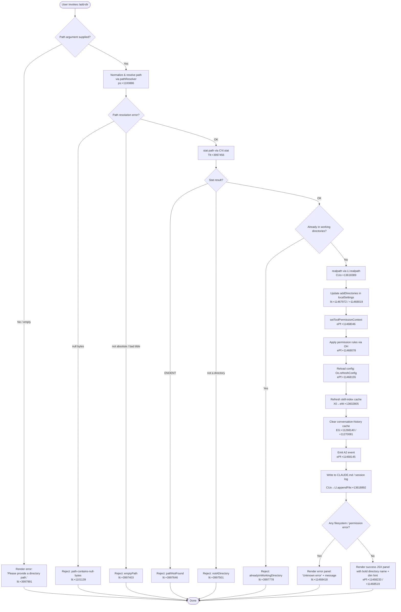

# `/add-dir`

> Analysis basis: CC v2.1.196 bundle.js (AST extraction + Claude interpretation)
> Minimum version: v2.1.196

---

## Overview

`/add-dir` registers an additional working directory for the current Claude Code session, expanding the set of filesystem paths the agent is permitted to access. The command validates the supplied path, resolves symlinks, updates session and local settings, and refreshes the permission context — all without interrupting the active conversation. It renders a JSX confirmation panel showing the newly added directory alongside guidance for managing permissions.

---

## Registration

| Field | Value |
|---|---|
| type | `local-jsx` |
| name | `add-dir` |
| description | Add a new working directory |
| argumentHint | `<path>` |
| loc_byte | 11469147 |
| loc_byte_end | 11469295 |
| loc_line | 7301 |
| module_id | `p1l` |
| load_inline | `true` |
| arbor_handler.name | `ePf` |
| arbor_handler.fqn | `claude-2.1.196::ePf` |
| arbor_handler.kind | `AsyncFunction` |
| arbor_handler.resolution_path | `module_id` |
| arbor_handler.n_hits | 0 |

Analysis basis: CC v2.1.196 bundle.js:+11469147

---

## Input Branching

The handler has 5+ distinct branches based on path validation outcome, directory-already-tracked detection, permission-context update success/failure, and filesystem error types. A flowchart is required.



---

## Behavioral Spec

### 1. Entry Point — Main Handler (`ePf`)

```
async function addDirHandler(context, args):
    rawPath = args.trim()

    // Validate & resolve path
    resolvedPath = await resolvePath(rawPath)       // calls pathResolver (ps)
    if resolvedPath.errorCode == "emptyPath":
        return renderError("Please provide a directory path.")
    if resolvedPath.errorCode == "notADirectory":
        return renderError(notADirectoryMessage)
    if resolvedPath.errorCode == "pathNotFound":
        return renderError(pathNotFoundMessage)
    if resolvedPath.errorCode == "alreadyInWorkingDirectory":
        return renderError(alreadyInWorkingDirectoryMessage)

    // Update session working-directory list
    localSettings = context.getLocalSettings()      // key "localSettings" lit:+11468019
    localSettings.addDirectories.push(resolvedPath) // key "addDirectories" lit:+11467972

    // Update permission context for new dir
    context.setToolPermissionContext(...)           // ePf:+11468046
    applyPermissionRules(context)                  // OH  ePf:+11468078

    // Housekeeping
    clearHistoryCache(context)                     // EG  ePf:+11468140
    clearSkillIndexCache(context)                  // X0→eW  ePf:+11468130
    context.eventBus.emit("directoryAdded", ...)   // A2.emit  ePf:+11468145
    await config.refreshConfig()                   // Oo.refreshConfig  ePf:+11468155

    // Persist to project log
    await appendToProjectLog(context, resolvedPath) // CUo  ePf:+11468174

    // Re-index slash-command definitions for new dir
    await reindexSlashCommands(context)            // xJi  ePf:+11468181

    // Render result
    return renderAddDirResult(context, resolvedPath, localSettings)
```

Analysis basis: CC v2.1.196 bundle.js:+11467936

---

### 2. Path Resolution (`ps` / `Tlt`)

```
async function resolvePath(rawPath):
    if rawPath == null or rawPath == "":
        return { errorCode: "emptyPath" }          // lit:+3997403

    // Expand tilde
    if rawPath.startsWith("~/"):                   // lit:+1101267
        rawPath = homedir() + rawPath.slice(1)     // ps:+1101236

    // Reject null bytes
    if rawPath.includes("\0"):
        throw Error("Path contains null bytes")    // lit:+1101139

    // Normalize
    normalizedPath = path.normalize(rawPath)       // ps:+1101198

    // Stat to confirm existence & type
    try:
        stat = await CVi.stat(normalizedPath)      // Tlt:+3997456
    catch err:
        if err.code == "ENOENT":                   // lit:+3338219 (reused)
            return { errorCode: "pathNotFound" }   // lit:+3997646

    if not stat.isDirectory():
        return { errorCode: "notADirectory" }      // lit:+3997501

    // Check for already-tracked duplicates
    existing = appState.getWorkingDirectories()
    if existing.includes(normalizedPath):
        return { errorCode: "alreadyInWorkingDirectory" } // lit:+3997778

    // Resolve symlinks to canonical form
    canonicalPath = await fs.realpath(normalizedPath) // CUo:+13618389

    return { resolvedPath: canonicalPath }
```

Analysis basis: CC v2.1.196 bundle.js:+3997422, +1100886, +3997456

---

### 3. Permission Context Update (`OH`)

```
function applyPermissionRules(context):
    // Applies "addRules" and "replaceRules" for the new directory
    // using rule categories: allow, alwaysAllowRules, deny,
    // alwaysDenyRules, alwaysAskRules, removeRules, removeDirectories
    ruleCategories = [
        "addRules",           // lit:+5447748
        "replaceRules",       // lit:+5448096
        "removeRules",        // lit:+5448753
        "removeDirectories",  // lit:+5449137
        "allow",              // lit:+5447933
        "alwaysAllowRules",   // lit:+5447941
        "deny",               // lit:+5447973
        "alwaysDenyRules",    // lit:+5447980
        "alwaysAskRules"      // lit:+5447998
    ]
    for each category in ruleCategories:
        mergeRulesForCategory(context, category)

    // Guard: if bypassPermissions mode is requested but disallowed:
    if requested("bypassPermissions") and policyDisallows():
        log("Ignoring permission update: setMode 'bypassPermissions' rejected...")
        // lit:+5447472
```

Analysis basis: CC v2.1.196 bundle.js:+11468078, +5447748, +5447933

---

### 4. Working-Directory State Read (`Ur`)

```
function getWorkingDirectoryContext(appState):
    // Reads current session's working directory entries
    wdEntry = appState.getAppState()              // Ur:+11145748
        .findLast(entry =>
            entry.type == "working_directory"     // lit:+11145853
        )

    allowedTools  = wdEntry?.allowed_tools        // lit:+11145908
    disallowedTools = wdEntry?.disallowed_tools   // lit:+11145963
    avoidPrompts  = wdEntry?.avoid_prompts        // lit:+11146024
    permMode      = wdEntry?.permission_mode      // lit:+11146126

    // Bypass-permissions guard
    if permMode == "bypassPermissions":           // lit:+11146157
        validateBypassAllowed(context)            // Sk→FYr→it

    return { allowedTools, disallowedTools, avoidPrompts, permMode }
```

Analysis basis: CC v2.1.196 bundle.js:+11145748, +11145853

---

### 5. Project Log Append (`CUo`)

```
async function appendToProjectLog(context, newDir):
    // Reads or creates CLAUDE.md (or equivalent) under the project root
    projectRoot = path.join(context.projectRoot, ".claude") // lit:+1330000
    logPath = path.join(projectRoot, "settings.json")       // lit:+1330010

    realLogPath = await fs.realpath(logPath)   // CUo:+13618389
    Sn(realLogPath)                             // error translator CUo:+13618418

    await fs.mkdir(path.dirname(realLogPath), { recursive: true })
                                                // CUo:+13618741
    await fs.appendFile(realLogPath, entry)     // CUo:+13618892

    // Handle permission errors (EACCES, EPERM, ENOTDIR, ELOOP, etc.)
    // lit:+185056, +185070, +185083, +185098
```

Analysis basis: CC v2.1.196 bundle.js:+13618354, +13618892

---

### 6. Slash-Command Re-index (`xJi`)

```
async function reindexSlashCommands(context):
    // Clears the existing slash-command index entry for the removed/added dir
    clearIndexEntry(context)                    // xJi→dE:+4339694

    // Rescans files in new directory for custom slash-command definitions
    newEntries = await scanDirectoryForCommands(context) // xJi→Yi:+4339712

    // Persists updated index
    await writeIndexState(context)              // xJi→zd:+4339877

    // Reports any scan errors via Jf (error reporter)
    reportErrors(context)                       // xJi→Jf:+4339988
```

Analysis basis: CC v2.1.196 bundle.js:+11468181, +4339694

---

### 7. Result Renderer (JSX)

```
function renderAddDirResult(context, resolvedPath, settings):
    if errorOccurred:
        // Renders: "Unknown error" + error.message        lit:+11468418
        // Also shows: "Did not add a working directory."  lit:+11468644
        return errorPanel(...)

    // Success panel structure (local-jsx):
    //  - Bold: resolved canonical path                    ePf:+11468233
    //  - Dim hint: "· /permissions to manage"            lit:+11468526
    //  - Context distinguisher:
    //      "the current working directory"  OR            lit:+3998491
    //      "the additional working directory"             lit:+3998523
    //  - Parent dir shown via b2t.dirname                 Ilt:+3998127

    return jsxPanel(
        bold(resolvedPath),
        dim("· /permissions to manage"),
        contextLabel
    )
```

Analysis basis: CC v2.1.196 bundle.js:+11468233, +11468519, +11468526, +11468644, +3998491, +3998523

---

## State & Side Effects

| Item | Detail |
|---|---|
| Telemetry | `tengu_disable_bypass_permissions_mode` (loc:+3439914) — fired when bypass-permissions mode is rejected by policy or settings |
| Telemetry | `tengu_bg_state_read_transient` (loc:+4335632) — fired during slash-command index background state read |
| Telemetry | `tengu_feature_ok` / `tengu_feature_bad` / `tengu_feature_sad` (loc:+1028610, +1028677, +1028758) — feature-gate telemetry reached via daemon control path |
| Telemetry | `tengu_daemon_config_reload` (loc:+18010884) — config reload event |
| Telemetry | `tengu_daemon_control` (loc:+18033163) — daemon start/stop tracking |
| appState changes | Appends new entry to `addDirectories` list in `localSettings` (lit:+11467972) |
| Permission context | `setToolPermissionContext` called to expand tool-access scope to the new path (ePf:+11468046) |
| Config refresh | `Oo.refreshConfig()` is awaited to synchronize all derived configuration (ePf:+11468155) |
| Event bus | `A2.emit` fires a "directory added" notification consumed by other subsystems (ePf:+11468145) |
| Skill-index cache | Cleared via `e.clearSkillIndexCache` (eW:+13602805) so the new directory's custom commands become discoverable |
| Conversation-history cache | `XYt.clear()` called (EG:+11270081) to avoid stale context |
| Filesystem | `fs.appendFile` to project settings/log under `.claude/` (CUo:+13618892) |
| Slash-command index | Fully rescanned for the new directory via `xJi` (ePf:+11468181) |
| Sound | None detected |
| Hook registration | `vi→fis.register` reached during output streaming setup (vi:+68542); not specific to this command |

---

## Version History

| Version | Change |
|---|---|
| v2.1.196 | Initial analysis |

---

## Common Mistakes

1. **Omitting the path argument** — invoking `/add-dir` with no argument causes an immediate rejection with the message "Please provide a directory path." (lit:+3997991). Always supply a concrete path.
2. **Passing a file path instead of a directory** — if the path resolves to a regular file, the handler rejects with `notADirectory` (lit:+3997501). The argument must point to an existing directory.
3. **Supplying a path already in the working-directory list** — the handler checks for duplicates before writing any state and rejects with `alreadyInWorkingDirectory` (lit:+3997778).
4. **Using relative paths without tilde expansion** — only `~/`-prefixed and absolute paths are reliably expanded. Relative paths (e.g., `./subdir`) may not resolve to the expected location unless the shell has already expanded them.
5. **Expecting immediate tool access after the command** — permission propagation, config refresh, and cache invalidation are asynchronous; a brief delay before tool calls against the new directory are fully authorized is normal.
6. **Confusing `/add-dir` with `/permissions`** — `/add-dir` only registers the directory; fine-grained tool allow/deny rules for it must be managed separately via `/permissions` (as noted in the rendered hint, lit:+11468526).

---

## Appendix — Identifier Mapping

> For bundle debugging only. Identifiers change across versions.

| Identifier | Role |
|---|---|
| `ePf` | Main async handler for `/add-dir` (entry point resolved by Arbor) |
| `Ur` | Working-directory context reader (reads appState, extracts tool permissions) |
| `ptr` | Allowed-tools permission helper |
| `ftr` | Disallowed-tools permission helper |
| `Sk` | Permission-mode validator (bypass-permissions guard) |
| `FYr` | Bypass-permissions mode check dispatcher |
| `it` | Inner bypass-permissions enforcement logic |
| `OH` | Permission-rule application engine (addRules, replaceRules, etc.) |
| `T` | Output/logging utility (debug-mode writer) |
| `eeu` | Debug output sub-handler |
| `gis` | Debug channel selector |
| `Me` | JSON-stringify wrapper |
| `Pc` | Path-redaction helper (replaces sensitive segments with `[REDACTED]`) |
| `Zls` | Path-component mapper |
| `KQe` | File-write wrapper |
| `Gls` | Low-level stream write helper |
| `oeu` | Async write-file orchestrator (rotation, backup) |
| `SQe` | Write-batching / debounce utility |
| `bhe` | File-write finaliser |
| `qt` | Path utilities accessor |
| `xae` | File-existence checker |
| `ncs` | Config-path resolver |
| `sTr` | Safe atomic file rename helper |
| `reu` | Recursive mkdir + appendFile helper |
| `vi` | Output stream hook registrar |
| `Np` | Rule-string normaliser |
| `K2u` | Backslash-escape replacer |
| `h0` | App-state accessor |
| `d` | Daemon/supervisor session manager |
| `TYe` | File-stat + permission-check helper |
| `rn` | Error code classifier |
| `Ks` | AsyncLocalStorage store reader |
| `zGo` | Permission-gate dispatcher |
| `he` | String coercion wrapper |
| `gic` | Directory-summary renderer |
| `E` | MCP/SDK connection manager |
| `$Ct` | Connection key enumerator |
| `o5c` | Object-key iterator for connections |
| `Re` | Error reporter / retry queue |
| `er` | Error constructor wrapper |
| `ct` | String-cast utility |
| `zi` | Essential-traffic classifier |
| `_Nu` | Retry-queue shift/push manager |
| `A` | Background agent / sub-process manager |
| `QHr` | Agent output formatter |
| `XHr` | Agent output line cleaner |
| `H` | Process/userinfo manager |
| `Wqc` | Heartbeat scheduler |
| `Wce` | Heartbeat payload builder |
| `I` | Input-event handler (keyboard/scroll) |
| `M` | HTTP request router (OAuth + API) |
| `kge` | JSON body stringifier |
| `Ots` | OAuth token store dispatcher |
| `lhe` | Local-history accessor |
| `X0` | Skill-index refresh orchestrator |
| `eW` | Skill-index cache clear + reload |
| `Qtr` | Skill-index query helper |
| `TPl` | Skill-index persistence helper |
| `dze` | Skill-index disk loader |
| `J7t` | Skill-index LRU-cache accessor |
| `QW` | Conversation-context refresh helper |
| `rnr` | Context-refresh sub-routine |
| `EG` | Conversation-history cache clearer |
| `CUo` | Project-log append handler (CLAUDE.md / settings.json writer) |
| `C4` | Project-environment loader |
| `jcc` | Environment key validator |
| `_5` | Environment value sanitiser |
| `z3e` | Settings-merge helper |
| `OL` | Settings object validator |
| `uf` | Settings key normaliser |
| `vHd` | Settings deep-merger |
| `o_` | Path normaliser (NFC unicode) |
| `Sn` | Filesystem-error translator |
| `t3` | Terminal column-width reader |
| `g0` | TTY width accessor |
| `dr` | Date/time formatter |
| `zo` | EACCES/EPERM error handler |
| `xJi` | Slash-command index re-builder |
| `dE` | Index-entry cache deleter |
| `Yi` | Directory scanner for slash-command files |
| `u` | File-metadata reader (lstat wrapper) |
| `xe` | Feature-gate success reporter |
| `ke` | Feature-gate failure reporter |
| `$F` | Feature-flag evaluator |
| `Wj` | Process-exit orchestrator |
| `ad` | File-read error reporter |
| `Gt` | JSON.parse wrapper |
| `zd` | Index write-back coordinator |
| `rg` | Atomic file writer (randomBytes + writeFile + rename) |
| `EBe` | Write-failure notifier |
| `Jf` | Scan-error reporter |
| `bde` | Permission-settings renderer (JSX) |
| `Jco` | Permission-rule list builder |
| `kfa` | Permission-rule formatter |
| `mWe` | Policy-settings loader |
| `fn` | Policy-settings accessor |
| `Tgp` | Permission-rule display row builder |
| `Lg` | Rule-label renderer |
| `Bd` | Real-path resolver (realpathSync) |
| `nw` | Rule-scope label builder |
| `vgp` | Rule-value display helper |
| `wg` | Rule-string formatter |
| `Y2u` | Rule-string prefix handler |
| `KM` | Rule-object property checker |
| `J2u` | Rule sub-type labeller |
| `z2u` | Rule special-character escaper |
| `no` | CLAUDE.md / gitignore rule writer |
| `CDr` | Settings-layer picker |
| `I3` | Settings-file writer (multi-layer) |
| `MMr` | Settings-write timestamp recorder |
| `VBe` | Settings-write dispatcher |
| `mkt` | Safe atomic file write (temp + rename + fsync) |
| `n_` | Cache-clear helper (Hin + Qyr) |
| `Gvs` | Gitignore-rule writer |
| `X5` | `.claude/settings.local.json` path builder |
| `wt` | Feature-gate sad-path reporter |
| `O8` | Settings-load-from-disk orchestrator |
| `Tlt` | Path-validation + stat orchestrator |
| `ps` | Path resolver (tilde, null-byte, normalize, homedir) |
| `Ot` | AsyncLocalStorage context reader |
| `tmn` | Store accessor for async context |
| `s9` | Date formatter (secondary) |
| `Tk` | macOS `/var/` → `/private/var/` path rewriter |
| `Xze` | Windows path normaliser |
| `Hm` | Case-normaliser for paths |
| `lle` | Path-length limiter |
| `Ilt` | Result-panel parent-dir label builder |

---

Note: index built via Arbor fallback; some signals (telemetry, literals) may be missing — see arbor-fallback.js.