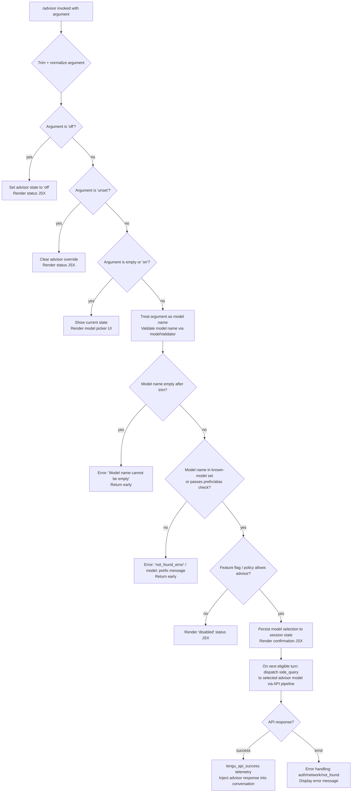

# `/advisor`

> Analysis basis: CC v2.1.196 bundle.js (AST extraction + Claude interpretation)
> Minimum version: v2.1.196

---

## Overview

The `/advisor` command allows Claude Code to consult a stronger or differently-capable model at key decision moments during a session. It is implemented as an async JSX-rendering handler (`qJf`) that builds a model-selection UI, validates the chosen model name, dispatches a side-query to the advisor model via the main API pipeline, and renders the result back into the conversation. The command supports toggling the feature on, off, or to "unset" (inheriting the project default), and persists the selection into session state.

---

## Registration

| Field | Value |
|---|---|
| type | `local-jsx` |
| name | `advisor` |
| description | `Let Claude consult a stronger model at key moments` |
| loc_byte | `13046996` |
| loc_byte_end | `13047252` |
| loc_line | `9028` |
| argumentHint | `[ ... ]` |
| isHidden | `null` (not hidden) |
| module_id | `wtc` |
| load_inline | `true` |
| arbor_handler.name | `qJf` |
| arbor_handler.fqn | `claude-2.1.196::qJf` |
| arbor_handler.kind | `AsyncFunction` |
| arbor_handler.resolution_path | `module_id` |
| arbor_handler.n_hits | `2` |

Analysis basis: CC v2.1.196 bundle.js:+13046996

---

## Input Branching

The command has at least four distinct execution paths depending on user input and session state: (1) feature disabled/off, (2) feature on with model selection, (3) unset/reset to default, and (4) model validation failure. A Mermaid flowchart is used.



Analysis basis: CC v2.1.196 bundle.js:+13046474, +13046540, +13046551, +9251609, +9252566

---

## Behavioral Spec

### 1. Handler Entry — `advisorCommandHandler` (`qJf`)

The top-level async handler for `/advisor`. It trims the raw input string, renders a JSX status component, and delegates to the model-name processor and the side-query dispatcher.

```
async function advisorCommandHandler(rawInput, appState):
    trimmedInput = rawInput.trim()                          // +13046474
    statusComponent = renderJSX(AdvisorStatusView, ...)    // +13046510

    if trimmedInput == "off":                              // +13046540
        setAdvisorState(appState, "off")
        return renderOffConfirmation()

    if trimmedInput == "unset":                            // +13046551
        clearAdvisorOverride(appState)
        return renderUnsetConfirmation()

    modelName = processModelInput(trimmedInput)            // delegates to nKt
    if modelName is invalid:
        return renderError(modelName.error)

    sideQueryResult = dispatchSideQuery(modelName, appState)   // delegates to FU / hV
    return renderAdvisorResult(sideQueryResult)
```

Analysis basis: CC v2.1.196 bundle.js:+13046474, +13046510, +13046608, +13046622, +13046648, +13046696, +13046769

---

### 2. Model Name Processing — `modelNameProcessor` (`nKt`)

Validates and resolves the user-supplied model name string. Also manages the persistent set (`PLo`) of recently used advisor models.

```
function modelNameProcessor(rawName, sessionState):
    name = rawName.trim()                                      // +9251572

    if name is empty:
        throw Error("Model name cannot be empty")              // +9251609

    normalizedName = name.toLowerCase()                        // +9251757

    if normalizedName in BLOCKED_MODEL_SET (FHe):              // +9251776
        return { error: "Model not permitted" }

    if PLo.has(normalizedName):                                // +9251878
        // already validated recently — fast path
        return { model: normalizedName }

    resolvedModel = resolveModelAlias(normalizedName)          // delegates to Fa / VPt
    validatedModel = validateWithAPI(resolvedModel)            // delegates to FU

    PLo.set(normalizedName, resolvedModel)                     // +9252086

    cacheHint = buildCacheHint("Hi", "ephemeral")             // +9252042, +9252067
    return { model: resolvedModel, cacheHint }
```

Analysis basis: CC v2.1.196 bundle.js:+9251572, +9251609, +9251757, +9251776, +9251878, +9252086

---

### 3. Model Alias Resolution — `modelAliasResolver` (`Fa`) and sub-functions

The model name is resolved against a large lookup table of canonical Claude model IDs. Short aliases such as `"opus"`, `"sonnet"`, `"haiku"`, `"fable"`, and `"best"` are expanded to fully-qualified model strings.

```
function resolveModelAlias(normalizedName):
    // Alias table (derived from literals)
    ALIAS_MAP = {
      "opus"    -> opus-family resolver (N_, NLe, Yp)      // +2309878
      "sonnet"  -> sonnet-family resolver (VC, qbn)        // +2310057
      "haiku"   -> haiku-family resolver (M3, U9r)         // +2310238
      "fable"   -> "fable" family resolver (P9r, zbn)      // +2309682
      "best"    -> best-available resolver (Ad, jo)        // +2324052
      "opusplan"-> opus planning resolver                  // +2323893
    }

    if normalizedName starts with "claude-":               // +2319904
        return resolveByFullId(normalizedName)             // VPt path

    for alias, resolverFn in ALIAS_MAP:
        if normalizedName matches alias:
            return resolverFn(normalizedName)

    // Fallback: pass through and let API validate
    return normalizedName
```

Known canonical model IDs referenced in the resolver (partial list, from literals):

| Alias token | Canonical ID |
|---|---|
| `fable` / `fable-5` | `claude-fable-5` (bundle.js:+2307627) |
| `opus-4-8` | `claude-opus-4-8` (+2320970) |
| `opus-4-7` | `claude-opus-4-7` (+2321027) |
| `opus-4-6` | `claude-opus-4-6` (+2321084) |
| `opus-4-5` | `claude-opus-4-5` (+2321141) |
| `opus-4-1` | `claude-opus-4-1` (+2321198) |
| `opus-4-0` | `claude-opus-4-0` (+2321287) |
| `sonnet-4-6` | `claude-sonnet-4-6` (+2321319) |
| `sonnet-4-5` | `claude-sonnet-4-5` (+2321380) |
| `sonnet-4-0` | `claude-sonnet-4-0` (+2321475) |
| `haiku-4-5` | `claude-haiku-4-5` (+2321509) |
| `3-7-sonnet` | `claude-3-7-sonnet` (+2321568) |
| `3-5-sonnet` | `claude-3-5-sonnet` (+2321629) |
| `3-5-haiku` | `claude-3-5-haiku` (+2321690) |
| `3-opus` | `claude-3-opus` (+2321749) |
| `mythos-preview` | `claude-mythos-preview` (+3068608) |
| `mythos-5` | `claude-mythos-5` (+2320913) |

Provider-type strings used during model routing: `"gateway"`, `"bedrock"`, `"foundry"`, `"anthropicAws"`, `"mantle"`, `"vertex"`, `"firstParty"` (bundle.js:+2153086 – +2153970).

Analysis basis: CC v2.1.196 bundle.js:+2303633, +2309621, +2310040, +2319835

---

### 4. Model Validation Against API — `apiModelValidator` (`FU`)

Sends a lightweight structural check (or cache lookup) to confirm the model identifier is accepted before committing it to state. Uses SHA-256 hashing for cache key generation and limits retry depth.

```
async function apiModelValidator(modelId, context):
    cacheKey = sha256Hash(modelId)[0:3]                    // +8704814, +8704829, +8704856
    maxRetries = 2                                         // +8705651

    if cachedResult = checkCache(cacheKey):
        return cachedResult

    // Prepare side-query request
    requestPayload = buildSideQueryPayload(modelId, context)   // +8705824 "side_query"

    response = await sendAPIRequest(requestPayload)

    if response.success:
        emitTelemetry("tengu_api_success")                 // +8707497
        storeInCache(cacheKey, response)
        return response

    if response.status == 429:                             // +17811194
        handleRateLimit(response)

    errorType = classifyError(response)
    if errorType == "not_found_error":                     // +9252566
        return { error: "model:" + modelId + " not found" }   // +9252648

    if errorType == "auth_error":
        return { error: "Authentication failed. Please check your API credentials." }  // +9252345

    if errorType == "network_error":
        return { error: "Network error. Please check your internet connection." }      // +9252447
```

Analysis basis: CC v2.1.196 bundle.js:+8704814, +8705824, +9252345, +9252447, +9252566, +9252648

---

### 5. Model Validation Telemetry Tagging — `modelValidationTagger` (`nKt` suffix block)

After successful validation, a telemetry tag of `"model_validation"` is attached to the event stream to record that the advisor model was changed during the session.

```
function tagModelValidationEvent(modelId):
    tag = { kind: "model_validation", model: modelId }    // +9251973
    emitSessionEvent(tag)
```

Analysis basis: CC v2.1.196 bundle.js:+9251973

---

### 6. Alias Normalization Detail — `aliasNormalizer` (`Flf`)

Handles the specific short-form aliases that users are most likely to type. Performs lowercase normalization and an `includes` check against a known alias list before delegating to the canonical ID lookup table.

```
function aliasNormalizer(inputAlias):
    lower = inputAlias.toLowerCase()                       // +9252897
    if knownAliasSet.includes(lower):                      // +9252916
        return lookupCanonical(lower, canonicalModelTable) // Yp +9253001

    // Examples of known short-form aliases:
    // "fable-5" / "fable_5"        -> claude-fable-5     // +9252927, +9252950
    // "opus-4-8" / "opus_4_8"      -> claude-opus-4-8    // +9253027, +9253051
    // "opus-4-7" / "opus_4_7"      -> claude-opus-4-7    // +9253096, +9253120
    // "opus-4-6" / "opus_4_6"      -> claude-opus-4-6    // +9253165, +9253189
    // "opus-4-5" / "opus_4_5"      -> claude-opus-4-5    // +9253234, +9253258
    // "sonnet-4-6" / "sonnet_4_6"  -> claude-sonnet-4-6  // +9253303, +9253329
    // "sonnet-4-5" / "sonnet_4_5"  -> claude-sonnet-4-5  // +9253378, +9253404

    return null   // not a recognized alias
```

Analysis basis: CC v2.1.196 bundle.js:+9252879, +9252897, +9252916, +9253001

---

### 7. JSX Rendering Pipeline — `advisorViewRenderer` (`iOe`, `JHt`, `YKn`)

The command returns a JSX component tree rather than a plain string. The renderer filters available models, formats each as a selection option, and pipes through the standard inline-text formatter.

```
function advisorViewRenderer(models, currentAdvisor, appState):
    filteredModels = models.filter(availabilityFilter)     // Zof.filter +8961154
    options = filteredModels.map(m =>
        formatOption(m, currentAdvisor, inlineTextFormatter) // YKn +8961117, sp +8961121
    )
    return renderModelPickerJSX(options, appState)         // jo +8961124
```

Analysis basis: CC v2.1.196 bundle.js:+13046769, +8961117, +8961121, +8961124, +8961154, +8961170

---

### 8. Side-Query Dispatch — `sideQueryDispatcher` (`hV`)

The actual consultation call to the advisor model. This is the core mechanism described in the command description. It assembles request headers, attaches session identifiers, performs token auth, and streams the response.

```
async function sideQueryDispatcher(modelId, conversationContext, appState):
    // Header assembly
    headers = {
        "x-app":                   "cli",                 // +3056022
        "User-Agent":              buildUserAgent(),       // +3056028
        "X-Claude-Code-Session-Id": sessionId,            // +3056046
        "x-client-app":            "cli",                 // +3056170
        "x-claude-code-agent-id":  agentId,               // +3056204
    }

    // Auth check
    if oauthTokenNeedsRefresh():                          // +3056583
        refreshOAuthToken()                               // ph / ELn +3056630, +3111236

    // Timeout: 600000 ms, retry depth: 10                // +3056955, +3056963
    request = buildRequest(modelId, conversationContext, headers)
    response = await streamingAPICall(request)            // got / fetch +2380531

    if response.contentType == "text/event-stream":       // +3065352
        return parseSSEStream(response)

    if response.contentType includes "vnd.amazon.eventstream":  // +3065402
        return parseBedrockStream(response)

    emitTelemetry("tengu_api_success")                    // +8707497
    return response
```

Request timeout: 600,000 ms (bundle.js:+3056955). Retry depth limit: 10 (bundle.js:+3056963). WIF token exchange endpoint: `"wif_token_exchange"` (bundle.js:+2381269). Base API URL: `"https://api.anthropic.com"` (bundle.js:+2380490).

Analysis basis: CC v2.1.196 bundle.js:+3055974, +3056022, +3056046, +3056583, +3056955, +3056963, +2380490, +2380531

---

## State & Side Effects

| Item | Detail |
|---|---|
| Telemetry: `tengu_api_success` | Emitted on successful advisor model API response (bundle.js:+8707497) |
| Telemetry: `tengu_lone_surrogate_sanitized` | Emitted if lone Unicode surrogates are found and sanitized in model name or response (bundle.js:+8707193) |
| Telemetry: `tengu_prompt_cache_1h_config` | Emitted when 1-hour prompt cache configuration is applied to the advisor request (bundle.js:+13902163) |
| Telemetry: `tengu_daemon_yield` | Emitted if the background daemon yields control during side-query processing (bundle.js:+18015313) |
| Telemetry: `tengu_bg_dispatch_sigkill_escalate` | Emitted if a background worker must be SIGKILL-escalated during advisor dispatch (bundle.js:+17993512) |
| Telemetry: `tengu_daemon_idle_exit` | Emitted when daemon exits idle state due to advisor activity (bundle.js:+18016355) |
| Telemetry: `tengu_feature_ok` / `tengu_feature_bad` | Feature flag check outcome for advisor enablement (bundle.js:+1028610, +1028677) |
| Telemetry: `tengu_bg_spare_enable` / `tengu_bg_spare_claim` | Background spare session lifecycle during advisor dispatch (bundle.js:+17994792, +17994920) |
| Telemetry: `tengu_bg_handoff_settle` | Background handoff settling after side query (bundle.js:+18000778) |
| Session state: `PLo` (model cache Map) | Stores recently validated advisor model names to avoid repeat API round-trips (+9251878, +9252086) |
| Session state: advisor mode | Written as `"off"`, `"unset"`, or `<modelId>` depending on user input (+13046540, +13046551) |
| Model validation tag | `"model_validation"` event written to session event stream on model change (+9251973) |
| Cache hint | `"ephemeral"` cache control appended to advisor request (+9252067) |
| `policySettings` | Policy settings key consulted before activating advisor (+2304063) |
| Prompt cache 1h | Applied to advisor sub-agent requests when eligible (+13902163) |
| Hook registration | No dedicated hook registered; advisor uses the shared `side_query` pathway (`"side_query"` literal at +8705824) |
| Sound | <!-- TODO: not found in depth-2 traversal; needs --depth 4 --> |

---

## Version History

| Version | Change |
|---|---|
| v2.1.196 | Initial analysis |

---

## Common Mistakes

1. **Supplying an unrecognized model alias**: If the model name does not match a known alias (e.g., `"fable-5"`, `"opus-4-8"`) or a full `claude-*` ID, the validator returns a `not_found_error` and the advisor is not activated. Always use a recognized short alias or the full canonical model ID.
2. **Confusing `off` and `unset`**: `/advisor off` explicitly disables the advisor for the session. `/advisor unset` clears the session override and reverts to the project or workspace default. These are distinct operations.
3. **Expecting instant consultation**: The advisor consults the configured model at *key moments* chosen by the runtime, not on every turn. Setting the advisor model does not guarantee it is called on the very next message.
4. **Using underscore aliases when only hyphenated forms are recognized at input**: The alias normalizer accepts both `opus_4_8` and `opus-4-8` forms internally, but the UI hint shows the hyphenated form. Prefer hyphenated input to avoid ambiguity.
5. **Assuming advisor works without API access**: The command performs live API validation of the model name. If there is no network access or credentials are missing, the command will fail with an authentication or network error rather than accepting the model name optimistically.
6. **Policy/feature-flag blocks**: In environments where the `policySettings` or feature flags disable the advisor (returning `"disabled"`), the command renders a disabled status view and does not activate, even if a valid model is specified.

---

## Appendix — Identifier Mapping

> For bundle debugging only. Identifiers change across versions.

| Identifier | Role |
|---|---|
| `qJf` | Top-level async handler for `/advisor` command (AsyncFunction, fqn: `claude-2.1.196::qJf`) |
| `nKt` | Model name processor: validates, normalizes, and caches advisor model names |
| `Flf` | Alias normalizer: maps short-form aliases to canonical model IDs |
| `$lf` | Alias resolution wrapper; calls `Flf` and handles String coercion |
| `FU` | API model validator and side-query orchestrator |
| `hV` | Side-query dispatcher: assembles headers, auth, and streams API response |
| `iOe` | JSX view renderer entry-point for advisor model picker |
| `JHt` | Model list filter and option mapper for picker UI |
| `YKn` | Per-model option formatter (calls inline text formatter and `jo`) |
| `Nvo` | Context/capability checker used during model picker rendering |
| `Kbn` | Token/capability validator called from `Nvo` |
| `jo` | Inline text formatter used throughout model name and output processing |
| `Fa` | Model alias resolution dispatcher: routes to `P9r`, `VC`, `M3`, `N_`, etc. |
| `Qai` | Composite model resolver (calls `Kle`, `B3e`, `N_`, `Fa`) |
| `Kle` | Model family lookup (calls `Hr`, `Su`, `qHe`, `VHe`) |
| `VPt` | Full canonical model ID resolver (handles `claude-` prefix path) |
| `P9r` | Opus/fable family resolver |
| `Yp` | Base model property builder |
| `zbn` | Model metadata builder |
| `hY` | Provider-type resolver |
| `B3e` | Alternate model family resolver |
| `VC` | Sonnet family resolver |
| `qbn` | Sonnet sub-family builder |
| `M3` | Haiku family resolver |
| `U9r` | Haiku sub-family builder |
| `N_` | Opus alias resolver |
| `NLe` | Opus sub-family builder |
| `TF` | Model capability feature-flag checker (calls `zHe`, `io`, `jP`, `l_`, `Su`) |
| `io` | Model capability inspector |
| `O_` | Provider-aware model ID normalizer |
| `l_` | Model prefix/type checker (calls `aPt`, `Efd`, `Hr`, `V8`) |
| `V8` | Model ID case-normalizer against `Object.values` |
| `EH` | Model name encoding helper |
| `zHe` | Model feature-flag state reader |
| `$a` | String replacement utility (used in model name cleaning) |
| `w0` | Model blocklist membership check (calls `FHe.includes`) |
| `Ad` | Model availability checker (calls `Hr`) |
| `jle` | Model inclusion-list checker (calls `fHd.includes`) |
| `F3e` | Model capability constant builder (calls `ct`) |
| `oHd` | Model ID lowercase normalizer |
| `AF` | Model name replacement formatter |
| `Jai` | Policy settings entry mapper (calls `Object.entries`) |
| `fn` | Policy settings finalizer (calls `Bgn`, `I3`) |
| `Crt` | Provider/model entry mapper (calls `kr`, `Object.entries`) |
| `Yai` | Model format-check helper (calls `mF`, `n.indexOf`) |
| `tHd` | Model-type dispatch helper |
| `nHd` | Model prefix handler |
| `Wbn` | Recursive model alias resolution wrapper |
| `mF` | Model family membership tester (calls `yfd.includes`) |
| `Z8` | Model zone/region resolver |
| `es` | Utility used in model list rendering |
| `bMt` | Tool/model bitmask resolver |
| `TMt` | Tool metadata builder |
| `qte` | Token/session query helper |
| `cf` | Request builder (calls `Rt`) |
| `Rt` | Core request constructor |
| `CY` | App-type header builder |
| `bqr` | Request body parser |
| `Hi` | Background-mode header tagger |
| `VY` | Issue-reporting URL builder |
| `V9r` | URL encoder for model/request params |
| `T` | Model debug/trace formatter |
| `ph` | OAuth token refresh handler (calls `ELn`) |
| `sli` | Boolean coercion utility |
| `aE` | Auth environment loader |
| `Rm` | Response metadata extractor |
| `MDd` | Session state delta builder |
| `vr` | Workspace trust reader |
| `iyn` | Proxy auth helper executor |
| `FDd` | Request deduplication / UUID manager |
| `E3` | Environment capability checker |
| `xg` | Session/request context builder |
| `$Dd` | Request lock manager |
| `DDd` | Response queue dispatcher |
| `VLe` | Rate-limit / timing manager |
| `RSr` | Timestamp recorder |
| `lUt` | Response header normalizer |
| `Pxe` | SDK error logger |
| `Qwn` | Streaming response coordinator |
| `vae` | Model capability flag finder |
| `mw` | Threading helper |
| `cb` | Conversation state binder |
| `qLe` | Provider-specific response adapter |
| `got` | Core HTTP fetch wrapper |
| `h` | Background session manager / spawner |
| `V` | Generic value container / pipe |
| `j` | Process/subprocess lifecycle manager |
| `On` | Abort-aware async wrapper |
| `ke` | Feature-ok event emitter |
| `xe` | Feature-bad event emitter |
| `CYe` | Memory/system info reporter |
| `N6e` | File cache cleanup handler |
| `Re` | Error logger with retry tracking |
| `z` | MCP connection state manager |
| `it` | Turn tracker and tool-call counter |
| `_ns` | Background daemon connection handler |
| `bns` | Background session lifecycle manager |
| `g` | Generic file I/O helper |
| `rn` | Path join/resolve utility |
| `Oe` | Render output helper |
| `Y` | Disposal/cleanup manager |
| `L4e` | API-version gating helper |
| `AN` | Model-type header builder |
| `Yle` | Cache-key model resolver |
| `bwt` | Cache backend accessor |
| `D4r` | Model ID replacer for Foundry |
| `vtf` | Model candidate finder |
| `tCo` | SHA-256 hash generator |
| `tTn` | User-agent / cache string builder |
| `_l` | String coercion utility |
| `Zbn` | AsyncLocalStorage store reader |
| `FLe` | Cache-control string builder |
| `NRn` | Response normalizer |
| `PVe` | Prompt-cache 1h configurator |
| `Ao` | Auth environment aggregator |
| `JP` | HIPAA/compliance mode checker |
| `Nqr` | HIPAA header builder |
| `w4e` | Compliance mode response wrapper |
| `L` | Main conversation loop runner |
| `vze` | State snapshot reader |
| `_Kt` | Background work enqueuer |
| `Ike` | Loop-type detector |
| `tkm` | System prompt builder for away summary |
| `UOc` | Away summary context accessor |
| `$Oc` | StructuredOutput recap checker |
| `hGt` | Away summary generator |
| `qfc` | UUID generator for conversation turns |
| `ctl` | Context-length tracker |
| `aLn` | Temperature/sampling param builder |
| `yw` | Message mapper |
| `Jke` | Sub-agent turn dispatcher |
| `w6` | Random bytes / nonce generator |
| `Nc` | Sub-agent context binder |
| `Me` | JSON serializer |
| `uln` | Message array mutator |
| `lln` | Message format validator |
| `CP` | Deep clone utility |
| `YQe` | Alternate message array mutator |
| `cln` | Message content cleaner |
| `qe` | Render state accessor |
| `O4r` | Model capability batch checker |
| `bci` | Model ID format validator |
| `P4r` | Model-permission cache manager |
| `UCe` | Usage counter |
| `Ar` | Animation / spinner renderer |
| `Ig` | Render state initializer |
| `Mo` | Render output finalizer |
| `SBt` | Tool execution sandboxer |
| `eXi` | Sandbox entry-point |
| `_ct` | Sandbox identity builder |
| `EBt` | Sandbox environment configurator |
| `p2` | Agent type classifier |
| `BQd` | Agent prefix stripper |
| `QP` | Thread-type checker |
| `gwt` | Generic work tracker |
| `Hr` | Model/provider type discriminator |
| `Su` | Model capability set builder |
| `ct` | Primitive string-to-type converter |
| `pw` | Model permission resolver |
| `sp` | Text sanitizer / replacer |
| `jP` | Model descriptor formatter |
| `aPt` | Model prefix validator |
| `Efd` | Model name prefix stripper |
| `qHe` | Tool-use array validator |
| `VHe` | Model inclusion-list member check |
| `not` | Negation / exclusion checker |
| `vs` | Error exit handler (calls `MYe`, `uI`, `process.exit`) |
| `s` | Pending-set manager (add/delete pattern) |
| `bns` | Background session lifecycle handler |

Note: index built via Arbor fallback; some signals (telemetry, literals) may be missing — see arbor-fallback.js.