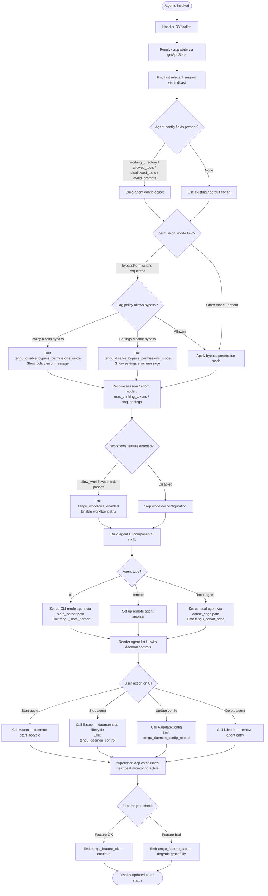

# `/agents`

> Analysis basis: CC v2.1.196 bundle.js (AST extraction + Claude interpretation)
> Minimum version: v2.1.196

---

## Overview

The `/agents` command provides an interactive management interface for agent configurations within Claude Code. It renders a JSX-based UI (type `local-jsx`) that allows users to inspect, start, stop, update, and monitor background agent processes. The command coordinates daemon lifecycle operations, permission-mode enforcement, and real-time agent status display.

---

## Registration

| Field | Value |
|---|---|
| type | `local-jsx` |
| name | `agents` |
| description | `Manage agent configurations` |
| loc_byte | `12995753` |
| loc_byte_end | `12995878` |
| loc_line | `9017` |
| module_id | `nec` |
| load_inline | `true` |
| arbor_handler.name | `OYf` |
| arbor_handler.fqn | `claude-2.1.196::OYf` |
| arbor_handler.kind | `AsyncFunction` |
| arbor_handler.resolution_path | `module_id` |
| arbor_handler.n_hits | `0` |

Analysis basis: CC v2.1.196 bundle.js:+12995753

---

## Input Branching

The command involves more than three distinct operational paths — daemon start/stop, config reload, permission-mode enforcement, feature-flag gating, and agent session management — so a Mermaid flowchart is used below.



---

## Behavioral Spec

### Top-Level Handler — `agentsCommandHandler` (OYf)

Analysis basis: CC v2.1.196 bundle.js:+12995614

```
async function agentsCommandHandler(context):
    appState = resolveAppState(context)          // via getAppState
    lastSession = findLastSession(appState)       // via findLast, key: "working_directory"
    agentConfig = buildAgentConfig(lastSession)   // fields below
    uiComponents = buildAgentUI(agentConfig, context)
    return renderJSX(uiComponents)               // via rec.jsx
```

The handler is an `AsyncFunction` resolved via `module_id → nec` at bytes `12995753–12995878`.

---

### Agent Config Resolution — `resolveAgentSession` (Ur)

Analysis basis: CC v2.1.196 bundle.js:+11145748

```
function resolveAgentSession(appState):
    session = appState.getAppState()

    // Identify relevant agent from session stack
    target = session.findLast(item =>
        item.toLowerCase() matches agent criteria
    )

    config = {
        working_directory : extractField(target, "working_directory"),   // +11145853
        allowed_tools     : extractField(target, "allowed_tools"),       // +11145908
        disallowed_tools  : extractField(target, "disallowed_tools"),    // +11145963
        avoid_prompts     : extractField(target, "avoid_prompts"),       // +11146024
        permission_mode   : extractField(target, "permission_mode"),     // +11146126
        session           : extractField(target, "session"),             // +11146456
        effort            : extractField(target, "effort"),              // +11146481
        model             : extractField(target, "model"),               // +11146494
        max_thinking_tokens: extractField(target, "max_thinking_tokens"),// +11146506
        flag_settings     : extractField(target, "flag_settings"),       // +11146532
    }

    return config
```

---

### Permission Mode Enforcement — `enforceBypassPermissions` (Sk → FYr → it)

Analysis basis: CC v2.1.196 bundle.js:+11146179 / +3440184

```
function enforceBypassPermissions(config):
    if config.permission_mode == "bypassPermissions":          // +11146157
        orgPolicyResult = checkOrgPolicy()                     // via it → t0e.has

        if orgPolicyResult.blocked:
            emitTelemetry("tengu_disable_bypass_permissions_mode")  // +3439914
            // Error: "Bypass permissions mode was disabled by
            //         your organization policy"               // +3439964
            return POLICY_BLOCKED

        settingsResult = checkSettings()                       // via es
        if settingsResult == "disable":                        // +3440089
            emitTelemetry("tengu_disable_bypass_permissions_mode")
            // Error: "Bypass permissions mode was disabled by settings" // +3440105
            return SETTINGS_BLOCKED

    return ALLOWED
```

Maximum bypass-check depth: 1 policy level + 1 settings level before rejection.

---

### Workflow Feature Gate — `checkWorkflowsEnabled` (KFi → Gs)

Analysis basis: CC v2.1.196 bundle.js:+3415577

```
function checkWorkflowsEnabled(featureContext):
    hasAllowWorkflows = featureContext.has("allow_workflows")  // +3415885
    if not hasAllowWorkflows:
        return DISABLED

    allowed = checkOrgFeatureFlags([
        "allow_product_feedback",   // +3394770
        "allow_workflows",          // +3415885
    ])

    if allowed and subscriptionTier == "pro":                  // +3416331
        emitTelemetry("tengu_workflows_enabled")               // +3416086
        return ENABLED

    return DISABLED
```

---

### Agent Type Routing — `resolveAgentType` (Ow → f9t)

Analysis basis: CC v2.1.196 bundle.js:+5150531 / +5140382

```
function resolveAgentType(config):
    // Normalise transport string
    agentMode = normaliseString(config.mode)   // via _l / ct → String coercions

    switch agentMode:
        case "cli":                            // +5150683
            emitTelemetry("tengu_slate_harbor")   // +5150713
            return setupCLIAgent(config)

        case "remote":                         // +5150694
            return setupRemoteAgent(config)

        case "local-agent":                    // +7238240
            emitTelemetry("tengu_cobalt_ridge")   // +5147717
            return setupLocalAgent(config)       // via mU / bu

        case "standard":                       // +5139327
        case "tst":                            // +5139406
        case "tst-auto":                       // +5139456
            return setupTestAgent(config, capacity=100)  // +5139419

        default:
            return setupDefaultAgent(config)
```

---

### Daemon Lifecycle — `daemonController` (d — supervisor loop)

Analysis basis: CC v2.1.196 bundle.js:+18010066 / +18010285

```
async function daemonController(agentEntry, store):
    // Validate agent entry file
    stat = await fileSystem.stat(agentEntry)         // via TYe → mic.stat +13338188
    if stat error == "ENOENT":                       // +13338219
        return Promise.reject(NOT_FOUND)

    if not stat.isFile():                            // +13338260
        return Promise.reject(NOT_A_FILE)

    if stat.size > 1048576:                          // +13338279 (1 MiB limit)
        return Promise.reject(TOO_LARGE)

    // Fetch store context
    storeCtx = Ks.getStore()                         // via Mfd.getStore +2176008

    // Load existing config from daemon status JSON
    statusFile = buildPath("daemon.status.json")     // +13163777

    // Display current agent configuration table
    keys = Object.keys(agentConfig)                  // +13338697
    maxColWidth = Math.max(...columnWidths)           // via gic +13339454
    writeTable(output, keys, maxColWidth)             // +13339653

    // Lifecycle: stop existing agent if running
    await stopExistingAgent()                        // E.stop +18010359
    store.delete(agentId)                            // i.delete +18010368

    // Apply updated configuration
    agent.updateConfig(newConfig)                    // A.updateConfig +18010488
    await agent.start()                              // A.start +18010506

    // Re-register heartbeat monitoring
    startHeartbeat("heartbeat")                      // +18009312 via Wqc → Wce
    store.set(agentId, agent)                        // i.set +18010653

    // Start supervisor session
    supervisorSession.start()                        // I.start +18010664
    emitTelemetry("tengu_daemon_config_reload")      // +18010884

    // Update UI view
    renderView(V)                                    // +18010882
```

Agent entry file size limit: **1,048,576 bytes (1 MiB)** — Analysis basis: CC v2.1.196 bundle.js:+13338279

Column padding width for agent table display: **40 characters** — Analysis basis: CC v2.1.196 bundle.js:+18024035

---

### Daemon Stop Sequence — `daemonStopHandler` (u → xe / ke)

Analysis basis: CC v2.1.196 bundle.js:+18033085 / +18033108

```
async function daemonStopHandler(daemonList):
    for daemon in daemonList:
        try:
            result = await daemon.stop()             // xe path
            emitTelemetry("tengu_feature_ok")        // +1028610 (daemon_stop)
            recordEvent("daemon_stop")               // literal +18033088
        catch error:
            emitTelemetry("tengu_feature_bad")       // +1028677
            recordEvent("daemon_stop_failed")        // literal +18033125

    // Coordinated shutdown via promise racing
    await Promise.race([
        shutdownAll(),                               // Wj → rye → nye.shutdown
        timeout(timeoutMs),                          // pye → clearTimeout / gqo
        abortSignal(),                               // On → setTimeout +1064329
    ])

    if allStopped:
        emitTelemetry("tengu_daemon_control")        // +18033163
```

Daemon stop events emitted: `daemon_stop` (success) and `daemon_stop_failed` (error) — Analysis basis: CC v2.1.196 bundle.js:+18033088, +18033125

---

### Agent UI Construction — `buildAgentUIComponents` (f1)

Analysis basis: CC v2.1.196 bundle.js:+10572291

```
function buildAgentUIComponents(config, featureFlags):
    // Resolve API backend type
    backendType = resolveBackend(config)   // Ow → O5
    // Values: "cli" | "remote" | "sdk" +17528449

    // Build agent list filtered by active features
    filteredAgents = agents.filter(a => isAgentVisible(a))    // wse → KOe +10571726
    // Tool access filtering:
    //   "cliArg"        +13984126
    //   "toolsNarrowing" +13984147
    //   "deny"          +13983479
    //   "blocked"       +10571787

    // Compose session components
    sessionComponents = buildSessionComponents(config)    // sS → IRn / KFi / TYr / eBd
    // sS checks "allow_workflows" gate         +3415885

    // Determine daemon type-specific UI elements
    daemonComponents = buildDaemonComponents(config)  // BDo → mU
    // Platform check: "windows" +5147623

    // Assemble final component list
    components = [
        ...filteredAgents.map(a => agentRow(a)),
        ...sessionComponents,
        ...daemonComponents,
    ]

    // Feature-gate each component
    for component in components:
        if featureFlags.isEnabled(component.feature):   // hl.isEnabled +10572677
            include(component)
        if Out.has(component.id):                        // +10572768
            include(component)
        c.isEnabled(component)                           // +10572807

    return components
```

---

### MCP Transport Sub-system (reached via E.stop callchain)

Analysis basis: CC v2.1.196 bundle.js:+17525653 / +17528530

The `E.stop` call path reaches the MCP connection manager, which handles three transport types:

```
function stopMCPConnection(connection):
    transport = connection.transportType
    // Transport values: "http" +17525607 | "sse" +17525624 | "dynamic" +17525704

    if transport == "sdk":                          // +17528449
        shutdownSDKConnection(connection)
        // Connection states: "connected" +17528585 | "failed" +17528772 | "error"
    else:
        closeHTTPOrSSETransport(connection)

    if connection.state == "connected":
        logDisconnect()
    if connection.state == "failed":
        // Error message: "Connection failed"      // +17528790
        logConnectionError()

    return Promise.all(cleanupTasks)               // +17528689
```

---

### Supervisor Session Start — `supervisorSessionStart` (I → A)

Analysis basis: CC v2.1.196 bundle.js:+16864454

```
function supervisorSessionStart(config):
    // Throttle: minimum interval between supervisor ticks
    interval = Math.max(config.minInterval, 2)           // +16864478
    nextTick  = Math.floor(Date.now() / interval)        // +16864465

    // Block default browser-style event propagation if applicable
    eventContext.preventDefault()                         // M.preventDefault +16864497

    // Delegate to background-session agent runner
    runner = createAgentRunner(config)                   // A path
    runner.start()

    // Labels
    // "background session"  +18033040
    // "stopped"             +18032997
```

---

## State & Side Effects

| Item | Detail |
|---|---|
| Telemetry: `tengu_disable_bypass_permissions_mode` | Fired when bypass-permissions mode is blocked by org policy or settings (bundle.js:+3439914) |
| Telemetry: `tengu_slate_harbor` | Fired when agent type resolves to `cli` mode (bundle.js:+5150713) |
| Telemetry: `tengu_cobalt_ridge` | Fired when agent type resolves to `local-agent` mode (bundle.js:+5147717) |
| Telemetry: `tengu_workflows_enabled` | Fired when workflow feature gate is unlocked for the session (bundle.js:+3416086) |
| Telemetry: `tengu_daemon_config_reload` | Fired after a successful daemon configuration update and restart (bundle.js:+18010884) |
| Telemetry: `tengu_feature_ok` | Fired on successful daemon stop for each stopped daemon (bundle.js:+1028610) |
| Telemetry: `tengu_feature_bad` | Fired on daemon stop failure for each failed daemon (bundle.js:+1028677) |
| Telemetry: `tengu_daemon_control` | Fired after coordinated shutdown of all daemon processes (bundle.js:+18033163) |
| appState changes | `getAppState` is read; session entries (`i.set` / `i.delete`) are mutated during daemon start/stop cycles |
| Hook registration | Heartbeat monitoring registered via `Wqc → Wce`; string key `"heartbeat"` (+18009312) |
| Daemon status file | Reads/writes `daemon.status.json` in the agent working directory (+13163777) |
| File size limit | Agent entry files larger than 1,048,576 bytes (1 MiB) are rejected (+13338279) |
| Supervisor loop | Background supervisor session started via `I.start`; uses `Math.max(..., 2)` tick throttle (+16864454) |
| MCP connection cleanup | `E.stop` triggers MCP transport shutdown (http/sse/dynamic/sdk) as part of agent teardown |
| Process exit path | `process.exit` reachable via coordinated shutdown race (`Wj` path, +18028261) |

---

## Version History

| Version | Change |
|---|---|
| v2.1.196 | Initial analysis |

---

## Common Mistakes

1. **Assuming `/agents` is a prompt command.** It is type `local-jsx`, meaning it renders an interactive UI component rather than sending a text prompt to the model. No `prompt_body` is associated with this command.
2. **Attempting to set `bypassPermissions` without checking org policy.** The command enforces a two-layer check (organization policy first, then settings). Both can independently block the mode and emit `tengu_disable_bypass_permissions_mode`.
3. **Providing agent entry files larger than 1 MiB.** The daemon controller rejects any file exceeding 1,048,576 bytes with a hard error before any lifecycle operations occur.
4. **Expecting synchronous agent start/stop.** The daemon controller is an `AsyncFunction`; callers must await it. The stop sequence uses `Promise.race` across multiple shutdown channels, so timing is non-deterministic.
5. **Confusing `working_directory`, `allowed_tools`, `disallowed_tools`, and `avoid_prompts` as UI-only fields.** These are read directly from the session's last entry and passed into the real agent configuration object.
6. **Ignoring the `allow_workflows` feature gate.** Workflow-related UI paths are silently excluded when the gate is inactive, even if workflow-related config is supplied.

---

## Appendix — Identifier Mapping

> For bundle debugging only. Identifiers change across versions.

| Identifier | Role |
|---|---|
| `OYf` | Top-level async handler for `/agents` command (arbor_handler) |
| `Ur` | Agent session resolver — reads `getAppState`, `findLast`, builds config object |
| `ptr` | Permission-mode pre-check helper (calls `Fo`) |
| `ftr` | Permission-mode post-check helper (calls `Fo`) |
| `Fo` | Shared permission evaluation utility |
| `Sk` | Bypass-permissions enforcement dispatcher |
| `FYr` | Bypass-permissions core logic — checks org policy and settings |
| `it` | Feature-flag / policy set membership checker |
| `f1` | Agent UI component builder — assembles JSX component list |
| `Ow` | Agent backend type resolver (`cli` / `remote` / SDK) |
| `O5` | Backend type constant resolver |
| `_l` | String normalisation helper (wraps `String`) |
| `ct` | String coercion utility |
| `d` | Daemon lifecycle controller (supervisor loop) |
| `TYe` | Agent entry file validator (stat, size, type checks) |
| `rn` | File read helper (used inside TYe) |
| `Ks` | Async-local-storage store accessor (wraps `Mfd.getStore`) |
| `zGo` | Daemon config loader (calls `KGo`) |
| `KGo` | Config object constructor |
| `he` | String formatting/output helper |
| `Ua` | Agent metadata utility |
| `gic` | Agent config table renderer (column widths, `Math.max`) |
| `R_` | Table row formatter |
| `E` | MCP connection manager — `E.stop` tears down active connections |
| `$Ct` | MCP transport factory (creates http/sse/dynamic transports) |
| `Re` | Connection error handler / logger |
| `er` | Generic error factory (wraps `Error` + `String`) |
| `A` | Background agent runner — `A.start` / `A.stop` / `A.updateConfig` |
| `QHr` | Agent runner array-check helper |
| `XHr` | Agent runner string-transform helper |
| `H` | OAuth / userinfo provider (reached via agent runner path) |
| `Wqc` | Heartbeat scheduler |
| `Wce` | Heartbeat implementation |
| `I` | Supervisor session controller — `I.start` launches background loop |
| `M` | HTTP request handler for agent gateway (OAuth, MCP, inference routes) |
| `V` | UI view renderer |
| `FDo` | Sub-component factory for agent display (`yCl`, `eo`) |
| `eo` | Module initialiser / event-emitter setup |
| `xsn` | Bound callback helper |
| `sS` | Session component builder (IRn / KFi / TYr / eBd) |
| `IRn` | Session initialisation helper |
| `m0` | Session state object |
| `KFi` | Workflows feature-gate checker (calls `Gs`) |
| `Gs` | Feature-flag membership evaluator |
| `TYr` | Session type-routing helper (calls `tBd`) |
| `tBd` | Session type builder |
| `eBd` | Session teardown helper |
| `wse` | Agent list filter builder |
| `KOe` | Tool-access filter evaluator |
| `h1e` | Hidden-tool-set membership checker (`gcm.has`) |
| `BK` | Tool-block rule applier (`eVo`) |
| `tVo` | Tool narrowing logic |
| `rVo` | Tool narrowing result handler |
| `BDo` | Daemon-type-specific component builder |
| `mU` | Platform-aware agent setup (checks `"windows"`) |
| `bu` | Basic agent utility (wraps `jt`, `Qhe`) |
| `u` | Daemon stop list handler |
| `xe` | Daemon stop success handler (emits `tengu_feature_ok`) |
| `Oe` | Feature-check callback |
| `ke` | Daemon stop failure handler (emits `tengu_feature_bad`) |
| `$F` | First-party feature registrar |
| `D6` | Feature descriptor builder |
| `u5e` | Feature index helper |
| `V7r` | Event emitter with random UUID generation |
| `Wj` | Coordinated shutdown race handler |
| `rye` | Shutdown initiator (calls `nye.shutdown`) |
| `pye` | Timeout cleanup handler |
| `On` | Abort/timeout controller |
| `I4` | Agent entry sub-builder |
| `Gft` | Agent configuration enricher |
| `Ev` | Agent type-string resolver (`"local-agent"`) |
| `bb` | String helper (wraps `_l`) |
| `CEt` | Agent creation utility |
| `xO` | Agent backend factory (standard / tst / tst-auto modes) |
| `f9t` | Test-mode agent builder |
| `T` | String/environment normaliser |
| `Hr` | API route resolver (`gateway` / `bedrock` / `foundry` / `vertex`) |
| `Su` | Transport configuration builder |
| `nc` | Feature-check gate |
| `c` | Per-component feature enablement checker |
| `yn` | Feature registry lookup |
| `l` | Daemon status loader |
| `eoc` | Daemon status JSON reader |
| `Zte` | Status file path resolver |
| `HZt` | Status file path builder (`daemon.status.json`) |
| `Me` | JSON serialiser (wraps `JSON.stringify`) |

---

Note: index built via Arbor fallback; some signals (telemetry, literals) may be missing — see arbor-fallback.js.