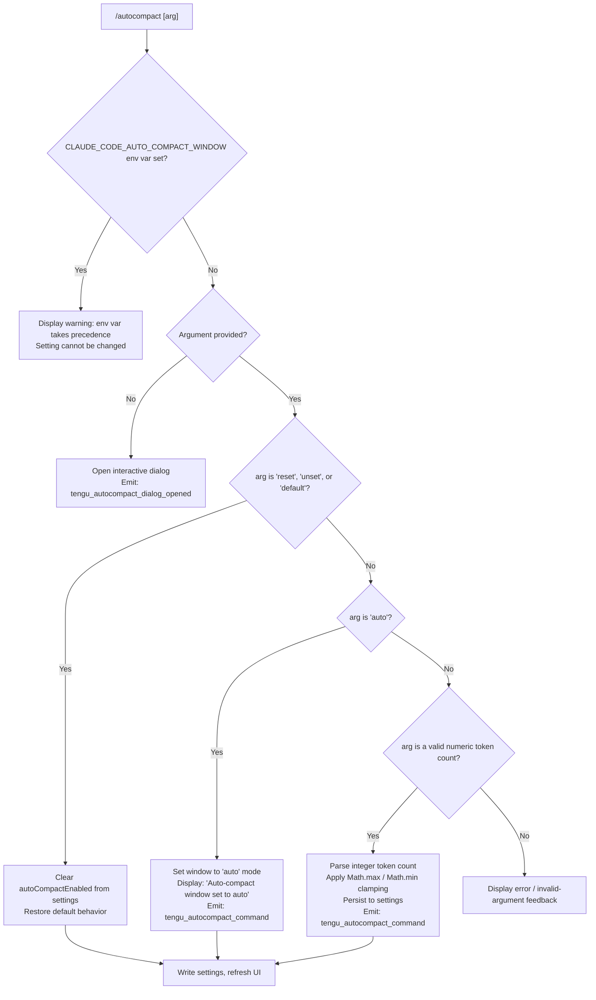

# `/autocompact`

> Analysis basis: CC v2.1.196 bundle.js (AST extraction + Claude interpretation)
> Minimum version: v2.1.196

---

## Overview

`/autocompact` controls the threshold at which Claude Code automatically summarizes (compacts) the conversation context window. It accepts either the special token `auto` to delegate threshold selection to the model default, a numeric token count, or one of several reset keywords to restore the default behavior. The setting is persisted to user or project settings and takes effect for subsequent sessions.

---

## Registration

| Field | Value |
|---|---|
| type | `local-jsx` |
| name | `autocompact` |
| description | Set how full the context gets before auto-summarizing |
| argumentHint | `[auto\|<tokens>]` |
| isHidden | `false` |
| module_id | `wUl` |
| load_inline | `true` |
| loc_byte | `11586804` |
| loc_byte_end | `11587068` |
| loc_line | `7446` |
| arbor_handler.name | `r1f` |
| arbor_handler.fqn | `claude-2.1.196::r1f` |
| arbor_handler.kind | `AsyncFunction` |
| arbor_handler.resolution_path | `module_id` |
| arbor_handler.n_hits | `1` |

Analysis basis: CC v2.1.196 bundle.js:+11586804

---

## Input Branching

The command processes at least five distinct input cases (environment variable lock, reset/unset/default keywords, `auto` keyword, a numeric token count, and an invalid value), warranting a Mermaid flowchart.



Analysis basis: CC v2.1.196 bundle.js:+11581218, +11581354, +11581383, +11581596, +11582059, +11582075

---

## Behavioral Spec

### Top-level handler (`r1f`)

```
async function autocompactCommandHandler(commandArgs, appState):
    // Render JSX dialog wrapper if no argument supplied
    if commandArgs is empty or absent:
        emit telemetry("tengu_autocompact_dialog_opened")
        open interactive compact-settings dialog via JD.jsx
        return

    // Delegate to core setting logic
    result = await applyAutoCompactSetting(commandArgs, appState)
    emit telemetry("tengu_autocompact_command", result)
    render result as JSX element via JD.jsx
```

Analysis basis: CC v2.1.196 bundle.js:+11586494, +11586527, +11586529, +11586571, +11586586

---

### Core setting logic (`jJt`)

```
async function applyAutoCompactSetting(rawArg, appState):
    // Check environment variable override
    if process.env.CLAUDE_CODE_AUTO_COMPACT_WINDOW is set:
        return errorMessage(
            "CLAUDE_CODE_AUTO_COMPACT_WINDOW is set and takes precedence. Unset it to change this setting."
        )

    trimmedArg = rawArg.trim()

    // Handle reset keywords
    if trimmedArg in {"reset", "unset", "default"}:
        clearSettingKey("autoCompactEnabled", settings)
        persistSettings()
        return successMessage(/* reset confirmation */)

    // Parse numeric-or-'auto' token via parseWindowValue()
    parsedWindow = parseWindowValue(trimmedArg)   // see sub-section below

    // Apply flag-level settings merge
    mergedSettings = applyFlagSettings(appState)

    // Persist new value
    updateSetting("autoCompactEnabled", parsedWindow, mergedSettings)
    persistSettings()
    emit telemetry("tengu_autocompact_command", {action: "set"})

    // Return human-readable confirmation
    if parsedWindow == "auto":
        return "Auto-compact window set to auto"
    else:
        return formattedTokenCount(parsedWindow)  // locale-formatted via 'en-US', 'compact'
```

Analysis basis: CC v2.1.196 bundle.js:+11581218, +11581252, +11581354, +11581383, +11581396, +11581409, +11581594, +11581690, +11581794, +11581855, +11581893, +11581914, +11582059, +11582075

---

### Window value parser (`mlo`)

```
function parseWindowValue(input):
    trimmed = input.trim()

    if trimmed == "auto":
        return "auto"

    // Check for '%' suffix → treat as fraction of context window
    if trimmed.endsWith("%"):
        fraction = parseFloat(trimmed)
        if Number.isFinite(fraction):
            tokenCount = Math.round(fraction * contextWindowSize / 100)
            // clamp: minimum 1000 tokens, maximum 100% of window
            return clamp(tokenCount, 1000, contextWindowSize)
        return null   // invalid

    // Plain integer
    parsed = parseInt(trimmed)
    if Number.isFinite(parsed) and parsed >= 1000:
        return parsed
    return null   // invalid
```

Analysis basis: CC v2.1.196 bundle.js:+11581426, +5278758, +5278817, +5278835, +5278909, +5278929, +5278955, +5279002

---

### Threshold resolution (`O9`)

```
function resolveAutoCompactThreshold(appState):
    // Priority 1: environment variable
    envValue = process.env["CLAUDE_CODE_AUTO_COMPACT_WINDOW"]
    if envValue is defined:
        parsed = parseInt(envValue)
        if not isNaN(parsed):
            source = "env"
            return {value: parsed, source}

    // Priority 2: persisted settings (via Ppp / validateThreshold)
    settingsValue = readSettingKey("autoCompactEnabled")
    if settingsValue is valid:
        source = "settings"
        threshold = validateThreshold(settingsValue)
        // clamp to [Math.max lower bound, Math.min upper bound]
        threshold = Math.max(minimumTokens, Math.min(threshold, contextWindowMax))
        return {value: threshold, source}

    // Priority 3: clientdata / experiment override
    experimentValue = readExperimentOverride("autoCompact")
    if experimentValue is defined and not "model-default":
        source = "clientdata"
        return {value: experimentValue, source}

    // Fallback: Rqr (model-default path)
    return resolveModelDefault(appState)
```

Analysis basis: CC v2.1.196 bundle.js:+5280031, +5280093, +5280097, +5280215, +5280255, +5280289, +5280359, +5280465, +5280485, +5280554, +5280579, +5280591, +5280653, +5280701

---

### Threshold validation (`_de`)

```
function validateThreshold(rawValue):
    parsed = parseInt(rawValue)
    if isNaN(parsed):
        return {status: "invalid"}
    // "capped" path: value exceeds maximum allowed
    if parsed > MODEL_CONTEXT_MAXIMUM:
        return {status: "capped", value: MODEL_CONTEXT_MAXIMUM}
    return {status: "valid", value: parsed}
```

Status strings observed: `"valid"`, `"invalid"`, `"capped"`.
Analysis basis: CC v2.1.196 bundle.js:+5277047, +5277062, +5277080, +5277122, +5277193, +5277252

---

### Model identifier list (`O_`)

The threshold resolver inspects the active model name to determine maximum context size. Known model identifiers handled in this code path (Analysis basis: CC v2.1.196 bundle.js:+2320858–2321907):

- `claude-fable-5`, `claude-mythos-5`
- `claude-opus-4-8` through `claude-opus-4-0`
- `claude-sonnet-4-6`, `claude-sonnet-4-5`, `claude-sonnet-4-0`
- `claude-haiku-4-5`
- `claude-3-7-sonnet`, `claude-3-5-sonnet`, `claude-3-5-haiku`
- `claude-3-opus`, `claude-3-sonnet`, `claude-3-haiku`
- `application-inference-profile` (cross-region profile prefix)

The lookup normalizes the model string to lowercase, checks for a `"us"` regional prefix at position `0`, and strips it before matching. Analysis basis: CC v2.1.196 bundle.js:+2320664, +2320705, +2320740, +2320746, +2320794

---

### Settings persistence path (`no` / settings layer)

```
function loadAndWriteSettings(key, value):
    // Layer order (lowest → highest priority):
    //   localSettings → projectSettings → userSettings →
    //   SDK inline settings → flagSettings → policySettings
    layers = loadAllSettingLayers()
    targetLayer = selectWritableLayer(layers)   // typically userSettings
    targetLayer[key] = value
    atomicWriteJSON(targetLayer.path, targetLayer.data)
    invalidateSettingsCache()
```

Settings file paths observed in literals:
- `~/.claude/settings.json` — user settings (Analysis basis: CC v2.1.196 bundle.js:+1329746, +1330000, +1330010)
- `<project>/.claude/settings.local.json` — project-local settings (Analysis basis: CC v2.1.196 bundle.js:+1329819, +1330072)

The write uses a temp-file + rename strategy with `fsyncSync` for crash safety. Analysis basis: CC v2.1.196 bundle.js:+1107788, +1107850, +1107997, +1108343

---

### Max token constant

Maximum context ceiling used by `Wwi` (token range validator): **1 000 000 tokens**.
Minimum granularity step used internally: **10**.
Analysis basis: CC v2.1.196 bundle.js:+3069237, +3069245, +3069370

---

## State & Side Effects

| Item | Detail |
|---|---|
| Telemetry: `tengu_autocompact_command` | Fired on every successful `set` or `auto` action (CC v2.1.196 bundle.js:+11581857) |
| Telemetry: `tengu_autocompact_dialog_opened` | Fired when no argument is supplied and the interactive dialog is opened (CC v2.1.196 bundle.js:+11586529) |
| Telemetry: `tengu_amber_redwood2` | Fired inside the `o$n` helper during threshold resolution (CC v2.1.196 bundle.js:+5276421) |
| Telemetry: `tengu_amber_redwood3` | Fired inside the `o$n` helper during threshold resolution (CC v2.1.196 bundle.js:+5276452) |
| Telemetry: `tengu_feature_ok` | Feature flag check succeeded path (CC v2.1.196 bundle.js:+1028610) |
| Telemetry: `tengu_feature_bad` | Feature flag check failed path (CC v2.1.196 bundle.js:+1028677) |
| Telemetry: `tengu_feature_sad` | Feature flag sad/error path (CC v2.1.196 bundle.js:+1028758) |
| Telemetry: `tengu_daemon_control` | Daemon lifecycle event reachable via deep call path (CC v2.1.196 bundle.js:+18033163) |
| Settings write | Persists `autoCompactEnabled` key to user settings JSON via atomic write + fsync |
| Settings cache invalidation | Clears `Hin` and `Qyr` caches (CC v2.1.196 bundle.js:+29196, +29208) via `n_` |
| Environment variable | `CLAUDE_CODE_AUTO_COMPACT_WINDOW` — if set, blocks all writes and displays a precedence warning (CC v2.1.196 bundle.js:+5280097, +11581252) |
| appState changes | `autoCompactEnabled` field updated; flag settings layer merged via `applyFlagSettings` (CC v2.1.196 bundle.js:+11581794) |
| Sound | None observed in traversal |
| Git integration | `Gvs` (gitignore checker) called during settings write to verify target path is not git-ignored (CC v2.1.196 bundle.js:+1350469) |
| Locale formatting | Token count displayed in `en-US` locale with `compact` notation (CC v2.1.196 bundle.js:+225251, +225269) |

---

## Version History

| Version | Change |
|---|---|
| v2.1.196 | Initial analysis |

---

## Common Mistakes

1. **Setting blocked by environment variable** — If `CLAUDE_CODE_AUTO_COMPACT_WINDOW` is set in the shell environment, `/autocompact` will always display a precedence warning and refuse to write to settings. Unset the variable first.
2. **Using bare `0` or values below 1000** — The parser and clamp logic reject token counts below 1 000. Supplying a sub-threshold number is treated as invalid.
3. **Forgetting `auto` vs. numeric** — `auto` delegates threshold selection to the model; a number explicitly pins the window. Passing a non-numeric, non-keyword string produces an error rather than a graceful no-op.
4. **Expecting project-local persistence** — By default the command writes to the user-level `settings.json`, not the project-local `settings.local.json`. Override behavior requires project-level targeting.
5. **Omitting the argument to inspect current value** — Calling `/autocompact` with no argument opens the interactive dialog rather than printing the current threshold. There is no dedicated "show current value" sub-command.
6. **Using `reset` to disable auto-compact entirely** — `reset`/`unset`/`default` restores the model-default threshold; it does not disable auto-compaction. Disabling requires a separate mechanism.

---

## Appendix — Identifier Mapping

> For bundle debugging only. Identifiers change across versions.

| Identifier | Role |
|---|---|
| `r1f` | Top-level async handler for `/autocompact` command (arbor_handler) |
| `jJt` | Core setting-application function; parses arg, checks env var, writes settings |
| `O9` | Threshold resolution orchestrator; checks env, settings, experiment, model-default |
| `io` | Model identifier resolver / context-window size lookup |
| `Crt` | Model entry-map builder using `Object.entries` |
| `O_` | Model name normalizer (lowercase, regional prefix strip, model-string matching) |
| `qwt` | Helper called during model resolution (unknown role at depth-2) |
| `sp` | String replacement helper inside model resolver |
| `uy` | Utility called from threshold orchestrator |
| `g0` | Lower-level utility reached from `uy` and `dr` |
| `nS` | Token-range validator orchestrator |
| `Wwi` | Integer parser + NaN check with radix 10; enforces 1 000 000 max |
| `Rqr` | Model-default threshold resolver; calls `uQe`, `Wwi`, `jwi` |
| `jwi` | Context-window writer; calls `EH`, `tV`, `TF`, `tLn`, `io`, `jo` |
| `_de` | Threshold status classifier: returns `"valid"` / `"invalid"` / `"capped"` |
| `T` | Token/text formatting utility (includes `toUpperCase`, `trim`, locale ops) |
| `Ppp` | Settings-value validator; uses `Number.isInteger`, `Array.isArray`, `Object.hasOwn` |
| `hv` | Setting key accessor; reaches `ct` (string coercer) and `pc` |
| `Eua` | Array/object shape validator used by `Ppp` and `Mpp` |
| `n` | Lowercase comparator used in identifier normalization |
| `Vwi` | Calls `P0`; likely settings-key write path |
| `qwi` | Calls `Dt`; likely settings-key delete/clear path |
| `glo` | High-level settings getter used in threshold resolution (calls `hv`, `vr`, `o$n`, `mlo`) |
| `vr` | Helper in settings get path |
| `o$n` | Emits `tengu_amber_redwood2/3`; likely experiment/feature-flag resolver |
| `mlo` | Window value parser: handles `"auto"`, `%` suffix, plain integer, clamping |
| `Mpp` | Settings structure validator |
| `no` | Settings load/write orchestrator; handles layers, gitignore check, atomic write |
| `Lg` | Settings-layer aggregator |
| `Hwe` | Individual settings-file loader |
| `I3` | Settings schema validator (calls many field validators) |
| `qt` | Path resolution utility |
| `CDr` | Settings directory resolver |
| `BLs` | Settings file reader (`IDr`, `Object.keys`, `v8`) |
| `P8` | Project settings loader (`$ss`, `CP`, `ADr`, `Fss`) |
| `$Ls` | SDK inline settings loader |
| `nw` | Config-file writer calling `Ste` |
| `Ste` | Atomic file-write core (open, readFileSync, slice, replaceAll, 4096-byte chunk) |
| `Sn` | ENOENT-handling file-system helper |
| `rn` | Low-level error-code normalizer |
| `MMr` | Timestamp recorder (`Qmn.set`, `Date.now`) |
| `VBe` | Settings-path builder |
| `$gn` | Path join/resolve/dirname helper for `.claude/` directory |
| `mkt` | Atomic JSON writer (temp file, rename, fsync, permissions) |
| `r` | fs module proxy |
| `Bd` | `realpathSync` wrapper with `Dc`, `Ap`, `jE`, `YLt` |
| `u` | Daemon control proxy (`xe`, `ke`, `$F`, `Wj`) |
| `i` | File-descriptor close/read helper |
| `rtt` | Rename-error classifier (EINVAL, ENOTSUP, EPERM, ENOSYS) |
| `tkr` | Temp-file utilities (`hTs`, `KNu`) |
| `JTs` | `Object.defineProperty` helper for file descriptor |
| `Me` | `JSON.stringify` wrapper |
| `n_` | Settings cache invalidator (clears `Hin` and `Qyr`) |
| `Gvs` | Git-ignore checker for settings path |
| `Ot` | Internal logger (`tmn`, `dr`) |
| `gMr` | Git subprocess runner (`wu`) |
| `Kmn` | `git check-ignore` runner |
| `PFu` | Path expansion/homedir resolver |
| `Fvs` | `git ls-files` runner |
| `Bvs` | Git-ignore result formatter |
| `X5` | `.claude/` path joiner |
| `dr` | Debug logger |
| `xe` | Feature-flag gate emitting `tengu_feature_ok` |
| `V` | Feature-flag value reader |
| `Oe` | Flag resolver calling `$Xe` |
| `wt` | Feature-flag gate emitting `tengu_feature_sad` |
| `ke` | Feature-flag gate emitting `tengu_feature_bad` |
| `O8` | Settings disk-load orchestrator (`m0`, `ga`, `vDr`, `I3`, `_in`) |
| `m0` | Settings load helper |
| `ga` | Memory-usage sampler (`fcs`, `STr`, `process.memoryUsage`) |
| `vDr` | Settings-load logger and cache builder |
| `_in` | Post-load settings initializer |
| `Re` | Error reporter (`er`, `ct`, `zi`, `_Nu`, `zet`, `Ete.logError`) |
| `er` | Error constructor wrapper |
| `ct` | String coercer |
| `zi` | Error-type classifier (`Fbs`) |
| `_Nu` | Error queue manager (`zfn` shift/push) |
| `kr` | Settings-loader entry point (calls `O8`) |
| `qe` | JSX element constructor (calls `$Xe`) |
| `$Xe` | Low-level JSX/React element factory |
| `yl` | Number formatter (locale `en-US`, style `compact`) |
| `ru` | Number formatting helper |
| `deu` | Locale number format helper |

---

Note: index built via Arbor fallback; some signals (telemetry, literals) may be missing — see arbor-fallback.js.