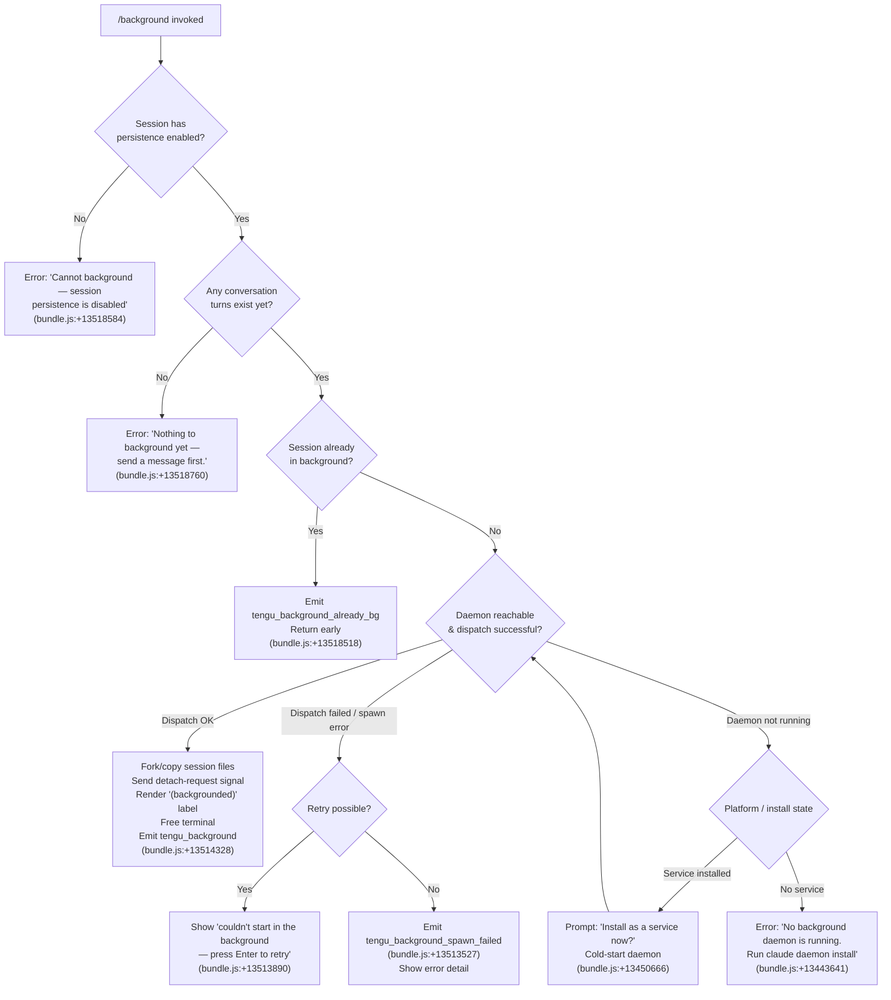

# `/background`

> Analysis basis: CC v2.1.196 bundle.js (AST extraction + Claude interpretation)
> Minimum version: v2.1.196

---

## Overview

`/background` (alias: `/bg`) detaches the current interactive REPL session from the terminal and hands it off to the Claude Code background daemon. The terminal is freed immediately while the conversation continues running as a managed background job that can be resumed later with `--resume` or `--fork-session`. The command validates several preconditions (daemon availability, session persistence, prior conversation activity) before initiating the handoff.

---

## Registration

| Field | Value |
|---|---|
| type | `local-jsx` |
| name | `background` |
| description | `Send this session to the background and free the terminal` |
| argumentHint | `[prompt]` |
| aliases | `["bg"]` |
| immediate | `null` |
| module_id | `Vlc` |
| load_inline | `true` |
| loc_byte | `13519264` |
| loc_byte_end | `13519504` |
| loc_line | `9421` |
| arbor_handler.name | `Com` |
| arbor_handler.fqn | `claude-2.1.196::Com` |
| arbor_handler.kind | `AsyncFunction` |
| arbor_handler.resolution_path | `module_id` |
| arbor_handler.n_hits | `0` |

Analysis basis: CC v2.1.196 bundle.js:+13519264

---

## Input Branching

The command exercises 5+ distinct branches depending on session state, daemon availability, and guard conditions. A Mermaid flowchart is used.



---

## Behavioral Spec

### Guard: Session Persistence Check

```
function checkSessionPersistence(session):
    if session.persistenceEnabled == false:
        throw UserError("Cannot background — session persistence is disabled, "
                        + "so the forked job would have nothing to resume.")
    # Analysis basis: CC v2.1.196 bundle.js:+13518584
```

### Guard: Conversation Existence Check

```
function checkConversationExists(session):
    if session.messageCount == 0:
        throw UserError("Nothing to background yet — send a message first.")
    # Analysis basis: CC v2.1.196 bundle.js:+13518760
```

### Guard: Already-Background Check

```
function checkNotAlreadyBackground(session):
    if session.isBackground == true:
        emitTelemetry("tengu_background_already_bg")
        return EARLY_EXIT
    # Analysis basis: CC v2.1.196 bundle.js:+13518518
```

### Guard: bypassPermissions Interlock

```
function checkBypassPermissionsGate(permissionMode):
    if permissionMode == "bypassPermissions":
        if not user.hasAcceptedBypassDisclaimer():
            throw UserError("--bg with bypassPermissions requires accepting the disclaimer first. "
                            + "Run `claude --dangerously-skip-permissions` once interactively.")
    # Analysis basis: CC v2.1.196 bundle.js:+13510988
```

### Guard: Auto-Mode Permission Gate

```
function checkAutoModeGate(permissionMode):
    if permissionMode == "auto":
        if not user.hasOptedInToAutoMode():
            throw UserError("--bg with auto mode requires opting in first. "
                            + "Run `claude --permission-mode auto` once interactively.")
    # Analysis basis: CC v2.1.196 bundle.js:+13511150
```

### Guard: Cloud Backend Conflict

```
function checkCloudConflict(args):
    if args includes "--cloud" or "--remote":
        throw UserError("--bg and --cloud are different backends. "
                        + "Use `claude --cloud '<task>'` directly to start a cloud session.")
    # Analysis basis: CC v2.1.196 bundle.js:+13453087
```

### Daemon Availability — ensureRunning

```
async function ensureDaemonRunning(platform, installState):
    emitTelemetry("tengu_bg_daemon_cold_start_ask", ...)
    # Analysis basis: CC v2.1.196 bundle.js:+13442536

    if daemonBinaryIsStale():
        emitTelemetry("tengu_bg_daemon_service_stale_exec")
        log("daemon service exec path is stale — falling back to transient spawn.")
    # Analysis basis: CC v2.1.196 bundle.js:+13442679

    outcome = await pollDaemonSocket(timeoutMs=40000)
    # Analysis basis: CC v2.1.196 bundle.js:+13442592

    if outcome == NOT_RUNNING and platform == "linux":
        if installState == "ask":
            answer = await promptUser(
                "Install as a service now? [y/N/never, or 'once' just for now] ")
            emitTelemetry("tengu_bg_daemon_cold_start_ask_answer")
            # Analysis basis: CC v2.1.196 bundle.js:+13450666

            if answer in ["y", "yes", "on"]:
                await installDaemonService()
                emitTelemetry("tengu_bg_daemon_install")
            elif answer == "once":
                await spawnTransientDaemon()
            elif answer in ["never", "no", "n"]:
                persistNeverChoice()
        else:
            throw UserError("No background daemon is running. "
                            + "Run 'claude daemon install' to set it up.")
            # Analysis basis: CC v2.1.196 bundle.js:+13443641

    if daemonSpawnFailed():
        emitTelemetry("tengu_bg_daemon_spawn_failed")
        # Analysis basis: CC v2.1.196 bundle.js:+13444126
        throw DaemonSpawnError()
```

### Dispatch — sendJobToBackground

```
async function dispatchBackgroundJob(session, optionalPrompt):
    jobId = crypto.randomUUID()
    tmpDir = createTempDirectory(prefix="tmp")
    # Analysis basis: CC v2.1.196 bundle.js:+13490982, +13490922

    # Copy session state files into a handoff bundle
    await copySessionFiles(session, tmpDir)
    # Analysis basis: CC v2.1.196 bundle.js:+13513775

    # Build CLI args for the resumed background process
    resumeArgs = ["--resume", sessionId]
    if forkSession:
        resumeArgs += ["--fork-session"]
    if replyOnResume:
        resumeArgs += ["--reply-on-resume"]
    if optionalPrompt:
        resumeArgs += [optionalPrompt]
    # pass-through flags:
    # --allowed-tools, --disallowed-tools, --model,
    # --add-dir, --effort, --permission-mode
    # Analysis basis: CC v2.1.196 bundle.js:+13512883, +13512896, +13512938,
    #                 +13513025, +13513066, +13513097, +13513126, +13513143

    result = await daemonDispatch(jobId, resumeArgs, timeoutMs=2000)
    # "flush timeout" guard: CC v2.1.196 bundle.js:+13512827, +13512832

    if result.ok:
        emitTelemetry("tengu_background")
        renderBackgroundedLabel()       # shows "(backgrounded)" CC v2.1.196 bundle.js:+13515063
        releaseTerminal()
        return SUCCESS

    if result.error in ["short_alive", "stale_short"]:
        throw UserError("Previous session is still shutting down — try again in a moment.")
        # Analysis basis: CC v2.1.196 bundle.js:+13495866

    emitTelemetry("tengu_background_spawn_failed")
    # Analysis basis: CC v2.1.196 bundle.js:+13513527
    showRetryPrompt("couldn't start in the background — press Enter to retry")
    # Analysis basis: CC v2.1.196 bundle.js:+13513890
```

### Daemon Dispatch Wire Protocol (dispatchJob)

```
async function daemonDispatch(jobId, args, timeoutMs):
    # Write a dispatch file to the daemon's IPC directory
    dispatchFilePath = join(daemonDir, "dispatch", jobId)
    await filesystem.mkdir(dirname(dispatchFilePath), {recursive:true})
    await filesystem.writeFile(dispatchFilePath, JSON.stringify({args}))
    # Analysis basis: CC v2.1.196 bundle.js:+13490992, +13494196

    # Connect to the daemon control socket and await acknowledgement
    socket = await connectUnixSocket(daemonSocketPath, timeoutMs=6000)
    # Analysis basis: CC v2.1.196 bundle.js:+13486212

    ackResult = await Promise.race([
        waitForAck(socket),
        timeout(timeoutMs, "no ack")
    ])
    # Analysis basis: CC v2.1.196 bundle.js:+13486039

    if ackResult.error == "EALIVE":
        return {ok: true}         # daemon confirmed live
    if ackResult.error == "ESTALE":
        return {error: "stale"}   # daemon process exists but stale
    if ackResult.error == "ESTARTING":
        return {error: "estarting", retryAfterMs: 200}
    # Analysis basis: CC v2.1.196 bundle.js:+13486314, +13486444, +13486963

    emitTelemetry("tengu_bg_dispatch")
    # Analysis basis: CC v2.1.196 bundle.js:+13487825
```

### REPL-side Background Fork (repl_background_fork path)

```
async function replBackgroundFork(session, uiState):
    emitTelemetry("tengu_background", {outcome: "repl_background_fork"})
    # Analysis basis: CC v2.1.196 bundle.js:+13514180

    # Render left-arrow indicator in the UI before detaching
    uiState.set("left_arrow", true)
    # Analysis basis: CC v2.1.196 bundle.js:+13513579

    # Wait up to 120 s for any in-flight agent activity to settle
    await waitForAgentQuiescence(timeoutSec=120)
    # Analysis basis: CC v2.1.196 bundle.js:+13514833

    # Signal the running agent to switch to background mode
    session.sendDetachRequest()      # "detach-request" Analysis basis: CC v2.1.196 bundle.js:+11565115

    # The terminal is freed; process continues as daemon-worker
    # Analysis basis: CC v2.1.196 bundle.js:+2343144
```

### Spare-Daemon Handoff (background session claim path)

```
async function sendClaim(daemonSocket):
    # Build a binary claim frame and send it over the Unix socket
    claimFrame = buildClaimFrame(sessionToken)
    # Analysis basis: CC v2.1.196 bundle.js:+17986936

    socket.write(claimFrame)
    result = await Promise.race([
        awaitSocketResponse(socket),
        timeout(5000, "send-claim timeout")
    ])
    # Analysis basis: CC v2.1.196 bundle.js:+17987065, +17987121

    if result.error == "ECONNREFUSED":
        emitTelemetry("tengu_bg_sendclaim_failed")
        # Analysis basis: CC v2.1.196 bundle.js:+17986631
        throw ConnectionError("ECONNREFUSED")

    return result

async function handoffSettle(spareProcess):
    # Wait for the spare daemon to acknowledge the handoff
    emitTelemetry("tengu_bg_handoff_settle")
    # Analysis basis: CC v2.1.196 bundle.js:+18000778
    await spareProcess.finallyCleanup()
```

### Shutdown / Forced-Exit Path (daemon stop)

```
async function daemonStop(reason):
    emitTelemetry("tengu_daemon_control", {action: "daemon_stop"})
    # Analysis basis: CC v2.1.196 bundle.js:+18033163, +18033088

    try:
        await gracefulShutdown(timeoutMs=500)
        # Analysis basis: CC v2.1.196 bundle.js:+18028222
    catch:
        emitTelemetry("tengu_daemon_control", {action: "daemon_stop_failed"})
        # Analysis basis: CC v2.1.196 bundle.js:+18033125
        abortAll()
        process.exit(1)
        # Analysis basis: CC v2.1.196 bundle.js:+18028261

    process.exit(0)
    # Analysis basis: CC v2.1.196 bundle.js:+13489063
```

### Low-Memory Guard (dispatch side)

```
function checkLowMemory():
    freeMb = os.freemem() / 1048576
    # Analysis basis: CC v2.1.196 bundle.js:+13338279

    if freeMb < threshold:
        emitTelemetry("tengu_bg_low_mem_mb", {mb: freeMb})
        # Analysis basis: CC v2.1.196 bundle.js:+13419339
        emitTelemetry("tengu_bg_dispatch_low_mem")
        # Analysis basis: CC v2.1.196 bundle.js:+17994102
        warn("Low memory — background dispatch may fail")
```

---

## State & Side Effects

| Item | Detail |
|---|---|
| Telemetry — primary background events | `tengu_background` (success, bundle.js:+13514328), `tengu_background_already_bg` (no-op, +13518518), `tengu_background_spawn_failed` (+13513527) |
| Telemetry — daemon lifecycle | `tengu_bg_daemon_cold_start_ask` (+13443576), `tengu_bg_daemon_cold_start_ask_answer` (+13450741), `tengu_bg_daemon_install` (+13442998), `tengu_bg_daemon_spawn_failed` (+13444126), `tengu_bg_daemon_service_stale_exec` (+13442636), `tengu_bg_daemon_service_poll_fallthrough` (+13443252) |
| Telemetry — dispatch | `tengu_bg_dispatch` (+13487825), `tengu_bg_dispatch_fallback` (+13488355), `tengu_bg_dispatch_rescued` (+13494926), `tengu_bg_dispatch_sigkill_escalate` (+17993512), `tengu_bg_dispatch_low_mem` (+17994102) |
| Telemetry — spare / claim | `tengu_bg_spare_enable` (+17994792), `tengu_bg_spare_claim` (+17994920), `tengu_bg_spare_claim_fail` (+17995186), `tengu_bg_sendclaim_failed` (+17986631), `tengu_bg_handoff_settle` (+18000778) |
| Telemetry — daemon control | `tengu_daemon_control` (daemon_stop / daemon_stop_failed, +18033163), `tengu_daemon_config_reload` (+18010884), `tengu_daemon_idle_exit` (+18016355) |
| Telemetry — misc | `tengu_bg_low_mem_mb` (+13419339), `tengu_bg_roster_parse_failed` (+11889590), `tengu_bg_state_read_transient` (+4335632), `tengu_amber_anchor` (+3392081), `tengu_bg_bg_session_create` (+17993828) |
| Filesystem side effects | Creates a `tmp/` subdirectory under the daemon directory with a random UUID name (+13490982); copies session state files into the handoff bundle (+13513775); writes a `dispatch/<jobId>` file for IPC (+13494196); writes `state.json` (+18001089); manages `roster.json` (+11889912); may write `daemon.status.json` (+13163777) |
| Unix socket | Opens a Unix domain socket to the daemon control path; writes a length-prefixed binary frame (4-byte `UInt32BE` length header + 1-byte type tag + payload, +11559711, +11559739) |
| Process signals | Sends `SIGTERM` to the foreground process to release the terminal (+17986869); escalates to `SIGKILL` if not dead within 30 s (+17993467); calls `process.exit(1)` on forced shutdown |
| UI changes | Sets `left_arrow` indicator in REPL state (+13513579); appends `(backgrounded)` label to session header (+13515063) |
| AbortSignal | Uses `AbortSignal.timeout` for dispatch handshake (+13514501) |
| Sound | <!-- TODO: not found in depth-2 traversal; needs --depth 4 --> |
| Hook registration | Registers via `fis.register` inside `vi` (+68542) |
| appState changes | Calls `e.setAppState` / `e.getAppState` inside the main agent loop handler `DYn` (+11141038, +11139816) |

---

## Version History

| Version | Change |
|---|---|
| v2.1.196 | Initial analysis |

---

## Common Mistakes

1. **Running `/background` before sending any message** — the command aborts with "Nothing to background yet — send a message first." You must have at least one conversation turn in the current session before the command will proceed.

2. **Using `/background` when session persistence is disabled** — if Claude Code was started without a persistent session store (e.g., piped stdin or a custom non-persistent configuration), the command will immediately error. Session persistence is a prerequisite.

3. **Combining `--bg` with `--cloud` or `--remote`** — these are different execution backends. Attempting to background a cloud session yields an error. Use `claude --cloud '<task>'` directly instead of routing through `/background`.

4. **Skipping the daemon install step** — on Linux without a service-managed daemon, `/background` will prompt you to install the daemon. If you choose "never," the background command will be permanently declined until you run `claude daemon install`.

5. **Using bypassPermissions mode without the prior interactive disclaimer** — issuing `/background` in a `--dangerously-skip-permissions` session where the user has not yet accepted the disclaimer once interactively will fail with an explicit gate error.

6. **Retrying too quickly after a previous background session exits** — if the prior backgrounded session is still in its shutdown sequence, dispatch will return a `short_alive`/`stale_short` error and you must wait a moment before retrying.

---

## Appendix — Identifier Mapping

> For bundle debugging only. Identifiers change across versions.

| Identifier | Role |
|---|---|
| `Com` | Main handler (AsyncFunction) for `/background` — Arbor-resolved entry point |
| `Bcr` | Background command orchestrator — builds argument arrays, calls dispatch, manages retry loop |
| `Gcr` | JSX renderer for the `/background` command result UI |
| `hom` | Core background session dispatch worker — orchestrates file copy, daemon handshake, and spawn |
| `ZZ` | Background job creation wrapper — generates UUID, creates tmp dir, calls dispatch helpers |
| `GWo` | Daemon dispatch coordinator — manages socket connection, ack loop, retries |
| `Ij` | Daemon-ensure-running helper — polls daemon socket, handles cold start, emits lifecycle telemetry |
| `ZZt` | Daemon service install / cold-start flow |
| `Tom` | Argument parser / flag validation for background CLI args |
| `BTt` | bypassPermissions gate checker |
| `Ucr` | `--resume` / `--continue` / `--session-id` flag resolver |
| `Ulc` | `--resume=<id>` inline-value parser |
| `Iom` | `--session-id` inline-value parser |
| `$cr` | `--continue` / `-c` flag expander |
| `Flc` | `--cloud` / `--remote` conflict detector |
| `uz` | Core flag-set membership tester (checks known CLI flags) |
| `NUe` | Flag value extractor (slices value from `--flag=value` syntax) |
| `Iie` | Flag prefix matcher |
| `CWo` | Cloud/remote flag group detector |
| `IWo` | Inert / unrecognised flag pass-through |
| `_ns` | Spare-daemon socket claim sender — builds claim frame and manages socket lifecycle |
| `f9m` | Send-claim timeout wrapper (5000 ms guard) |
| `m9m` | Low-level socket connect + once/end helpers for claim protocol |
| `p9m` | Claim-frame builder (delegates to `hz.buildClaimFrame`) |
| `tM` | Binary frame serialiser — writes `UInt32BE` length + `UInt8` type + payload |
| `bns` | Background session state machine — manages lifecycle states (`idle`, `working`, `bg`, `crashed`, etc.) |
| `vs` | Daemon forced-exit helper — emits `cli_error` telemetry then calls `process.exit(1)` |
| `wc` | Flush-timeout wrapper — races a 2000 ms timeout against pending writes |
| `bv` | Secondary socket-connection helper used during daemon re-check |
| `QWo` | Pre-dispatch gate (checks `gate_blocked` condition) |
| `wFe` | Argument pass-through filter |
| `h` | Background session spawn / claim / handoff handler (major sub-function) |
| `d` | Daemon worker session runner — starts/stops sub-agents, manages config reload |
| `j` | Per-session kill handler — SIGKILL escalation with 1000 ms delay |
| `_hr` | MCP connection result applier — handles mid-flight slot changes |
| `z` | Agent retire-if-settled checker |
| `Hbt` | REPL background fork coordinator — calls `aWf`, `oir`, `r1`, `Sc` |
| `aWf` | Agent conversation driver for background fork |
| `Ix` | Main agent query loop |
| `DYn` | Agent app-state manager (getAppState / setAppState) |
| `r1` | Result renderer / conversation serialiser post-fork |
| `wtr` | Conversation transcript writer — hashes, writes files, manages directories |
| `Ax` | Full agent execution engine (the large query processor) |
| `Apc` | API call pipeline — streaming, retries, fallbacks, telemetry |
| `fYe` | Fork agent result assembler |
| `cNo` | Conversation normalisation helper |
| `eoc` | Session status file writer (`daemon.status.json`) |
| `N6e` | Roster file reader / writer |
| `kAt` | Roster persistence helper — reads/writes `roster.json` |
| `D4` | Roster entry validator and file-format enforcer |
| `Yi` | Config file watcher and pin manager |
| `zd` | Config file atomic writer |
| `dE` | Config cache invalidator |
| `mc` | Config path resolver (`jobs/<id>`) |
| `Re` | Structured error logger |
| `rg` | Atomic file writer with random-bytes temp name |
| `Ik` | Path builder — joins config root with `jobs` subdirectory |
| `Sn` | Safe JSON serialiser |
| `Gt` | Safe JSON parser |
| `rn` | No-op / identity helper |
| `ad` | Error boundary helper |
| `he` | String coercion helper |
| `me` | JSON stringify wrapper |
| `it` | Tool-use context builder |
| `Dt` | Config synchronous reader with backup logic |
| `lIt` | Config file reader with directory-scanning fallback |
| `Ldm` | Config watcher using `watchFile` |
| `gN` | Settings resolver (userSettings / localSettings / flagSettings / policySettings) |
| `fn` | Settings merge helper |
| `lqe` | Teammate-mailbox message reader |
| `yor` | Daemon socket lease manager |
| `AS` | Daemon control-socket client (connect, write, parse response) |
| `gme` | Dispatch file reader |
| `xlc` | Dispatch outcome logger |
| `Tom` | CLI argument tokeniser and flag-set builder |
| `hom` | Per-job background session launcher |
| `GWo` | Dispatch retry loop with exponential backoff |
| `FWo` | Dispatch argument path-bearing formatter |
| `Ij` | Daemon lifecycle manager (ensure-running) |
| `ZZt` | Daemon service install wizard |
| `wlc` | Command argument mapper |
| `gom` | Job-completion notifier |
| `lmn` | Git-Bash availability checker (Windows) |
| `yy` | Amber-anchor service state recorder |
| `o0e` | Amber-anchor event emitter |
| `jce` | Amber-anchor cleanup helper |
| `iye` | Background-service state serialiser |
| `b5` | Session metadata enricher |
| `CYe` | Memory-pressure reporter |
| `Lrm` | macOS `libSystem` FFI loader for memory stats |
| `T` | Log-level router (debug / warn / info) |
| `Ts` | Model alias resolver |
| `jo` | Model-name normaliser |
| `SH` | Model-name alias expander |
| `mwt` | Model metadata fetcher |
| `Hi` | Daemon-worker label helper |
| `BLe` | `daemon-worker` string constant provider |
| `dTe` | Detach-request signal emitter |
| `oBa` | Task-type label writer (`task` / `_5n`) |
| `YW` | TTY output writer |
| `C4` | Environment / mode detector (`production` / `test`) |
| `z3e` | TTY session spawner |
| `vHd` | tmux environment probe |
| `wHd` | tmux `show-environment` executor |
| `Gcr` | `/background` JSX command renderer |
| `bq` | Array-type guard |
| `qfe` | Some-predicate helper |
| `i1` | Filtered render helper |
| `GQ` | Compound render helper |
| `Vfe` | `startsWith` predicate helper |
| `jg` | Render-and-register helper (Kc path) |
| `jK` | Secondary render-and-register helper |
| `PH` | Compact-boundary slicer |
| `Unr` | Compact-boundary flag reader |
| `Mue` | Config-change watcher for background sessions |
| `HR` | PTY-pid path builder |
| `RAt` | PTY-pid filename helper |
| `h2o` | PTY-pid directory reader |
| `oM` | PTY-pid `err`/`late` path helper |
| `n3l` | PTY-pid path concatenator |
| `tP` | PTY-pid `late` variant |
| `xZ` | PTY-pid `err` variant |
| `AXt` | Auth-file path builder |
| `_Te` | PTY-pids directory builder |
| `BNe` | PTY-pids base-path helper |
| `SXt` | Auth-token path builder |
| `EXt` | Auth-token base-path helper |
| `A7e` | Dispatch-file path builder |
| `Kh` | Session active-state checker |
| `V0` | Active-state predicate |
| `HR` | PTY-pid roster path helper |

---

Note: index built via Arbor fallback; some signals (telemetry, literals) may be missing — see arbor-fallback.js.