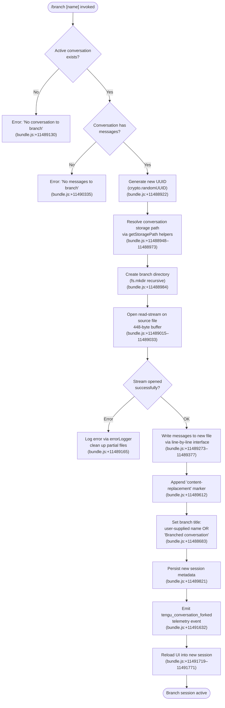

# `/branch`

> Analysis basis: CC v2.1.196 bundle.js (AST extraction + Claude interpretation)
> Minimum version: v2.1.196

---

## Overview

The `/branch` command creates a diverging copy of the current conversation at the point it is invoked, preserving the message history up to that moment in a new session. Internally it performs a "fork" operation: the existing conversation transcript is written to a new session file on disk, a fresh UUID is assigned, and the UI is relaunched against the new session. An optional `[name]` argument lets the user label the branch.

---

## Registration

| Field | Value |
|---|---|
| type | `local-jsx` |
| name | `branch` |
| description | `Create a branch of the current conversation at this point` |
| argumentHint | `[name]` |
| module_id | `PUo` |
| load_inline | `true` |
| loc_byte | `12909937` |
| loc_byte_end | `12910114` |
| loc_line | `8904` |
| arbor_handler.name | `_Pf` |
| arbor_handler.fqn | `claude-2.1.196::_Pf` |
| arbor_handler.kind | `AsyncFunction` |
| arbor_handler.resolution_path | `module_id` |
| arbor_handler.n_hits | `0` |

Analysis basis: CC v2.1.196 bundle.js:+12909937

---

## Input Branching

The command presents four meaningfully distinct execution paths depending on: (a) whether a current conversation exists, (b) whether the existing conversation has any messages, (c) file-system / read-stream success or failure, and (d) whether a user-supplied branch name is present. A Mermaid flowchart is used accordingly.



---

## Behavioral Spec

### 1. Handler Entry — `branchCommandHandler` (`_Pf`)

The top-level async handler is resolved via `module_id` → `PUo` → exported function `_Pf`.

```
async function branchCommandHandler(commandArgs, appContext):
    name = commandArgs.trim()          // optional user label

    currentConversation = lookupActiveConversation(appContext)
    if not currentConversation:
        raise UserError("No conversation to branch")

    messages = filterConversationMessages(currentConversation)
    if messages.length == 0:
        raise UserError("No messages to branch")

    newSessionId  = crypto.randomUUID()
    branchTitle   = name if name else "Branched conversation"

    storagePath = resolveStoragePath(newSessionId)   // via Qh, dr, qx, Zf
    await fs.mkdir(storagePath, { recursive: true })

    await copyConversationToDisk(
        sourcePath  = currentConversation.filePath,
        destPath    = storagePath,
        messages    = messages,
        bufferSize  = 448,             // bundle.js:+11489015
        encoding    = "utf8"           // bundle.js:+11489066
    )

    await writeSessionMetadata(newSessionId, {
        title : branchTitle,
        type  : "fork",               // bundle.js:+11492153
        parentSessionId : currentConversation.id,
        createdAt : new Date().toISOString()
    })

    emitTelemetry("tengu_conversation_forked")   // bundle.js:+11491632
    reloadUIIntoSession(newSessionId)
```

Analysis basis: CC v2.1.196 bundle.js:+11492436 (`_Pf` → `U1l`)

---

### 2. Conversation Lookup — `findActiveConversation` (`O1l`)

Called from the session-copy helper to locate the current conversation record and sanitize the branch name.

```
function findActiveConversation(sessionMap, rawName):
    entry = sessionMap.find(predicate)     // bundle.js:+11488735
    sanitizedName = entry.replace(pattern) // bundle.js:+11488813
    return { entry, sanitizedName }
```

Analysis basis: CC v2.1.196 bundle.js:+11488735

---

### 3. Session Copy — `copySessionToDisk` (`N1l`)

The core file-copy routine. Opens a read-stream on the source JSONL conversation file and pipes it through a `readline.createInterface` to process messages line-by-line, writing to a new write-stream at the destination path.

```
async function copySessionToDisk(sourceFile, destDir, sessionId, options):
    // Generate UUID for new session
    newId = crypto.randomUUID()                    // bundle.js:+11488922

    // Build destination paths
    destPath = buildStoragePath(sessionId, ...)    // Qh, dr → bundle.js:+11488948

    // Create destination directory
    await fs.mkdir(destPath, { recursive: true })  // bundle.js:+11488984

    // Open source as read-stream with 448-byte buffer
    readStream = fs.createReadStream(sourceFile, {
        encoding   : "utf8",                       // bundle.js:+11489066
        highWaterMark : 448                        // bundle.js:+11489015
    })

    // Listen for 'open' event before proceeding
    await once(readStream, "open")                 // bundle.js:+11489081

    if not sourceExists:
        throw new Error("No conversation to branch") // bundle.js:+11489124–11489130

    // Create write-stream for destination (384-byte buffer)
    writeStream = fs.createWriteStream(destPath, {
        highWaterMark : 384                        // bundle.js:+11489225
    })

    // Parse line-by-line
    rl = readline.createInterface({ input: readStream })  // bundle.js:+11489273

    lineCount = 0
    for await line of rl:
        transformed = transformLine(line)          // replaces content as needed
        await writeToStream(writeStream, transformed)
        lineCount++

    if lineCount == 0:
        throw new Error("No messages to branch")  // bundle.js:+11490335

    // Append content-replacement marker
    writeStream.write("content-replacement")      // bundle.js:+11489612

    // Drain and close
    await stream.finished(writeStream)            // bundle.js:+11490813

    return { newId, destPath, lineCount }
```

Analysis basis: CC v2.1.196 bundle.js:+11488922–11490813

---

### 4. Session Metadata Write — `writeNewSessionMetadata` (`U1l`)

After the file copy succeeds, registers the new session in the session index with fork-type metadata.

```
async function writeNewSessionMetadata(newId, parentId, title, appContext):
    timestamp = new Date()
    isoString = timestamp.toISOString()        // bundle.js:+11491722
    epochMs   = timestamp.getTime()            // bundle.js:+11491771

    // Sanitize title for terminal display
    displayTitle = sanitizeTitle(title)        // yi: bundle.js:+11491719

    sessionRecord = {
        id         : newId,
        parentId   : parentId,
        title      : displayTitle,
        type       : "fork",                   // bundle.js:+11492153
        createdAt  : isoString,
        createdMs  : epochMs
    }

    // Write to session index storage
    await persistSessionRecord(sessionRecord)  // lS, Mue chain

    // Emit telemetry
    emitTelemetry("tengu_conversation_forked") // bundle.js:+11491632

    // Rebuild auto title if no user name given
    if not userSuppliedName:
        autoTitle = buildAutoTitle(messages, limit=10)  // bundle.js:+11491220

    // Signal UI reload
    reloadSession(newId, appContext)
```

Analysis basis: CC v2.1.196 bundle.js:+11491328–11492180

---

### 5. Branch Title Resolution

The command resolves the branch title in order of priority:

1. **User-supplied name** — the trimmed argument passed after `/branch`.
2. **Default fallback** — the literal string `"Branched conversation"` (bundle.js:+11488683).

The title is stored as a `"text"` type field (literal `"text"`, bundle.js:+11488756) in the session metadata.

---

### 6. Error Handling

| Condition | Error Message | Loc |
|---|---|---|
| No active conversation | `"No conversation to branch"` | bundle.js:+11489130 |
| Active conversation has zero messages | `"No messages to branch"` | bundle.js:+11490335 |
| Source file not found (ENOENT) | Logged via errorLogger; partial files cleaned up | bundle.js:+11489165 |
| Generic unknown error | `"Unknown error occurred"` | bundle.js:+11492320 |

The error logger path goes through `Re` → `er` → `Ete.logError` (bundle.js:+11489165, +1059478).

---

### 7. Completion Path — model-refusal fallback marker

When the copy loop ends, a `"model_refusal_fallback"` marker string (bundle.js:+11490010) may be emitted as a progress indicator, and a `"progress"` event (bundle.js:+11490253) is dispatched to notify the UI that the branch operation finished.

---

## State & Side Effects

| Item | Detail |
|---|---|
| Telemetry | `tengu_conversation_forked` (bundle.js:+11491632) |
| New file created | New JSONL session file written under resolved storage path (bundle.js:+11488984) |
| Session index updated | New fork record inserted into session metadata store (bundle.js:+11491719) |
| UI navigation | UI relaunched / reloaded into the newly created branch session |
| Parent session unchanged | Source conversation file is read-only during the operation; no mutation |
| Telemetry (indirect, via daemon helpers) | `tengu_bg_dispatch_sigkill_escalate`, `tengu_daemon_config_reload`, `tengu_bg_spare_claim`, `tengu_bg_sendclaim_failed`, and others reachable via background-session daemon helpers in the call graph — these are infrastructure events, not branch-specific |

---

## Version History

| Version | Change |
|---|---|
| v2.1.196 | Initial analysis |

---

## Common Mistakes

1. **Invoking `/branch` before any messages exist** — the command will emit `"No messages to branch"` and abort. At least one user or assistant message must exist in the conversation before branching.
2. **Expecting the original session to change** — `/branch` is a non-destructive read of the source file. The parent conversation continues unchanged; you are navigated into the new branch session automatically.
3. **Treating the optional name as mandatory** — the `[name]` argument is fully optional. When omitted, the branch receives the automatic title `"Branched conversation"`.
4. **Branching from a non-interactive or piped session** — if no active conversation is tracked in app state, the command raises `"No conversation to branch"` immediately.
5. **Assuming the branch is a git branch** — `/branch` operates on Claude Code's own session/conversation storage, not on the git repository in the working directory.

---

## Appendix — Identifier Mapping

> For bundle debugging only. Identifiers change across versions.

| Identifier | Role |
|---|---|
| `_Pf` | Top-level async branch command handler (main entry point, `branchCommandHandler`) |
| `U1l` | Session-copy orchestrator; coordinates UUID generation, path resolution, file copy, and metadata write |
| `N1l` | Core file-copy routine; readline/stream pipeline from source to destination JSONL |
| `O1l` | Active-conversation lookup and branch-name sanitization helper |
| `HPf` | Conversation message filter / deduplication before copy (parses seen-set via `parseInt`) |
| `_Z` | Storage path builder; worktree-aware path resolution with git-worktree detection |
| `GAe` | Git worktree list parser (`git worktree list --porcelain`) |
| `auc` | File completion-list / directory walk helper used during path resolution |
| `$Ye` | Binary buffer helper used in path encoding |
| `zW` | Session rename writer; sets `"custom-title"` metadata and emits `tengu_session_renamed` |
| `Cze` | Agent-name writer; sets `"agent-name"` metadata and emits `tengu_agent_name_set` |
| `lIe` | Log-file append helper; creates log directory and appends formatted entries |
| `C4` | Log-entry formatter |
| `qg` | Path-dedup / cache key helper for storage path resolution |
| `Mue` | Session-record persistence coordinator (calls `mc`, `Yi`, `dE`, `zd`, `Sn`, `Jf`) |
| `lS` | Session-list entry builder (basename + storage-root lookup) |
| `ZHe` | Storage-root resolver helper |
| `yi` | Title sanitizer (strips index prefix from display title) |
| `FL` | Regex-escape helper for display strings |
| `qx` | Conversation file path builder (joins base dir, session id, file segments) |
| `Zf` | JSONL path helper; joins storage root with session segments |
| `t3` | Base storage root getter |
| `Rt` | Config/settings reader |
| `dr` | Session directory name builder |
| `Qh` | Storage base-dir resolver |
| `Jk` | Session-file name constant provider |
| `Re` | Error recording / telemetry error logger |
| `er` | Error normalizer (wraps raw values in `Error`) |
| `ct` | String coercion utility |
| `zi` | Telemetry consent checker |
| `Fbs` | Consent-level formatter |
| `_Nu` | Telemetry queue manager (shift/push ring buffer) |
| `Sn` | Async sleep / delay helper |
| `rn` | Promise-based utility (resolve/reject wrapper) |
| `Gt` | JSON-parse wrapper |
| `Me` | JSON-stringify wrapper |
| `he` | String coercion helper |
| `ad` | Async no-op / resolved promise helper |
| `tM` | Binary framing helper (Buffer pack for IPC messages) |
| `bns` | Background-session lifecycle manager (handoff, retire, file cleanup) |
| `kAt` | Background-session roster reader and writer |
| `D4` | Session roster file parser and validator |
| `P2f` | Roster-entry writer with atomic copy |
| `Yi` | Session-state file reader/writer with cache |
| `mc` | Storage-path join helper |
| `Ik` | Session directory path builder |
| `dE` | Session cache-entry deleter |
| `zd` | Session-file safe-write coordinator |
| `rg` | Atomic file writer (random-bytes temp file + copy + chmod) |
| `wRe` | Session-list parser / ignore-rule applier |
| `IQd` | Inner ignore-rule matcher |
| `Ar` | Session-type classifier (`nonconforming` vs standard) |
| `Ig` | Nonconforming-session predicate |
| `qe` | Standard-session predicate |
| `Kh` | Session status resolver (`active` / `idle` etc.) |
| `V0` | Status enum resolver |
| `Jf` | Session-file writer with ignore-list check |
| `wQd` | Recursive directory walker for session discovery |
| `CJi` | Directory-create-and-link helper |
| `N6e` | Session-pins file reader/deleter |
| `pBt` | Pins-file path builder |
| `eoc` | Daemon status-file writer |
| `HZt` | Daemon status file path builder |
| `Zte` | Cross-platform home-dir resolver |
| `Ks` | AsyncLocalStorage store reader |
| `h` | Background-session dispatch loop (main bg worker controller) |
| `bW` | Sentinel / flag used in session-copy loop |
| `H` | Worker-pool teardown helper |
| `vs` | CLI error exit helper (emits `"cli_error"`, calls `process.exit(1)`) |
| `O` | Background-worker watch loop (file-watcher + memory manager) |
| `X` | Voice-recording session manager |
| `U` | Rate-limit event enqueuer |
| `B` | Worker-map value iterator |
| `k` | Scheduled-task runner (setInterval + file-watcher) |
| `hXo` | Scheduled-task executor (lock-file based) |
| `ZNc` | Task lock-file reader/appender |
| `tUc` | Task output file writer |
| `gXo` | Task result dispatcher |
| `nUc` | Task output file reader |
| `prn` | Task file path builder |
| `bl` | Config directory path helper |
| `sk` | Process-signal sender helper |
| `TI` | IPC-channel initializer |
| `mrn` | Scheduler lock-release helper |
| `D` | Daemon-yield IPC message writer |
| `FEe` | MUN-join path helper |
| `_ns` | Background-session socket-claim sender |
| `Cqo` | Socket auth-file writer |
| `SXt` | Auth-file path builder |
| `EXt` | Auth directory path builder |
| `f9m` | Socket connection retry loop |
| `m9m` | Single TCP connection attempt |
| `p9m` | Claim-frame builder |
| `On` | Timeout-guarded async operation helper |
| `ke` | Feature-flag OK reporter (`tengu_feature_ok`) |
| `xe` | Feature-flag bad reporter (`tengu_feature_bad`) |
| `Oe` | Feature-flag event emitter base |
| `CYe` | Memory-pressure checker (calls `os.freemem`) |
| `Crm` | React component context reader for memory info |
| `it` | React render / hook executor |
| `Lrm` | macOS memory pressure reader via `bun:ffi` / libSystem |
| `T` | Log-level formatter |
| `_hr` | MCP connection result applier |
| `Sje` | MCP server metadata updater |
| `ln` | MCP debug logger |
| `LT` | MCP server cleanup coordinator |
| `z` | MCP connection retire-if-settled checker |
| `q` | MCP allow-list permission handler |
| `f` | MCP permission event emitter |
| `Y` | MCP permission response handler |
| `W` | UI key-press handler (push to input queue) |
| `K` | Backspace key handler |
| `g` | Background-session main loop tick |
| `m` | Message-array normalizer / filter |
| `XHr` | Message role normalizer (strips prefixes) |
| `p` | Forced-shutdown handler (`process.exit` on timeout) |
| `nI` | Exit signal name formatter |
| `l` | Daemon-status writer loop |
| `E` | Agent stop coordinator (SDK agent shutdown) |
| `A` | OAuth / user-info session manager |
| `Wqc` | Heartbeat sender |
| `I` | Scroll / viewport position tracker |
| `j` | Worker kill-with-timeout helper |
| `d` | Worker process write/dispatch handler |
| `TYe` | File-read with MIME-type detection |
| `gic` | Column-width calculator |
| `_Te` | PTY-pids file path builder |
| `BNe` | PTY-pids directory path builder |
| `oM` | PTY error-file path builder |
| `n3l` | PTY late-output file path builder |
| `HR` | PTY output file path builder |
| `h2o` | PTY output directory builder |
| `RAt` | PTY output file name builder |
| `tP` | PTY late-output path builder (alias) |
| `xZ` | PTY split-output path builder |
| `AXt` | Auth-cleanup file path builder |
| `se` | Worker-pool multi-member retire helper |
| `ee` | Worker retire-if-settled single helper |
| `ycr` | React component for background-attach upgrade |
| `Bac` | React component for memory-pressure display |
| `$n` | Generic React tree node |

Note: index built via Arbor fallback; some signals (telemetry, literals) may be missing — see arbor-fallback.js.