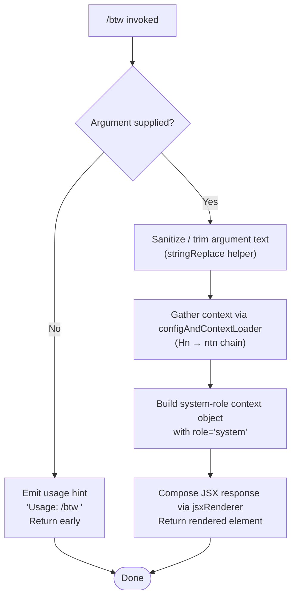

# `/btw`

> Analysis basis: CC v2.1.196 bundle.js (AST extraction + Claude interpretation)
> Minimum version: v2.1.196

---

## Overview

`/btw` ("by the way") is a lightweight side-channel command that lets the user pose a quick, off-topic question to the agent without disrupting the main conversation thread. It is marked `immediate: true`, meaning it is dispatched to the thin client via a `control-request` rather than queued as a normal turn. The handler (`CPf`) validates that an argument was supplied, composes a system-context message, renders a JSX response inline, and delegates context-gathering to the shared config/filesystem subsystem (`Hn`/`ntn`).

---

## Registration

| Field | Value |
|---|---|
| type | `local-jsx` |
| name | `btw` |
| description | Ask a quick side question without interrupting the main conversation |
| argumentHint | `<question>` |
| immediate | `true` |
| thinClientDispatch | `control-request` |
| module_id | `G1l` |
| load_inline | `true` |
| loc_byte | `11499366` |
| loc_byte_end | `11499605` |
| loc_line | `7334` |
| arbor_handler.name | `CPf` |
| arbor_handler.fqn | `claude-2.1.196::CPf` |
| arbor_handler.kind | `AsyncFunction` |
| arbor_handler.resolution_path | `module_id` |
| arbor_handler.n_hits | `0` |

Analysis basis: CC v2.1.196 bundle.js:+11499366

---

## Input Branching

The command has three distinct paths depending on whether an argument is present and valid, making a Mermaid flowchart the appropriate representation.



Analysis basis: CC v2.1.196 bundle.js:+11498967, +11499008, +11499031, +11499077

---

## Behavioral Spec

### 1. Argument Validation and Usage Guard

When the user invokes `/btw` without providing any text after the command name, the handler emits a usage hint and returns without further processing.

```
async function btwCommandHandler(input, appContext):
    if input.argument is absent or empty:
        display("Usage: /btw <your question>")
        return
    sanitizedQuestion = sanitizeInput(input.argument)
    proceed to context loading
```

Usage hint literal: `"Usage: /btw <your question>"` (bundle.js:+11498969)

### 2. Input Sanitization

The raw argument string is passed through a `stringReplace` helper (identifier `e`, callee `t.replace`) that normalises whitespace and escapes any characters that would interfere with the system message format.

```
function sanitizeInput(rawText):
    return rawText.replace(pattern, replacement)
```

Analysis basis: CC v2.1.196 bundle.js:+11498967 (call to `e`), +17616328 (`t.replace`)

### 3. Context and Configuration Loading

After sanitisation, the handler calls `configAndContextLoader` (`Hn`), which in turn delegates to `saveConfigWithLockCore` (`ntn`) — the shared configuration-with-filesystem-lock subsystem. This subsystem:

1. Acquires an exclusive filesystem lock on the Claude configuration directory.
2. Reads the current config file (`r.readFileSync`, UTF-8).
3. Validates that the re-read config retains authentication fields (safeguard against auth loss — see GH #3117 references in literals).
4. Optionally repairs the config if a parse error is detected (auto-repair path, telemetry `tengu_config_auto_repaired`).
5. Returns a merged context object used downstream.

```
async function configAndContextLoader(appContext):
    lock = acquireFilesystemLock(configPath)
    if lock.contentionDetected:
        emit telemetry("tengu_config_lock_contention")
    rawConfig = fs.readFileSync(configPath, "utf-8")
    parsed = JSON.parse(rawConfig)
    if parsed has parse error:
        emit telemetry("tengu_config_parse_error")
        repairFromCache(parsed)
        emit telemetry("tengu_config_auto_repaired")
    if parsed is missing auth that cache holds:
        emit telemetry("tengu_config_auth_loss_prevented")
        abort write
    return mergedContext
```

Analysis basis: CC v2.1.196 bundle.js:+11499031 (`Hn`), +14153628 (`ntn`), +14159438 (`r.readFileSync`), +14157063 (`tengu_config_lock_contention`)

Lock contention warning message: `"Lock acquisition took longer than expected - another Claude instance may be running"` (bundle.js:+14156974)

Auth-loss guard message fragment: `"...refusing to write to avoid wiping ~/.claude.json..."` (bundle.js:+14157754)

### 4. System Message Construction

With the context in hand, the handler builds a message object carrying `role: "system"` and the sanitised question. This positions the side question as out-of-band system context rather than a user turn, preventing it from being treated as a new human message in the conversation history.

```
function buildSystemMessage(sanitizedQuestion, context):
    return {
        role: "system",          // literal at bundle.js:+11499008
        content: sanitizedQuestion,
        context: context
    }
```

Analysis basis: CC v2.1.196 bundle.js:+11499008

### 5. JSX Response Rendering

The final step calls `jsxRenderer` (`A_.jsx`) to produce the inline JSX element that the `local-jsx` runtime will mount in the CLI UI. Because the command type is `local-jsx`, the return value is a React element, not a plain string.

```
function renderBtwResponse(systemMessage):
    return jsx(BtwResponseComponent, { message: systemMessage })
```

Analysis basis: CC v2.1.196 bundle.js:+11499077 (`A_.jsx`)

### 6. Thin-Client Dispatch (`control-request`)

Because `thinClientDispatch` is set to `"control-request"` and `immediate` is `true`, the rendered payload bypasses the normal message queue and is forwarded directly to the thin-client control channel. This ensures the side question does not interrupt in-progress tool calls or streaming responses.

Analysis basis: CC v2.1.196 bundle.js:+11499366 (registration block)

---

## State & Side Effects

| Item | Detail |
|---|---|
| Telemetry — `tengu_config_lock_contention` | Fired when the config-file lock takes longer than expected (bundle.js:+14157063) |
| Telemetry — `tengu_config_stale_write` | Fired when a stale write is detected during config save (bundle.js:+14157199) |
| Telemetry — `tengu_config_parse_error` | Fired when the re-read config cannot be parsed (bundle.js:+14160796) |
| Telemetry — `tengu_config_auto_repaired` | Fired after automatic repair from cached config (bundle.js:+14157576) |
| Telemetry — `tengu_config_auth_loss_prevented` | Fired when a write is refused to prevent auth credential loss (bundle.js:+14157906) |
| Telemetry — `tengu_config_fallback_write` | Fired when the global config falls back to an alternative write path (bundle.js:+14156679) |
| Telemetry — `tengu_daemon_control` | Fired by daemon-control utilities reached through the call graph (bundle.js:+18033163) |
| Hook registration | None observed at depth ≤ 2 |
| appState changes | None directly; config subsystem may update persisted config on disk |
| Filesystem side effect | Config lock file created/destroyed; optional backup copy written under `backups/` subdirectory (literal `"backups"` at bundle.js:+14158950) |
| Sound | None observed |

---

## Version History

| Version | Change |
|---|---|
| v2.1.196 | Initial analysis |

---

## Common Mistakes

1. **Forgetting the argument**: Invoking `/btw` with no text produces only the usage hint (`Usage: /btw <your question>`) and does nothing else. Always provide a question.
2. **Expecting a new conversation turn**: `/btw` is dispatched as a `control-request` with `immediate: true`, so it does not create a new human turn in the conversation history. If you need the response to be part of the permanent transcript, use a regular message instead.
3. **Concurrent Claude instances**: Because the command touches the config lock subsystem, running two Claude Code instances simultaneously may trigger a `tengu_config_lock_contention` event and a console warning about another instance running. This is a side effect of the shared config infrastructure, not a bug in `/btw` itself.
4. **Assuming synchronous execution**: The handler (`CPf`) is an `AsyncFunction`. Its JSX result is only available after the config-loading promise chain resolves; callers must await it.

---

## Appendix — Identifier Mapping

> For bundle debugging only. Identifiers change across versions.

| Identifier | Role |
|---|---|
| `CPf` | Main async handler for the `/btw` command (arbor_handler) |
| `e` | Input sanitisation helper (wraps `t.replace`) |
| `Hn` | Config-and-context loader; entry point into filesystem/config subsystem |
| `ntn` | Core "save config with lock" function; manages filesystem lock and config read/write |
| `qt` | Path resolution / config directory utility |
| `s` | Filesystem lock set manager (add/delete/statSync operations) |
| `r` | Filesystem module reference (readFileSync, mkdirSync, copyFileSync, etc.) |
| `i` | Lock cleanup finaliser (closes file handles via `.finally`) |
| `Yli` | Config object initialiser (calls `E4r`, then `Object.assign`) |
| `E4r` | Config defaults factory (calls `zli`) |
| `T` | System-message / API-payload builder |
| `eeu` | Message content assembler (calls `q1`, `tTr`, `gis`) |
| `Me` | JSON serialisation helper (wraps `JSON.stringify`) |
| `Pc` | Text redaction / truncation utility |
| `KQe` | Context key normaliser (calls `Gls`) |
| `oeu` | File-content context builder (reads files, measures byte length) |
| `V` | Config value accessor |
| `rn` | Error / warning logger |
| `lIt` | Config file reader and backup manager |
| `Gt` | JSON parse wrapper (wraps `JSON.parse`) |
| `V5` | String prefix stripper (startsWith / slice) |
| `lqo` | Directory backup enumerator |
| `uqo` | Backup path joiner (calls `ey.join`, `Zn`) |
| `m` | Array/filter utility for file lists |
| `cIt` | Config cache accessor |
| `n` | String lowercase normaliser |
| `v` | Filename prefix checker |
| `y` | Conversation/message splitter |
| `lqe` | Teammate-mailbox message reader (`markMessagesAsRead`) |
| `I` | Scroll / pagination helper (Math.max, Math.floor) |
| `M` | HTTP server / OAuth route handler |
| `A` | OAuth userinfo verifier |
| `mkt` | Atomic file write helper (symlink-safe, uses temp file + rename) |
| `Bd` | Real-path resolver (wraps `e.realpathSync`) |
| `u` | Daemon stop controller |
| `Sn` | Error wrapper / normaliser |
| `rtt` | fsync error classifier (EINVAL / ENOTSUP / EPERM / ENOSYS) |
| `tkr` | Temporary directory locator |
| `JTs` | `Object.defineProperty` helper for module exports |
| `zUe` | Config merge / diff utility |
| `iqo` | Config entries iterator (wraps `Object.entries`) |
| `etn` | Timestamp recorder (wraps `Date.now`) |
| `Zen` | Global config snapshot loader (calls `lIt`, `C0`) |
| `Tdr` | Global config persister ("save_global" path) |
| `Oe` | JSX / React element helper (calls `$Xe`) |
| `$Xe` | Core JSX element factory |