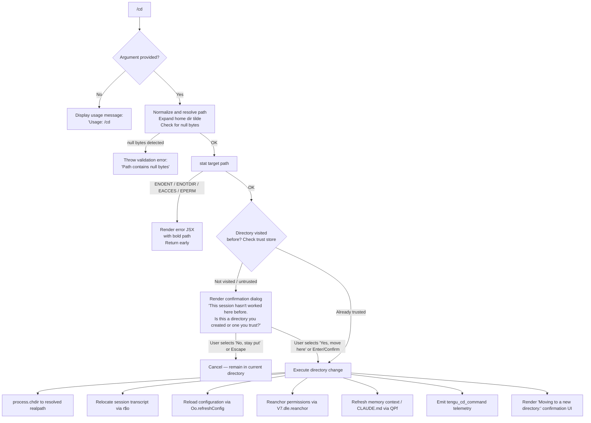

# `/cd`

> Analysis basis: CC v2.1.196 bundle.js (AST extraction + Claude interpretation)
> Minimum version: v2.1.196

---

## Overview

The `/cd` command moves the current Claude Code session to a new working directory specified by the user. It validates the target path, optionally prompts for confirmation when the directory has not been visited before, and then performs the actual directory change while relocating the session transcript, reloading configuration, and refreshing all permission and memory contexts.

---

## Registration

| Field | Value |
|---|---|
| type | `local-jsx` |
| name | `cd` |
| description | Move this session to a new working directory |
| argumentHint | `<path>` |
| module_id | `yNl` |
| load_inline | `true` |
| loc_byte | `11533485` |
| loc_byte_end | `11533645` |
| loc_line | `7355` |
| arbor_handler.name | `tOf` |
| arbor_handler.fqn | `claude-2.1.196::tOf` |
| arbor_handler.kind | `AsyncFunction` |
| arbor_handler.resolution_path | `module_id` |
| arbor_handler.n_hits | `0` |

Analysis basis: CC v2.1.196 bundle.js:+11533485

---

## Input Branching

The command has more than three distinct execution paths (no argument, missing/inaccessible path, untrusted directory requiring confirmation, and trusted/confirmed directory), so a Mermaid flowchart is used.



Analysis basis: CC v2.1.196 bundle.js:+11531970, +11532029, +11532081, +11532765, +11530543, +11530955, +11530918

---

## Behavioral Spec

### 1. Argument Validation

When the command is invoked, the handler (`tOf`) immediately checks whether a path argument was supplied.

```
function handleCdCommand(rawArg, context):
    if rawArg is empty or missing:
        render JSX error: "Usage: /cd <path>"
        return

    normalizedPath = normalizePath(rawArg)
    return executeCd(normalizedPath, context)
```

If no argument is given, the usage string `"Usage: /cd <path>"` is rendered and the handler exits.

Analysis basis: CC v2.1.196 bundle.js:+11531970, +11531990

---

### 2. Path Normalization (`ps` — path sanitizer)

The path sanitizer performs several transformations before any filesystem access:

```
function normalizePath(inputPath):
    if inputPath contains null bytes:
        throw Error("Path contains null bytes")

    path = inputPath.trim()
    path = unicodeNormalize(path, "NFC")          // NFC normalization
    path = os.normalize(path)

    if path starts with "~/":
        homeDir = os.homedir()
        path = join(homeDir, path.slice(2))        // expand tilde

    if platform is "windows":
        // apply Windows-specific path adjustments via regex
        pass

    if os.isAbsolute(path):
        return os.resolve(path)
    else:
        return os.resolve(currentWorkingDir, path)
```

Key constants:
- Unicode normalization form: `"NFC"` (bundle.js:+66896)
- Tilde prefix: `"~/"` (bundle.js:+1101267)
- Home-relative slice offset: `2` (bundle.js:+1101313)
- Null-byte error message: `"Path contains null bytes"` (bundle.js:+1101139)
- Platform check string: `"windows"` (bundle.js:+1101336)

Analysis basis: CC v2.1.196 bundle.js:+1101088, +1101139, +1101173, +1101198, +1101236, +1101254, +1101283, +1101396, +1101450

---

### 3. Filesystem Stat Check

After normalization, the handler calls `fs.stat` on the resolved path.

```
async function checkTargetPath(resolvedPath):
    try:
        stats = await fs.stat(resolvedPath)
        return stats
    catch err:
        if err.code in ["ENOENT", "ENOTDIR", "EACCES", "EPERM"]:
            render error JSX with bold(resolvedPath)
            return null
```

Handled error codes: `"ENOENT"`, `"ENOTDIR"`, `"EACCES"`, `"EPERM"` (bundle.js:+11532275, +11532289, +11532304, +11532318).

If any of these errors occur, the directory name is rendered in bold (via `It.bold`) and the handler exits without changing the working directory.

Analysis basis: CC v2.1.196 bundle.js:+11532081, +11532118

---

### 4. Trust / Confirmation Dialog (`_Nl` — trust dialog component)

Before moving, the handler checks whether the target directory has previously been visited (using a trust store backed by `gNl`). If the directory is new or untrusted, a JSX confirmation dialog is rendered.

```
function shouldConfirm(resolvedPath, trustStore):
    if trustStore.has(resolvedPath):
        return false    // directory previously visited — skip dialog
    return true

function renderConfirmationDialog(resolvedPath, onConfirm, onCancel):
    display:
      title: "Moving to a new directory:"
      body:  "This session hasn't worked here before. Is this a directory you created or one you trust?"
      subtext: "Claude Code will be able to read, edit, and execute files here."
      link:   "Security guide" → "https://code.claude.com/docs/en/security"
      buttons:
        - "Yes, move here"  (key: enter / confirm)
        - "No, stay put"    (key: escape / cancel)
```

Literal strings observed in bundle: `"This session hasn"` + `"t worked here before. Is this a directory you created or one you trust?"` (bundle.js:+11529031, +11529055), `"Yes, move here"` (bundle.js:+11529653), `"No, stay put"` (bundle.js:+11529682), `"https://code.claude.com/docs/en/security"` (bundle.js:+11529365), `"Security guide"` (bundle.js:+11529417).

Key bindings: `"enter"` / `"confirm"` → proceed; `"escape"` / `"cancel"` → abort (bundle.js:+11529888, +11529903, +11529932, +11529631).

Dialog display heading string: `"Moving to a new directory:"` (bundle.js:+11530071).

Analysis basis: CC v2.1.196 bundle.js:+11528893, +11529010, +11529031, +11529653, +11529682

---

### 5. Directory Permission / Allow-List Check (`gNl` + `JPf`)

Before the trust dialog is shown (or in lieu of it for absolute-path rules), the handler evaluates whether the target path falls within the session's configured allowed-directory patterns.

```
function checkAllowedPatterns(resolvedPath, allowedPatterns):
    for each pattern in allowedPatterns:
        // Glob-to-regex conversion using:
        // "(?:.*/)?", "(/.*)?", ".*", "[^/]+", escape "^$.|?+()[]{}"
        if resolvedPath matches convertedPattern:
            return { status: "allowed" }

    // path starts with "../" relative to current dir → also flagged
    if resolvedPath.startsWith("../"):
        return { status: "outsideAllowedPatterns" }

    return { status: "blockedByRule" }
```

Status strings emitted: `"allowed"` (bundle.js:+11527399), `"blockedByRule"` (bundle.js:+11527292), `"outsideAllowedPatterns"` (bundle.js:+11527526).

Glob escape characters recognized: `"\\^$.|?+()[]{}"` (bundle.js:+11528090).

Regex fragments used in pattern conversion: `"(?:.*/)?"`  (bundle.js:+11527945), `"(/.*)?"`  (bundle.js:+11528008), `".*"` (bundle.js:+11528057), `"[^/]+"`  (bundle.js:+11528074).

Analysis basis: CC v2.1.196 bundle.js:+11527134, +11527146, +11527717, +11527752

---

### 6. Session Relocation (`ZPf` → `r$o`)

Once the user confirms (or confirmation is not required), the core relocation sequence runs:

```
async function performDirectoryChange(resolvedPath, sessionContext):
    // 1. Obtain canonical real path
    canonicalPath = await fs.realpath(resolvedPath)

    // 2. Change the Node.js process working directory
    process.chdir(canonicalPath)

    // 3. Update internal working-directory state (BH / shell CWD setter)
    setShellCwd(canonicalPath)           // emits tengu_shell_set_cwd

    // 4. Normalize and store new CWD in app state (UM / owt)
    updateCwdState(canonicalPath)

    // 5. Begin transcript relocation
    session.beginTranscriptRelocation()

    // 6. Flush current transcript
    session.flush()

    // 7. Write relocation marker "cd" / "relocated" to transcript store
    writeTranscriptMarker("cd", "relocated")

    // 8. Mirror session state to new location
    session.fireMirror()

    // 9. End transcript relocation
    session.endTranscriptRelocation()

    // 10. Move transcript files to new directory (mkdir + rename/copy)
    relocateTranscriptFiles(newDirPath)

    // 11. Reanchor permission scope
    permissionScope.reanchor(canonicalPath)    // via V7 / dle.reanchor

    // 12. Refresh configuration from new directory
    Oo.refreshConfig()

    // 13. Reload CLAUDE.md memory context for new directory (QPf)
    reloadMemoryContext(canonicalPath)

    // 14. Emit primary telemetry event
    emit("tengu_cd_command")

    // 15. Render success UI (column layout: "Moving to a new directory:")
    renderSuccessUI(canonicalPath)
```

Transcript relocation marker strings: `"cd"` (bundle.js:+13636566), `"relocated"` (bundle.js:+13636725).
Shell CWD telemetry: `tengu_shell_set_cwd` (bundle.js:+7258156).
Directory-change telemetry: `tengu_cd_command` (bundle.js:+11530920).
Filesystem permissions for transcript directory: mode `448` decimal (bundle.js:+13637079), log file mode `384` decimal (bundle.js:+13656068).

Analysis basis: CC v2.1.196 bundle.js:+11532461, +11530543, +11530560, +11530566, +11530594, +11530848, +11530899, +11530955, +11530918

---

### 7. Memory Context Reload (`QPf`)

After the directory change, the memory context loader discovers and re-registers all applicable `CLAUDE.md` files for the new working directory:

```
function reloadMemoryContext(newCwd):
    configFiles = []

    // Walk from newCwd up to filesystem root
    currentDir = newCwd
    while true:
        candidate = join(currentDir, "CLAUDE.md")
        if exists(candidate):
            configFiles.push({ path: candidate, label: "Project",
                               note: "(project instructions, checked into the codebase)" })
        candidate = join(currentDir, ".claude", "CLAUDE.local.md")
        if exists(candidate):
            configFiles.push({ path: candidate, label: "Local",
                               note: "(user's private project instructions, not checked in)" })
        parent = dirname(currentDir)
        if parent == currentDir:
            break
        currentDir = parent

    configFiles.reverse()   // root-first ordering

    // Also load global memory files
    loadGlobalMemoryFiles(configFiles)

    // Register discovered files with file watcher
    registerWithFileWatcher(configFiles)
```

Memory file type labels: `"Project"` (bundle.js:+5258910), `"Local"` (bundle.js:+5259084), `"AutoMem"` (bundle.js:+5261101), `"Managed"` (bundle.js:+5261175).
Key filenames: `"CLAUDE.md"` (bundle.js:+5258876), `"CLAUDE.local.md"` (bundle.js:+5259044), `.claude` subdirectory (bundle.js:+5258943).

Analysis basis: CC v2.1.196 bundle.js:+11530955, +5258837, +5258866, +5258876, +5259044

---

### 8. System Prompt Injection (`eOf` / `Ur`)

After the directory move, a system-level message is injected into the conversation to inform the model that file references from the prior directory are stale:

```
function injectDirectoryChangeNotice(oldDir, newDir):
    // Fragment observed: "previous directory — that information is stale.
    //                    All tool calls and ..."
    systemMessage = buildStaleContextNotice(oldDir, newDir)
    appendSystemMessage(systemMessage, role="system")
```

The injected message role is `"system"` (bundle.js:+11532808).
Stale-context fragment: `"previous directory — that information is stale. All tool calls and "` (bundle.js:+11531114).

Analysis basis: CC v2.1.196 bundle.js:+11532670, +11532845, +11531114, +11531332

---

## State & Side Effects

| Item | Detail |
|---|---|
| Telemetry — primary | `tengu_cd_command` (bundle.js:+11530920) — emitted on every successful directory change |
| Telemetry — shell CWD | `tengu_shell_set_cwd` (bundle.js:+7258156) — emitted when `process.chdir` completes |
| Telemetry — config lock | `tengu_config_lock_contention` (bundle.js:+14157063), `tengu_config_stale_write` (bundle.js:+14157199), `tengu_config_auto_repaired` (bundle.js:+14157576), `tengu_config_auth_loss_prevented` (bundle.js:+14157906), `tengu_config_fallback_write` (bundle.js:+14156679), `tengu_config_parse_error` (bundle.js:+14160796) — emitted by the config save path during refreshConfig |
| Telemetry — daemon | `tengu_daemon_config_reload` (bundle.js:+18010884) — emitted if daemon config is reloaded |
| Telemetry — permissions | `tengu_disable_bypass_permissions_mode` (bundle.js:+3439914) — emitted if bypass mode is revoked on directory change |
| Telemetry — CLAUDE.md | `tengu_claude_rules_md_permission_error` (bundle.js:+5258054), `tengu_paper_halyard` (bundle.js:+5260804) — emitted during memory context scan |
| `process.chdir` | Changes the Node.js process working directory to the canonical realpath |
| Transcript relocation | `beginTranscriptRelocation` → `flush` → write `"cd"/"relocated"` marker → `fireMirror` → `endTranscriptRelocation` → filesystem `mkdir`/`rename`/`copyFile` under new path |
| File watcher | Reanchored to new directory via `V7.dle.reanchor`; background watchers (`wJi` / `Yi`) invalidate file caches |
| Configuration | `Oo.refreshConfig()` reloads all configuration layers (user, project, policy, CLI) from the new directory |
| App state | Working directory stored in app state under key `"working_directory"` (bundle.js:+11145853); permission mode under `"permission_mode"` (bundle.js:+11146126) |
| Permission scope | Reanchored — `allow`/`deny` rules re-evaluated against the new directory |
| System message | A `"system"`-role message injected into conversation history marking prior file references as stale |
| Sound | None observed |
| Hook registration | `vi` / `fis.register` called during config reload (bundle.js:+68542) |

---

## Version History

| Version | Change |
|---|---|
| v2.1.196 | Initial analysis |

---

## Common Mistakes

1. **Omitting the path argument** — `/cd` with no argument displays `"Usage: /cd <path>"` and does nothing; the new directory is always required.
2. **Using a relative path expecting it to resolve from the old CWD** — paths are resolved before `process.chdir` executes, so relative paths resolve correctly against the session's current directory at invocation time.
3. **Expecting immediate CLAUDE.md changes** — the memory context reload happens after the directory change; any CLAUDE.md in the new directory is loaded as part of the `/cd` execution, not lazily on the next agent turn.
4. **Assuming bypass-permissions mode persists across `/cd`** — if organizational policy disables bypass mode, it can be revoked during the permission reanchor triggered by this command (emits `tengu_disable_bypass_permissions_mode`).
5. **Cancelling the trust dialog and expecting the CWD to have changed** — selecting "No, stay put" or pressing Escape aborts the entire operation; the working directory remains unchanged.
6. **Using Windows-style backslash paths on non-Windows hosts** — path normalization applies platform-specific logic; on non-Windows systems the Windows path regex branches are skipped, and backslashes are not treated as separators.

---

## Appendix — Identifier Mapping

> For bundle debugging only. Identifiers change across versions.

| Identifier | Role |
|---|---|
| `tOf` | Main `/cd` command handler (AsyncFunction) |
| `ps` | Path sanitizer / normalizer |
| `Ot` | Working-directory state reader (async-store accessor) |
| `tmn` | Async-local-store getter helper |
| `a7` | Async-local-store value extractor |
| `dr` | Current working directory getter |
| `g0` | Low-level CWD primitive |
| `qt` | Path utility / quote helper |
| `o_` | Unicode NFC normalizer wrapper |
| `rn` | Error/exception helper |
| `gNl` | Trust-store and allowed-pattern evaluator |
| `Fo` | JSX React element factory |
| `i_` | Directory trust-store lookup / realpath resolver |
| `Dc` | Path component decoder |
| `Ap` | Absolute-path resolver helper |
| `jE` | Path segment stack manipulator (handles `..`) |
| `YLt` | Symlink-aware realpath walker |
| `eoc` | Trust-store entry constructor |
| `kae` | Recursive symlink follower |
| `Bd` | Realpath sync resolver |
| `TJt` | Path prefix stripper (for display) |
| `JPf` | Allow-list / deny-list pattern checker |
| `bJt` | Glob-to-regex pattern converter |
| `Mim` | Permission rule evaluator |
| `Xze` | Pattern match executor |
| `XPf` | Pattern-match result formatter |
| `BK` | Deny-rule collector |
| `eVo` | Deny-rule entry builder |
| `wg` | Rule string builder / formatter |
| `uTe` | Allow-rule collector |
| `Ypc` | Allow-rule entry builder |
| `AKe` | Shell-command danger classifier |
| `oko` | Danger-classifier cache accessor |
| `czt` | Shell-command token extractor |
| `dzt` | Shell-command string normalizer |
| `rko` | Danger-classifier cache key builder |
| `Ur` | Session init-options reader (working_directory, allowed_tools, etc.) |
| `ptr` | JSX element builder for init options |
| `ftr` | JSX element builder for init options (secondary) |
| `Sk` | Permission / bypass-mode state reader |
| `FYr` | Bypass-permissions mode evaluator |
| `it` | Permission-mode resolution logic |
| `eOf` | System message / stale-context notice injector |
| `Np` | Message text formatter (replaceAll escaping) |
| `K2u` | HTML/XML entity encoder |
| `_Ne` | Narrative wrapper for stale-context notice |
| `nws` | Narrative content builder |
| `ZPf` | Core directory-change executor |
| `BH` | Shell CWD setter (`tengu_shell_set_cwd`) |
| `Sn` | Error reporter / logger |
| `QRr` | CWD state store writer |
| `Bee` | CWD normalization writer |
| `V` | Void/no-op return value |
| `UM` | CWD event emitter (oEr.emit) |
| `owt` | CWD normalization helper |
| `r$o` | Session transcript relocation orchestrator |
| `Rt` | Session context getter |
| `Kc` | File-watcher registration helper |
| `vi` | Hook/watcher register function |
| `C4` | Config context builder |
| `ct` | String coercion utility |
| `jcc` | Config key helper |
| `_5` | Config value helper |
| `z3e` | Config layer merger |
| `UA` | Event emitter wrapper |
| `eis` | Event system initializer |
| `Zss` | Event broadcast helper |
| `SZt` | Transcript file writer |
| `Me` | JSON serializer wrapper |
| `T` | Log / message record builder |
| `eeu` | Log record encoder |
| `Pc` | Log message path redactor |
| `KQe` | Log-level formatter |
| `oeu` | Log record file writer |
| `xcc` | Transcript file mover / copier |
| `Jcc` | Recursive directory copier |
| `Re` | Config writer with lock |
| `er` | Error factory |
| `zi` | Config lock acquirer |
| `_Nu` | Lock queue manager |
| `v7t` | Append-log writer |
| `wJi` | Background file-cache invalidator |
| `dE` | File-cache entry deleter |
| `Yi` | File-cache refresh worker |
| `ad` | Error handler for cache refresh |
| `Gt` | JSON parser wrapper |
| `zd` | Background-state serializer |
| `rg` | Atomic file writer |
| `Jf` | Config save dispatcher |
| `he` | String coercion helper |
| `V7` | Permission-scope reanchor caller |
| `vE` | Post-cd UI state updater |
| `QPf` | Memory-context (CLAUDE.md) reload orchestrator |
| `hI` | Path normalizer for memory-file keys |
| `$9t` | CLAUDE.md file discoverer (walks to root) |
| `Um` | Settings layer merger |
| `yG` | CLAUDE.md file entry builder |
| `Mke` | Directory tree walker for CLAUDE.md |
| `P9t` | Gitignore-aware path filter |
| `U9t` | Memory-context descriptor builder |
| `Wnr` | HTML entity unescaper |
| `mC` | Post-cd state commit |
| `eAt` | Config accessor (Dt-based) |
| `Dt` | Config loader / watcher |
| `sqo` | Config schema validator |
| `lIt` | Config file reader with backup |
| `V5` | Config path prefix stripper |
| `lqo` | Config directory scanner |
| `uqo` | Backup path builder |
| `m` | Array/filter utility |
| `Ldm` | Config watcher manager |
| `bkt` | File-watch registrar |
| `ege` | Watch event handler |
| `L8` | Path key normalizer (NFC + replaceAll) |
| `vJt` | New-directory config initializer |
| `Hn` | Global config save orchestrator |
| `ntn` | Config save-with-lock implementation |
| `Yli` | Config object assigner |
| `cIt` | Config integrity checker |
| `mkt` | Atomic write-file-sync-and-flush |
| `zUe` | Config diff/merge helper |
| `iqo` | Config entries iterator |
| `etn` | Config timestamp recorder |
| `Zen` | Config load executor |
| `Tdr` | Config write executor |
| `Oe` | Platform-specific file utility |
| `_Nl` | Trust-confirmation JSX dialog component |
| `H` | Background-process kill helper |
| `P` | Child-process handle |

---

Note: index built via Arbor fallback; some signals (telemetry, literals) may be missing — see arbor-fallback.js.