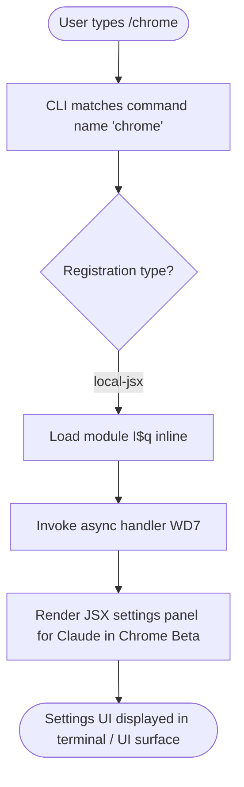

# `/chrome`

> Analysis basis: CC v2.1.132 bundle.js (AST extraction + Claude interpretation)
> Minimum version: v2.1.132

---

## Overview

The `/chrome` command opens or navigates to the **Claude in Chrome (Beta)** settings panel within the Claude Code CLI. It is registered as a `local-jsx` command, meaning its output is rendered as a local JSX UI component rather than dispatching a prompt to the agent. The command's async handler (`WD7`) is resolved via module `I$q` and loaded inline.

---

## Registration

| Field | Value |
|---|---|
| type | `local-jsx` |
| name | `chrome` |
| description | `Claude in Chrome (Beta) settings` |
| module\_id | `I$q` |
| load\_inline | `true` |
| handler | `WD7` (AsyncFunction, resolved via `module_id`) |
| loc\_byte span | `11305321` – `11305498` |
| loc\_line | `7103` |
| `loc_byte_end` | `11305498` |
| `arbor_handler.name` | `WD7` |
| `arbor_handler.kind` | `AsyncFunction` |
| `arbor_handler.resolution_path` | `module_id` |
| `arbor_handler.fqn` | `claude-2.1.132::WD7` |
| `arbor_handler.n_hits` | `0` |

Analysis basis: CC v2.1.132 bundle.js:+11305321

---

## Input Branching

The depth-2 call-graph traversal returned no edges for this command, indicating that the handler (`WD7`) either resolves entirely within module `I$q` without further cross-module calls visible at depth ≤ 2, or that its logic is self-contained within the async function body.

Because no branching signals were recovered, the input-branching diagram reflects what can be structurally inferred from the registration type and handler shape:



> **Note:** No branching literals or conditional call-graph edges were found at depth ≤ 2. The flowchart above represents the known structural path only.

<!-- TODO: internal handler branching not found in depth-2 traversal; needs --depth 4 -->

---

## Behavioral Spec

### Command Dispatch and Handler Invocation

Because `/chrome` is typed as `local-jsx`, the CLI does **not** forward user input to the language model as a prompt. Instead, control passes directly to the registered async handler after module resolution.

```
async function chromeCommandHandler(context):
    # Step 1 — Module resolution
    module = await loadInlineModule("I$q")

    # Step 2 — Handler invocation
    result = await module.WD7(context)

    # Step 3 — JSX rendering
    # result is a JSX element or component tree
    renderLocalJSX(result)

    # Step 4 — Display
    # The rendered component presents Chrome Beta settings to the user
    displayComponent(result)
```

Analysis basis: CC v2.1.132 bundle.js:+11305321

### Handler Type

The handler `WD7` is declared as an `AsyncFunction` (Analysis basis: CC v2.1.132 bundle.js:+11305321), meaning it may perform asynchronous operations (e.g., reading configuration state, checking browser integration availability) before returning the JSX tree. Callers must await its resolution before rendering.

### Rendering Model

The `local-jsx` type distinguishes `/chrome` from `prompt`-type commands:

| Characteristic | `local-jsx` (`/chrome`) | `prompt`-type |
|---|---|---|
| Sends text to model | No | Yes |
| Renders UI locally | Yes | No |
| Async handler | Yes (`WD7`) | Varies |
| Agent interaction | None | Full round-trip |

<!-- TODO: JSX component tree returned by WD7 not recoverable at depth-2; needs --depth 4 -->

---

## State & Side Effects

| Item | Detail |
|---|---|
| Telemetry | None detected at depth ≤ 2 (`telemetry: []`) |
| Hook registration | <!-- TODO: not found in depth-2 traversal; needs --depth 4 --> |
| appState changes | <!-- TODO: not found in depth-2 traversal; needs --depth 4 --> |
| Sound | <!-- TODO: not found in depth-2 traversal; needs --depth 4 --> |
| Module loaded | `I$q` loaded inline at invocation time (`load_inline: true`) |

> Because the telemetry array is empty and the call-graph returned no edges, no side-effect claims beyond module loading can be made with confidence.

---

## Version History

| Version | Change |
|---|---|
| v2.1.132 | Initial analysis — `local-jsx` command registered at bundle.js:+11305321, handler `WD7` in module `I$q` |

---

## Common Mistakes

1. **Expecting a model response.** `/chrome` is a `local-jsx` command and does not send any prompt to Claude. Users should not expect a conversational reply; the command exclusively renders a settings panel.
2. **Passing arguments.** No argument-handling literals or parameter-parsing call edges were found at depth ≤ 2. Passing extra text after `/chrome` is likely ignored or unsupported.
3. **Assuming synchronous rendering.** The handler `WD7` is an `AsyncFunction`; in constrained environments or slow storage, the settings panel may not appear instantaneously.
4. **Confusing with a browser-launch command.** `/chrome` does not launch or control a Chrome browser process directly from the CLI; it surfaces *settings* for the Claude in Chrome Beta integration.

---

## Appendix — Identifier Mapping

> For bundle debugging only. Identifiers change across versions.

| Identifier | Role |
|---|---|
| `WD7` | Async handler function for the `/chrome` command; resolved from module `I$q` via `module_id` path; returns JSX component tree for Chrome Beta settings |
| `I$q` | Module containing the `/chrome` handler; loaded inline (`load_inline: true`) at command invocation |

---

*Note: The call-graph for this command returned zero edges at depth ≤ 2 and no string literals or telemetry events were extracted. All behavioral claims beyond registration metadata are structurally inferred and marked with `<!-- TODO -->` where deeper traversal is required.*