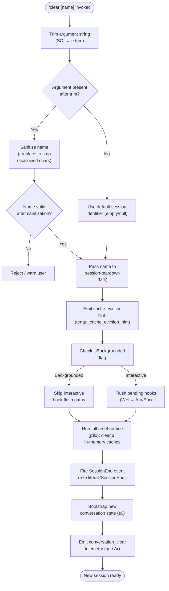

# `/clear`

> Analysis basis: CC v2.1.196 bundle.js (AST extraction + Claude interpretation)
> Minimum version: v2.1.196

---

## Overview

The `/clear` command (also aliased as `/reset` and `/new`) starts a fresh Claude Code session with an empty context window, while leaving the previous session persisted on disk so it can be recovered later via `/resume`. Internally the handler trims and validates any optional session-name argument, then delegates to a full-session-teardown routine (`MJt`) that clears in-memory caches, flushes pending hooks, emits a `conversation_clear` telemetry event, and finally bootstraps a new conversation state.

---

## Registration

| Field | Value |
|---|---|
| type | `local` |
| name | `clear` |
| description | `Start a new session with empty context; previous session stays on disk (resumable with /resume)` |
| argumentHint | `[name]` |
| aliases | `reset`, `new` |
| supportsNonInteractive | `true` |
| thinClientDispatch | `post-text` |
| module_id | `NNl` |
| load_inline | `true` |
| loc_byte (registration open) | `11550834` |
| loc_byte_end (registration close) | `11551125` |
| loc_line | `7357` |
| arbor_handler.name | `SOf` |
| arbor_handler.fqn | `claude-2.1.196::SOf` |
| arbor_handler.kind | `AsyncFunction` |
| arbor_handler.resolution_path | `module_id` |
| arbor_handler.n_hits | `0` |
| `loc_byte_end` | `11551125` |

Analysis basis: CC v2.1.196 bundle.js:+11550834

---

## Input Branching

The command accepts an optional `[name]` argument and follows several distinct paths depending on whether a name is supplied, whether it passes sanitization, and whether the runtime is in backgrounded/non-interactive mode.



---

## Behavioral Spec

### 1. Argument parsing (`SOf`)

The top-level handler `SOf` (resolved via `module_id` → `NNl`) is an `AsyncFunction` that receives the raw argument string from the CLI.

```
async function clearCommandHandler(rawArg, context):
    trimmedArg = rawArg.trim()                    // e.trim  +11550660
    sanitizedArg = sanitizeName(trimmedArg)       // t.replace  +17616328

    if sanitizedArg is empty:
        sessionName = null
    else:
        sessionName = sanitizedArg

    await runSessionReset(sessionName, context)   // MJt  +11550696
```

Analysis basis: CC v2.1.196 bundle.js:+11550660

### 2. Session teardown coordinator (`MJt`)

`MJt` is the central reset coordinator. It orchestrates cache invalidation, hook flushing, event emission, and new-session bootstrap.

```
async function sessionResetCoordinator(sessionName, context):
    // Validate/clamp numeric session index if name is numeric
    index = parseInt(sessionName, 10)             // PJt → parseInt  +13766065
    if not Number.isFinite(index):
        index = clampIndex(...)                   // Math.max/min  +13766283
    
    // Emit cache-eviction hint to API layer
    emitTelemetry("tengu_cache_eviction_hint")    // qe  +11548396
    
    // Read isBackgrounded flag from app state
    isBackgrounded = context["isBackgrounded"]    // literal  +11548507

    // Abort any in-flight requests
    abortSignal = AbortSignal.timeout(...)        // +11548352
    
    // Flush queued output writer
    flushOutputWriter(context)                    // fwt  +11548383

    // Emit conversation_clear analytics event
    emitAnalytics("conversation_clear")           // Ar → qe  +11548472
    
    // Clear display/render caches
    clearRenderCaches()                           // t.clear  +11548896

    // Reset session state stores
    runFullCacheReset(sessionName)                // p$o  +11548756

    // Re-register hooks and reload skills
    reloadHooksAndSkills(context)                 // Aq  +11550403
    
    // Re-establish working-directory binding
    setWorkingDirectory(context)                  // BH  +11548780

    // Schedule countdown UI widget (if interactive)
    if not isBackgrounded:
        scheduleCountdownWidget("padded-countdown") // literal  +11548708

    // Set conversation mode to "main"
    setConversationMode("main")                   // literal  +11548731

    // Fire SessionEnd lifecycle event
    fireSessionEnd()                              // e7e → "SessionEnd"  +11548304

    // Bootstrap new conversation
    bootstrapNewSession(sessionName, context)     // s0  +11548304
```

Analysis basis: CC v2.1.196 bundle.js:+11548292

### 3. Full cache reset (`p$o`)

`p$o` clears every in-memory cache that accumulates conversation state, ensuring the new session starts clean.

```
function fullCacheReset(sessionName):
    clearSkillIndexCache()           // eW.clearSkillIndexCache  +13602805
    clearConversationQueues()        // Zpa → Sq.clear  +5404252
    clearHookRegistrations()         // Wfe → multiple .clear  +11547287
        per → _Rl.clear             // +10950463
        Ska → t6t.clear / hmo.clear // +6887445
    clearAutonomousLoopState()       // cxf.resetAutonomousLoopDelivered  +10973538
    clearTaskTracking()              // EG → XYt.clear  +11270081
    clearSubagentState()             // O9t  +11547306
    clearCacheMaps(Object.keys(...)) // +11547399
    clearVectorCaches()              // orl → VVe.clear / DCo.clear  +8843367
    clearElicitationCaches()         // cEl → aEt.clear / vzt.clear  +10132132
    clearTokenCountCache()           // uMr → Zve.clear  +1161498
    clearAbortControllers()          // jal → Uzn.clear  +9103283
    clearFileWatcherState()          // eMr → htt.clear  +1152737
    resetContextWindowState()        // CLl → J7t  +11547603
    clearUIStateStores()             // ZPa → _oe.clear / cDe.clear  +7104290

    if sessionName provided:
        persistNewSessionMetadata(sessionName)  // VRo, rH, $Ee  +11547645

    return Promise.resolve()
```

Analysis basis: CC v2.1.196 bundle.js:+11547251

### 4. Hook flush (`WH` / `Aur` / `Eur`)

When the session is not backgrounded, pending hooks are flushed before the reset completes.

```
async function flushPendingHooks(context):
    // Track flush promise
    flushPromise = trackFlushPromise(Aur)        // Cuc.add/delete  +13721955

    // Get pending hook queue
    hookQueue = hookQueueStore.get(Eur)          // Eur.get  +13723370

    if hookQueue not empty:
        await hookQueue.flush()                  // t.flush  +13723392
        hookQueueStore.delete(hookQueue)         // Eur.delete  +13723402
```

Analysis basis: CC v2.1.196 bundle.js:+11549297

### 5. SessionEnd lifecycle event (`e7e`)

Before the new session is bootstrapped, the `SessionEnd` hook event is fired so any registered `SessionEnd` hooks receive the outgoing session data.

```
async function fireSessionEndEvent(sessionContext):
    event = buildHookEvent("SessionEnd", sessionContext)   // literal  +13756514
    await dispatchHookEvent(event)                         // wd  +13756487
    persistSessionRecord(sessionContext)                   // s0  +13756545
```

Analysis basis: CC v2.1.196 bundle.js:+11548304

### 6. New-session bootstrap (`s0`)

`s0` is the large session-bootstrap routine shared between `/clear` and the initial startup path. When called from `/clear` it receives the new session name (or null) and builds a fresh `appState`.

```
async function bootstrapNewSession(sessionName, context):
    // Generate new session UUID
    sessionId = crypto.randomUUID()                    // BYe.randomUUID  +13807608

    // Build initial tool configuration
    toolConfig = buildToolConfig(context)              // p8o  +13807027

    // Construct initial message list (empty for /clear)
    messages = []

    // Register hook callbacks for new session
    registerHookCallbacks(context)                     // g.callback  +13807633

    // Start the agent loop in a new session context
    await runAgentSession({
        sessionId,
        sessionName,
        messages,
        toolConfig,
        abortController: newAbortController(),         // jk  +13807578
    })

    // Emit tengu_run_hook telemetry
    emitTelemetry("tengu_run_hook")                   // +13807189
```

Analysis basis: CC v2.1.196 bundle.js:+13756545

### 7. Numeric session-index validation (`PJt`)

When the argument parses as an integer (e.g., `/clear 3`), the index is clamped to a valid range.

```
function validateNumericSessionIndex(raw):
    parsed = parseInt(raw, 10)                        // +13766065
    if not Number.isFinite(parsed):
        return defaultIndex
    clamped = Math.max(0, Math.min(parsed, 1000))     // +13766283, +13766296
    return clamped
```

Constants: minimum index `0`, maximum index `1000` (bundle.js:+13766283 / +13766296); base `10` parse radix (bundle.js:+13766076).

Analysis basis: CC v2.1.196 bundle.js:+13766065

---

## State & Side Effects

| Item | Detail |
|---|---|
| Telemetry — `tengu_cache_eviction_hint` | Emitted before reset to hint API layer to evict cached prompt tokens (bundle.js:+11548396) |
| Telemetry — `tengu_run_hook` | Emitted inside new-session hook execution path (bundle.js:+13807189) |
| Telemetry — `tengu_repl_hook_finished` | Emitted when a REPL hook completes during session transition (bundle.js:+13790661) |
| Telemetry — `tengu_hook_plugin_metrics` | Emitted with plugin hook timing data (bundle.js:+13784967) |
| Telemetry — `tengu_feature_ok` / `tengu_feature_bad` | Emitted by feature-flag wrapper around session bootstrap (bundle.js:+1028610 / +1028677) |
| Telemetry — `tengu_session_renamed` | Emitted if the optional `[name]` argument renames the new session (bundle.js:+13656683) |
| Telemetry — `tengu_transcript_write_failed` | Emitted if the transcript file cannot be written during teardown (bundle.js:+13662652) |
| Analytics event | `conversation_clear` string sent to analytics pipeline (bundle.js:+11548434) |
| Previous session on disk | **Preserved** — JSONL transcript is not deleted; `/resume` can recover it |
| In-memory caches cleared | Skill index, conversation queues, hook registrations, autonomous-loop state, task tracking, subagent state, vector caches, elicitation caches, token-count cache, abort controllers, file-watcher state, context-window state, UI state stores |
| Hook flush | Pending hook queue flushed synchronously before teardown when not backgrounded |
| `SessionEnd` hook event | Dispatched to any registered `SessionEnd` hooks before new session starts |
| Skill index cache | Cleared via `eW.clearSkillIndexCache` (bundle.js:+13602805) |
| Working directory binding | Re-established in new session context (bundle.js:+11548780) |
| AbortSignal | A fresh `AbortSignal.timeout` is created for the new session (bundle.js:+11548352) |
| Sound | Not observed in depth-2 traversal |

---

## Version History

| Version | Change |
|---|---|
| v2.1.196 | Initial analysis |

---

## Common Mistakes

1. **Expecting history erasure from disk** — `/clear` only clears the in-memory context window. The previous session transcript remains on disk and is fully recoverable via `/resume`. Use this if you accidentally cleared when you meant to continue.
2. **Confusing `/clear` with `/reset` or `/new`** — All three names are registered aliases for the same command and behave identically.
3. **Assuming a name argument creates a permanent alias** — The optional `[name]` argument labels the *new* session being started, not the outgoing one. It does not affect the on-disk name of the previous session.
4. **Invoking `/clear` in non-interactive (piped) mode expecting a prompt** — `supportsNonInteractive: true` means the command runs silently in pipe mode; there is no confirmation prompt.
5. **Passing a numeric string as a name** — Integer-like arguments (e.g., `/clear 5`) are processed through the numeric-index validation path (`PJt`), clamped to `[0, 1000]`, and may not behave as a human-readable session label.

---

## Appendix — Identifier Mapping

> For bundle debugging only. Identifiers change across versions.

| Identifier | Role |
|---|---|
| `SOf` | Top-level clear command async handler (`arbor_handler.name`) |
| `MJt` | Session-reset coordinator — orchestrates full teardown and re-bootstrap |
| `PJt` | Numeric session-index validator (parseInt + clamp) |
| `$_` | Policy/settings reader called during index validation |
| `Rl` | Settings store accessor |
| `Jce` | Policy-settings fetch helper |
| `y5` | Utility called during index validation |
| `g0` | Low-level platform primitive (called by multiple helpers) |
| `zF` | Cache-state write helper called during teardown |
| `zYr` | Persistent map get/set helper |
| `n_` | Clears two named caches (`Hin`, `Qyr`) |
| `YYr` | Session state updater |
| `e7e` | SessionEnd event dispatcher |
| `wd` | Hook-dispatch engine (builds and fires hook events) |
| `Rt` | Render/output utility |
| `V1` | Secondary render utility |
| `QC` | Model-name inclusion checker / effort setter |
| `tO` | Effort-level handler |
| `qx` | Output path builder |
| `Ot` | Output token tracker |
| `BFe` | Background-flag accessor |
| `s0` | New-session bootstrap routine |
| `Q3` | Conversation-state factory |
| `T` | Message formatter / role tagger |
| `uIe` | App-state reader helper |
| `p8o` | Tool-configuration builder |
| `c` | Hook-filter utility |
| `_dc` | Default-context provider |
| `d8o` | Third-party hook filter |
| `Sdc` | Settings-derived config builder |
| `$n` | Transcript writer |
| `V` | Feature-flag evaluator |
| `Me` | JSON stringify wrapper |
| `Re` | Error logging helper |
| `ke` | Feature-ok path handler |
| `sBe` | Feature-bad path handler |
| `jk` | AbortController manager (clear/set timeout) |
| `g` | Callback registry helper |
| `Qme` | Queue-message emitter |
| `C1` | Conversation-state accessor |
| `kur` | Context-window config helper |
| `i8o` | MCP tool result parser |
| `Pur` | Hook output parser (JSON vs plain-text) |
| `Jfe` | Hook plugin metrics aggregator |
| `s8o` | HTTP hook executor |
| `hdc` | HTTP hook response handler |
| `jTe` | Hook error formatter |
| `Our` | Subprocess hook spawner |
| `Mje` | Hook result merge helper |
| `xe` | Feature-flag wrapper (ok path) |
| `g9` | Telemetry event emitter |
| `t0o` | Message serialiser used during teardown |
| `fwt` | Output-writer flush helper |
| `qe` | Analytics/event emitter |
| `$Xe` | Base event schema |
| `Ar` | `conversation_clear` analytics emitter |
| `Ig` | Event schema variant |
| `s` | Active-session set manager (add/delete) |
| `r` | Session registry |
| `vs` | Process-exit handler for CLI errors |
| `i` | Session connection closer |
| `n` | Connection name normaliser |
| `f` | Path formatter |
| `L8` | Path normaliser (oN.normalize + replaceAll) |
| `Sl` | Subtitle/label setter |
| `d` | Daemon/supervisor write manager |
| `TYe` | File-stat and content reader |
| `rn` | Error constructor helper |
| `Ks` | Async-local-storage store getter |
| `zGo` | File-content cache lookup |
| `he` | String coercion helper |
| `o` | Column formatter |
| `gic` | Column-width calculator |
| `E` | MCP server stop controller |
| `$Ct` | SSE transport stopper |
| `er` | Error string builder |
| `A` | MCP server lifecycle manager |
| `QHr` | Array-or-single normaliser |
| `XHr` | Auth-URL string processor |
| `H` | Auth/user-info client |
| `Wqc` | Heartbeat manager |
| `Wce` | Heartbeat setup helper |
| `I` | Input handler / key-press processor |
| `M` | HTTP server request router |
| `p` | Process exit / abort runner |
| `nI` | CLI shutdown initiator |
| `u` | Daemon stop sequence |
| `$F` | Daemon stop broadcaster |
| `Wj` | Graceful shutdown race wrapper |
| `hS` | History-state serialiser |
| `yYt` | Session-slot map get/set |
| `OO` | Assistant-message usage checker |
| `Kre` | XGe presence checker |
| `zre` | Usage store accessor |
| `p$o` | Full in-memory cache reset routine |
| `a$o` | Cache-reset pre-check helper |
| `X0` | Skill-index cache reset coordinator |
| `eW` | Skill index clear + reload |
| `Qtr` | Skill-index query reset |
| `TPl` | Skill tree pruner |
| `dze` | Session-context descriptor reset |
| `Zpa` | Conversation-queue clearer |
| `uWe` | Queue persistence writer |
| `Vwt` | Volatile-state reset helper |
| `Wfe` | Hook registration reset |
| `o5e` | Hook registry reader |
| `Her` | Hook entry deleter |
| `O9t` | Subagent-state clearer |
| `jwt` | JWT/token state clearer |
| `Kwt` | Compact-state reset |
| `per` | Permission-cache clearer |
| `Ska` | Skill annotation cache clearer |
| `Upl` | Upload-state reset |
| `POe` | Policy-override state reset |
| `Jy` | Output-token counter reset |
| `jOo` | Job-queue orphan cleaner |
| `EG` | Execution-graph cache clearer |
| `orl` | Vector/embedding cache clearer |
| `cEl` | Elicitation-state clearer |
| `uMr` | Token-usage cache clearer |
| `MNl` | Model-negotiation state clearer |
| `jal` | AbortController registry clearer |
| `iAr` | Feature-flag presence checker |
| `eMr` | File-watcher map clearer |
| `CLl` | Context-length limit resetter |
| `J7t` | Context-window descriptor accessor |
| `ZPa` | UI-state store clearer |
| `dr` | Debug/trace logger |
| `BH` | Working-directory binder |
| `qt` | Filesystem path builder |
| `Sn` | System error logger |
| `QRr` | Async-store CWD resolver |
| `o_` | Path normaliser |
| `Bee` | Owned-path checker |
| `bl` | Bold-text renderer |
| `aWe` | Active-session watcher reset |
| `DT` | Display-title updater |
| `WH` | Hook-queue flush coordinator |
| `Aur` | Flush-promise tracker |
| `Xft` | Cross-session feature tracker |
| `XUa` | Feature-usage aggregator |
| `LT` | Long-term memory / MCP skill loader |
| `yje` | Skill-manifest parser |
| `zMe` | Skill content hasher |
| `Vw` | MCP skill registration runner |
| `it` | Individual skill registrar |
| `ONl` | Output-notification listener |
| `GCe` | Output-gate checker |
| `jg` | Job-graph builder |
| `Kc` | Conversation-key creator |
| `vi` | File-system hook registrar |
| `Jk` | Job-key formatter |
| `Zf` | Session-file path builder |
| `t3` | Temp-directory accessor |
| `DJt` | Deferred-job tracker |
| `rEr` | Request-ID generator |
| `eis` | Event-ID store |
| `Zss` | Event emission wrapper |
| `f2a` | File-to-agent mapper |
| `yZ` | Yield-context resetter |
| `LJi` | Long-job index manager |
| `dE` | Entry deleter from long-job store |
| `Yi` | YAML/JSON index file reader-writer |
| `a` | Response checker |
| `ad` | Async-delay helper |
| `Gt` | JSON parse wrapper |
| `zd` | Index-write dispatcher |
| `rg` | Atomic file writer |
| `Jf` | Job-filter helper |
| `zW` | Session-rename handler |
| `lIe` | Append-file log writer |
| `C4` | Conversation-context builder |
| `Oe` | Output-event schema |
| `Wbe` | Worktree symlink manager |
| `Qjo` | Worktree directory creator |
| `Wft` | Worktree path builder |
| `jm` | Worktree task-path builder |
| `$im` | Worktree lstat/realpath checker |
| `Lmt` | Worktree open-file handler |
| `Tx` | Task-execution path resolver |
| `Gu` | GPU/resource guard |
| `eo` | Event-object factory |
| `xsn` | Cross-session-notification binder |
| `$m` | Message-metadata helper |
| `$W` | Worktree-state emitter |
| `tme` | Transcript-merge executor |
| `v7t` | Async transcript appender |
| `_d` | Delta-state accessor |
| `Aq` | Hook loader and plugin cloner |
| `fc` | Hook-filter chain builder |
| `Hd` | Hook-data store accessor |
| `lJ` | Hook-entry list builder |
| `fn` | Hook-function executor |
| `mtt` | Hook timing measurer |
| `Ln` | Log-file appender |
| `sSe` | Safe-mode hook filter |
| `p4t` | Plugin agent task runner |
| `Ky` | Key-yield checker |
| `Lv` | Full agent-loop runner (called by p4t) |
| `l` | Tool-call list builder |
| `eoc` | Event-on-completion recorder |
| `ci` | Conversation-item builder |