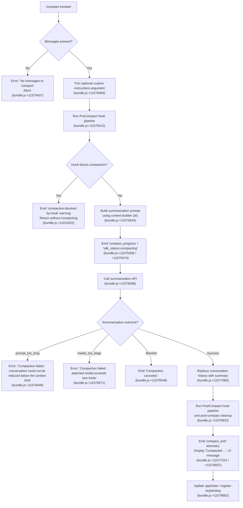

# `/compact`

> Analysis basis: CC v2.1.196 bundle.js (AST extraction + Claude interpretation)
> Minimum version: v2.1.196

---

## Overview

The `/compact` command frees up context window space by summarizing the current conversation into a compact representation, then replacing the full message history with that summary. It accepts an optional argument containing custom summarization instructions, and supports non-interactive (scripted) invocation via the `post-text` thin-client dispatch path.

---

## Registration

| Field | Value |
|---|---|
| type | `local` |
| name | `compact` |
| description | `Free up context by summarizing the conversation so far` |
| argumentHint | `<optional custom summarization instructions>` |
| supportsNonInteractive | `true` |
| thinClientDispatch | `post-text` |
| module_id | `bUl` |
| load_inline | `true` |
| loc_byte | `11579937` |
| loc_byte_end | `11580237` |
| arbor_handler.name | `KOf` |
| arbor_handler.fqn | `claude-2.1.196::KOf` |
| arbor_handler.kind | `AsyncFunction` |
| arbor_handler.resolution_path | `module_id` |
| arbor_handler.n_hits | `0` |

Analysis basis: CC v2.1.196 bundle.js:+11579937

---

## Input Branching

The command has several distinct branches based on message availability, optional argument presence, hook blocking, and compaction outcome. A Mermaid flowchart is used.



---

## Behavioral Spec

### Entry Point — Main Handler (`KOf`)

```
async function handleCompactCommand(context, argument):
    messageHistory = getMessageHistory(context)

    if messageHistory is empty:
        throw Error("No messages to compact")
        // Analysis basis: CC v2.1.196 bundle.js:+11579431, +11579437

    customInstructions = argument.trim()   // may be empty string
    // Analysis basis: CC v2.1.196 bundle.js:+11579469

    result = await runCompactionPipeline(context, customInstructions)
    // Analysis basis: CC v2.1.196 bundle.js:+11579495

    if result.canceled:
        displayMessage("Compaction canceled.")
        // Analysis basis: CC v2.1.196 bundle.js:+11579548
        return

    applyCompactionResult(context, result)
    // Analysis basis: CC v2.1.196 bundle.js:+11579580, +11579692
```

### Compaction Pipeline (`zOf`)

```
async function runCompactionPipeline(context, customInstructions):
    startTime = performance.now()
    // Analysis basis: CC v2.1.196 bundle.js:+11575495

    emit progress event: "compact_progress"
    // Analysis basis: CC v2.1.196 bundle.js:+11575358

    // 1. Run PreCompact hooks
    emit progress step: "hooks_start"
    // Analysis basis: CC v2.1.196 bundle.js:+11575389
    hookResult = await runHookPipeline("PreCompact", context)
    // Analysis basis: CC v2.1.196 bundle.js:+11575412

    if hookResult.blocked:
        emitWarning("compaction-blocked-by-hook",
                    "compaction blocked by PreCompact hook")
        // Analysis basis: CC v2.1.196 bundle.js:+11151022, +11151056
        return { blocked: true }

    emit sdk_status: "compacting"
    // Analysis basis: CC v2.1.196 bundle.js:+11574474

    // 2. Build summarization context
    [contextPayload, precomputedResult] = await Promise.all([
        buildSummarizationContext(context),   // XOf
        fetchPrecomputedCompact(context)      // pZ
    ])
    // Analysis basis: CC v2.1.196 bundle.js:+11575546, +11575559, +11575634

    // 3. Determine compaction mode
    compactionMode = determineMode(context)  // "manual"
    // Analysis basis: CC v2.1.196 bundle.js:+11575571

    // 4. Execute summarization (stream)
    emit progress: "stream_mode=requesting", "compact_start"
    // Analysis basis: CC v2.1.196 bundle.js:+11575793, +11575918
    summaryResult = await executeSummarization(
        contextPayload, precomputedResult, customInstructions)
    // Analysis basis: CC v2.1.196 bundle.js:+11576086

    // 5. Handle failure cases
    if summaryResult.error == "prompt_too_long":
        throw Error("Compaction failed · conversation could not be reduced below the context limit")
        // Analysis basis: CC v2.1.196 bundle.js:+11576449
    if summaryResult.error == "media_too_large":
        throw Error("Compaction failed · attached media exceeds size limits")
        // Analysis basis: CC v2.1.196 bundle.js:+11576571
    if summaryResult.aborted:
        return { canceled: true }
        // Analysis basis: CC v2.1.196 bundle.js:+11577894

    // 6. Apply compacted history
    applyCompactedHistory(context, summaryResult)
    // Analysis basis: CC v2.1.196 bundle.js:+11577060

    // 7. Run PostCompact hooks and cleanup
    await runPostCompactCleanup(context)
    // Analysis basis: CC v2.1.196 bundle.js:+11576832

    emit "compact_end" with timing metadata
    // Analysis basis: CC v2.1.196 bundle.js:+11577324

    return { success: true, summary: summaryResult }
```

### Summarization Context Builder (`XOf`)

```
function buildSummarizationContext(context):
    appState = context.getAppState()
    // Analysis basis: CC v2.1.196 bundle.js:+11578893

    // Collect all context signals in parallel
    [systemPromptData, agentMemory] = await Promise.all([
        buildSystemPromptPayload(context),   // IW
        collectAgentMemory(context)          // Ur + zk
    ])
    // Analysis basis: CC v2.1.196 bundle.js:+11579017, +11578971, +11579203

    // Detect miss cases for compaction quality signals
    if no custom instructions found:
        record "miss_custom_instructions"
        // Analysis basis: CC v2.1.196 bundle.js:+11577633
    if no relevant hooks found:
        record "miss_hook"
        // Analysis basis: CC v2.1.196 bundle.js:+11577686

    messageSlice = Array.from(filteredMessages)
    // Analysis basis: CC v2.1.196 bundle.js:+11578960

    return { appState, systemPromptData, agentMemory, messageSlice }
```

### Pre-computed Compact Fetch (`pZ`)

```
async function fetchPrecomputedCompact(context):
    // Attempt to retrieve a previously computed compaction result
    // from the in-flight precomputation pipeline (wd / s0 chain)
    // Analysis basis: CC v2.1.196 bundle.js:+11575559, +13751646, +13751754

    candidate = await getPrecomputedResult(context)

    if candidate is valid and matches current boundary:
        emit "tengu_precomputed_compact_consumed"
        // Analysis basis: CC v2.1.196 bundle.js:+10971973
        return candidate
    else:
        emit "tengu_precomputed_compact_discarded"
        // Analysis basis: CC v2.1.196 bundle.js:+10972612
        return null
```

### Summarization Execution (`YOf`)

```
async function executeSummarization(contextPayload, precomputed, customInstructions):
    startTime = performance.now()
    // Analysis basis: CC v2.1.196 bundle.js:+11577705

    if precomputed is not null:
        // Use pre-computed result when the boundary UUID matches
        result = consumePrecomputed(precomputed)   // dSt
        // Analysis basis: CC v2.1.196 bundle.js:+11577786
    else:
        // Request fresh summarization via API (FOo)
        // Analysis basis: CC v2.1.196 bundle.js:+11577731
        result = await callSummarizationAPI(contextPayload, customInstructions)

    if result.error:
        handle error types: "aborted", "boundary_uuid_missing", "miss_not_ready"
        // Analysis basis: CC v2.1.196 bundle.js:+11577816, +11577894, +11578148

    // Record compaction quality hit
    emit "hit" telemetry
    // Analysis basis: CC v2.1.196 bundle.js:+11578275

    emit "compact_end" with response_length, timing
    // Analysis basis: CC v2.1.196 bundle.js:+11577324, +11575831

    return result
```

### Post-Compaction Result Application (`JOf`)

```
function applyCompactionToUI(context, summaryResult):
    // Write compact summary as new initial system turn
    // boundary marker: role="system", type="compact_boundary"
    // Analysis basis: CC v2.1.196 bundle.js:+14096694, +14096672

    // Set up keybinding for transcript toggle
    registerAction("app:toggleTranscript", {
        scope: "Global",
        shortcut: "ctrl+o"
    })
    // Analysis basis: CC v2.1.196 bundle.js:+11578698, +11578721, +11578730

    // Display user-facing summary count line: "Compacted <N> …"
    // Analysis basis: CC v2.1.196 bundle.js:+11578837

    // Format completion message including turn count
    displayJoinedMessage(outputLines)
    // Analysis basis: CC v2.1.196 bundle.js:+11578850
```

### Message History Slicing (`PH` / `Unr`)

```
function sliceMessageHistory(messages, fromIndex):
    // Locate the compact_boundary marker (index 1, offset 0)
    // Analysis basis: CC v2.1.196 bundle.js:+14096748, +14096753
    boundary = findCompactBoundary(messages)   // Unr → _E
    // Analysis basis: CC v2.1.196 bundle.js:+14096824

    return messages.slice(boundary)
    // Analysis basis: CC v2.1.196 bundle.js:+14096847
```

### Post-Compact Cleanup (`Wfe`)

```
async function postCompactCleanup(context):
    // Clear in-flight precomputation state
    clearPrecomputedCompactCache()   // Her, O9t
    // Analysis basis: CC v2.1.196 bundle.js:+10973395, +10973462

    // Clear timing / watermark state
    clearWatermarkState()   // jwt, Kwt, per, Ska
    // Analysis basis: CC v2.1.196 bundle.js:+10973477, +10973494, +10973500, +10973506

    // Reset autonomous-loop delivered flag
    resetAutonomousLoopDelivered()
    // Analysis basis: CC v2.1.196 bundle.js:+10973538

    // Trigger session value resets (Jy → object values)
    resetSessionValues()
    // Analysis basis: CC v2.1.196 bundle.js:+10973588

    // Perform any subagent exit bookkeeping (jOo)
    // Analysis basis: CC v2.1.196 bundle.js:+10973694

    emit "post_compact_cleanup" telemetry
    // Analysis basis: CC v2.1.196 bundle.js:+10973411
```

### Reactive Compact Engine (`KOo` / `Eer`)

> Note: This sub-system handles *automatic* context compaction triggered by the system when the context window nears its limit, distinct from the manual `/compact` command. It shares most of the same pipeline and is reached transitively through the call graph.

```
async function reactiveCompactEngine(context):
    // Triggered automatically when context usage approaches limit
    // Analysis basis: CC v2.1.196 bundle.js:+10977375 ("compact_reactive")

    // Gather context groups and check minimum threshold
    if groups.count < 2:
        emit "too_few_groups" — bail out
        // Analysis basis: CC v2.1.196 bundle.js:+5441174

    // Determine seed messages (minimum 3 groups)
    // Analysis basis: CC v2.1.196 bundle.js:+5441326 (value: 3)

    // Run summarization via shared engine (Egp)
    // Analysis basis: CC v2.1.196 bundle.js:+5442108

    // Handle media-size errors with stripped retry
    if error == "media_too_large":
        retryWithMediaStripped()
        // Analysis basis: CC v2.1.196 bundle.js:+5442775

    // On success, emit positive telemetry
    emit "tengu_reactive_compact_succeeded"
    // Analysis basis: CC v2.1.196 bundle.js:+10979917
```

---

## State & Side Effects

| Item | Detail |
|---|---|
| Telemetry — `tengu_run_hook` | Fired each time any hook pipeline entry is invoked (bundle.js:+13807189) |
| Telemetry — `tengu_precomputed_compact_consumed` | Fired when a pre-computed compaction result is reused (bundle.js:+10971973) |
| Telemetry — `tengu_precomputed_compact_discarded` | Fired when the pre-computed result is stale or mismatched (bundle.js:+10972612) |
| Telemetry — `tengu_reactive_compact_succeeded` | Fired on successful automatic reactive compaction (bundle.js:+10979917) |
| Telemetry — `tengu_reactive_compact_failed` | Fired on failure of automatic reactive compaction (bundle.js:+10977439) |
| Telemetry — `tengu_reactive_compact_attempt` | Fired at start of each reactive compaction attempt (bundle.js:+5441893) |
| Telemetry — `tengu_compact_credits_clamp_rescue` | Fired when token credit clamping rescues the compaction (bundle.js:+5441736) |
| Telemetry — `tengu_post_compact_file_restore_success` | Fired when file state is restored after compaction (bundle.js:+11168308) |
| Telemetry — `tengu_post_compact_file_restore_error` | Fired on file-restore failure after compaction (bundle.js:+11168350) |
| Telemetry — `tengu_feature_ok` / `tengu_feature_bad` / `tengu_feature_sad` | Generic feature-flag telemetry fired by sub-components (bundle.js:+1028610, +1028677, +1028758) |
| Telemetry — `tengu_sepia_moth` | Fired at precomputed compaction decision point (bundle.js:+10964702) |
| Telemetry — `tengu_keybinding_fallback_used` | Fired when keybinding registration falls back (bundle.js:+4031224) |
| Hook registration — PreCompact | Executes registered `PreCompact` hooks before compaction; can block the operation (bundle.js:+11575412, +13786193) |
| Hook registration — PostCompact | Executes registered `PostCompact` hooks after history replacement (bundle.js:+11576832) |
| appState changes | Conversation message history is replaced with the compact summary as a new system-role turn with `compact_boundary` type; transcript display state is updated |
| Progress events | Emits `compact_progress`, `sdk_status=compacting`, `compact_start`, `compact_end`, `notification` events to the UI layer during the operation (bundle.js:+11575358, +11575474, +11575918, +11577324, +11575679) |
| Keybinding | Registers `app:toggleTranscript` → `ctrl+o` (Global scope) after successful compaction (bundle.js:+11578698) |
| Sound | Not observed in depth-2 traversal |
| Pre-computation cache cleared | `postCompactCleanup` (`Wfe`) clears the precomputed compact cache and resets autonomous-loop state (bundle.js:+10973538) |
| `cxf.resetAutonomousLoopDelivered` | Called during post-compact cleanup (bundle.js:+10973538) |

---

## Version History

| Version | Change |
|---|---|
| v2.1.196 | Initial analysis |

---

## Common Mistakes

1. **Running `/compact` with no conversation history** — The command immediately throws `"No messages to compact"` and aborts. Ensure at least one exchange has occurred before invoking it (bundle.js:+11579437).

2. **Expecting hooks to be skipped** — Both `PreCompact` and `PostCompact` hooks run on every `/compact` invocation. A `PreCompact` hook that returns a blocking response will silently cancel compaction and emit only a warning, not an error visible to the user.

3. **Providing overly long custom instructions** — The argument is trimmed but not length-capped at the handler level; excessively long instructions may inflate the summarization prompt and contribute to `prompt_too_long` failures.

4. **Assuming media-heavy conversations always compact** — Conversations containing large attached media may receive a `media_too_large` failure. The reactive compact engine retries with media stripped, but the manual `/compact` path does not guarantee a stripped retry.

5. **Treating compaction as lossless** — The compacted history replaces prior turns with an AI-generated summary. Tool call details, exact phrasing, and raw tool results are not preserved verbatim after a successful compaction.

---

## Appendix — Identifier Mapping

> For bundle debugging only. Identifiers change across versions.

| Identifier | Role |
|---|---|
| `KOf` | Main async handler for `/compact` command (`arbor_handler`) |
| `zOf` | Compaction pipeline orchestrator (PreCompact hooks → summarization → PostCompact) |
| `XOf` | Summarization context builder (gathers appState, system prompt, agent memory) |
| `YOf` | Summarization execution (precomputed vs. fresh API call dispatch) |
| `KOo` | Reactive compact engine (automatic context-limit-triggered compaction) |
| `Eer` | Core summarization loop / turn builder for reactive compaction |
| `Wfe` | Post-compact cleanup (cache clear, state reset, autonomous-loop flag reset) |
| `JOf` | Post-compaction UI result application (keybinding, display message) |
| `pZ` | Pre-computed compact result fetcher |
| `s0` | Hook pipeline runner (general-purpose, used by PreCompact and PostCompact) |
| `wd` | Hook configuration loader |
| `PH` | Message history slicer (finds compact_boundary and slices) |
| `Unr` | Compact boundary locator (finds system message with `compact_boundary` type) |
| `_E` | Low-level boundary index resolver |
| `zk` | System prompt / context assembly orchestrator (many sub-components) |
| `Ur` | AppState reader and message context extractor |
| `IW` | System prompt payload builder (main-thread variant) |
| `FOo` | Summarization API caller (streaming, race with abort) |
| `dSt` | Pre-computed compact consumer |
| `GOo` | Message slice finder for pre-computed compaction |
| `her` | Pre-computed compaction hit recorder |
| `j1e` | System prompt builder combining hook data and context |
| `uxf` | Post-compact file restoration and state synchronization |
| `Aer` | File state restore per-tool handler |
| `Cer` | AppState restoration after compaction |
| `Egp` | Inner reactive-compact summarization engine |
| `hFn` | Reactive compact message group builder |
| `N9` | Text normalization / scrubbing utilities |
| `Afa` | Math utility for group size calculations |
| `Sgp` | Reactive compact seeded-group builder |
| `Her` | Pre-computed compact cache cleaner |
| `m4t` | Message formatting helper used by compaction |
| `skf` | Message filter / classifier (assistant / user / api_system roles) |
| `Ltr` | Full context-block serializer (builds prompt sections for all message types) |
| `Htr` | Minimal text wrapper used in context building |
| `Q1o` | Compaction mode resolver |
| `Ek` | Environment / model capability checker used during compaction |
| `yg` | AppState reader (alternate path) |
| `zut` | Abort-state checker |
| `hdt` | State update applicator (sets `o4t` state) |
| `URe` | OpenTelemetry metrics emitter for compaction events |
| `Jc` | Metrics session enricher |
| `W6e` | Metrics event builder |
| `g9` | Event emitter wrapper (emit + timestamp + dedup) |
| `jqe` | Model selector / display formatter |
| `Olf` | Model list lookup |
| `ov` | UI action dispatcher |
| `wae` | Post-compaction result application helper |
| `Re` | Error logger / hook error reporter |
| `xe` | State transition helper (V / Oe pattern) |
| `wt` | Alternate state transition helper |
| `he` | String coercion helper |
| `Bh` | UI message builder for compaction display |
| `Mo` | Message object constructor |
| `V` | State writer (feature-flag gated) |
| `Oe` | State writer (alternate path) |
| `qe` | State writer (secondary path) |
| `ci` | Conversation item factory (UUID, timestamp) |
| `Ax` | Full conversation context block assembler |
| `Y$n` | Token usage accounting / context-efficiency tracker |
| `gmp` | Per-message token accounting helper |
| `Ef` | Token count rounder |
| `J$n` | Percentage calculator for context efficiency |
| `it` | Tool permission / capability checker |
| `io` | Model inference-profile detector |
| `kr` | Keybinding registry reader |
| `vK` | Keybinding resolver |