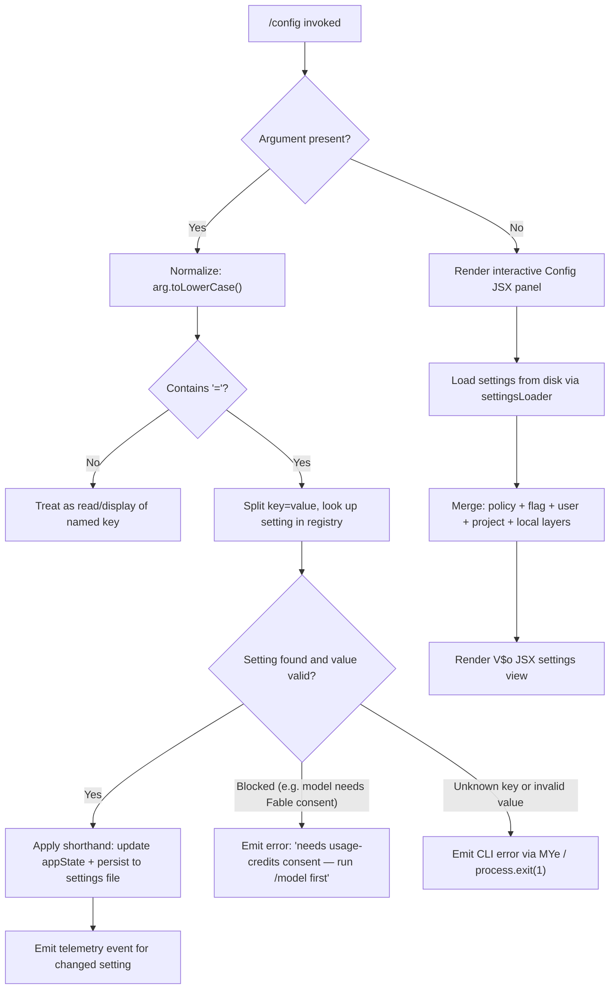

# `/config`

> Analysis basis: CC v2.1.196 bundle.js (AST extraction + Claude interpretation)
> Minimum version: v2.1.196

---

## Overview

The `/config` command (also accessible as `/settings`) opens an interactive settings panel where users can browse and toggle a comprehensive set of Claude Code preferences. When invoked with a `key=value` argument, it applies a configuration shorthand directly rather than opening the interactive UI. The command renders a JSX component (identified as the `Config` panel) and dispatches changes through the application state layer and persistent settings files.

---

## Registration

| Field | Value |
|---|---|
| type | `local-jsx` |
| name | `config` |
| description | `Open settings` |
| aliases | `["settings"]` |
| argumentHint | `[key=value]` |
| module_id | `x2l` |
| load_inline | `true` |
| loc_byte | `11819948` |
| loc_byte_end | `11820226` |
| loc_line | `7541` |
| arbor_handler.name | `N$f` |
| arbor_handler.fqn | `claude-2.1.196::N$f` |
| arbor_handler.kind | `AsyncFunction` |
| arbor_handler.resolution_path | `module_id` |
| arbor_handler.n_hits | `0` |

Analysis basis: CC v2.1.196 bundle.js:+11819948

---

## Input Branching

The command has four distinct branches based on the presence and structure of its argument:



Analysis basis: CC v2.1.196 bundle.js:+11819020 (JSX render), +11819081 (toLowerCase), +11819100 (includes `=`), +11819210 (ZJt settings loader dispatch)

---

## Behavioral Spec

### 1. Handler Entry Point (`configCommandHandler` / `N$f`)

```
async function configCommandHandler(args, context):
    renderTarget = createJSXElement("Config")           // GFo.jsx
    normalizedArg = args.trim().toLowerCase()

    if normalizedArg contains "=":
        applyShorthandConfig(normalizedArg, context)
    elif normalizedArg is non-empty:
        displaySingleKey(normalizedArg, context)
    else:
        openSettingsPanel(context)
```

Analysis basis: CC v2.1.196 bundle.js:+11819020, +11819081, +11819100, +11819116

---

### 2. Shorthand Config Application (`applyShorthandConfig`)

```
function applyShorthandConfig(rawArg, context):
    [key, value] = parseKeyValue(rawArg)               // XJt parser

    // Special-case: model key requires consent check
    if key == "model":
        if fableConsentMissing():
            emitError("needs usage-credits consent — run /model first")
            // telemetry: tengu_config_model_changed not fired
            return
        updateModelInAppState(value)
        emitTelemetry("tengu_config_model_changed")
        return

    settingDef = lookupSettingDefinition(key)
    if settingDef is null:
        emitCLIError("unknown config key")             // MYe → console.error + It.red
        exitProcess(1)                                 // vs → process.exit(1)
        return

    if settingDef.type == "enum" and value not in settingDef.values:
        emitCLIError("invalid value for enum setting")
        exitProcess(1)
        return

    applySettingToAppState(settingDef, value, context)
    persistSettingsLayer(context)                       // uI → Mae.writeFileSync
    emitTelemetryForSetting(settingDef)
```

Analysis basis: CC v2.1.196 bundle.js:+11819133 (value parsing via `e`), +11819210 (ZJt dispatch), +13489040 (MYe error), +13489063 (process.exit), +11819252 (XJt key/value split logic)

---

### 3. Settings Layer Loading (`settingsLoader` / `ZJt` → `uAt`)

The settings system loads and merges configuration from multiple layers in priority order:

```
function loadAllSettingsLayers():
    layers = {
        policySettings:  loadFromDisk("policySettings"),
        flagSettings:    loadFromDisk("flagSettings"),
        userSettings:    loadFromDisk("userSettings"),      // ~/.claude/settings.json
        projectSettings: loadFromDisk("projectSettings"),
        localSettings:   loadFromDisk("localSettings"),     // .claude/settings.local.json
    }

    for each layer:
        if file missing (ENOENT): use empty defaults
        if parse error: auto-repair from cached config under lock
            emitTelemetry("tengu_config_auto_repaired")

    mergedConfig = deepMerge(layers, priorityOrder)
    cacheResult()
    return mergedConfig
```

File paths resolved (Analysis basis: CC v2.1.196 bundle.js:+1330000):
- Global user settings: `~/.claude/settings.json`
- Local project settings: `.claude/settings.local.json`

Settings load instrumented with span markers `loadSettingsFromDisk_start` / `loadSettingsFromDisk_end` (bundle.js:+1347210, +1347266).

---

### 4. Interactive Settings Panel (`settingsPanelView` / `V$o`)

The interactive panel, rendered when no argument is supplied, presents settings grouped by category. It reads current `appState`, computes effective values per setting, and registers change callbacks:

```
function settingsPanelView(appState, dispatcher):
    currentSettings = appState.getAppState()
    settingRows = buildSettingRows(currentSettings)

    // Each row is one of: boolean toggle, enum selector, freetext input
    for row in settingRows:
        renderRow(row)
        on change:
            applyChange(row.key, newValue, appState)
            appState.setAppState(updatedState)
            persistToSettingsLayer(row.layer)
            emitTelemetry(row.telemetryEvent)

    // Workflow / artifact enable/disable handled via policy flags
    // (disableWorkflows / enableWorkflows / disableArtifact)
```

Analysis basis: CC v2.1.196 bundle.js:+11620304 (getAppState), +11621323 (setAppState), +11621368 (bw → persist)

---

### 5. Key/Value Argument Parser (`argParser` / `XJt`)

```
function parseConfigArg(rawArg):
    trimmed = rawArg.trim()
    if "=" not in trimmed:
        return { key: trimmed, value: null }

    eqIndex = trimmed.indexOf("=")
    key   = trimmed.slice(0, eqIndex)
    rest  = trimmed.slice(eqIndex + 1)

    // Handle comma-separated or multi-value (array) forms
    if rest includes ",":
        values = rest.split(",").map(v => v.trim())
    else:
        values = rest

    // Validate known boolean shorthand ("true|false" accepted)
    return { key: key.toLowerCase(), value: values }
```

Analysis basis: CC v2.1.196 bundle.js:+11617163 (trim), +11617214 (split), +11617270 (indexOf), +11617287, +11617431 (push), +11619089 (`"true|false"` literal), +11619165 (`"<value>"` literal)

---

### 6. Persisting Settings (`settingsWriter` / `uI` via `vs`)

```
function writeSettingsLayer(layerPath, updatedData):
    serialized = joinParts(updatedData)                // qbr.join
    writeFileSync(layerPath, serialized)               // Mae.writeFileSync

    // On CLI error (bad key/value):
    if errorState:
        emitRedColorError(message)                     // It.red
        logToConsole(message)                          // console.error
        emitTelemetry("cli_error")                     // literal at +13489050
        process.exit(1)                                // exit code 1
```

Analysis basis: CC v2.1.196 bundle.js:+201820, +201838, +13488995, +13489009, +13489050, +13489063, +13489076

---

### 7. Settings Persistence with Lock (`saveConfigWithLock` / `Hn` → `ntn`)

When writing the global config file, a file lock prevents concurrent Claude instances from corrupting data:

```
function saveConfigWithLock(newConfig):
    acquireLock(timeout=60000ms)
    if lockContentionDetected:
        emitTelemetry("tengu_config_lock_contention")
        warn("Lock acquisition took longer than expected — another Claude instance may be running")

    reRead = readConfigFromDisk()

    if reRead has parse error:
        repairFromCache(cachedConfig)
        emitTelemetry("tengu_config_auto_repaired")
        // See GH #3117

    if reRead is missing auth fields that cache has:
        refuse write
        emitTelemetry("tengu_config_auth_loss_prevented")
        // See GH #3117

    if staleWrite detected:
        emitTelemetry("tengu_config_stale_write")

    writeAtomically(newConfig)                         // mkt → atomic rename
    releaseLock()
```

Backup rotation: keeps up to 5 backups with `.backup.` prefix; lock timeout: 60 000 ms; max backup count: 5 (bundle.js:+14158112, +14158367).

Analysis basis: CC v2.1.196 bundle.js:+14153628, +14156974, +14157448, +14157754, +14158112

---

### 8. Setting Definitions (Enumerated)

The following setting keys are confirmed by literals in the bundle. Each maps to a display label and a persistence key:

| Config Key | Display Label | Type | Values / Notes |
|---|---|---|---|
| `model` | `Model` | enum | `Default (recommended)`, shorthand names (sonnet, opus, etc.); `/model` preferred for specific IDs |
| `verbose` | `Verbose output` / `Verbose` | boolean | — |
| `tips` | `Show tips` | boolean | — |
| `reduceMotion` | `Reduce motion` | boolean | — |
| `thinking` | `Thinking mode` | boolean | — |
| `autoCompact` | `Auto-compact` | boolean | persists as `autoCompactEnabled` |
| `switchModelsOnFlag` | — | boolean | — |
| `promptSuggestionEnabled` | `Prompt suggestions` | boolean | — |
| `recap` | `Session recap` | boolean | — |
| `checkpoints` | `Rewind code (checkpoints)` | boolean | persists as `fileCheckpointingEnabled` |
| `workflows` | `Dynamic workflows` | boolean | persists as `workflowKeywordTriggerEnabled` |
| `artifacts` | `Artifacts` | boolean | — |
| `progressBar` | `Terminal progress bar` | boolean | persists as `terminalProgressBarEnabled` |
| `showStatusInTerminalTab` | `Show status in terminal tab` | boolean | — |
| `turnDuration` | `Show turn duration` | boolean | persists as `showTurnDuration` |
| `precomputeCompactionEnabled` | `Precompute compaction` | boolean | — |
| `timestamps` | `Show message timestamps` | boolean | persists as `showMessageTimestamps` |
| `permissionMode` | `Default permission mode` | enum | `default`, `plan`, `bypassPermissions`, `auto` |
| `worktreeBaseRef` | `Worktree base ref` | enum | `fresh`, `head` |
| `useAutoModeDuringPlan` | `Use auto mode during plan` | boolean | — |
| `gitignore` | `Respect .gitignore in file picker` | boolean | — |
| `copyFullResponse` | `Skip the /copy picker` | boolean | — |
| `copyOnSelect` | `Copy on select` | boolean | — |
| `autoScroll` | `Auto-scroll` | boolean | persists as `autoScrollEnabled` |
| `agentsView` | `Agents view` | boolean | persists as `defaultToAgentsView` |
| `leftArrowOpensAgents` | — | boolean | — |
| `autoUpdatesChannel` | `Auto-update channel` | enum | `rc`, `slow`, `latest` |
| `theme` | `Theme` | enum | named themes; `/theme` for custom |
| `notifChannel` | `Notifications` | enum | `terminal_bell`, `iterm2_with_bell`, `notifications_disabled`, plus push variants |
| `outputStyle` | `Output style` | enum | custom styles via `/config` |
| `defaultView` | `Default view` | enum | `transcript`, `chat` |
| `language` | `Language` | freetext | language name or ISO code; `default` for English |
| `editor` | `Editor mode` | enum | `emacs`, `normal`, `vim`; persists as `editorMode` |
| `externalEditorContext` | `Show last response in external editor` | boolean | — |
| `prStatus` | `Show PR status footer` | boolean | — |
| `diffTool` | `Diff tool` | enum | `terminal` and others |
| `autoConnectIde` | `Auto-connect to IDE (external terminal)` | boolean | — |
| `autoInstallIdeExtension` | `Auto-install IDE extension` | boolean | — |
| `chrome` | `Claude in Chrome` | boolean | — |
| `teammateMode` | `Teammate mode` | enum | `tmux`, `iterm2`, `in-process` |
| `teammateDefaultModel` | `Default teammate model` | enum | — |
| `remoteControl` | `Enable Remote Control for all sessions` | boolean | persists as `remoteControlAtStartup` |
| `showExternalIncludesDialog` | `External CLAUDE.md includes` | boolean | — |
| `apiKey` | `Use custom API key` | freetext | masked display (last 20 chars) |

Analysis basis: CC v2.1.196 bundle.js:+11600833 through +11615454 (setting definition literals)

---

## State & Side Effects

| Item | Detail |
|---|---|
| Telemetry — model | `tengu_config_model_changed` (bundle.js:+11600513) |
| Telemetry — feature flags | `tengu_feature_ok` (+1028610), `tengu_feature_sad` (+1028758), `tengu_feature_bad` (+1028677) |
| Telemetry — push notif | `tengu_push_notif_pref_changed` (+11601289) |
| Telemetry — auto-compact | `tengu_auto_compact_setting_changed` (+11601727) |
| Telemetry — refusal fallback | `tengu_refusal_fallback_setting_changed` (+11601965) |
| Telemetry — tips | `tengu_tips_setting_changed` (+11602196) |
| Telemetry — reduce motion | `tengu_reduce_motion_setting_changed` (+11602494) |
| Telemetry — thinking | `tengu_thinking_toggled` (+11602715) |
| Telemetry — fast mode | `tengu_penguins_off` (+2287723), `tengu_chomp_inflection` (+11603156) |
| Telemetry — prompt suggestions | `tengu_sedge_lantern` (+11603390) |
| Telemetry — checkpoints | `tengu_file_history_snapshots_setting_changed` (+11603833) |
| Telemetry — session recap | `tengu_maple_sundial` (+11598359) |
| Telemetry — progress bar | `tengu_terminal_progress_bar_setting_changed` (+11605125) |
| Telemetry — terminal sidebar | `tengu_terminal_sidebar` (+11605192) |
| Telemetry — terminal tab status | `tengu_terminal_tab_status_setting_changed` (+11605440) |
| Telemetry — turn duration | `tengu_show_turn_duration_setting_changed` (+11605664) |
| Telemetry — sepia moth | `tengu_sepia_moth` (+11605728) |
| Telemetry — precompute compaction | `tengu_precompute_compaction_setting_changed` (+11605984) |
| Telemetry — silk hinge | `tengu_silk_hinge` (+11606055) |
| Telemetry — message timestamps | `tengu_show_message_timestamps_setting_changed` (+11606299) |
| Telemetry — gitignore | `tengu_respect_gitignore_setting_changed` (+11607990) |
| Telemetry — fullscreen | `tengu_amber_creek` (+3586565), `tengu_pewter_brook` (+3586472) |
| Telemetry — push notifications | `tengu_kairos_input_needed_push` (+5118673), `tengu_kairos_push_notifications` (+5118610) |
| Telemetry — default view | `tengu_default_view_setting_changed` (+11610885) |
| Telemetry — editor mode | `tengu_editor_mode_changed` (+11611474) |
| Telemetry — external editor | `tengu_external_editor_context_changed` (+11611789) |
| Telemetry — PR status | `tengu_pr_status_footer_setting_changed` (+11612103) |
| Telemetry — diff tool | `tengu_diff_tool_changed` (+11612676) |
| Telemetry — auto-connect IDE | `tengu_auto_connect_ide_changed` (+11612948) |
| Telemetry — IDE extension | `tengu_auto_install_ide_extension_changed` (+11613252) |
| Telemetry — Chrome | `tengu_claude_in_chrome_setting_changed` (+11613588) |
| Telemetry — agent teams | `tengu_amber_flint` (+7276157) |
| Telemetry — teammate mode | `tengu_teammate_mode_changed` (+11613984) |
| Telemetry — CCR bridge | `tengu_ccr_bridge` (+14138997) |
| Telemetry — cobalt plinth | `tengu_cobalt_plinth` (+5157913) |
| Telemetry — auto mode config | `tengu_auto_mode_config` (+14015955) |
| Telemetry — config lock | `tengu_config_lock_contention` (+14157063), `tengu_config_stale_write` (+14157199), `tengu_config_auto_repaired` (+14157576), `tengu_config_auth_loss_prevented` (+14157906), `tengu_config_fallback_write` (+14156679) |
| Telemetry — daemon | `tengu_daemon_config_reload` (+18010884), `tengu_daemon_idle_exit` (+18016355), `tengu_daemon_yield` (+18015313) |
| Telemetry — bg workers | `tengu_bg_retire_pinned_low_mem` (+17998722), `tengu_bg_prewarm_per_sweep` (+17998847) |
| appState changes | `setAppState` called on every setting toggle (bundle.js:+11621323) |
| File writes | `~/.claude/settings.json` (user layer), `.claude/settings.local.json` (local layer) via atomic write with lock |
| Process exit | `process.exit(1)` on invalid key or value in shorthand mode (bundle.js:+13489063) |
| Hook registration | Daemon config-reload event emitted via `Gtt.emit` (bundle.js:+1350855) |
| Cache invalidation | `Hin.clear` and `Qyr.clear` called on settings mutation (bundle.js:+29196, +29208) |

---

## Version History

| Version | Change |
|---|---|
| v2.1.196 | Initial analysis |

---

## Common Mistakes

1. **Using `/config model=<id>` for a specific model ID** — the shorthand `model=` only accepts the predefined aliases (sonnet, opus, haiku, etc.). For arbitrary model IDs, use `/model` instead. The bundle explicitly emits `"For a specific model ID, use /model."` (bundle.js:+11612271).

2. **Omitting the `=` sign** — passing `/config verbose` without `=value` is treated as a key-display or no-op path, not a toggle. Use `/config verbose=true` or `/config verbose=false` (accepted boolean literals: `"true|false"` per bundle.js:+11619089).

3. **Attempting to set `model` to a Fable/usage-credits model without prior consent** — the handler emits `"needs usage-credits consent — run /model first"` and blocks the shorthand (bundle.js:+11612431).

4. **Expecting `/config` changes to apply to all layers simultaneously** — settings are persisted only to the appropriate layer (user vs. local). Project-level and policy-level settings can only be changed by editing the respective files directly.

5. **Running two Claude Code instances concurrently while editing config** — the file-lock timeout is 60 000 ms (bundle.js:+14158112), but contention is logged as `tengu_config_lock_contention`. Auth loss protection will refuse a write if the re-read config is missing credentials present in the cache (bundle.js:+14157754).

---

## Appendix — Identifier Mapping

> For bundle debugging only. Identifiers change across versions.

| Identifier | Role |
|---|---|
| `N$f` | Main command handler (`configCommandHandler`) — Arbor-resolved AsyncFunction |
| `ZJt` | Settings loader dispatcher; calls `uAt` and `V$o` |
| `uAt` | Core settings panel component / settings registry builder |
| `V$o` | Interactive settings JSX view (reads/writes appState) |
| `XJt` | Key=value argument parser |
| `vs` | CLI error emitter (wraps `MYe` + `process.exit`) |
| `MYe` | Error formatter (calls `console.error` + `It.red`) |
| `uI` | Low-level file writer (`Mae.writeFileSync` + `qbr.join`) |
| `no` | Settings loader (reads all layers, merges, caches) |
| `O8` | Settings load span instrumenter (`loadSettingsFromDisk_start/end`) |
| `Hn` | Global config save with fallback logic |
| `ntn` | Config save with file lock and backup rotation |
| `Tdr` | Atomic config writer (uses `mkt`) |
| `mkt` | Atomic file write helper (temp file + rename) |
| `Gvs` | Gitignore-aware file tracker (settings side effect) |
| `X5` | Path resolver for `.claude/settings.json` |
| `n_` | Cache-clear utility (`Hin.clear`, `Qyr.clear`) |
| `MMr` | Settings cache updater (`Qmn.set` + `Date.now`) |
| `VBe` | Settings validator (calls `I3`) |
| `I3` | Full settings schema / merged config builder |
| `ENe` | Model shorthand resolver (opus-4-6, sonnet-4-6, etc.) |
| `SZ` | Settings schema builder (calls `ib`, `jo`, `V9t`) |
| `jo` | Individual setting definition constructor |
| `ib` | Base setting entry builder |
| `uT` | Setting type descriptors (enum/boolean/freetext) |
| `ig` | Fast-mode availability checker |
| `Ble` | Fast-mode toggle handler |
| `tx` | Fast-mode setting row builder |
| `VUl` | Setting list renderer / filter |
| `k$o` | Model setting filter helper |
| `M$o` | Model enum option builder |
| `Fa` | Notification channel option builder |
| `Kle` | Setting row renderer |
| `s1f` | Notification preference patch sender |
| `N$o` | Notification settings section builder |
| `BUl` | Notification section sub-builder |
| `kr` | App-state reader helper (calls `O8`) |
| `cAt` | Persisted settings accessor |
| `pc` | Project settings path/loader (legacy global config) |
| `sT` | Policy settings helper |
| `Awe` | Workspace settings path resolver |
| `vRn` | Workflow flag handler (allow_workflows) |
| `KFi` | Workflow permission applicator |
| `S9t` | Artifact settings section |
| `Ela` | Artifact enable helper |
| `Ala` | Artifact setting applicator |
| `y9t` | Artifact entry builder |
| `ANe` | Agent-mode config helper |
| `l7e` | Auto-mode sub-section builder |
| `hVo` | Auto-mode entry builder |
| `gde` | Kairos push notification handler |
| `zi` | Traffic mode checker (essential-traffic / no-telemetry) |
| `Fbs` | Traffic mode flag reader |
| `KS` | Vendor capability checker |
| `aje` | IDE connection status checker |
| `LAe` | Auto-updater section builder |
| `Ket` | Auto-update channel applicator |
| `D3` | Setting display group builder |
| `Jbn` | Setting group entry constructor |
| `SH` | Setting header/label builder |
| `lrr` | Setting renderer router |
| `Ozt` | Setting render helper |
| `Mv` | CCR bridge section builder |
| `j2` | CCR bridge toggle handler |
| `Bqe` | CCR bridge availability checker |
| `sme` | Daemon config-reload section |
| `bdr` | Daemon config sub-handler |
| `eo` | App event bus / emitter base |
| `ll` | Agent-teams toggle handler |
| `XOp` | Agent-teams availability checker |
| `yHo` | Teammate mode section builder |
| `EHo` | Teammate mode render helper |
| `Pzt` | Teammate mode applicator |
| `HWt` | Permission mode section builder |
| `Lj` | Permission mode entry builder |
| `EVo` | Permission mode option constructor |
| `mIe` | Permission rules section builder |
| `$s` | Fullscreen setting handler |
| `MP` | Fullscreen availability checker |
| `iD` | Fullscreen PLi flag checker |
| `tXr` | Fullscreen color formatter |
| `Vne` | Fullscreen disabled-reason builder |
| `eXr` | Fullscreen toggle entry builder |
| `ax` | App-state patch helper |
| `Fit` | App-state patch dispatcher |
| `C1e` | Combined patch + side-effect helper |
| `fc` | Safe-mode / bare-mode flag reader |
| `Rl` | Safe-mode flag reader |
| `Hd` | Bare-mode flag reader |
| `U6` | Setting key prefix stripper |
| `OUn` | Kairos notification row builder |
| `nhe` | Setting list empty-state handler |
| `Oe` | UI primitive (shared) |
| `qe` | UI primitive (shared) |
| `hF` | API key masker (last 20 chars) |
| `A$n` | Switch-models-on-flag handler |
| `_X` | Switch-models helper |
| `dN` | Notification platform filter |
| `Ltt` | Notification label formatter |
| `JL` | Notification sub-section builder |
| `hgn` | Notification channel entry builder |
| `lAt` | Session-recap section entry |
| `SNe` | Session-recap toggle handler |
| `WUn` | Verbose output section entry |
| `E9t` | Verbose output toggle handler |
| `bYr` | Timestamps section builder |
| `TYr` | Timestamps entry builder |
| `c6` | Setting row style helper |
| `OLe` | Setting row layout helper |
| `N3e` | Setting type label renderer |
| `it` | React/Ink render primitive |
| `Dt` | Config persistence dispatcher |
| `ct` | String / color primitive |
| `uc` | UI text component |
| `Hr` | UI heading component |
| `Mi` | UI modal/panel component |
| `Ao` | UI layout container |
| `L` | Away-summary / session lifecycle handler |
| `w` | Session wakeup / re-entry handler |
| `hGt` | Away-summary generator |
| `_Kt` | Background task tracker |
| `vze` | Global NK store accessor |
| `tkm` | Context builder (system messages) |
| `UOc` | Message-at accessor |
| `$Oc` | Context compaction helper |
| `qfc` | UUID generator (randomUUID) |
| `Ike` | Loop-wakeup pending checker |
| `M` | OAuth / MCP server handler (large, unrelated to config UI) |
| `O` | Background worker pool manager |
| `k` | File watcher manager |
| `x` | Cookie/session key splitter |
| `A` | OAuth userinfo fetcher |
| `I` | Scroll/input event handler |
| `U` | Rate-limit event dispatcher |
| `D` | Background worker write forwarder |
| `j` | Daemon write queue |
| `d` | Daemon supervisor channel |
| `P` | Daemon process handle |
| `Rt` | g0 wrapper (shared utility) |
| `gF` | Notification count accessor |
| `eV` | Setting entry event emitter |
| `y2` | Model tier resolver |
| `XEe` | Model display-name builder |
| `Ede` | Model capability checker |
| `EH` | zHe wrapper (color helper) |
| `zHe` | Terminal color string builder |
| `JHe` | Pro-tier indicator |
| `Lg` | Config directory locator |
| `CDr` | Config file path builder |
| `Sn` | ENOENT handler |
| `T` | Log-level filter / debug formatter |
| `Re` | Error reporter (logError) |
| `Gvs` | Gitignore-file writer |
| `dr` | g0 wrapper |
| `xe` | Feature-ok state reader |
| `wt` | Feature-sad state reader |
| `ke` | Feature-bad state reader |
| `Me` | JSON.stringify wrapper |
| `n_` | Dual-cache clear helper |
| `$n` | Shared constant/token |
| `qt` | Config existence checker |
| `Ua` | Settings merge helper |
| `V` | Shared React/Ink primitive |
| `Aae` | App state initializer |

Note: index built via Arbor fallback; some signals (telemetry, literals) may be missing — see arbor-fallback.js.