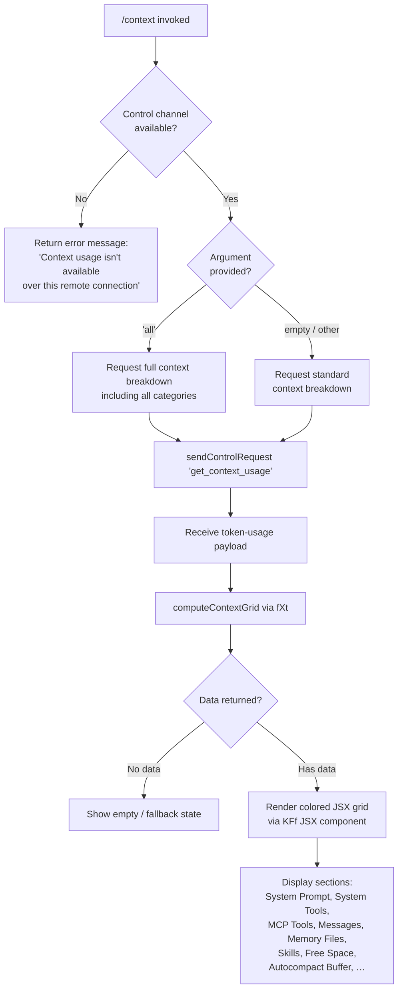

# `/context`

> Analysis basis: CC v2.1.196 bundle.js (AST extraction + Claude interpretation)
> Minimum version: v2.1.196

---

## Overview

The `/context` command visualizes the current session's context-window usage as a colored grid displayed in the terminal. It dispatches a control request over the active session's control channel to retrieve live token-usage data, then renders a grid broken down by category (system prompt, tools, messages, free space, autocompact buffer, etc.) with percentage and absolute token counts.

---

## Registration

| Field | Value |
|---|---|
| type | `local-jsx` |
| name | `context` |
| description | `Visualize current context usage as a colored grid` |
| argumentHint | `[all]` |
| thinClientDispatch | `control-request` |
| module_id | `Z2l` |
| load_inline | `true` |
| loc_byte | `11839197` |
| loc_byte_end | `11839423` |
| loc_line | `7578` |
| arbor_handler.name | `IFf` |
| arbor_handler.fqn | `claude-2.1.196::IFf` |
| arbor_handler.kind | `AsyncFunction` |
| arbor_handler.resolution_path | `module_id` |
| arbor_handler.n_hits | `0` |

Analysis basis: CC v2.1.196 bundle.js:+11839197

---

## Input Branching

The command has 3+ distinct branches depending on the optional `[all]` argument and session connectivity state.



---

## Behavioral Spec

### 1. Handler Entry — `IFf` (async)

```
async function contextCommandHandler(args, sessionContext):
    rawArg = args.trim()                          // n.trim @ +11837801
    showAll = (rawArg === "all")                  // literal "all" @ +11837826

    controlChannelId = resolveControlChannel(sessionContext)   // ed/Z1 @ +11837834, +11837849
                                                               // literal "controlChannel" @ +11837852

    if controlChannelId is absent or remote-only:
        return earlyError("Context usage isn't available over this remote connection")
        // literal @ +11837879
```

Analysis basis: CC v2.1.196 bundle.js:+11837795

### 2. Control Request Dispatch

```
function dispatchContextRequest(controlChannelId, showAll):
    payload = buildControlPayload(
        type  = "get_context_usage",    // literal @ +11837991
        flags = { all: showAll }
    )
    response = await sessionContext.sendControlRequest(payload)
    // o.sendControlRequest @ +11837961
    return response
```

The `thinClientDispatch` registration field confirms this is routed as a `control-request`, meaning thin-client environments forward the request without executing it locally.

Analysis basis: CC v2.1.196 bundle.js:+11837961

### 3. Context Grid Computation — `fXt`

```
function computeContextGrid(usagePayload, options):
    // Filter categories
    categories = usagePayload.filter(...)           // n.filter @ +11835898
    freeSpaceEntry  = find("Free space")            // literal @ +11835933
    autoCompactEntry = find("Autocompact buffer")   // literal @ +11835956

    // System-prompt boundary
    compactBoundary = lookupCompactBoundary(options)
    // literal "compact_boundary" @ +14096694

    // Locate system-prompt section, tool sections, message section
    systemPromptEntry = find category labelled "System Prompt"   // literal @ +11184653
    systemToolsEntry  = find category labelled "System tools"    // literal @ +11184734
    mcpToolsEntry     = find category labelled "MCP tools"       // literal @ +11184799
    messagesEntry     = find category labelled "Messages"        // literal @ +11185597
    memoryFilesEntry  = find category labelled "Memory files"    // literal @ +11185117
    skillsEntry       = find category labelled "Skills"          // literal @ +11185179

    // Percentage label helpers
    percentLabel = computePercentLabel(tokenCount, totalTokens)
    // Nae / Math.round @ +11837633; threshold "< 20" @ +223276

    return gridData {
        entries: [...sorted categories with token counts and colors],
        total:   totalContextTokens,
        used:    usedTokens,
    }
```

Analysis basis: CC v2.1.196 bundle.js:+11838121

### 4. Percentage Label Helper — `Nae`

```
function computePercentLabel(count, total):
    pct = Math.round((count / total) * 100)    // Math.round @ +223296
    if pct < 20:
        return "< 20"                          // literal @ +223276
    formatted = formatLocale(pct, "en-US", "compact")
    // literals "en-US" @ +225251, "compact" @ +225269
    suffix = ".0"                              // literal @ +223237
    return formatted + suffix
```

Analysis basis: CC v2.1.196 bundle.js:+11837633

### 5. JSX Render — `bht` → `qV` → `KFf`

```
function renderContextGrid(gridData, showAll):
    // Attaches event listener on control-response stream
    controlStream.on(responseEvent, handler)    // bht: o.on @ +8413605

    // Renders via React/JSX elements
    jsx = buildJSXGrid(gridData)               // KFo.jsx @ +11838025
    // Inner component qV renders rows; neo/SVi.createElement @ +3994854

    // Per-row color coding (lre/VZr):
    for row in gridData.entries:
        color = chooseColor(row.percentUsed)   // iD + ct @ various
        renderRow(row.label, row.tokens, row.percent, color)

    return jsx
```

Analysis basis: CC v2.1.196 bundle.js:+11838021

### 6. Fullscreen / Terminal Environment Check — `$s`

`$s` (called from `IFf`) performs environment probes before rendering:

```
function checkTerminalEnvironment():
    isLocalAgent = detectLocalAgent()     // literal "local-agent" @ +3585826
    isTmuxCC = detectiTermTmux()
    // literals "iTerm.app" @ +3584945, "tmux" @ +3585038
    // tmux probe: spawnSync "display-message -p #{client_control_mode}"
    //   literals @ +3585255, +3585273, +3585278; timeout 2000ms @ +3585329

    if isTmuxCC:
        warn("fullscreen disabled: tmux -CC (iTerm2 integration mode) detected …")
        // literal @ +3586047

    isWindowsSSH = detectWindowsOverSSH()
    // literal "windows" @ +3585583
    if isWindowsSSH:
        warn("fullscreen disabled: Windows over SSH …")
        // literal @ +3586233

    // Fullscreen mode key: "fullscreen", default: "default"
    // literals @ +3586381, +3586407
```

Analysis basis: CC v2.1.196 bundle.js:+11837795

### 7. Compact Boundary Lookup — `TFf` → `PH`

```
function resolveCompactBoundary(options):
    slice = options.slice(...)                // PH: e.slice @ +14096847
    boundary = lookupKey("compact_boundary") // Unr/_E @ +14096824; literal @ +14096694
    return boundary
```

Analysis basis: CC v2.1.196 bundle.js:+11838294

### 8. 80 % Threshold Gate — `Etr`

The main rendering pipeline (`Etr`) applies a threshold check:

```
const CONTEXT_WARN_THRESHOLD = 80   // literal @ +11838327
if usedPercent >= CONTEXT_WARN_THRESHOLD:
    applyWarningStyle(row)          // color coded "warning" @ +11185203
```

Analysis basis: CC v2.1.196 bundle.js:+11838344

---

## State & Side Effects

| Item | Detail |
|---|---|
| Telemetry | `tengu_amber_creek` (+3586565), `tengu_pewter_brook` (+3586472), `tengu_marlin_porch` (+3964550), `tengu_native_cursor` (+3964901), `tengu_silent_harbor` (+13874716), `tengu_slate_harrier` (+13883550) |
| Control request | Sends `get_context_usage` message over the session's control channel (`o.sendControlRequest`) |
| Hook registration | `vi` → `fis.register` (+68542) — registers a cleanup/dispose hook |
| Terminal probe | Spawns `tmux display-message` synchronously (timeout 2 000 ms) to detect iTerm2 CC mode |
| appState changes | None confirmed at depth-2 traversal |
| Sound | None |
| JSX rendering | Produces a colored grid React component displayed inline in the REPL; colors vary per usage band |

---

## Version History

| Version | Change |
|---|---|
| v2.1.196 | Initial analysis |

---

## Common Mistakes

1. **Running over a remote/thin-client connection** — the command returns the static error "Context usage isn't available over this remote connection" because `sendControlRequest` requires a live local control channel.
2. **Expecting `/context all` to increase the token budget** — the `[all]` flag only expands the display to show all categories; it does not change the context window or auto-compact behavior.
3. **Misreading percentage labels** — values below 20 % are displayed as `< 20` rather than a precise integer; this is intentional display rounding.
4. **Confusing the 80 % color shift for an error** — the warning color applied at ≥ 80 % usage is informational; it does not block further work or trigger auto-compaction automatically.
5. **Using the command inside a tmux -CC (iTerm2 integration) session and expecting fullscreen** — the implementation explicitly disables fullscreen in that environment and prints an informational notice instead.

---

## Appendix — Identifier Mapping

> For bundle debugging only. Identifiers change across versions.

| Identifier | Role |
|---|---|
| `IFf` | Main async handler for `/context` command |
| `$s` | Terminal environment probe / fullscreen eligibility check |
| `fXt` | Context grid computation (token breakdown per category) |
| `Nae` | Percentage label formatter (rounds, applies "< 20" threshold) |
| `bht` | Control-stream event attachment and JSX trigger |
| `qV` | Inner JSX grid builder (row-level rendering) |
| `lre` | Row renderer — normal bands |
| `VZr` | Row renderer — alternate/highlighted bands |
| `Z0e` | Context data accessor feeding row renderers |
| `neo` | JSX element factory shim (`SVi.createElement` wrapper) |
| `TFf` | Compact-boundary resolver entry point |
| `PH` | Compact-boundary slice/lookup implementation |
| `Unr` | Compact-boundary key resolver (`_E` helper) |
| `Etr` | Full rendering pipeline (80 % threshold gate, category assembly) |
| `tXr` | Terminal color/string conversion helper |
| `ct` | Core string-to-display converter (`String` wrapper) |
| `Vne` | Terminal capability probe (calls `l4d`) |
| `l4d` | Background/foreground detection; spawns tmux probe |
| `a4d` | Prefix filter (`e.startsWith`) for terminal strings |
| `Vve` | Color-capability test (`QNu`, `e.includes`, `amn`) |
| `eXr` | Fullscreen eligibility result builder (`jt`, `Boolean`) |
| `kr` | Settings loader (calls `O8`, telemetry, memory) |
| `O8` | Settings disk-load orchestrator (`vDr`, `I3`, `_in`) |
| `c4d` | Context grid dispatch wrapper (calls `it`) |
| `it` | Token-map accessor (`C$t`, `v$t`, `P6`, `iRn`, `Dt`) |
| `iRn` | Token map lookup with dedup set (`z7r`, `t0e`) |
| `Dt` | Token counter / date-stamped entry builder |
| `ed` | Control-channel resolver (calls `$Fe`) |
| `Z1` | Secondary control-channel resolver |
| `oeu` | Log-file writer pipeline (append, rotate, mkdir) |
| `vi` | Hook registration (`fis.register`) |
| `MP` | IPu set membership check |
| `iD` | Feature-flag enablement check (`PLi.isEnabled`) |
| `T` | Debug/log formatter (JSON.stringify, uppercase, redact) |
| `Pc` | Path formatter (`Zls`, `e.replace`, `r.at`, `n.lastIndexOf`) |
| `KQe` | Write helper (`Gls`, `e.write`) |
| `SQe` | Buffered timer flush (`clearTimeout`, `setTimeout`, `setImmediate`) |
| `bhe` | Batch header writer (`XQe`, `Ahe.join`, `Zn`, `Rt`) |
| `yl` | Locale number formatter |
| `ru` | Locale formatting helper (`deu`) |
| `oHe` | Category ordering helper |
| `he` | String coercion helper (`String`) |
| `_E` | Compact-boundary key lookup target |
| `ok` | Token/model parsing orchestrator |
| `d6` | Model-string decomposer (`r_`, `n3`, `es`, `Fa`) |
| `Fa` | Full model-string parser with many sub-parsers |
| `uT` | Model-tier resolver (`zHe`, `JHe`, `Hr`, `Ao`, `Mi`) |
| `Hr` | Provider/route classifier (`Rm`, `ct`) |
| `Mi` | Model capability check (`uBr`, `cBr`, `aE`, `Vs`) |
| `zk` | System-prompt assembly pipeline (very wide fan-out) |
| `Ot` | Async store accessor (`tmn`, `dr`) |
| `dr` | Low-level store getter (`g0`) |
| `Ytr` | Tool listing helper (`mAt`, `Object.values`, `T`) |
| `Uxe` | Tool search / `kqr` wrapper |
| `kqr` | Tool query executor (`vr`, `QDd`, `io`, `Ts`, `it`, `P0`) |
| `xam` | Prompt block injector (`io`, `$_e`, `wam`, `Lam`) |
| `Lam` | Brief-mode prompt builder (`$_e`, `v8o.isBriefEnabled`, `Uxe`) |
| `M8o` | Tool block assembler (`io`, `ct`, `_l`, `hh`, `it`) |
| `clm` | Tool block clone helper (calls `M8o`) |
| `qam` | Orchestrated model/agent prompt builder |
| `Vam` | Variant prompt picker (`pX`) |
| `pX` | Prompt variant selector (`vla`) |
| `OK` | Flat-map message normalizer |
| `tlm` | Tool-listing message builder (`fh`, `x8o`, `Udc`) |
| `fh` | Tool-header builder (`Hr`, `io`, `gHd.get`, `jP`) |
| `x8o` | Tool-signature builder (`jP`, `io`) |
| `elm` | Environment-info block builder (OS, shell, git) |
| `k8o` | OS-info collector (`WYe.version`, `.release`, `.type`) |
| `R8o` | Shell detector (`e.includes`, `bu`, `mU`) |
| `NYn` | Scratchpad/notification block injector |
| `slm` | Brief-mode gate check (`v8o.isBriefEnabled`) |
| `llm` | Language-style block builder (`vr`, `fn`, `rat`) |
| `Yam` | Agent-identity block builder (`ct`, `it`, `T`) |
| `Oam` | Option-parsing block (`P0`, `e.trim`, `V`, `it`) |
| `Nam` | Namespace block builder (`it`, `$_e`) |
| `iFt` | Memory-load pipeline (reads memory files, builds prompt) |
| `au` | Memory directory resolver (`$M`, `Rl`, `ct`, `_l`, `dRn`, `kr`) |
| `A0e` | Memory directory creator (`qt`, `t.mkdir`, `rn`, `T`, `String`) |
| `eue` | Memory file stat helper (`qt`, `i.isFile`, `i.isDirectory`, `V`) |
| `nBi` | Memory batch loader (`Xce`, `T`, `he`, `t.filter`, `Promise.allSettled`) |
| `P3d` | Memory index validator (`Xce`) |
| `sFt` | Memory path splitter/slicer |
| `Ak` | Memory block assembler (`au`, `it`) |
| `HT` | Memory heading builder (`cD.join`, `mm`) |
| `aBi` | Memory index builder (`nJr.join`, `l.push`, `l.join`) |
| `fBi` | Memory file formatter (many `.map` passes, `Z$t`) |
| `pBi` | Private memory block builder (`mm`, `HT`, `Z$t`) |
| `dJr` | Memory diff/reconciler (`Z$t`) |
| `_Bi` | Memory reload orchestrator (`HBi`, `dJr`) |
| `HBi` | Memory hot-reload helper (`au`, `Ak`, `hh`) |
| `yBi` | Agent memory loader (`HBi`, `iFt`, `mm`, `A0e`, `eue`, `qe`) |
| `Atr` | System-prompt builder entry (`Promise.all`, `nlm`, `yBi`, `I8o`, `NYn`) |
| `nlm` | Lightweight environment block (`Promise.all`, `gy`, `k8o`, `Ot`, `$m`) |
| `I8o` | System-prompt header slicer (`e.indexOf`, `e.slice`, `n.startsWith`) |
| `PRf` | Permission/rules file processor (`_b`, `DRf`, `Atr`, `MSt`) |
| `DRf` | Rules-file parser (`e.match`, `e.split`, `r.trim`, `n.slice`) |
| `MSt` | Message-set compiler (`TWe`, `T`, `he`, `Re`, `rNo`) |
| `TWe` | Message-category builder |
| `Re` | Error logger (`er`, `ct`, `zi`, `_Nu`, `zet.push`, `Ete.logError`) |
| `rNo` | Message renderer |
| `ORf` | Optional-rules builder (`Yce`, `N9t`, `QI`, `MSt`) |
| `Yce` | Claude-md feature check (`Boolean`, `fc`, `h0`) |
| `NRf` | Tool-result normalizer (`J1e`, `btr`, `y.has`, `h.add`) |
| `J1e` | Turn-level message assembler (`Promise.all`, `e.map`, `btr`, `MSt`, `T`) |
| `btr` | Block-level token builder (many sub-helpers) |
| `FRf` | Full rendering pass (`J1e`, `Ef`, `Me`, `y.prompt`, `c.reduce`) |
| `Ef` | Token estimator (`Math.round`) |
| `BRf` | Batch message renderer (`Promise.all`, `t.map`, `MSt`) |
| `URf` | Usage/retry flow (`Kio`, `Ot`, `sDl`, `J1e`) |
| `Kio` | Context-window limit resolver (`dv`, `oX`, `E5`) |
| `VRf` | Versioned render pipeline (`GRf`, `WRf`, `jRf`, `MSt`, `Ax`) |
| `GRf` | Grid-row builder (`Me`, `Ef`) |
| `WRf` | Windowed-row builder (`Ef`, `Me`, `n.get`) |
| `jRf` | Joined-row builder (`Me`, `Ef`) |
| `Ax` | Conversation-assembly engine (very large; normalizes messages, tools, attachments) |
| `Ltr` | Low-level transcript renderer (final output assembly) |
| `$Rf` | Retry / back-off orchestrator (`Nze`, `Oze`, `PW`, `xUn`, `sbe`) |
| `xUn` | Token-budget layout engine (sort, slice, map, reduce) |
| `PGe` | Priority-group sorter (`Number`, `Gio`, `Math.max`, `Math.floor`) |
| `UEe` | Usage estimator (`kr`) |
| `sbe` | Exponential back-off timer (`Dt`, `Date.now`, `Math.pow`, `Math.max`) |
| `L` | Away-summary gate (cache-age, rate-limit, draft checks) |
| `X` | Voice/UI interaction loop (recording, transcription, input handling) |
| `qre` | Context-window query + grid entry point (`Math.min`, `qut`, `hv`, `O9`) |
| `qut` | Context-query helper (`Nxe`, `_de`) |
| `Nxe` | Context token query (`io`, `qDd`, `Math.min`, `Fwi`) |
| `O9` | Context-data normalizer (`io`, `uy`, `nS`, `_de`, `Math.max`, `Math.min`, `Ppp`, `glo`, `Rqr`, `Mpp`) |
| `Ppp` | Token-entry validator (`hv`, `Number.isInteger`, `Array.isArray`, `Object.hasOwn`) |
| `glo` | Token-usage summarizer (`hv`, `vr`, `o$n`, `mlo`) |
| `mlo` | Token-count parser (`e.trim`, `t.endsWith`, `parseFloat`, `parseInt`, `Number.isFinite`, `Math.round`) |
| `Mpp` | Multi-part token-entry validator (`hv`, `Object.hasOwn`, `Eua`) |
| `Eua` | Array-typed token-entry validator (`Array.isArray`, `Mi`, `Object.hasOwn`, `Hua`) |
| `Wwi` | Integer token parser (`parseInt`, `isNaN`) |
| `Rqr` | Token-range resolver (`uQe`, `Wwi`, `jwi`) |
| `jwi` | Token-type dispatcher (`EH`, `tV`, `TF`, `tLn`, `io`, `jo`) |
| `nS` | Context-store reader (`Wwi`, `Rqr`, `jwi`) |
| `_de` | Context-entry int-parser (`parseInt`, `isNaN`, `T`) |
| `vr` | Display value formatter |
| `o$n` | Token-usage object creator (`it`) |
| `IW` | Agent system-prompt compiler (`Sc`, `XI`, `DO`, `eo`, `MHt`, `Th`, `V`, `Oe`, `qe`) |
| `XI` | Prompt-block header builder (`ct`, `OL`, `_a`) |
| `eo` | Module initializer / React-root bootstrapper |
| `Yut` | Usage-tracker entry (`Kre`) |
| `Kre` | Usage-set membership guard (`XGe.has`) |
| `wua` | Context-window assembly wrapper (`vua`, `e.slice`, `ZI`, `Ax`) |
| `vua` | Pre-assembly gate (`Kre`, `Ilo`) |
| `ZI` | System-block injector (`skf`) |
| `skf` | Skill-block builder (`Ske`, `Ltr`) |
| `ue` | MCP tool-list refresh handler (`Se.has`, `Se.add`, `ln`, `LD`, `V`, `qe`) |
| `ln` | MCP debug logger (`zet.push`, `Ete.logMCPDebug`) |
| `we` | MCP session state manager (connect, list, elicitation, memory) |
| `WPa` | MCP connection orchestrator (`Promise.allSettled`, `u.connect`, `GL`, `Vw`) |
| `Ue` | UI element splice handler (`we.findLastIndex`, `we.splice`, `Aen`) |
| `Aen` | Kc/hook notifier (`Kc`) |
| `Kc` | Hook-registration caller (`vi`) |
| `Ye` | Display-state manager (`Le.toggleQr`, `Le.logStatus`, `Le.refreshDisplay`) |
| `Le` | Display controller (`Ce.abort`) |
| `O` | Background-worker sweep (`Date.now`, `B.values`, `X.shiftGraceClocksForward`, `CYe`) |
| `Bac` | Background-attach telemetry (`it`) |
| `ycr` | Background-attach counter (`it`) |

---

Note: index built via Arbor fallback; some signals (telemetry, literals) may be missing — see arbor-fallback.js.